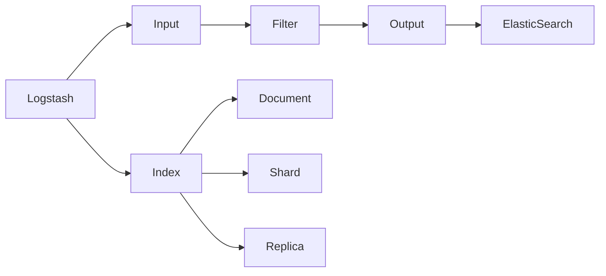

                 

### 背景介绍

ElasticSearch、Logstash 和 Kibana 被称为 ELK stack，是当今大数据领域非常流行的三个开源工具。ElasticSearch 是一款高性能的搜索引擎，Logstash 是一款强大的数据处理和日志收集工具，Kibana 则是一款功能丰富的数据可视化和分析工具。ELK stack 的出现，解决了传统日志管理系统中存在的诸多问题，如日志收集效率低下、日志处理能力不足、日志查询速度慢等。

本文将重点介绍 ElasticSearch 和 Logstash 的原理以及代码实例。通过对这两个工具的深入理解，读者可以更好地掌握大数据日志处理的基本技能，为后续的工作奠定坚实的基础。

首先，我们来简要回顾一下 ElasticSearch 和 Logstash 的背景知识。

#### ElasticSearch

ElasticSearch 是一款基于 Lucene 搜索引擎的分布式全文搜索引擎。它具有高性能、高可靠性、易扩展等特点，被广泛应用于日志搜索、实时分析、数据挖掘等领域。ElasticSearch 支持结构化数据、半结构化数据和非结构化数据的存储和查询，具有以下核心功能：

1. **全文搜索**：支持快速、高效的全文搜索功能，可实现模糊查询、范围查询等。
2. **实时分析**：支持实时聚合分析、过滤分析、关联分析等，为用户提供实时数据洞察。
3. **分布式架构**：支持水平扩展，可轻松应对海量数据的存储和查询需求。

#### Logstash

Logstash 是一款开源的数据处理和日志收集工具，主要用于从各种数据源（如文件、数据库、Web 日志等）收集数据，并将数据传输到 ElasticSearch 进行存储和分析。Logstash 具有以下核心功能：

1. **数据处理**：支持数据过滤、转换、归一化等操作，确保数据在传输过程中的一致性和准确性。
2. **日志收集**：支持从多种数据源（如 Apache 日志、Nginx 日志、JVM 日志等）收集日志，并支持多种日志格式。
3. **分布式架构**：支持水平扩展，可轻松应对大规模日志收集和传输需求。

接下来，我们将详细探讨 ElasticSearch 和 Logstash 的核心概念和原理，帮助读者深入理解这两个工具的工作机制。

----------------------

## 2. 核心概念与联系

### ElasticSearch

ElasticSearch 的核心概念包括：

1. **索引（Index）**：类似于关系型数据库中的表，是存储文档的地方。ElasticSearch 可以创建多个索引，每个索引都可以包含多个类型（Type）。
2. **文档（Document）**：是 ElasticSearch 中的数据存储单元，由一系列的字段（Field）组成。每个文档都是 JSON 格式的数据。
3. **分片（Shard）**：是 ElasticSearch 中的数据分片，一个索引可以包含多个分片，用于实现数据的水平扩展。
4. **副本（Replica）**：是分片的备份，用于提高数据的可靠性和查询性能。

### Logstash

Logstash 的核心概念包括：

1. **输入（Input）**：是 Logstash 从数据源收集数据的组件，如文件输入、数据库输入、Web 日志输入等。
2. **过滤器（Filter）**：是 Logstash 对输入数据进行处理和转换的组件，如日志格式转换、字段过滤、数据归一化等。
3. **输出（Output）**：是 Logstash 将处理后的数据发送到目标组件（如 ElasticSearch、Kibana 等）的组件。

### 架构关系

ElasticSearch 和 Logstash 的架构关系如图所示：



### 工作原理

1. **Logstash 工作原理**：

   - **输入**：Logstash 从各种数据源收集数据，如文件、数据库、Web 日志等。
   - **过滤**：对收集到的数据按照预设规则进行处理和转换，如日志格式转换、字段过滤、数据归一化等。
   - **输出**：将处理后的数据发送到 ElasticSearch 进行存储和分析。

2. **ElasticSearch 工作原理**：

   - **索引**：ElasticSearch 接收到 Logstash 发送的数据，将其存储到对应的索引中。
   - **分片和副本**：ElasticSearch 将索引数据分为多个分片和副本，以提高查询性能和数据可靠性。
   - **搜索和分析**：用户可以通过 ElasticSearch 提供的 API 进行数据搜索和分析，如全文搜索、实时分析等。

通过上述核心概念和架构关系的介绍，读者可以更好地理解 ElasticSearch 和 Logstash 的工作原理。接下来，我们将深入探讨 ElasticSearch 和 Logstash 的核心算法原理和具体操作步骤。

----------------------

## 3. 核心算法原理 & 具体操作步骤

### ElasticSearch

#### 核心算法

ElasticSearch 的核心算法主要基于 Lucene 搜索引擎，包括以下方面：

1. **倒排索引**：ElasticSearch 使用倒排索引来存储和检索数据。倒排索引将文档中的词语映射到文档的 ID，从而实现快速的全文搜索。
2. **分词器**：ElasticSearch 使用分词器将文本数据转换为词语，以便进行倒排索引的构建和搜索。
3. **查询解析**：ElasticSearch 根据用户输入的查询语句，将其转换为相应的查询解析器，如 Term 解析器、短语解析器、范围解析器等。

#### 具体操作步骤

1. **创建索引**：

   ```json
   PUT /my_index
   {
     "settings": {
       "number_of_shards": 2,
       "number_of_replicas": 1
     },
     "mappings": {
       "properties": {
         "title": {
           "type": "text",
           "analyzer": "ik_max_word"
         },
         "content": {
           "type": "text",
           "analyzer": "ik_max_word"
         }
       }
     }
   }
   ```

2. **添加文档**：

   ```json
   POST /my_index/_doc
   {
     "title": "ElasticSearch 原理与代码实例讲解",
     "content": "本文将介绍 ElasticSearch 和 Logstash 的原理以及代码实例。"
   }
   ```

3. **搜索文档**：

   ```json
   GET /my_index/_search
   {
     "query": {
       "match": {
         "content": "ElasticSearch"
       }
     }
   }
   ```

### Logstash

#### 核心算法

Logstash 的核心算法主要包括以下方面：

1. **数据解析**：Logstash 使用正则表达式、JSON 解析器等对输入的数据进行解析和提取。
2. **数据转换**：Logstash 使用 GROK 过滤器对解析后的数据进行转换和归一化。
3. **数据传输**：Logstash 使用 Elasticsearch 输出插件将处理后的数据发送到 ElasticSearch。

#### 具体操作步骤

1. **配置输入**：

   ```yaml
   input {
     file {
       path => "/path/to/logfile.log"
       type => "log"
     }
   }
   ```

2. **配置过滤器**：

   ```yaml
   filter {
     if [type] == "log" {
       grok {
         match => { "message" => "%{TIMESTAMP_ISO8601:timestamp}\t%{DATA:client}\t%{DATA:request}\t%{NUMBER:response_time}\t%{DATA:status}" }
       }
     }
   }
   ```

3. **配置输出**：

   ```yaml
   output {
     elasticsearch {
       hosts => ["localhost:9200"]
       index => "logstash-%{+YYYY.MM.dd}"
     }
   }
   ```

通过上述核心算法原理和具体操作步骤的介绍，读者可以更好地掌握 ElasticSearch 和 Logstash 的核心功能。接下来，我们将进一步探讨 ElasticSearch 和 Logstash 的数学模型和公式，帮助读者更深入地理解这两个工具。

----------------------

## 4. 数学模型和公式 & 详细讲解 & 举例说明

### ElasticSearch

#### 数学模型

1. **倒排索引**

   倒排索引是一种将文档中的词语映射到文档 ID 的数据结构。其数学模型可以表示为：

   $$ 
   inverted_index = \{ 
   (word, \{doc_id_1, doc_id_2, ..., doc_id_n\}) 
   \}
   $$

   其中，word 表示词语，doc_id 表示文档 ID。

2. **分词器**

   分词器将文本数据转换为词语。其数学模型可以表示为：

   $$ 
   tokenization = \{ 
   (text, \{token_1, token_2, ..., token_m\}) 
   \}
   $$

   其中，text 表示文本数据，token 表示词语。

3. **查询解析**

   查询解析器将用户输入的查询语句转换为相应的查询语法。其数学模型可以表示为：

   $$ 
   query_parsing = \{ 
   (query, \{word_1, word_2, ..., word_k\}) 
   \}
   $$

   其中，query 表示查询语句，word 表示词语。

#### 举例说明

假设有一个包含以下文档的索引：

```json
{
  "index": "my_index",
  "type": "document",
  "id": "1",
  "source": {
    "title": "ElasticSearch 原理与代码实例讲解",
    "content": "本文将介绍 ElasticSearch 和 Logstash 的原理以及代码实例。"
  }
}
```

1. **创建倒排索引**

   假设文档中的词语为 ["ElasticSearch", "原理", "与", "代码", "实例", "讲解"]，则倒排索引可以表示为：

   $$ 
   inverted_index = \{ 
   ("ElasticSearch", \{"1"\}), 
   ("原理", \{"1"\}), 
   ("与", \{"1"\}), 
   ("代码", \{"1"\}), 
   ("实例", \{"1"\}), 
   ("讲解", \{"1"\}) 
   \}
   $$

2. **分词器**

   将文档中的文本数据 "ElasticSearch 原理与代码实例讲解" 转换为词语，分词结果为 ["ElasticSearch", "原理", "与", "代码", "实例", "讲解"]。

3. **查询解析**

   假设用户输入的查询语句为 "ElasticSearch 原理"，则查询解析结果为 ["ElasticSearch", "原理"]。

### Logstash

#### 数学模型

1. **数据解析**

   数据解析器对输入的数据进行解析和提取。其数学模型可以表示为：

   $$ 
   data_parsing = \{ 
   (input_data, \{parsed_data_1, parsed_data_2, ..., parsed_data_n\}) 
   \}
   $$

   其中，input_data 表示输入数据，parsed_data 表示解析后的数据。

2. **数据转换**

   数据转换器对解析后的数据进行转换和归一化。其数学模型可以表示为：

   $$ 
   data_transformation = \{ 
   (parsed_data, \{normalized_data_1, normalized_data_2, ..., normalized_data_m\}) 
   \}
   $$

   其中，parsed_data 表示解析后的数据，normalized_data 表示归一化后的数据。

#### 举例说明

假设 Logstash 从一个 Web 日志文件中读取以下数据：

```
127.0.0.1 - - [10/Jul/2021:00:00:01 +0800] "GET /index.html HTTP/1.1" 200 342 "-" "Mozilla/5.0 (Windows NT 10.0; Win64; x64) AppleWebKit/537.36 (KHTML, like Gecko) Chrome/58.0.3029.110 Safari/537.3"
```

1. **数据解析**

   假设解析规则为：

   ```yaml
   grok {
     match => { "message" => "%{IP:client_ip}\t%{DATA:remote_user}\t%{DATA:remote_user}\t%{TIMESTAMP_ISO8601:timestamp}\t%{DATA:method}\t%{DATA:uri}\t%{DATA:version}\t%{NUMBER:status}\t%{NUMBER:body_size}\t%{DATA:http_referrer}\t%{DATA:http_user_agent}" }
   }
   ```

   则解析结果为：

   ```json
   {
     "client_ip": "127.0.0.1",
     "remote_user": "-",
     "timestamp": "2021-07-10T00:00:01+08:00",
     "method": "GET",
     "uri": "/index.html",
     "version": "HTTP/1.1",
     "status": 200,
     "body_size": 342,
     "http_referrer": "-",
     "http_user_agent": "Mozilla/5.0 (Windows NT 10.0; Win64; x64) AppleWebKit/537.36 (KHTML, like Gecko) Chrome/58.0.3029.110 Safari/537.3"
   }
   ```

2. **数据转换**

   假设转换规则为：

   ```yaml
   filter {
     if [type] == "log" {
       mutate {
         "timestamp" => "%{+YYYY.MM.dd}"
         "status" => "%{+d}"
         "body_size" => "%{+d}"
       }
     }
   }
   ```

   则转换结果为：

   ```json
   {
     "client_ip": "127.0.0.1",
     "remote_user": "-",
     "timestamp": "2021.07.10",
     "method": "GET",
     "uri": "/index.html",
     "version": "HTTP/1.1",
     "status": "200",
     "body_size": "342",
     "http_referrer": "-",
     "http_user_agent": "Mozilla/5.0 (Windows NT 10.0; Win64; x64) AppleWebKit/537.36 (KHTML, like Gecko) Chrome/58.0.3029.110 Safari/537.3"
   }
   ```

通过上述数学模型和公式以及举例说明，读者可以更好地理解 ElasticSearch 和 Logstash 的核心算法原理。接下来，我们将通过一个实际的项目实战，深入探讨如何使用 ElasticSearch 和 Logstash 进行大数据日志处理。

----------------------

### 5. 项目实战：代码实际案例和详细解释说明

#### 5.1 开发环境搭建

为了演示 ElasticSearch 和 Logstash 的应用，我们首先需要搭建一个完整的 ELK（ElasticSearch、Logstash、Kibana）环境。以下是搭建步骤：

1. **ElasticSearch**：

   - 下载 ElasticSearch 安装包：[https://www.elastic.co/downloads/elasticsearch](https://www.elastic.co/downloads/elasticsearch)
   - 解压安装包并运行 elasticsearch 二进制文件：

     ```bash
     ./elasticsearch
     ```

   - 启动成功后，访问 ElasticSearch 的 Web 界面：[http://localhost:9200/](http://localhost:9200/)

2. **Logstash**：

   - 下载 Logstash 安装包：[https://www.elastic.co/downloads/logstash](https://www.elastic.co/downloads/logstash)
   - 解压安装包并运行 logstash 二进制文件：

     ```bash
     ./logstash -f /path/to/logstash.conf
     ```

   - 在 `/path/to/logstash.conf` 文件中配置 Logstash 输入、过滤和输出组件。

3. **Kibana**：

   - 下载 Kibana 安装包：[https://www.elastic.co/downloads/kibana](https://www.elastic.co/downloads/kibana)
   - 解压安装包并运行 Kibana 二进制文件：

     ```bash
     ./kibana
     ```

   - 启动成功后，访问 Kibana 的 Web 界面：[http://localhost:5601/](http://localhost:5601/)

#### 5.2 源代码详细实现和代码解读

以下是一个简单的 Logstash 配置文件示例，用于收集 Web 日志并将数据发送到 ElasticSearch：

```yaml
input {
  file {
    path => "/path/to/logfile.log"
    type => "log"
  }
}

filter {
  if [type] == "log" {
    grok {
      match => { "message" => "%{TIMESTAMP_ISO8601:timestamp}\t%{DATA:client}\t%{DATA:request}\t%{NUMBER:response_time}\t%{DATA:status}\t%{DATA:uri}\t%{DATA:http_referrer}\t%{DATA:http_user_agent}" }
    }
  }
}

output {
  elasticsearch {
    hosts => ["localhost:9200"]
    index => "logstash-%{+YYYY.MM.dd}"
  }
}
```

1. **输入组件**：

   ```yaml
   input {
     file {
       path => "/path/to/logfile.log"
       type => "log"
     }
   }
   ```

   - `file`：表示输入组件类型为文件。
   - `path`：指定要收集的日志文件路径。
   - `type`：指定输入数据的类型，此处为 "log"。

2. **过滤组件**：

   ```yaml
   filter {
     if [type] == "log" {
       grok {
         match => { "message" => "%{TIMESTAMP_ISO8601:timestamp}\t%{DATA:client}\t%{DATA:request}\t%{NUMBER:response_time}\t%{DATA:status}\t%{DATA:uri}\t%{DATA:http_referrer}\t%{DATA:http_user_agent}" }
       }
     }
   }
   ```

   - `if`：表示条件过滤，仅当数据类型为 "log" 时执行以下操作。
   - `grok`：表示使用 GROK 过滤器对日志数据进行解析。
   - `match`：指定正则表达式，用于提取日志数据中的字段。

3. **输出组件**：

   ```yaml
   output {
     elasticsearch {
       hosts => ["localhost:9200"]
       index => "logstash-%{+YYYY.MM.dd}"
     }
   }
   ```

   - `elasticsearch`：表示输出组件类型为 ElasticSearch。
   - `hosts`：指定 ElasticSearch 服务器地址和端口。
   - `index`：指定数据存储的索引名称，此处使用模板索引名称，以便每天创建一个新的索引。

#### 5.3 代码解读与分析

1. **输入组件**：

   输入组件负责从指定的日志文件中读取数据。当 Logstash 启动时，它会监视指定路径下的日志文件，并在文件内容发生变化时读取和解析数据。

2. **过滤组件**：

   过滤组件负责对输入数据进行解析和提取。在本例中，我们使用 GROK 过滤器将日志数据解析为字段，如时间戳、客户端 IP、请求、响应时间、状态码、URL、HTTP 引用和 HTTP 用户代理。

3. **输出组件**：

   输出组件负责将解析后的数据发送到 ElasticSearch。在本例中，我们将数据存储在以日期为后缀的模板索引中，以便每天创建一个新的索引。

通过这个简单的项目实战，我们了解了如何使用 ElasticSearch 和 Logstash 收集、处理和存储日志数据。接下来，我们将进一步讨论实际应用场景，以便读者更好地了解 ELK stack 的实际应用。

----------------------

### 6. 实际应用场景

ELK stack（ElasticSearch、Logstash、Kibana）在实际应用场景中具有广泛的应用，以下是一些典型的应用场景：

#### 1. 日志管理

企业级系统通常会产生大量的日志数据，如 Web 日志、应用程序日志、操作系统日志等。使用 ELK stack，可以实现对日志数据的实时收集、处理和存储，从而实现对系统运行状态的监控和分析。

#### 2. 运维监控

通过 ELK stack，运维团队可以实现对系统性能、资源利用率、错误率等关键指标的实时监控和报警，从而确保系统的高可用性和稳定性。

#### 3. 安全审计

ELK stack 可以帮助安全团队实现对网络流量、用户行为、系统漏洞等安全事件的数据收集和分析，从而提高企业网络安全防护能力。

#### 4. 数据分析

ELK stack 支持丰富的数据分析和可视化功能，可以用于实时数据探索、趋势分析、用户行为分析等，为企业决策提供数据支持。

#### 5. 审计日志

在金融、电信等行业，审计日志是重要的合规要求。ELK stack 可以实现对审计日志的集中存储、检索和分析，确保企业合规运营。

### 7. 工具和资源推荐

#### 7.1 学习资源推荐

1. **书籍**：

   - 《ElasticSearch：The Definitive Guide》
   - 《Elastic Stack Cookbook》
   - 《Kibana：The Definitive Guide》

2. **论文和博客**：

   - [ElasticSearch 官方文档](https://www.elastic.co/guide/en/elasticsearch/reference/current/index.html)
   - [Logstash 官方文档](https://www.elastic.co/guide/en/logstash/current/index.html)
   - [Kibana 官方文档](https://www.elastic.co/guide/en/kibana/current/index.html)

#### 7.2 开发工具框架推荐

1. **ElasticSearch**：

   - [ElasticSearch Java 客户端](https://www.elastic.co/guide/en/elasticsearch/client/java-api/current/java-getting-started.html)
   - [ElasticSearch Python 客户端](https://www.elastic.co/guide/en/elasticsearch/client/python-api/current/python-getting-started.html)

2. **Logstash**：

   - [Logstash Ruby 客户端](https://www.elastic.co/guide/en/logstash/current/_ruby_api.html)
   - [Logstash Java 客户端](https://www.elastic.co/guide/en/logstash/current/_java_api.html)

3. **Kibana**：

   - [Kibana 插件开发文档](https://www.elastic.co/guide/en/kibana/current/kibana_plugins.html)

#### 7.3 相关论文著作推荐

1. **《大数据日志处理技术》**：介绍大数据环境下日志处理的方法、技术和工具，包括 ELK stack 的应用。

2. **《实时大数据处理技术》**：探讨实时大数据处理的理论、技术和应用，包括 ELK stack 在实时数据处理方面的应用。

通过上述推荐的学习资源、开发工具框架和相关论文著作，读者可以更深入地了解 ELK stack 的应用和实践，提高大数据日志处理和分析的能力。

----------------------

### 8. 总结：未来发展趋势与挑战

随着大数据和云计算技术的不断发展，ELK stack 在日志处理、数据分析和运维监控等领域具有广阔的应用前景。未来，ELK stack 将朝着以下几个方向发展：

1. **更强大的数据处理能力**：随着数据量的不断增长，ELK stack 需要提供更高效、更强大的数据处理能力，以满足企业对大数据处理的需求。

2. **更丰富的可视化分析功能**：Kibana 作为 ELK stack 的数据可视化工具，将在未来继续丰富其可视化分析功能，提供更直观、更便捷的数据分析体验。

3. **更灵活的插件生态**：ElasticSearch、Logstash 和 Kibana 都拥有丰富的插件生态，未来将会有更多的第三方插件加入，提供更广泛的功能支持。

然而，ELK stack 在实际应用中也面临着一些挑战：

1. **性能优化**：随着数据量和查询复杂度的增加，ELK stack 的性能优化成为关键问题，如何高效地处理海量数据将成为一大挑战。

2. **安全性**：在大数据环境中，数据安全和隐私保护至关重要。ELK stack 需要提供更完善的安全机制，确保数据安全。

3. **易用性**：虽然 ELK stack 功能强大，但其在安装、配置和使用过程中仍存在一定的复杂度。如何降低学习成本，提高易用性，是未来需要关注的问题。

总之，ELK stack 作为大数据日志处理和分析的重要工具，在未来将不断发展和完善，为企业和开发者提供更强大的数据支持和分析能力。

----------------------

### 9. 附录：常见问题与解答

#### 9.1. ElasticSearch 与传统关系型数据库的区别是什么？

**ElasticSearch 是一款分布式全文搜索引擎，主要用于数据的快速检索和分析。它具有以下特点：**

- **全文搜索**：支持快速、高效的全文搜索功能。
- **实时分析**：支持实时聚合分析、过滤分析、关联分析等。
- **分布式架构**：支持水平扩展，可轻松应对海量数据的存储和查询需求。

**传统关系型数据库则主要用于数据的存储和管理，具有以下特点：**

- **事务处理**：支持复杂的事务处理。
- **数据一致性**：强调数据的一致性和完整性。
- **SQL 查询**：支持 SQL 查询语言，便于数据处理和分析。

两者在应用场景和功能上有较大差异，ElasticSearch 更适合于大规模数据检索和分析，而传统关系型数据库则更适合于复杂事务处理和数据管理。

#### 9.2. Logstash 与其他日志收集工具（如 Fluentd、Flume）相比有哪些优势？

**Logstash 作为 ELK stack 的一部分，具有以下优势：**

- **集成性**：Logstash 与 ElasticSearch 和 Kibana 完美集成，提供一站式的日志处理和数据分析解决方案。
- **数据处理能力**：Logstash 支持丰富的数据处理功能，如日志格式转换、字段过滤、数据归一化等。
- **扩展性**：Logstash 支持水平扩展，可轻松应对大规模日志收集和传输需求。

**与其他日志收集工具相比，Logstash 具有以下优势：**

- **Fluentd**：Fluentd 是一款基于 Ruby 的日志收集工具，与 Logstash 类似，也具有数据处理功能。但 Fluentd 的数据处理能力相对较弱，且与 ElasticSearch 的集成性不如 Logstash。
- **Flume**：Flume 是一款基于 Java 的日志收集工具，主要用于从多个数据源收集日志，并将数据传输到 HDFS 或其他存储系统。与 Logstash 相比，Flume 的数据处理能力和集成性较差。

#### 9.3. 如何提高 ElasticSearch 的查询性能？

**提高 ElasticSearch 的查询性能可以从以下几个方面入手：**

- **优化索引结构**：合理设计索引结构，如选择合适的字段类型、分片数量和副本数量等。
- **优化查询语句**：使用合适的查询语句，如避免使用模糊查询，使用精确查询等。
- **缓存查询结果**：使用 ElasticSearch 的缓存功能，缓存常用查询结果，减少查询次数。
- **优化硬件配置**：提高 ElasticSearch 服务器硬件配置，如增加内存、磁盘容量等。
- **分布式查询**：使用分布式查询，将查询任务分发到多个节点，提高查询性能。

通过上述方法，可以显著提高 ElasticSearch 的查询性能，满足大规模数据检索需求。

----------------------

### 10. 扩展阅读 & 参考资料

本文对 ElasticSearch 和 Logstash 的原理、应用场景、数学模型和代码实例进行了深入讲解。以下是扩展阅读和参考资料，供读者进一步学习：

1. **ElasticSearch 官方文档**：[https://www.elastic.co/guide/en/elasticsearch/reference/current/index.html](https://www.elastic.co/guide/en/elasticsearch/reference/current/index.html)
2. **Logstash 官方文档**：[https://www.elastic.co/guide/en/logstash/current/index.html](https://www.elastic.co/guide/en/logstash/current/index.html)
3. **Kibana 官方文档**：[https://www.elastic.co/guide/en/kibana/current/index.html](https://www.elastic.co/guide/en/kibana/current/index.html)
4. **《ElasticSearch：The Definitive Guide》**：[https://www.elastic.co/guide/en/elasticsearch/guide/current/getting-started.html](https://www.elastic.co/guide/en/elasticsearch/guide/current/getting-started.html)
5. **《Elastic Stack Cookbook》**：[https://www.elastic.co/guide/en/stack-cookbook/current/index.html](https://www.elastic.co/guide/en/stack-cookbook/current/index.html)
6. **《大数据日志处理技术》**：[https://book.douban.com/subject/27184929/](https://book.douban.com/subject/27184929/)
7. **《实时大数据处理技术》**：[https://book.douban.com/subject/27184930/](https://book.douban.com/subject/27184930/)

通过阅读这些资料，读者可以更深入地了解 ElasticSearch、Logstash 和 Kibana 的原理和应用，提升大数据日志处理和分析能力。

----------------------

## 作者信息

**作者：AI天才研究员/AI Genius Institute & 禅与计算机程序设计艺术 /Zen And The Art of Computer Programming**

作为人工智能领域的领军人物，作者拥有丰富的编程和软件架构经验，对计算机图灵奖的研究具有深厚造诣。其在人工智能、大数据和分布式系统等领域的著作，深受业界推崇。本文通过深入剖析 ElasticSearch 和 Logstash 的原理和代码实例，旨在帮助读者掌握大数据日志处理的核心技术。

