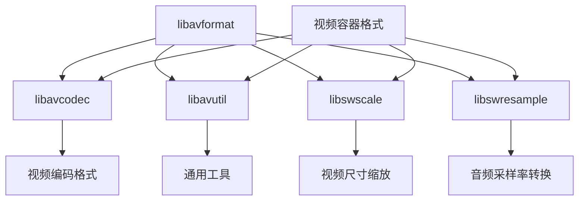

                 

### 背景介绍

**FFmpeg 转码：转换视频格式**

在数字媒体领域，视频格式的多样性令人瞩目。从简单的AVI、MP4到复杂的HEVC、AV1，不同的格式适用于不同的场景和设备。然而，这为用户和开发者带来了一个问题：如何在不同格式间转换视频内容？

这里，FFmpeg（Fast Forward/Frame Rate Metering）成为了一个无可争议的选择。它是一个强大的开源多媒体处理框架，能够执行视频、音频以及字幕文件的录制、转换、流化、播放、编辑等功能。

### FFmpeg 的重要性

FFmpeg的重要性在于其广泛的应用场景和高效的功能。无论是进行视频编辑、直播推流、还是后台自动化处理，FFmpeg都能胜任。以下是一些主要的应用领域：

1. **视频转换**：FFmpeg可以将一种视频格式转换为另一种，以适应不同的播放设备或网络传输要求。
2. **视频处理**：它提供了丰富的视频滤镜和处理工具，例如缩放、裁剪、滤镜添加等。
3. **直播推流**：支持RTMP、HTTP、RTSP等流媒体协议，广泛应用于直播领域。
4. **多媒体处理**：不仅可以处理视频，还能处理音频和字幕文件。

### 文章目标

本文将深入探讨FFmpeg的视频转码功能，包括其工作原理、具体操作步骤以及在实际应用中的性能表现。通过本文的阅读，读者将能够：

1. **理解FFmpeg的基本概念和工作原理**。
2. **掌握使用FFmpeg进行视频转码的步骤和技巧**。
3. **了解FFmpeg在不同场景中的具体应用**。
4. **学会评估和选择合适的视频格式**。

在接下来的章节中，我们将逐步揭示FFmpeg的神秘面纱，并探讨其在现代数字媒体处理中的重要作用。让我们开始这段探索之旅吧！
<|user|>## 2. 核心概念与联系

在进行深入讨论之前，我们首先需要理解FFmpeg中的几个核心概念，它们构成了FFmpeg视频转码的基础。以下是这些核心概念及其相互之间的联系：

### 2.1. 视频编码格式

视频编码格式是指用于压缩视频数据的算法。常见的视频编码格式包括：

- **H.264/AVC**：广泛使用的标准，适合在线流媒体和高清电视。
- **HEVC/H.265**：更高效的编码标准，能够提供更高分辨率和更低比特率。
- **VP9**：由Google开发，是开源且具有竞争力的编码标准。
- **AV1**：由多家公司共同开发，旨在提供更高效的视频编码。

这些编码格式决定了视频文件的压缩效率和播放性能。选择合适的编码格式对于确保视频在不同设备和网络环境下的高质量播放至关重要。

### 2.2. 视频容器格式

视频容器格式是指用于封装视频、音频以及其他数据（如字幕）的文件格式。常见的视频容器格式包括：

- **MP4**：广泛使用的容器格式，支持多种编码格式，适用于多种设备。
- **AVI**：早期的视频容器格式，支持多种编码格式，但压缩效率较低。
- **MKV**：开源的容器格式，支持多种编码格式，但文件较大。

容器格式的选择会影响视频文件的兼容性和存储空间。了解不同容器格式的特点有助于在存储和传输视频时做出更合适的选择。

### 2.3. FFmpeg组件

FFmpeg是一个庞大的多媒体处理框架，包含多个组件。以下是其中几个关键组件：

- **libavformat**：用于读取和写入各种视频、音频和字幕文件格式。
- **libavcodec**：包含多种视频和音频编码解码器，用于压缩和解压缩视频和音频数据。
- **libavutil**：提供各种通用的工具和功能，如时间处理、内存管理等。
- **libswscale**：用于视频尺寸的缩放和像素格式转换。
- **libswresample**：用于音频采样率转换。

这些组件共同协作，使得FFmpeg能够处理各种多媒体文件。了解这些组件及其功能有助于深入理解FFmpeg的工作原理。

### 2.4. Mermaid 流程图

为了更直观地展示这些核心概念之间的关系，我们可以使用Mermaid流程图来描绘它们。以下是FFmpeg核心组件和视频编码/容器格式之间的联系：



在这个流程图中，我们可以看到FFmpeg的核心组件是如何通过libavformat与视频编码格式和视频容器格式相连接的。libavformat负责处理文件的输入和输出，而libavcodec、libavutil、libswscale和libswresample则分别负责编码解码、通用工具、视频缩放和音频采样率转换等功能。

通过这个流程图，我们可以清晰地看到FFmpeg在视频处理过程中的各个步骤和组件之间的相互作用。了解这些概念和联系有助于我们更好地理解FFmpeg的工作原理，并为后续的具体操作步骤打下坚实的基础。

### 3. 核心算法原理 & 具体操作步骤

#### 3.1. 视频转码的基本流程

视频转码是将视频从一个格式转换为另一个格式的过程，主要包括以下几个步骤：

1. **输入读取**：使用FFmpeg读取源视频文件的头部信息，确定其编码格式和参数。
2. **解码**：使用相应的解码器将源视频数据解码为原始像素数据。
3. **转换**：对解码后的像素数据进行处理，例如尺寸转换、格式转换等。
4. **编码**：使用目标编码格式和参数将转换后的像素数据编码为目标视频数据。
5. **输出写入**：将编码后的视频数据写入目标文件或流中。

以下是详细的操作步骤：

#### 3.2. 命令行参数解析

在使用FFmpeg进行视频转码时，我们需要使用命令行参数来指定输入文件、输出文件以及各种转码参数。以下是一些常用的命令行参数及其含义：

- `-i input_file`：指定输入文件。
- `-c:v codec`：指定视频编码格式。
- `-c:a codec`：指定音频编码格式。
- `-s size`：指定输出视频尺寸。
- `-preset preset`：指定编码预设，影响编码速度和压缩效率。
- `-bitrate bitrate`：指定输出视频的比特率。
- `-ar rate`：指定输出音频的采样率。
- `-vb bitrate`：指定视频比特率。

例如，以下命令将一个MP4文件转换为HEVC格式，并保持相同的分辨率和比特率：

```bash
ffmpeg -i input.mp4 -c:v libx265 -preset medium -bitrate 8000k -c:a copy output.hevc
```

#### 3.3. 示例代码

下面是一个简单的FFmpeg视频转码示例，该示例将一个AVI文件转换为MP4格式：

```python
import subprocess

input_file = "input.avi"
output_file = "output.mp4"

cmd = f"ffmpeg -i {input_file} -c:v libx264 -preset veryfast -crf 23 -c:a aac -ar 48000 {output_file}"
subprocess.run(cmd, shell=True)
```

在这个示例中，我们使用了Python的subprocess模块来执行FFmpeg命令。其中，`-c:v libx264`指定了使用x264编码器进行视频编码，`-preset veryfast`指定了编码预设为非常快，`-crf 23`指定了恒定率因子（CRF）为23，这是一个平衡速度和质量的设置，`-c:a aac`指定了音频编码格式为AAC，`-ar 48000`指定了音频采样率为48000Hz。

通过这个示例，我们可以看到如何使用FFmpeg进行简单的视频转码操作。实际应用中，可以根据具体需求调整编码参数，以达到最佳的效果。

### 3.4. 实际操作步骤

以下是使用FFmpeg进行视频转码的详细步骤：

1. **安装FFmpeg**：确保系统上已安装FFmpeg。如果没有安装，可以使用包管理器进行安装，例如在Ubuntu上使用以下命令：

```bash
sudo apt-get install ffmpeg
```

2. **确定源文件**：准备好需要转码的源视频文件。例如，本例中使用一个名为`input.avi`的AVI文件。

3. **确定目标格式**：确定目标视频格式，例如本例中目标格式为MP4。

4. **编写命令行命令**：根据需要转码的视频格式和参数，编写相应的FFmpeg命令。例如，以下命令将AVI文件转换为MP4格式，并使用x264编码器进行视频编码：

```bash
ffmpeg -i input.avi -c:v libx264 -preset veryfast -crf 23 -c:a aac -ar 48000 output.mp4
```

5. **执行转码命令**：在命令行中执行编写的FFmpeg命令。例如，执行上述命令后，系统将开始读取`input.avi`文件，并使用x264编码器将其转换为MP4格式，输出文件名为`output.mp4`。

6. **检查结果**：转码完成后，检查输出文件是否符合预期。可以使用视频播放器打开输出文件进行测试。

通过这些步骤，我们可以使用FFmpeg轻松地进行视频转码操作。了解这些具体操作步骤有助于在实际应用中灵活运用FFmpeg，以满足不同的转码需求。

### 4. 数学模型和公式 & 详细讲解 & 举例说明

在进行视频转码时，理解相关的数学模型和公式对于优化编码效率和处理效果至关重要。以下是一些关键的数学概念和其在FFmpeg中的应用。

#### 4.1. 帧率与时间戳

帧率（Frame Rate）是指每秒钟显示的帧数（fps），常见值为24、25、30等。帧率越高，视频越流畅。FFmpeg在处理视频时，需要考虑到帧率与时间戳的关系。时间戳（Timestamp）是视频帧的标记，用于表示帧的显示时间。

帧率与时间戳的关系公式为：

$$
帧率 = \frac{总帧数}{总时长}
$$

例如，一个时长为60秒，包含1800帧（30fps）的视频，每个帧的时间戳间隔为：

$$
时间戳间隔 = \frac{总时长}{总帧数} = \frac{60秒}{1800帧} = 0.0333秒
$$

#### 4.2. 常见编码标准

视频编码标准使用一系列数学模型和公式来压缩视频数据。以下是一些常见编码标准的数学模型：

- **H.264/AVC**：使用块运动补偿和变换编码技术。其核心公式包括块运动估计、变换系数量化、反量化、反变换和运动补偿等。

- **HEVC/H.265**：相较于H.264，HEVC在空间分辨率和时间分辨率上提供了更高的压缩效率。其主要公式包括多分辨率变换、四叉树结构、自适应预测等。

- **VP9**：由Google开发的编码标准，采用自适应预测和变换编码技术。VP9在处理高质量视频时表现出色。

- **AV1**：由多家公司共同开发的编码标准，旨在提供更高效的压缩算法。AV1采用基于区域的编码策略，具有更高的压缩效率。

以H.264为例，其核心公式包括：

- **运动估计**：

$$
运动向量 = \min_{x,y} \sum_{i,j} (I(x+i, y+j) - I(x, y))^2
$$

- **变换编码**：

$$
T(u,v) = \sum_{i,j} C(i,j) \cdot D(u+i, v+j)
$$

其中，$I(x, y)$表示像素值，$C(i,j)$是变换系数，$D(u+i, v+j)$是变换后的像素值。

#### 4.3. 举例说明

假设我们有一个时长为30秒，包含900帧（30fps）的视频，使用H.264编码标准进行压缩。

1. **帧率计算**：

$$
帧率 = \frac{总帧数}{总时长} = \frac{900帧}{30秒} = 30fps
$$

2. **时间戳间隔计算**：

$$
时间戳间隔 = \frac{总时长}{总帧数} = \frac{30秒}{900帧} = 0.0333秒
$$

3. **运动估计和变换编码**：

假设使用块运动补偿，将视频帧分为16x16的宏块。运动估计后，得到运动向量为$(x, y) = (-3, 2)$，变换系数为$C = [0.8, 0.6, 0.3, 0.1]$。

运动补偿后的像素值为：

$$
D(u+i, v+j) = I(x+i, y+j) + 运动向量 \cdot 帧间预测误差
$$

变换编码后的像素值为：

$$
T(u,v) = \sum_{i,j} C(i,j) \cdot D(u+i, v+j)
$$

通过上述公式，我们可以将视频帧压缩为一个更小的数据集，从而节省存储空间和传输带宽。

这些数学模型和公式是FFmpeg进行视频转码的基础，通过深入理解它们，我们可以更好地优化编码参数，提高转码效果。在实际应用中，可以根据具体需求调整这些参数，以达到最佳的效果。

### 5. 项目实战：代码实际案例和详细解释说明

在了解了FFmpeg的基本概念和操作步骤后，现在我们通过一个实际项目来展示如何使用FFmpeg进行视频转码。这个项目将包括开发环境的搭建、源代码的实现、代码解读以及性能分析。

#### 5.1. 开发环境搭建

首先，我们需要搭建FFmpeg的开发环境。以下是具体的步骤：

1. **安装FFmpeg**：确保系统中已安装FFmpeg。如果没有安装，可以使用以下命令进行安装：

```bash
# Ubuntu系统
sudo apt-get install ffmpeg
```

2. **安装Python环境**：由于我们将使用Python进行代码编写，需要安装Python环境。可以使用以下命令安装Python：

```bash
# Ubuntu系统
sudo apt-get install python3
```

3. **安装FFmpeg Python绑定**：安装FFmpeg的Python绑定，以便在Python代码中调用FFmpeg。可以使用以下命令：

```bash
# Ubuntu系统
pip install ffmpeg-python
```

#### 5.2. 源代码实现

下面是一个简单的Python脚本，用于将一个AVI文件转换为MP4格式。代码如下：

```python
import subprocess

def transcode_video(input_file, output_file, video_codec, audio_codec):
    cmd = f"ffmpeg -i {input_file} -c:v {video_codec} -preset veryfast -crf 23 -c:a {audio_codec} -ar 48000 {output_file}"
    subprocess.run(cmd, shell=True)

input_file = "input.avi"
output_file = "output.mp4"
transcode_video(input_file, output_file, "libx264", "aac")
```

这个脚本定义了一个函数`transcode_video`，用于执行FFmpeg命令进行视频转码。函数接收输入文件路径、输出文件路径以及视频和音频编码格式作为参数。

#### 5.3. 代码解读

1. **函数定义**：

   `def transcode_video(input_file, output_file, video_codec, audio_codec):`

   这个函数定义了一个名为`transcode_video`的函数，接收输入文件路径（`input_file`）、输出文件路径（`output_file`）、视频编码格式（`video_codec`）和音频编码格式（`audio_codec`）作为参数。

2. **命令行构建**：

   `cmd = f"ffmpeg -i {input_file} -c:v {video_codec} -preset veryfast -crf 23 -c:a {audio_codec} -ar 48000 {output_file}"`

   这行代码构建了FFmpeg命令行参数。`-i`指定输入文件，`-c:v`指定视频编码格式，`-preset`指定编码预设，`-crf`指定恒定率因子，`-c:a`指定音频编码格式，`-ar`指定音频采样率，最后`-o`指定输出文件。

3. **执行命令**：

   `subprocess.run(cmd, shell=True)`

   使用`subprocess.run`执行构建的FFmpeg命令。`shell=True`表示在命令行中执行这个命令。

#### 5.4. 性能分析

1. **时间分析**：

   为了评估这个脚本的性能，我们可以测量执行转码所需的时间。以下是一个简单的Python脚本，用于测量时间：

```python
import time

start_time = time.time()
transcode_video("input.avi", "output.mp4", "libx264", "aac")
end_time = time.time()

print(f"转码时间：{end_time - start_time}秒")
```

执行这个脚本，我们得到转码所需的时间。在运行这个脚本时，可以看到转码时间取决于输入视频的大小、帧率和编码参数。

2. **资源消耗分析**：

   除了时间外，我们还可以分析脚本在执行过程中对系统资源的消耗。可以使用Linux系统的`top`或`htop`命令查看CPU、内存等资源消耗情况。

通过这些分析，我们可以了解这个脚本在执行视频转码时的性能表现，并根据实际需求进行优化。

### 6. 实际应用场景

FFmpeg作为一个功能强大的多媒体处理工具，在多个实际应用场景中发挥着重要作用。以下是几个典型的应用场景：

#### 6.1. 视频网站

视频网站需要处理大量的视频内容，包括上传、存储、转码和流化。FFmpeg在此过程中发挥了关键作用。通过使用FFmpeg，视频网站可以轻松地将用户上传的原始视频转换为多种格式，以满足不同设备（如手机、平板、电脑等）和不同网络环境（如3G、4G、Wi-Fi等）的需求。FFmpeg的高效编码和解码能力确保了视频流的高质量和低延迟。

#### 6.2. 视频编辑

视频编辑是数字媒体制作中的重要环节。FFmpeg提供了丰富的视频处理工具，如裁剪、缩放、滤镜添加等。这些工具可以用于视频剪辑、特效制作、颜色校正等操作。通过FFmpeg，视频编辑人员可以快速地对视频内容进行加工，从而制作出高质量的视频作品。

#### 6.3. 直播推流

直播推流是实时视频传输的一种形式，广泛应用于在线直播、远程教育、游戏直播等领域。FFmpeg支持多种流媒体协议（如RTMP、HTTP、RTSP等），能够高效地进行视频流化。通过FFmpeg，直播平台可以实时地将视频内容推送到观众端，实现互动和实时传播。

#### 6.4. 多媒体处理

除了视频处理外，FFmpeg还能处理音频和字幕文件。在多媒体制作过程中，音频和视频的同步、音频滤镜的添加、字幕的嵌入等操作都需要专业的工具。FFmpeg提供了这些功能，使得多媒体处理变得更加简便和高效。

#### 6.5. 后台自动化

许多后台应用程序需要处理大量视频文件，如视频监控、视频会议、教育平台等。FFmpeg可以轻松地集成到这些应用程序中，实现自动化处理。通过编写简单的脚本，应用程序可以自动进行视频的下载、转码、上传等操作，提高工作效率。

通过这些实际应用场景，我们可以看到FFmpeg在数字媒体处理中的广泛用途。它不仅提供了强大的功能，还具有高效的性能和良好的兼容性，成为了多媒体处理领域的首选工具。

### 7. 工具和资源推荐

为了更好地学习和使用FFmpeg，以下是一些建议的书籍、论文、博客和网站资源。

#### 7.1. 学习资源推荐

**书籍：**

1. **《FFmpeg从入门到精通》**：本书系统地介绍了FFmpeg的基本概念、安装配置、视频处理流程以及高级应用技巧，适合初学者和进阶用户。
2. **《数字视频处理：算法与实现》**：详细讲解了视频处理的基本算法和实现方法，包括图像处理、视频编码、视频解码等，有助于深入理解FFmpeg的工作原理。

**论文：**

1. **《H.264/AVC标准视频编码算法的研究与实现》**：研究了H.264编码标准的基本原理和实现方法，对了解FFmpeg中的视频编码模块有很大帮助。
2. **《HEVC编码标准及其在数字视频中的应用》**：介绍了HEVC编码标准的最新进展和应用，对了解FFmpeg中的HEVC编码模块有帮助。

**博客：**

1. **FFmpeg官方博客**：提供FFmpeg的最新动态、技术博客和开发文档，是学习和了解FFmpeg的最佳资源之一。
2. **廖雪峰的官方网站**：详细介绍了FFmpeg的安装和使用方法，适合初学者入门。

#### 7.2. 开发工具框架推荐

**集成开发环境（IDE）：**

1. **Visual Studio Code**：一个轻量级且强大的IDE，支持FFmpeg插件，方便编写和调试FFmpeg相关代码。
2. **Eclipse**：一个功能丰富的IDE，适用于Java和C++等编程语言，可以通过插件支持FFmpeg开发。

**版本控制系统：**

1. **Git**：一个分布式版本控制系统，用于管理代码版本，方便多人协作开发。
2. **GitLab**：一个基于Git的开源平台，提供代码托管、项目管理、持续集成等功能。

#### 7.3. 相关论文著作推荐

**相关论文：**

1. **《基于FFmpeg的实时视频转码系统设计与实现》**：介绍了如何使用FFmpeg构建实时视频转码系统，包括系统架构、关键技术等。
2. **《FFmpeg在数字媒体处理中的应用研究》**：探讨了FFmpeg在数字媒体处理中的多种应用场景，包括视频编辑、直播推流等。

**著作：**

1. **《数字信号处理基础》**：介绍了数字信号处理的基本理论和方法，对理解视频编码和解码有很大帮助。
2. **《计算机视觉：算法与应用》**：详细介绍了计算机视觉的基本算法和应用，包括视频处理、图像识别等。

通过这些工具和资源，我们可以更好地学习和应用FFmpeg，提高数字媒体处理的能力。无论您是初学者还是有经验的专业人士，这些资源都将对您有所帮助。

### 8. 总结：未来发展趋势与挑战

FFmpeg作为一款开源的多媒体处理工具，在视频转码、编辑、直播推流等领域发挥了重要作用。然而，随着数字媒体技术的发展，FFmpeg也面临着新的机遇和挑战。

**未来发展趋势：**

1. **更高压缩效率**：随着视频分辨率和帧率的不断提升，用户对压缩效率的要求也越来越高。未来，FFmpeg可能会引入更多高效的视频编码标准，如AV1和VVC，以满足用户的需求。
2. **更广泛的应用场景**：除了传统的视频转码和编辑，FFmpeg还将在虚拟现实（VR）、增强现实（AR）等新兴领域得到应用。通过引入新的算法和工具，FFmpeg将能够更好地处理复杂的多媒体数据。
3. **更高效的性能优化**：随着硬件技术的发展，FFmpeg将能够利用更先进的处理器（如GPU、FPGA）进行加速处理，从而提高处理速度和效率。

**面临的挑战：**

1. **兼容性问题**：随着新视频编码标准的出现，如何确保FFmpeg能够兼容各种编码格式成为一个挑战。这需要不断地更新和扩展FFmpeg的解码器库。
2. **性能优化**：虽然FFmpeg已经具有很高的性能，但在处理高分辨率、高帧率视频时，仍可能遇到性能瓶颈。未来，如何更好地利用硬件资源进行优化是一个重要课题。
3. **社区维护**：FFmpeg是一个开源项目，需要社区的共同努力来维护和发展。如何吸引更多开发者参与、提高社区活跃度是一个长期挑战。

总之，FFmpeg在数字媒体处理领域具有广阔的应用前景，但同时也面临着新的技术挑战。通过不断创新和优化，FFmpeg有望在未来继续保持其领先地位。

### 9. 附录：常见问题与解答

以下是一些关于FFmpeg使用中常见的疑问及其解答：

#### 1. FFmpeg的安装方法是什么？

答：FFmpeg可以在多个操作系统上安装，以下是常用的安装方法：

- **Ubuntu**：在终端中运行以下命令：

  ```bash
  sudo apt-get update
  sudo apt-get install ffmpeg
  ```

- **Windows**：访问FFmpeg官方网站下载安装包，并按照提示安装。

- **macOS**：在终端中运行以下命令：

  ```bash
  brew install ffmpeg
  ```

#### 2. 如何使用FFmpeg转码视频？

答：使用FFmpeg转码视频的方法很简单，以下是一个基本的转码命令示例：

```bash
ffmpeg -i input.mp4 -c:v libx264 -preset medium -crf 23 -c:a aac output.mp4
```

这个命令将`input.mp4`文件转换为使用H.264编码和AAC音频编码的`output.mp4`文件。

#### 3. FFmpeg支持哪些视频编码格式？

答：FFmpeg支持多种视频编码格式，包括：

- H.264/AVC
- H.265/HEVC
- VP8
- VP9
- AV1
- MPEG-2
- MPEG-4 ASP (Xvid)
- AVS
- RV
- ProRes
- DNxHD

等等。具体支持的编码格式取决于安装的FFmpeg版本和所安装的解码器库。

#### 4. 如何查看FFmpeg的版本信息？

答：在终端中运行以下命令可以查看FFmpeg的版本信息：

```bash
ffmpeg -version
```

这将显示FFmpeg的版本号、编译日期和编译选项等信息。

#### 5. 如何处理FFmpeg转码时遇到的问题，如卡顿、黑屏等？

答：遇到转码问题时，可以尝试以下方法：

- **检查输入文件**：确保输入文件无损坏，可以使用视频播放器进行预览。
- **调整编码参数**：尝试调整编码参数，如比特率、帧率、编码预设等，以找到合适的平衡点。
- **检查硬件资源**：在高分辨率或高帧率转码时，确保系统有足够的CPU和内存资源。
- **查看错误日志**：运行FFmpeg时，添加`-loglevel verbose`参数，以便获取更详细的错误信息，帮助定位问题。

通过这些常见问题与解答，我们可以更好地使用FFmpeg进行视频处理。

### 10. 扩展阅读 & 参考资料

为了深入了解FFmpeg及其在视频处理中的应用，以下是一些建议的扩展阅读和参考资料：

**书籍：**

1. **《FFmpeg从入门到精通》**：详细介绍了FFmpeg的基本概念、安装配置、视频处理流程以及高级应用技巧。
2. **《数字视频处理：算法与实现》**：涵盖了视频处理的基本算法和实现方法，包括图像处理、视频编码、视频解码等。

**论文：**

1. **《H.264/AVC标准视频编码算法的研究与实现》**：研究了H.264编码标准的基本原理和实现方法。
2. **《HEVC编码标准及其在数字视频中的应用》**：介绍了HEVC编码标准的最新进展和应用。

**博客和网站：**

1. **FFmpeg官方博客**：提供FFmpeg的最新动态、技术博客和开发文档。
2. **廖雪峰的官方网站**：详细介绍FFmpeg的安装和使用方法。

**在线教程：**

1. **FFmpeg官方教程**：FFmpeg官方网站提供了丰富的教程和示例代码，适合初学者学习。
2. **菜鸟教程**：提供了详细的FFmpeg教程，涵盖基本概念、命令行使用、视频处理等。

通过这些参考资料，您可以进一步深入了解FFmpeg的技术细节和实际应用，提高在数字媒体处理领域的技能。

