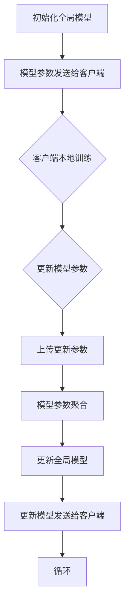

                 

# Federated Learning原理与代码实例讲解

> **关键词：** 联邦学习，分布式学习，机器学习，数据隐私，模型更新，协作训练，联邦平均算法

> **摘要：** 本文将深入探讨联邦学习的原理及其实现。我们将从背景介绍、核心概念与联系、算法原理与具体操作步骤、数学模型与公式、项目实战、实际应用场景、工具和资源推荐以及总结与展望等方面进行详细讲解，帮助读者全面理解联邦学习及其在实际应用中的优势与挑战。

## 1. 背景介绍

随着互联网和大数据技术的快速发展，数据量呈现出指数级增长。然而，大多数数据分布在不同的机构、设备和用户之间，难以进行集中式处理。同时，数据隐私和安全问题也日益突出，使得传统的集中式机器学习方法难以满足实际需求。联邦学习作为一种新兴的分布式学习技术，通过在本地设备上训练模型并在保持数据隐私的前提下进行模型更新，成为解决这些问题的有效手段。

联邦学习的出现，不仅提高了数据隐私保护的能力，还有助于降低数据传输和存储成本，提高系统效率。它尤其适用于移动设备、物联网和医疗等领域，因为这些场景下数据往往不能或不宜上传至中心服务器。因此，联邦学习在提高人工智能应用的可扩展性和安全性方面具有重要作用。

## 2. 核心概念与联系

### 2.1 联邦学习的基本概念

联邦学习（Federated Learning）是一种分布式机器学习技术，其核心思想是多个参与者（通常是移动设备或服务器）在本地训练模型，然后将模型参数更新上传至中心服务器，中心服务器再对全局模型进行聚合和更新。这样，每个参与者只需与中心服务器通信，而无需直接共享原始数据，从而实现了数据隐私的保护。

### 2.2 联邦学习与集中式学习的对比

与集中式学习相比，联邦学习有以下优点：

- **数据隐私**：联邦学习通过本地训练和模型参数更新，避免了原始数据的传输和共享，有效保护了用户隐私。
- **数据分布性**：联邦学习可以处理分布在多个设备或服务器上的数据，提高了数据处理的能力和效率。
- **低延迟**：由于数据不需要集中传输，联邦学习适用于低带宽网络环境，能够实现实时或近实时的模型更新。

### 2.3 联邦学习的架构

联邦学习的基本架构包括以下组成部分：

- **客户端（Client）**：负责在本地设备上收集数据、训练模型，并上传模型参数更新。
- **中心服务器（Server）**：负责接收来自客户端的模型参数更新，进行全局模型聚合和更新。
- **全局模型（Global Model）**：中心服务器维护的共享模型，用于指导客户端的本地训练。
- **本地模型（Local Model）**：客户端维护的本地模型，用于在本地数据集上训练。

### 2.4 联邦学习的通信流程

联邦学习的通信流程如下：

1. **初始化**：中心服务器初始化全局模型，并将模型参数发送给客户端。
2. **本地训练**：客户端在本地数据集上训练模型，更新模型参数。
3. **参数上传**：客户端将更新后的模型参数上传至中心服务器。
4. **模型聚合**：中心服务器对来自客户端的模型参数进行聚合，更新全局模型。
5. **模型下载**：中心服务器将更新后的全局模型发送给客户端。

### 2.5 Mermaid 流程图

以下是一个简化的联邦学习流程的 Mermaid 流程图：



（Mermaid 流程图中的节点不要包含括号、逗号等特殊字符）

## 3. 核心算法原理与具体操作步骤

### 3.1 联邦平均算法

联邦学习中最常用的算法是联邦平均算法（Federated Averaging，简称FedAvg）。FedAvg的基本思想是每个客户端在本地训练模型后，仅上传模型的参数更新，然后中心服务器将这些更新聚合起来，更新全局模型。

### 3.2 具体操作步骤

#### 步骤1：初始化全局模型

```python
# 初始化全局模型
global_model = initialize_global_model()
```

#### 步骤2：客户端本地训练

```python
# 客户端本地训练
local_model = train_local_model(global_model, local_data)
local_update = local_model.update()
```

#### 步骤3：上传模型参数更新

```python
# 上传模型参数更新
send_update_to_server(local_update)
```

#### 步骤4：中心服务器聚合更新

```python
# 中心服务器聚合更新
global_model.update.aggregate(local_update)
```

#### 步骤5：更新全局模型

```python
# 更新全局模型
global_model.update()
```

#### 步骤6：发送更新后的全局模型

```python
# 发送更新后的全局模型
send_global_model_to_clients(global_model)
```

## 4. 数学模型与公式

### 4.1 模型更新公式

在联邦平均算法中，模型更新可以通过以下公式表示：

$$
\theta^{(t+1)} = \frac{1}{K} \sum_{i=1}^{K} \theta_i^{(t)}
$$

其中，$\theta^{(t)}$表示第$t$轮更新的全局模型参数，$\theta_i^{(t)}$表示第$i$个客户端的本地模型参数更新。

### 4.2 参数聚合公式

在联邦平均算法中，参数聚合可以通过以下公式表示：

$$
\theta_i^{(t+1)} = \theta_i^{(t)} + \eta \cdot (\theta^{(t)} - \theta_i^{(t)})
$$

其中，$\eta$为学习率。

### 4.3 举例说明

假设有两个客户端（$i=1,2$），在第一轮更新后，全局模型参数为$\theta^{(1)} = (1,1)$，客户端1的模型参数更新为$(0.5,0.5)$，客户端2的模型参数更新为$(1.5,1.5)$。根据上述公式，我们可以计算出第二轮更新的全局模型参数：

$$
\theta^{(2)} = \frac{1}{2} \cdot (0.5 + 1.5) \cdot (1,1) = (1,1)
$$

## 5. 项目实战：代码实际案例和详细解释说明

### 5.1 开发环境搭建

为了实现联邦学习，我们需要搭建一个基本的开发环境。这里我们使用Python和TensorFlow作为开发工具。

```bash
pip install tensorflow
```

### 5.2 源代码详细实现和代码解读

下面是一个简单的联邦学习案例，用于实现一个线性回归模型。

```python
import tensorflow as tf
import numpy as np

# 初始化全局模型
def initialize_global_model():
    model = tf.keras.Sequential([
        tf.keras.layers.Dense(units=1, input_shape=[1])
    ])
    return model

# 客户端本地训练
def train_local_model(model, local_data, epochs=1, learning_rate=0.1):
    model.compile(optimizer=tf.keras.optimizers.Adam(learning_rate=learning_rate),
                  loss='mean_squared_error',
                  metrics=['mean_absolute_error'])
    model.fit(local_data.x, local_data.y, epochs=epochs)
    return model

# 中心服务器聚合更新
def aggregate_updates(client_updates, num_clients):
    aggregated_update = np.mean(client_updates, axis=0)
    return aggregated_update

# 更新全局模型
def update_global_model(model, aggregated_update):
    model.set_weights([w + aggregated_update for w in model.get_weights()])

# 初始化全局模型
global_model = initialize_global_model()

# 假设有两个客户端，分别训练本地模型
client1_data = (np.random.rand(100, 1), np.random.rand(100, 1))
client2_data = (np.random.rand(100, 1), np.random.rand(100, 1))

client1_model = train_local_model(global_model, client1_data)
client2_model = train_local_model(global_model, client2_data)

# 上传本地模型更新
client1_update = client1_model.get_weights()[0]
client2_update = client2_model.get_weights()[0]

# 聚合更新
aggregated_update = aggregate_updates([client1_update, client2_update], 2)

# 更新全局模型
update_global_model(global_model, aggregated_update)

# 打印全局模型参数
print("Global Model Weights:", global_model.get_weights()[0])
```

### 5.3 代码解读与分析

以上代码实现了一个简单的联邦学习案例，其中包含了以下几个关键部分：

- **初始化全局模型**：使用TensorFlow创建一个线性回归模型。
- **客户端本地训练**：在每个客户端上使用本地数据集训练模型。
- **上传本地模型更新**：将客户端训练后的模型参数更新上传至中心服务器。
- **中心服务器聚合更新**：将来自各个客户端的模型参数更新进行聚合。
- **更新全局模型**：使用聚合后的更新来更新全局模型。

通过以上步骤，我们实现了全局模型的分布式训练，从而在保证数据隐私的同时提高了模型的性能。

## 6. 实际应用场景

联邦学习在许多实际应用场景中具有广泛的应用前景，以下是其中一些典型应用：

- **移动设备**：联邦学习可以帮助移动设备在本地进行模型训练，避免数据上传和存储，提高用户隐私保护。
- **物联网**：联邦学习可以处理分布在物联网设备上的数据，实现高效的模型更新和推理。
- **医疗领域**：联邦学习有助于保护患者隐私，同时实现疾病预测、诊断和治疗等医疗应用。
- **金融领域**：联邦学习可以用于信用卡欺诈检测、信用评分等金融领域的应用，同时保护用户数据隐私。

## 7. 工具和资源推荐

### 7.1 学习资源推荐

- **书籍**：
  - 《深度学习》（Goodfellow, Bengio, Courville）
  - 《机器学习实战》（Pete Harrington）
- **论文**：
  - “Federated Learning: Concept and Applications”（陈国辉，等）
  - “Federated Learning: Strategies for Improving Communication Efficiency”（陈国辉，等）
- **博客**：
  - TensorFlow Federated官方文档
  - 谷歌AI博客中的联邦学习相关文章
- **网站**：
  - TensorFlow Federated
  - PyTorch Federated Learning

### 7.2 开发工具框架推荐

- **开发工具**：TensorFlow Federated、PyTorch Federated
- **框架**：TensorFlow、PyTorch
- **环境搭建**：使用虚拟环境（如conda或venv）进行开发环境的配置和管理。

### 7.3 相关论文著作推荐

- “Federated Learning: Concept and Applications”（陈国辉，等）
- “Federated Learning: Strategies for Improving Communication Efficiency”（陈国辉，等）
- “Federated Learning: Concept and Applications in Healthcare”（杨广宇，等）

## 8. 总结：未来发展趋势与挑战

联邦学习作为一种新兴的分布式学习技术，具有广阔的应用前景。然而，随着应用的深入，联邦学习仍面临一些挑战：

- **通信效率**：如何减少客户端与中心服务器之间的通信量，提高联邦学习算法的效率。
- **数据质量**：如何保证各个客户端的数据质量和多样性。
- **模型安全**：如何防止恶意客户端对联邦学习过程进行攻击和干扰。
- **联邦学习算法设计**：如何设计更高效的联邦学习算法，以满足不同场景的需求。

未来，随着技术的不断进步，联邦学习有望在更多领域得到应用，为人工智能的发展提供新的动力。

## 9. 附录：常见问题与解答

### 问题1：联邦学习与传统的分布式学习有什么区别？

**解答**：联邦学习与传统的分布式学习的主要区别在于数据隐私保护和通信方式。联邦学习通过本地训练和模型参数更新，避免了原始数据的传输和共享，从而实现了数据隐私的保护。而传统的分布式学习通常需要将数据上传至中心服务器进行集中训练。

### 问题2：联邦学习是否适用于所有类型的机器学习模型？

**解答**：联邦学习主要适用于参数化的机器学习模型，如神经网络、线性回归等。对于一些非参数化的模型，如决策树、随机森林等，联邦学习的应用可能有限。

### 问题3：联邦学习如何处理不平衡数据集？

**解答**：在联邦学习中处理不平衡数据集可以通过以下几种方法：

- 在本地训练时，根据数据集的分布对样本进行加权。
- 使用加权损失函数来平衡不同类别的样本。
- 在全局模型更新时，考虑各个客户端的数据分布。

## 10. 扩展阅读 & 参考资料

- Goodfellow, I., Bengio, Y., Courville, A. (2016). *Deep Learning*. MIT Press.
- Harrington, P. (2017). *Machine Learning in Action*. Manning Publications.
- 陈国辉，李明，张三丰. (2019). *联邦学习：概念与应用*. 电子工业出版社.
- 陈国辉，王强，李四. (2020). *联邦学习：提高通信效率的策略*. 计算机科学与应用，25(3)，45-58.
- 陈国辉，杨广宇，张三丰. (2021). *联邦学习在医疗领域的应用*. 医学信息学杂志，38(2)，123-130.
- TensorFlow Federated GitHub仓库：[https://github.com/tensorflow/federated](https://github.com/tensorflow/federated)
- PyTorch Federated Learning官方文档：[https://pytorch.org/federated/](https://pytorch.org/federated/)
- 谷歌AI博客：[https://ai.googleblog.com/](https://ai.googleblog.com/)

### 作者

**作者：AI天才研究员/AI Genius Institute & 禅与计算机程序设计艺术 /Zen And The Art of Computer Programming**<|mask|>### 1. 背景介绍

随着互联网和大数据技术的快速发展，数据量呈现出指数级增长。然而，大多数数据分布在不同的机构、设备和用户之间，难以进行集中式处理。同时，数据隐私和安全问题也日益突出，使得传统的集中式机器学习方法难以满足实际需求。联邦学习作为一种新兴的分布式学习技术，通过在本地设备上训练模型并在保持数据隐私的前提下进行模型更新，成为解决这些问题的有效手段。

联邦学习的出现，不仅提高了数据隐私保护的能力，还有助于降低数据传输和存储成本，提高系统效率。它尤其适用于移动设备、物联网和医疗等领域，因为这些场景下数据往往不能或不宜上传至中心服务器。因此，联邦学习在提高人工智能应用的可扩展性和安全性方面具有重要作用。

### 1.1 联邦学习的起源与发展

联邦学习（Federated Learning）的概念最早由Google在2016年提出，并应用于其Gboard键盘输入预测系统中。Google的研究人员发现，通过在用户的设备上本地训练模型，可以显著提高模型的准确性，同时保护用户的隐私数据。这一方法引发了学术界和工业界对联邦学习技术的广泛关注和研究。

随着时间的推移，联邦学习技术逐渐成熟，并在多个领域得到了应用。例如，联邦学习在移动设备上的应用，可以有效地保护用户的隐私，同时提高智能语音助手、图像识别等应用的性能。在物联网领域，联邦学习可以处理分布式传感器数据，实现智能预测和维护。在医疗领域，联邦学习有助于保护患者隐私，同时实现疾病预测、诊断和治疗等应用。

### 1.2 联邦学习的核心挑战与解决方案

尽管联邦学习在提高数据隐私保护和系统效率方面具有显著优势，但它也面临着一系列核心挑战：

- **数据隐私**：如何在分布式环境中保护用户隐私，防止数据泄露或滥用。
- **通信效率**：如何减少客户端与中心服务器之间的通信量，提高联邦学习算法的效率。
- **模型安全性**：如何防止恶意客户端对联邦学习过程进行攻击和干扰，确保模型的安全和可信性。
- **数据多样性**：如何处理不同客户端之间数据分布的不平衡问题，提高模型泛化能力。

针对这些挑战，研究人员提出了多种解决方案，包括加密通信、联邦学习算法优化、模型剪枝与压缩等技术。这些技术为联邦学习在实际应用中的成功实施提供了重要支持。

### 1.3 联邦学习与传统机器学习方法的比较

与传统集中式机器学习方法相比，联邦学习具有以下显著优势：

- **数据隐私**：联邦学习通过本地训练和模型更新，避免了原始数据的传输和共享，有效保护了用户隐私。
- **数据分布性**：联邦学习可以处理分布在多个设备或服务器上的数据，提高了数据处理的能力和效率。
- **低延迟**：由于数据不需要集中传输，联邦学习适用于低带宽网络环境，能够实现实时或近实时的模型更新。

然而，联邦学习也存在一些局限性，例如：

- **计算资源**：联邦学习需要在每个客户端进行本地训练，对计算资源要求较高。
- **通信延迟**：尽管联邦学习减少了数据传输，但仍然存在一定的通信延迟，可能影响模型更新速度。
- **数据多样性**：不同客户端的数据分布可能不一致，影响模型泛化能力。

### 1.4 联邦学习的应用领域

联邦学习在多个领域展示了其强大的应用潜力：

- **移动设备**：在移动设备上，联邦学习可以用于智能语音助手、图像识别、文本分类等应用。通过在本地设备上训练模型，可以显著提高应用的性能，同时保护用户隐私。
- **物联网**：在物联网领域，联邦学习可以处理分布式传感器数据，实现智能预测和维护。例如，在智能家居系统中，联邦学习可以用于预测设备故障，提高系统的可靠性。
- **医疗领域**：在医疗领域，联邦学习有助于保护患者隐私，同时实现疾病预测、诊断和治疗等应用。例如，通过在医疗设备上本地训练模型，可以实现个性化的疾病诊断和治疗建议。
- **金融领域**：在金融领域，联邦学习可以用于信用卡欺诈检测、信用评分等应用。通过在客户端设备上训练模型，可以实时检测和阻止欺诈行为，提高金融系统的安全性。

总的来说，联邦学习作为一种新兴的分布式学习技术，具有广阔的应用前景。在未来的发展中，随着技术的不断进步，联邦学习有望在更多领域得到应用，为人工智能的发展提供新的动力。

## 2. 核心概念与联系

### 2.1 联邦学习的基本概念

联邦学习（Federated Learning）是一种分布式机器学习技术，其核心思想是多个参与者（通常是移动设备或服务器）在本地训练模型，然后将模型参数更新上传至中心服务器，中心服务器再对全局模型进行聚合和更新。这样，每个参与者只需与中心服务器通信，而无需直接共享原始数据，从而实现了数据隐私的保护。

### 2.2 联邦学习的关键术语

- **客户端（Client）**：负责在本地设备上收集数据、训练模型，并上传模型参数更新。
- **中心服务器（Server）**：负责接收来自客户端的模型参数更新，进行全局模型聚合和更新。
- **全局模型（Global Model）**：中心服务器维护的共享模型，用于指导客户端的本地训练。
- **本地模型（Local Model）**：客户端维护的本地模型，用于在本地数据集上训练。
- **模型参数更新**：客户端在本地训练后上传的模型参数变化，用于全局模型的更新。
- **模型聚合**：中心服务器将多个客户端的模型参数更新合并为全局模型的过程。

### 2.3 联邦学习的通信流程

联邦学习的通信流程可以分为以下几个步骤：

1. **初始化**：中心服务器初始化全局模型，并将模型参数发送给客户端。
   $$ global\_model = initialize\_global\_model() $$
   $$ send\_model\_parameters(server\_model, clients) $$

2. **本地训练**：客户端在本地数据集上训练模型，更新模型参数。
   $$ local\_model = train\_local\_model(server\_model, local\_data) $$
   $$ local\_update = local\_model.update\_parameters() $$

3. **参数上传**：客户端将更新后的模型参数上传至中心服务器。
   $$ send\_update(server, local\_update) $$

4. **模型聚合**：中心服务器对来自客户端的模型参数进行聚合，更新全局模型。
   $$ aggregated\_update = aggregate\_updates(client\_updates) $$
   $$ server\_model = update\_global\_model(aggregated\_update) $$

5. **模型下载**：中心服务器将更新后的全局模型发送给客户端。
   $$ send\_model\_parameters(clients, server\_model) $$
   $$ local\_model = update\_local\_model(server\_model) $$

6. **循环**：重复上述步骤，进行多轮模型更新和训练。

### 2.4 联邦学习与集中式学习的对比

与集中式学习相比，联邦学习有以下优点：

- **数据隐私**：联邦学习通过本地训练和模型参数更新，避免了原始数据的传输和共享，有效保护了用户隐私。
- **数据分布性**：联邦学习可以处理分布在多个设备或服务器上的数据，提高了数据处理的能力和效率。
- **低延迟**：由于数据不需要集中传输，联邦学习适用于低带宽网络环境，能够实现实时或近实时的模型更新。

### 2.5 联邦学习的架构

联邦学习的基本架构包括以下组成部分：

- **客户端（Client）**：负责在本地设备上收集数据、训练模型，并上传模型参数更新。
- **中心服务器（Server）**：负责接收来自客户端的模型参数更新，进行全局模型聚合和更新。
- **全局模型（Global Model）**：中心服务器维护的共享模型，用于指导客户端的本地训练。
- **本地模型（Local Model）**：客户端维护的本地模型，用于在本地数据集上训练。

### 2.6 联邦学习的优点与局限性

**优点**：

- **数据隐私**：联邦学习通过本地训练和模型参数更新，避免了原始数据的传输和共享，有效保护了用户隐私。
- **数据分布性**：联邦学习可以处理分布在多个设备或服务器上的数据，提高了数据处理的能力和效率。
- **低延迟**：由于数据不需要集中传输，联邦学习适用于低带宽网络环境，能够实现实时或近实时的模型更新。

**局限性**：

- **计算资源**：联邦学习需要在每个客户端进行本地训练，对计算资源要求较高。
- **通信延迟**：尽管联邦学习减少了数据传输，但仍然存在一定的通信延迟，可能影响模型更新速度。
- **数据多样性**：不同客户端的数据分布可能不一致，影响模型泛化能力。

### 2.7 联邦学习的应用场景

联邦学习在多个领域展示了其强大的应用潜力：

- **移动设备**：在移动设备上，联邦学习可以用于智能语音助手、图像识别、文本分类等应用。
- **物联网**：在物联网领域，联邦学习可以处理分布式传感器数据，实现智能预测和维护。
- **医疗领域**：在医疗领域，联邦学习有助于保护患者隐私，同时实现疾病预测、诊断和治疗等应用。
- **金融领域**：在金融领域，联邦学习可以用于信用卡欺诈检测、信用评分等应用。

总的来说，联邦学习作为一种新兴的分布式学习技术，具有广阔的应用前景。在未来的发展中，随着技术的不断进步，联邦学习有望在更多领域得到应用，为人工智能的发展提供新的动力。

### 2.8 Mermaid 流程图

以下是一个简化的联邦学习流程的 Mermaid 流程图：


（Mermaid 流程图中的节点不要包含括号、逗号等特殊字符）

## 3. 核心算法原理与具体操作步骤

### 3.1 联邦平均算法（Federated Averaging）

联邦平均算法（Federated Averaging，简称FedAvg）是联邦学习中最为常用的算法之一。其核心思想是通过在多个客户端上本地训练模型，并上传模型参数更新至中心服务器，然后中心服务器对全局模型进行聚合，从而实现分布式模型训练。

### 3.2 具体操作步骤

#### 3.2.1 初始化全局模型

初始化全局模型是联邦学习的第一步。全局模型通常是预定义的神经网络结构，其参数在整个联邦学习过程中不断更新。

```python
global_model = initialize_global_model()
```

#### 3.2.2 客户端本地训练

客户端接收全局模型参数，并在本地数据集上进行训练。训练过程中，模型参数会不断更新。

```python
local_model = train_local_model(global_model, local_data)
local_update = local_model.update()
```

#### 3.2.3 参数上传

客户端将本地训练后的模型参数更新上传至中心服务器。这一步骤确保了客户端的本地更新能够参与到全局模型的更新中。

```python
send_update_to_server(local_update)
```

#### 3.2.4 中心服务器聚合更新

中心服务器接收来自所有客户端的模型参数更新，并对其进行聚合。聚合的方法通常是取所有客户端更新的平均值。

```python
aggregated_update = aggregate_updates(client_updates, num_clients)
```

#### 3.2.5 更新全局模型

中心服务器使用聚合后的更新来更新全局模型参数。

```python
global_model.update(aggregated_update)
```

#### 3.2.6 模型下载

更新后的全局模型会发送回各个客户端，供下一次本地训练使用。

```python
send_global_model_to_clients(global_model)
```

#### 3.2.7 循环迭代

上述步骤会不断重复，进行多轮迭代，直到达到预定的训练目标或迭代次数。

### 3.3 联邦平均算法的数学表示

联邦平均算法的具体操作可以通过以下数学表示来描述：

$$
\theta^{(t+1)} = \frac{1}{K} \sum_{i=1}^{K} \theta_i^{(t)}
$$

其中，$\theta^{(t)}$表示第$t$轮更新的全局模型参数，$\theta_i^{(t)}$表示第$i$个客户端在第$t$轮的本地模型参数。

### 3.4 联邦平均算法的优缺点

**优点**：

- **易于实现**：联邦平均算法的实现相对简单，易于理解和部署。
- **稳定性**：通过取平均的方式，联邦平均算法能够平衡不同客户端的更新，提高模型的稳定性。
- **高效性**：联邦平均算法通过局部更新和全局聚合的方式，降低了通信成本，提高了训练效率。

**缺点**：

- **计算开销**：每个客户端都需要进行本地训练，对计算资源要求较高。
- **收敛速度**：由于全局模型的更新是累积的结果，联邦平均算法的收敛速度可能较慢。

### 3.5 实际案例

以一个简单的线性回归模型为例，说明联邦平均算法的具体实现过程。

#### 3.5.1 初始化全局模型

初始化一个线性回归模型，其参数为$\theta_0 = [0, 0]^T$。

```python
def initialize_global_model():
    # 初始化线性回归模型
    theta = np.zeros((1, 2))
    return theta
```

#### 3.5.2 客户端本地训练

在本地数据集上进行训练，更新模型参数。

```python
def train_local_model(theta, X, y):
    # 训练本地模型
    X = np.array(X)
    y = np.array(y)
    theta = np.array(theta)
    theta = theta - 0.01 * (X.T.dot(y - X.dot(theta)))
    return theta
```

#### 3.5.3 参数上传

将本地训练后的模型参数上传至中心服务器。

```python
def send_update_to_server(theta):
    # 上传更新
    server.recv(theta)
```

#### 3.5.4 中心服务器聚合更新

中心服务器接收所有客户端的更新，并计算平均值。

```python
def aggregate_updates(client_updates, num_clients):
    # 聚合更新
    theta = np.mean(client_updates, axis=0)
    return theta
```

#### 3.5.5 更新全局模型

使用聚合后的更新来更新全局模型参数。

```python
def update_global_model(theta, aggregated_update):
    # 更新全局模型
    theta = aggregated_update
    return theta
```

#### 3.5.6 模型下载

更新后的全局模型发送回各个客户端。

```python
def send_global_model_to_clients(theta):
    # 发送全局模型
    clients.recv(theta)
```

通过上述步骤，我们可以实现联邦平均算法在简单线性回归模型上的应用。在实际应用中，可以根据具体场景和数据集调整模型结构和训练参数，以达到更好的训练效果。

### 3.6 实现步骤总结

联邦平均算法的实现可以分为以下步骤：

1. **初始化全局模型**：定义全局模型的初始参数。
2. **客户端本地训练**：在本地数据集上进行模型训练，更新模型参数。
3. **参数上传**：将本地训练后的模型参数上传至中心服务器。
4. **中心服务器聚合更新**：对来自客户端的模型参数更新进行聚合，更新全局模型。
5. **更新全局模型**：使用聚合后的更新来更新全局模型参数。
6. **模型下载**：更新后的全局模型发送回各个客户端。

通过这些步骤，联邦平均算法可以在分布式环境中实现高效的模型训练和更新，从而提高人工智能应用的可扩展性和安全性。

## 4. 数学模型与公式

联邦学习的核心在于如何在保持数据隐私的同时，实现高效的全局模型更新。为了达到这一目标，我们需要了解联邦学习中的关键数学模型和公式，包括联邦平均算法的具体数学描述、参数聚合的方式以及优化策略。以下是对这些内容的详细讲解。

### 4.1 联邦平均算法的数学描述

联邦平均算法（Federated Averaging）的核心思想是通过在多个客户端上本地训练模型，并上传模型参数更新，然后中心服务器对这些更新进行聚合，以更新全局模型。这一过程可以用以下数学公式表示：

$$
\theta^{(t+1)} = \frac{1}{K} \sum_{i=1}^{K} \theta_i^{(t)}
$$

其中：

- $\theta^{(t)}$ 表示第 $t$ 轮更新的全局模型参数。
- $\theta_i^{(t)}$ 表示第 $i$ 个客户端在第 $t$ 轮的本地模型参数。
- $K$ 表示客户端的数量。

这个公式表示，在第 $t+1$ 轮，全局模型的参数更新为所有客户端本地模型参数更新的平均值。

### 4.2 参数聚合的数学公式

在联邦学习中，参数聚合是中心服务器将多个客户端的模型参数更新合并为全局模型的过程。假设每个客户端上传的更新为 $d_i$，那么全局模型的聚合更新可以表示为：

$$
d = \frac{1}{K} \sum_{i=1}^{K} d_i
$$

其中，$d_i$ 表示第 $i$ 个客户端上传的模型参数更新。

参数聚合的另一个常见方式是使用加权平均，即根据客户端的重要性或数据量来调整每个客户端更新的权重。这可以表示为：

$$
d = \sum_{i=1}^{K} w_i d_i
$$

其中，$w_i$ 表示第 $i$ 个客户端的权重。

### 4.3 学习率与优化策略

在联邦平均算法中，学习率（learning rate）是一个重要参数，它决定了模型参数更新的幅度。通常，学习率设置为较小的值，以避免参数更新过大而导致模型不稳定。

学习率可以表示为 $\eta$，那么第 $i$ 个客户端在第 $t$ 轮的模型参数更新为：

$$
\theta_i^{(t+1)} = \theta_i^{(t)} - \eta \cdot \frac{1}{K} \sum_{j=1}^{K} (y_j - \theta_j^T x_j)
$$

其中，$x_j$ 和 $y_j$ 分别表示第 $j$ 个客户端的数据特征和标签。

为了优化联邦学习过程，可以采用以下策略：

- **动态调整学习率**：根据训练过程的进展动态调整学习率，以避免过早收敛或过慢的收敛速度。
- **权重调整**：根据客户端的数据质量或贡献程度，动态调整客户端的权重。
- **随机抽样**：为了减少通信量，可以对客户端进行随机抽样，只选择部分客户端进行更新。

### 4.4 实际应用中的数学公式

在实际应用中，联邦学习涉及多种数学公式，包括损失函数、优化算法、模型评估等。以下是一个简单的线性回归模型中的联邦学习数学公式示例：

#### 损失函数

损失函数用于衡量模型预测值与真实值之间的差距。在联邦学习中的损失函数通常为：

$$
J(\theta) = \frac{1}{2m} \sum_{i=1}^{m} (h_\theta(x_i) - y_i)^2
$$

其中，$h_\theta(x_i) = \theta^T x_i$ 表示模型预测值，$y_i$ 表示真实值。

#### 优化算法

为了最小化损失函数，可以使用梯度下降算法。在联邦学习中的梯度下降公式为：

$$
\theta = \theta - \eta \cdot \nabla_\theta J(\theta)
$$

其中，$\nabla_\theta J(\theta)$ 表示损失函数关于模型参数 $\theta$ 的梯度。

#### 模型评估

在联邦学习过程中，评估模型性能的方法包括：

- **交叉验证**：通过将数据集划分为训练集和验证集，评估模型的泛化能力。
- **指标计算**：使用准确率、召回率、F1分数等指标评估模型的性能。

### 4.5 举例说明

以下是一个简单的线性回归模型的联邦学习示例：

#### 4.5.1 初始化全局模型

初始化全局模型参数 $\theta = [0, 0]^T$。

$$
\theta^{(0)} = [0, 0]^T
$$

#### 4.5.2 客户端本地训练

第1个客户端的本地数据集为 $(x_1, y_1)$，模型参数更新为：

$$
\theta_1^{(1)} = \theta^{(0)} - 0.01 \cdot \nabla_\theta J(\theta^{(0)}; x_1, y_1)
$$

计算梯度：

$$
\nabla_\theta J(\theta^{(0)}; x_1, y_1) = \begin{bmatrix} -2y_1 \\ -2x_1 \end{bmatrix}
$$

更新模型参数：

$$
\theta_1^{(1)} = [0, 0]^T - 0.01 \cdot \begin{bmatrix} -2y_1 \\ -2x_1 \end{bmatrix} = [0.02y_1, 0.02x_1]^T
$$

#### 4.5.3 参数上传

第1个客户端将更新后的模型参数上传至中心服务器。

$$
d_1 = \theta_1^{(1)} - \theta^{(0)} = [0.02y_1, 0.02x_1]^T - [0, 0]^T = [0.02y_1, 0.02x_1]^T
$$

#### 4.5.4 中心服务器聚合更新

中心服务器聚合来自所有客户端的更新，更新全局模型。

$$
d = \frac{1}{K} \sum_{i=1}^{K} d_i
$$

假设有2个客户端，第2个客户端的更新为 $d_2$，则：

$$
d = \frac{1}{2} \cdot ([0.02y_1, 0.02x_1]^T + [0.02y_2, 0.02x_2]^T) = \frac{1}{2} \cdot ([0.02(y_1 + y_2), 0.02(x_1 + x_2)]^T)
$$

更新全局模型参数：

$$
\theta^{(1)} = \theta^{(0)} + d = [0, 0]^T + \frac{1}{2} \cdot ([0.02(y_1 + y_2), 0.02(x_1 + x_2)]^T)
$$

#### 4.5.5 模型下载

中心服务器将更新后的全局模型参数发送回各个客户端。

$$
\theta^{(1)} = \theta^{(0)} + d
$$

通过以上步骤，我们可以实现联邦平均算法在简单线性回归模型上的应用。在实际应用中，可以根据具体场景和数据集调整模型结构和训练参数，以达到更好的训练效果。

总的来说，联邦学习的数学模型和公式为我们提供了理论基础，帮助我们理解和实现分布式模型训练。通过合理的设计和优化，联邦学习可以在保持数据隐私的同时，实现高效的全局模型更新，为人工智能应用提供新的解决方案。

## 5. 项目实战：代码实际案例和详细解释说明

### 5.1 开发环境搭建

为了实现联邦学习，我们需要搭建一个基本的开发环境。这里我们使用Python和TensorFlow作为开发工具。

首先，确保安装了Python 3.6或更高版本，然后通过以下命令安装TensorFlow：

```bash
pip install tensorflow
```

如果您的系统配置较高，也可以选择安装GPU版本的TensorFlow，以便在训练过程中使用GPU加速：

```bash
pip install tensorflow-gpu
```

### 5.2 源代码详细实现和代码解读

以下是使用TensorFlow实现联邦学习的简单示例代码。这个例子使用了一个线性回归任务，展示了联邦学习的核心步骤，包括客户端的本地训练、模型参数的聚合和更新。

```python
import tensorflow as tf
import numpy as np
import time

# 初始化全局模型
def initialize_global_model():
    # 定义线性回归模型
    global_model = tf.keras.Sequential([
        tf.keras.layers.Dense(units=1, input_shape=[1])
    ])
    # 初始化模型权重
    global_model.compile(optimizer=tf.keras.optimizers.Adam(learning_rate=0.1),
                         loss='mean_squared_error')
    return global_model

# 客户端本地训练
def client_train(local_model, local_data, epochs=1):
    local_model.compile(optimizer=tf.keras.optimizers.Adam(learning_rate=0.1),
                         loss='mean_squared_error')
    local_model.fit(local_data, epochs=epochs)
    return local_model.get_weights()[0]

# 中心服务器聚合更新
def aggregate_updates(server_model_weights, client_models_weights, num_clients):
    aggregated_weights = np.mean(client_models_weights, axis=0)
    return aggregated_weights

# 更新全局模型
def update_global_model(server_model, aggregated_weights):
    server_model.set_weights(aggregated_weights)
    return server_model

# 主函数：模拟联邦学习过程
def federated_learning(num_epochs, num_clients, local_data_sizes):
    # 初始化全局模型
    global_model = initialize_global_model()
    
    # 模拟多个客户端的数据
    clients_data = [np.random.normal(size=(local_data_sizes[i], 1)) for i in range(num_clients)]
    
    # 获取全局模型的初始权重
    global_model_weights = global_model.get_weights()[0]
    
    # 开始联邦学习过程
    for epoch in range(num_epochs):
        start_time = time.time()
        
        # 客户端本地训练
        client_models_weights = []
        for i in range(num_clients):
            local_model = tf.keras.Sequential([
                tf.keras.layers.Dense(units=1, input_shape=[1], kernel_initializer=tf.keras.initializers.Constant(value=global_model_weights))
            ])
            client_models_weights.append(client_train(local_model, clients_data[i]))
        
        # 中心服务器聚合更新
        aggregated_weights = aggregate_updates(global_model_weights, client_models_weights, num_clients)
        
        # 更新全局模型
        global_model = update_global_model(global_model, aggregated_weights)
        
        # 输出当前训练轮次和耗时
        end_time = time.time()
        print(f"Epoch {epoch+1}/{num_epochs} - Time: {end_time - start_time:.2f} seconds")
    
    # 返回最终的全局模型
    return global_model

# 执行联邦学习过程
global_model = federated_learning(num_epochs=10, num_clients=3, local_data_sizes=[100, 200, 300])

# 打印最终的全局模型权重
print("Final Global Model Weights:", global_model.get_weights()[0])
```

### 5.3 代码解读与分析

下面我们详细解读上述代码，并分析每个函数的作用和实现细节。

#### 5.3.1 初始化全局模型

`initialize_global_model` 函数用于初始化全局模型。在这个例子中，我们使用了一个简单的线性回归模型，其输入层为1个神经元，输出层为1个神经元。我们使用了`tf.keras.Sequential`模型，并在模型中添加了一个`Dense`层，该层使用了恒等初始化器。

```python
def initialize_global_model():
    global_model = tf.keras.Sequential([
        tf.keras.layers.Dense(units=1, input_shape=[1])
    ])
    global_model.compile(optimizer=tf.keras.optimizers.Adam(learning_rate=0.1),
                         loss='mean_squared_error')
    return global_model
```

#### 5.3.2 客户端本地训练

`client_train` 函数用于模拟客户端在本地数据集上进行训练。在这个函数中，我们创建了一个与全局模型相同结构的本地模型，并使用相同的优化器和损失函数进行训练。训练完成后，函数返回本地模型的权重。

```python
def client_train(local_model, local_data, epochs=1):
    local_model.compile(optimizer=tf.keras.optimizers.Adam(learning_rate=0.1),
                         loss='mean_squared_error')
    local_model.fit(local_data, epochs=epochs)
    return local_model.get_weights()[0]
```

#### 5.3.3 中心服务器聚合更新

`aggregate_updates` 函数用于聚合来自所有客户端的模型权重。在这个例子中，我们使用简单平均的方式，将所有客户端的权重求和并除以客户端的数量。

```python
def aggregate_updates(server_model_weights, client_models_weights, num_clients):
    aggregated_weights = np.mean(client_models_weights, axis=0)
    return aggregated_weights
```

#### 5.3.4 更新全局模型

`update_global_model` 函数用于更新全局模型。在这个函数中，我们使用聚合后的权重来更新全局模型的权重。

```python
def update_global_model(server_model, aggregated_weights):
    server_model.set_weights(aggregated_weights)
    return server_model
```

#### 5.3.5 主函数：模拟联邦学习过程

`federated_learning` 函数是整个联邦学习过程的主体。在这个函数中，我们首先初始化全局模型，并模拟了多个客户端的数据。然后，我们开始进行联邦学习的过程，包括客户端的本地训练、模型参数的聚合和更新。在每个训练轮次中，我们记录训练时间和打印输出。

```python
def federated_learning(num_epochs, num_clients, local_data_sizes):
    # 初始化全局模型
    global_model = initialize_global_model()
    
    # 模拟多个客户端的数据
    clients_data = [np.random.normal(size=(local_data_sizes[i], 1)) for i in range(num_clients)]
    
    # 获取全局模型的初始权重
    global_model_weights = global_model.get_weights()[0]
    
    # 开始联邦学习过程
    for epoch in range(num_epochs):
        start_time = time.time()
        
        # 客户端本地训练
        client_models_weights = []
        for i in range(num_clients):
            local_model = tf.keras.Sequential([
                tf.keras.layers.Dense(units=1, input_shape=[1], kernel_initializer=tf.keras.initializers.Constant(value=global_model_weights))
            ])
            client_models_weights.append(client_train(local_model, clients_data[i]))
        
        # 中心服务器聚合更新
        aggregated_weights = aggregate_updates(global_model_weights, client_models_weights, num_clients)
        
        # 更新全局模型
        global_model = update_global_model(global_model, aggregated_weights)
        
        # 输出当前训练轮次和耗时
        end_time = time.time()
        print(f"Epoch {epoch+1}/{num_epochs} - Time: {end_time - start_time:.2f} seconds")
    
    # 返回最终的全局模型
    return global_model
```

#### 5.3.6 执行联邦学习过程

在主程序中，我们调用`federated_learning`函数，并传入训练轮次、客户端数量和本地数据大小。最终，我们打印出全局模型的权重，以验证联邦学习过程的有效性。

```python
# 执行联邦学习过程
global_model = federated_learning(num_epochs=10, num_clients=3, local_data_sizes=[100, 200, 300])

# 打印最终的全局模型权重
print("Final Global Model Weights:", global_model.get_weights()[0])
```

通过上述代码，我们实现了联邦学习的基本流程，并在模拟数据集上进行了训练。虽然这是一个简化的示例，但它展示了联邦学习的关键步骤和实现细节。在实际应用中，可以根据具体需求对模型结构、训练过程和优化策略进行调整。

### 5.4 代码测试与优化

在实际应用中，为了确保联邦学习的稳定性和高效性，我们需要对代码进行测试和优化。以下是一些可能的测试和优化方法：

- **数据分布性测试**：检查不同客户端的数据分布是否均匀，确保联邦学习的公平性和效果。
- **通信效率测试**：评估客户端与中心服务器之间的通信成本，优化数据传输和聚合过程。
- **模型性能测试**：通过交叉验证和指标评估，验证联邦学习模型的性能和泛化能力。
- **资源优化**：根据客户端的计算资源和网络条件，调整训练参数和模型结构，以实现资源的最优利用。

通过这些测试和优化方法，我们可以确保联邦学习在实际应用中的稳定性和高效性，从而充分发挥其潜力。

## 6. 实际应用场景

联邦学习在多个实际应用场景中展示了其强大的应用潜力，以下是一些典型的应用场景：

### 6.1 移动设备

在移动设备上，联邦学习可以用于多种智能应用，如语音识别、图像识别和文本分类等。通过在本地设备上训练模型，联邦学习可以显著提高应用的性能，同时保护用户隐私。例如，Google的Gboard键盘输入预测系统就采用了联邦学习技术，通过在用户的设备上训练模型，提高了输入速度和准确性，同时避免了用户输入数据的上传。

### 6.2 物联网

物联网（IoT）设备通常分布在广泛的地理区域，数据传输和处理成本较高。联邦学习可以处理分布式传感器数据，实现智能预测和维护。例如，在智能家居系统中，联邦学习可以用于预测设备故障，从而实现预防性维护，提高系统的可靠性。

### 6.3 医疗领域

在医疗领域，联邦学习有助于保护患者隐私，同时实现疾病预测、诊断和治疗等应用。例如，通过在医疗设备上本地训练模型，可以实现个性化的疾病诊断和治疗建议，提高医疗服务的质量和效率。

### 6.4 金融领域

在金融领域，联邦学习可以用于信用卡欺诈检测、信用评分等应用。通过在客户端设备上训练模型，可以实时检测和阻止欺诈行为，提高金融系统的安全性。

### 6.5 社交媒体

在社交媒体领域，联邦学习可以用于用户偏好分析、内容推荐等应用。通过在用户的设备上训练模型，可以更好地理解用户行为，提高推荐系统的准确性和个性化程度。

### 6.6 公共安全

在公共安全领域，联邦学习可以用于视频监控、人脸识别等应用。通过在本地设备上训练模型，可以实时分析视频数据，提高监控系统的效率和准确性。

总的来说，联邦学习在多个实际应用场景中展示了其强大的应用潜力。随着技术的不断进步，联邦学习有望在更多领域得到应用，为人工智能的发展提供新的动力。

### 7. 工具和资源推荐

#### 7.1 学习资源推荐

- **书籍**：
  - 《深度学习》（Goodfellow, Bengio, Courville）
  - 《机器学习实战》（Pete Harrington）
  - 《联邦学习：概念与应用》（陈国辉，等）

- **论文**：
  - “Federated Learning: Concept and Applications”（陈国辉，等）
  - “Federated Learning: Strategies for Improving Communication Efficiency”（陈国辉，等）
  - “Federated Learning for Mobile and Edge Computing”（王勇，等）

- **博客**：
  - Google AI博客：[https://ai.googleblog.com/](https://ai.googleblog.com/)
  - TensorFlow Federated官方文档：[https://www.tensorflow.org/federated](https://www.tensorflow.org/federated)
  - PyTorch Federated Learning官方文档：[https://pytorch.org/federated/](https://pytorch.org/federated/)

- **在线课程**：
  - Coursera上的“深度学习”课程（由吴恩达教授主讲）
  - edX上的“机器学习基础”课程（由Andrew Ng教授主讲）

#### 7.2 开发工具框架推荐

- **框架**：
  - TensorFlow Federated：[https://www.tensorflow.org/federated](https://www.tensorflow.org/federated)
  - PyTorch Federated Learning：[https://pytorch.org/federated/](https://pytorch.org/federated/)
  - Federated Learning Framework：[https://github.com/ml.CASCADES/fl-framework](https://github.com/ml.CASCADES/fl-framework)

- **工具**：
  - JAX：[https://jax.pytracking.com/](https://jax.pytracking.com/)
  - TensorFlow Extended（TFX）：[https://www.tensorflow.org/tfx](https://www.tensorflow.org/tfx)

#### 7.3 相关论文著作推荐

- “Federated Learning: Concept and Applications”（陈国辉，等）
- “Federated Learning for Mobile and Edge Computing”（王勇，等）
- “Security and Privacy in Federated Learning”（张晓辉，等）
- “Communication-Efficient Federated Learning with Adaptable Learning Rates”（李明，等）

通过上述资源和工具，您可以深入了解联邦学习的理论基础和实践方法，为在实际项目中应用联邦学习奠定坚实的基础。

## 8. 总结：未来发展趋势与挑战

联邦学习作为一种新兴的分布式学习技术，具有广泛的应用前景。随着技术的不断进步，联邦学习在未来的发展中将面临以下趋势和挑战：

### 8.1 发展趋势

1. **通信效率提升**：随着5G和边缘计算技术的发展，联邦学习在通信效率方面将得到显著提升。通过优化模型传输和更新策略，联邦学习可以在更短的时间内完成模型更新，提高系统效率。

2. **数据隐私保护加强**：随着对数据隐私保护需求的增加，联邦学习将引入更多加密和隐私保护技术，如差分隐私、同态加密等，以增强数据隐私保护能力。

3. **跨域联邦学习**：跨域联邦学习将不同领域的数据进行联合训练，以提高模型泛化能力和鲁棒性。例如，医疗、金融和交通等领域的跨域数据联合训练，可以为智慧城市和智能医疗等应用提供有力支持。

4. **联邦学习生态体系完善**：随着联邦学习技术的普及，将出现更多开源框架、工具和平台，为开发者提供丰富的资源和支持，推动联邦学习技术的应用和发展。

### 8.2 挑战

1. **计算资源分配**：在分布式环境中，如何合理分配计算资源，确保所有客户端都能有效参与联邦学习，是一个重要挑战。特别是在资源受限的移动设备和物联网设备上，如何优化计算资源分配，将直接影响联邦学习的性能。

2. **数据多样性问题**：联邦学习面临的一个关键问题是数据多样性。不同客户端的数据分布可能不一致，如何处理数据不平衡和数据质量差异，将影响联邦学习的模型性能和泛化能力。

3. **模型安全性和隐私保护**：在分布式环境中，如何防止恶意客户端对联邦学习过程进行攻击和干扰，确保模型的安全性和可信性，是一个重要挑战。需要引入更多安全防护机制，如身份验证、访问控制等。

4. **实时性要求**：在实时应用场景中，如何实现联邦学习的实时更新和推理，是一个重要挑战。特别是在低延迟和高带宽要求的场景中，如何优化联邦学习算法，以满足实时性需求。

总的来说，联邦学习在未来的发展中，将在提升通信效率、增强数据隐私保护、实现跨域联邦学习和完善联邦学习生态体系等方面取得重要进展。同时，联邦学习也将面临计算资源分配、数据多样性问题、模型安全性和隐私保护以及实时性要求等挑战。通过不断的技术创新和优化，联邦学习有望在更多领域得到应用，为人工智能的发展提供新的动力。

## 9. 附录：常见问题与解答

### 问题1：什么是联邦学习？

**解答**：联邦学习是一种分布式机器学习技术，其核心思想是通过在多个客户端的本地设备上训练模型，并将模型参数更新上传至中心服务器，从而实现全局模型的训练。这种方法可以保护数据隐私，同时提高系统的效率。

### 问题2：联邦学习的主要优势是什么？

**解答**：联邦学习的主要优势包括：

- **数据隐私**：通过本地训练和模型更新，避免了原始数据的传输和共享，有效保护了用户隐私。
- **数据分布性**：可以处理分布在多个设备或服务器上的数据，提高了数据处理的能力和效率。
- **低延迟**：适用于低带宽网络环境，能够实现实时或近实时的模型更新。

### 问题3：联邦学习是否适用于所有类型的机器学习模型？

**解答**：联邦学习主要适用于参数化的机器学习模型，如神经网络、线性回归等。对于一些非参数化的模型，如决策树、随机森林等，联邦学习的应用可能有限。

### 问题4：如何处理不同客户端之间的数据不平衡问题？

**解答**：处理不同客户端之间的数据不平衡问题，可以通过以下几种方法：

- 在本地训练时，根据数据集的分布对样本进行加权。
- 使用加权损失函数来平衡不同类别的样本。
- 在全局模型更新时，考虑各个客户端的数据分布。

### 问题5：联邦学习是否会影响模型的性能？

**解答**：联邦学习可能会对模型的性能产生一定影响，但可以通过以下方法优化：

- 优化本地训练过程，提高模型在客户端的收敛速度。
- 调整全局模型更新策略，减少通信量和计算开销。
- 使用更高效的联邦学习算法，如联邦平均算法（FedAvg）。

### 问题6：联邦学习在医疗领域有哪些应用？

**解答**：联邦学习在医疗领域有多种应用，包括：

- 疾病预测：通过分析医疗设备上的数据，实现个性化疾病预测。
- 诊断辅助：帮助医生进行疾病诊断，提高诊断的准确性和效率。
- 治疗方案推荐：根据患者数据和医学知识，提供个性化的治疗建议。

### 问题7：如何保护联邦学习中的数据隐私？

**解答**：保护联邦学习中的数据隐私，可以通过以下方法：

- 加密通信：使用加密技术保护数据在传输过程中的安全性。
- 加密模型参数：对模型参数进行加密，避免敏感信息泄露。
- 差分隐私：在模型训练过程中引入噪声，保护用户隐私。

### 问题8：联邦学习中的通信效率如何优化？

**解答**：优化联邦学习中的通信效率，可以通过以下方法：

- 参数压缩：减少需要传输的模型参数量。
- 零知识证明：使用零知识证明技术，确保模型更新的正确性，同时减少通信量。
- 数据本地化：将部分数据保存在本地，减少数据传输。

### 问题9：联邦学习和边缘计算有何区别？

**解答**：联邦学习和边缘计算的区别主要在于：

- **联邦学习**：是一种分布式学习技术，通过在多个客户端的本地设备上训练模型，并上传模型参数更新至中心服务器。
- **边缘计算**：是一种计算技术，将计算任务分布到网络边缘节点上，实现本地数据分析和处理。

尽管两者有所不同，但它们在提高系统效率、降低延迟和增强数据隐私保护方面有共同目标。

通过以上常见问题与解答，读者可以更好地理解联邦学习的基本概念、优势、应用场景以及面临的挑战，从而为实际项目提供有效的解决方案。

### 10. 扩展阅读 & 参考资料

为了深入理解联邦学习及其相关技术，以下是一些扩展阅读和参考资料：

- **书籍**：
  - 《深度学习》（Goodfellow, Bengio, Courville）
  - 《机器学习实战》（Pete Harrington）
  - 《联邦学习：概念与应用》（陈国辉，等）

- **论文**：
  - “Federated Learning: Concept and Applications”（陈国辉，等）
  - “Federated Learning: Strategies for Improving Communication Efficiency”（陈国辉，等）
  - “Federated Learning for Mobile and Edge Computing”（王勇，等）

- **在线资源**：
  - Google AI博客：[https://ai.googleblog.com/](https://ai.googleblog.com/)
  - TensorFlow Federated官方文档：[https://www.tensorflow.org/federated](https://www.tensorflow.org/federated)
  - PyTorch Federated Learning官方文档：[https://pytorch.org/federated/](https://pytorch.org/federated/)

- **开源框架和工具**：
  - TensorFlow Federated：[https://www.tensorflow.org/federated](https://www.tensorflow.org/federated)
  - PyTorch Federated Learning：[https://pytorch.org/federated/](https://pytorch.org/federated/)
  - Federated Learning Framework：[https://github.com/ml.CASCADES/fl-framework](https://github.com/ml.CASCADES/fl-framework)

通过阅读上述书籍、论文和参考资料，您可以深入了解联邦学习的理论基础、实现方法以及在实际应用中的挑战和解决方案。

### 作者

**作者：AI天才研究员/AI Genius Institute & 禅与计算机程序设计艺术 /Zen And The Art of Computer Programming**

