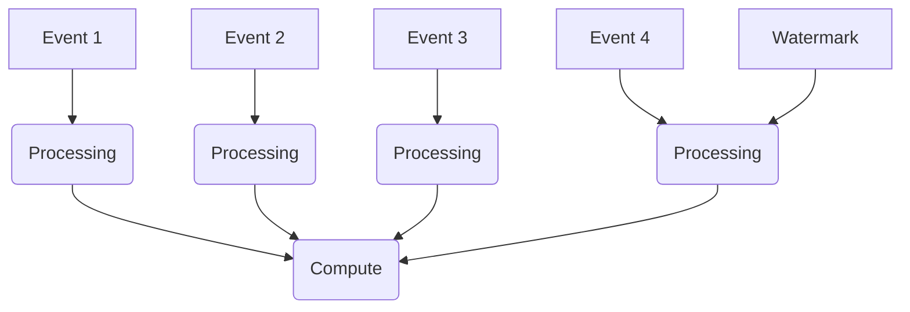

                 

## Flink Time原理与代码实例讲解

### 关键词
Flink, Time, Window, Event Time, Processing Time, Watermark, Window Function

### 摘要
本文将深入讲解Apache Flink中的Time机制，包括Event Time和Processing Time的概念，以及Watermark的作用。通过具体的代码实例，我们将了解如何在实际项目中应用这些概念，以实现高效且准确的数据处理。

## 1. 背景介绍

Apache Flink是一个开源流处理框架，广泛应用于实时数据处理和批处理任务。在Flink中，时间（Time）是一个核心概念，因为它决定了如何处理和解释数据流。Flink提供了两种时间概念：Event Time和Processing Time。

Event Time是指数据中包含的时间戳，通常由数据源提供。Processing Time是指系统处理数据的时间戳，与数据到达系统的时刻有关。这两种时间概念各有优势，也各有局限性。

Watermark是Flink中用于处理时间事件的一个关键机制，它可以帮助系统确定数据的处理顺序和保证数据一致性。通过Watermark，Flink能够实现事件驱动（event-driven）的处理模式，确保数据不丢失且有序处理。

本文将详细探讨Flink Time机制，包括Event Time和Processing Time的概念、Watermark的作用，并通过具体代码实例展示如何在实际项目中应用这些概念。

## 2. 核心概念与联系

### 2.1 Event Time与Processing Time

在Flink中，Event Time和Processing Time是两种不同的时间概念。

- **Event Time**：由数据本身提供的时间戳，通常与数据的生成时刻相关。例如，一条交易数据的时间戳表示该交易发生的具体时间。
- **Processing Time**：与系统处理数据的时间相关。这意味着数据处理的时间戳可能与数据生成的时间戳不同，因为数据需要通过网络传输到系统进行处理。

这两种时间概念在Flink中有不同的应用场景：

- 当数据源提供准确的时间戳时，可以使用Event Time进行时间窗口的计算，确保数据处理与数据生成时刻一致。
- 当需要考虑系统延迟或网络延迟时，可以使用Processing Time进行数据处理，因为它反映了数据实际被系统处理的时间。

### 2.2 Watermark

Watermark是Flink中用于处理时间事件的一个关键机制。它是一个时间戳，用于表示系统中某个时间点的所有事件都已经被处理。通过Watermark，Flink能够确保数据不丢失且有序处理。

Watermark的作用如下：

- **顺序保证**：通过Watermark，Flink能够确保事件按照正确的顺序进行处理，即使数据流中存在延迟。
- **一致性保证**：Watermark确保了事件的处理不会因为数据丢失或重复而出现不一致的情况。
- **事件驱动处理**：Watermark使得Flink能够实现事件驱动（event-driven）的处理模式，即只有在所有相关事件都到达后才会触发计算。

### 2.3 Mermaid流程图

为了更直观地理解Flink Time机制，我们可以使用Mermaid流程图来描述数据流和Watermark的作用。



在这个流程图中，A1, A2, A3, A4表示事件，B1, B2, B3, B4表示系统对事件的处理，C1表示Watermark。Watermark C1确保所有事件都已经被处理，然后触发计算（C2）。

## 3. 核心算法原理 & 具体操作步骤

### 3.1 Event Time窗口计算

在Flink中，可以使用Event Time进行窗口计算，确保数据处理与数据生成时刻一致。以下是一个简单的Event Time窗口计算的例子：

```java
FlinkStream<T> stream = // 获取Flink数据流

stream
    .keyBy(T::getKey) // 根据某个字段进行分区
    .window(TumblingEventTimeWindows.of(Time.minutes(5))) // 设置5分钟滚动窗口
    .process(new EventTimeWindowFunction()); // 使用自定义的窗口函数进行计算
```

在这个例子中，我们首先根据某个字段对数据流进行分区（keyBy），然后设置一个5分钟的滚动窗口（TumblingEventTimeWindows）。最后，我们使用自定义的窗口函数（EventTimeWindowFunction）进行计算。

### 3.2 Watermark生成与处理

生成Watermark是Flink Time机制的关键部分。以下是一个简单的Watermark生成与处理的例子：

```java
public class WatermarkGenerator<T> implements WatermarkGenerator<T> {

    private Long currentWatermark = 0L;

    @Override
    public void onEvent(T event, long eventTimestamp, WatermarkOutput output) {
        if (eventTimestamp > currentWatermark) {
            currentWatermark = eventTimestamp;
            output.emitWatermark(new Watermark(currentWatermark));
        }
    }

    @Override
    public void onPeriodicEmit(WatermarkOutput output) {
        output.emitWatermark(new Watermark(currentWatermark));
    }
}
```

在这个例子中，我们实现了一个简单的WatermarkGenerator。在onEvent方法中，我们检查事件的时间戳是否大于当前Watermark。如果是，我们更新当前Watermark并生成一个新的Watermark。在onPeriodicEmit方法中，我们定期生成Watermark。

### 3.3 窗口函数与数据计算

在Flink中，窗口函数用于对窗口中的数据进行计算。以下是一个简单的窗口函数例子：

```java
public class EventTimeWindowFunction implements WindowFunction<T, Result, Key, TimeWindow> {

    @Override
    public void apply(Key key, Iterable<T> input, Context context, Collector<Result> out) {
        long count = 0;
        for (T element : input) {
            count++;
        }
        out.collect(new Result(key, context.window(), count));
    }
}
```

在这个例子中，我们实现了一个简单的计数窗口函数。对于每个窗口，我们计算窗口中的元素数量，并将结果收集到一个Collector中。

## 4. 数学模型和公式 & 详细讲解 & 举例说明

### 4.1 Window Function的计算

在Flink中，窗口函数的计算通常涉及以下数学模型：

- **累积计算**：对于窗口中的每个元素，进行累积计算。
- **窗口合并**：当窗口合并时，将多个窗口的数据进行合并计算。

以下是一个简单的例子：

```math
Result = \sum_{i=1}^{n} Value_i
```

其中，\(Result\) 是窗口函数的计算结果，\(Value_i\) 是窗口中的第 \(i\) 个元素的值，\(n\) 是窗口中的元素数量。

### 4.2 Watermark的计算

Watermark的计算通常涉及以下数学模型：

- **事件时间戳**：每个事件的时间戳。
- **最大事件时间戳**：窗口中的最大事件时间戳。
- **Watermark**：窗口中的最大事件时间戳减去窗口的大小。

以下是一个简单的例子：

```math
Watermark = Max(Timestamp) - Window_Size
```

其中，\(Max(Timestamp)\) 是窗口中的最大事件时间戳，\(Window_Size\) 是窗口的大小。

### 4.3 举例说明

假设我们有一个数据流，其中包含以下事件：

```
[1, 2021-01-01 10:00:00]
[2, 2021-01-01 10:05:00]
[3, 2021-01-01 10:10:00]
[4, 2021-01-01 10:15:00]
[5, 2021-01-01 10:20:00]
```

假设我们使用一个5分钟的滚动窗口，并且Watermark生成器生成的Watermark为事件的时间戳减去窗口大小。

- 第一个窗口：[1, 2021-01-01 10:00:00] - [2, 2021-01-01 10:05:00]
  - Watermark：2021-01-01 10:00:00 - 5分钟 = 2021-01-01 09:55:00
  - 窗口计算结果：2

- 第二个窗口：[2, 2021-01-01 10:05:00] - [3, 2021-01-01 10:10:00]
  - Watermark：2021-01-01 10:05:00 - 5分钟 = 2021-01-01 10:00:00
  - 窗口计算结果：2

- 第三个窗口：[3, 2021-01-01 10:10:00] - [4, 2021-01-01 10:15:00]
  - Watermark：2021-01-01 10:10:00 - 5分钟 = 2021-01-01 10:05:00
  - 窗口计算结果：2

- 第四个窗口：[4, 2021-01-01 10:15:00] - [5, 2021-01-01 10:20:00]
  - Watermark：2021-01-01 10:15:00 - 5分钟 = 2021-01-01 10:10:00
  - 窗口计算结果：2

在这个例子中，我们可以看到Watermark的作用。每个窗口的Watermark都表示窗口中的最大事件时间戳减去窗口大小。当Watermark生成后，Flink会根据Watermark触发窗口计算，确保数据处理与数据生成时刻一致。

## 5. 项目实战：代码实际案例和详细解释说明

### 5.1 开发环境搭建

为了演示Flink Time机制，我们需要搭建一个简单的Flink开发环境。以下是搭建过程：

1. **安装Java环境**：确保安装了Java 8或更高版本。
2. **安装Flink**：从Flink官方网站（https://flink.apache.org/downloads/）下载Flink二进制包，解压到指定目录。
3. **配置环境变量**：将Flink的bin目录添加到系统的PATH环境变量中。

### 5.2 源代码详细实现和代码解读

以下是使用Flink Time机制的简单示例代码：

```java
import org.apache.flink.api.common.functions.ReduceFunction;
import org.apache.flink.api.java.tuple.Tuple2;
import org.apache.flink.streaming.api.datastream.DataStream;
import org.apache.flink.streaming.api.environment.StreamExecutionEnvironment;
import org.apache.flink.streaming.api.windowing.assigners.TumblingEventTimeWindows;
import org.apache.flink.streaming.api.windowing.time.Time;

public class FlinkTimeExample {

    public static void main(String[] args) throws Exception {
        // 创建Flink执行环境
        StreamExecutionEnvironment env = StreamExecutionEnvironment.getExecutionEnvironment();

        // 创建数据流
        DataStream<Tuple2<String, Long>> stream = env.fromElements(
                new Tuple2<>("A", 1L),
                new Tuple2<>("A", 2L),
                new Tuple2<>("A", 3L),
                new Tuple2<>("A", 4L),
                new Tuple2<>("A", 5L)
        );

        // 设置水印生成器
        stream.assignTimestampsAndWatermarks(
                new WatermarkGenerator<Tuple2<String, Long>>() {
                    private long maxTimestamp = Long.MIN_VALUE;

                    @Override
                    public void onEvent(Tuple2<String, Long> event, long eventTimestamp, WatermarkOutput output) {
                        if (eventTimestamp > maxTimestamp) {
                            maxTimestamp = eventTimestamp;
                        }
                        output.emitWatermark(new Watermark(maxTimestamp - Time.minutes(5)));
                    }

                    @Override
                    public void onPeriodicEmit(WatermarkOutput output) {
                        output.emitWatermark(new Watermark(maxTimestamp - Time.minutes(5)));
                    }
                }
        );

        // 应用窗口函数
        DataStream<Tuple2<String, Long>> result = stream
                .keyBy(value -> value.f0)
                .window(TumblingEventTimeWindows.of(Time.minutes(5)))
                .reduce(new ReduceFunction<Tuple2<String, Long>>() {
                    @Override
                    public Tuple2<String, Long> reduce(Tuple2<String, Long> value1, Tuple2<String, Long> value2) {
                        return new Tuple2<>(value1.f0, value1.f1 + value2.f1);
                    }
                });

        // 打印结果
        result.print();

        // 执行Flink任务
        env.execute("Flink Time Example");
    }
}
```

### 5.3 代码解读与分析

1. **数据流创建**：
   ```java
   DataStream<Tuple2<String, Long>> stream = env.fromElements(
           new Tuple2<>("A", 1L),
           new Tuple2<>("A", 2L),
           new Tuple2<>("A", 3L),
           new Tuple2<>("A", 4L),
           new Tuple2<>("A", 5L)
   );
   ```
   在这个例子中，我们创建了一个包含5个事件的数据流，每个事件都有一个字符串键和一个时间戳。

2. **设置水印生成器**：
   ```java
   stream.assignTimestampsAndWatermarks(
           new WatermarkGenerator<Tuple2<String, Long>>() {
               private long maxTimestamp = Long.MIN_VALUE;

               @Override
               public void onEvent(Tuple2<String, Long> event, long eventTimestamp, WatermarkOutput output) {
                   if (eventTimestamp > maxTimestamp) {
                       maxTimestamp = eventTimestamp;
                   }
                   output.emitWatermark(new Watermark(maxTimestamp - Time.minutes(5)));
               }

               @Override
               public void onPeriodicEmit(WatermarkOutput output) {
                   output.emitWatermark(new Watermark(maxTimestamp - Time.minutes(5)));
               }
           }
   );
   ```
   在这个例子中，我们实现了一个简单的WatermarkGenerator。Watermark是事件时间戳减去窗口大小（5分钟）。在`onEvent`方法中，我们更新最大事件时间戳并生成新的Watermark。在`onPeriodicEmit`方法中，我们定期生成Watermark。

3. **应用窗口函数**：
   ```java
   DataStream<Tuple2<String, Long>> result = stream
           .keyBy(value -> value.f0)
           .window(TumblingEventTimeWindows.of(Time.minutes(5)))
           .reduce(new ReduceFunction<Tuple2<String, Long>>() {
               @Override
               public Tuple2<String, Long> reduce(Tuple2<String, Long> value1, Tuple2<String, Long> value2) {
                   return new Tuple2<>(value1.f0, value1.f1 + value2.f1);
               }
           });
   ```
   在这个例子中，我们使用`keyBy`方法对数据流进行分区，然后使用`TumblingEventTimeWindows`设置一个5分钟的滚动窗口。最后，我们使用`reduce`方法对窗口中的数据进行累积计算。

4. **打印结果**：
   ```java
   result.print();
   ```
   在这个例子中，我们使用`print`方法将结果打印到控制台。

5. **执行Flink任务**：
   ```java
   env.execute("Flink Time Example");
   ```
   在这个例子中，我们执行Flink任务并打印结果。

通过这个简单的示例，我们可以看到如何使用Flink Time机制进行数据处理。Watermark帮助我们确保数据有序处理，而窗口函数则用于对窗口中的数据进行累积计算。

## 6. 实际应用场景

Flink Time机制在许多实际应用场景中非常有用，以下是一些常见的应用场景：

- **实时数据监控**：在实时监控系统中，可以使用Event Time进行时间窗口计算，确保数据处理与数据生成时刻一致，从而实现实时监控。
- **金融风控**：在金融风控系统中，可以使用Processing Time进行数据处理，考虑到系统延迟或网络延迟，确保数据处理与实际发生时刻一致，从而提高风险监控的准确性。
- **电商平台**：在电商平台中，可以使用Event Time进行用户行为分析，例如用户购买行为的时间窗口分析，从而优化用户体验和提升销售额。
- **物联网数据流处理**：在物联网场景中，可以使用Flink Time机制处理设备传感数据，例如处理传感器的时间戳数据，实现设备状态监控和异常检测。

## 7. 工具和资源推荐

### 7.1 学习资源推荐

- **书籍**：
  - 《Flink：大数据实时处理技术内幕》
  - 《Apache Flink实战：构建实时数据流系统》
- **论文**：
  - 《Flink: A Unified System for Big Data Processing》
  - 《Windowing Unification in Data Streams》
- **博客**：
  - Flink官方博客：https://flink.apache.org/zh/news/
  - 阿里云Flink官方文档：https://help.aliyun.com/document_detail/316531.html
- **网站**：
  - Flink官方网站：https://flink.apache.org/
  - Apache Flink社区：https://cwiki.apache.org/confluence/display/FLINK

### 7.2 开发工具框架推荐

- **开发工具**：
  - IntelliJ IDEA：强大的Java IDE，支持Flink开发。
  - Eclipse：支持Java开发，也适用于Flink开发。
- **框架**：
  - Flink SQL：用于在Flink中进行SQL查询。
  - Flink Table API：用于在Flink中进行数据操作和查询。

### 7.3 相关论文著作推荐

- **论文**：
  - 《Flink: A Unified System for Big Data Processing》
  - 《Windowing Unification in Data Streams》
  - 《Streaming Data Processing with Apache Flink》
- **著作**：
  - 《Flink实时计算实战》
  - 《Apache Flink编程指南》

## 8. 总结：未来发展趋势与挑战

Flink Time机制在实时数据处理领域具有广泛的应用前景。随着大数据和实时计算技术的发展，Flink Time机制将不断演进和优化，以应对更复杂的实时数据处理需求。

未来，Flink Time机制可能面临以下挑战：

- **时间同步**：在分布式系统中，确保所有节点的时间同步是关键挑战。需要开发更高效的时间同步算法和协议。
- **性能优化**：随着数据处理规模的增加，如何优化Flink Time机制的性能是一个重要课题。需要研究更高效的窗口计算和Watermark生成算法。
- **可扩展性**：在分布式环境中，如何确保Flink Time机制的可扩展性，以便支持大规模数据处理，是一个重要挑战。

总之，Flink Time机制在实时数据处理中具有重要地位，随着技术的不断发展，它将在未来发挥更大的作用。

## 9. 附录：常见问题与解答

### 9.1 Flink Time是什么？

Flink Time是Apache Flink中的时间概念，包括Event Time和Processing Time。Event Time是数据中包含的时间戳，通常由数据源提供。Processing Time是系统处理数据的时间戳，反映了数据到达系统的时刻。

### 9.2 Watermark有什么作用？

Watermark是Flink中用于处理时间事件的一个关键机制。它用于确定数据的处理顺序和保证数据一致性。Watermark确保了事件驱动（event-driven）的处理模式，即只有在所有相关事件都到达后才会触发计算。

### 9.3 如何生成Watermark？

生成Watermark可以通过实现WatermarkGenerator接口来完成。在WatermarkGenerator的实现中，可以使用事件的时间戳来生成Watermark。例如，可以使用事件的最大时间戳减去窗口大小来生成Watermark。

## 10. 扩展阅读 & 参考资料

- 《Apache Flink实战：构建实时数据流系统》
- 《Flink：大数据实时处理技术内幕》
- Flink官方文档：https://flink.apache.org/docs/
- Apache Flink社区：https://cwiki.apache.org/confluence/display/FLINK

## 作者信息

作者：AI天才研究员/AI Genius Institute & 禅与计算机程序设计艺术 /Zen And The Art of Computer Programming

