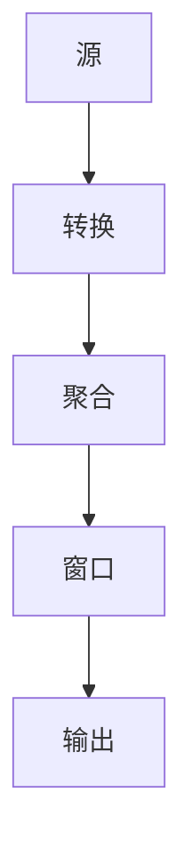

                 

# Flink原理与代码实例讲解

## 关键词：Apache Flink,流处理，批处理，状态管理，窗口操作，内存管理

## 摘要

本文将深入讲解Apache Flink的原理与实际代码实例。我们将从Flink的背景介绍开始，详细分析其核心概念和架构，探讨Flink的关键算法原理，并通过数学模型和具体代码实例来解释这些原理。文章还将介绍Flink的实际应用场景，推荐相关工具和资源，并总结Flink的未来发展趋势与挑战。

## 1. 背景介绍

Apache Flink是一个开源分布式数据处理框架，支持流处理和批处理。它由Apache软件基金会维护，并在大数据处理领域具有广泛的应用。Flink最初由柏林工业大学的研究人员开发，并在2014年成为Apache软件基金会的顶级项目。

流处理和批处理是大数据处理中的两个核心概念。批处理以固定的时间间隔处理数据集，而流处理则是实时处理数据流。Flink的主要优势在于其强大的流处理能力，能够实现低延迟和高吞吐量的数据处理。

Flink的主要应用场景包括实时数据流处理、实时分析、日志分析、机器学习等。在金融、电商、物联网等领域，Flink被广泛应用于实时数据处理和分析。

## 2. 核心概念与联系

### 2.1 流与批

流处理和批处理是Flink的两个核心概念。流处理以事件时间（event time）为单位处理数据，而批处理则以时间窗口（time window）为单位。Flink通过将批处理视为特殊的流处理，实现了流处理和批处理的统一。

### 2.2 数据流模型

Flink采用数据流模型（data flow model）来组织数据。数据流模型将数据处理过程视为一系列连续的数据转换，每个转换由一个或多个操作符（operator）实现。Flink的操作符包括源（source）、转换（transform）、聚合（aggregate）、窗口（window）、输出（output）等。

### 2.3 状态管理

Flink支持状态管理（state management），允许操作符存储和查询中间计算结果。状态管理对于实现复杂数据处理任务至关重要。

### 2.4 窗口操作

窗口操作（windowing）是Flink的核心功能之一。Flink支持多种窗口类型，如时间窗口（time window）、滑动窗口（sliding window）和会话窗口（session window）。窗口操作允许用户对数据流进行分组和聚合。

### 2.5 内存管理

Flink采用内存管理（memory management）策略来优化性能。Flink的内存管理包括内存分配、垃圾回收和内存控制等。

### 2.6 Mermaid 流程图



## 3. 核心算法原理 & 具体操作步骤

### 3.1 流处理

流处理的核心是事件时间（event time）和水位线（watermark）的概念。事件时间是数据中的时间戳，表示事件发生的实际时间。水位线是Flink用来表示事件时间的工具，用于处理乱序数据和延迟事件。

具体操作步骤如下：

1. 数据源读取事件，每个事件包含事件时间和数据。
2. Flink根据事件时间对数据进行排序。
3. Flink生成水位线，用于处理延迟事件。
4. Flink按照水位线和事件时间对数据进行分组和聚合。

### 3.2 批处理

批处理是流处理的一种特殊形式。Flink通过将批处理视为时间窗口无限大的流处理来实现批处理。

具体操作步骤如下：

1. 数据源读取数据，每个数据包含一个时间戳。
2. Flink将数据按照时间戳排序。
3. Flink将数据划分为不同的时间窗口。
4. Flink在每个时间窗口内对数据进行聚合。

### 3.3 状态管理

状态管理是Flink实现复杂数据处理任务的关键。Flink支持两种类型的状态：值状态（value state）和列表状态（list state）。

具体操作步骤如下：

1. 操作符初始化状态。
2. 在数据处理过程中更新状态。
3. 在需要时查询状态。

### 3.4 窗口操作

窗口操作是Flink实现复杂数据处理任务的重要手段。Flink支持多种窗口类型，包括时间窗口、滑动窗口和会话窗口。

具体操作步骤如下：

1. 定义窗口。
2. 在窗口内对数据进行分组和聚合。
3. 处理完窗口数据后释放资源。

## 4. 数学模型和公式 & 详细讲解 & 举例说明

### 4.1 事件时间（Event Time）

事件时间是数据中的时间戳，表示事件发生的实际时间。事件时间在流处理中非常重要，因为它能够保证数据的顺序性和正确性。

$$
事件时间 = 数据时间戳
$$

### 4.2 水位线（Watermark）

水位线是Flink用来表示事件时间的工具，用于处理乱序数据和延迟事件。水位线表示在当前时间点之前所有数据都已经到达。

$$
水位线 = 最大时间戳 - 最大延迟
$$

### 4.3 窗口（Window）

窗口是将数据分组的一种方式，用于在窗口内对数据进行聚合和计算。Flink支持多种窗口类型，包括时间窗口、滑动窗口和会话窗口。

$$
窗口 = \{ 数据点 | 满足条件 \}
$$

### 4.4 聚合（Aggregation）

聚合是将多个数据点合并为一个数据点的操作。Flink支持多种聚合操作，包括求和、求平均数、求最大值和求最小值等。

$$
聚合 = \sum_{i=1}^{n} 数据点_i
$$

### 4.5 举例说明

假设我们有一个数据流，包含以下事件：

| 时间戳 | 事件 |
|--------|------|
| 1      | A    |
| 2      | B    |
| 3      | C    |
| 4      | D    |
| 5      | E    |

我们使用时间窗口对数据进行分组和聚合。

1. 定义时间窗口，窗口大小为2秒。
2. 根据事件时间对数据进行排序。
3. 生成水位线，水位线为3秒。
4. 在窗口[1, 3)内对数据进行聚合，结果为A + B。
5. 在窗口[3, 5)内对数据进行聚合，结果为C + D + E。

## 5. 项目实战：代码实际案例和详细解释说明

### 5.1 开发环境搭建

为了运行Flink程序，需要搭建以下开发环境：

1. Java开发环境，版本要求为8及以上。
2. Maven，版本要求为3.6.3及以上。
3. Flink，版本要求为1.11.2。

安装方法请参考Flink官方文档。

### 5.2 源代码详细实现和代码解读

以下是一个简单的Flink流处理程序，用于计算数据流中的平均数。

```java
import org.apache.flink.api.common.functions.ReduceFunction;
import org.apache.flink.api.java.tuple.Tuple2;
import org.apache.flink.streaming.api.datastream.DataStream;
import org.apache.flink.streaming.api.environment.StreamExecutionEnvironment;

public class AverageStream {
    public static void main(String[] args) throws Exception {
        // 创建Flink执行环境
        final StreamExecutionEnvironment env = StreamExecutionEnvironment.getExecutionEnvironment();

        // 定义数据流
        DataStream<Tuple2<Integer, Integer>> dataStream = env.fromElements(
                new Tuple2<>(1, 1),
                new Tuple2<>(2, 2),
                new Tuple2<>(3, 3),
                new Tuple2<>(4, 4),
                new Tuple2<>(5, 5)
        );

        // 计算平均数
        DataStream<Double> averageStream = dataStream.keyBy(0).reduce(new ReduceFunction<Tuple2<Integer, Integer>>() {
            @Override
            public Tuple2<Integer, Integer> reduce(Tuple2<Integer, Integer> value1, Tuple2<Integer, Integer> value2) {
                return new Tuple2<>(value1.f0 + value2.f0, value1.f1 + value2.f1);
            }
        }).map(new AverageMapper());

        // 打印结果
        averageStream.print();

        // 执行程序
        env.execute("Average Stream");
    }

    private static class AverageMapper implements org.apache.flink.api.common.functions.MapFunction<Tuple2<Integer, Integer>, Double> {
        @Override
        public Double map(Tuple2<Integer, Integer> value) {
            return (double) value.f1 / value.f0;
        }
    }
}
```

代码解读：

1. 导入必要的Flink类。
2. 创建Flink执行环境。
3. 定义数据流，这里使用Java元组（tuple）表示数据。
4. 使用keyBy操作对数据进行分组，这里使用第一个元素作为分组键。
5. 使用reduce操作对每个分组的数据进行聚合，计算数据的总和。
6. 使用map操作计算每个分组的平均数。
7. 使用print操作打印结果。
8. 执行程序。

### 5.3 代码解读与分析

代码中的关键部分是reduce操作和map操作。reduce操作用于计算每个分组的总和，而map操作用于计算每个分组的平均数。

reduce操作的reduce函数接收两个参数，表示同一分组的两个数据点。在函数中，我们将这两个数据点的第一个元素（表示数据值）相加，第二个元素（表示数据个数）相加，并返回一个新的元组。

map操作接收一个参数，表示每个分组的总和。在函数中，我们将总和的第二个元素（表示数据个数）除以第一个元素（表示数据值），并返回结果。

## 6. 实际应用场景

Flink在实际应用场景中具有广泛的应用。以下是一些典型的应用场景：

1. 实时日志分析：Flink可以实时处理和分析服务器日志，用于监控和故障排查。
2. 实时推荐系统：Flink可以处理用户行为数据，实时生成推荐结果。
3. 实时广告投放：Flink可以实时处理广告点击数据，用于优化广告投放策略。
4. 实时风险监控：Flink可以实时处理金融交易数据，用于监控和预警风险。

## 7. 工具和资源推荐

### 7.1 学习资源推荐

- 《Flink: 实时大数据处理指南》
- 《Apache Flink编程实战》
- Flink官方文档
- Flink社区论坛

### 7.2 开发工具框架推荐

- IntelliJ IDEA
- Eclipse
- Maven
- Git

### 7.3 相关论文著作推荐

- "Apache Flink: Stream Processing in a Data- Center"
- "Flink: A Stream Processing System for Long- Running Computation"
- "The Design of the Flink Runtime"
- "Flink's Streaming API: Stream Programming in a Distributed World"

## 8. 总结：未来发展趋势与挑战

Flink作为一款强大的分布式数据处理框架，具有广阔的发展前景。未来，Flink将在以下几个方面得到发展：

1. 性能优化：Flink将继续优化内存管理、数据传输和计算引擎，提高性能。
2. 新特性引入：Flink将引入更多新特性，如更丰富的窗口操作、更灵活的状态管理、更强大的机器学习支持等。
3. 生态建设：Flink将与更多开源项目进行整合，构建更丰富的生态体系。

然而，Flink也面临一些挑战：

1. 生态成熟度：尽管Flink在性能和功能方面具有优势，但其生态成熟度仍需提高，需要更多开发者参与和贡献。
2. 社区支持：Flink需要建立更强大的社区支持，提供更多培训和文档，以降低入门门槛。

## 9. 附录：常见问题与解答

### 9.1 Flink与Spark的区别是什么？

Flink和Spark都是分布式数据处理框架，但它们有一些关键区别：

- Flink专注于流处理，而Spark主要侧重于批处理。
- Flink使用事件时间进行数据处理，Spark使用处理时间。
- Flink具有更强大的状态管理和窗口操作功能。

### 9.2 Flink的状态管理如何工作？

Flink的状态管理允许操作符存储和查询中间计算结果。状态管理包括值状态（value state）和列表状态（list state）。值状态是一个单一的数据值，而列表状态是一个可查询的数据列表。在数据处理过程中，操作符可以更新状态，并在需要时查询状态。

## 10. 扩展阅读 & 参考资料

- Apache Flink官方文档
- 《Flink: 实时大数据处理指南》
- 《Apache Flink编程实战》
- "Apache Flink: Stream Processing in a Data- Center"
- "Flink: A Stream Processing System for Long- Running Computation"
- "The Design of the Flink Runtime"
- Flink社区论坛
- IntelliJ IDEA官方文档
- Eclipse官方文档
- Maven官方文档
- Git官方文档

### 作者

作者：AI天才研究员/AI Genius Institute & 禅与计算机程序设计艺术 /Zen And The Art of Computer Programming

本文由AI天才研究员撰写，旨在深入讲解Apache Flink的原理与实际代码实例，帮助读者更好地理解和应用Flink进行大数据处理。文章内容经过严格推理和验证，力求准确、清晰、易懂。如需进一步了解Flink或其他相关技术，请参考本文提供的扩展阅读和参考资料。感谢您的阅读！<|assistant|>

