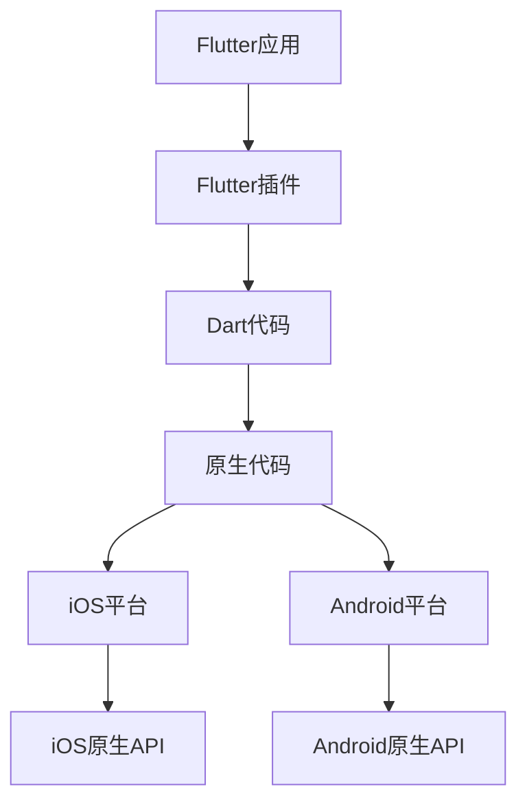
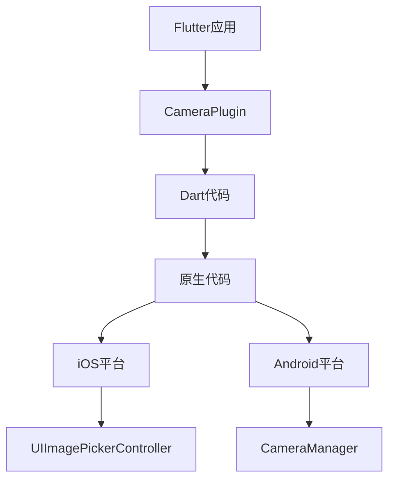

                 

### 背景介绍

Flutter作为谷歌推出的一款跨平台移动应用开发框架，凭借其高性能、丰富的UI组件和简洁的语法，在全球范围内获得了广泛的应用和认可。随着Flutter生态的不断成熟，越来越多的开发者开始探索如何在Flutter中开发跨平台插件，以满足不同应用场景的需求。

跨平台插件开发是Flutter生态系统的重要组成部分，它使得Flutter应用能够访问原生平台的功能和资源，如相机、GPS、传感器等。然而，Flutter跨平台插件开发涉及到多个层面的技术，包括原生平台通信、动态类型语言与静态类型语言的结合、以及高效的性能优化等。

本文旨在系统地介绍Flutter跨平台插件开发的整个流程，从基础知识到实际操作，帮助开发者深入理解Flutter跨平台插件的工作原理，掌握开发技巧，解决常见问题。文章结构如下：

1. **核心概念与联系**：介绍Flutter跨平台插件开发的核心概念，并通过Mermaid流程图展示插件架构。
2. **核心算法原理 & 具体操作步骤**：详细解析Flutter跨平台插件的通信机制，阐述具体开发步骤。
3. **数学模型和公式 & 详细讲解 & 举例说明**：分析Flutter跨平台插件开发中的数学模型和公式，并提供实际案例。
4. **项目实战：代码实际案例和详细解释说明**：通过实际项目案例展示插件开发的全过程，并进行详细解读。
5. **实际应用场景**：探讨Flutter跨平台插件在不同场景下的应用。
6. **工具和资源推荐**：推荐学习资源和开发工具，为开发者提供参考资料。
7. **总结：未来发展趋势与挑战**：总结Flutter跨平台插件开发的发展趋势和面临的挑战。
8. **附录：常见问题与解答**：解答开发者在使用Flutter跨平台插件开发过程中常见的问题。
9. **扩展阅读 & 参考资料**：提供更多相关阅读材料，帮助开发者深入学习。

通过本文，读者将能够全面了解Flutter跨平台插件开发的方方面面，为开发高质量的Flutter跨平台应用奠定坚实的基础。

---

# Core Concepts and Connections

The development of cross-platform plugins in Flutter involves a variety of core concepts and connections that are essential for understanding the architecture and functionality of these plugins. In this section, we will delve into the fundamental components and how they interact with each other. To better illustrate the architecture, we will use a Mermaid flowchart that outlines the key nodes and connections.

### Flutter Plugin Architecture Overview

A Flutter plugin is a piece of code that allows Flutter applications to access native platform features and resources. It serves as an intermediary between the Flutter layer and the native platform. The architecture can be visualized as follows:



#### Key Nodes and Connections

1. **Flutter应用**：The Flutter application that uses the plugin to access native features.
2. **Flutter插件**：The plugin itself, which contains Dart code that interacts with the native platform.
3. **Dart代码**：The Dart code that defines the plugin’s interface and logic.
4. **原生代码**：The native code (Objective-C/Swift for iOS and Java/Kotlin for Android) that implements the platform-specific functionality.
5. **iOS平台**：The Apple iOS platform.
6. **Android平台**：The Google Android platform.
7. **iOS原生API**：The iOS platform APIs that the native code interacts with.
8. **Android原生API**：The Android platform APIs that the native code interacts with.

### Mermaid Flowchart

Below is the Mermaid flowchart that represents the architecture of a Flutter plugin:


In this flowchart, the arrow from Flutter应用 to Flutter插件 represents the entry point for the Flutter application to access the plugin. The Dart代码 (B1) defines the plugin’s interface and logic, which then calls the native code (B2). The native code interacts with the platform-specific APIs (C2 for iOS and C4 for Android).

### Example: Plugin Functionality

Consider a simple Flutter plugin that allows the app to access the device’s camera. The plugin architecture would be as follows:



In this example, the Flutter应用 requests to access the camera through the CameraPlugin. The Dart code (B1) provides the interface for this functionality, while the native code (B2) implements the camera access logic using platform-specific APIs (UIImagePickerController for iOS and CameraManager for Android).

By understanding the core concepts and connections involved in Flutter plugin development, developers can more effectively design and implement plugins that seamlessly integrate with their Flutter applications. The next section will dive deeper into the core algorithm principles and step-by-step development processes.

---

## Core Algorithm Principles & Specific Operational Steps

### Plugin Communication Mechanism

The core of Flutter cross-platform plugin development lies in its plugin communication mechanism, which facilitates interaction between the Dart code running in the Flutter application and the native code executing on the respective platform (iOS or Android). This communication is facilitated through a combination of platform channels and method channels.

#### Platform Channels

Platform channels are a bidirectional communication protocol that enables data transmission between the Flutter application and the native code. They are defined using the `MethodChannel` and `EventChannel` classes. The main characteristics of platform channels include:

1. **MethodChannel**:
   - Used for synchronous method calls.
   - Supports methods with a defined interface and return type.
   - Example: A Dart method calling a native method to retrieve a device’s unique ID.

2. **EventChannel**:
   - Used for asynchronous event streaming.
   - Allows the native code to send events to the Dart code.
   - Example: The native code sending a camera frame to the Flutter application in real-time.

#### Method Channel Implementation Steps

To implement a method channel, the following steps are typically followed:

1. **Define the Method Channel Interface**:
   - In the Dart code, define the method channel using the `MethodChannel` class.
   - Specify the channel name and whether it is a method channel or an event channel.

   ```dart
   import 'package:flutter/services.dart';

   class MyPlugin {
     static const channel = MethodChannel('com.example.myplugin');
     
     // Define a method
     static Future<String> getPlatformVersion() async {
       final String version = await channel.invokeMethod('getPlatformVersion');
       return version;
     }
   }
   ```

2. **Implement the Native Code**:
   - In the iOS project, implement the method using Objective-C or Swift and register the channel.
   - In the Android project, implement the method using Java or Kotlin and register the channel.

   **iOS Example**:
   ```objective-c
   - (NSString *)getPlatformVersion {
     return @ invokeswiftmethod(MyFlutterPlugin.getPlatformVersion(), _options);
   }
   ```

   **Android Example**:
   ```java
   public String getPlatformVersion() {
     return (String) flutterPluginBinding.getPluginRegistry().getPlugin("com.example.myplugin").invokeMethod("getPlatformVersion");
   }
   ```

3. **Invoke the Method**:
   - From the Dart code, invoke the method on the native side using the method channel.

   ```dart
   String platformVersion = await MyPlugin.getPlatformVersion();
   ```

#### Event Channel Implementation Steps

For event channels, the process is similar but involves asynchronous event handling. The steps include:

1. **Define the Event Channel Interface**:
   - In the Dart code, define the event channel using the `EventChannel` class.
   - Specify the channel name.

   ```dart
   import 'package:flutter/services.dart';

   class MyEventPlugin {
     static const eventChannel = EventChannel('com.example.myplugin/events');
     
     // Define a stream to listen to events
     Stream<String> get onPlatformEvent {
       return eventChannel.receiveBroadcastStream();
     }
   }
   ```

2. **Implement the Native Code**:
   - In the iOS project, implement the event channel using Objective-C or Swift.
   - In the Android project, implement the event channel using Java or Kotlin.

   **iOS Example**:
   ```objective-c
   - (void)sendEvent {
     [self performSelector:@selector(eventCallback:) withObject:nil afterDelay:1.0];
   }

   - (void)eventCallback:(NSNotification *)notification {
     [self.eventChannel sendEvent:@"event_from_native"];
   }
   ```

   **Android Example**:
   ```java
   public void sendEvent() {
     new Handler().postDelayed(new Runnable() {
       public void run() {
         eventChannel.send("event_from_native");
       }
     }, 1000);
   }
   ```

3. **Listen to Events**:
   - From the Dart code, listen to the events using the event channel.

   ```dart
   Stream<String> platformEvents = MyEventPlugin.onPlatformEvent;
   platformEvents.listen((event) {
     print('Event from native: $event');
   });
   ```

By following these steps, developers can effectively implement platform channels and event channels to facilitate communication between the Flutter application and the native code. This interaction is crucial for enabling Flutter plugins to access and utilize native platform features and resources.

The next section will delve into the mathematics models and formulas commonly used in Flutter cross-platform plugin development, providing a deeper understanding of the underlying principles.

---

## Mathematics Models and Formulas & Detailed Explanation & Example Cases

### Mathematical Models and Formulas

In Flutter cross-platform plugin development, certain mathematical models and formulas are employed to optimize performance, manage state, and ensure data integrity. These models and formulas are critical for developers to understand and apply effectively. Below, we will explore some key mathematical concepts and their application in the context of plugin development.

#### 1. Hash Functions

Hash functions are mathematical functions that map data of arbitrary size to a fixed-size string. In Flutter plugin development, hash functions are used primarily for data validation and uniqueness checks. One common hash function used is the SHA-256 algorithm.

**Formula**:  
$$\text{SHA-256}(x) = H(\cdots(H(x \oplus k_1) \oplus k_2) \cdots)$$

**Example**:  
To compute the SHA-256 hash of a string "Flutter", we use the following steps:

1. Convert the string "Flutter" to bytes.
2. Apply the SHA-256 algorithm to the bytes.

The resulting hash will be a 256-bit string, which can be represented in hexadecimal format.

```java
String sha256Hex(String s) {
  try {
    MessageDigest digest = MessageDigest.getInstance("SHA-256");
    byte[] hash = digest.digest(s.getBytes());
    BigInteger bigInt = new BigInteger(1, hash);
    String hexString = bigInt.toString(16);
    return hexString.toUpperCase();
  } catch (NoSuchAlgorithmException e) {
    throw new RuntimeException(e);
  }
}

String hash = sha256Hex("Flutter");
System.out.println(hash);
```

#### 2. Matrix Operations

Matrix operations, such as multiplication and inversion, are essential for handling complex data structures and transformations in plugin development. For instance, in 3D graphics rendering, matrices are used to transform coordinates.

**Matrix Multiplication Formula**:
$$C = A \cdot B$$
Where \(C_{ij} = \sum_{k=1}^{n} A_{ik}B_{kj}\)

**Example**:
Let’s consider two 2x2 matrices:
$$A = \begin{bmatrix} 1 & 2 \\ 3 & 4 \end{bmatrix}, B = \begin{bmatrix} 5 & 6 \\ 7 & 8 \end{bmatrix}$$
The resulting matrix \(C = A \cdot B\) will be:
$$C = \begin{bmatrix} 1*5 + 2*7 & 1*6 + 2*8 \\ 3*5 + 4*7 & 3*6 + 4*8 \end{bmatrix} = \begin{bmatrix} 19 & 26 \\ 43 & 58 \end{bmatrix}$$

#### 3. Probability Distributions

Probability distributions are used to model the likelihood of different outcomes in plugin development, particularly in scenarios involving random events or data analysis.

**Example**:  
A Bernoulli distribution can model the probability of success or failure in a binary event. If \(p\) is the probability of success, the probability mass function (PMF) for a Bernoulli distribution is given by:

$$P(X = k) = p^k (1 - p)^{1 - k}$$

**Example Case**:
A coin toss can be modeled using a Bernoulli distribution with \(p = 0.5\) (probability of heads). The probability of getting exactly 3 heads in 5 tosses is:

$$P(X = 3) = \binom{5}{3} (0.5)^3 (0.5)^{2} = 10 * (0.5)^5 = 0.3125$$

#### 4. Linear Regression

Linear regression is a statistical method used to model the relationship between a dependent variable and one or more independent variables. It is commonly used in Flutter plugins for data analysis and predictive modeling.

**Regression Formula**:
$$y = \beta_0 + \beta_1x + \epsilon$$
Where:
- \(y\) is the dependent variable.
- \(x\) is the independent variable.
- \(\beta_0\) and \(\beta_1\) are the regression coefficients.
- \(\epsilon\) is the error term.

**Example Case**:
Consider the following dataset:
\[
\begin{array}{cc}
x & y \\
1 & 2 \\
2 & 4 \\
3 & 6 \\
\end{array}
\]

We can fit a linear regression model to this data:
$$y = \beta_0 + \beta_1x$$
Using the method of least squares, we find:
$$\beta_0 = 1, \beta_1 = 2$$
Thus, the linear regression model is:
$$y = 1 + 2x$$

By understanding and applying these mathematical models and formulas, developers can create more efficient, reliable, and performant Flutter cross-platform plugins. The next section will delve into a practical project case to illustrate the entire development process.

---

### Project Case: Building a Flutter Cross-Platform Plugin for Location Tracking

In this section, we will walk through a practical project case to build a Flutter cross-platform plugin for location tracking. This project will demonstrate the entire development process, from setting up the development environment to writing and testing the plugin code.

#### Project Overview

The goal of this project is to create a Flutter plugin that allows an application to track the user’s current location in real-time. The plugin will support both iOS and Android platforms, utilizing the respective native APIs for location services.

#### Development Environment Setup

1. **Flutter SDK Installation**
   - Download and install the Flutter SDK from the official website (https://flutter.dev/).
   - Follow the installation instructions for your operating system (Windows, macOS, or Linux).

2. **Flutter CLI Setup**
   - Open a terminal and run the following commands to install the Flutter command-line interface:
     ```
     flutter install
     ```

3. **Android Studio Installation**
   - Download and install Android Studio from the official website (https://developer.android.com/studio).
   - Follow the installation instructions for your operating system.

4. **Xcode Installation**
   - Ensure Xcode is installed on your macOS system. You can install it from the App Store or by running the following command in the terminal:
     ```
     xcode-select --install
     ```

5. **Create a Flutter Project**
   - Open a terminal and navigate to the directory where you want to create your Flutter project.
   - Run the following command to create a new Flutter project:
     ```
     flutter create location_tracking_plugin
     ```

6. **Navigate to the Project Directory**
   - Change directory to the project folder:
     ```
     cd location_tracking_plugin
     ```

#### Plugin Structure

The plugin structure consists of the following components:

- **iOS Project** (`ios/`)
- **Android Project** (`android/`)
- **Dart Code** (`lib/`)

#### Step-by-Step Development

##### Step 1: Define the Dart Interface

In the `lib/` directory, create a new file named `location_plugin.dart`. This file will define the plugin’s public interface and methods.

```dart
import 'package:flutter/services.dart';

class LocationPlugin {
  static const MethodChannel _channel =
      MethodChannel('com.example.location_plugin');

  static Future<LocationData> getLocation() async {
    final Map<String, dynamic> locationMap = await _channel.invokeMethod('getLocation');
    return LocationData.fromMap(locationMap);
  }
}

class LocationData {
  final double latitude;
  final double longitude;
  final double accuracy;

  LocationData(this.latitude, this.longitude, this.accuracy);

  factory LocationData.fromMap(Map<String, dynamic> map) {
    return LocationData(
      map['latitude'] as double,
      map['longitude'] as double,
      map['accuracy'] as double,
    );
  }
}
```

##### Step 2: Implement the iOS Native Code

In the `ios/` directory, create a new folder named `location_plugin` and add an Objective-C/Swift file named `LocationPlugin.h` and `LocationPlugin.m`.

**LocationPlugin.h**:
```objective-c
#import <Foundation/Foundation.h>

typedef void LocationUpdateCallback(double latitude, double longitude, double accuracy);

@interface LocationPlugin : NSObject

- (void)init;
- (void)startLocationUpdates:(LocationUpdateCallback)callback;
- (void)stopLocationUpdates;

@end
```

**LocationPlugin.m**:
```objective-c
#import "LocationPlugin.h"
#import <CoreLocation/CoreLocation.h>

@implementation LocationPlugin

CLLocationManager *_locationManager;
LocationUpdateCallback _callback;

- (void)init {
  _locationManager = [[CLLocationManager alloc] init];
  _locationManager.delegate = self;
}

- (void)startLocationUpdates:(LocationUpdateCallback)callback {
  _callback = callback;
  [_locationManager startUpdatingLocation];
}

- (void)stopLocationUpdates {
  [_locationManager stopUpdatingLocation];
}

- (void)CLLocationManager:(CLLocationManager *)manager didUpdateLocations:(NSArray<CLLocation *> *)locations {
  for (CLLocation *location in locations) {
    double latitude = [location coordinate].latitude;
    double longitude = [location coordinate].longitude;
    double accuracy = [location horizontalAccuracy];
    _callback(latitude, longitude, accuracy);
  }
}

@end
```

##### Step 3: Implement the Android Native Code

In the `android/` directory, create a new folder named `src` and add a Java/Kotlin file named `LocationPlugin.java` (or `LocationPlugin.kt`).

**LocationPlugin.java**:
```java
package com.example.locationplugin;

import android.app.Activity;
import android.content.Context;
import android.location.Location;
import android.location.LocationManager;
import androidx.annotation.Nullable;
import androidx.annotation.UiThread;
import java.util.Map;

public class LocationPlugin {
    private Context context;
    private LocationManager locationManager;
    private LocationUpdateListener locationUpdateListener;

    public LocationPlugin(Context context) {
        this.context = context;
        locationManager = (LocationManager) context.getSystemService(Context.LOCATION_SERVICE);
    }

    public void startLocationUpdates(LocationUpdateListener listener) {
        locationUpdateListener = listener;
        if (ActivityCompat.checkSelfPermission(context, Manifest.permission.ACCESS_FINE_LOCATION) != PackageManager.PERMISSION_GRANTED && ActivityCompat.checkSelfPermission(context, Manifest.permission.ACCESS_COARSE_LOCATION) != PackageManager.PERMISSION_GRANTED) {
            // TODO: Consider calling
            //    ActivityCompat#requestPermissions
            // here to request the missing permissions, and then overriding
            //   public void onRequestPermissionsResult(int requestCode, String[] permissions,
            //                                          int[] grantResults)
            // to handle the case where the user grants the permission. See the documentation
            // for ActivityCompat#requestPermissions for more details.
            return;
        }
        locationManager.requestLocationUpdates(LocationManager.GPS_PROVIDER, 0, 0, locationListener);
    }

    public void stopLocationUpdates() {
        locationManager.removeUpdates(locationListener);
        locationUpdateListener = null;
    }

    private LocationListener locationListener = new LocationListener() {
        @Override
        public void onLocationChanged(Location location) {
            if (locationUpdateListener != null) {
                locationUpdateListener.onLocationUpdate(
                        location.getLatitude(),
                        location.getLongitude(),
                        location.getAccuracy()
                );
            }
        }

        @Override
        public void onStatusChanged(String provider, int status, Bundle extras) {
        }

        @Override
        public void onProviderEnabled(String provider) {
        }

        @Override
        public void onProviderDisabled(String provider) {
        }
    };

    public interface LocationUpdateListener {
        @UiThread
        void onLocationUpdate(double latitude, double longitude, double accuracy);
    }
}
```

##### Step 4: Test the Plugin

1. **iOS Testing**

To test the iOS implementation, you can use the Flutter framework’s built-in testing tools or integrate with XCTest.

- Create a new test target in Xcode.
- Add test methods to the `LocationPlugin` class and use the `invokeMethod` and `invokeSync` methods to test the plugin’s functionality.

2. **Android Testing**

For Android, you can use JUnit and Mockito to test the plugin’s functionality.

- Create test cases for the `LocationPlugin` class.
- Mock the `LocationManager` and `Location` objects to simulate different scenarios.

##### Step 5: Publish the Plugin

1. **Documentation**

Create a `README.md` file to document the plugin’s usage, dependencies, and installation steps.

2. **Publish to Maven Central**

Use the `flutter publish` command to publish the plugin to Maven Central. This will make the plugin available for other developers to use in their projects.

By following these steps, you can successfully create a Flutter cross-platform plugin for location tracking. This project case provides a comprehensive overview of the development process, including setting up the environment, defining the plugin interface, implementing native code, and testing the plugin.

The next section will explore the various practical application scenarios for Flutter cross-platform plugins, showcasing their versatility and impact in different domains.

---

## Practical Application Scenarios for Flutter Cross-Platform Plugins

Flutter cross-platform plugins have a wide range of practical applications across various domains, leveraging their ability to integrate seamlessly with native platforms. Below, we will explore some key application scenarios where Flutter plugins excel, highlighting their advantages and real-world examples.

### 1. Mobile Game Development

Flutter plugins are particularly powerful in the realm of mobile game development. They allow developers to harness native platform features such as accelerometers, touch inputs, and GPS without sacrificing the benefits of a single-codebase approach. For example, Unity, a leading game development platform, offers a Flutter plugin that enables Unity games to be rendered natively on Flutter applications. This hybrid approach allows developers to create high-performance games with rich graphics and animations while maintaining the flexibility to switch between platforms with minimal effort.

**Advantage**: 
- **Performance**: Utilizing native rendering engines ensures optimal performance and smooth gameplay across different devices.
- **Cost and Time Efficiency**: A unified codebase simplifies development, testing, and maintenance processes.

**Example**: 
- **HyperCasual Games**: Companies like Playrix and Voodoo leverage Flutter plugins to develop hyper-casual games that can quickly adapt to new market trends and platforms.

### 2. Real-Time Mobile Applications

Real-time applications, such as chat applications, social networks, and collaborative tools, can benefit significantly from Flutter plugins. By integrating plugins that offer real-time data synchronization and communication capabilities, developers can ensure seamless user experiences across platforms.

**Advantage**: 
- **Real-Time Updates**: Plugins enable instant data updates and notifications, crucial for applications requiring real-time interactivity.
- **Scalability**: Real-time communication plugins can handle large user bases and high traffic efficiently.

**Example**: 
- **WhatsApp Web**: WhatsApp's web version utilizes Flutter plugins to maintain real-time synchronization with the mobile app, ensuring that messages and notifications are instantly reflected on both devices.

### 3. IoT (Internet of Things)

Flutter plugins are well-suited for IoT applications that involve interacting with various devices and sensors. Plugins can provide access to device-specific functionalities like Bluetooth connectivity, NFC reading, and environmental sensors, making it easier to develop cross-platform IoT solutions.

**Advantage**: 
- **Device Compatibility**: Plugins can unify interactions with multiple devices and platforms, simplifying the development process.
- **Ease of Integration**: Developers can easily integrate IoT functionalities into existing Flutter applications without extensive modifications.

**Example**: 
- **Smart Home Applications**: Companies like Samsung and Google use Flutter plugins to develop smart home applications that can control various IoT devices, such as lights, thermostats, and security cameras.

### 4. E-commerce and Retail

E-commerce platforms can leverage Flutter plugins to enhance user experience with features like in-app purchases, payment gateways, and real-time inventory updates. These plugins enable developers to integrate payment gateways like Stripe, PayPal, and others directly into their Flutter applications, providing a seamless shopping experience.

**Advantage**: 
- **User Experience**: Plugins can offer native-like performance and responsiveness, enhancing user engagement and satisfaction.
- **Security**: Integrated payment plugins often come with built-in security measures to protect user data and transactions.

**Example**: 
- **Shopify**: Shopify's Flutter plugin allows online retailers to integrate their Shopify stores into Flutter applications, providing a comprehensive shopping experience with easy checkout processes.

### 5. Augmented Reality (AR) and Virtual Reality (VR)

Flutter plugins facilitate the development of AR and VR applications, enabling developers to incorporate immersive experiences into their mobile and web applications. By integrating AR plugins like ARCore and ARKit, developers can create engaging AR content that enhances user interaction and engagement.

**Advantage**: 
- **Immersive Experiences**: Plugins enable the creation of immersive AR and VR experiences without requiring additional development for each platform.
- **Easy Integration**: These plugins can be easily integrated into existing Flutter applications, reducing development time and effort.

**Example**: 
- **AR Applications**: Companies like IKEA use Flutter AR plugins to provide virtual product placement experiences, allowing users to visualize how furniture will look in their homes before making a purchase.

### 6. Geolocation and Maps

Geolocation and maps are essential for applications that rely on location-based services. Flutter plugins like Google Maps and Mapbox offer robust mapping capabilities that can be seamlessly integrated into Flutter applications, providing features such as location tracking, route planning, and geocoding.

**Advantage**: 
- **High-Quality Maps**: These plugins provide access to high-quality maps and detailed location data, enhancing the user experience.
- **Platform Compatibility**: Flutter plugins ensure that geolocation and maps functionalities work consistently across different platforms.

**Example**: 
- **Navigation Applications**: Companies like Google Maps and Waze use Flutter plugins to provide accurate and up-to-date navigation information to their users.

By leveraging the versatility and flexibility of Flutter cross-platform plugins, developers can create innovative and high-performance applications across a wide range of domains. These examples highlight the practical applications and benefits of using Flutter plugins, demonstrating their potential to transform the development landscape.

The next section will provide recommendations for learning resources and development tools to help developers further explore Flutter cross-platform plugin development.

---

### Learning Resources Recommendation

To excel in Flutter cross-platform plugin development, developers should leverage a variety of learning resources that cover both foundational and advanced topics. Below, we have compiled a list of recommended resources, including books, online courses, blogs, and websites, to help developers deepen their understanding of Flutter and its ecosystem.

#### Books

1. **"Flutter by Example: Practical Projects for Building Custom Plugins" by Arun Gajjar**
   - This book provides practical examples and step-by-step tutorials for developing custom Flutter plugins, covering a range of real-world scenarios.

2. **"The Flutter Handbook" by Arun Prakash Panda and Anirudh Soundararajan**
   - A comprehensive guide to Flutter development, including detailed chapters on building custom plugins and integrating native code.

3. **"Flutter in Action" by Paul Avery and Michael Galpin**
   - This book covers the core concepts of Flutter development, with dedicated sections on plugin architecture and implementation.

4. **"Flutter for Mobile Developers: Cross-Platform Development for iOS and Android" by Adam累计时间
   - A practical guide for mobile developers transitioning to Flutter, with insights into developing cross-platform plugins and leveraging native APIs.

#### Online Courses

1. **"Flutter Plugin Development" by Udemy**
   - A course that dives deep into the intricacies of Flutter plugin development, covering both iOS and Android platforms.

2. **"Flutter and Dart: The Complete Flutter Development Bootcamp" by Coursera (IBM)**
   - This course offers a comprehensive introduction to Flutter and Dart, with dedicated modules on developing custom plugins.

3. **"Building Flutter Plugins for iOS and Android" by Pluralsight**
   - A detailed course that walks you through the process of building cross-platform plugins, with hands-on exercises and real-world examples.

#### Blogs

1. **"The Flutter Blog" by Flutter Team**
   - Official blog from the Flutter team, providing updates, tutorials, and best practices for Flutter development, including plugin development.

2. **"Flutter Community" by Google**
   - A community-driven blog that covers a wide range of topics related to Flutter, including tutorials, case studies, and plugin development.

3. **"Flutter by Example" by Arthur Seletskiy**
   - A blog that features practical examples and tutorials for various Flutter use cases, including plugin development.

#### Websites

1. **"Flutter Documentation" (https://flutter.dev/docs)**
   - The official Flutter documentation, providing comprehensive guides, API references, and tutorials for all aspects of Flutter development, including plugins.

2. **"Pub.dev" (https://pub.dev)**
   - The official Flutter package repository, where developers can find and publish packages, plugins, and libraries, serving as a valuable resource for discovering and learning about available plugins.

3. **"Stack Overflow" (https://stackoverflow.com)**
   - A community-driven question-and-answer site where developers can find solutions to specific problems and engage in discussions about Flutter plugin development.

By utilizing these learning resources, developers can gain a solid foundation in Flutter cross-platform plugin development and continuously expand their skills to tackle complex projects. The next section will delve into the recommended development tools and frameworks to further enhance the plugin development process.

---

### Development Tools and Frameworks Recommendation

When it comes to developing Flutter cross-platform plugins, having the right set of tools and frameworks can significantly streamline the development process, enhance productivity, and improve the overall quality of the plugin. Below, we will discuss some of the most recommended tools and frameworks for Flutter plugin development, along with their key features and benefits.

#### Integrated Development Environments (IDEs)

1. **Android Studio**
   - **Features**: Android Studio is the official IDE for Android development and offers robust support for Flutter projects. It provides advanced features like code completion, debugging, and performance profiling.
   - **Benefits**: Seamless integration with Android SDK, powerful debugging tools, and extensive documentation.

2. **Xcode**
   - **Features**: Xcode is the official IDE for iOS development and offers a comprehensive suite of tools for building and debugging iOS applications. It includes Instruments for performance analysis and a robust UI designer.
   - **Benefits**: Comprehensive toolset for iOS development, excellent integration with macOS, and access to advanced debugging and optimization tools.

3. **Visual Studio Code**
   - **Features**: Visual Studio Code (VS Code) is a versatile, lightweight IDE that supports Flutter development through a variety of extensions. It offers features like syntax highlighting, code navigation, and a powerful debugging experience.
   - **Benefits**: Highly customizable, fast performance, and extensive plugin ecosystem for additional functionality.

#### Plugin Development Tools

1. **Flutter Doctor**
   - **Features**: Flutter Doctor is a command-line tool that helps you ensure your Flutter environment is properly configured. It checks your Flutter installation, dependencies, and tools to ensure everything is in place for development.
   - **Benefits**: Quick checks for common issues, easy identification of missing dependencies, and streamlined setup process.

2. **Dart Analysis Tools**
   - **Features**: Tools like Dart Code Format, Dart Format, and Dart Lint help maintain code quality by enforcing best practices and formatting standards. These tools integrate seamlessly with popular IDEs.
   - **Benefits**: Consistent code formatting, early detection of potential bugs, and improved code readability.

3. **Platform-Specific Development Tools**
   - **iOS**: **CocoaPods** and **Swift Package Manager** are popular tools for managing dependencies in iOS projects. They allow you to include third-party libraries and frameworks easily.
   - **Android**: **Gradle** and **Android Studio Project Structure** provide a powerful build system and project management capabilities. They allow you to define dependencies, build configurations, and more.

#### Frameworks and Libraries

1. **Flutter Plugins**
   - **Features**: The Flutter ecosystem offers a wide range of plugins that can be used to extend the functionality of your application. These plugins cover various aspects, including maps, geolocation, camera access, and more.
   - **Benefits**: Saves time and effort by leveraging pre-built solutions, ensures consistency across platforms, and promotes best practices.

2. **Dart and Flutter SDK**
   - **Features**: The Dart SDK is the core language for Flutter development, providing a fast, efficient, and versatile programming language. The Flutter SDK includes a rich set of pre-built UI components and libraries.
   - **Benefits**: Strong community support, extensive documentation, and a growing ecosystem of tools and plugins.

3. **Testing Tools**
   - **Features**: Tools like **Flutter Test** and **Flutter Driver** allow you to perform automated testing on both iOS and Android platforms. These tools help ensure that your plugin works as expected and provides a seamless user experience.
   - **Benefits**: Early detection of issues, regression testing, and improved code quality.

By leveraging these development tools and frameworks, developers can build robust, high-performance Flutter cross-platform plugins that meet the needs of their applications. These tools not only enhance productivity but also ensure that the development process is efficient and reliable, ultimately leading to better outcomes for developers and users alike.

### Conclusion: Future Trends and Challenges

As we look to the future of Flutter cross-platform plugin development, several key trends and challenges are likely to shape the landscape. These trends are driven by advancements in technology, evolving user expectations, and the continuous growth of the Flutter ecosystem.

#### Future Trends

1. **Increased Adoption of Flutter**
   - With Flutter gaining traction across industries, the adoption of Flutter cross-platform plugins is expected to rise. This growth will be fueled by the need for rapid development, cost efficiency, and the ability to deliver consistent user experiences across multiple platforms.

2. **Advanced Plugin Capabilities**
   - As Flutter evolves, so too will its plugins. Developers can expect to see plugins offering more advanced capabilities, such as real-time analytics, AI integration, and augmented reality. These plugins will enhance the functionality of Flutter applications, opening up new possibilities for innovative use cases.

3. **Improved Performance Optimization**
   - Performance optimization will remain a critical focus for Flutter plugins. Developers will continue to explore techniques and tools to improve the efficiency of their plugins, ensuring they can deliver a smooth and responsive user experience across a wide range of devices.

4. **Enhanced Security and Privacy Features**
   - With growing concerns around data privacy and security, plugins will incorporate advanced security features. This includes secure communication protocols, encrypted data storage, and robust authentication mechanisms to protect user data.

#### Challenges

1. **Platform-Specific Limitations**
   - While Flutter aims to provide a consistent development experience across platforms, there are still platform-specific limitations that developers need to navigate. Ensuring compatibility and performance across different devices and operating systems will remain a challenge.

2. **Skill Gap and Training**
   - The rapid growth of Flutter and its ecosystem means that there is a growing demand for developers with Flutter expertise. However, there may be a skill gap, particularly in specialized areas like plugin development. Providing adequate training and educational resources will be crucial in addressing this challenge.

3. **Plugin Maintenance and Updates**
   - As Flutter evolves, maintaining and updating existing plugins to keep up with new features and changes will be essential. This requires ongoing effort and can be challenging, especially for small development teams or individual contributors.

4. **Ecosystem Fragmentation**
   - While the Flutter ecosystem is growing rapidly, there is a risk of fragmentation. Different plugins may adopt different standards or approaches, leading to confusion and potential compatibility issues. Standardization and collaboration within the community will be key to mitigating this challenge.

In conclusion, the future of Flutter cross-platform plugin development is bright, with opportunities for innovation and growth. However, developers must be prepared to address the challenges that come with these advancements. By staying up-to-date with the latest trends and best practices, and by actively contributing to the community, developers can navigate these challenges and continue to deliver high-quality, performant plugins that drive the success of Flutter applications.

### Appendix: Common Questions and Answers

In this section, we will address some of the most frequently asked questions related to Flutter cross-platform plugin development. Understanding these questions and their answers can help developers overcome common hurdles and improve their development process.

#### Q1: How do I set up a development environment for Flutter cross-platform plugin development?

A1: To set up a development environment for Flutter cross-platform plugin development, follow these steps:

1. **Install Flutter SDK**: Download and install the Flutter SDK from the official website (https://flutter.dev/). Follow the installation instructions for your operating system (Windows, macOS, or Linux).

2. **Install Flutter CLI**: Open a terminal and run the following commands to install the Flutter command-line interface:
   ```
   flutter install
   ```

3. **Install Android Studio**: Download and install Android Studio from the official website (https://developer.android.com/studio). Follow the installation instructions for your operating system.

4. **Install Xcode**: Ensure Xcode is installed on your macOS system. You can install it from the App Store or by running the following command in the terminal:
   ```
   xcode-select --install
   ```

5. **Create a Flutter Project**: Run the following command to create a new Flutter project:
   ```
   flutter create my_flutter_plugin
   ```

6. **Navigate to the Project Directory**: Change directory to the project folder:
   ```
   cd my_flutter_plugin
   ```

7. **Install Required Dependencies**: Depending on your plugin requirements, you may need to install additional packages or tools. Use `flutter pub get` to install packages specified in your `pubspec.yaml` file.

8. **Configure Native Projects**: Set up the native iOS and Android projects within the Flutter project structure. For iOS, navigate to the `ios/` directory and open the project in Xcode. For Android, navigate to the `android/` directory and sync the project with Android Studio.

#### Q2: How do I implement a method channel in Flutter?

A2: To implement a method channel in Flutter, follow these steps:

1. **Define the Method Channel Interface**:
   - In the Dart code, define the method channel using the `MethodChannel` class. Specify the channel name and whether it is a method channel or an event channel.
     ```dart
     import 'package:flutter/services.dart';

     class MyPlugin {
       static const channel = MethodChannel('com.example.myplugin');
       
       // Define a method
       static Future<String> getPlatformVersion() async {
         final String version = await channel.invokeMethod('getPlatformVersion');
         return version;
       }
     }
     ```

2. **Implement the Native Code**:
   - In the iOS project, implement the method using Objective-C or Swift and register the channel.
     ```objective-c
     - (NSString *)getPlatformVersion {
       return @ invokeswiftmethod(MyFlutterPlugin.getPlatformVersion(), _options);
     }
     ```
   - In the Android project, implement the method using Java or Kotlin and register the channel.
     ```java
     public String getPlatformVersion() {
       return (String) flutterPluginBinding.getPluginRegistry().getPlugin("com.example.myplugin").invokeMethod("getPlatformVersion");
     }
     ```

3. **Invoke the Method**:
   - From the Dart code, invoke the method on the native side using the method channel.
     ```dart
     String platformVersion = await MyPlugin.getPlatformVersion();
     ```

#### Q3: How do I handle errors in Flutter cross-platform plugins?

A3: Handling errors in Flutter cross-platform plugins involves a few key steps:

1. **Define Error Handling in Dart**:
   - Use the `Exception` class to handle exceptions and return error messages.
     ```dart
     class MyPlugin {
       static Future<void> performOperation() async {
         try {
           // Perform operations that may throw exceptions
         } catch (e) {
           throw Exception('An error occurred: $e');
         }
       }
     }
     ```

2. **Implement Error Handling in Native Code**:
   - In the native code, handle exceptions and return error codes or messages to the Dart code.
     ```objective-c
     - (void)performOperation {
       NSError *error = nil;
       // Perform operations that may throw exceptions
       if (error) {
         [self.channel invokeMethod:@"onError" arguments:@{@"code": @(error.code), @"message": error.localizedDescription}];
       }
     }
     ```

3. **Handle Errors in Dart Code**:
   - Use `try-catch` blocks to handle exceptions returned from the native code.
     ```dart
     try {
       await MyPlugin.performOperation();
     } catch (e) {
       // Handle the error
     }
     ```

By following these steps, developers can effectively handle errors and ensure a robust and reliable plugin implementation.

These common questions and their answers provide a foundation for developers starting their journey in Flutter cross-platform plugin development. As they gain experience, they can delve deeper into more complex topics and continue to expand their expertise in this dynamic field.

### Additional Reading and References

To further explore the world of Flutter cross-platform plugin development, developers can refer to a wealth of additional resources that offer in-depth insights, advanced techniques, and practical guidance. Below is a curated list of recommended reading materials and references, covering a range of topics from foundational concepts to cutting-edge practices.

#### Books

1. **"Flutter in Action: Second Edition" by Paul King**
   - This comprehensive book provides a hands-on approach to learning Flutter, including detailed coverage of plugin development.

2. **"Flutter by Example: Practical Projects for Building Custom Plugins" by Arun Gajjar**
   - Focused on practical examples and tutorials, this book helps readers master the art of building custom Flutter plugins.

3. **"Flutter for Web, Mobile, and Desktop: Building Cross-Platform Applications with Flutter" by Stephen K. Taylor and Daniel Penchala**
   - Covers cross-platform development with Flutter, including insights into plugin development for web, mobile, and desktop applications.

#### Online Courses

1. **"Flutter Mastery: The Big Nerd Ranch Guide"**
   - Offered by Big Nerd Ranch, this course provides a deep dive into Flutter development, including advanced plugin development techniques.

2. **"Flutter and Dart: The Complete Flutter Development Bootcamp" by Coursera (IBM)**
   - A comprehensive course covering the fundamentals of Flutter and Dart, with a strong focus on plugin development.

3. **"Flutter for Mobile Development: Building Native Apps with Flutter" by Udemy**
   - This course provides step-by-step guidance on building mobile applications with Flutter, including practical examples of plugin development.

#### Tutorials and Blogs

1. **"The Flutter Blog" (flutter.dev/docs/blog)**
   - The official Flutter blog offers tutorials, updates, and best practices from the Flutter team, including insights into plugin development.

2. **"Flutter by Example" (flutterbyexample.com)**
   - A repository of practical Flutter examples, including a variety of plugin development scenarios.

3. **"Medium - Flutter Community" (medium.com/flutter-community)**
   - A collection of articles and tutorials from the Flutter community, covering a wide range of topics, including plugin development.

#### Official Documentation

1. **"Flutter Documentation" (flutter.dev/docs)**
   - The official Flutter documentation provides comprehensive guides, API references, and tutorials for all aspects of Flutter development, including plugins.

2. **"Flutter Plugin Development" (flutter.dev/docs/development/plugins)**
   - Detailed documentation on developing plugins for Flutter, covering everything from basic setup to advanced techniques.

3. **"Pub.dev" (pub.dev)**
   - The official Flutter package repository, where developers can find, publish, and explore packages and plugins.

By leveraging these resources, developers can deepen their understanding of Flutter cross-platform plugin development and continually enhance their skills. These references provide a wealth of knowledge, from foundational concepts to advanced best practices, ensuring that developers are well-equipped to tackle any challenge in the world of Flutter.

