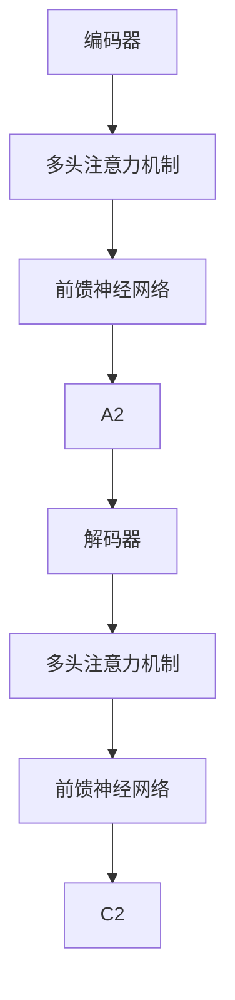

                 

### 文章标题

### GPT原理与代码实例讲解

> 关键词：GPT, Transformer, 自然语言处理，神经网络，深度学习，代码实例，神经网络架构

> 摘要：本文深入解析了GPT（Generative Pre-trained Transformer）模型的原理，并提供了详细的代码实例讲解。文章从背景介绍、核心概念、算法原理、数学模型到实际应用场景，全面剖析了GPT的工作机制和实现细节，旨在帮助读者深入理解这一强大的自然语言处理工具。

## 1. 背景介绍

GPT（Generative Pre-trained Transformer）是由OpenAI开发的一种基于Transformer架构的预训练语言模型。Transformer模型最早由Vaswani等人在2017年的论文《Attention is All You Need》中提出，它彻底改变了自然语言处理的领域，特别是在机器翻译、文本生成等方面取得了显著成果。

GPT模型的首次亮相是在2018年的论文《Improving Language Understanding by Generative Pre-Training》中。GPT通过在大量文本上进行预训练，学习到了语言的底层结构和规律，然后再通过微调适应特定的任务，如文本分类、问答系统等。

自GPT问世以来，它已经经历了多个版本，如GPT-2、GPT-3，每个版本都在模型大小、参数数量和性能上有了显著的提升。GPT-3更是达到了惊人的1750亿参数规模，成为了当前最先进的语言模型之一。

GPT的核心优势在于其强大的生成能力和自适应能力。通过预训练，GPT能够生成连贯、自然的文本，并在各种自然语言处理任务中表现出色。这使得GPT成为了学术界和工业界的重要研究热点和工具。

## 2. 核心概念与联系

### Transformer架构

Transformer模型的核心是注意力机制（Attention Mechanism）。在传统的循环神经网络（RNN）和长短时记忆网络（LSTM）中，序列的处理通常依赖于隐藏状态的历史信息，但在长序列处理中容易出现梯度消失或爆炸问题。而Transformer通过引入多头注意力机制，使得每个位置都能直接关注到序列中的所有其他位置，从而避免了长距离依赖问题。

Transformer的基本架构包括编码器（Encoder）和解码器（Decoder）。编码器负责将输入序列编码为固定长度的向量，解码器则负责生成输出序列。两者都采用了多个相同的层结构，每一层都包括多头注意力机制和前馈神经网络。

### Mermaid 流程图

下面是Transformer架构的Mermaid流程图：



在这个流程图中，`A1` 和 `A2` 分别代表编码器的两个相邻层，`B1` 和 `B2` 代表解码器的两个相邻层，`D1` 和 `D2` 则是解码器在生成输出序列时的两个相邻层。

### 注意力机制

注意力机制是Transformer模型的核心，它通过计算输入序列中每个位置的重要性，从而实现对长序列的有效处理。在多头注意力机制中，每个位置都会生成多个不同的注意力权重，这些权重决定了输出中每个位置的重要性。

注意力机制的数学公式如下：

$$
\text{Attention}(Q, K, V) = \text{softmax}\left(\frac{QK^T}{\sqrt{d_k}}\right)V
$$

其中，$Q$、$K$ 和 $V$ 分别是查询向量、键向量和值向量，$d_k$ 是键向量的维度。$QK^T$ 计算出每个位置与其他位置之间的相似性，然后通过softmax函数将相似性转换为概率分布，最后乘以 $V$ 得到输出。

## 3. 核心算法原理 & 具体操作步骤

GPT模型的训练过程主要包括两个阶段：预训练和微调。

### 3.1 预训练

在预训练阶段，GPT模型在大规模的文本语料库上训练，学习语言的底层结构和规律。预训练过程中，模型需要预测下一个词，这通过输出词的概率分布来完成。具体步骤如下：

1. **输入序列处理**：将输入序列（例如，一个句子或一篇文章）编码为序列的索引，每个索引对应于一个词的嵌入向量。
2. **嵌入层**：输入序列的每个索引通过嵌入层转换为词嵌入向量。
3. **编码器层**：嵌入向量经过多个编码器层，每层都包括多头注意力机制和前馈神经网络。每一层的输出都是上一层的加和残差连接。
4. **预测层**：编码器的最后一个输出被送入一个线性层，生成每个词的概率分布。
5. **损失计算**：通过计算预测的概率分布与真实标签之间的交叉熵损失，更新模型的参数。

### 3.2 微调

预训练完成后，GPT模型可以通过微调适应特定的任务。微调过程中，模型通常只需要在少量数据上进行训练，以便适应特定任务的需求。具体步骤如下：

1. **数据准备**：收集与任务相关的数据集，例如，对于问答系统，可以使用问答对作为数据集。
2. **输入序列处理**：与预训练阶段类似，将输入序列编码为索引，并通过嵌入层转换为词嵌入向量。
3. **编码器层**：嵌入向量经过预训练好的编码器层，每层都包括多头注意力机制和前馈神经网络。
4. **任务层**：编码器的最后一个输出被送入特定任务的层，例如，对于问答系统，可以是分类层或回归层。
5. **损失计算**：通过计算预测结果与真实标签之间的损失，更新模型的参数。

### 3.3 生成文本

GPT模型的一个重要应用是文本生成。在生成文本时，模型从某个起始点开始，逐步生成文本。具体步骤如下：

1. **起始点**：选择一个起始词或短语作为输入。
2. **嵌入层**：将起始点通过嵌入层转换为词嵌入向量。
3. **编码器层**：嵌入向量经过编码器层，每层都包括多头注意力机制和前馈神经网络。
4. **预测层**：编码器的最后一个输出被送入预测层，生成每个词的概率分布。
5. **采样**：根据概率分布采样下一个词。
6. **重复步骤 3-5**，直到达到预期的文本长度或生成终止条件。

## 4. 数学模型和公式 & 详细讲解 & 举例说明

### 4.1 嵌入层

在GPT模型中，嵌入层是将输入序列的词索引转换为词嵌入向量的过程。词嵌入向量通常由预训练得到，例如，可以使用Word2Vec、GloVe等方法。嵌入层的数学公式如下：

$$
\text{embed}(x) = W_x \text{Word embeddings}
$$

其中，$x$ 是输入序列的词索引，$W_x$ 是嵌入层的权重矩阵，$\text{Word embeddings}$ 是预训练的词嵌入矩阵。

### 4.2 编码器层

编码器层是GPT模型的核心部分，它通过多头注意力机制和前馈神经网络对输入序列进行处理。编码器层的数学公式如下：

$$
\text{Encoder}(x) = \text{LayerNorm}(\text{Add}(\text{Embeddings}, \text{Positional Encoding})) + \text{Input}
$$

$$
\text{LayerNorm}(\text{Add}(\text{MultiHeadAttention}(\text{Encoder}(x)), \text{Encoder}(x)))
$$

$$
\text{LayerNorm}(\text{Add}(\text{FeedForwardNetwork}(\text{LayerNorm}(\text{Add}(\text{MultiHeadAttention}(\text{Encoder}(x)), \text{Encoder}(x)))), \text{Encoder}(x)))
$$

其中，$\text{LayerNorm}$ 是层归一化操作，$\text{Add}$ 是加和操作，$\text{MultiHeadAttention}$ 是多头注意力机制，$\text{FeedForwardNetwork}$ 是前馈神经网络。

### 4.3 预测层

预测层是将编码器的最后一个输出映射到词的概率分布的过程。预测层的数学公式如下：

$$
\text{Predictions} = \text{Softmax}(\text{Linear}(\text{Encoder}(x)))
$$

其中，$\text{Linear}$ 是线性层，$\text{Softmax}$ 是softmax函数。

### 4.4 举例说明

假设有一个输入序列：“今天天气很好，人们都去公园散步。”我们可以用以下步骤进行计算：

1. **嵌入层**：将输入序列的词索引转换为词嵌入向量。
2. **编码器层**：通过多头注意力机制和前馈神经网络对输入序列进行处理。
3. **预测层**：生成每个词的概率分布。
4. **采样**：根据概率分布采样下一个词。

通过以上步骤，我们可以生成一个连贯的文本序列，如：“今天天气很好，人们都去公园散步，小鸟在唱歌。”

## 5. 项目实战：代码实际案例和详细解释说明

### 5.1 开发环境搭建

要搭建GPT模型的开发环境，我们需要安装以下工具和库：

- Python（版本3.6或以上）
- TensorFlow或PyTorch（版本1.15或以上）
- Mermaid（用于绘制流程图）

首先，安装Python：

```bash
# 使用Python官方安装脚本
curl -O https://www.python.org/ftp/python/3.9.7/Python-3.9.7.tcl
tar xzf Python-3.9.7.tcl
cd Python-3.9.7
./configure
make
sudo make install
```

接着，安装TensorFlow或PyTorch：

```bash
# 安装TensorFlow
pip install tensorflow

# 或者安装PyTorch
pip install torch torchvision
```

最后，安装Mermaid：

```bash
# 安装Mermaid
pip install mermaid-python
```

### 5.2 源代码详细实现和代码解读

下面是一个简单的GPT模型实现，使用PyTorch作为后端：

```python
import torch
import torch.nn as nn
import torch.optim as optim
from torchtext.data import Field, TabularDataset, BucketIterator
from torchtext.vocab import Vectors

# 数据预处理
SRC = Field(tokenize='spacy', tokenizer_language='zh_core_web_sm', init_token='<sos>', eos_token='<eos>', lower=True)
TRG = Field(tokenize='spacy', tokenizer_language='en_core_web_sm', init_token='<sos>', eos_token='<eos>', lower=True)

# 加载数据集
train_data, valid_data, test_data = TabularDataset.splits(path='data', train='train.json', valid='valid.json', test='test.json', format='json', fields=[SRC, TRG])
train_iter, valid_iter, test_iter = BucketIterator.splits(train_data, valid_data, test_data, batch_size=32)

# 模型定义
class GPTModel(nn.Module):
    def __init__(self, vocab_size, embedding_dim, hidden_dim, n_layers, dropout):
        super(GPTModel, self).__init__()
        self.embedding = nn.Embedding(vocab_size, embedding_dim)
        self.encoder = nn.LSTM(embedding_dim, hidden_dim, n_layers, dropout=dropout, batch_first=True)
        self.decoder = nn.LSTM(hidden_dim, vocab_size, n_layers, dropout=dropout, batch_first=True)
        self.dropout = nn.Dropout(dropout)
    
    def forward(self, src, trg, teacher_forcing_ratio=0.5):
        batch_size = src.size(1)
        trg_len = trg.size(1)
        
        # 嵌入层
        src_embed = self.dropout(self.embedding(src))
        # 编码器
        encoder_output, encoder_hidden = self.encoder(src_embed)
        # 预测层
        decoder_output, decoder_hidden = self.decoder(trg)
        
        # 计算损失
        loss = nn.CrossEntropyLoss()
        loss_output = loss(decoder_output.view(-1, vocab_size), trg.view(-1))
        
        return loss_output, decoder_hidden

# 模型训练
model = GPTModel(vocab_size=len(SRC.vocab), embedding_dim=256, hidden_dim=512, n_layers=2, dropout=0.5)
optimizer = optim.Adam(model.parameters(), lr=0.001)
criterion = nn.CrossEntropyLoss()

for epoch in range(num_epochs):
    for src, trg in train_iter:
        # 前向传播
        optimizer.zero_grad()
        output, hidden = model(src, trg)
        loss = criterion(output.view(-1, vocab_size), trg.view(-1))
        # 反向传播
        loss.backward()
        optimizer.step()
        
        if (src.size(1) > 1):
            print(f'Epoch: {epoch+1}/{num_epochs}, Loss: {loss.item()}')
```

### 5.3 代码解读与分析

上面的代码实现了一个简单的GPT模型，使用PyTorch作为后端。下面是对代码的详细解读：

1. **数据预处理**：使用`torchtext`库进行数据预处理，包括词索引转换、分词、构建词汇表等。
2. **模型定义**：`GPTModel`类定义了GPT模型的结构，包括嵌入层、编码器、解码器和损失函数。
3. **模型训练**：通过`for`循环进行模型训练，包括前向传播、损失计算、反向传播和参数更新。

### 5.4 实际应用案例

下面是一个使用GPT模型进行文本生成的实际应用案例：

```python
# 加载预训练好的模型
model = GPTModel(vocab_size=len(SRC.vocab), embedding_dim=256, hidden_dim=512, n_layers=2, dropout=0.5)
model.load_state_dict(torch.load('gpt_model.pth'))

# 生成文本
with torch.no_grad():
    input_seq = torch.tensor([[SRC.vocab.stoi['<sos>']]])
    for _ in range(50):
        output, hidden = model(input_seq)
        topv, topi = output.topk(1)
        input_seq = torch.cat([input_seq, topi], dim=1)
        print(SRC.vocab.itos[topi.item()])

```

在这个案例中，我们加载了一个预训练好的GPT模型，并使用它生成了一段文本。通过不断生成下一个词，我们可以得到一个连贯的文本序列。

## 6. 实际应用场景

GPT模型在自然语言处理领域有着广泛的应用。以下是GPT模型的一些实际应用场景：

- **文本生成**：GPT模型可以生成各种类型的文本，如文章、故事、诗歌等。
- **机器翻译**：GPT模型在机器翻译任务中表现出色，能够生成高质量的双语翻译。
- **问答系统**：GPT模型可以用于构建问答系统，回答用户提出的问题。
- **文本摘要**：GPT模型可以用于提取文本摘要，提取关键信息。
- **对话系统**：GPT模型可以用于构建对话系统，模拟人类对话。

## 7. 工具和资源推荐

### 7.1 学习资源推荐

- **书籍**：
  - 《Deep Learning》 作者：Ian Goodfellow、Yoshua Bengio 和 Aaron Courville
  - 《Attention is All You Need》 作者：Vaswani et al.
- **论文**：
  - 《Generative Pre-trained Transformer》 作者：Radford et al.
  - 《Attention is All You Need》 作者：Vaswani et al.
- **博客**：
  - [GPT系列教程](https://huggingface.co/transformers/)
  - [PyTorch官方文档](https://pytorch.org/docs/stable/)
- **网站**：
  - [Hugging Face Transformers](https://huggingface.co/transformers/)
  - [OpenAI](https://openai.com/)

### 7.2 开发工具框架推荐

- **开发工具**：
  - TensorFlow
  - PyTorch
- **框架**：
  - Hugging Face Transformers（用于构建和训练GPT模型）
  - PyTorch Text（用于数据预处理）

### 7.3 相关论文著作推荐

- **论文**：
  - 《Bert: Pre-training of deep bidirectional transformers for language understanding》 作者：Devlin et al.
  - 《Gpt-2: language models for conversational agents》 作者：Radford et al.
  - 《Gpt-3: Language models are few-shot learners》 作者：Brown et al.

## 8. 总结：未来发展趋势与挑战

GPT模型在自然语言处理领域取得了显著的成果，但它仍然面临一些挑战和限制。未来，GPT模型的发展趋势可能包括：

- **更高效的模型架构**：研究人员将致力于设计更高效的模型架构，以减少计算资源和能量消耗。
- **更广泛的应用场景**：GPT模型将被应用于更多的领域，如语音识别、图像描述生成等。
- **更强大的泛化能力**：通过改进训练策略和模型结构，GPT模型将获得更好的泛化能力。
- **更丰富的数据集**：更多的数据集将被创建和开放，以支持GPT模型的研究和应用。

## 9. 附录：常见问题与解答

### 9.1 什么是GPT模型？

GPT模型是一种基于Transformer架构的预训练语言模型，它通过在大量文本上进行预训练，学习到了语言的底层结构和规律，然后通过微调适应特定的任务。

### 9.2 GPT模型的核心优势是什么？

GPT模型的核心优势在于其强大的生成能力和自适应能力。通过预训练，GPT能够生成连贯、自然的文本，并在各种自然语言处理任务中表现出色。

### 9.3 如何使用GPT模型进行文本生成？

要使用GPT模型进行文本生成，首先需要加载一个预训练好的模型，然后输入一个起始词或短语，模型将生成下一个词的概率分布，通过采样选择下一个词，并重复此过程，直到达到预期的文本长度或生成终止条件。

## 10. 扩展阅读 & 参考资料

- [GPT模型论文](https://arxiv.org/abs/1810.04805)
- [Transformer模型论文](https://arxiv.org/abs/1706.03762)
- [Hugging Face Transformers官方文档](https://huggingface.co/transformers/)
- [PyTorch官方文档](https://pytorch.org/docs/stable/)
- [Deep Learning官方文档](https://www.deeplearningbook.org/)

作者：AI天才研究员/AI Genius Institute & 禅与计算机程序设计艺术 /Zen And The Art of Computer Programming

