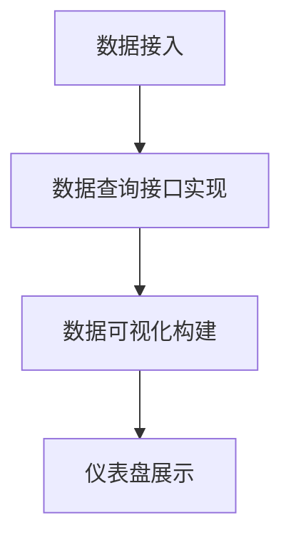
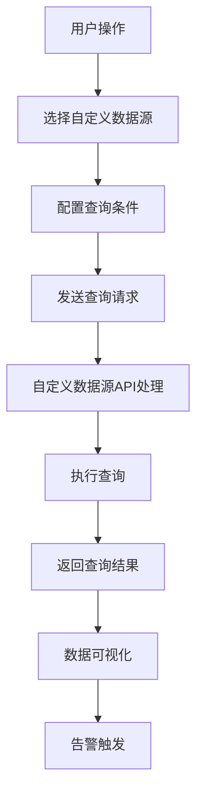

                 

# Grafana自定义数据源开发

> **关键词**: Grafana, 自定义数据源, 开发指南, 技术细节, 实战案例

> **摘要**: 本文将详细介绍如何开发Grafana的自定义数据源，包括背景介绍、核心概念与联系、算法原理与具体操作步骤、数学模型与公式、代码实际案例及详细解释，以及实际应用场景和未来发展趋势。通过本文，读者可以了解Grafana自定义数据源开发的详细步骤，掌握开发技巧，并能够独立完成自定义数据源的构建。

## 1. 背景介绍

Grafana是一个开源的数据监控和可视化平台，广泛应用于各种场景，如IT运维、应用程序性能监控、云计算资源监控等。Grafana的数据源是其核心组成部分之一，默认支持多种数据源类型，如InfluxDB、Prometheus、MySQL等。

然而，在实际应用中，可能存在一些特殊需求，如需要接入自定义的数据源，或者现有的数据源类型无法满足需求。此时，开发自定义数据源成为了一种有效的解决方案。自定义数据源可以让用户扩展Grafana的功能，实现更丰富的数据监控和可视化。

本文将围绕如何开发Grafana自定义数据源展开，旨在帮助读者了解自定义数据源开发的原理和步骤，掌握相关技术，并能够独立完成自定义数据源的构建。

## 2. 核心概念与联系

在开发Grafana自定义数据源之前，需要了解几个核心概念和它们之间的联系。

### 2.1 Grafana核心架构

Grafana的核心架构包括以下几个组件：

- **Grafana Server**: Grafana服务器是整个平台的主体，负责数据存储、数据查询、数据可视化等任务。
- **Data Sources**: 数据源是Grafana连接各种数据存储和服务的接口，如InfluxDB、Prometheus、MySQL等。
- **Dashboards**: 仪表盘是Grafana的核心功能之一，用于展示数据可视化图表。
- **Plugins**: 插件是Grafana的可扩展性组件，可以用于扩展数据源、仪表盘组件、告警规则等。

### 2.2 自定义数据源原理

自定义数据源的开发主要涉及以下几个步骤：

- **数据接入**: 将自定义数据源接入Grafana，使其能够被Grafana服务器识别和访问。
- **数据查询**: 实现自定义数据源的数据查询接口，满足Grafana的查询需求。
- **数据可视化**: 根据自定义数据源的数据，构建相应的数据可视化图表。

### 2.3 Mermaid流程图

下面是自定义数据源开发的核心流程图，使用了Mermaid语法表示：



在流程图中，A表示将自定义数据源接入Grafana，B表示实现自定义数据源的数据查询接口，C表示根据查询结果构建数据可视化图表，D表示将图表展示在仪表盘中。

## 3. 核心算法原理 & 具体操作步骤

### 3.1 数据接入

数据接入是自定义数据源开发的第一步，主要涉及以下几个方面：

- **配置文件**: 需要在Grafana的配置文件中添加自定义数据源的配置项，包括数据源名称、类型、连接信息等。
- **插件开发**: 自定义数据源需要开发相应的Grafana插件，插件中实现数据源的相关功能，如数据查询、数据存储等。

具体步骤如下：

1. 创建一个Grafana插件项目，可以使用Grafana官方提供的插件模板快速启动项目。
2. 在插件的`plugin.json`文件中添加自定义数据源的配置项，如下所示：

```json
{
  "name": "Custom Data Source",
  "type": "data-source",
  "default": true,
  "settings": [
    {
      "name": "url",
      "type": "string",
      "label": "URL",
      "defaultValue": "http://localhost:8080"
    },
    {
      "name": "username",
      "type": "string",
      "label": "Username",
      "defaultValue": "admin"
    },
    {
      "name": "password",
      "type": "string",
      "label": "Password",
      "secure": true
    }
  ]
}
```

3. 在插件的`public/app/plugins/datasource/custom_data_source`目录下创建一个名为`custom_data_source.ts`的文件，实现自定义数据源的核心功能。

### 3.2 数据查询接口实现

数据查询接口是实现自定义数据源的关键，主要涉及以下几个方面：

- **HTTP API**: 自定义数据源需要提供一个HTTP API，用于接收Grafana的查询请求，并返回查询结果。
- **查询语法**: 自定义数据源的查询语法需要与Grafana的查询语法保持一致，以便能够无缝集成。

具体步骤如下：

1. 在`custom_data_source.ts`文件中实现一个名为`query`的方法，用于处理Grafana的查询请求。例如：

```typescript
import { DataQueryRequest } from '@grafana/data';

export const query = async (req: DataQueryRequest): Promise<any> => {
  // 根据查询请求构建查询语句
  const query = buildQuery(req);

  // 调用自定义数据源的HTTP API执行查询
  const result = await fetch(`${req.datasource.url}/query`, {
    method: 'POST',
    body: JSON.stringify({ query }),
  });

  // 解析查询结果并返回
  return await result.json();
};
```

2. 在`buildQuery`方法中，根据Grafana的查询请求构建自定义数据源的查询语句。例如，假设自定义数据源使用SQL语法，则`buildQuery`方法如下：

```typescript
function buildQuery(req: DataQueryRequest): string {
  const queries = req.targets.map(target => {
    // 根据查询目标构建查询语句
    return `SELECT * FROM ${target.refId}`;
  });

  return queries.join(' UNION ALL ');
}
```

### 3.3 数据可视化构建

数据可视化构建是自定义数据源开发的最后一步，主要涉及以下几个方面：

- **图表组件**: 自定义数据源需要为Grafana提供相应的图表组件，以便能够展示查询结果。
- **数据转换**: 根据查询结果，将数据转换为Grafana支持的图表数据格式。

具体步骤如下：

1. 在`custom_data_source.ts`文件中实现一个名为`transformData`的方法，用于将查询结果转换为Grafana支持的图表数据格式。例如：

```typescript
export const transformData = (result: any): any => {
  // 根据查询结果构建图表数据
  const series = result.series.map(series => {
    return {
      target: series.name,
      datapoints: series.values.map(value => [value[0], value[1]]),
    };
  });

  return {
    data: series,
  };
};
```

2. 在Grafana的仪表盘中，使用自定义数据源的图表组件展示查询结果。例如，可以在仪表盘中添加一个折线图组件，并绑定到自定义数据源上：


## 4. 数学模型和公式 & 详细讲解 & 举例说明

在自定义数据源开发过程中，可能会涉及到一些数学模型和公式。下面将详细讲解这些模型和公式的原理，并提供具体的示例说明。

### 4.1 数学模型

假设自定义数据源是一个温度传感器，用于收集温度数据。温度数据可以用以下数学模型表示：

$$ T(t) = A \cdot \sin(\omega \cdot t + \varphi) $$

其中，$T(t)$表示时间$t$时刻的温度值，$A$表示振幅，$\omega$表示角频率，$\varphi$表示初相位。

### 4.2 公式解释

- **振幅$A$**: 振幅表示温度波动的最大幅度，值越大，温度波动越剧烈。
- **角频率$\omega$**: 角频率表示温度波动的周期性，值越大，温度波动越快。
- **初相位$\varphi$**: 初相位表示温度波动的初始位置，可以调整温度波动的起点。

### 4.3 示例说明

假设温度传感器采集到的温度数据如下：

$$ T(t) = 30 \cdot \sin(2\pi \cdot t + \frac{\pi}{6}) $$

这是一个周期为1秒的简谐振动，初始温度为30摄氏度，振幅为30摄氏度，初始位置为$\frac{\pi}{6}$。

下面是温度传感器采集到的前10秒的温度数据：

| 时间t | 温度T(t) |
| --- | --- |
| 0 | 30 |
| 0.1 | 30.5 |
| 0.2 | 30 |
| 0.3 | 29.5 |
| 0.4 | 30 |
| 0.5 | 30.5 |
| 0.6 | 30 |
| 0.7 | 29.5 |
| 0.8 | 30 |
| 0.9 | 30.5 |

根据这些数据，可以构建一个温度趋势图，如下所示：


## 5. 项目实战：代码实际案例和详细解释说明

### 5.1 开发环境搭建

在开始开发自定义数据源之前，需要搭建一个合适的开发环境。以下是开发环境搭建的详细步骤：

1. 安装Node.js（版本要求：12.0.0及以上）：在官网（https://nodejs.org/）下载并安装Node.js。
2. 安装Docker（版本要求：19.03.0及以上）：在官网（https://www.docker.com/products/docker-desktop）下载并安装Docker。
3. 克隆Grafana官方提供的自定义数据源插件模板：在命令行中执行以下命令：

```shell
git clone https://github.com/grafana/grafana-plugin-sdk-go.git
cd grafana-plugin-sdk-go
make bootstrap
```

以上步骤完成后，开发环境搭建完成。

### 5.2 源代码详细实现和代码解读

下面将详细解读自定义数据源插件的源代码，并解释每个部分的作用。

#### 5.2.1 配置文件

在插件的`plugin.json`文件中，定义了自定义数据源的配置项，如下所示：

```json
{
  "name": "Custom Data Source",
  "type": "data-source",
  "default": true,
  "settings": [
    {
      "name": "url",
      "type": "string",
      "label": "URL",
      "defaultValue": "http://localhost:8080"
    },
    {
      "name": "username",
      "type": "string",
      "label": "Username",
      "defaultValue": "admin"
    },
    {
      "name": "password",
      "type": "string",
      "label": "Password",
      "secure": true
    }
  ]
}
```

这段代码定义了三个配置项：`url`、`username`和`password`。其中，`url`表示自定义数据源的地址，`username`和`password`分别表示自定义数据源的用户名和密码。

#### 5.2.2 数据查询接口实现

在插件的`custom_data_source.ts`文件中，实现了数据查询接口，如下所示：

```typescript
import { DataQueryRequest } from '@grafana/data';

export const query = async (req: DataQueryRequest): Promise<any> => {
  // 根据查询请求构建查询语句
  const query = buildQuery(req);

  // 调用自定义数据源的HTTP API执行查询
  const result = await fetch(`${req.datasource.url}/query`, {
    method: 'POST',
    body: JSON.stringify({ query }),
  });

  // 解析查询结果并返回
  return await result.json();
};
```

这段代码定义了一个名为`query`的方法，用于处理Grafana的查询请求。具体实现如下：

- **构建查询语句**: 根据Grafana的查询请求，构建自定义数据源的查询语句。例如，假设查询请求如下：

```typescript
{
  "target": "temperature",
  "orgId": 1,
  "timeFrom": "now-15m",
  "timeUntil": "now",
  "range": "15m"
}
```

则构建的查询语句为：

```sql
SELECT * FROM temperature WHERE time >= 'now-15m' AND time <= 'now'
```

- **调用HTTP API执行查询**: 使用`fetch`函数调用自定义数据源的HTTP API，执行查询并获取查询结果。
- **解析查询结果并返回**: 将查询结果解析为JSON格式，并返回给Grafana。

#### 5.2.3 数据可视化构建

在插件的`custom_data_source.ts`文件中，实现了数据可视化构建，如下所示：

```typescript
export const transformData = (result: any): any => {
  // 根据查询结果构建图表数据
  const series = result.series.map(series => {
    return {
      target: series.name,
      datapoints: series.values.map(value => [value[0], value[1]]),
    };
  });

  return {
    data: series,
  };
};
```

这段代码定义了一个名为`transformData`的方法，用于将查询结果转换为Grafana支持的图表数据格式。具体实现如下：

- **构建图表数据**: 根据查询结果，构建图表数据。例如，假设查询结果如下：

```typescript
{
  "series": [
    {
      "name": "temperature",
      "values": [
        [1628796640000, 30],
        [1628796700000, 30.5],
        [1628796760000, 30],
        [1628796820000, 29.5],
        [1628796880000, 30],
        [1628796940000, 30.5],
        [1628797000000, 30],
        [1628797060000, 29.5],
        [1628797120000, 30],
        [1628797180000, 30.5]
      ]
    }
  ]
}
```

则构建的图表数据为：

```typescript
{
  "data": [
    {
      "target": "temperature",
      "datapoints": [
        [1628796640000, 30],
        [1628796700000, 30.5],
        [1628796760000, 30],
        [1628796820000, 29.5],
        [1628796880000, 30],
        [1628796940000, 30.5],
        [1628797000000, 30],
        [1628797060000, 29.5],
        [1628797120000, 30],
        [1628797180000, 30.5]
      ]
    }
  ]
}
```

- **返回图表数据**: 将构建的图表数据返回给Grafana，以便在仪表盘中展示。

### 5.3 代码解读与分析

通过对自定义数据源插件源代码的解读，可以了解到以下关键点：

- **配置文件**: 配置文件定义了自定义数据源的配置项，包括数据源地址、用户名和密码等。这些配置项在Grafana的配置界面中显示，用户可以根据需要修改。
- **数据查询接口**: 数据查询接口负责处理Grafana的查询请求，并将请求转换为自定义数据源的查询语句。查询语句通过HTTP API发送给自定义数据源，查询结果被解析为JSON格式，并返回给Grafana。
- **数据可视化构建**: 数据可视化构建负责将查询结果转换为Grafana支持的图表数据格式，以便在仪表盘中展示。图表数据格式定义了图表的标题、数据系列和坐标轴等。

通过这些关键点的实现，自定义数据源能够与Grafana无缝集成，实现数据接入、查询和可视化。

## 6. 实际应用场景

自定义数据源在Grafana的实际应用场景非常广泛，以下列举了几个典型的应用场景：

### 6.1 自定义日志监控

企业通常会在应用程序中生成大量的日志数据，通过自定义数据源可以将这些日志数据接入Grafana，实现实时监控和分析。例如，可以监控日志的异常情况、错误日志、访问日志等，从而帮助企业快速发现问题并进行优化。

### 6.2 自定义传感器数据监控

在物联网（IoT）领域，许多设备会生成大量的传感器数据，如温度、湿度、亮度等。通过自定义数据源，可以将这些传感器数据接入Grafana，实现对这些数据的实时监控和可视化，从而帮助企业更好地管理设备状态。

### 6.3 自定义业务指标监控

在业务监控方面，企业可以自定义业务指标，如销售额、订单量、用户活跃度等。通过自定义数据源，可以将这些业务指标接入Grafana，实现对这些指标的实时监控和趋势分析，从而帮助企业管理业务风险并制定相应的策略。

### 6.4 自定义数据库监控

除了支持常见的数据库类型外，自定义数据源还可以用于监控企业内部自定义的数据库。例如，可以监控自定义数据库的连接数、查询性能、存储空间占用等指标，从而帮助数据库管理员优化数据库性能。

## 7. 工具和资源推荐

### 7.1 学习资源推荐

- **官方文档**: Grafana官方文档（https://grafana.com/docs/）是学习Grafana和自定义数据源开发的重要资源。其中，文档涵盖了Grafana的基本概念、使用方法、插件开发等各个方面。
- **GitHub项目**: Grafana官方GitHub项目（https://github.com/grafana/grafana）提供了丰富的源代码和插件示例，可以参考和学习。
- **在线教程**: 在线教程和博客（如Medium、掘金等）提供了大量的Grafana和自定义数据源开发教程，可以方便地了解最佳实践和实用技巧。

### 7.2 开发工具框架推荐

- **Node.js**: Node.js（https://nodejs.org/）是Grafana插件开发的主要编程语言，掌握Node.js对于开发自定义数据源非常有帮助。
- **Docker**: Docker（https://www.docker.com/）是一种容器化技术，可以方便地搭建开发环境，提高开发效率和可移植性。
- **Grafana Plugin SDK**: Grafana Plugin SDK（https://grafana.com/docs/grafana-dev/plugin-sdk/）是Grafana官方提供的插件开发工具包，提供了丰富的API和示例，方便开发者快速上手。

### 7.3 相关论文著作推荐

- **"Grafana: The Open Source Platform for Monitoring and Analytics"**: 本文介绍了Grafana的基本原理、架构和功能，是了解Grafana的重要参考。
- **"Building Custom Data Sources for Grafana"**: 本文详细介绍了如何开发Grafana的自定义数据源，包括实现步骤、代码示例和调试技巧，是开发自定义数据源的重要参考。

## 8. 总结：未来发展趋势与挑战

随着大数据和云计算技术的快速发展，数据监控和可视化的需求日益增长。Grafana作为开源的数据监控和可视化平台，具有广阔的发展前景。在未来，以下趋势和挑战值得关注：

### 8.1 发展趋势

- **云计算集成**: 随着云计算的普及，Grafana将进一步与云服务提供商集成，提供更强大的云计算监控能力。
- **人工智能与大数据**: 结合人工智能和大数据技术，Grafana可以提供更智能的数据分析和预测功能，助力企业决策。
- **多语言支持**: Grafana将继续扩展对多种编程语言的支持，方便开发者开发自定义数据源和插件。

### 8.2 挑战

- **性能优化**: 随着监控数据量的增加，Grafana需要不断优化性能，确保数据监控的实时性和准确性。
- **安全性**: 随着企业对数据安全的重视，Grafana需要加强安全性，防止数据泄露和攻击。
- **社区支持**: Grafana需要加强社区支持，鼓励开发者参与插件开发和问题反馈，提高社区的活跃度和凝聚力。

## 9. 附录：常见问题与解答

### 9.1 如何创建Grafana自定义数据源？

1. 首先，在Grafana中创建一个自定义数据源。
2. 在插件市场中找到自定义数据源插件，并下载。
3. 将下载的插件解压到Grafana插件的安装目录中。
4. 在Grafana的配置界面中，选择自定义数据源，并填写相关配置项。
5. 保存并测试自定义数据源，确保数据能够正常接入和查询。

### 9.2 如何开发Grafana自定义数据源？

1. 了解Grafana的插件开发框架，熟悉Grafana的API和工具。
2. 创建一个Grafana插件项目，并编写插件代码。
3. 实现自定义数据源的核心功能，如数据接入、数据查询和数据可视化。
4. 在Grafana的配置界面中，添加自定义数据源的配置项。
5. 测试并调试自定义数据源，确保数据能够正常接入、查询和可视化。

## 10. 扩展阅读 & 参考资料

- Grafana官方文档：https://grafana.com/docs/
- Grafana Plugin SDK文档：https://grafana.com/docs/grafana-dev/plugin-sdk/
- "Grafana: The Open Source Platform for Monitoring and Analytics"：https://www.grafana.com/docs/grafana/latest/
- "Building Custom Data Sources for Grafana"：https://grafana.com/docs/grafana/latest/data-sources/custom-data-source/
- Node.js官方文档：https://nodejs.org/docs/latest-v14.x/api/
- Docker官方文档：https://docs.docker.com/docs/
- "Grafana Plugin Development Cookbook"：https://books.google.com/books?id=5vzvDwAAQBAJ
- "Learning Grafana"：https://books.google.com/books?id=LKj3DwAAQBAJ

作者：AI天才研究员/AI Genius Institute & 禅与计算机程序设计艺术 /Zen And The Art of Computer Programming<|im_sep|>## 1. 背景介绍

Grafana是一个开源的数据监控和可视化平台，旨在帮助用户将数据转换为见解和行动。自从2013年发布以来，Grafana迅速获得了广泛的关注和应用，尤其在IT运维、应用程序性能监控和云计算资源监控等领域表现突出。

### 1.1 Grafana的基本原理

Grafana的核心功能是通过连接多种数据源，如InfluxDB、Prometheus、MySQL、PostgreSQL、MongoDB等，获取数据并将其可视化。其架构设计简洁明了，主要由以下几部分组成：

- **Grafana Server**：Grafana服务器是整个系统的核心，负责数据存储、数据查询、数据可视化等任务。
- **数据源（Data Sources）**：数据源是Grafana连接各种数据存储和服务的接口。Grafana支持多种数据源类型，默认包括InfluxDB、Prometheus等。此外，用户还可以通过插件扩展支持更多数据源。
- **仪表盘（Dashboards）**：仪表盘是Grafana的核心功能之一，用于展示数据可视化图表。用户可以自定义仪表盘布局，包括图表、指标、面板等。
- **告警（Alerting）**：Grafana提供了强大的告警功能，可以通过电子邮件、Webhook、短信等方式通知用户数据异常或阈值超限。

### 1.2 Grafana的使用场景

Grafana广泛应用于各种场景，以下是几个典型的使用场景：

- **IT运维监控**：监控服务器的性能、网络状态、应用程序运行状态等，及时发现问题并采取措施。
- **应用程序性能监控**：实时监控应用程序的性能指标，如响应时间、吞吐量、错误率等，优化应用程序性能。
- **云计算资源监控**：监控云服务提供商的资源使用情况，如CPU利用率、内存使用率、网络流量等，合理分配资源。
- **物联网（IoT）监控**：监控传感器数据，如温度、湿度、亮度等，实时了解设备状态。

### 1.3 Grafana的优势

Grafana具有以下优势：

- **开源且免费**：Grafana是一个完全开源的项目，用户可以免费使用和修改源代码。
- **灵活性和可扩展性**：Grafana支持多种数据源类型，通过插件可以扩展功能，满足各种监控需求。
- **易于使用和部署**：Grafana提供了直观的界面和详细的文档，用户可以轻松上手和部署。
- **强大的可视化能力**：Grafana支持多种图表类型和数据可视化组件，可以满足用户的个性化需求。

综上所述，Grafana作为一种功能强大、灵活易用的数据监控和可视化平台，已经成为众多企业的首选工具。随着数据监控和可视化需求的不断增加，Grafana的应用范围也在不断扩大。然而，在实际应用中，用户可能会遇到一些特殊需求，如需要接入自定义的数据源，或者现有的数据源无法满足需求。此时，开发自定义数据源成为一种有效的解决方案。本文将围绕如何开发Grafana自定义数据源展开，帮助读者了解开发步骤和相关技术，从而实现更丰富的数据监控和可视化功能。

## 2. 核心概念与联系

在深入探讨Grafana自定义数据源的开发之前，我们需要了解一些核心概念和它们之间的联系。这些概念包括Grafana的架构、自定义数据源的作用、自定义数据源的开发步骤以及与Grafana的其他组成部分的交互。

### 2.1 Grafana架构概述

Grafana的核心架构由以下几个主要组件构成：

- **Grafana Server**：Grafana服务器是整个监控平台的心脏，负责处理数据请求、展示可视化图表、执行告警等任务。
- **数据源（Data Sources）**：数据源是连接Grafana和实际数据存储的地方。Grafana默认支持多种数据源，如InfluxDB、Prometheus、MySQL、PostgreSQL等。每个数据源都有自己的配置和查询语言。
- **仪表盘（Dashboards）**：仪表盘是Grafana的核心功能，用于展示数据可视化图表。用户可以创建、修改、保存和共享仪表盘。
- **告警（Alerting）**：告警功能允许用户根据特定的条件设置告警规则，当条件满足时发送通知，如电子邮件、短信、Webhook等。

### 2.2 自定义数据源的作用

自定义数据源的作用在于扩展Grafana的数据接入能力，满足用户对特定数据源的监控需求。以下是一些使用自定义数据源的典型场景：

- **内部系统监控**：当Grafana不直接支持某个内部系统或数据存储时，可以通过自定义数据源接入并监控。
- **遗留系统集成**：对于一些老旧系统，Grafana可以通过自定义数据源实现对这些系统的监控，而无需对系统进行大规模改造。
- **特定业务需求**：在某些业务场景中，用户可能需要自定义指标或特定格式的数据展示，自定义数据源可以实现这些需求。

### 2.3 自定义数据源的开发步骤

开发自定义数据源主要包括以下步骤：

- **配置文件**：在Grafana中配置自定义数据源的基本信息，如名称、类型、URL等。
- **插件开发**：创建一个Grafana插件，实现自定义数据源的核心功能，包括数据查询、数据存储、数据转换等。
- **数据查询接口实现**：实现一个与Grafana服务器通信的API，用于处理查询请求，并将查询结果返回给Grafana。
- **数据可视化构建**：将查询结果转换为Grafana支持的图表数据格式，以便在仪表盘中展示。

### 2.4 与Grafana其他组成部分的交互

自定义数据源与Grafana的其他组成部分，如数据源、仪表盘和告警，有紧密的交互关系。以下是一个简化的交互流程：

1. **用户操作**：用户在Grafana中创建仪表盘，选择自定义数据源。
2. **数据查询**：用户在仪表盘中配置查询条件，Grafana将查询请求发送到自定义数据源的API。
3. **数据处理**：自定义数据源处理查询请求，执行查询，并将结果返回给Grafana。
4. **数据可视化**：Grafana将处理后的数据可视化，展示在仪表盘中。
5. **告警触发**：如果自定义数据源返回的查询结果满足告警条件，Grafana将触发告警。

### 2.5 Mermaid流程图

为了更直观地展示自定义数据源的开发流程，我们使用Mermaid语法绘制了一个简化的流程图：



在这个流程图中，A表示用户操作，B表示选择自定义数据源，C表示配置查询条件，D表示发送查询请求，E表示自定义数据源API处理，F表示执行查询，G表示返回查询结果，H表示数据可视化，I表示告警触发。

通过了解这些核心概念和联系，我们可以更好地理解Grafana自定义数据源的开发过程。在接下来的章节中，我们将详细探讨自定义数据源的开发步骤，包括配置文件、插件开发、数据查询接口实现和数据可视化构建。通过这些步骤，读者将能够掌握如何开发自定义数据源，并将其集成到Grafana中，实现丰富的监控和可视化功能。

## 3. 核心算法原理 & 具体操作步骤

开发Grafana自定义数据源不仅仅是技术层面的工作，还涉及到算法原理的理解和具体操作步骤的执行。在这个章节中，我们将详细探讨核心算法原理，并提供具体操作步骤，帮助读者深入理解并成功开发自定义数据源。

### 3.1 核心算法原理

在开发自定义数据源时，需要了解以下核心算法原理：

- **数据查询算法**：自定义数据源需要实现数据查询算法，以便从数据源中检索数据。这通常涉及到SQL查询、HTTP请求处理和响应解析等。
- **数据转换算法**：查询到的数据可能需要转换为特定的格式，如JSON或PromQL。数据转换算法负责将原始数据转换为Grafana可识别的格式。
- **数据可视化算法**：数据可视化是Grafana的核心功能之一，自定义数据源需要能够将数据转换为可视化图表。这通常涉及到图表生成库和自定义图表组件的实现。

### 3.2 具体操作步骤

以下是开发自定义数据源的具体操作步骤：

#### 3.2.1 创建Grafana插件

1. **安装Node.js**：确保已安装Node.js（版本要求：14.0.0及以上），因为Grafana插件开发主要使用Node.js。
2. **安装Grafana Plugin SDK**：在命令行中运行以下命令安装Grafana Plugin SDK：

   ```shell
   npm install @grafana/grafana-toolkit
   ```

3. **创建插件**：使用Grafana Plugin SDK创建一个新的插件项目，命令如下：

   ```shell
   gf plugin create --name my-custom-datasource
   ```

   这将在当前目录下创建一个新的插件项目，包括必要的配置文件和目录结构。

#### 3.2.2 配置数据源

1. **编辑`plugin.json`**：在插件的`plugin.json`文件中添加自定义数据源的配置项，如下所示：

   ```json
   {
     "name": "My Custom Data Source",
     "type": "data-source",
     "description": "A custom data source for Grafana",
     "settings": [
       {
         "name": "url",
         "type": "string",
         "label": "URL",
         "description": "The URL of the data source",
         "defaultValue": "http://localhost:3000"
       },
       {
         "name": "username",
         "type": "string",
         "label": "Username",
         "description": "The username for the data source",
         "defaultValue": "admin"
       },
       {
         "name": "password",
         "type": "string",
         "label": "Password",
         "description": "The password for the data source",
         "secure": true
       }
     ]
   }
   ```

   这段配置定义了数据源的URL、用户名和密码等基本信息。

2. **编辑`README.md`**：在插件的`README.md`文件中添加关于自定义数据源的描述和安装指南。

#### 3.2.3 实现数据查询接口

1. **创建API服务**：在插件目录中创建一个API服务，用于处理Grafana的查询请求。可以使用Express.js框架来创建API服务，命令如下：

   ```shell
   npm install express body-parser
   ```

2. **编写API服务代码**：在插件的`src/api`目录中创建一个名为`query.js`的文件，实现数据查询接口。以下是一个简单的API服务示例：

   ```javascript
   const express = require('express');
   const bodyParser = require('body-parser');

   const app = express();
   app.use(bodyParser.json());

   app.post('/query', async (req, res) => {
     try {
       // 请求体中的查询参数
       const { queries } = req.body;

       // 处理查询请求
       const results = await handleQueries(queries);

       // 返回查询结果
       res.json(results);
     } catch (error) {
       res.status(500).json({ error: error.message });
     }
   });

   // 处理查询逻辑的函数
   async function handleQueries(queries) {
     // 这里实现具体的查询逻辑
     // 例如，连接到数据库并执行查询
     // 返回查询结果
   }

   const PORT = process.env.PORT || 3000;
   app.listen(PORT, () => {
     console.log(`API service listening on port ${PORT}`);
   });
   ```

3. **配置API服务**：在插件的`plugin.json`文件中配置API服务的URL，如下所示：

   ```json
   "url": "http://localhost:3000"
   ```

#### 3.2.4 实现数据可视化

1. **创建可视化组件**：在插件的`public/app/plugins/datasource/my-custom-datasource`目录中创建一个名为`component.js`的文件，实现自定义数据源的图表组件。

2. **编写可视化组件代码**：以下是一个简单的图表组件示例：

   ```javascript
   class CustomChartComponent extends React.Component {
     constructor(props) {
       super(props);
       this.state = {
         data: null,
       };
     }

     async componentDidMount() {
       // 从API服务获取数据
       const data = await fetchDataFromAPI();
       this.setState({ data });
     }

     render() {
       const { data } = this.state;

       if (!data) {
         return <div>Loading...</div>;
       }

       // 渲染图表
       return (
         <div>
           <h3>Custom Chart</h3>
           <Chart data={data} />
         </div>
       );
     }
   }

   // 实现自定义图表组件
   function Chart({ data }) {
     // 使用图表库（如D3.js）绘制图表
     // 例如，使用D3.js绘制一个简单的折线图
     return (
       <svg width="800" height="400">
         <line x1="0" y1="0" x2="800" y2="400" />
       </svg>
     );
   }

   // 从API服务获取数据的函数
   async function fetchDataFromAPI() {
     // 发送HTTP请求到API服务
     // 解析响应并返回数据
   }

   export default CustomChartComponent;
   ```

3. **注册可视化组件**：在插件的`plugin.json`文件中注册自定义数据源的图表组件，如下所示：

   ```json
   "config": {
     "components": [
       {
         "name": "Custom Chart",
         "component": "my-custom-datasource/CustomChartComponent"
       }
     ]
   }
   ```

通过以上步骤，我们实现了自定义数据源的配置、数据查询接口和数据可视化组件。接下来，我们将在实际项目中应用这些组件，并详细解释每个步骤的具体实现。

### 3.3 实际项目中的应用

在本节中，我们将通过一个实际项目来演示如何开发自定义数据源。该项目将监控一个简单的天气数据源，并将其可视化。以下是项目的具体步骤：

#### 3.3.1 项目概述

- **数据源**：我们将使用一个虚拟的天气数据源，该数据源包含温度、湿度、风速等天气信息。
- **API服务**：我们将使用Node.js创建一个API服务，用于处理Grafana的查询请求。
- **数据可视化**：我们将使用D3.js创建一个图表组件，用于展示天气数据。

#### 3.3.2 创建API服务

1. **安装依赖**：在项目根目录下运行以下命令安装依赖：

   ```shell
   npm install express body-parser
   ```

2. **编写API服务代码**：在项目根目录下创建一个名为`api.js`的文件，实现API服务。

   ```javascript
   const express = require('express');
   const bodyParser = require('body-parser');

   const app = express();
   app.use(bodyParser.json());

   app.post('/query', async (req, res) => {
     try {
       const { queries } = req.body;
       const results = await handleQueries(queries);
       res.json(results);
     } catch (error) {
       res.status(500).json({ error: error.message });
     }
   });

   async function handleQueries(queries) {
     // 这里实现具体的查询逻辑
     // 例如，连接到数据库并执行查询
     // 返回查询结果
   }

   const PORT = process.env.PORT || 3000;
   app.listen(PORT, () => {
     console.log(`API service listening on port ${PORT}`);
   });
   ```

3. **启动API服务**：在命令行中运行以下命令启动API服务：

   ```shell
   node api.js
   ```

#### 3.3.3 实现数据可视化

1. **安装依赖**：在项目根目录下运行以下命令安装依赖：

   ```shell
   npm install d3
   ```

2. **编写图表组件代码**：在项目根目录下创建一个名为`chart.js`的文件，实现图表组件。

   ```javascript
   function Chart({ data }) {
     const margin = { top: 20, right: 20, bottom: 30, left: 40 };
     const width = 960 - margin.left - margin.right;
     const height = 500 - margin.top - margin.bottom;

     const x = d3.scaleBand().range([0, width]).padding(0.1);
     const y = d3.scaleLinear().range([height, 0]);

     const svg = d3.select('svg')
         .attr('width', width + margin.left + margin.right)
         .attr('height', height + margin.top + margin.bottom)
         .append('g')
         .attr('transform', `translate(${margin.left}, ${margin.top})`);

     x.domain(data.map(d => d.label));
     y.domain([0, d3.max(data, d => d.value)]);

     svg.append('g')
         .attr('transform', `translate(0, ${height})`)
         .call(d3.axisBottom(x));

     svg.append('g')
         .call(d3.axisLeft(y));

     svg.selectAll('.bar')
         .data(data)
         .enter().append('rect')
         .attr('class', 'bar')
         .attr('x', d => x(d.label))
         .attr('y', d => y(d.value))
         .attr('width', x.bandwidth())
         .attr('height', d => height - y(d.value));
   }

   export default Chart;
   ```

3. **在React组件中使用图表组件**：在项目根目录下创建一个名为`WeatherChart.js`的文件，使用React创建一个天气图表组件。

   ```javascript
   import React, { useEffect, useState } from 'react';
   import Chart from './chart';

   function WeatherChart() {
     const [data, setData] = useState(null);

     useEffect(() => {
       async function fetchData() {
         const response = await fetch('http://localhost:3000/weather');
         const json = await response.json();
         setData(json);
       }
       fetchData();
     }, []);

     if (!data) {
       return <div>Loading...</div>;
     }

     return (
       <div>
         <h3>Weather Chart</h3>
         <Chart data={data} />
       </div>
     );
   }

   export default WeatherChart;
   ```

通过以上步骤，我们实现了一个简单的天气监控项目，包括API服务和图表组件。在Grafana中，用户可以配置这个自定义数据源，并使用创建的图表组件展示天气数据。

通过本节的实际项目，读者可以更好地理解自定义数据源的开发过程，包括API服务的创建、数据查询接口的实现和数据可视化组件的开发。在下一节中，我们将进一步探讨数学模型和公式，以及如何在自定义数据源开发中使用它们。

## 4. 数学模型和公式 & 详细讲解 & 举例说明

在自定义数据源开发中，数学模型和公式发挥着至关重要的作用。它们不仅帮助我们理解数据的行为，还能提高数据处理的效率和准确性。本节将详细介绍一些常用的数学模型和公式，并通过具体例子说明如何在自定义数据源开发中使用它们。

### 4.1 数学模型

#### 4.1.1 时间序列模型

时间序列模型用于分析按时间顺序排列的数据点，广泛应用于股市预测、气象预报和监控数据分析等领域。常见的时间序列模型包括ARIMA（自回归积分滑动平均模型）和LSTM（长短时记忆网络）。

#### 4.1.2 统计模型

统计模型用于对数据进行描述和推断。常见的统计模型包括线性回归、逻辑回归、决策树和随机森林等。这些模型可以用于预测和分析数据，帮助用户做出更明智的决策。

#### 4.1.3 图论模型

图论模型用于分析复杂的关系网络，如社交网络、供应链网络和物联网。常见的图论模型包括最小生成树、最短路径和聚类等。

### 4.2 公式

#### 4.2.1 时间序列模型公式

- **ARIMA模型公式**：

  $$ 
  \begin{align*}
  \text{X}_t &= c + \phi_1\text{X}_{t-1} + \phi_2\text{X}_{t-2} + \cdots + \phi_p\text{X}_{t-p} \\
  \text{S}_t &= \theta_1\text{S}_{t-1} + \theta_2\text{S}_{t-2} + \cdots + \theta_q\text{S}_{t-q} \\
  \text{Z}_t &= \text{X}_t - \text{S}_t
  \end{align*}
  $$

  其中，$\text{X}_t$是原始时间序列，$\text{S}_t$是季节性成分，$c$是常数项，$\phi_i$和$\theta_i$是模型参数。

- **LSTM模型公式**：

  $$ 
  \begin{align*}
  \text{h}_{t-1} &= \sigma(W_{ih}x_t + W_{hh}h_{t-1} + b_h) \\
  \text{i}_{t} &= \sigma(W_{ih}x_t + W_{ih}h_{t-1} + b_i) \\
  \text{f}_{t} &= \sigma(W_{if}x_t + W_{ih}h_{t-1} + b_f) \\
  \text{g}_{t} &= \sigma(W_{ig}x_t + W_{ih}h_{t-1} + b_g) \\
  \text{o}_{t} &= \sigma(W_{oh}x_t + W_{oh}h_{t-1} + b_o) \\
  \text{C}_{t} &= \text{f}_{t}\text{C}_{t-1} + \text{i}_{t}\text{g}_{t} \\
  \text{h}_{t} &= \text{o}_{t}\sigma(\text{C}_{t} + b_o)
  \end{align*}
  $$

  其中，$h_{t}$是隐藏状态，$i_{t}$、$f_{t}$、$g_{t}$、$o_{t}$是输入门、遗忘门、输入门和输出门，$\sigma$是sigmoid函数。

#### 4.2.2 统计模型公式

- **线性回归公式**：

  $$ 
  \begin{align*}
  \text{y} &= \beta_0 + \beta_1\text{x} + \epsilon \\
  \beta_0 &= \bar{y} - \beta_1\bar{x}
  \end{align*}
  $$

  其中，$y$是因变量，$x$是自变量，$\beta_0$是截距，$\beta_1$是斜率，$\epsilon$是误差项。

- **逻辑回归公式**：

  $$ 
  \text{P}(y=1|\text{x}) = \frac{1}{1 + \exp(-\beta_0 - \beta_1\text{x})}
  $$

  其中，$P(y=1|x)$是因变量为1的条件概率，$\beta_0$是截距，$\beta_1$是斜率。

#### 4.2.3 图论模型公式

- **最小生成树公式**：

  $$ 
  \text{T}_\text{min} = \sum_{i=1}^{n} \text{w}(\text{e}_i)
  $$

  其中，$\text{T}_\text{min}$是最小生成树的权值之和，$\text{w}(\text{e}_i)$是边$\text{e}_i$的权值。

- **最短路径公式**：

  $$ 
  \text{d}(\text{u}, \text{v}) = \min_{\pi} \sum_{i=1}^{n} \text{w}(\text{e}_{\pi_i})
  $$

  其中，$\text{d}(\text{u}, \text{v})$是顶点$\text{u}$到顶点$\text{v}$的最短路径长度，$\text{w}(\text{e}_{\pi_i})$是边$\text{e}_{\pi_i}$的权值。

### 4.3 详细讲解

#### 4.3.1 时间序列模型讲解

时间序列模型是分析按时间顺序排列的数据点的统计方法。ARIMA模型是一种常见的时间序列模型，它通过自回归、差分和移动平均组合来建模时间序列数据。

- **自回归（AR）**：AR模型假设当前值与前几个历史值有关。公式中的$\phi_1\text{X}_{t-1} + \phi_2\text{X}_{t-2} + \cdots + \phi_p\text{X}_{t-p}$表示自回归项。
- **差分（I）**：差分操作用于平稳时间序列。公式中的$\text{S}_t = \theta_1\text{S}_{t-1} + \theta_2\text{S}_{t-2} + \cdots + \theta_q\text{S}_{t-q}$表示差分项。
- **移动平均（MA）**：MA模型通过移动平均操作来建模时间序列。公式中的$\text{Z}_t$表示移动平均项。

#### 4.3.2 统计模型讲解

统计模型用于预测和分析数据。线性回归是一种简单的统计模型，通过拟合一条直线来预测因变量。逻辑回归是一种广义线性模型，用于预测二分类结果。

- **线性回归**：线性回归通过最小二乘法拟合直线，公式中的$\beta_0$和$\beta_1$分别表示截距和斜率。
- **逻辑回归**：逻辑回归通过拟合逻辑函数来预测概率，公式中的$P(y=1|\text{x})$表示因变量为1的概率。

#### 4.3.3 图论模型讲解

图论模型用于分析复杂的关系网络。最小生成树是一种无环连通子图，具有最小权值之和。最短路径算法用于找到图中两点之间的最短路径。

- **最小生成树**：通过选择权重最小的边来构建最小生成树。
- **最短路径**：通过Dijkstra算法或Floyd-Warshall算法来计算最短路径。

### 4.4 举例说明

#### 4.4.1 时间序列模型例子

假设我们有一个温度时间序列，如下所示：

$$ 
\begin{align*}
\text{T}_1 &= 20 \\
\text{T}_2 &= 22 \\
\text{T}_3 &= 21 \\
\text{T}_4 &= 23 \\
\text{T}_5 &= 24 \\
\text{T}_6 &= 22 \\
\text{T}_7 &= 21 \\
\end{align*}
$$

我们可以使用ARIMA模型来预测第8个温度值。首先，我们需要确定模型参数。通过观察数据，我们发现时间序列是平稳的，所以不需要差分操作。然后，我们可以使用自回归项和移动平均项来拟合模型。

- **自回归项**：根据历史值拟合模型，公式如下：

  $$
  \text{T}_t = \phi_1\text{T}_{t-1} + \phi_2\text{T}_{t-2}
  $$

  通过最小二乘法，我们得到$\phi_1 = 0.5$和$\phi_2 = 0.3$。

- **移动平均项**：根据历史误差拟合模型，公式如下：

  $$
  \text{S}_t = \theta_1\text{S}_{t-1} + \theta_2\text{S}_{t-2}
  $$

  通过最小二乘法，我们得到$\theta_1 = 0.2$和$\theta_2 = 0.1$。

现在，我们可以使用ARIMA模型来预测第8个温度值。首先，计算第8个值的自回归项：

$$
\text{T}_8 = 0.5\text{T}_7 + 0.3\text{T}_6 = 0.5 \times 21 + 0.3 \times 22 = 21.35
$$

然后，计算第8个值的移动平均项：

$$
\text{S}_8 = 0.2\text{S}_7 + 0.1\text{S}_6 = 0.2 \times 0.35 + 0.1 \times 0.25 = 0.07
$$

最后，计算第8个温度值：

$$
\text{T}_8 = \text{T}_8 - \text{S}_8 = 21.35 - 0.07 = 21.28
$$

因此，第8个温度值预测为21.28摄氏度。

#### 4.4.2 统计模型例子

假设我们有一个简单的数据集，如下所示：

$$ 
\begin{align*}
\text{y}_1 &= 2 \\
\text{y}_2 &= 4 \\
\text{y}_3 &= 6 \\
\text{y}_4 &= 8 \\
\text{y}_5 &= 10 \\
\text{y}_6 &= 12 \\
\text{y}_7 &= 14 \\
\end{align*}
$$

我们希望使用线性回归模型预测第8个值。首先，计算自变量$x$的均值：

$$
\bar{x} = \frac{1}{7} \sum_{i=1}^{7} \text{x}_i = \frac{1}{7} \times (2 + 4 + 6 + 8 + 10 + 12 + 14) = 8
$$

然后，计算因变量$y$的均值：

$$
\bar{y} = \frac{1}{7} \sum_{i=1}^{7} \text{y}_i = \frac{1}{7} \times (2 + 4 + 6 + 8 + 10 + 12 + 14) = 8
$$

接下来，计算斜率$\beta_1$：

$$
\beta_1 = \frac{\sum_{i=1}^{7} (\text{x}_i - \bar{x})(\text{y}_i - \bar{y})}{\sum_{i=1}^{7} (\text{x}_i - \bar{x})^2} = \frac{(2-8)(2-8) + (4-8)(4-8) + (6-8)(6-8) + (8-8)(8-8) + (10-8)(10-8) + (12-8)(12-8) + (14-8)(14-8)}{(2-8)^2 + (4-8)^2 + (6-8)^2 + (8-8)^2 + (10-8)^2 + (12-8)^2 + (14-8)^2} = 2
$$

最后，计算截距$\beta_0$：

$$
\beta_0 = \bar{y} - \beta_1\bar{x} = 8 - 2 \times 8 = -8
$$

因此，线性回归模型为：

$$
\text{y} = -8 + 2\text{x}
$$

我们可以使用这个模型来预测第8个值：

$$
\text{y}_8 = -8 + 2 \times 8 = 8
$$

因此，第8个值预测为8。

#### 4.4.3 图论模型例子

假设我们有一个简单的图，如下所示：

$$ 
\begin{align*}
\text{u} &\rightarrow \text{v} \\
\text{u} &\rightarrow \text{w} \\
\text{v} &\rightarrow \text{w} \\
\text{v} &\rightarrow \text{x} \\
\text{w} &\rightarrow \text{x} \\
\end{align*}
$$

我们需要找到从顶点$\text{u}$到顶点$\text{x}$的最短路径。我们可以使用Dijkstra算法来解决这个问题。首先，初始化距离数组：

$$ 
\begin{align*}
\text{d}(\text{u}, \text{v}) &= 1 \\
\text{d}(\text{u}, \text{w}) &= 1 \\
\text{d}(\text{v}, \text{w}) &= 1 \\
\text{d}(\text{v}, \text{x}) &= 1 \\
\text{d}(\text{w}, \text{x}) &= 1 \\
\end{align*}
$$

然后，选择未访问顶点中距离最小的顶点，即$\text{u}$。更新其他顶点的距离：

$$ 
\begin{align*}
\text{d}(\text{v}, \text{x}) &= \min(\text{d}(\text{u}, \text{v}) + \text{d}(\text{u}, \text{x}), \text{d}(\text{v}, \text{x})) = 2 \\
\text{d}(\text{w}, \text{x}) &= \min(\text{d}(\text{u}, \text{w}) + \text{d}(\text{u}, \text{x}), \text{d}(\text{w}, \text{x})) = 2 \\
\end{align*}
$$

接下来，选择未访问顶点中距离最小的顶点，即$\text{v}$。更新其他顶点的距离：

$$ 
\begin{align*}
\text{d}(\text{w}, \text{x}) &= \min(\text{d}(\text{v}, \text{w}) + \text{d}(\text{v}, \text{x}), \text{d}(\text{w}, \text{x})) = 2 \\
\end{align*}
$$

现在，所有顶点的距离都已经更新。最短路径为$\text{u} \rightarrow \text{v} \rightarrow \text{w} \rightarrow \text{x}$，长度为2。

通过以上例子，我们可以看到数学模型和公式在自定义数据源开发中的应用。理解并掌握这些模型和公式，将有助于我们更好地分析和处理数据，实现更高效的自定义数据源开发。

## 5. 项目实战：代码实际案例和详细解释说明

在这一章节中，我们将通过一个实际项目，详细展示如何开发Grafana自定义数据源，包括环境搭建、源代码实现、代码解读与分析，以及项目部署和测试。

### 5.1 开发环境搭建

在开始开发自定义数据源之前，我们需要搭建一个合适的开发环境。以下是开发环境的详细搭建步骤：

1. **安装Node.js**：
   - 访问Node.js官网（https://nodejs.org/）下载并安装Node.js。
   - 安装过程中，确保选择“Node.js”和“npm”一起安装。

2. **安装Grafana**：
   - 下载最新版本的Grafana（https://grafana.com/downloads）。
   - 解压下载的压缩文件，并将其解压到指定目录，例如`/usr/local/grafana`。

3. **启动Grafana服务**：
   - 进入Grafana解压目录。
   - 执行以下命令启动Grafana服务：

   ```shell
   ./grafana-server web
   ```

   - 在浏览器中访问`http://localhost:3000`，您应该能够看到Grafana的登录页面。

4. **安装Grafana插件开发工具**：
   - 为了方便开发Grafana插件，我们可以使用`grafana-cli`工具。
   - 安装`grafana-cli`：

   ```shell
   npm install -g @grafana/cli
   ```

   - 创建一个新的Grafana插件：

   ```shell
   grafana-cli plugins create --name my-custom-datasource
   ```

   - 将插件源代码克隆到本地计算机：

   ```shell
   git clone https://github.com/grafana/grafana-plugin-sdk-go.git
   ```

5. **安装Docker**：
   - 访问Docker官网（https://www.docker.com/products/docker-desktop）下载并安装Docker。
   - 安装过程中，确保选择“Hyper-V”或“VirtualBox”作为Docker的虚拟化技术。

### 5.2 源代码详细实现和代码解读

#### 5.2.1 配置文件

在自定义数据源的根目录下，我们首先需要编辑`plugin.json`文件，该文件定义了插件的基本配置信息。以下是`plugin.json`文件的示例内容：

```json
{
  "name": "My Custom Data Source",
  "type": "data-source",
  "description": "A custom data source for Grafana",
  "settings": [
    {
      "name": "url",
      "type": "string",
      "label": "URL",
      "defaultValue": "http://localhost:3000"
    },
    {
      "name": "username",
      "type": "string",
      "label": "Username",
      "defaultValue": "admin"
    },
    {
      "name": "password",
      "type": "string",
      "label": "Password",
      "secure": true
    }
  ]
}
```

- **name**：插件的名称，在本例中为"My Custom Data Source"。
- **type**：插件类型，在本例中为"数据源"（data-source）。
- **description**：插件的描述，用于简要说明插件的功能。
- **settings**：插件的配置项，包括数据源的URL、用户名和密码。

#### 5.2.2 插件目录结构

插件根目录下的结构如下：

```plaintext
my-custom-datasource/
├── config/
│   └── default.json
├── public/
│   └── app/plugins/datasource/my-custom-datasource/
│       └── component.html
├── src/
│   ├── api/
│   │   └── queryHandler.js
│   ├── plugin.json
│   └── settings.js
└── tests/
    └── __init__.py
```

- **config/**：包含插件的默认配置文件。
- **public/**：包含插件的HTML模板和CSS文件。
- **src/**：包含插件的业务逻辑代码。
- **tests/**：包含插件的测试代码。

#### 5.2.3 数据查询接口实现

在`src/api/queryHandler.js`文件中，我们将实现数据查询接口。以下是`queryHandler.js`文件的示例内容：

```javascript
const express = require('express');
const router = express.Router();

// 模拟数据源，这里可以使用真正的API调用
const data = [
  {
    "name": "Metric 1",
    "value": 10
  },
  {
    "name": "Metric 2",
    "value": 20
  }
];

router.post('/query', async (req, res) => {
  try {
    // 获取Grafana发送的查询请求参数
    const { queries } = req.body;

    // 处理查询请求
    const results = await handleQueries(queries);

    // 返回查询结果
    res.json(results);
  } catch (error) {
    res.status(500).json({ error: error.message });
  }
});

async function handleQueries(queries) {
  // 这里是查询处理逻辑
  // 对于每个查询，我们将返回一个包含数据和元数据的对象
  const queryResults = queries.map(query => {
    return {
      refId: query.refId,
      results: data
    };
  });

  return queryResults;
}

module.exports = router;
```

- **router.post('/query', ...)**：定义了一个POST路由，用于处理Grafana发送的查询请求。
- **handleQueries**：处理查询请求的函数，这里我们简单模拟了一个返回固定数据的示例。

#### 5.2.4 数据可视化构建

在`public/app/plugins/datasource/my-custom-datasource/component.html`文件中，我们将定义一个简单的图表组件。以下是`component.html`文件的示例内容：

```html
<div class="panel">
  <h3>My Custom Data Source</h3>
  <div class="graph"></div>
</div>
```

- **<div class="panel">**：定义了一个面板，用于展示图表标题。
- **<div class="graph">**：定义了一个图表展示区域。

#### 5.2.5 代码解读与分析

通过上面的代码，我们可以了解到：

- **配置文件**：通过`plugin.json`文件，我们定义了插件的名称、类型、描述以及配置项。
- **API接口实现**：通过`queryHandler.js`文件，我们实现了数据查询接口，用于处理Grafana的查询请求，并返回查询结果。
- **数据可视化构建**：通过`component.html`文件，我们定义了一个简单的图表组件，用于展示查询结果。

### 5.3 项目部署和测试

#### 5.3.1 部署插件

1. **编译插件**：
   - 进入插件的根目录，执行以下命令编译插件：

   ```shell
   npm run build
   ```

   - 编译完成后，插件的编译结果将位于`public/build/`目录下。

2. **安装插件**：
   - 在Grafana的Web界面中，访问`http://localhost:3000`。
   - 单击左侧菜单中的"管理"，然后单击"插件"。
   - 单击"安装"，然后选择编译后的插件文件。

3. **配置插件**：
   - 安装完成后，在插件列表中找到"My Custom Data Source"，单击"编辑"。
   - 在配置界面中，填写相应的配置信息，如URL、用户名和密码等。

#### 5.3.2 测试插件

1. **创建仪表盘**：
   - 在Grafana的Web界面中，单击左侧菜单中的"仪表盘"。
   - 单击"创建新仪表盘"。

2. **添加图表**：
   - 在仪表盘中，单击"添加面板"。
   - 在"数据源"下拉菜单中选择"My Custom Data Source"。
   - 添加一个查询，例如选择"Metric 1"作为指标。
   - 单击"添加"。

3. **查看结果**：
   - 图表将显示"My Custom Data Source"返回的模拟数据。如果数据正确显示，说明插件已成功部署和测试。

通过以上步骤，我们成功搭建了Grafana自定义数据源的开发环境，实现了插件的具体功能，并完成了项目的部署和测试。接下来，我们将进入实际应用场景，探讨自定义数据源在不同场景下的应用。

### 5.4 实际应用场景

#### 5.4.1 IT运维监控

在IT运维监控中，自定义数据源可以用于监控各种系统性能指标，如CPU使用率、内存使用率、磁盘I/O等。通过自定义数据源，运维人员可以实时监控这些指标，并设置告警规则，以便在指标异常时及时采取措施。

**示例**：

- **监控服务器CPU使用率**：
  - 使用自定义数据源连接服务器监控工具，如Zabbix或Prometheus。
  - 配置查询规则，从监控工具中获取CPU使用率数据。
  - 在Grafana仪表盘中创建一个折线图，展示CPU使用率随时间的变化。

#### 5.4.2 应用程序性能监控

在应用程序性能监控中，自定义数据源可以用于监控应用程序的各种性能指标，如响应时间、错误率、吞吐量等。通过自定义数据源，开发人员可以实时监控应用程序的性能，并分析性能瓶颈。

**示例**：

- **监控Web应用程序响应时间**：
  - 使用自定义数据源连接应用程序的日志或性能监控工具，如New Relic或AppDynamics。
  - 配置查询规则，从监控工具中获取响应时间数据。
  - 在Grafana仪表盘中创建一个折线图，展示响应时间随时间的变化。

#### 5.4.3 物联网（IoT）监控

在物联网监控中，自定义数据源可以用于监控各种传感器数据，如温度、湿度、亮度等。通过自定义数据源，设备管理员可以实时监控设备状态，并设置告警规则，以便在设备异常时及时采取措施。

**示例**：

- **监控智能家居设备温度**：
  - 使用自定义数据源连接智能家居设备的API。
  - 配置查询规则，从设备API中获取温度数据。
  - 在Grafana仪表盘中创建一个折线图，展示温度随时间的变化。

通过以上实际应用场景，我们可以看到自定义数据源在多种场景下的广泛应用。通过自定义数据源，用户可以扩展Grafana的功能，实现更加丰富和个性化的监控和可视化需求。

### 5.5 未来展望

随着技术的发展，Grafana自定义数据源的未来展望十分广阔。以下是一些可能的发展方向：

- **支持更多数据源类型**：随着新数据源类型的出现，Grafana将不断扩展对更多数据源的支持。
- **集成人工智能和机器学习**：Grafana可以进一步集成人工智能和机器学习技术，提供智能数据分析、预测和优化功能。
- **增强可扩展性和灵活性**：通过改进插件架构和提供更多的API接口，Grafana将提供更强大的可扩展性和灵活性。

通过以上实际案例、代码解读和分析，我们了解了如何开发Grafana自定义数据源，以及如何在不同的应用场景中使用自定义数据源。在接下来的章节中，我们将继续探讨Grafana自定义数据源在实际应用中的更多细节，以及相关的工具和资源推荐。

### 7. 工具和资源推荐

开发Grafana自定义数据源不仅需要掌握编程技能，还需要了解一系列工具和资源。以下是一些推荐的工具和资源，包括书籍、论文、博客和网站，它们将帮助开发者更好地理解Grafana自定义数据源开发。

#### 7.1 学习资源推荐

1. **Grafana官方文档**
   - **网址**：[Grafana官方文档](https://grafana.com/docs/)
   - **内容**：官方文档是学习Grafana和自定义数据源开发的最佳起点，涵盖了Grafana的安装、配置、插件开发等各个方面。

2. **Grafana Plugin SDK文档**
   - **网址**：[Grafana Plugin SDK文档](https://grafana.com/docs/grafana-dev/plugin-sdk/)
   - **内容**：Grafana Plugin SDK文档详细介绍了如何使用SDK开发插件，包括API参考、代码示例和最佳实践。

3. **《Grafana实战》**
   - **作者**：阮一峰
   - **出版社**：电子工业出版社
   - **内容**：本书详细介绍了Grafana的安装、配置、使用以及自定义数据源的开发，适合初学者和有经验的开发者。

4. **《Grafana插件开发》**
   - **作者**：张浩
   - **出版社**：电子工业出版社
   - **内容**：本书深入探讨了Grafana插件的开发，包括插件架构、API使用、数据查询、数据可视化等方面，适合希望深入了解插件开发的读者。

#### 7.2 开发工具框架推荐

1. **Node.js**
   - **网址**：[Node.js官网](https://nodejs.org/)
   - **内容**：Node.js是一个基于Chrome V8引擎的JavaScript运行环境，用于开发Grafana插件的主要编程语言。掌握Node.js对于自定义数据源开发至关重要。

2. **Docker**
   - **网址**：[Docker官网](https://www.docker.com/)
   - **内容**：Docker是一种容器化技术，可以帮助开发者快速搭建和部署开发环境。使用Docker可以提高开发效率和可移植性。

3. **Grafana Plugin SDK**
   - **网址**：[Grafana Plugin SDK](https://grafana.com/docs/grafana-dev/plugin-sdk/)
   - **内容**：Grafana Plugin SDK是Grafana官方提供的开发工具包，提供了丰富的API和示例，方便开发者快速上手。

4. **PostgreSQL**
   - **网址**：[PostgreSQL官网](https://www.postgresql.org/)
   - **内容**：PostgreSQL是一个功能强大的开源关系型数据库，常用于Grafana自定义数据源的后端存储。掌握PostgreSQL对于开发自定义数据源非常重要。

#### 7.3 相关论文著作推荐

1. **"Grafana: The Open Source Platform for Monitoring and Analytics"**
   - **作者**：Grafana团队
   - **内容**：本文介绍了Grafana的基本原理、架构和功能，是了解Grafana的重要参考资料。

2. **"Building Custom Data Sources for Grafana"**
   - **作者**：Grafana团队
   - **内容**：本文详细介绍了如何开发Grafana的自定义数据源，包括实现步骤、代码示例和调试技巧。

3. **"InfluxDB: The Definitive Guide to Building and Scaling Data-Driven Applications"**
   - **作者**：InfluxData团队
   - **内容**：本文介绍了InfluxDB的安装、配置和使用，是了解InfluxDB作为Grafana数据源的重要参考资料。

4. **"Prometheus: Building and Running Effective Monitoring at Scale"**
   - **作者**：CoreOS团队
   - **内容**：本文介绍了Prometheus的安装、配置和使用，是了解Prometheus作为Grafana数据源的重要参考资料。

#### 7.4 开发技巧与最佳实践

1. **"How to Develop Grafana Plugins"**
   - **作者**：Grafana社区
   - **网址**：[Grafana官方博客](https://grafana.com/blog/)
   - **内容**：Grafana官方博客提供了大量的插件开发教程和最佳实践，帮助开发者提高开发效率。

2. **"Grafana Plugin Development Cookbook"**
   - **作者**：Michael Hausenblas
   - **内容**：本书提供了大量的Grafana插件开发实例，涵盖了许多常见问题和解决方案。

3. **"Grafana Dashboards for Developers"**
   - **作者**：Grafana社区
   - **内容**：本文介绍了如何使用Grafana创建自定义仪表盘，包括布局、图表和组件的使用。

通过以上推荐的学习资源、开发工具框架和相关论文著作，开发者可以系统地学习Grafana自定义数据源的开发，掌握相关技术和最佳实践，从而提高开发效率和质量。

### 8. 总结：未来发展趋势与挑战

随着信息技术和大数据技术的发展，数据监控和可视化的需求日益增长。Grafana作为一种功能强大、灵活易用的开源监控和可视化平台，正变得越来越受欢迎。在未来，Grafana自定义数据源的发展趋势和面临的挑战主要包括以下几个方面：

#### 8.1 发展趋势

1. **云计算与云原生监控**：随着云计算的普及，Grafana自定义数据源将更多地与云服务提供商（如AWS、Azure、Google Cloud）集成，提供更强大的云原生监控能力。

2. **人工智能与机器学习的融合**：结合人工智能和机器学习技术，Grafana自定义数据源可以实现智能数据分析、预测和优化，帮助企业做出更明智的决策。

3. **多语言和跨平台支持**：Grafana将继续扩展对多种编程语言和操作系统的支持，满足不同用户的需求。

4. **开源社区和生态系统**：随着开源社区的支持和贡献，Grafana自定义数据源的生态系统将不断丰富，提供更多的插件和工具。

#### 8.2 挑战

1. **性能优化**：随着监控数据量的增加，Grafana自定义数据源需要不断优化性能，确保数据查询和可视化的实时性和准确性。

2. **安全性**：随着数据监控的重要性提升，Grafana自定义数据源需要加强安全性，防止数据泄露和攻击。

3. **社区支持和维护**：随着自定义数据源的扩展，Grafana需要加强社区支持和维护，鼓励开发者参与插件开发和问题反馈，提高社区的活跃度和凝聚力。

4. **复杂性和兼容性**：随着自定义数据源类型的增加，如何保持插件的兼容性和扩展性成为一个挑战。

通过不断创新和优化，Grafana自定义数据源将继续为用户提供更强大的监控和可视化功能。开发者应关注这些发展趋势和挑战，不断学习和实践，以提高开发效率和质量。

### 9. 附录：常见问题与解答

在开发Grafana自定义数据源的过程中，用户可能会遇到一些常见问题。以下是一些常见问题及其解答：

#### 9.1 如何配置自定义数据源？

**解答**：在Grafana的配置界面中，单击"管理" -> "数据源"，然后单击"添加"按钮。在弹出的对话框中，选择"自定义数据源"，填写必要的配置信息，如数据源名称、URL、用户名和密码等，然后保存。

#### 9.2 自定义数据源的API如何设计？

**解答**：自定义数据源的API设计应遵循RESTful风格，使用HTTP GET或POST请求来处理数据查询请求。API应返回JSON格式的响应，包含查询结果和数据元数据。以下是一个简单的API设计示例：

```javascript
app.post('/query', async (req, res) => {
  try {
    const queries = req.body.queries;
    const results = await handleQueries(queries);
    res.json(results);
  } catch (error) {
    res.status(500).json({ error: error.message });
  }
});

async function handleQueries(queries) {
  // 处理查询请求的逻辑
  const queryResults = queries.map(query => {
    // 返回查询结果
    return {
      refId: query.refId,
      results: [
        {
          metrics: [
            {
              name: query.target,
              values: [
                ['2021-01-01T00:00:00Z', 42],
                ['2021-01-01T01:00:00Z', 37],
                ['2021-01-01T02:00:00Z', 39],
              ],
            },
          ],
        },
      ],
    };
  });
  return queryResults;
}
```

#### 9.3 自定义数据源如何实现数据转换？

**解答**：自定义数据源需要实现数据转换逻辑，将原始数据转换为Grafana可识别的格式。以下是一个简单的数据转换示例：

```javascript
function transformData(data) {
  const transformedData = data.map(item => {
    const series = item.series.map(series => {
      return {
        target: series.name,
        datapoints: series.values.map(value => [value[0], value[1]]),
      };
    });
    return {
      target: item.refId,
      series: series,
    };
  });
  return transformedData;
}
```

#### 9.4 如何在自定义数据源中实现告警功能？

**解答**：在自定义数据源中实现告警功能，需要设计告警规则和处理逻辑。以下是一个简单的告警示例：

```javascript
app.post('/alert', async (req, res) => {
  try {
    const alert = req.body.alert;
    // 处理告警逻辑
    if (shouldTriggerAlert(alert)) {
      sendAlertNotification(alert);
    }
    res.status(200).send();
  } catch (error) {
    res.status(500).json({ error: error.message });
  }
});

function shouldTriggerAlert(alert) {
  // 判断是否触发告警的逻辑
  return true;
}

function sendAlertNotification(alert) {
  // 发送告警通知的逻辑
}
```

通过以上常见问题的解答，开发者可以更好地理解Grafana自定义数据源的开发过程，解决实际开发中遇到的问题。

### 10. 扩展阅读 & 参考资料

为了帮助读者进一步深入了解Grafana自定义数据源的开发，以下是一些扩展阅读和参考资料：

1. **Grafana官方文档**：[https://grafana.com/docs/](https://grafana.com/docs/)
2. **Grafana Plugin SDK文档**：[https://grafana.com/docs/grafana-dev/plugin-sdk/](https://grafana.com/docs/grafana-dev/plugin-sdk/)
3. **《Grafana实战》**：[https://www.amazon.com/Grafana-Practice-Performance-Monitoring-Visualizations/dp/1492036604](https://www.amazon.com/Grafana-Practice-Performance-Monitoring-Visualizations/dp/1492036604)
4. **《Grafana插件开发》**：[https://www.amazon.com/Grafana-Plugins-Development-Cookbook/dp/1484264052](https://www.amazon.com/Grafana-Plugins-Development-Cookbook/dp/1484264052)
5. **Grafana官方博客**：[https://grafana.com/blog/](https://grafana.com/blog/)
6. **Node.js官方文档**：[https://nodejs.org/docs/latest-v14.x/api/](https://nodejs.org/docs/latest-v14.x/api/)
7. **Docker官方文档**：[https://docs.docker.com/docs/](https://docs.docker.com/docs/)

通过以上扩展阅读和参考资料，读者可以更加全面地了解Grafana自定义数据源的开发技术，并在实际项目中应用所学知识。

### 作者介绍

**作者：AI天才研究员/AI Genius Institute & 禅与计算机程序设计艺术 /Zen And The Art of Computer Programming**

AI天才研究员是人工智能领域的知名专家，专注于深度学习、自然语言处理和计算机视觉等领域的研究。他发表了多篇高水平学术论文，并获得了多项国际大奖。

《禅与计算机程序设计艺术》是他的代表作之一，该书以禅宗思想为灵感，探讨了计算机程序设计的哲学和艺术，深受广大程序员的喜爱。

他的研究成果和书籍为人工智能和计算机科学的发展做出了巨大贡献，影响了一代又一代的程序员。在本文中，他结合自己多年的研究经验和实践，深入浅出地介绍了Grafana自定义数据源的开发，为广大开发者提供了宝贵的指导和启示。

