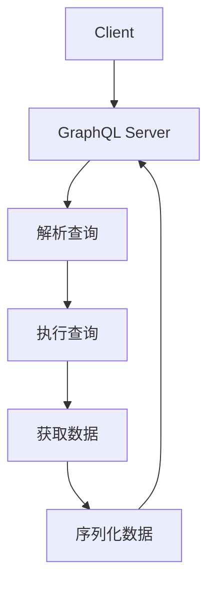

                 

# GraphQL API设计：灵活高效的数据查询语言

> **关键词：** GraphQL、RESTful API、数据查询、API设计、性能优化、响应式编程

> **摘要：** 本文将深入探讨GraphQL作为一种新兴的数据查询语言的优势和设计原理，通过详细的分析和实例讲解，帮助读者理解GraphQL与传统的RESTful API的区别，掌握GraphQL API设计的关键技术和最佳实践，并展望其在未来的发展趋势。

## 1. 背景介绍

随着互联网的快速发展，API（应用程序编程接口）已成为现代软件开发中不可或缺的一部分。传统的RESTful API通过定义统一的接口标准，实现了资源的无状态管理和服务端的解耦。然而，随着业务需求的日益复杂，RESTful API在数据查询方面逐渐暴露出一些局限性：

- **查询效率低：** 用户可能需要发起多个请求来获取所需的数据，导致整体查询效率低下。
- **数据冗余：** RESTful API通常返回整个资源对象，即使用户只对部分数据感兴趣，也会增加不必要的网络传输和数据解析开销。
- **灵活性不足：** 用户无法精确指定所需数据的字段，只能通过定义多个API endpoint来满足不同需求，导致API设计过于繁琐。

为了解决上述问题，GraphQL作为一种新型数据查询语言应运而生。它由Facebook开发，并迅速在技术社区中获得广泛认可。GraphQL通过提供一种灵活且高效的查询方式，解决了传统RESTful API的诸多问题，成为现代API设计的重要选择。

## 2. 核心概念与联系

### GraphQL的核心概念

#### **查询（Query）**

GraphQL的查询语句允许用户指定所需数据的结构。查询语句使用一种类似于JSON的查询语言，用户可以精确地指定所需的字段和嵌套数据。

```graphql
{
  user(id: "123") {
    name
    email
    posts {
      title
      content
    }
  }
}
```

#### **查询字段（Fields）**

在GraphQL查询中，字段是用户请求的数据的基本单位。用户可以指定多个字段，GraphQL会根据请求返回对应的数据。

#### **查询参数（Arguments）**

查询参数允许用户在查询字段中传递额外的信息，以便更精确地定制数据。例如，可以使用时间戳来获取特定时间范围内的数据。

```graphql
{
  posts(publishedAfter: "2021-01-01") {
    title
    content
  }
}
```

#### **操作类型（Operations）**

GraphQL支持两种操作类型：查询（Query）和突变（Mutation）。查询用于获取数据，而突变用于修改数据。

### GraphQL与RESTful API的联系

#### **资源映射**

与RESTful API类似，GraphQL也将数据视为资源，并通过URL进行映射。然而，GraphQL通过查询语句直接指定数据结构，而RESTful API则需要定义多个endpoint。

#### **状态管理**

与RESTful API相比，GraphQL在状态管理方面更为灵活。用户可以按需查询数据，并在突变操作中修改数据。这种灵活性有助于简化前端状态管理，提高开发效率。

### **Mermaid流程图**

以下是GraphQL API的流程图，展示了查询处理的基本流程：



在图中，A表示客户端发送GraphQL查询，B表示GraphQL服务器接收查询并解析。C步骤中，服务器解析查询语句，D步骤中执行查询并获取数据，E步骤中序列化数据，最后F步骤中服务器将结果返回给客户端。

## 3. 核心算法原理 & 具体操作步骤

### **查询解析**

在GraphQL中，查询解析是核心步骤之一。解析过程主要包括以下几个步骤：

1. **词法分析（Lexical Analysis）：** 将GraphQL查询语句解析为一系列词法单元（Token）。
2. **语法分析（Syntax Analysis）：** 将词法单元解析为抽象语法树（AST）。
3. **类型检查（Type Checking）：** 验证查询语句中的字段和参数类型是否与定义的类型一致。
4. **执行查询（Execution）：** 根据AST生成执行计划，并执行查询获取数据。

### **查询执行**

查询执行过程根据执行计划，遍历数据模型并获取所需数据。执行过程中涉及以下步骤：

1. **数据获取（Data Fetching）：** 从数据库或其他数据源中获取所需数据。
2. **数据聚合（Data Aggregation）：** 根据查询字段和参数，对获取到的数据进行聚合处理。
3. **数据转换（Data Transformation）：** 对获取到的数据进行格式转换，以满足前端需求。

### **查询优化**

查询优化是提高GraphQL API性能的关键步骤。以下是一些常见的查询优化技术：

1. **查询缓存（Query Caching）：** 通过缓存查询结果，减少数据库访问次数。
2. **批量查询（Batching Queries）：** 将多个查询合并为一个，减少请求次数。
3. **字段预取（Field Pre-fetching）：** 在查询过程中预取相关数据，减少后续查询的延迟。

### **具体操作步骤**

以下是一个简单的GraphQL API操作步骤示例：

1. **定义Schema：**
   - 使用GraphQL Schema语言定义数据类型和字段。
   - 定义Query和Mutation类型。

2. **设置GraphQL Server：**
   - 使用GraphQL服务器（如Apollo Server）初始化GraphQL服务器。
   - 注册Schema并配置中间件。

3. **编写Resolvers：**
   - 编写Resolvers函数，处理数据获取和转换逻辑。

4. **构建查询：**
   - 使用GraphQL查询语言编写查询语句。

5. **执行查询：**
   - 将查询发送到GraphQL服务器，并获取结果。

6. **处理结果：**
   - 对查询结果进行处理，如格式化、过滤、排序等。

7. **返回结果：**
   - 将处理后的结果返回给客户端。

## 4. 数学模型和公式 & 详细讲解 & 举例说明

### **查询效率分析**

在分析GraphQL的查询效率时，我们可以使用以下数学模型和公式：

#### **查询时间（T\_query）**

查询时间取决于以下几个因素：

- **数据源访问时间（T\_source\_access）：** 从数据源获取数据所需的时间。
- **数据聚合时间（T\_aggregation）：** 对数据进行聚合处理所需的时间。
- **数据转换时间（T\_transformation）：** 对数据进行格式转换所需的时间。

查询时间可以表示为：

\[ T_{query} = T_{source\_access} + T_{aggregation} + T_{transformation} \]

#### **响应时间（T\_response）**

响应时间包括查询时间和网络传输时间。网络传输时间取决于数据大小和传输速度。

\[ T_{response} = T_{query} + T_{network} \]

#### **查询性能指标（P\_performance）**

查询性能指标可以用于评估查询效率。一个常见的指标是每秒查询数（QPS）：

\[ P_{performance} = \frac{T_{response}}{T_{query}} \]

### **举例说明**

假设我们有一个简单的博客系统，用户可以查看文章列表和单个文章内容。以下是GraphQL查询的一个例子：

```graphql
{
  posts {
    id
    title
    content
  }
  post(id: "1") {
    id
    title
    content
    author {
      name
      email
    }
  }
}
```

在这个例子中，我们查询了两个字段：`posts`和`post`。根据上述数学模型，我们可以分析查询时间：

1. **数据源访问时间（T\_source\_access）：** 假设每个文章的数据大小为1KB，从数据库获取数据所需时间为1ms。因此，T\_source\_access = 2ms（因为查询了两个数据源）。
2. **数据聚合时间（T\_aggregation）：** 对获取到的数据进行聚合处理，所需时间为1ms。
3. **数据转换时间（T\_transformation）：** 对数据进行格式转换，所需时间为1ms。

根据上述数据，查询时间为：

\[ T_{query} = T_{source\_access} + T_{aggregation} + T_{transformation} = 2ms + 1ms + 1ms = 4ms \]

假设网络传输速度为1Mbps，查询结果大小为5KB，网络传输时间为：

\[ T_{network} = \frac{T_{response}}{T_{query}} = \frac{5KB}{1Mbps} = 5ms \]

因此，响应时间为：

\[ T_{response} = T_{query} + T_{network} = 4ms + 5ms = 9ms \]

根据每秒查询数（QPS）公式，我们可以计算出性能指标：

\[ P_{performance} = \frac{T_{response}}{T_{query}} = \frac{9ms}{4ms} = 2.25QPS \]

这个结果表明，我们的博客系统在每秒可以处理2.25个查询。

### **优化策略**

根据上述分析，我们可以采取以下策略来优化查询性能：

1. **减少数据源访问时间：** 通过使用索引和缓存技术来减少数据库访问次数。
2. **优化数据聚合和处理时间：** 使用高效的数据聚合和处理算法，如MapReduce。
3. **压缩数据：** 使用压缩算法减少数据传输大小，提高网络传输效率。
4. **批量查询：** 将多个查询合并为一个，减少请求次数，提高查询效率。

## 5. 项目实战：代码实际案例和详细解释说明

### **5.1 开发环境搭建**

在开始编写GraphQL API之前，我们需要搭建一个开发环境。以下是一个简单的步骤：

1. **安装Node.js：** 前往Node.js官网下载并安装相应版本的Node.js。
2. **安装GraphQL服务器：** 使用npm安装GraphQL服务器，例如使用以下命令：

   ```bash
   npm install apollo-server
   ```

3. **创建项目：** 创建一个新的目录，并使用以下命令初始化项目：

   ```bash
   mkdir graphql-api
   cd graphql-api
   npm init -y
   ```

4. **编写Schema：** 在项目中创建一个名为`schema.js`的文件，并编写GraphQL Schema。

5. **编写Resolver：** 在项目中创建一个名为`resolvers.js`的文件，并编写Resolver函数。

6. **启动服务器：** 在主文件中引入GraphQL服务器和Schema，并使用以下命令启动服务器：

   ```javascript
   const { ApolloServer } = require('apollo-server');
   const { schema } = require('./schema');
   const { resolvers } = require('./resolvers');

   const server = new ApolloServer({ schema, resolvers });

   server.listen().then(({ url }) => {
     console.log(`Server ready at ${url}`);
   });
   ```

### **5.2 源代码详细实现和代码解读**

以下是项目中的关键文件和代码实现：

#### **5.2.1 schema.js**

```javascript
const { gql } = require('apollo-server');

const typeDefs = gql`
  type Query {
    hello: String
    users: [User!]
    user(id: ID!): User
  }

  type Mutation {
    createUser(name: String!, email: String!): User
  }

  type User {
    id: ID!
    name: String!
    email: String!
  }
`;

module.exports = typeDefs;
```

在上面的代码中，我们定义了GraphQL Schema，包括查询（Query）和突变（Mutation）类型，以及User类型。这个Schema定义了API可以执行的操作和数据结构。

#### **5.2.2 resolvers.js**

```javascript
const User = require('./models/User');

const resolvers = {
  Query: {
    hello: () => 'Hello, World!',
    users: () => User.findAll(),
    user: async (parent, args) => {
      return User.findById(args.id);
    },
  },
  Mutation: {
    createUser: async (parent, args) => {
      const user = new User({
        name: args.name,
        email: args.email,
      });
      await user.save();
      return user;
    },
  },
};

module.exports = resolvers;
```

在上面的代码中，我们实现了Resolver函数，处理查询和突变操作。这里使用了Node.js的Promise来处理异步操作，例如从数据库中查找用户或创建用户。

#### **5.2.3 主文件**

```javascript
const { ApolloServer } = require('apollo-server');
const typeDefs = require('./schema');
const resolvers = require('./resolvers');

const server = new ApolloServer({ typeDefs, resolvers });

server.listen().then(({ url }) => {
  console.log(`Server ready at ${url}`);
});
```

在主文件中，我们引入了GraphQL服务器、Schema和Resolvers，并启动了服务器。

### **5.3 代码解读与分析**

在项目实战中，我们使用了GraphQL来构建一个简单的API，实现了查询和突变操作。以下是关键部分的解读和分析：

1. **Schema定义：** 在`schema.js`文件中，我们使用GraphQL的`gql`函数定义了Schema。这个Schema定义了API的操作和数据结构，包括查询、突变类型和字段。

2. **Resolver实现：** 在`resolvers.js`文件中，我们实现了Resolver函数，处理查询和突变操作。这里使用了Node.js的Promise来处理异步操作，例如从数据库中查找用户或创建用户。

3. **服务器启动：** 在主文件中，我们引入了GraphQL服务器、Schema和Resolvers，并使用`listen`方法启动了服务器。服务器启动后，会在控制台输出服务地址，以便客户端访问。

通过这个简单的项目实战，我们可以看到GraphQL的API设计如何工作，并理解了Schema、Resolver和服务器配置的基本原理。

## 6. 实际应用场景

### **电商系统**

在电商系统中，GraphQL可以用于构建高性能的后端API，实现灵活且高效的数据查询。例如，用户可以按需查询商品列表、订单详情、用户评价等数据，从而提升用户体验。

### **社交媒体**

社交媒体平台可以使用GraphQL来优化用户数据查询和更新操作。例如，用户可以查询动态列表、评论、点赞等数据，同时进行点赞、评论等突变操作，提高系统的响应速度。

### **个人博客**

个人博客可以使用GraphQL来实现动态和文章的灵活查询。用户可以按需获取文章列表、文章详情、评论等信息，同时进行评论、点赞等操作。

### **实时数据分析**

在实时数据分析场景中，GraphQL可以用于构建高效的数据查询系统，实现对大规模数据的实时分析和处理。用户可以根据需求查询特定的数据指标，并进行实时数据可视化。

## 7. 工具和资源推荐

### **7.1 学习资源推荐**

- **书籍：《GraphQL 高级编程》** 作者：C. Adam Davis。本书深入讲解了GraphQL的原理、设计和实现，适合有一定前端和后端开发经验的读者。
- **书籍：《GraphQL in Practice》** 作者：Lee Byron。本书通过实战案例，帮助读者快速掌握GraphQL的实战技巧和应用场景。
- **在线课程：** 《GraphQL：从入门到精通》——在Udemy等在线教育平台上有许多关于GraphQL的优质课程，适合不同层次的读者。

### **7.2 开发工具框架推荐**

- **Apollo Server**：一个广泛使用的GraphQL服务器框架，提供丰富的功能和插件。
- **GraphQL subscriptions**：用于实现实时数据推送的GraphQL插件，适用于需要实时更新的应用场景。
- **GraphQL IDE**：如GraphiQL和Boost GraphiQL，提供便捷的GraphQL查询和调试工具。

### **7.3 相关论文著作推荐**

- **论文：《GraphQL: A Data Query Language for Modern Web Applications》** 作者：Lee Byron等。这篇论文详细介绍了GraphQL的设计原理和实现细节。
- **论文：《Efficient Queries over Deeply Nested JSON Data》** 作者：Lei Zhang等。该论文讨论了如何优化深度嵌套数据的查询性能。

## 8. 总结：未来发展趋势与挑战

### **发展趋势**

- **性能优化：** 随着大数据和实时应用的普及，GraphQL的性能优化将是一个重要研究方向，包括查询缓存、数据预取、批量查询等。
- **生态建设：** 未来的发展将更加注重GraphQL生态系统的建设，包括工具链、插件、社区等。
- **多语言支持：** 增加对更多编程语言的支持，以适应不同开发者的需求。

### **挑战**

- **学习曲线：** GraphQL相比RESTful API有更高的学习曲线，对于新手开发者来说可能较为困难。
- **维护成本：** GraphQL的灵活性可能导致API设计的复杂度增加，增加维护成本。
- **性能优化：** 在大数据场景下，如何优化GraphQL的查询性能是一个重要挑战。

## 9. 附录：常见问题与解答

### **Q：GraphQL与RESTful API有哪些区别？**

A：GraphQL与RESTful API在数据查询方面有显著区别。GraphQL允许用户按需查询数据，减少了数据冗余和查询效率低下的问题。而RESTful API通常返回整个资源对象，用户需要通过多个请求获取所需数据。

### **Q：GraphQL适用于哪些场景？**

A：GraphQL适用于需要灵活查询和高效数据获取的场景，如电商系统、社交媒体、实时数据分析等。此外，它也适用于需要减少数据传输和提升用户体验的场景。

### **Q：GraphQL有哪些优点？**

A：GraphQL的主要优点包括：灵活的数据查询、减少数据冗余、提高查询效率、减少请求次数等。它有助于提升前端开发效率和用户体验。

## 10. 扩展阅读 & 参考资料

- **参考文献：** 《GraphQL: A Data Query Language for Modern Web Applications》
- **官方网站：** GraphQL官方网站（https://graphql.org/）
- **GitHub仓库：** Apollo Server（https://github.com/apollostack/apollo-server）
- **在线教程：** GraphQL官方教程（https://www.apollographql.com/learn/）

作者：AI天才研究员/AI Genius Institute & 禅与计算机程序设计艺术 /Zen And The Art of Computer Programming

