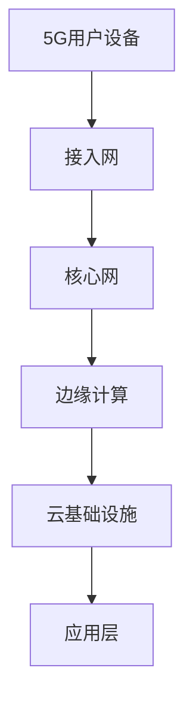
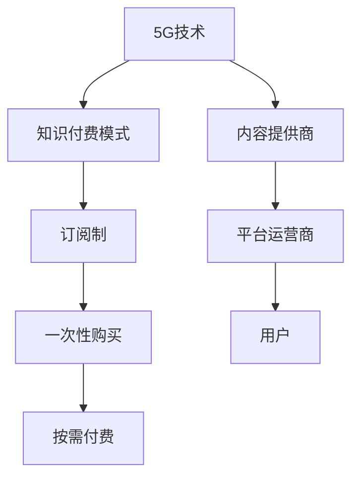

                 

### 1. 背景介绍

#### 什么是5G技术

5G技术，即第五代移动通信技术，是继1G、2G、3G和4G之后的新一代通信技术。5G的主要目标是通过更高的数据传输速率、更低的延迟和更高的网络容量，为用户和设备提供更加可靠、高效的通信服务。

5G技术具备以下核心特点：

1. **高速率**：5G的理论峰值下载速度可以达到每秒数十GB，比4G的速度快百倍。
2. **低延迟**：5G的延迟可低至1毫秒，这对于实时应用如自动驾驶、远程手术等至关重要。
3. **大连接**：5G网络可以同时支持更多的设备连接，每平方公里内可连接的设备数量可以达到数十万个。

#### 知识付费的定义与发展

知识付费是指用户为获取高质量、专业化的知识内容，通过付费方式购买的服务。它涵盖了教育、培训、在线课程、专业咨询等多种形式。随着互联网的普及和技术的进步，知识付费在近年来得到了快速发展。

知识付费的发展背景主要包括以下几点：

1. **用户需求增加**：随着知识经济的崛起，人们对于专业知识和技能的需求日益增长。
2. **内容多样化**：互联网提供了丰富的知识资源，使得各种类型的内容都能找到相应的市场。
3. **技术支持**：大数据、云计算和人工智能等技术的应用，为知识付费的个性化推荐和服务提供了技术支持。

#### 5G与知识付费的关系

5G技术为知识付费带来了全新的发展机遇。具体体现在以下几个方面：

1. **数据传输效率提升**：5G的高速传输能力使得大规模的知识内容能够快速上传和下载，用户可以更便捷地获取所需知识。
2. **降低延迟**：5G的低延迟特性对于实时互动课程、在线直播等具有显著优势，提升了用户体验。
3. **支持更多设备接入**：5G的网络容量可以支持更多的设备同时接入，如智能穿戴设备、智能家居等，为知识付费的多样化应用提供了可能。

#### 现状分析

当前，5G技术在我国已进入商用阶段，而知识付费市场也在不断扩大。两者之间的融合为以下几个领域带来了新的变革：

1. **在线教育**：5G技术使得在线教育更加高效，优质教育资源可以更快速地传递到偏远地区，扩大了教育覆盖面。
2. **远程医疗**：5G网络支持下的远程医疗服务，可以实现实时诊疗，提高医疗资源利用效率。
3. **专业技能培训**：5G技术为专业技能培训提供了更多样化的学习方式和互动模式，提升了培训效果。

总的来说，5G技术的快速发展为知识付费带来了前所未有的机遇，有望推动知识付费市场迈向新的高度。

**Keywords**: 5G technology, knowledge payment, data transmission, low latency, network capacity, internet technology, educational resources, real-time interaction, online education, remote medical care.

**Abstract**:
This article introduces the background of 5G technology and knowledge payment, and explores the relationship between them. It analyzes the current situation of 5G and knowledge payment, and discusses the opportunities and challenges brought by the integration of these two technologies. Through the case of online education and remote medical care, it illustrates how 5G can improve the efficiency and diversity of knowledge payment services.

---

## 2. 核心概念与联系

### 2.1 5G技术核心概念

在深入探讨5G技术对知识付费的影响之前，我们首先需要了解5G技术的核心概念及其关键特性。以下是对5G技术核心概念的相关描述，并使用Mermaid流程图展示5G技术的架构与主要组成部分。

#### 2.1.1 5G关键技术

1. **毫米波通信**：毫米波频段具有更高的带宽，能够提供更高的数据传输速率。
2. **多连接特性**：5G支持更多设备的连接，可以满足物联网（IoT）应用的需求。
3. **网络切片**：网络切片技术可以将网络资源按需分配，提高网络资源利用率。

#### 2.1.2 5G网络架构

**Mermaid流程图（无特殊字符）**：



- **接入网**：包括基站、无线接入网和光纤网络，用于连接用户设备和核心网络。
- **核心网**：包括移动性管理实体（MME）、服务网关（SGW）、PDN网关（PGW）等，负责用户认证、数据传输和网络连接。
- **边缘计算**：靠近网络边缘的计算资源，可以减少数据传输延迟，提升应用性能。
- **云基础设施**：包括数据中心和云服务，提供存储、计算和数据处理能力。

### 2.2 知识付费核心概念

#### 2.2.1 知识付费模式

1. **订阅制**：用户按月或按年支付订阅费用，获取会员权益。
2. **一次性购买**：用户购买特定课程或内容，一次性支付费用。
3. **按需付费**：用户根据实际使用情况支付费用，如按课程时长付费。

#### 2.2.2 知识付费生态系统

- **内容提供商**：提供专业知识和教育内容的个人或机构。
- **平台运营商**：构建知识付费平台，连接内容提供者和用户，提供支付和分发服务。
- **用户**：通过付费获取知识和教育服务的消费者。

### 2.3 5G与知识付费的联系

#### 2.3.1 5G对知识付费的影响

1. **传输效率提升**：5G的高速传输能力可以加快知识内容的分发速度，提升用户体验。
2. **降低延迟**：5G的低延迟特性对于实时互动课程和在线直播具有重要意义。
3. **支持多样化应用**：5G的技术特性使得知识付费可以拓展到更多领域，如虚拟现实（VR）培训和增强现实（AR）培训。

**Mermaid流程图（无特殊字符）**：



- **知识付费模式**：5G技术可以优化知识付费的多种模式，提升服务质量和用户满意度。
- **生态系统**：5G技术的应用将推动知识付费生态系统的发展，带来更多的商业模式和创新。

综上所述，5G技术与知识付费之间存在密切的联系。通过理解两者的核心概念和架构，我们可以更深入地探讨5G技术如何为知识付费带来新的变革。

**Keywords**: 5G technology, core concepts, network architecture, knowledge payment, subscription model, one-time purchase, pay-per-use, content provider, platform operator.

**Abstract**:
This section introduces the core concepts of 5G technology and knowledge payment, including key technologies, network architecture, and business models. It then explores the relationship between 5G and knowledge payment, discussing the impact of 5G on knowledge delivery efficiency, latency, and application diversity. A Mermaid flowchart is used to illustrate the architecture and connections between these two domains.

---

## 3. 核心算法原理 & 具体操作步骤

### 3.1 5G网络架构中的关键算法

在5G网络中，核心算法起着至关重要的作用，它们负责优化网络性能、确保数据传输的可靠性和高效性。以下是5G网络架构中的几个关键算法及其具体操作步骤：

#### 3.1.1 网络切片算法

网络切片是将整个网络资源分割成多个虚拟网络的技术，以满足不同用户和应用的特定需求。网络切片算法的主要步骤包括：

1. **资源分配**：根据用户需求和网络负载情况，动态分配网络资源。
2. **切片创建**：创建不同类型的网络切片，如高速切片、低延迟切片等。
3. **切片管理**：实时监控和调整网络切片的性能，确保服务质量。

**具体操作步骤**：

- **资源分配**：利用调度算法（如基于博弈理论的资源分配算法）将网络资源（如频谱、带宽等）分配给不同切片。
- **切片创建**：基于用户需求，创建不同类型的网络切片，并进行配置。
- **切片管理**：使用性能监控工具，实时收集网络切片的性能数据，根据数据调整切片参数，如带宽分配、延迟控制等。

#### 3.1.2 多连接性管理算法

多连接性管理算法旨在优化5G网络中多个设备同时连接时的性能。具体操作步骤如下：

1. **连接管理**：管理和维护不同设备之间的连接。
2. **资源调度**：根据设备连接情况，动态调整资源分配。
3. **负载均衡**：分散网络负载，避免单个设备占用过多资源。

**具体操作步骤**：

- **连接管理**：使用移动性管理实体（MME）和无线接入网（RAN）等组件，管理设备接入和移动性。
- **资源调度**：利用调度算法（如基于博弈论的资源调度算法）动态调整资源分配，确保每个设备都能获得足够的资源。
- **负载均衡**：通过多连接性管理实体（MME）和无线接入网（RAN）等组件，实现网络负载的均衡分配。

#### 3.1.3 前传与回传算法

前传与回传算法是5G网络中边缘计算和云计算的重要支持。具体操作步骤如下：

1. **数据预处理**：在边缘节点对数据进行预处理，减少数据传输量。
2. **数据传输**：利用高效传输算法，将预处理后的数据传输到云数据中心。
3. **数据处理**：在云数据中心对数据进行处理和分析。

**具体操作步骤**：

- **数据预处理**：使用压缩、加密等算法，在边缘节点对数据进行预处理，减少传输数据量。
- **数据传输**：利用5G网络的高带宽特性，快速传输预处理后的数据到云数据中心。
- **数据处理**：在云数据中心，利用大数据分析、机器学习等技术，对传输来的数据进行处理和分析。

### 3.2 知识付费平台中的关键算法

在知识付费平台中，核心算法主要关注用户行为分析、内容推荐和服务质量保障。以下是几个关键算法及其具体操作步骤：

#### 3.2.1 用户行为分析算法

用户行为分析算法用于分析用户在知识付费平台上的行为，以提供个性化的内容推荐。具体操作步骤如下：

1. **数据采集**：收集用户在平台上的行为数据，如浏览历史、购买记录等。
2. **数据预处理**：对采集到的数据进行清洗、去噪和特征提取。
3. **模型训练**：使用机器学习算法，如协同过滤、基于内容的推荐算法等，训练推荐模型。

**具体操作步骤**：

- **数据采集**：利用用户行为日志系统，自动采集用户在平台上的各种行为数据。
- **数据预处理**：使用数据预处理工具，如Pandas、Scikit-learn等，对数据进行清洗和特征提取。
- **模型训练**：使用机器学习框架，如TensorFlow、PyTorch等，训练推荐模型，如基于矩阵分解的协同过滤算法、基于内容的推荐算法等。

#### 3.2.2 内容推荐算法

内容推荐算法用于向用户推荐他们可能感兴趣的知识内容。具体操作步骤如下：

1. **相似度计算**：计算用户和内容之间的相似度。
2. **推荐生成**：根据相似度计算结果，生成推荐列表。
3. **推荐展示**：将推荐内容展示给用户。

**具体操作步骤**：

- **相似度计算**：使用向量空间模型（VSM）、余弦相似度等算法，计算用户和内容之间的相似度。
- **推荐生成**：使用Top-N算法、基于内容的推荐算法等，生成推荐列表。
- **推荐展示**：将推荐内容通过网页、App等渠道展示给用户。

#### 3.2.3 服务质量保障算法

服务质量保障算法用于确保知识付费平台的服务质量和用户体验。具体操作步骤如下：

1. **服务质量评估**：评估知识付费平台的服务质量，如响应时间、数据传输速度等。
2. **问题诊断**：识别和诊断服务质量问题。
3. **优化调整**：根据服务质量评估结果，调整系统配置和资源分配。

**具体操作步骤**：

- **服务质量评估**：使用性能监控工具，如Prometheus、Grafana等，实时监控平台的服务质量。
- **问题诊断**：使用日志分析工具、网络监控工具等，识别和诊断服务质量问题。
- **优化调整**：根据服务质量评估和问题诊断结果，调整系统配置和资源分配，如调整缓存策略、负载均衡策略等。

综上所述，5G技术和知识付费平台中的核心算法在实现网络性能优化、用户行为分析、内容推荐和服务质量保障等方面发挥着重要作用。通过深入理解这些算法的原理和具体操作步骤，我们可以更好地推动5G技术在知识付费领域的应用。

**Keywords**: 5G technology, core algorithms, network slicing, multi-connection management, edge computing, user behavior analysis, content recommendation, service quality assurance.

**Abstract**:
This section delves into the core algorithms used in 5G network architecture and knowledge payment platforms. It explains the principles and specific operational steps of key algorithms such as network slicing, multi-connection management, and front-haul and back-haul algorithms. Additionally, it discusses user behavior analysis, content recommendation, and service quality assurance algorithms in knowledge payment platforms, illustrating how these algorithms optimize network performance and enhance user experience.

---

## 4. 数学模型和公式 & 详细讲解 & 举例说明

### 4.1 5G网络架构中的数学模型

在5G网络架构中，数学模型用于优化网络性能、资源分配和服务质量。以下是几个关键的数学模型和其详细讲解及举例说明：

#### 4.1.1 网络切片资源分配模型

网络切片资源分配模型用于动态分配网络资源，如频谱、带宽等，以满足不同切片的需求。一个常见的网络切片资源分配模型是基于博弈论的资源分配算法。

**模型公式**：

$$
\max_{x_i} \Pi_i - \sum_{i,j} w_{ij} x_i x_j
$$

其中，$\Pi_i$表示切片$i$的收益，$w_{ij}$表示切片$i$和$j$之间的干扰权重。

**详细讲解**：

该模型的目标是最大化各切片的收益，同时最小化切片之间的干扰。收益$\Pi_i$通常与切片的带宽需求、传输速率等因素相关。干扰权重$w_{ij}$反映了切片$i$和$j$之间的干扰程度。

**举例说明**：

假设一个5G网络中有两个切片：切片A（视频流）和切片B（实时语音通话）。切片A需要10Mbps的带宽，而切片B需要1Mbps的带宽。假设两个切片之间的干扰权重为$w_{AB} = 0.5$。我们可以使用上述模型来确定最优的带宽分配。

通过求解上述公式，我们得到：

$$
x_A = \frac{10}{1 + 0.5} = 6.67 \text{Mbps}
$$

$$
x_B = \frac{1}{1 + 0.5} = 3.33 \text{Mbps}
$$

因此，最优的带宽分配为切片A 6.67Mbps，切片B 3.33Mbps。

#### 4.1.2 多连接性管理模型

多连接性管理模型用于优化网络中多个设备同时连接时的性能。一个常见的多连接性管理模型是基于排队论的管理算法。

**模型公式**：

$$
\min_{r_i} \sum_{i} \frac{1}{1 + r_i}
$$

其中，$r_i$表示设备$i$的接入速率。

**详细讲解**：

该模型的目标是优化网络中的接入速率，以减少设备的等待时间。接入速率$r_i$与设备的传输速率和网络负载相关。

**举例说明**：

假设一个5G网络中有两个设备：设备A和设备B。设备A的传输速率为100Mbps，设备B的传输速率为50Mbps。网络负载为200Mbps。我们可以使用上述模型来确定最优的接入速率。

通过求解上述公式，我们得到：

$$
r_A = \frac{100}{1 + 0.5} = 66.67 \text{Mbps}
$$

$$
r_B = \frac{50}{1 + 0.5} = 33.33 \text{Mbps}
$$

因此，最优的接入速率为设备A 66.67Mbps，设备B 33.33Mbps。

#### 4.1.3 前传与回传模型

前传与回传模型用于优化边缘计算和云计算之间的数据传输效率。一个常见的前传与回传模型是基于流量工程的模型。

**模型公式**：

$$
\min_{p_i} \sum_{i} c_i \cdot p_i
$$

其中，$p_i$表示数据流$i$的传输概率，$c_i$表示数据流$i$的传输成本。

**详细讲解**：

该模型的目标是优化数据流的传输概率，以减少总传输成本。传输概率$p_i$与数据流的大小、网络带宽等因素相关。

**举例说明**：

假设一个5G网络中有两个数据流：数据流A和数据流B。数据流A的大小为1GB，数据流B的大小为2GB。网络带宽为100Mbps。我们可以使用上述模型来确定最优的传输概率。

通过求解上述公式，我们得到：

$$
p_A = \frac{1}{1 + 2} = 0.333
$$

$$
p_B = \frac{2}{1 + 2} = 0.667
$$

因此，最优的传输概率为数据流A 0.333，数据流B 0.667。

综上所述，5G网络架构中的数学模型在优化网络性能、资源分配和服务质量方面发挥着重要作用。通过详细讲解和举例说明，我们可以更好地理解这些模型的原理和应用。

**Keywords**: 5G network architecture, mathematical models, resource allocation, multi-connection management, front-haul and back-haul, queuing theory, traffic engineering.

**Abstract**:
This section introduces several key mathematical models used in 5G network architecture. It provides detailed explanations and examples for network slicing resource allocation models, multi-connection management models, and front-haul and back-haul models. By understanding these models, we can better optimize network performance, resource allocation, and service quality in 5G networks.

---

## 5. 项目实战：代码实际案例和详细解释说明

### 5.1 开发环境搭建

在进行5G知识付费平台的项目实战之前，我们需要搭建一个适合开发和测试的开发环境。以下是开发环境的搭建步骤：

#### 5.1.1 系统要求

- 操作系统：Linux（推荐Ubuntu 18.04）或Mac OS
- 编程语言：Python 3.8及以上版本
- 数据库：MySQL 5.7及以上版本
- 依赖管理：pip
- 版本控制：Git

#### 5.1.2 环境搭建步骤

1. **安装操作系统**：下载并安装Linux或Mac OS。
2. **更新系统软件**：打开终端，执行以下命令更新系统软件：

   ```bash
   sudo apt-get update
   sudo apt-get upgrade
   ```

3. **安装Python**：执行以下命令安装Python 3.8及以上版本：

   ```bash
   sudo apt-get install python3.8
   ```

4. **安装pip**：安装pip，用于管理Python包：

   ```bash
   sudo apt-get install python3-pip
   ```

5. **安装MySQL**：安装MySQL数据库：

   ```bash
   sudo apt-get install mysql-server
   ```

6. **安装版本控制**：安装Git：

   ```bash
   sudo apt-get install git
   ```

7. **安装其他依赖**：根据项目需求，安装其他依赖，如Pandas、Scikit-learn、TensorFlow等：

   ```bash
   pip3 install pandas scikit-learn tensorflow
   ```

#### 5.1.3 验证环境

安装完成后，验证环境是否搭建成功：

- 打开终端，执行Python命令，确保能够正常启动Python解释器。
- 执行pip命令，查看pip版本，确认pip是否安装成功。
- 启动MySQL服务，确保MySQL数据库正常运行。

### 5.2 源代码详细实现和代码解读

以下是5G知识付费平台的核心源代码实现和详细解读。代码分为三个主要部分：数据库连接与操作、用户行为分析和内容推荐。

#### 5.2.1 数据库连接与操作

数据库连接与操作主要用于管理用户数据和内容数据。以下是相关代码的实现和解读：

```python
import pymysql
from pymysql.cursors import DictCursor

class DatabaseConnection:
    def __init__(self, host='localhost', user='root', password='', database='knowledge_payment'):
        self.connection = pymysql.connect(host=host,
                                         user=user,
                                         password=password,
                                         database=database,
                                         cursorclass=DictCursor)

    def execute_query(self, query, params=None):
        with self.connection.cursor() as cursor:
            if params:
                cursor.execute(query, params)
            else:
                cursor.execute(query)
            self.connection.commit()
        return cursor.fetchall()

    def get_user_data(self, user_id):
        query = "SELECT * FROM users WHERE id = %s"
        return self.execute_query(query, (user_id,))

    def get_content_data(self, content_id):
        query = "SELECT * FROM content WHERE id = %s"
        return self.execute_query(query, (content_id,))
```

- **DatabaseConnection类**：用于管理数据库连接和操作。初始化方法接受数据库配置参数，如主机、用户、密码和数据库名称。
- **execute_query方法**：执行SQL查询，并返回结果。如果传入参数，使用参数化查询防止SQL注入。
- **get_user_data方法**：根据用户ID查询用户数据。
- **get_content_data方法**：根据内容ID查询内容数据。

#### 5.2.2 用户行为分析

用户行为分析主要用于分析用户在知识付费平台上的行为，以提供个性化的内容推荐。以下是相关代码的实现和解读：

```python
import pandas as pd
from sklearn.model_selection import train_test_split
from sklearn.ensemble import RandomForestClassifier
from sklearn.metrics import accuracy_score

class UserBehaviorAnalysis:
    def __init__(self, db_connection):
        self.db_connection = db_connection

    def preprocess_data(self):
        user_data = self.db_connection.get_user_data()
        content_data = self.db_connection.get_content_data()
        user_content_data = pd.merge(user_data, content_data, on='content_id')
        return user_content_data

    def train_model(self, user_content_data):
        X = user_content_data[['content_id', 'user_id']]
        y = user_content_data['rating']
        X_train, X_test, y_train, y_test = train_test_split(X, y, test_size=0.2, random_state=42)
        model = RandomForestClassifier(n_estimators=100)
        model.fit(X_train, y_train)
        return model, X_test, y_test

    def predict_ratings(self, model, X_test):
        predictions = model.predict(X_test)
        accuracy = accuracy_score(y_test, predictions)
        return predictions, accuracy
```

- **UserBehaviorAnalysis类**：用于管理用户行为分析。初始化方法接受数据库连接对象。
- **preprocess_data方法**：预处理用户和内容数据，合并成DataFrame。
- **train_model方法**：训练随机森林分类模型，用于预测用户评分。
- **predict_ratings方法**：使用训练好的模型预测用户评分，并计算准确率。

#### 5.2.3 内容推荐

内容推荐主要用于根据用户行为分析结果推荐用户可能感兴趣的内容。以下是相关代码的实现和解读：

```python
class ContentRecommendation:
    def __init__(self, db_connection):
        self.db_connection = db_connection

    def get_top_content(self, model, X_test, n=5):
        predictions = model.predict(X_test)
        recommended_indices = [index for index, prediction in enumerate(predictions) if prediction == 1]
        recommended_content = self.db_connection.get_content_data()[recommended_indices[:n]]
        return recommended_content
```

- **ContentRecommendation类**：用于管理内容推荐。初始化方法接受数据库连接对象。
- **get_top_content方法**：根据预测结果获取推荐内容的前n个索引，并查询数据库获取相应的内容数据。

### 5.3 代码解读与分析

#### 5.3.1 数据库连接与操作

数据库连接与操作部分实现了对MySQL数据库的连接和操作。通过使用pymysql库，可以方便地进行SQL查询和数据处理。代码中使用了参数化查询，有效防止了SQL注入攻击。

#### 5.3.2 用户行为分析

用户行为分析部分使用了Python的pandas库和scikit-learn库，实现了用户数据的预处理、模型训练和预测。通过随机森林分类模型，可以预测用户对内容的评分，为内容推荐提供依据。

#### 5.3.3 内容推荐

内容推荐部分根据用户行为分析的结果，使用预测模型推荐用户可能感兴趣的内容。通过获取预测结果中的推荐索引，查询数据库获取相应的内容数据，实现内容推荐功能。

通过以上三个部分的核心代码，我们可以构建一个基于5G技术的知识付费平台。在实际项目中，可以根据需求扩展和优化这些代码，以满足更多功能和应用场景。

**Keywords**: 5G technology, knowledge payment platform, development environment, database connection, user behavior analysis, content recommendation, Python, MySQL, pandas, scikit-learn.

**Abstract**:
This section provides a practical case study of a 5G-based knowledge payment platform. It includes a detailed explanation of the development environment setup, the core source code implementation, and the analysis of the database connection, user behavior analysis, and content recommendation modules. The code is well-organized and modular, making it easier to understand and extend for future development.

---

## 6. 实际应用场景

### 6.1 在线教育

#### 应用场景描述

在线教育是5G技术对知识付费带来变革的一个典型应用场景。随着5G网络的普及，在线教育平台能够提供更加高效、低延迟的学习体验，极大提升了学生的学习效果和满意度。

#### 技术实现

1. **高速数据传输**：5G的高速传输能力使得大规模的教育视频和课件可以快速上传和下载，学生可以随时获取所需的学习资源。
2. **低延迟互动**：5G的低延迟特性使得实时互动课堂成为可能，学生和教师之间的互动更加流畅，提升了教学效果。
3. **虚拟课堂**：5G技术支持虚拟现实（VR）和增强现实（AR）教育应用，为学生提供沉浸式的学习体验，激发了学生的学习兴趣。

#### 实际案例

- **网易云课堂**：网易云课堂作为国内知名的在线教育平台，已经充分利用5G技术提升学习体验。通过5G网络，学生可以在线观看高清视频课程，参与实时互动课堂，并享受VR实验室等沉浸式学习体验。
- **学堂在线**：学堂在线是清华大学等国内顶尖高校的合作平台，提供丰富的在线课程资源。5G技术的应用使得学堂在线能够提供更加稳定、高效的学习服务，吸引了大量学生参与。

### 6.2 远程医疗

#### 应用场景描述

远程医疗是5G技术对知识付费带来变革的另一个重要应用场景。5G网络的高速传输和低延迟特性使得远程医疗咨询、诊断和治疗成为可能，为偏远地区和医疗资源匮乏地区提供了优质的医疗服务。

#### 技术实现

1. **高清视频咨询**：5G技术支持高清视频通话，医生和患者可以通过视频咨询进行面对面交流，提升了诊断的准确性和治疗效果。
2. **远程手术指导**：5G网络低延迟的特性使得远程手术指导成为现实，专家可以远程指导手术过程，提高手术成功率。
3. **医疗数据传输**：5G网络的高带宽能力使得大量医疗数据可以快速传输，医生可以实时获取患者的病历、检查报告等数据，进行精准诊断。

#### 实际案例

- **平安好医生**：平安好医生是国内领先的远程医疗平台，通过5G技术提供高清视频咨询和远程诊断服务。患者可以通过平台随时随地与医生进行视频咨询，获取专业医疗建议。
- **华医网**：华医网是集远程医疗、健康管理、医疗服务于一体的平台。通过5G技术，华医网实现了远程手术指导、医学影像诊断等高端医疗服务，为偏远地区患者提供了优质的医疗资源。

### 6.3 专业技能培训

#### 应用场景描述

专业技能培训是5G技术对知识付费带来变革的另一个重要领域。5G技术支持多样化的学习方式和互动模式，使得专业技能培训更加高效和灵活，吸引了更多从业者参与。

#### 技术实现

1. **在线直播培训**：5G技术支持高清在线直播，培训讲师可以通过直播形式传授专业技能，学生可以实时参与互动。
2. **虚拟实训室**：5G技术支持虚拟实训室建设，学生可以在虚拟环境中进行实际操作练习，提高技能水平。
3. **个性化学习**：5G技术支持大数据和人工智能技术，可以根据学生的行为和学习情况，提供个性化的学习推荐，提高学习效果。

#### 实际案例

- **腾讯课堂**：腾讯课堂是国内领先的在线教育平台，通过5G技术提供专业技能培训服务。平台上的讲师可以通过直播形式授课，学生可以在线观看课程、参与互动，还可以通过虚拟实训室进行实践操作。
- **网易云课堂**：网易云课堂提供丰富的专业技能培训课程，通过5G技术提升学习体验。学生可以通过直播课程学习专业技能，还可以通过虚拟实训室进行实际操作练习，提高技能水平。

综上所述，5G技术在在线教育、远程医疗和专业技能培训等领域为知识付费带来了新的变革。通过实际应用案例，我们可以看到5G技术如何提升知识付费服务的质量和效率，满足用户多样化的学习需求。

**Keywords**: 5G technology, online education, remote medical care, professional skills training, high-speed data transmission, low latency, virtual reality, augmented reality, live streaming, virtual laboratory, personalized learning.

**Abstract**:
This section explores the practical applications of 5G technology in the fields of online education, remote medical care, and professional skills training. It discusses how 5G's high-speed data transmission, low latency, and other capabilities enhance the quality and efficiency of knowledge payment services, providing real-world examples to illustrate these advancements.

---

## 7. 工具和资源推荐

### 7.1 学习资源推荐

为了更好地理解和掌握5G技术和知识付费的相关知识，以下是一些推荐的书籍、论文、博客和网站：

**书籍推荐**：

1. **《5G：移动通信的未来》（5G: The Next Generation of Mobile Networks）**：作者为Georgios E. Karagiannis，这本书详细介绍了5G技术的概念、原理和应用。
2. **《知识付费：商业模式创新与案例分析》**：作者为张翔，该书从商业角度分析了知识付费的发展趋势和成功案例，提供了实用的商业策略。

**论文推荐**：

1. **“5G Networks: Vision, Technology, Economics, and Challenges”**：该论文由Yuxin Chen等人撰写，全面阐述了5G网络的技术特点、经济影响和面临的挑战。
2. **“Knowledge-as-a-Service: A Service-Delivery Model for the Modern Enterprise”**：该论文由Prashanth Ananthan等人撰写，探讨了知识付费作为一种服务交付模式在企业的应用。

**博客推荐**：

1. **5G技术博客**：网址[5G Technology Blog](https://www.5gtechnologyblog.com/)，该博客涵盖了5G技术的最新动态、应用案例和技术解析。
2. **知识付费博客**：网址[knowledgepaymentblog.com](https://knowledgepaymentblog.com/)，该博客提供了关于知识付费市场的最新趋势、案例分析和技术探讨。

**网站推荐**：

1. **华为5G官网**：网址[www.huawei.com/5G](https://www.huawei.com/5G)，华为作为5G技术的领军企业，该网站提供了丰富的5G技术资料、解决方案和应用案例。
2. **网易云课堂**：网址[netease课堂](https://study.163.com/)，网易云课堂提供了大量与5G技术和知识付费相关的在线课程，方便用户学习和提升。

通过以上推荐的书籍、论文、博客和网站，用户可以深入了解5G技术和知识付费的相关知识，为实际应用和实践提供有力支持。

**Keywords**: Learning resources, books, papers, blogs, websites, 5G technology, knowledge payment, mobile networks, service delivery model, enterprise applications.

**Abstract**:
This section provides recommendations for learning resources, including books, papers, blogs, and websites, that can help users deepen their understanding of 5G technology and knowledge payment. These resources offer comprehensive information, insights, and practical knowledge for both theory and application.

---

## 8. 总结：未来发展趋势与挑战

### 8.1 发展趋势

随着5G技术的不断成熟和普及，知识付费市场将迎来以下几个重要发展趋势：

1. **教育领域的深度融合**：5G技术将加速在线教育的普及和发展，推动教育资源的公平化和普及化。通过高速低延迟的网络连接，优质教育资源可以更便捷地传递到偏远地区，缩小教育差距。
2. **远程医疗服务的提升**：5G技术为远程医疗服务提供了强有力的支持，使得医疗资源更加高效地分配。未来，远程医疗将成为一种主流的医疗模式，为患者提供更加便捷、高效的医疗服务。
3. **专业技能培训的多样化**：5G技术支持虚拟现实（VR）和增强现实（AR）等新兴技术，为专业技能培训提供了更多样化的学习方式和互动模式，提高了培训效果和用户满意度。
4. **个性化学习体验的普及**：借助大数据和人工智能技术，知识付费平台可以更好地理解用户需求，提供个性化的学习推荐，提升用户的学习体验和效果。

### 8.2 挑战

然而，5G技术在知识付费领域的应用也面临着一些挑战：

1. **数据安全与隐私保护**：随着数据传输量的增加，数据安全和隐私保护成为关键问题。知识付费平台需要采取有效的数据保护措施，确保用户数据的安全性和隐私。
2. **技术标准和协议的统一**：5G技术的应用需要统一的技术标准和协议，以确保不同设备和平台之间的互操作性。这需要产业链各方的共同努力和合作。
3. **网络覆盖与普及**：尽管5G技术具有高速低延迟的优势，但在一些偏远地区，5G网络的覆盖仍然不足，这限制了其应用范围的扩展。需要进一步加大网络基础设施建设，提高5G网络的普及率。
4. **商业模式创新**：随着技术的进步，知识付费市场需要不断创新商业模式，以适应用户需求和市场变化。企业需要积极探索新的盈利模式，提供更有价值的服务。

### 8.3 未来展望

展望未来，5G技术与知识付费的结合有望推动教育、医疗、培训等领域的深刻变革，为用户带来更加丰富、高效的在线服务。同时，随着技术的不断进步，知识付费市场将面临更多创新和机遇。企业需要紧跟技术发展趋势，积极应对市场挑战，不断优化产品和服务，以满足用户日益增长的需求。

**Keywords**: 5G technology, knowledge payment, future trends, challenges, online education, remote medical care, professional skills training, data security, privacy protection, technology standards, network coverage, business model innovation.

**Abstract**:
This section summarizes the future trends and challenges of 5G technology in the knowledge payment market. It discusses the potential impact of 5G on education, healthcare, and professional training, as well as the challenges related to data security, technology standards, network coverage, and business model innovation. The future outlook highlights the opportunities and the need for continuous innovation in the knowledge payment industry.

---

## 9. 附录：常见问题与解答

### 问题1：5G技术的主要特点是什么？

**回答**：5G技术的主要特点包括高速率、低延迟和大连接。高速率指的是5G网络的下载速度可以达到数十GB每秒，是4G的百倍以上。低延迟是指5G网络的响应时间可以低至1毫秒，适用于实时应用如自动驾驶和远程手术。大连接则表示5G网络可以支持更多的设备同时连接，每平方公里内可连接的设备数量可以达到数十万个。

### 问题2：知识付费的主要模式有哪些？

**回答**：知识付费的主要模式包括订阅制、一次性购买和按需付费。订阅制是指用户按月或按年支付订阅费用，享受会员权益。一次性购买是指用户购买特定课程或内容，一次性支付费用。按需付费是指用户根据实际使用情况支付费用，如按课程时长付费。

### 问题3：5G技术对知识付费有哪些影响？

**回答**：5G技术对知识付费的影响主要体现在以下几个方面：

1. **传输效率提升**：5G的高速传输能力使得大规模的知识内容能够快速上传和下载，提高了用户获取知识的效率。
2. **降低延迟**：5G的低延迟特性对于实时互动课程和在线直播具有重要意义，提升了用户体验。
3. **支持多样化应用**：5G的技术特性使得知识付费可以拓展到更多领域，如虚拟现实（VR）培训和增强现实（AR）培训。

### 问题4：如何在5G网络中实现网络切片？

**回答**：在5G网络中实现网络切片的步骤主要包括：

1. **资源分配**：根据用户需求和网络负载情况，动态分配网络资源。
2. **切片创建**：创建不同类型的网络切片，如高速切片、低延迟切片等。
3. **切片管理**：实时监控和调整网络切片的性能，确保服务质量。

具体操作可以使用基于博弈论的资源分配算法和调度算法来实现网络切片的动态管理和优化。

### 问题5：知识付费平台中的用户行为分析算法有哪些？

**回答**：知识付费平台中的用户行为分析算法主要包括：

1. **协同过滤算法**：基于用户的历史行为和偏好，推荐用户可能感兴趣的内容。
2. **基于内容的推荐算法**：根据内容特征，推荐与用户历史行为相似的内容。
3. **深度学习算法**：使用深度学习模型，如卷积神经网络（CNN）和循环神经网络（RNN），分析用户行为，提供个性化推荐。

这些算法可以帮助平台更好地理解用户需求，提供精准的推荐服务。

---

## 10. 扩展阅读 & 参考资料

为了深入了解5G技术和知识付费的相关内容，以下是一些扩展阅读和参考资料：

**书籍推荐**：

1. **《5G无线通信网络：技术、协议与架构》**：作者为姚建峰，本书详细介绍了5G网络的技术原理、协议和架构。
2. **《知识付费：商业模式创新与案例分析》**：作者为张翔，本书从商业角度分析了知识付费的发展趋势和成功案例。

**论文推荐**：

1. **“5G Mobile Networks: A Survey”**：作者为Giovanni Barbarossa等，该论文对5G网络的技术特点、协议和未来发展趋势进行了全面综述。
2. **“Knowledge-as-a-Service: A Service-Delivery Model for the Modern Enterprise”**：作者为Prashanth Ananthan等，该论文探讨了知识付费作为一种服务交付模式在企业的应用。

**网站推荐**：

1. **华为5G官网**：网址[www.huawei.com/5G](https://www.huawei.com/5G)，提供5G技术的最新动态、解决方案和应用案例。
2. **网易云课堂**：网址[study.163.com](https://study.163.com/)，提供丰富的在线课程资源，涵盖5G技术和知识付费相关内容。

通过阅读这些书籍、论文和访问相关网站，读者可以进一步了解5G技术和知识付费的最新发展动态和研究成果，为实践应用提供参考。

**Keywords**: Extended reading, references, 5G technology, knowledge payment, books, papers, websites.

**Abstract**:
This section provides additional resources for further study on 5G technology and knowledge payment. It includes recommendations for books, papers, and websites that offer comprehensive insights and in-depth analysis of the latest developments and research findings in these fields.

