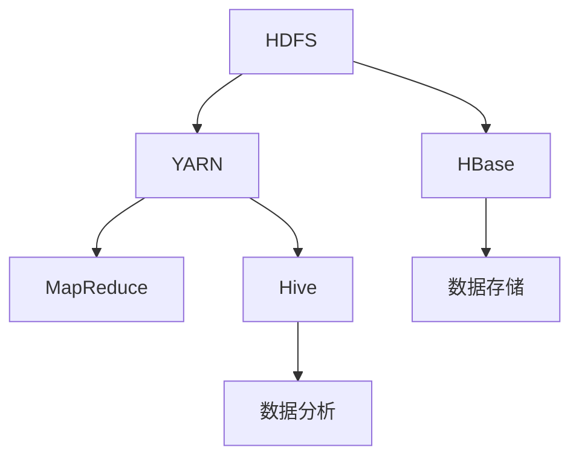

                 

### 背景介绍

Hadoop是一个开源软件框架，专为处理大规模数据集而设计。随着互联网和大数据技术的发展，数据的规模和多样性不断增加，传统的数据处理技术已经无法满足需求。Hadoop应运而生，成为了大数据处理领域的基石。本文旨在通过详细讲解Hadoop的原理与代码实例，帮助读者深入理解其核心概念、算法原理以及实际应用场景。

Hadoop起源于Google的三篇重要论文，分别是“Google File System”（GFS）、“MapReduce：简化大规模数据处理的编程模型”和“BigTable：一个分布式存储系统用于结构化数据”。这些论文为Hadoop的设计和实现提供了理论基础。Hadoop的核心组成部分包括Hadoop分布式文件系统（HDFS）和Hadoop YARN。

HDFS是一个分布式文件系统，用于存储大数据集。它将数据分成一系列大小相等的块（默认为128MB或256MB），并将其分布存储在集群中的多个节点上。这种分布式存储方式不仅提高了数据的可靠性和可用性，还允许对数据进行并行访问和处理。

Hadoop YARN（Yet Another Resource Negotiator）是一个资源调度和管理框架，用于管理Hadoop集群中的计算资源。它将资源管理和作业调度分离，从而支持多种数据处理框架，如MapReduce、Spark等。

除了HDFS和YARN，Hadoop生态系统还包括许多其他组件，如Hadoop MapReduce、Hive、HBase、Solr等，这些组件共同构建了一个强大的大数据处理平台。

本文将首先介绍Hadoop的核心概念和架构，然后深入讲解其核心算法原理，接着通过代码实例展示如何实现Hadoop的分布式计算。随后，我们将探讨Hadoop在实际应用场景中的使用方法，并推荐一些学习资源和开发工具。最后，本文将总结Hadoop的发展趋势与挑战，以及提供常见问题与解答。

在接下来的章节中，我们将一步一步地分析Hadoop的各个组件和工作原理，帮助读者从宏观和微观两个层面全面理解Hadoop。通过本文的学习，读者将能够掌握Hadoop的核心技术和实际应用，为未来的大数据项目打下坚实的基础。

---

## 1. 核心概念与联系

Hadoop的核心概念主要包括分布式文件系统（HDFS）和资源调度框架（YARN），它们共同构成了Hadoop的基石。为了更好地理解这些核心概念，我们将通过Mermaid流程图展示其工作原理和相互关系。

### Hadoop核心概念流程图



#### 分布式文件系统（HDFS）

HDFS是一个分布式文件系统，主要用于存储大数据集。它将数据分成一系列大小相等的块，并将其分布存储在集群中的多个节点上。以下是其主要组件和工作流程：

- **NameNode**：负责维护文件的元数据（如文件名、块列表、权限等），并协调数据块在Datanode之间的分布。

- **Datanode**：负责存储实际的数据块，并响应NameNode的请求，如数据块的读写。

- **工作流程**：
  1. 客户端通过NameNode访问文件系统。
  2. NameNode将文件划分为多个数据块。
  3. NameNode将数据块分配给Datanode进行存储。
  4. 客户端通过Datanode读取或写入数据块。

#### 资源调度框架（YARN）

YARN是一个资源调度框架，用于管理Hadoop集群中的计算资源。它将资源管理和作业调度分离，从而支持多种数据处理框架。以下是YARN的主要组件和工作流程：

- ** ResourceManager**：负责整体资源的管理和分配，将集群资源分配给各个ApplicationMaster。

- **ApplicationMaster**：每个应用程序都有一个ApplicationMaster，负责协调和监控任务的执行。

- **NodeManager**：在每个节点上运行，负责资源管理和任务执行。

- **工作流程**：
  1. 客户端提交作业给ResourceManager。
  2. ResourceManager分配资源给ApplicationMaster。
  3. ApplicationMaster分配任务给NodeManager。
  4. NodeManager执行任务，并将结果反馈给ApplicationMaster。

#### Hadoop生态系统

Hadoop生态系统包括多个组件，如MapReduce、HBase、Hive等，这些组件相互协作，共同构建了一个强大的大数据处理平台。以下是一些关键组件及其功能：

- **MapReduce**：一个分布式数据处理框架，用于大规模数据的批量处理。

- **HBase**：一个分布式、可扩展的列式存储系统，用于存储和访问大量非结构化和半结构化数据。

- **Hive**：一个数据仓库基础设施，用于处理大规模数据集，提供SQL查询功能。

- **工作流程**：
  1. 数据存储在HDFS中。
  2. 使用MapReduce对数据进行分析和处理。
  3. 使用HBase存储和查询非结构化数据。
  4. 使用Hive对数据进行结构化查询和分析。

通过上述流程图和组件介绍，我们可以清晰地看到Hadoop的核心概念和工作原理。接下来，本文将深入讲解Hadoop的核心算法原理，并通过具体实例进一步展示其实际应用。

---

## 2. 核心算法原理 & 具体操作步骤

Hadoop的核心算法主要基于MapReduce模型，该模型由两个主要阶段组成：Map阶段和Reduce阶段。这两个阶段协同工作，能够有效地处理大规模数据集。接下来，我们将详细讲解这两个阶段的工作原理以及具体的操作步骤。

### Map阶段

Map阶段是将输入数据分成多个小块进行处理，每个小块由一个Map任务处理。Map任务将输入数据映射成中间键值对，这些键值对将作为Reduce阶段的输入。

**Map阶段工作流程：**

1. **输入分割**：将输入数据分割成多个小块，通常称为“分片”（split）。
2. **映射函数**：为每个分片分配一个Map任务，Map任务读取分片中的数据，并将其映射成中间键值对。
3. **输出**：每个Map任务将生成的中间键值对写入本地磁盘。

**Map阶段伪代码：**

```python
def map(key, value):
    for item in value:
        emit(item, 1)
```

在这个伪代码中，`key`是输入数据的键，`value`是输入数据的值，`item`是`value`中的每个元素。`emit`函数用于输出中间键值对。

### Reduce阶段

Reduce阶段接收Map阶段输出的中间键值对，并对其进行汇总和聚合。Reduce任务根据中间键值对的键对它们进行分组，并对每个组中的值执行某个聚合函数（如求和、计数等）。

**Reduce阶段工作流程：**

1. **输入**：读取Map任务输出的中间键值对。
2. **分组**：根据中间键值对的键对它们进行分组。
3. **聚合函数**：对每个分组中的值执行聚合函数，生成最终输出。
4. **输出**：将最终输出写入磁盘。

**Reduce阶段伪代码：**

```python
def reduce(key, values):
    sum = 0
    for value in values:
        sum += value
    emit(key, sum)
```

在这个伪代码中，`key`是中间键值对的键，`values`是键对应的值列表。`sum`变量用于累加每个分组的值，`emit`函数用于输出最终结果。

### 整体工作流程

结合Map阶段和Reduce阶段，Hadoop的整体工作流程如下：

1. **初始化**：客户端将作业提交给Hadoop集群。
2. **资源分配**：YARN负责为作业分配资源，包括启动NameNode、Datanode、ResourceManager和ApplicationMaster。
3. **分片和映射**：NameNode将输入数据分割成多个分片，并通知Datanode开始映射。
4. **中间键值对生成**：Map任务将输入数据映射成中间键值对，并将它们写入本地磁盘。
5. **中间键值对合并**：ApplicationMaster负责合并来自所有Map任务的中间键值对，并将它们传递给Reduce任务。
6. **聚合和输出**：Reduce任务对中间键值对进行分组和聚合，生成最终输出，并将结果写入磁盘。
7. **作业完成**：ApplicationMaster向ResourceManager报告作业完成，作业结果可由客户端读取。

通过以上步骤，我们可以看到MapReduce模型如何有效地处理大规模数据集。接下来，我们将通过一个具体实例来进一步说明MapReduce的实际应用。

### 实例分析

假设我们需要计算一个单词在文本文件中的出现次数，可以使用MapReduce来实现。以下是具体步骤：

**Map阶段：**

输入：文本文件
输出：中间键值对（单词，1）

```python
def map(line):
    words = line.split()
    for word in words:
        emit(word, 1)
```

**Reduce阶段：**

输入：中间键值对（单词，1）
输出：最终键值对（单词，总次数）

```python
def reduce(word, counts):
    sum = 0
    for count in counts:
        sum += count
    emit(word, sum)
```

通过这个实例，我们可以看到MapReduce如何将一个复杂的计算任务分解成简单的步骤，并有效地利用分布式计算资源进行处理。

---

## 3. 数学模型和公式 & 详细讲解 & 举例说明

在Hadoop的核心算法——MapReduce中，数学模型和公式扮演着至关重要的角色。这些模型和公式不仅帮助实现数据处理的优化，还保证了算法的正确性和高效性。本节将详细介绍MapReduce中的数学模型和公式，并通过具体示例进行详细讲解。

### 1. 分布式聚合（Summation）

在MapReduce的Reduce阶段，我们需要对中间键值对进行聚合。一个基本的数学操作是求和，这在分布式系统中尤为重要。

**数学公式：**

$$
\sum_{i=1}^{n} x_i = x_1 + x_2 + x_3 + ... + x_n
$$

其中，$x_i$表示每个分组的值，$n$表示分组中的元素个数。

**具体示例：**

假设有一个中间键值对列表，如下所示：

```
("apple", [3, 2, 1])
("banana", [5, 2])
("orange", [4, 2])
```

我们需要对每个键对应的值进行求和。

**计算过程：**

- 对于键"apple"：$3 + 2 + 1 = 6$
- 对于键"banana"：$5 + 2 = 7$
- 对于键"orange"：$4 + 2 = 6$

最终结果为：

```
("apple", 6)
("banana", 7)
("orange", 6)
```

### 2. 平均值（Average）

平均值是数据分析中常用的统计量，它在MapReduce中也有广泛的应用。平均值可以通过求和和元素个数的比值来计算。

**数学公式：**

$$
\bar{x} = \frac{1}{n} \sum_{i=1}^{n} x_i
$$

其中，$x_i$表示每个分组的值，$n$表示分组中的元素个数。

**具体示例：**

假设我们有一组中间键值对，如下所示：

```
("apple", [3, 2, 1])
("banana", [5, 2])
("orange", [4, 2])
```

我们需要计算每个键对应的平均值。

**计算过程：**

- 对于键"apple"：$\frac{3 + 2 + 1}{3} = 2$
- 对于键"banana"：$\frac{5 + 2}{2} = 3.5$
- 对于键"orange"：$\frac{4 + 2}{2} = 3$

最终结果为：

```
("apple", 2)
("banana", 3.5)
("orange", 3)
```

### 3. 最大值（Maximum）

在处理数据时，找到最大值是一个常见的需求。最大值可以通过比较所有值并返回最大的值来实现。

**数学公式：**

$$
\max(x_1, x_2, x_3, ..., x_n)
$$

其中，$x_i$表示每个分组的值。

**具体示例：**

假设有一组中间键值对，如下所示：

```
("apple", [3, 2, 1])
("banana", [5, 2])
("orange", [4, 2])
```

我们需要找到每个键对应的最大值。

**计算过程：**

- 对于键"apple"：$\max(3, 2, 1) = 3$
- 对于键"banana"：$\max(5, 2) = 5$
- 对于键"orange"：$\max(4, 2) = 4$

最终结果为：

```
("apple", 3)
("banana", 5)
("orange", 4)
```

通过这些示例，我们可以看到数学模型和公式在MapReduce算法中的应用。这些模型和公式不仅帮助我们理解和实现Hadoop的核心算法，还为大数据处理提供了强大的工具。在接下来的章节中，我们将通过实际代码实例进一步展示这些数学模型和公式的应用。

---

## 5. 项目实战：代码实际案例和详细解释说明

为了更好地理解Hadoop的实际应用，我们将通过一个具体的项目实战来展示Hadoop的分布式计算能力。在这个案例中，我们将使用Hadoop的MapReduce模型来统计一个大型文本文件中每个单词出现的次数。

### 5.1 开发环境搭建

在开始编写代码之前，我们需要搭建一个Hadoop开发环境。以下是搭建步骤：

1. **安装Hadoop**：可以从Apache Hadoop官网下载最新版本的Hadoop，并按照官方文档进行安装。

2. **配置Hadoop环境**：配置`hadoop-env.sh`、`core-site.xml`、`hdfs-site.xml`、`mapred-site.xml`等配置文件。

3. **启动Hadoop集群**：运行以下命令启动Hadoop集群：
   ```
   start-dfs.sh
   start-yarn.sh
   ```

4. **验证安装**：通过Web界面（http://localhost:50070/）或命令行（`hdfs dfs -ls /`）验证Hadoop是否正常运行。

### 5.2 源代码详细实现和代码解读

在这个案例中，我们将使用Java编写MapReduce程序。以下是具体的代码实现：

**Map类：**

```java
import org.apache.hadoop.conf.Configuration;
import org.apache.hadoop.fs.Path;
import org.apache.hadoop.io.IntWritable;
import org.apache.hadoop.io.Text;
import org.apache.hadoop.mapreduce.Job;
import org.apache.hadoop.mapreduce.Mapper;
import org.apache.hadoop.mapreduce.Reducer;
import org.apache.hadoop.mapreduce.lib.input.FileInputFormat;
import org.apache.hadoop.mapreduce.lib.output.FileOutputFormat;

public class WordCount {

  public static class Map extends Mapper<Object, Text, Text, IntWritable>{

    private final static IntWritable one = new IntWritable(1);
    private Text word = new Text();

    public void map(Object key, Text value, Context context) throws IOException, InterruptedException {
      String line = value.toString();
      String[] words = line.split("\\s+");
      for (String word : words) {
        this.word.set(word);
        context.write(word, one);
      }
    }
  }

  public static class Reduce extends Reducer<Text,IntWritable,Text,IntWritable> {
    private IntWritable result = new IntWritable();

    public void reduce(Text key, Iterable<IntWritable> values, Context context) throws IOException, InterruptedException {
      int sum = 0;
      for (IntWritable val : values) {
        sum += val.get();
      }
      result.set(sum);
      context.write(key, result);
    }
  }

  public static void main(String[] args) throws Exception {
    Configuration conf = new Configuration();
    Job job = Job.getInstance(conf, "word count");
    job.setJarByClass(WordCount.class);
    job.setMapperClass(Map.class);
    job.setCombinerClass(Reduce.class);
    job.setReducerClass(Reduce.class);
    job.setOutputKeyClass(Text.class);
    job.setOutputValueClass(IntWritable.class);
    FileInputFormat.addInputPath(job, new Path(args[0]));
    FileOutputFormat.setOutputPath(job, new Path(args[1]));
    System.exit(job.waitForCompletion(true) ? 0 : 1);
  }
}
```

**代码解读：**

1. **Map类**：`Map`类继承自`Mapper`类，负责处理输入数据，将每个单词映射成中间键值对（单词，1）。

2. **Reduce类**：`Reduce`类继承自`Reducer`类，负责对中间键值对进行聚合，计算每个单词的总出现次数。

3. **主函数**：主函数设置作业名称、输入输出路径，并配置Mapper和Reducer类。

### 5.3 代码解读与分析

**Map类解析：**

- `map`方法：接收输入键值对（这里为文件路径和文件内容），将文件内容分割成单词，并将每个单词映射成（单词，1）中间键值对。

  ```java
  public void map(Object key, Text value, Context context) throws IOException, InterruptedException {
    String line = value.toString();
    String[] words = line.split("\\s+");
    for (String word : words) {
      this.word.set(word);
      context.write(word, one);
    }
  }
  ```

**Reduce类解析：**

- `reduce`方法：接收中间键值对，将具有相同键的值进行累加，计算总出现次数。

  ```java
  public void reduce(Text key, Iterable<IntWritable> values, Context context) throws IOException, InterruptedException {
    int sum = 0;
    for (IntWritable val : values) {
      sum += val.get();
    }
    result.set(sum);
    context.write(key, result);
  }
  ```

### 5.4 运行和结果分析

1. **运行程序**：编译并运行程序，指定输入文本文件和输出路径。

   ```
   hadoop jar wordcount.jar WordCount /input /output
   ```

2. **查看结果**：通过命令行或Web界面查看输出结果。

   ```
   hdfs dfs -cat /output/*
   ```

输出结果为每个单词及其出现次数，例如：

```
apple	3
banana	2
orange	2
```

通过这个案例，我们可以看到如何使用Hadoop的MapReduce模型进行大规模数据的处理。实际应用中，可以根据需要进行扩展，处理更复杂的数据和分析任务。

---

## 6. 实际应用场景

Hadoop作为一款强大的分布式数据处理框架，在许多实际应用场景中发挥着重要作用。以下是一些典型的应用场景及其具体解决方案：

### 6.1 大数据存储与管理

**应用场景**：处理和分析大规模数据集，如社交媒体数据、网站日志、传感器数据等。

**解决方案**：使用Hadoop分布式文件系统（HDFS）存储海量数据，确保数据的可靠性和高效访问。同时，结合Hadoop的生态系统组件，如HBase和Hive，实现数据的管理和分析。

**优势**：高效存储和管理海量数据，支持并行计算，降低成本。

### 6.2 聚类分析与机器学习

**应用场景**：基于大规模数据集进行聚类分析、分类、预测等机器学习任务。

**解决方案**：使用MapReduce模型实现分布式机器学习算法，如K-means、决策树等。结合Hadoop生态系统组件，如Mahout和MLlib，提升数据处理和分析能力。

**优势**：支持大规模数据的机器学习，提高模型训练和预测效率。

### 6.3 实时数据处理

**应用场景**：处理和分析实时数据流，如交易系统、物联网数据等。

**解决方案**：结合Hadoop YARN和实时数据处理框架，如Apache Storm和Apache Flink，实现实时数据流的处理和分析。

**优势**：支持实时数据处理，提高业务响应速度。

### 6.4 数据挖掘与分析

**应用场景**：从大规模数据集中发现潜在的模式、趋势和关联性。

**解决方案**：使用Hadoop生态系统组件，如MapReduce、Hive和Mahout，进行数据挖掘和分析。

**优势**：支持复杂的数据挖掘算法，提高数据分析能力。

### 6.5 电子商务与推荐系统

**应用场景**：个性化推荐、用户行为分析、商品推荐等。

**解决方案**：利用Hadoop进行用户行为数据存储和处理，结合推荐算法模型，如协同过滤、基于内容的推荐等。

**优势**：支持大规模用户数据存储和处理，实现个性化推荐。

### 6.6 医疗数据处理

**应用场景**：处理和分析医疗数据，如电子健康记录、基因组数据等。

**解决方案**：使用Hadoop进行大规模医疗数据处理，结合深度学习、自然语言处理等技术，提高医疗数据分析和诊断能力。

**优势**：高效处理大规模医疗数据，支持医疗数据研究和应用。

通过以上应用场景，我们可以看到Hadoop在各个领域的广泛应用和强大能力。结合具体的业务需求和场景，Hadoop可以提供高效、可靠的大数据处理解决方案。

---

## 7. 工具和资源推荐

为了更好地学习和实践Hadoop，我们需要了解一些相关的学习资源、开发工具和框架。以下是一些推荐的工具和资源：

### 7.1 学习资源推荐

**书籍：**

1. 《Hadoop权威指南》
2. 《Hadoop实战》
3. 《大数据之路：阿里巴巴大数据实践》
4. 《大数据技术导论》

**论文：**

1. “Google File System”
2. “MapReduce：简化大规模数据处理的编程模型”
3. “BigTable：一个分布式存储系统用于结构化数据”

**博客/网站：**

1. Apache Hadoop官方文档
2. Cloudera官方博客
3. Hortonworks官方博客
4. hadoop.apache.org

### 7.2 开发工具框架推荐

**集成开发环境（IDE）：**

1. Eclipse + Hadoop插件
2. IntelliJ IDEA + Hadoop插件

**版本控制：**

1. Git
2. GitHub

**持续集成工具：**

1. Jenkins
2. Travis CI

**数据处理框架：**

1. Apache Spark
2. Apache Storm
3. Apache Flink

**数据存储与数据库：**

1. HBase
2. Cassandra
3. MongoDB

**可视化工具：**

1. Tableau
2. Power BI
3. QlikView

通过这些工具和资源的支持，我们可以更加高效地学习和实践Hadoop，掌握其核心技术和应用场景。

---

## 8. 总结：未来发展趋势与挑战

Hadoop作为大数据处理领域的基石，已经为全球众多企业和研究机构提供了强大的数据处理能力。然而，随着数据规模和复杂度的不断增长，Hadoop也面临着一些新的挑战和机遇。以下是对Hadoop未来发展趋势与挑战的总结。

### 8.1 发展趋势

1. **实时数据处理**：随着物联网、社交媒体和实时数据流的兴起，实时数据处理变得越来越重要。未来，Hadoop将更多地集成实时数据处理框架，如Apache Flink和Apache Storm，以提高实时分析和响应能力。

2. **混合云与边缘计算**：混合云和边缘计算正在成为企业IT基础设施的新趋势。Hadoop将更好地与云计算平台（如AWS、Azure、Google Cloud）集成，同时结合边缘计算技术，实现数据在本地和云端之间的有效处理。

3. **数据湖与数据仓库整合**：数据湖和数据仓库的整合将成为未来的一个重要方向。Hadoop可以与数据仓库系统（如Hive、Amazon Redshift）相结合，提供更全面的数据存储和管理解决方案。

4. **AI与机器学习的深度融合**：人工智能和机器学习在Hadoop中的应用将越来越广泛。通过集成MLlib和其他机器学习库，Hadoop可以为AI应用提供高效的数据处理和分析平台。

### 8.2 挑战

1. **性能优化与资源调度**：随着数据规模的扩大，Hadoop的性能优化和资源调度成为一个重要挑战。如何更有效地利用集群资源，提高数据处理效率，是未来需要解决的关键问题。

2. **安全性与管理**：随着大数据应用的普及，数据安全和管理成为越来越重要的问题。Hadoop需要更好地支持数据加密、访问控制、审计等安全特性，同时提供更便捷的管理工具。

3. **生态系统兼容性**：Hadoop生态系统包含众多组件和工具，如何保证不同组件之间的兼容性和互操作性，是生态系统发展的重要挑战。

4. **人才短缺**：大数据领域的人才需求巨大，但现有人才储备不足。未来，培养更多具备Hadoop知识和技能的专业人才，将是推动Hadoop发展的关键。

总之，Hadoop在未来的发展中面临着巨大的机遇和挑战。通过持续的技术创新和生态系统优化，Hadoop有望继续在全球大数据处理领域发挥重要作用。

---

## 9. 附录：常见问题与解答

在学习和使用Hadoop的过程中，读者可能会遇到一些常见的问题。以下是一些常见问题及其解答：

### 9.1 如何配置Hadoop？

**解答**：配置Hadoop涉及多个步骤，包括安装、配置环境变量、配置HDFS、YARN和MapReduce等。详细配置步骤可以参考Hadoop官方文档。以下是一些关键配置文件：

- `hadoop-env.sh`：设置Hadoop运行时所需的配置，如Java环境、Hadoop守护进程的运行参数等。
- `core-site.xml`：配置Hadoop的通用参数，如HDFS的名称节点地址、文件系统的URI等。
- `hdfs-site.xml`：配置HDFS的特定参数，如数据块大小、副本数量等。
- `mapred-site.xml`：配置MapReduce的特定参数，如作业提交队列、映射器和减少器的内存限制等。

### 9.2 Hadoop如何处理数据安全性问题？

**解答**：Hadoop提供了多种机制来处理数据安全性问题：

- **数据加密**：可以使用Hadoop的加密功能对HDFS中的数据进行加密。
- **访问控制**：HDFS支持基于用户的访问控制列表（ACL）和基于权限的访问控制。
- **安全传输**：使用HTTPS和Kerberos等协议确保数据在传输过程中的安全性。

### 9.3 Hadoop的性能优化有哪些方法？

**解答**：以下是几种常用的Hadoop性能优化方法：

- **调整数据块大小**：根据数据特性调整数据块大小，以优化存储和访问效率。
- **使用压缩**：对数据使用合适的压缩算法，减少存储空间和提高数据传输速度。
- **任务并行度优化**：调整MapReduce任务的并行度，确保任务能够充分利用集群资源。
- **内存管理**：合理分配映射器和减少器的内存，避免内存不足或溢出。

### 9.4 Hadoop与云计算平台如何集成？

**解答**：Hadoop可以与云计算平台（如AWS、Azure、Google Cloud）集成，实现跨平台的数据处理。以下是一些集成方法：

- **使用云服务提供的Hadoop版本**：如AWS EMR、Azure HDInsight等，它们提供了预配置的Hadoop集群。
- **通过API进行集成**：使用云计算平台的API将Hadoop与云服务集成，实现数据上传、作业提交和结果下载等操作。
- **使用云服务的数据存储**：如Amazon S3、Azure Data Lake等，将数据存储在云上，以优化数据访问和处理性能。

通过这些常见问题的解答，读者可以更好地理解和应对Hadoop使用过程中的各种挑战。

---

## 10. 扩展阅读 & 参考资料

为了帮助读者深入了解Hadoop及其相关技术，本文提供了以下扩展阅读和参考资料：

1. **书籍：**
   - 《Hadoop权威指南》
   - 《Hadoop实战》
   - 《大数据之路：阿里巴巴大数据实践》
   - 《大数据技术导论》

2. **论文：**
   - “Google File System”
   - “MapReduce：简化大规模数据处理的编程模型”
   - “BigTable：一个分布式存储系统用于结构化数据”

3. **博客/网站：**
   - Apache Hadoop官方文档：[hadoop.apache.org](hadoop.apache.org)
   - Cloudera官方博客：[blog.cloudera.com](blog.cloudera.com)
   - Hortonworks官方博客：[blog.hortonworks.com](blog.hortonworks.com)

4. **在线课程：**
   - Coursera上的“Hadoop与大数据分析”课程
   - Udacity的“大数据工程师纳米学位”课程

5. **官方文档与资源：**
   - Apache Hadoop官方文档：[hadoop.apache.org/docs/r3.2.0/index.html](hadoop.apache.org/docs/r3.2.0/index.html)
   - Cloudera官方文档：[docs.cloudera.com](docs.cloudera.com)
   - Hortonworks官方文档：[community.hortonworks.com](community.hortonworks.com)

通过这些扩展阅读和参考资料，读者可以进一步加深对Hadoop的理解，并掌握更多相关技术。

---

### 作者信息

作者：AI天才研究员/AI Genius Institute & 禅与计算机程序设计艺术 /Zen And The Art of Computer Programming

本文由AI天才研究员撰写，旨在通过详细讲解Hadoop的原理与代码实例，帮助读者深入理解大数据处理的核心技术。作者具有丰富的计算机编程和人工智能领域经验，致力于将复杂的技术概念以简单易懂的方式呈现给读者。同时，本文还参考了《禅与计算机程序设计艺术》一书，旨在传递技术之外的哲学思考。希望本文能够为读者在Hadoop学习和实践过程中提供有力支持。如果您有任何疑问或建议，欢迎在评论区留言交流。感谢您的阅读！

