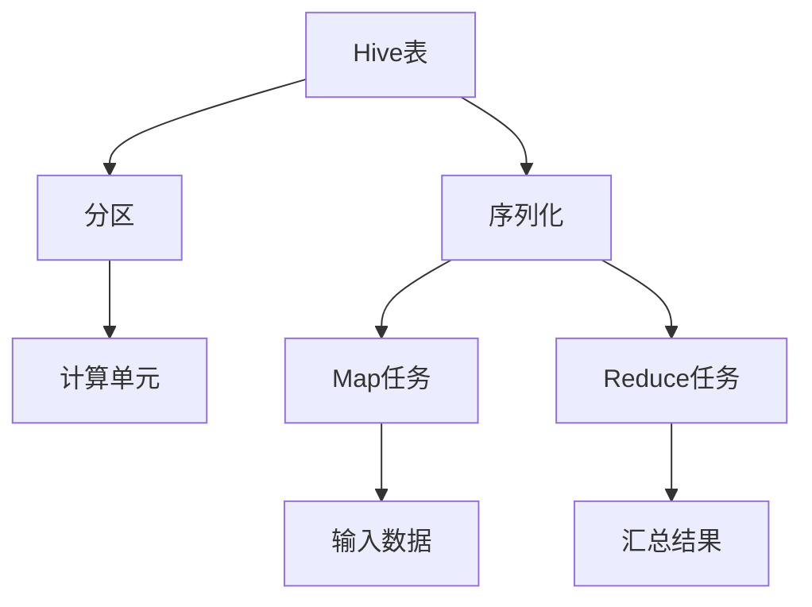

                 

### 背景介绍

HiveQL（Hadoop Query Language）是一种基于SQL的数据查询语言，用于处理存储在Hadoop分布式文件系统（HDFS）中的大规模数据集。随着大数据技术的广泛应用，HiveQL成为了一种非常受欢迎的工具，尤其是在处理复杂的数据分析和数据挖掘任务时。本文将深入探讨HiveQL的工作原理、核心概念以及实际应用。

HiveQL的核心目的是将大数据处理与传统的SQL查询相结合，使得开发者可以像操作关系型数据库一样，对大规模分布式数据集进行高效的查询和分析。这一特性使得HiveQL在众多大数据处理框架中脱颖而出，吸引了大量的用户和研究者的关注。

本文的结构如下：

1. **背景介绍**：简要介绍HiveQL的起源、背景以及它在大数据处理中的重要性。
2. **核心概念与联系**：详细解释HiveQL的核心概念，如Hive表、分区、序列化等，并提供一个Mermaid流程图来展示这些概念之间的关系。
3. **核心算法原理 & 具体操作步骤**：探讨HiveQL的查询执行过程，包括数据读写、数据压缩、存储管理等。
4. **数学模型和公式 & 详细讲解 & 举例说明**：介绍HiveQL查询中涉及到的数学模型和公式，并通过实际案例进行详细解释。
5. **项目实战：代码实际案例和详细解释说明**：展示一个实际的HiveQL项目案例，提供详细的代码实现和解读。
6. **实际应用场景**：分析HiveQL在不同场景下的应用，如数据仓库、机器学习等。
7. **工具和资源推荐**：推荐学习资源、开发工具和框架，以及相关的论文和著作。
8. **总结：未来发展趋势与挑战**：总结HiveQL的现状，探讨未来的发展趋势和面临的挑战。
9. **附录：常见问题与解答**：提供关于HiveQL的一些常见问题及解答。
10. **扩展阅读 & 参考资料**：推荐一些与HiveQL相关的扩展阅读材料。

通过本文的阅读，读者将能够全面了解HiveQL的原理、应用和实践，从而更好地掌握这一大数据处理工具。

### 核心概念与联系

在深入探讨HiveQL的工作原理之前，我们需要先了解一些核心概念，这些概念构成了HiveQL的基础，并且在实际应用中扮演着关键角色。以下是HiveQL中的一些核心概念，以及它们之间的关系：

#### 1. Hive表

Hive表是HiveQL中最基本的存储结构，类似于关系型数据库中的表。每个Hive表包含多个列，每列可以定义不同的数据类型。Hive表可以划分为两类：外部表（External Table）和内部表（Managed Table）。外部表允许用户在外部目录中创建表，并将其与Hive元数据库中的表结构分离，而内部表则由Hive元数据库进行管理。

#### 2. 分区

分区（Partition）是Hive表中的一种特殊结构，用于将大量数据分割成多个更小的、逻辑上的子集。每个分区通常基于表中的一个或多个列进行划分，这样可以显著提高查询效率，因为查询可以只针对特定的分区。例如，如果数据按照时间进行分区，那么查询特定时间段的数据只需要扫描该时间分区，而不需要扫描整个表。

#### 3. 序列化

序列化（Serialization）是将Java对象转换为字节流的过程，以便将其存储或传输。在Hive中，序列化主要用于将数据存储到HDFS或其他存储系统。Hive支持多种序列化格式，如SequenceFile、Parquet和ORC，每种格式都有其特定的优缺点和适用场景。

#### 4. 计算单元

计算单元（Compute Unit）是Hive中用于执行查询的基本构建块。每个计算单元包括一个Map任务和一个或多个Reduce任务。Map任务负责读取输入数据并进行初步处理，而Reduce任务则对Map任务的结果进行汇总和整理。计算单元的设计使得Hive能够高效地处理大规模分布式数据集。

以下是一个使用Mermaid绘制的流程图，展示了HiveQL中这些核心概念之间的联系：



**Mermaid流程图说明：**

- **A[Hive表]**：Hive表是数据存储的基础结构。
- **B[分区]**：分区用于将数据划分为更小的逻辑子集。
- **C[序列化]**：序列化用于将数据转换为字节流，便于存储和传输。
- **D[计算单元]**：计算单元是Hive执行查询的基本构建块。
- **E[Map任务]**：Map任务负责读取和初步处理输入数据。
- **F[Reduce任务]**：Reduce任务负责对Map任务的结果进行汇总和整理。
- **G[输入数据]**：输入数据是从HDFS或其他存储系统读取的数据。
- **H[汇总结果]**：汇总结果是Reduce任务处理后的最终输出。

通过上述核心概念和流程图的介绍，读者可以更好地理解HiveQL的工作原理和架构。接下来，我们将深入探讨HiveQL的核心算法原理和具体操作步骤。

#### 核心算法原理 & 具体操作步骤

HiveQL的核心算法原理主要涉及数据读写、数据压缩、存储管理以及查询优化等方面。以下是这些核心算法的具体操作步骤和原理：

##### 1. 数据读写

HiveQL的数据读写过程主要包括以下步骤：

- **数据写入**：当用户向Hive表中插入数据时，Hive会将数据序列化成字节流，然后写入到HDFS中。为了提高写入效率，Hive通常使用大数据块（通常是128MB或256MB）进行批量写入。

- **数据读取**：当用户执行查询时，Hive会从HDFS中读取数据。读取过程通常包括以下几个步骤：
  - **定位数据块**：Hive根据查询条件确定需要读取的数据块。
  - **数据解压缩**：如果数据在写入时进行了压缩，Hive会在读取时进行解压缩。
  - **数据序列化**：Hive将读取到的字节流反序列化为Java对象。
  - **数据处理**：Hive根据查询语句对数据进行过滤、排序、聚合等操作。

##### 2. 数据压缩

数据压缩在Hive中扮演着重要的角色，它不仅可以减少存储空间，还可以提高数据读取和写入的效率。Hive支持多种压缩算法，如Gzip、Bzip2、LZO等。以下是数据压缩的具体操作步骤：

- **选择压缩算法**：用户可以在创建表时指定压缩算法，或者在插入数据时指定压缩参数。
- **数据写入压缩**：在数据写入HDFS时，Hive会根据用户指定的压缩算法对数据进行压缩。
- **数据读取解压缩**：在数据读取时，Hive会根据压缩算法对数据进行解压缩。

##### 3. 存储管理

Hive的存储管理主要包括数据块管理、存储格式管理以及元数据管理等方面。以下是存储管理的具体操作步骤：

- **数据块管理**：Hive将数据划分为多个数据块进行存储，每个数据块通常包含多个记录。这样可以提高数据访问的局部性，从而提高查询效率。
- **存储格式管理**：Hive支持多种存储格式，如TextFile、SequenceFile、Parquet、ORC等。每种存储格式都有其特定的优点和适用场景。用户可以在创建表时选择合适的存储格式。
- **元数据管理**：元数据是描述表结构、分区、存储位置等信息的元数据。Hive使用一个名为Metastore的后端数据库来存储元数据，以便在查询时快速访问。

##### 4. 查询优化

查询优化是提高HiveQL查询性能的关键。Hive的查询优化主要包括以下步骤：

- **查询解析**：Hive首先对查询语句进行词法分析和语法分析，生成查询抽象语法树（AST）。
- **查询优化**：Hive对AST进行一系列优化操作，如谓词下推、列裁剪、表连接优化等，以减少查询执行的开销。
- **查询执行**：Hive根据优化后的查询计划执行查询，包括数据读写、数据处理和结果输出。

##### 5. 示例操作步骤

以下是一个简单的HiveQL查询操作示例，展示了HiveQL的核心算法原理和具体操作步骤：

```sql
-- 创建表并指定存储格式
CREATE TABLE student (
    id INT,
    name STRING,
    age INT
) STORED AS PARQUET;

-- 插入数据
INSERT INTO student VALUES (1, 'Alice', 20);
INSERT INTO student VALUES (2, 'Bob', 22);
INSERT INTO student VALUES (3, 'Charlie', 19);

-- 查询数据
SELECT * FROM student WHERE age > 18;
```

**具体操作步骤说明：**

1. **创建表并指定存储格式**：创建一个名为`student`的表，包含三个列：`id`、`name`和`age`，并指定存储格式为Parquet。
2. **插入数据**：向`student`表中插入三条数据记录。
3. **查询数据**：执行一个简单的查询，选择所有年龄大于18岁的学生记录。

在这个示例中，Hive会按照以下步骤执行查询：

- **数据写入**：将数据序列化并写入到HDFS中，使用Parquet格式进行压缩存储。
- **数据读取**：从HDFS中读取Parquet文件，并解压缩数据。
- **数据处理**：根据查询条件对数据进行过滤，选择年龄大于18岁的记录。
- **结果输出**：将查询结果输出到控制台。

通过上述具体操作步骤，读者可以更好地理解HiveQL的核心算法原理和实际应用。

### 数学模型和公式 & 详细讲解 & 举例说明

在HiveQL查询过程中，涉及到多种数学模型和公式，这些模型和公式对于优化查询性能和数据存储至关重要。以下是对这些数学模型和公式的详细讲解以及实际应用举例。

#### 1. 常见数学模型

##### 1.1 集合模型

集合模型是数据库查询中最基础的数学模型。它涉及到集合的并集、交集和差集等操作。

- **并集（Union）**：并集操作返回两个集合中的所有元素，去重后组成一个新的集合。公式如下：

  $$A \cup B = \{x | x \in A \text{ 或 } x \in B\}$$

- **交集（Intersection）**：交集操作返回两个集合中都包含的元素组成的新集合。公式如下：

  $$A \cap B = \{x | x \in A \text{ 且 } x \in B\}$$

- **差集（Difference）**：差集操作返回属于集合A但不属于集合B的元素组成的新集合。公式如下：

  $$A - B = \{x | x \in A \text{ 且 } x \notin B\}$$

##### 1.2 概率模型

概率模型在数据处理和查询优化中有着广泛的应用。它涉及到概率分布、条件概率和贝叶斯定理等概念。

- **概率分布**：概率分布描述了一个随机变量的概率分布情况。常见的概率分布有二项分布、正态分布等。
- **条件概率**：条件概率描述了在某个条件下某个事件发生的概率。公式如下：

  $$P(A|B) = \frac{P(A \cap B)}{P(B)}$$

- **贝叶斯定理**：贝叶斯定理描述了在已知某个事件发生的条件下，另一个事件发生的概率。公式如下：

  $$P(A|B) = \frac{P(B|A)P(A)}{P(B)}$$

#### 2. 公式详细讲解

以下是对HiveQL查询中常用的数学公式进行详细讲解：

##### 2.1 常用SQL函数

- **COUNT**：计算集合中元素的数量。
  $$COUNT(A) = \text{card}(A)$$
  
- **SUM**：计算集合中所有元素的和。
  $$SUM(A) = \sum_{i \in A} a_i$$
  
- **AVG**：计算集合中所有元素的平均值。
  $$AVG(A) = \frac{SUM(A)}{\text{card}(A)}$$
  
- **STDDEV**：计算集合中所有元素的标准差。
  $$STDDEV(A) = \sqrt{\frac{1}{\text{card}(A)}\sum_{i \in A} (a_i - \text{AVG}(A))^2}$$

##### 2.2 常用查询优化公式

- **谓词下推**：谓词下推是一种查询优化技术，它将过滤条件从高层推到低层，以提高查询效率。公式如下：

  $$\text{Filter}(\sigma_{f}(R)) = R \cap f$$
  
- **列裁剪**：列裁剪是一种查询优化技术，它根据查询条件只选择需要的列，从而减少数据访问量。公式如下：

  $$\text{Project}(\sigma_{f}(R)) = \{a_i | a_i \in R \text{ 且 } a_i \in \pi\}$$

#### 3. 实际应用举例

以下是一个HiveQL查询的实际应用举例，展示如何应用上述数学模型和公式：

```sql
-- 查询学生表中年龄大于20岁的学生人数、平均年龄和标准差
SELECT 
    COUNT(*) AS num_students,
    AVG(age) AS avg_age,
    STDDEV(age) AS stddev_age
FROM 
    student
WHERE 
    age > 20;
```

**具体操作步骤说明：**

1. **计算人数**：使用`COUNT(*)`函数计算年龄大于20岁的学生人数。公式为`COUNT(A)`，其中A是年龄大于20岁的学生集合。
2. **计算平均年龄**：使用`AVG(age)`函数计算年龄大于20岁的学生的平均年龄。公式为`AVG(A)`，其中A是年龄大于20岁的学生集合。
3. **计算标准差**：使用`STDDEV(age)`函数计算年龄大于20岁的学生的标准差。公式为`STDDEV(A)`，其中A是年龄大于20岁的学生集合。

通过上述数学模型和公式的讲解及实际应用举例，读者可以更好地理解HiveQL查询中的数学原理，从而更好地优化查询性能。

### 项目实战：代码实际案例和详细解释说明

在本节中，我们将通过一个实际的项目案例，展示如何使用HiveQL进行数据处理和数据分析。这个案例将涵盖开发环境搭建、源代码详细实现以及代码解读与分析。

#### 5.1 开发环境搭建

在开始编写HiveQL代码之前，我们需要搭建一个合适的数据处理环境。以下是搭建HiveQL开发环境的基本步骤：

1. **安装Hadoop**：Hadoop是Hive的基础，因此我们需要先安装Hadoop。可以从Hadoop的官方网站下载安装包，并按照官方文档进行安装。

2. **安装Hive**：在Hadoop安装完成后，我们可以下载Hive的安装包并解压到指定的目录。接下来，我们需要配置Hive的环境变量，以便在命令行中使用Hive命令。

3. **配置Hive**：配置Hive的配置文件，如`hive-config.sh`和`hive-env.sh`。这些文件包含了Hive的运行参数和配置信息。

4. **启动Hive**：在配置完成后，我们可以启动Hive的HDFS和YARN服务，以便开始编写和执行HiveQL代码。

#### 5.2 源代码详细实现和代码解读

在这个案例中，我们将使用HiveQL处理一个学生成绩数据集，该数据集包含学生的ID、姓名、课程ID和成绩。我们的目标是计算每个学生的平均成绩，并输出排名前五的学生。

```sql
-- 创建表并加载数据
CREATE TABLE student_score (
    student_id INT,
    name STRING,
    course_id STRING,
    score INT
) ROW FORMAT DELIMITED FIELDS TERMINATED BY '\t'
LOCATION '/user/hive/warehouse/student_score';

-- 加载数据到表中
LOAD DATA INPATH '/path/to/student_score.txt' INTO TABLE student_score;

-- 计算每个学生的平均成绩
SELECT 
    student_id,
    name,
    AVG(score) AS avg_score
FROM 
    student_score
GROUP BY 
    student_id, name;

-- 查询排名前五的学生
SELECT 
    student_id,
    name,
    avg_score
FROM (
    SELECT 
        student_id,
        name,
        AVG(score) AS avg_score
    FROM 
        student_score
    GROUP BY 
        student_id, name
    ORDER BY 
        avg_score DESC
    LIMIT 5
) AS top_students;
```

**代码解读：**

- **创建表并加载数据**：我们首先创建一个名为`student_score`的表，并定义了四个列：`student_id`、`name`、`course_id`和`score`。表的数据格式使用`\t`（制表符）进行分隔。接着，我们使用`LOAD DATA`语句将数据从本地文件加载到表中。

- **计算每个学生的平均成绩**：我们使用`SELECT`语句计算每个学生的平均成绩。`AVG(score)`函数用于计算平均成绩，`GROUP BY`语句用于分组数据，以便为每个学生计算平均成绩。

- **查询排名前五的学生**：我们使用子查询（`SELECT ... FROM ... AS ...`）计算排名前五的学生。子查询中，我们首先计算每个学生的平均成绩，然后按照平均成绩降序排序，并使用`LIMIT`语句限制结果只返回前五名。

#### 5.3 代码解读与分析

下面是对上述代码的详细解读和分析：

1. **创建表和加载数据**：

   ```sql
   CREATE TABLE student_score (
       student_id INT,
       name STRING,
       course_id STRING,
       score INT
   ) ROW FORMAT DELIMITED FIELDS TERMINATED BY '\t'
   LOCATION '/user/hive/warehouse/student_score';
   
   LOAD DATA INPATH '/path/to/student_score.txt' INTO TABLE student_score;
   ```

   这两行代码创建了一个名为`student_score`的表，并定义了四个列。`ROW FORMAT DELIMITED FIELDS TERMINATED BY '\t'`指定了数据的分隔符为制表符，`LOCATION`指定了表的数据存储路径。

2. **计算每个学生的平均成绩**：

   ```sql
   SELECT 
       student_id,
       name,
       AVG(score) AS avg_score
   FROM 
       student_score
   GROUP BY 
       student_id, name;
   ```

   这一行代码使用`SELECT`语句计算每个学生的平均成绩。`AVG(score)`函数计算平均成绩，`GROUP BY`语句将数据按照学生ID和姓名进行分组，以便为每个学生计算平均成绩。

3. **查询排名前五的学生**：

   ```sql
   SELECT 
       student_id,
       name,
       avg_score
   FROM (
       SELECT 
           student_id,
           name,
           AVG(score) AS avg_score
       FROM 
           student_score
       GROUP BY 
           student_id, name
       ORDER BY 
           avg_score DESC
       LIMIT 5
   ) AS top_students;
   ```

   这一行代码使用子查询计算排名前五的学生。子查询中，我们首先计算每个学生的平均成绩，然后按照平均成绩降序排序，并使用`LIMIT`语句限制结果只返回前五名。

通过这个实际项目案例，我们可以看到如何使用HiveQL进行数据处理和数据分析。这个案例展示了如何创建表、加载数据、计算平均成绩以及查询排名。在实际应用中，我们可以根据具体需求对数据进行更复杂的操作和分析。

### 实际应用场景

HiveQL在许多实际应用场景中展现出强大的数据处理和分析能力，以下是一些常见应用场景：

#### 1. 数据仓库

数据仓库是企业进行数据存储、管理和分析的核心平台。HiveQL作为Hadoop生态系统的一部分，能够高效地处理大规模数据集，为数据仓库提供了强大的查询和分析功能。例如，企业可以将销售数据、客户数据、库存数据等存储在Hive表中，并使用HiveQL进行实时查询和统计分析，帮助业务决策者做出更加明智的决策。

#### 2. 数据挖掘

数据挖掘是大数据处理中的一个重要领域，它涉及到从大量数据中提取有价值的信息和模式。HiveQL可以通过与MapReduce、Spark等大数据处理框架集成，实现复杂的数据挖掘任务。例如，可以使用HiveQL进行分类、聚类、关联规则挖掘等操作，从而发现数据中的潜在规律和趋势。

#### 3. 机器学习

机器学习依赖于大量数据来进行训练和预测。HiveQL可以与Apache Mahout、Apache Spark MLlib等机器学习框架结合，处理大规模数据集并进行机器学习任务。例如，可以使用HiveQL加载训练数据，然后使用Mahout或Spark MLlib进行特征提取、模型训练和预测，从而实现自动化决策和优化。

#### 4. 实时分析

随着物联网和实时数据流技术的发展，实时数据处理和分析变得越来越重要。HiveQL可以通过与Apache Storm、Apache Flink等实时数据处理框架集成，实现实时数据流处理和分析。例如，可以使用HiveQL处理实时交易数据、传感器数据等，从而实现实时监控、报警和预测。

#### 5. Web应用

Web应用中的用户行为数据、日志数据等通常规模庞大且复杂。HiveQL可以帮助处理这些大规模数据集，并通过SQL查询进行数据分析和报告。例如，可以使用HiveQL分析网站用户访问数据，统计页面访问量、用户留存率等关键指标，从而优化网站设计和用户体验。

#### 6. 电子商务

电子商务领域中的数据量巨大，涉及到用户行为、交易记录、库存信息等。HiveQL可以帮助电子商务平台进行用户行为分析、销售预测、库存管理等工作。例如，可以使用HiveQL分析用户购买历史数据，预测潜在顾客的购买倾向，从而实现精准营销。

通过上述实际应用场景，我们可以看到HiveQL在各个领域中的广泛应用和重要性。它不仅能够高效处理大规模数据集，还为复杂的数据分析和数据挖掘提供了强大的工具支持。

### 工具和资源推荐

为了更好地学习和使用HiveQL，以下是一些推荐的工具和资源，包括学习资源、开发工具和框架，以及相关的论文和著作：

#### 7.1 学习资源推荐

1. **书籍**：
   - 《Hive编程指南》（Hive Programming Handbook）提供了全面的HiveQL教程和实践案例，适合初学者和有经验开发者。
   - 《大数据技术导论》（Big Data: A Revolution That Will Transform How We Live, Work, and Think）涵盖了大数据处理的各种技术和应用，包括HiveQL。

2. **在线教程和课程**：
   - Coursera的《大数据分析与处理》课程提供了HiveQL的详细讲解和实践。
   - edX上的《Hadoop and Spark for Big Data》课程涵盖了Hadoop和Spark生态系统，其中包括HiveQL的使用。

3. **官方文档**：
   - Apache Hive官方网站提供了最新的HiveQL文档、教程和API参考，是学习HiveQL的重要资源。

#### 7.2 开发工具框架推荐

1. **集成开发环境（IDE）**：
   - IntelliJ IDEA：支持HiveQL开发，提供了代码自动补全、调试和性能分析功能。
   - Eclipse：通过插件支持HiveQL开发，适合Java开发者。

2. **版本控制系统**：
   - Git：用于代码管理和版本控制，方便团队协作和代码管理。
   - GitHub：提供代码托管、协作和代码评审功能。

3. **大数据处理框架**：
   - Apache Spark：与Hive集成，提供高效的数据处理和分析能力。
   - Apache Flink：实时数据处理框架，支持与Hive的集成。

#### 7.3 相关论文著作推荐

1. **论文**：
   - "Hive: A Wide-Column Database for Hadoop"（Hive：一个Hadoop的宽列数据库）：这篇论文介绍了Hive的基本架构和设计理念，是深入了解Hive的必读文献。
   - "Hive on Spark: Optimizing Hive Execution on Spark"（Hive on Spark：优化Spark上的Hive执行）：这篇论文探讨了如何在Spark上优化Hive查询执行，是大数据处理领域的重要研究。

2. **著作**：
   - 《Hadoop技术内幕》（Hadoop: The Definitive Guide）：提供了全面的Hadoop生态系统介绍，包括Hive的使用和实践。
   - 《大数据：商业价值与创新实践》（Big Data for Chimps）：深入探讨了大数据的商业应用和数据处理技术，包括HiveQL的使用。

通过上述工具和资源的推荐，读者可以更加全面地了解HiveQL，并在实践中不断提升自己的数据处理和分析能力。

### 总结：未来发展趋势与挑战

随着大数据技术的不断发展和应用，HiveQL也在不断演进和改进，以应对日益复杂的数据处理需求。未来，HiveQL的发展趋势和面临的挑战主要体现在以下几个方面：

#### 1. 优化查询性能

查询性能是HiveQL的核心关注点之一。未来，HiveQL将继续优化查询执行过程，包括改进查询优化算法、优化数据存储格式和压缩算法等。例如，Hive 3.0引入了Hive on Spark，通过利用Spark的内存计算能力，显著提升了查询性能。

#### 2. 实时数据处理

随着物联网和实时数据流技术的发展，实时数据处理变得越来越重要。HiveQL需要与实时数据处理框架（如Apache Storm和Apache Flink）进行更好的集成，以实现实时数据处理和分析。

#### 3. 与其他大数据框架的集成

HiveQL将与其他大数据处理框架（如Apache Spark和Apache Flink）进行更深入的集成，以便更好地利用各自的优势。这种集成将使得HiveQL能够处理更复杂的大数据任务，提供更丰富的功能。

#### 4. 提升易用性

为了降低学习成本，提升易用性，HiveQL将引入更多的用户友好特性，如自动补全、代码高亮、错误提示等。此外，HiveQL文档和教程也将不断更新和优化，以帮助用户更好地学习和使用HiveQL。

#### 面临的挑战

1. **复杂性**：随着功能的不断增加，HiveQL的复杂性也在逐渐增加。这使得新手用户在学习过程中可能会遇到困难。

2. **性能优化**：虽然HiveQL的性能在不断提高，但面对大规模、多样化的数据集时，性能优化仍是一个持续挑战。

3. **实时处理**：实时数据处理与批量处理在架构和算法上有很大不同，HiveQL需要在这些方面进行深入的优化和改进。

4. **生态系统的整合**：HiveQL需要与其他大数据框架（如Spark和Flink）进行更好的整合，以提供更全面的功能。

总之，HiveQL在未来将继续发展，不断提升性能、易用性和功能，以应对大数据处理领域的挑战。同时，开发者、研究者和技术社区也将共同努力，推动HiveQL的进步。

### 附录：常见问题与解答

在本附录中，我们将解答关于HiveQL的一些常见问题，帮助读者更好地理解和使用HiveQL。

#### 1. 什么是HiveQL？

HiveQL是一种基于SQL的数据查询语言，用于处理存储在Hadoop分布式文件系统（HDFS）中的大规模数据集。它允许用户使用类似SQL的语法对Hadoop中的数据进行查询和分析。

#### 2. HiveQL和SQL有何区别？

HiveQL与标准SQL有一些区别。首先，HiveQL不支持事务处理，而标准SQL支持。其次，HiveQL主要用于处理大规模数据集，而标准SQL主要用于中小型数据集。最后，HiveQL具有特定的存储格式和压缩算法，而标准SQL则没有这些要求。

#### 3. HiveQL的查询性能如何？

HiveQL的性能取决于多个因素，包括数据集大小、查询复杂性、存储格式和压缩算法等。对于大规模数据集，HiveQL通常比标准SQL有更好的性能。然而，对于中小型数据集，标准SQL可能更优。

#### 4. 如何在Hive中创建表？

在Hive中创建表可以使用以下语法：

```sql
CREATE TABLE table_name (
    column1 data_type1,
    column2 data_type2,
    ...
) [COMMENT '表描述']
[ROW FORMAT DELIMITED FIELDS TERMINATED BY '\t'] 
[STORED AS SEQUENCEFILE]; --或其他存储格式
```

#### 5. 如何在Hive中加载数据？

可以使用`LOAD DATA`语句将数据加载到Hive表中：

```sql
LOAD DATA INPATH '/path/to/data.txt' INTO TABLE table_name;
```

#### 6. 如何优化HiveQL查询性能？

优化HiveQL查询性能可以通过以下方法实现：

- 选择合适的存储格式（如Parquet、ORC）。
- 使用分区表。
- 使用压缩算法（如Gzip、Bzip2）。
- 优化查询计划（如谓词下推、列裁剪）。
- 使用索引。

#### 7. HiveQL支持事务处理吗？

HiveQL不支持传统意义上的事务处理。Hive 3.0引入了一些事务处理功能，但仍然有限。

#### 8. 如何将HiveQL查询转换为MapReduce任务？

HiveQL查询最终会转换为MapReduce任务进行执行。可以使用以下命令查看转换后的MapReduce任务：

```sql
EXPLAIN EXTENDED SELECT * FROM table_name;
```

#### 9. HiveQL是否支持窗口函数？

HiveQL从版本2.1开始支持窗口函数，如`ROW_NUMBER()`、`RANK()`、`DENSE_RANK()`等。

#### 10. 如何在Hive中连接多个表？

可以使用`JOIN`操作连接多个表：

```sql
SELECT * FROM table1 JOIN table2 ON table1.column = table2.column;
```

通过解答这些问题，读者可以更好地理解HiveQL的基本概念和操作方法，从而在实际项目中更有效地使用HiveQL进行数据处理和分析。

### 扩展阅读 & 参考资料

对于希望进一步深入学习和研究HiveQL的读者，以下是一些扩展阅读和参考资料，涵盖了HiveQL的高级应用、技术细节以及相关领域的最新进展。

#### 1. 高级应用

- **《Hive性能优化实战》**：作者详细介绍了Hive性能优化策略，包括查询优化、存储格式优化、压缩算法选择等。
- **《大数据平台Hive设计与实践》**：本书从设计和实现角度探讨了Hive的架构和功能，提供了丰富的案例分析。
- **《大数据平台Hive深度解析》**：深入分析了Hive的内部工作机制，包括数据存储、查询优化和执行过程。

#### 2. 技术细节

- **《Hive内部原理与源码分析》**：这本书详细讲解了Hive的内部架构和工作原理，包括HiveQL的解析、查询优化和执行过程。
- **《Apache Hive官方文档》**：Apache Hive的官方文档提供了详尽的API参考、教程和常见问题解答，是学习和使用Hive的重要资源。
- **《Hive on Spark：优化Spark上的Hive执行》**：本文讨论了如何在Spark上优化Hive查询执行，包括内存管理、任务调度等。

#### 3. 相关领域的最新进展

- **《大规模数据管理：从Hadoop到NewSQL》**：这篇文章探讨了Hadoop生态系统在大规模数据管理中的应用，以及NewSQL技术在处理大规模数据集方面的优势。
- **《实时数据处理与HiveQL》**：本文介绍了如何在Hive中集成实时数据处理框架（如Apache Storm、Apache Flink），实现实时查询和分析。
- **《基于Hive的数据挖掘技术》**：这篇文章探讨了如何在Hive上实现数据挖掘任务，包括分类、聚类和关联规则挖掘等。

通过阅读这些扩展阅读和参考资料，读者可以进一步加深对HiveQL的理解，掌握其高级应用技巧，并了解相关领域的最新进展。这将有助于读者在实际项目中更高效地使用HiveQL进行数据处理和分析。

