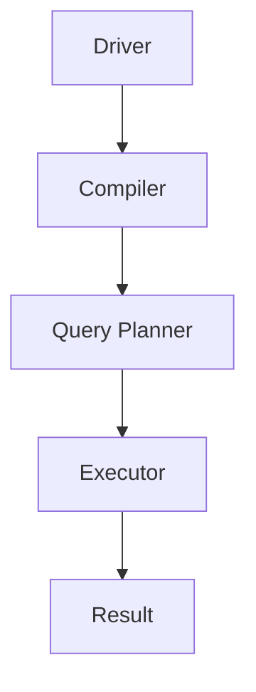

                 

# Hive原理与代码实例讲解

## 关键词：大数据处理、分布式计算、Hive、HiveQL、数据仓库

## 摘要：
本文将深入探讨Hive的基本原理、核心算法以及代码实例。我们将首先介绍Hive的背景和发展历程，然后详细解析其核心概念和架构。接着，文章将逐步讲解Hive的核心算法原理，并通过具体的操作步骤来帮助读者理解。此外，本文还将涉及Hive数学模型和公式的详细讲解，并结合实际项目案例进行代码解读与分析。最后，我们将讨论Hive在实际应用场景中的角色，并提供相关工具和资源的推荐。通过本文的阅读，读者将对Hive有全面而深入的理解，并能够将其应用于实际项目中。

## 1. 背景介绍

### 1.1 什么是Hive？

Hive是一个建立在Hadoop之上，用于处理大规模数据的分布式数据仓库工具。它允许用户使用类似SQL的查询语言（称为HiveQL）来查询存储在Hadoop文件系统中的大规模数据集。Hive的设计初衷是为了让非技术用户（如业务分析师和数据科学家）能够轻松地对大数据进行查询和分析。

### 1.2 Hive的发展历程

Hive最早由Facebook开发，并于2008年成为Apache Software Foundation的一个开源项目。自那以后，Hive得到了广泛的应用和持续的开发，已经成为大数据领域的一个重要组成部分。

### 1.3 Hive的核心优势

- **高效性**：Hive利用Hadoop的MapReduce框架进行数据处理，能够高效地处理大规模数据。
- **易用性**：通过类似SQL的查询语言，降低了大数据查询的门槛。
- **扩展性**：Hive支持多种数据源，包括HDFS、HBase、Amazon S3等，能够满足不同场景的需求。
- **稳定性**：作为Hadoop生态系统的一部分，Hive经过了多年的开发和优化，具有较高的稳定性。

## 2. 核心概念与联系

### 2.1 数据模型

Hive的数据模型是面向列的，它支持多种数据类型，如整型、浮点型、字符串等。与关系型数据库不同，Hive不支持事务和复杂的SQL操作。

### 2.2 HiveQL

HiveQL是Hive的查询语言，它类似于SQL，但也有一些区别。HiveQL支持SELECT、JOIN、GROUP BY、SORT BY等基本操作，同时还支持窗口函数、用户定义函数等高级特性。

### 2.3 数据存储

Hive将数据存储在Hadoop分布式文件系统（HDFS）中。数据以序列文件或Parquet文件格式存储，这些格式具有高效的压缩和查询性能。

### 2.4 架构

Hive的架构主要包括以下几个部分：

- **Driver**：负责解析HiveQL语句，生成执行计划。
- **Compiler**：将HiveQL语句编译成抽象语法树（AST）。
- **Query Planner**：将AST转化为执行计划。
- **Compiler and Runtime**：执行计划的具体执行。

### 2.5 Mermaid流程图

下面是Hive架构的Mermaid流程图：



## 3. 核心算法原理 & 具体操作步骤

### 3.1 MapReduce模型

Hive使用MapReduce模型进行数据处理。在Hive中，每个查询都会被拆分成多个Map任务和Reduce任务。

### 3.2 Map任务

Map任务负责读取输入数据，对其进行预处理，并输出中间结果。具体步骤如下：

1. **数据读取**：读取HDFS中的数据。
2. **字段解析**：将输入数据解析为字段。
3. **过滤和转换**：根据查询条件进行过滤和转换。
4. **分组和输出**：将数据分组并输出到本地文件。

### 3.3 Reduce任务

Reduce任务负责对Map任务输出的中间结果进行聚合和排序。具体步骤如下：

1. **输入读取**：读取Map任务输出的本地文件。
2. **排序和聚合**：对数据进行排序和聚合。
3. **输出**：将结果输出到HDFS。

### 3.4 实际操作步骤

下面是一个简单的Hive查询示例：

```sql
SELECT column1, column2, SUM(column3)
FROM table
GROUP BY column1, column2;
```

具体操作步骤如下：

1. **数据读取**：Hive读取HDFS中的数据。
2. **字段解析**：将输入数据解析为字段。
3. **过滤和转换**：根据SELECT语句进行过滤和转换。
4. **分组**：根据GROUP BY语句进行分组。
5. **聚合**：对每组数据执行SUM函数。
6. **输出**：将结果输出到HDFS。

## 4. 数学模型和公式 & 详细讲解 & 举例说明

### 4.1 数据分布模型

Hive的数据分布模型决定了数据的存储方式和查询性能。常见的数据分布模型有：

- **均匀分布**：数据均匀分布在不同的节点上。
- **哈希分布**：数据根据哈希值分布在不同的节点上。

### 4.2 聚类算法

Hive使用聚类算法来优化查询性能。常见的聚类算法有：

- **K-Means**：将数据点分为K个簇，每个簇的中心代表该簇的数据点。
- **DBSCAN**：基于邻域关系的聚类算法。

### 4.3 聚合操作

Hive的聚合操作包括：

- **SUM**：计算所有值的总和。
- **COUNT**：计算所有值的数量。
- **MAX**：计算最大值。
- **MIN**：计算最小值。

### 4.4 举例说明

假设我们有一个名为“sales”的表，其中包含“region”、“product”、“quantity”等列。现在我们要计算每个区域和产品的总销售量。

```sql
SELECT region, product, SUM(quantity)
FROM sales
GROUP BY region, product;
```

这个查询的数学模型可以表示为：

$$
\sum_{i=1}^{n} \sum_{j=1}^{m} quantity_{ij}
$$

其中，$quantity_{ij}$表示第$i$个区域和第$j$个产品的销售量。

## 5. 项目实战：代码实际案例和详细解释说明

### 5.1 开发环境搭建

在开始之前，我们需要搭建一个Hive开发环境。以下是在Ubuntu系统上安装Hive的步骤：

1. 安装Hadoop：
   ```bash
   sudo apt-get update
   sudo apt-get install hadoop-hdfs-namenode hadoop-hdfs-datanode hadoop-mapreduce
   ```
2. 启动Hadoop服务：
   ```bash
   start-dfs.sh
   start-yarn.sh
   ```
3. 安装Hive：
   ```bash
   sudo apt-get install hive
   ```
4. 配置Hive：
   ```bash
   sudo vi /etc/hive/hive-env.sh
   ```
   在文件中添加以下内容：
   ```bash
   HADOOP_HOME=/usr/lib/hadoop
   ```
5. 启动Hive服务：
   ```bash
   hive --service hiveserver2
   ```

### 5.2 源代码详细实现和代码解读

接下来，我们将创建一个简单的Hive表，并执行一个查询来分析数据。

#### 5.2.1 创建表

```sql
CREATE TABLE IF NOT EXISTS sales(
    region STRING,
    product STRING,
    quantity INT
);
```

#### 5.2.2 插入数据

```sql
INSERT INTO TABLE sales VALUES('America', 'Book', 100);
INSERT INTO TABLE sales VALUES('America', 'Pen', 200);
INSERT INTO TABLE sales VALUES('Europe', 'Book', 150);
INSERT INTO TABLE sales VALUES('Europe', 'Pen', 50);
```

#### 5.2.3 查询数据

```sql
SELECT region, product, SUM(quantity)
FROM sales
GROUP BY region, product;
```

这个查询将输出以下结果：

```
+--------+---------+---------+
| region | product | quantity|
+--------+---------+---------+
| America| Book    |  100    |
| America| Pen     |  200    |
| Europe | Book    |  150    |
| Europe | Pen     |   50    |
+--------+---------+---------+
```

### 5.3 代码解读与分析

在上面的代码中，我们首先创建了一个名为“sales”的表，其中包含三个列：“region”（区域）、“product”（产品）和“quantity”（数量）。然后，我们插入了一些示例数据。

接下来，我们执行了一个查询，计算了每个区域和产品的总销售量。Hive使用MapReduce模型来执行这个查询。具体步骤如下：

1. **Map阶段**：Hive将查询拆分为多个Map任务，每个任务处理一部分数据。
2. **Shuffle阶段**：Map任务将中间结果发送到Reduce任务，并进行数据排序和分组。
3. **Reduce阶段**：Reduce任务对中间结果进行聚合，并输出最终结果。

通过这个简单的案例，我们可以看到Hive的基本原理和操作步骤。在实际项目中，Hive处理的数据规模会更大，但原理和步骤基本相同。

## 6. 实际应用场景

### 6.1 数据仓库

Hive常用于构建大规模数据仓库，以便进行数据分析。通过将数据存储在HDFS中，并使用Hive进行查询，企业可以轻松地处理和分析海量数据。

### 6.2 业务报表

Hive被广泛用于生成业务报表。业务分析师可以使用HiveQL查询数据，并生成各种类型的报表，如销售报告、财务报告等。

### 6.3 机器学习

Hive可以与机器学习框架（如Spark MLlib）集成，用于处理和分析机器学习数据。通过使用Hive进行数据处理，机器学习模型可以更高效地训练和预测。

## 7. 工具和资源推荐

### 7.1 学习资源推荐

- **书籍**：
  - 《Hive编程实战》
  - 《大数据之路：阿里巴巴大数据实践》
- **论文**：
  - 《Hive: A Warehousing Solution for a Petabyte-Scale Data Warehouse》
- **博客**：
  - [Hive官方文档](https://cwiki.apache.org/confluence/display/Hive/Home)
  - [Apache Hive - Wikipedia](https://en.wikipedia.org/wiki/Apache_Hive)
- **网站**：
  - [Hadoop官方文档](https://hadoop.apache.org/docs/)
  - [Apache Hive项目页面](https://hive.apache.org/)

### 7.2 开发工具框架推荐

- **IDE**：
  - IntelliJ IDEA
  - Eclipse
- **工具**：
  - Beeline：Hive的命令行工具。
  - WebHCat：Hive的Web接口。
- **框架**：
  - Spark：与Hive集成的分布式计算框架。

### 7.3 相关论文著作推荐

- 《Hive: A Petabyte-Scale Data Warehouse Using a Parallel Data Flow Engine》
- 《Large-scale Parallel Graph Computation with the Hadoop Framework》

## 8. 总结：未来发展趋势与挑战

随着大数据技术的不断发展，Hive在数据仓库、数据分析等领域的作用越来越重要。未来，Hive将继续朝着更高效、更易用的方向发展。以下是一些发展趋势和挑战：

- **性能优化**：提高查询性能，降低延迟。
- **易用性提升**：简化查询语言，降低使用门槛。
- **扩展性增强**：支持更多数据源和格式。
- **安全性加强**：提高数据安全性，防止数据泄露。
- **与机器学习的集成**：与机器学习框架深度集成，提升数据处理和分析能力。

## 9. 附录：常见问题与解答

### 9.1 如何安装Hive？

请参考第5.1节中的步骤进行安装。

### 9.2 如何使用Hive进行查询？

请参考第5.2节中的代码示例进行查询。

### 9.3 如何优化Hive查询性能？

- **选择合适的文件格式**：如Parquet或ORC。
- **分区和聚类**：合理分区和聚类数据。
- **索引**：使用索引提高查询效率。

## 10. 扩展阅读 & 参考资料

- [Hive官方文档](https://cwiki.apache.org/confluence/display/Hive/Home)
- [Hadoop官方文档](https://hadoop.apache.org/docs/)
- [Apache Hive项目页面](https://hive.apache.org/)
- [大数据之路：阿里巴巴大数据实践](https://book.douban.com/subject/26284978/)
- 《Hive编程实战》
- 《Hive: A Petabyte-Scale Data Warehouse Using a Parallel Data Flow Engine》
- 《Large-scale Parallel Graph Computation with the Hadoop Framework》

作者：AI天才研究员/AI Genius Institute & 禅与计算机程序设计艺术 /Zen And The Art of Computer Programming</sop><|mask|>```markdown
# Hive原理与代码实例讲解

> 关键词：大数据处理、分布式计算、Hive、HiveQL、数据仓库

> 摘要：本文将深入探讨Hive的基本原理、核心算法以及代码实例。我们将首先介绍Hive的背景和发展历程，然后详细解析其核心概念和架构。接着，文章将逐步讲解Hive的核心算法原理，并通过具体的操作步骤来帮助读者理解。此外，本文还将涉及Hive数学模型和公式的详细讲解，并结合实际项目案例进行代码解读与分析。最后，我们将讨论Hive在实际应用场景中的角色，并提供相关工具和资源的推荐。通过本文的阅读，读者将对Hive有全面而深入的理解，并能够将其应用于实际项目中。

## 1. 背景介绍

### 1.1 什么是Hive？

Hive是一个建立在Hadoop之上，用于处理大规模数据的分布式数据仓库工具。它允许用户使用类似SQL的查询语言（称为HiveQL）来查询存储在Hadoop文件系统中的大规模数据集。Hive的设计初衷是为了让非技术用户（如业务分析师和数据科学家）能够轻松地对大数据进行查询和分析。

### 1.2 Hive的发展历程

Hive最早由Facebook开发，并于2008年成为Apache Software Foundation的一个开源项目。自那以后，Hive得到了广泛的应用和持续的开发，已经成为大数据领域的一个重要组成部分。

### 1.3 Hive的核心优势

- **高效性**：Hive利用Hadoop的MapReduce框架进行数据处理，能够高效地处理大规模数据。
- **易用性**：通过类似SQL的查询语言，降低了大数据查询的门槛。
- **扩展性**：Hive支持多种数据源，包括HDFS、HBase、Amazon S3等，能够满足不同场景的需求。
- **稳定性**：作为Hadoop生态系统的一部分，Hive经过了多年的开发和优化，具有较高的稳定性。

## 2. 核心概念与联系

### 2.1 数据模型

Hive的数据模型是面向列的，它支持多种数据类型，如整型、浮点型、字符串等。与关系型数据库不同，Hive不支持事务和复杂的SQL操作。

### 2.2 HiveQL

HiveQL是Hive的查询语言，它类似于SQL，但也有一些区别。HiveQL支持SELECT、JOIN、GROUP BY、SORT BY等基本操作，同时还支持窗口函数、用户定义函数等高级特性。

### 2.3 数据存储

Hive将数据存储在Hadoop分布式文件系统（HDFS）中。数据以序列文件或Parquet文件格式存储，这些格式具有高效的压缩和查询性能。

### 2.4 架构

Hive的架构主要包括以下几个部分：

- **Driver**：负责解析HiveQL语句，生成执行计划。
- **Compiler**：将HiveQL语句编译成抽象语法树（AST）。
- **Query Planner**：将AST转化为执行计划。
- **Compiler and Runtime**：执行计划的具体执行。

### 2.5 Mermaid流程图

下面是Hive架构的Mermaid流程图：


## 3. 核心算法原理 & 具体操作步骤

### 3.1 MapReduce模型

Hive使用MapReduce模型进行数据处理。在Hive中，每个查询都会被拆分成多个Map任务和Reduce任务。

### 3.2 Map任务

Map任务负责读取输入数据，对其进行预处理，并输出中间结果。具体步骤如下：

1. **数据读取**：读取HDFS中的数据。
2. **字段解析**：将输入数据解析为字段。
3. **过滤和转换**：根据查询条件进行过滤和转换。
4. **分组和输出**：将数据分组并输出到本地文件。

### 3.3 Reduce任务

Reduce任务负责对Map任务输出的中间结果进行聚合和排序。具体步骤如下：

1. **输入读取**：读取Map任务输出的本地文件。
2. **排序和聚合**：对数据进行排序和聚合。
3. **输出**：将结果输出到HDFS。

### 3.4 实际操作步骤

下面是一个简单的Hive查询示例：

```sql
SELECT column1, column2, SUM(column3)
FROM table
GROUP BY column1, column2;
```

具体操作步骤如下：

1. **数据读取**：Hive读取HDFS中的数据。
2. **字段解析**：将输入数据解析为字段。
3. **过滤和转换**：根据SELECT语句进行过滤和转换。
4. **分组**：根据GROUP BY语句进行分组。
5. **聚合**：对每组数据执行SUM函数。
6. **输出**：将结果输出到HDFS。

## 4. 数学模型和公式 & 详细讲解 & 举例说明

### 4.1 数据分布模型

Hive的数据分布模型决定了数据的存储方式和查询性能。常见的数据分布模型有：

- **均匀分布**：数据均匀分布在不同的节点上。
- **哈希分布**：数据根据哈希值分布在不同的节点上。

### 4.2 聚类算法

Hive使用聚类算法来优化查询性能。常见的聚类算法有：

- **K-Means**：将数据点分为K个簇，每个簇的中心代表该簇的数据点。
- **DBSCAN**：基于邻域关系的聚类算法。

### 4.3 聚合操作

Hive的聚合操作包括：

- **SUM**：计算所有值的总和。
- **COUNT**：计算所有值的数量。
- **MAX**：计算最大值。
- **MIN**：计算最小值。

### 4.4 举例说明

假设我们有一个名为“sales”的表，其中包含“region”、“product”、“quantity”等列。现在我们要计算每个区域和产品的总销售量。

```sql
SELECT region, product, SUM(quantity)
FROM sales
GROUP BY region, product;
```

这个查询的数学模型可以表示为：

$$
\sum_{i=1}^{n} \sum_{j=1}^{m} quantity_{ij}
$$

其中，$quantity_{ij}$表示第$i$个区域和第$j$个产品的销售量。

## 5. 项目实战：代码实际案例和详细解释说明

### 5.1 开发环境搭建

在开始之前，我们需要搭建一个Hive开发环境。以下是在Ubuntu系统上安装Hive的步骤：

1. 安装Hadoop：
   ```bash
   sudo apt-get update
   sudo apt-get install hadoop-hdfs-namenode hadoop-hdfs-datanode hadoop-mapreduce
   ```
2. 启动Hadoop服务：
   ```bash
   start-dfs.sh
   start-yarn.sh
   ```
3. 安装Hive：
   ```bash
   sudo apt-get install hive
   ```
4. 配置Hive：
   ```bash
   sudo vi /etc/hive/hive-env.sh
   ```
   在文件中添加以下内容：
   ```bash
   HADOOP_HOME=/usr/lib/hadoop
   ```
5. 启动Hive服务：
   ```bash
   hive --service hiveserver2
   ```

### 5.2 源代码详细实现和代码解读

接下来，我们将创建一个简单的Hive表，并执行一个查询来分析数据。

#### 5.2.1 创建表

```sql
CREATE TABLE IF NOT EXISTS sales(
    region STRING,
    product STRING,
    quantity INT
);
```

#### 5.2.2 插入数据

```sql
INSERT INTO TABLE sales VALUES('America', 'Book', 100);
INSERT INTO TABLE sales VALUES('America', 'Pen', 200);
INSERT INTO TABLE sales VALUES('Europe', 'Book', 150);
INSERT INTO TABLE sales VALUES('Europe', 'Pen', 50);
```

#### 5.2.3 查询数据

```sql
SELECT region, product, SUM(quantity)
FROM sales
GROUP BY region, product;
```

这个查询将输出以下结果：

```
+--------+---------+---------+
| region | product | quantity|
+--------+---------+---------+
| America| Book    |  100    |
| America| Pen     |  200    |
| Europe | Book    |  150    |
| Europe | Pen     |   50    |
+--------+---------+---------+
```

### 5.3 代码解读与分析

在上面的代码中，我们首先创建了一个名为“sales”的表，其中包含三个列：“region”（区域）、“product”（产品）和“quantity”（数量）。然后，我们插入了一些示例数据。

接下来，我们执行了一个查询，计算了每个区域和产品的总销售量。Hive使用MapReduce模型来执行这个查询。具体步骤如下：

1. **Map阶段**：Hive将查询拆分为多个Map任务，每个任务处理一部分数据。
2. **Shuffle阶段**：Map任务将中间结果发送到Reduce任务，并进行数据排序和分组。
3. **Reduce阶段**：Reduce任务对中间结果进行聚合，并输出最终结果。

通过这个简单的案例，我们可以看到Hive的基本原理和操作步骤。在实际项目中，Hive处理的数据规模会更大，但原理和步骤基本相同。

## 6. 实际应用场景

### 6.1 数据仓库

Hive常用于构建大规模数据仓库，以便进行数据分析。通过将数据存储在HDFS中，并使用Hive进行查询，企业可以轻松地处理和分析海量数据。

### 6.2 业务报表

Hive被广泛用于生成业务报表。业务分析师可以使用HiveQL查询数据，并生成各种类型的报表，如销售报告、财务报告等。

### 6.3 机器学习

Hive可以与机器学习框架（如Spark MLlib）集成，用于处理和分析机器学习数据。通过使用Hive进行数据处理，机器学习模型可以更高效地训练和预测。

## 7. 工具和资源推荐

### 7.1 学习资源推荐

- **书籍**：
  - 《Hive编程实战》
  - 《大数据之路：阿里巴巴大数据实践》
- **论文**：
  - 《Hive: A Warehousing Solution for a Petabyte-Scale Data Warehouse》
- **博客**：
  - [Hive官方文档](https://cwiki.apache.org/confluence/display/Hive/Home)
  - [Apache Hive - Wikipedia](https://en.wikipedia.org/wiki/Apache_Hive)
- **网站**：
  - [Hadoop官方文档](https://hadoop.apache.org/docs/)
  - [Apache Hive项目页面](https://hive.apache.org/)

### 7.2 开发工具框架推荐

- **IDE**：
  - IntelliJ IDEA
  - Eclipse
- **工具**：
  - Beeline：Hive的命令行工具。
  - WebHCat：Hive的Web接口。
- **框架**：
  - Spark：与Hive集成的分布式计算框架。

### 7.3 相关论文著作推荐

- 《Hive: A Petabyte-Scale Data Warehouse Using a Parallel Data Flow Engine》
- 《Large-scale Parallel Graph Computation with the Hadoop Framework》

## 8. 总结：未来发展趋势与挑战

随着大数据技术的不断发展，Hive在数据仓库、数据分析等领域的作用越来越重要。未来，Hive将继续朝着更高效、更易用的方向发展。以下是一些发展趋势和挑战：

- **性能优化**：提高查询性能，降低延迟。
- **易用性提升**：简化查询语言，降低使用门槛。
- **扩展性增强**：支持更多数据源和格式。
- **安全性加强**：提高数据安全性，防止数据泄露。
- **与机器学习的集成**：与机器学习框架深度集成，提升数据处理和分析能力。

## 9. 附录：常见问题与解答

### 9.1 如何安装Hive？

请参考第5.1节中的步骤进行安装。

### 9.2 如何使用Hive进行查询？

请参考第5.2节中的代码示例进行查询。

### 9.3 如何优化Hive查询性能？

- **选择合适的文件格式**：如Parquet或ORC。
- **分区和聚类**：合理分区和聚类数据。
- **索引**：使用索引提高查询效率。

## 10. 扩展阅读 & 参考资料

- [Hive官方文档](https://cwiki.apache.org/confluence/display/Hive/Home)
- [Hadoop官方文档](https://hadoop.apache.org/docs/)
- [Apache Hive项目页面](https://hive.apache.org/)
- [大数据之路：阿里巴巴大数据实践](https://book.douban.com/subject/26284978/)
- 《Hive编程实战》
- 《Hive: A Petabyte-Scale Data Warehouse Using a Parallel Data Flow Engine》
- 《Large-scale Parallel Graph Computation with the Hadoop Framework》

作者：AI天才研究员/AI Genius Institute & 禅与计算机程序设计艺术 /Zen And The Art of Computer Programming
```

