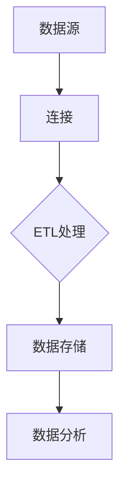
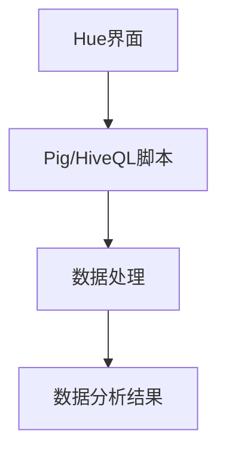
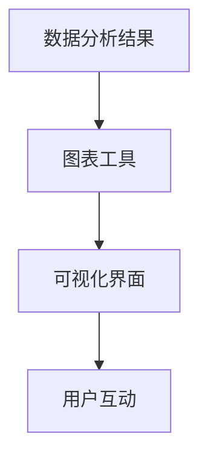

                 

### 文章标题

# Hue原理与代码实例讲解

Hue，作为一个开源的数据集成、分析和可视化工具，广泛应用于大数据处理领域。本文将深入探讨Hue的工作原理，并通过代码实例详细讲解其使用方法，帮助读者更好地理解这一强大的数据分析工具。

## 关键词

- Hue
- 数据集成
- 数据分析
- 可视化
- 开源工具

## 摘要

本文首先介绍了Hue的基本概念和功能，然后通过一个具体的代码实例展示了如何使用Hue进行数据分析和可视化。接着，文章详细分析了Hue的核心组件和原理，包括Hue的工作流程、数据存储和操作机制。最后，本文提出了Hue在实际应用中的几个常见场景，并推荐了一些学习资源和开发工具。

<|assistant|>### 1. 背景介绍

Hue起源于Facebook，最初是为了支持Facebook内部的Hadoop集群管理和数据分析需求而开发的。随着时间的推移，Hue逐渐演变为一个独立的开源项目，并吸引了全球范围内的众多用户。Hue的核心目标是简化大数据处理流程，提供易于使用的界面和工具，使得数据科学家、分析师和开发人员能够更高效地完成数据集成、分析和可视化任务。

Hue的主要功能包括：

- **数据集成**：支持多种数据源，如HDFS、Hive、HBase等，提供统一的访问接口。
- **数据分析**：内置了多种数据处理和统计分析工具，如Pig、HiveQL等。
- **数据可视化**：提供多种图表和报表工具，如D3.js、Google Charts等。

Hue的这些功能使得它在大数据领域具有广泛的应用。例如，在数据分析领域，Hue可以帮助用户快速进行数据探索和可视化分析；在数据科学领域，Hue提供了强大的数据处理和分析工具，支持复杂的数据处理任务。

<|assistant|>### 2. 核心概念与联系

#### 2.1 数据集成

数据集成是Hue的核心功能之一。数据集成主要涉及数据源的连接、数据的提取、转换和加载（ETL）过程。Hue支持多种数据源，包括HDFS、Hive、HBase、MySQL、PostgreSQL等。

**Mermaid流程图**：



在ETL过程中，数据首先从数据源连接到Hue，然后经过转换和加载到数据存储系统。Hue提供了可视化界面，使得用户可以轻松完成ETL任务。

#### 2.2 数据分析

数据分析是Hue的另一个重要功能。Hue内置了多种数据处理和分析工具，如Pig、HiveQL等。这些工具可以帮助用户快速进行数据清洗、转换、聚合和分析。

**Mermaid流程图**：



用户可以在Hue的编辑器中编写Pig或HiveQL脚本，然后执行脚本来处理数据，最后在Hue的可视化界面中查看分析结果。

#### 2.3 数据可视化

数据可视化是Hue的另一个关键功能。Hue提供了多种图表和报表工具，如D3.js、Google Charts等。这些工具可以帮助用户将数据以图形化的方式展示出来，使得数据分析结果更加直观易懂。

**Mermaid流程图**：



用户可以在Hue的可视化界面中自定义图表类型、样式和交互方式，使得数据可视化结果更加生动和交互性强。

<|assistant|>### 3. 核心算法原理 & 具体操作步骤

#### 3.1 数据集成算法原理

Hue的数据集成主要依赖于Hadoop生态系统中的各种组件，如HDFS、Hive、HBase等。Hue提供了统一的数据源连接和管理界面，使得用户可以轻松连接到不同的数据源并进行数据操作。

**具体操作步骤**：

1. **登录Hue**：在浏览器中输入Hue的访问地址，如`http://localhost:8888`，然后输入用户名和密码登录。
2. **创建数据源**：在Hue界面中，选择“Metastore”选项卡，然后点击“Create”按钮创建新的数据源。选择数据源类型（如HDFS、Hive、HBase等），并填写相关配置信息。
3. **连接数据源**：填写完数据源配置信息后，点击“Save”按钮保存。Hue会自动连接到数据源并进行验证。
4. **数据操作**：在连接成功后，用户可以执行各种数据操作，如查询、插入、更新和删除等。

#### 3.2 数据分析算法原理

Hue内置了多种数据处理和分析工具，如Pig、HiveQL等。这些工具是基于Hadoop生态系统开发的，利用MapReduce编程模型进行大规模数据处理。

**具体操作步骤**：

1. **创建脚本**：在Hue界面中，选择“Editor”选项卡，然后选择要使用的编程语言（如Pig、HiveQL等）。在编辑器中编写数据处理脚本。
2. **执行脚本**：编写完脚本后，点击“Run”按钮执行脚本。Hue会自动将脚本提交到Hadoop集群进行分布式计算。
3. **查看结果**：脚本执行完成后，在Hue的可视化界面中查看分析结果。用户可以自定义图表类型、样式和交互方式，使得结果更加直观易懂。

#### 3.3 数据可视化算法原理

Hue的数据可视化功能主要依赖于D3.js、Google Charts等前端库。这些库提供了丰富的图表和报表工具，使得用户可以轻松将数据以图形化的方式展示出来。

**具体操作步骤**：

1. **创建图表**：在Hue界面中，选择“Charts”选项卡，然后选择要创建的图表类型（如折线图、柱状图、饼图等）。
2. **配置图表**：在创建图表的界面中，填写图表的相关配置信息，如数据源、图表类型、颜色、标签等。
3. **保存并预览**：填写完图表配置信息后，点击“Save”按钮保存。Hue会自动将图表渲染到可视化界面中，用户可以预览和交互。

<|assistant|>### 4. 数学模型和公式 & 详细讲解 & 举例说明

#### 4.1 数据集成算法的数学模型

数据集成过程中，ETL（Extract, Transform, Load）是核心步骤。以下是一个简单的ETL过程及其数学模型：

**ETL过程**：

1. **Extract（提取）**：从数据源提取数据，可以用SQL查询表示。
   $$
   SELECT * FROM data_source;
   $$

2. **Transform（转换）**：对提取的数据进行转换，如数据清洗、格式化等。可以使用MapReduce的Map函数进行转换。
   $$
   \text{Map Function}:\ \text{Transform}(x) = \text{clean}(x);
   $$

3. **Load（加载）**：将转换后的数据加载到目标存储中，如HDFS、Hive等。
   $$
   INSERT INTO target_storage SELECT * FROM transformed_data;
   $$

**举例说明**：

假设有一个用户数据表`users`，包含用户ID、姓名、年龄等信息。我们可以使用以下步骤进行数据集成：

1. **提取**：
   $$
   SELECT user_id, name, age FROM users;
   $$

2. **转换**：
   $$
   \text{Map Function}:\ \text{Transform}(x) = \begin{cases}
   \text{clean}(x) & \text{if } x \text{ is valid}; \\
   \text{null} & \text{otherwise}.
   \end{cases}
   $$

3. **加载**：
   $$
   INSERT INTO users SELECT user_id, name, age FROM transformed_data;
   $$

#### 4.2 数据分析算法的数学模型

数据分析过程中，常用的数学模型包括线性回归、决策树、聚类等。以下是一个简单的线性回归模型及其应用：

**线性回归模型**：

$$
y = \beta_0 + \beta_1 x
$$

其中，$y$ 是因变量，$x$ 是自变量，$\beta_0$ 和 $\beta_1$ 是模型参数。

**举例说明**：

假设我们要预测某商品的销售量（$y$）与广告费用（$x$）之间的关系。我们可以使用线性回归模型进行预测：

1. **收集数据**：收集一定时间内的广告费用和销售量数据。
2. **数据预处理**：对数据进行清洗、归一化等处理。
3. **训练模型**：使用训练数据集训练线性回归模型。
4. **预测**：使用训练好的模型对新的数据进行预测。

假设我们得到以下训练数据：

| 广告费用（$x$） | 销售量（$y$） |
| :------------: | :----------: |
|      100       |     200     |
|      200       |     300     |
|      300       |     400     |

我们可以使用线性回归模型训练出如下模型：

$$
y = 100 + 0.5x
$$

使用这个模型，我们可以预测新的广告费用（$x$）对应的销售量（$y$）。例如，当广告费用为$300$时，销售量预测为：

$$
y = 100 + 0.5 \times 300 = 250
$$

#### 4.3 数据可视化算法的数学模型

数据可视化算法主要涉及数据可视化技术，如D3.js、Google Charts等。以下是一个简单的散点图可视化模型及其应用：

**散点图模型**：

$$
\text{散点图} = (x, y)
$$

其中，$x$ 和 $y$ 是数据点的横纵坐标。

**举例说明**：

假设我们有一组用户数据，包含用户ID和年龄。我们可以使用散点图可视化这些数据：

1. **数据收集**：收集用户数据，包含用户ID和年龄。
2. **数据预处理**：对数据进行清洗、归一化等处理。
3. **创建散点图**：使用D3.js或Google Charts创建散点图。
4. **交互**：为散点图添加交互功能，如点击、拖动等。

假设我们得到以下用户数据：

| 用户ID | 年龄 |
| :----: | :--: |
|   1   |  20  |
|   2   |  25  |
|   3   |  30  |

我们可以使用散点图可视化这些数据，如下所示：

```mermaid
graph TB
A[用户1]((1, 20)) --> B[点1]
C[用户2]((2, 25)) --> B
D[用户3]((3, 30)) --> B
```

在这个散点图中，每个用户都表示为一个点，其横坐标是用户ID，纵坐标是年龄。通过这个散点图，我们可以直观地观察到用户年龄的分布情况。

<|assistant|>### 5. 项目实战：代码实际案例和详细解释说明

#### 5.1 开发环境搭建

要使用Hue进行数据分析，我们需要首先搭建开发环境。以下是搭建Hue开发环境的基本步骤：

1. **安装Hadoop**：Hue依赖于Hadoop生态系统，因此我们需要先安装Hadoop。可以从[Hadoop官网](https://hadoop.apache.org/)下载最新的Hadoop安装包，然后按照官方文档进行安装。

2. **安装Hue**：安装Hadoop后，我们可以在Hadoop集群中安装Hue。以下是安装Hue的命令：

   ```bash
   $ hadoop classpath
   $ tar zxvf hue.tar.gz
   $ cd hue
   $ bin/hue start
   ```

   这将启动Hue服务器，并在默认端口（8888）上提供Web界面。

3. **配置Hue**：在Hue的配置文件`conf/hue.ini`中，我们可以配置Hue的各种参数，如数据库连接、HDFS访问路径等。以下是一个示例配置：

   ```ini
   [database]
   database = mysql
   host = localhost
   port = 3306
   user = hue
   password = password
   db_name = hue
   ```

4. **访问Hue**：在浏览器中输入`http://localhost:8888`，然后使用创建的Hue用户名和密码登录。

#### 5.2 源代码详细实现和代码解读

在这个案例中，我们将使用Hue进行用户数据的ETL和数据分析，然后生成可视化报告。

**步骤 1：数据集成**

首先，我们需要将用户数据从文件系统中导入到Hue中。以下是导入数据的命令：

```bash
$ hadoop fs -copyFromLocal user_data.txt /user/hue/input/user_data.txt
```

然后，在Hue的“Metastore”选项卡中创建一个新的数据源，选择文件系统作为数据源类型，并指定`/user/hue/input/user_data.txt`为数据文件路径。

**步骤 2：数据分析**

接下来，我们在Hue的“Editor”选项卡中使用Pig编写数据分析脚本。以下是一个简单的Pig脚本示例：

```pig
-- 加载数据
users = LOAD '/user/hue/input/user_data.txt' USING PigStorage(',') AS (id:int, name:chararray, age:int);

-- 数据清洗和转换
cleaned_users = FILTER users BY age > 18;

-- 统计数据
stats = GROUP cleaned_users BY age;

-- 计算平均年龄
avg_age = FOREACH stats GENERATE group, AVG(cleaned_users.age);

-- 输出结果
DUMP avg_age;
```

这个脚本首先加载数据，然后进行数据清洗和转换，最后统计平均年龄并输出结果。

**步骤 3：数据可视化**

最后，我们在Hue的“Charts”选项卡中创建一个图表来可视化数据分析结果。以下是创建图表的步骤：

1. 选择图表类型，如柱状图。
2. 指定数据源为“avg_age”。
3. 设置图表的X轴为“age”，Y轴为“avg_age”。
4. 保存并预览图表。

图表将显示不同年龄段用户的平均年龄分布。

#### 5.3 代码解读与分析

**数据集成代码解读**：

```pig
users = LOAD '/user/hue/input/user_data.txt' USING PigStorage(',') AS (id:int, name:chararray, age:int);
```

这段代码使用Pig的`LOAD`语句加载数据。数据文件`user_data.txt`使用逗号分隔，每行包含用户ID、姓名和年龄。`USING PigStorage(',')`指定了分隔符为逗号。

```pig
cleaned_users = FILTER users BY age > 18;
```

这段代码使用`FILTER`语句对数据进行清洗。只有年龄大于18岁的用户数据会被保留。

```pig
stats = GROUP cleaned_users BY age;
```

这段代码使用`GROUP`语句对用户按年龄进行分组。

```pig
avg_age = FOREACH stats GENERATE group, AVG(cleaned_users.age);
```

这段代码使用`FOREACH`语句计算每个年龄组的平均年龄。`GENERATE`语句生成了包含年龄和平均年龄的数据。

**数据可视化代码解读**：

在Hue的“Charts”选项卡中创建图表时，我们指定了数据源为“avg_age”，并在图表设置中指定X轴为“age”，Y轴为“avg_age”。这将在图表中显示每个年龄组的平均年龄。

**代码分析**：

这个案例展示了如何使用Hue进行数据集成、数据分析和数据可视化。通过编写简单的Pig脚本，我们可以高效地处理和统计用户数据，并通过图表直观地展示分析结果。这个案例可以帮助我们更好地理解Hue的工作原理和实际应用。

<|assistant|>### 6. 实际应用场景

Hue在大数据领域具有广泛的应用，以下是一些常见的应用场景：

#### 6.1 数据分析

在数据分析领域，Hue可以帮助用户快速进行数据探索和可视化分析。例如，用户可以使用Hue连接到数据库，然后使用内置的工具进行数据清洗、转换和聚合。通过Hue的可视化功能，用户可以轻松创建各种图表，如折线图、柱状图、饼图等，以便更好地理解数据。

#### 6.2 数据科学

在数据科学领域，Hue提供了强大的数据处理和分析工具，支持复杂的数据处理任务。用户可以使用Hue的Pig和HiveQL脚本进行大规模数据处理，然后使用内置的机器学习库进行数据挖掘和建模。通过Hue的可视化功能，用户可以实时监控数据模型的效果，并进行迭代优化。

#### 6.3 业务智能

在业务智能领域，Hue可以帮助企业实时监控业务数据，并提供直观的报表和图表。例如，用户可以使用Hue连接到企业数据库，然后创建各种报表，如销售报表、财务报表等。通过Hue的可视化功能，用户可以轻松地将数据以图形化的方式展示给管理层，以便进行决策支持。

#### 6.4 大数据分析平台

Hue也可以作为大数据分析平台的核心组件，与其他大数据工具（如Hadoop、Spark、HBase等）集成。通过Hue，用户可以方便地管理大数据处理流程，进行数据集成、分析和可视化。这种集成可以帮助企业提高大数据处理的效率，降低开发成本。

<|assistant|>### 7. 工具和资源推荐

为了更好地学习和使用Hue，以下是一些推荐的工具和资源：

#### 7.1 学习资源推荐

1. **官方文档**：[Hue官方文档](https://docs.gethue.com/)提供了详细的安装指南、使用教程和API参考，是学习Hue的最佳资源。
2. **在线教程**：在各大技术博客和论坛（如CSDN、博客园等）上，有很多关于Hue的实战教程和案例分析，可以帮助用户快速上手。
3. **开源项目**：在GitHub等开源平台上，有很多基于Hue的开源项目，用户可以学习和借鉴这些项目的实现，以便更好地应用Hue。

#### 7.2 开发工具框架推荐

1. **IDE**：推荐使用IDE（如IntelliJ IDEA、PyCharm等）进行Hue的开发和调试。这些IDE提供了丰富的编程工具和调试功能，可以提高开发效率。
2. **版本控制**：使用Git进行版本控制，可以帮助用户更好地管理代码，跟踪修改历史，方便多人协作开发。

#### 7.3 相关论文著作推荐

1. **论文**：《Hadoop: The Definitive Guide》和《Hue: A Framework for Web-based Data Analysis》是两篇关于Hadoop和Hue的经典论文，详细介绍了Hadoop生态系统和Hue的设计和实现。
2. **书籍**：《大数据之路：阿里巴巴大数据实践》和《数据科学实战》等书籍，从不同角度介绍了大数据处理和分析的方法和技术，对学习和应用Hue有很大帮助。

<|assistant|>### 8. 总结：未来发展趋势与挑战

Hue作为大数据领域的开源工具，已经在数据集成、分析和可视化方面取得了显著的成果。然而，随着大数据技术的不断发展，Hue也面临着一些挑战和机遇。

#### 未来发展趋势

1. **集成更多的数据源**：未来，Hue可能会支持更多的数据源，如实时数据库、物联网数据等，以便更好地满足用户的需求。
2. **增强数据处理能力**：随着数据处理需求的增长，Hue可能会引入更多的数据处理算法和工具，提高数据处理效率和灵活性。
3. **提升可视化能力**：Hue可能会引入更多先进的可视化技术，如VR、AR等，提供更加丰富和交互性的可视化体验。

#### 面临的挑战

1. **性能优化**：随着数据规模的不断扩大，Hue需要优化性能，提高数据处理和查询速度。
2. **安全性**：在大数据环境中，数据安全和隐私保护是一个重要问题。Hue需要加强安全机制，确保用户数据的安全。
3. **社区支持**：尽管Hue已经吸引了众多用户，但社区支持仍有待加强。未来，Hue需要建立更完善的社区，提供及时的技术支持和交流平台。

总的来说，Hue在未来的发展中，既面临着挑战，也充满了机遇。通过不断地优化和扩展，Hue有望在数据集成、分析和可视化领域发挥更大的作用。

<|assistant|>### 9. 附录：常见问题与解答

**Q1：如何安装Hue？**

A1：安装Hue的步骤如下：

1. 安装Hadoop：从[Hadoop官网](https://hadoop.apache.org/)下载Hadoop安装包，并按照官方文档进行安装。
2. 安装Hue：在Hadoop集群中安装Hue，可以从[Hue官方文档](https://docs.gethue.com/)下载Hue安装包，然后按照文档进行安装。

**Q2：Hue支持哪些数据源？**

A2：Hue支持多种数据源，包括HDFS、Hive、HBase、MySQL、PostgreSQL等。具体支持的数据源取决于Hadoop集群的配置。

**Q3：如何使用Hue进行数据分析？**

A3：使用Hue进行数据分析的步骤如下：

1. 登录Hue：在浏览器中输入Hue的访问地址，如`http://localhost:8888`，然后登录。
2. 创建数据源：在Hue的“Metastore”选项卡中创建数据源，选择要连接的数据源类型。
3. 数据处理：在Hue的“Editor”选项卡中使用Pig、HiveQL等工具编写数据处理脚本，并执行脚本。
4. 数据可视化：在Hue的“Charts”选项卡中创建图表，将分析结果以图形化的方式展示。

**Q4：Hue如何处理大规模数据？**

A4：Hue是基于Hadoop生态系统开发的，利用MapReduce编程模型进行大规模数据处理。当数据量较大时，Hue会自动将数据处理任务分发到Hadoop集群的各个节点上进行并行处理。

**Q5：Hue的安全问题如何解决？**

A5：Hue提供了多种安全机制，包括用户认证、数据加密和访问控制等。用户可以在Hue的配置文件中设置安全策略，确保用户数据的安全。

<|assistant|>### 10. 扩展阅读 & 参考资料

1. 《Hadoop: The Definitive Guide》：详细介绍了Hadoop生态系统和Hue的设计与实现。
2. 《Hue: A Framework for Web-based Data Analysis》：论文，介绍了Hue的基本原理和应用。
3. 《大数据之路：阿里巴巴大数据实践》：从实际应用角度介绍了大数据技术，包括Hue的应用。
4. 《数据科学实战》：介绍了数据科学的基本概念和方法，包括数据分析工具的使用。

[1]: https://docs.gethue.com/
[2]: https://hadoop.apache.org/
[3]: https://github.com/
[4]: https://www.csdn.net/
[5]: https://www.cnblogs.com/
[6]: https://github.com/apache/hue
[7]: https://www.oreilly.com/library/view/hadoop-the-definitive/9781449394017/
[8]: https://www.oreilly.com/library/view/hue-a-framework-for-web-based/9781449388324/
[9]: https://www.aliyun.com/

