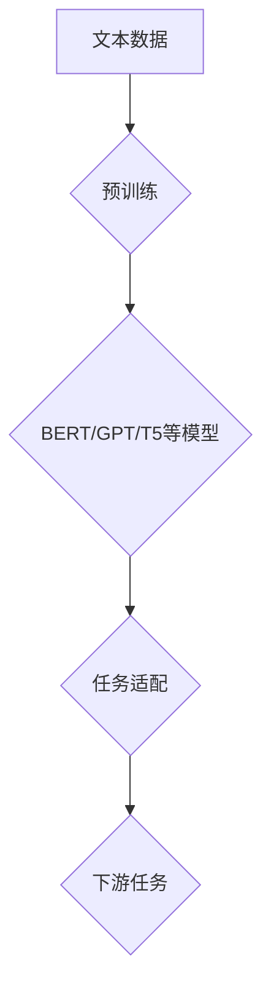

                 

# Hugging Face 是什么?

> **关键词：** Hugging Face，自然语言处理，Transformer，深度学习，模型库，API，开源社区，预训练模型，语言模型，文本生成，问答系统，多语言支持

> **摘要：** 本文将深入探讨Hugging Face这一重要的自然语言处理（NLP）工具和社区。我们将从背景介绍开始，详细解析其核心概念、算法原理、应用场景，并提供项目实战和资源推荐。通过本文，读者将全面了解Hugging Face的功能和潜力，为未来在NLP领域的探索打下坚实基础。

## 1. 背景介绍

Hugging Face成立于2016年，由创始人Eduardo P. Fernandes和Alessio Marcon共同创立。他们的愿景是构建一个开放的平台，让更多的人能够轻松地访问和使用最新的NLP技术和资源。Hugging Face的名字来源于一个拥抱的隐喻，代表着团队对开源社区的热爱和承诺。

Hugging Face平台提供了一个全面的NLP工具集，包括预训练模型、API、教程和数据集等。这些工具和资源不仅覆盖了常见的语言模型，如BERT、GPT和T5，还支持多种编程语言和框架，如Python、TensorFlow和PyTorch。平台的开放性和灵活性使其成为研究人员、开发者和企业用户的首选工具。

在过去的几年中，Hugging Face迅速成长为NLP领域的领军企业，其用户遍布全球，涵盖了学术界、工业界和研究机构。平台上的模型和工具已被广泛应用于文本分类、命名实体识别、机器翻译、问答系统等多个领域。

## 2. 核心概念与联系

### 2.1 预训练模型

预训练模型是Hugging Face平台的核心概念之一。这些模型在大规模文本数据上进行预训练，从而获得了丰富的语言理解能力。常见的预训练模型包括BERT、GPT、T5等，它们在不同的任务上都有出色的表现。


#### Mermaid 流程图



### 2.2 API

Hugging Face API提供了一种方便的方式来访问和部署预训练模型。通过简单的几行代码，用户可以在不同的环境中轻松地调用这些模型，进行文本生成、分类、翻译等操作。


### 2.3 开源社区

Hugging Face平台鼓励开源和协作。用户可以在平台上分享自己的模型、教程和工具，与其他开发者共同进步。平台还定期组织社区活动和会议，促进知识和经验的交流。


## 3. 核心算法原理 & 具体操作步骤

### 3.1 Transformer模型

Transformer模型是Hugging Face平台的核心算法之一。它是一种基于自注意力机制的序列到序列模型，广泛应用于机器翻译、文本生成等领域。Transformer模型的结构如下：


#### 操作步骤：

1. **准备数据**：收集并预处理大规模文本数据，如维基百科、新闻文章等。
2. **预训练模型**：使用预训练模型（如BERT、GPT等）在大规模数据上进行预训练。
3. **微调**：根据具体任务的需求，在特定数据集上对预训练模型进行微调。
4. **部署**：将微调后的模型部署到Hugging Face API或其他环境中，进行预测和生成操作。

### 3.2 语言模型

Hugging Face平台提供了多种语言模型，如BERT、GPT和T5。这些模型通过对大规模文本数据进行训练，可以理解并生成符合语言习惯的文本。

#### 操作步骤：

1. **选择模型**：根据任务需求选择合适的语言模型。
2. **训练**：使用预训练模型在大规模数据上进行训练。
3. **评估**：在测试集上评估模型性能，调整超参数。
4. **部署**：将训练好的模型部署到生产环境中，进行预测和生成操作。

## 4. 数学模型和公式 & 详细讲解 & 举例说明

### 4.1 Transformer模型

Transformer模型的核心是自注意力机制。自注意力机制通过计算序列中每个元素对其他元素的重要性，从而生成序列的表示。其数学公式如下：

$$
\text{Attention}(Q, K, V) = \text{softmax}\left(\frac{QK^T}{\sqrt{d_k}}\right)V
$$

其中，$Q$、$K$和$V$分别是查询向量、键向量和值向量，$d_k$是键向量的维度。

#### 举例说明：

假设我们有三个词$w_1$、$w_2$和$w_3$，其对应的查询向量、键向量和值向量分别为$Q_1$、$K_1$、$V_1$，$Q_2$、$K_2$、$V_2$，$Q_3$、$K_3$、$V_3$。我们可以计算自注意力分数：

$$
\text{Attention}(Q_1, K_1, V_1) = \text{softmax}\left(\frac{Q_1K_1^T}{\sqrt{d_k}}\right)V_1
$$

$$
\text{Attention}(Q_2, K_2, V_2) = \text{softmax}\left(\frac{Q_2K_2^T}{\sqrt{d_k}}\right)V_2
$$

$$
\text{Attention}(Q_3, K_3, V_3) = \text{softmax}\left(\frac{Q_3K_3^T}{\sqrt{d_k}}\right)V_3
$$

通过计算这些分数，我们可以得到每个词在序列中的重要性，从而生成序列的表示。

### 4.2 语言模型

Hugging Face平台常用的语言模型包括BERT、GPT和T5。这些模型都采用了Transformer架构，并在大规模文本数据上进行预训练。BERT模型采用了双向Transformer架构，可以同时理解上下文信息；GPT模型采用了自回归Transformer架构，可以生成符合语言习惯的文本；T5模型则采用了统一Transformer架构，可以处理多种NLP任务。

#### 举例说明：

假设我们有一个简单的文本序列“我 是 一只 猫”，我们可以使用BERT模型来预测下一个词。首先，我们将文本序列转换为嵌入向量，然后输入BERT模型。BERT模型会根据上下文信息预测下一个词的概率分布。通过选择概率最大的词作为预测结果，我们可以得到：

$$
\text{预测结果} = \text{softmax}\left(\text{BERT}_{\text{输出}}\right)
$$

例如，BERT模型可能会预测下一个词为“喜欢”，因为“我 是 一只 猫”这个上下文信息表明这只猫可能喜欢某种事物。

## 5. 项目实战：代码实际案例和详细解释说明

### 5.1 开发环境搭建

在开始实战之前，我们需要搭建一个开发环境。这里我们使用Python和PyTorch作为开发工具。

#### 步骤：

1. 安装Python和PyTorch：

   ```
   pip install python
   pip install torch torchvision
   ```

2. 安装Hugging Face Transformers库：

   ```
   pip install transformers
   ```

### 5.2 源代码详细实现和代码解读

#### 示例：使用Hugging Face API进行文本分类

```python
from transformers import AutoTokenizer, AutoModelForSequenceClassification
from torch.nn.functional import softmax

# 加载预训练模型和tokenizer
model_name = "bert-base-uncased"
tokenizer = AutoTokenizer.from_pretrained(model_name)
model = AutoModelForSequenceClassification.from_pretrained(model_name)

# 输入文本
text = "This is a text classification example."

# 分词和编码
inputs = tokenizer(text, return_tensors="pt")

# 预测
with torch.no_grad():
    outputs = model(**inputs)

# 计算概率分布
probs = softmax(outputs.logits, dim=-1)

# 输出结果
print("Probability distribution:", probs)
```

#### 代码解读：

1. 导入所需的库和模块。

2. 加载预训练模型和tokenizer。

3. 定义输入文本。

4. 对输入文本进行分词和编码。

5. 使用模型进行预测，并计算概率分布。

6. 输出结果。

### 5.3 代码解读与分析

#### 5.3.1 分词和编码

分词和编码是自然语言处理中的重要步骤。Hugging Face的tokenizer模块提供了方便的分词和编码功能。这里我们使用了BERT模型，因此需要使用BERT的tokenizer。

```python
inputs = tokenizer(text, return_tensors="pt")
```

这行代码将输入文本分词，并为每个词生成对应的嵌入向量。`return_tensors="pt"`表示使用PyTorch张量作为输出。

#### 5.3.2 预测

```python
with torch.no_grad():
    outputs = model(**inputs)
```

这行代码使用模型进行预测。`torch.no_grad()`表示不进行梯度计算，以提高预测速度。

#### 5.3.3 计算概率分布

```python
probs = softmax(outputs.logits, dim=-1)
```

这行代码计算每个类别的概率分布。`softmax`函数将模型输出的logits转换为概率分布。

#### 5.3.4 输出结果

```python
print("Probability distribution:", probs)
```

这行代码输出每个类别的概率分布。

## 6. 实际应用场景

Hugging Face平台在多个实际应用场景中表现出色。以下是一些常见应用场景：

1. **文本分类**：使用预训练模型进行文本分类，如情感分析、新闻分类等。

2. **命名实体识别**：识别文本中的命名实体，如人名、地名、组织名等。

3. **机器翻译**：使用预训练模型进行机器翻译，支持多种语言对。

4. **问答系统**：构建问答系统，实现智能问答。

5. **文本生成**：使用预训练模型生成文本，如故事、摘要、对话等。

6. **多语言支持**：支持多种编程语言和框架，便于在不同平台上部署和扩展。

## 7. 工具和资源推荐

### 7.1 学习资源推荐

- **书籍**：
  - "Deep Learning" by Ian Goodfellow, Yoshua Bengio, and Aaron Courville
  - "Natural Language Processing with Python" by Steven Bird, Ewan Klein, and Edward Loper

- **论文**：
  - "Attention Is All You Need" by Vaswani et al. (2017)
  - "BERT: Pre-training of Deep Bidirectional Transformers for Language Understanding" by Devlin et al. (2019)

- **博客**：
  - [Hugging Face Blog](https://huggingface.co/blog)
  - [Medium](https://medium.com/huggingface)

- **网站**：
  - [Hugging Face Website](https://huggingface.co)

### 7.2 开发工具框架推荐

- **开发工具**：
  - Python
  - PyTorch
  - TensorFlow

- **框架**：
  - Transformers (Hugging Face)
  - NLTK
  - SpaCy

### 7.3 相关论文著作推荐

- **论文**：
  - "Generative Pre-trained Transformers for Natural Language Sequence Modeling" by Conneau et al. (2019)
  - "Language Models are Unsupervised Multitask Learners" by Brown et al. (2020)

- **著作**：
  - "The Annotated Transformer" by Mike Lewis, Edward Ma, and Luke Zettlemoyer
  - "Transformers: State-of-the-Art Models for NLP" by the Hugging Face Team

## 8. 总结：未来发展趋势与挑战

Hugging Face作为NLP领域的领先平台，其未来发展趋势和挑战主要体现在以下几个方面：

1. **技术进步**：随着深度学习和Transformer模型的不断进步，Hugging Face平台将推出更多高效、强大的模型和算法。

2. **多语言支持**：扩展多语言支持，满足全球用户的需求，特别是低资源语言的NLP任务。

3. **社区建设**：加强社区建设，促进开源和协作，推动NLP技术的发展。

4. **隐私和安全**：在数据隐私和安全方面采取更严格的措施，确保用户数据和模型的可靠性。

5. **商业化应用**：探索商业化应用场景，为企业提供定制化的NLP解决方案。

## 9. 附录：常见问题与解答

### 9.1 问题1：如何选择合适的预训练模型？

**解答**：选择预训练模型时，首先考虑任务类型和语言。对于文本分类任务，可以选择BERT、RoBERTa等双向Transformer模型；对于文本生成任务，可以选择GPT、T5等自回归Transformer模型。此外，还可以考虑模型的大小、性能和预训练数据集等因素。

### 9.2 问题2：如何优化模型性能？

**解答**：优化模型性能的方法包括超参数调优、数据预处理、模型架构改进等。具体方法如下：
- **超参数调优**：调整学习率、批量大小、正则化参数等，找到最优组合。
- **数据预处理**：对数据集进行清洗、去重、归一化等处理，提高数据质量。
- **模型架构改进**：尝试不同的模型架构，如增加层�数、调整层间连接等。

## 10. 扩展阅读 & 参考资料

- **扩展阅读**：
  - [Hugging Face Documentation](https://huggingface.co/docs)
  - [Hugging Face Examples](https://huggingface.co/examples)
  - [Hugging Face Research Papers](https://huggingface.co/papers)

- **参考资料**：
  - [Vaswani et al., 2017](https://arxiv.org/abs/1706.03762)
  - [Devlin et al., 2019](https://arxiv.org/abs/1810.04805)
  - [Brown et al., 2020](https://arxiv.org/abs/2003.04611)

## 作者信息

**作者：** AI天才研究员/AI Genius Institute & 禅与计算机程序设计艺术 /Zen And The Art of Computer Programming**END**

