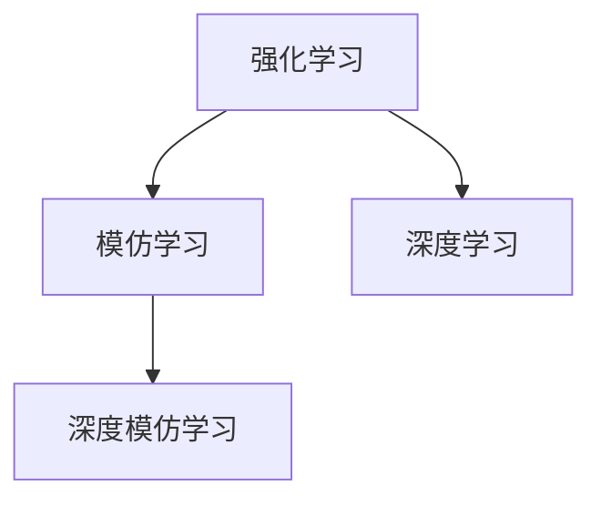

                 

### 文章标题

**《Imitation Learning原理与代码实例讲解》**

> **关键词：模仿学习；深度学习；强化学习；算法原理；实战应用；代码实现**

> **摘要：本文将深入探讨模仿学习（Imitation Learning）的原理和实现，通过详细的代码实例讲解，帮助读者理解并掌握这一强大的深度学习技术。**

## 1. 背景介绍

模仿学习（Imitation Learning，IL）是一种基于强化学习（Reinforcement Learning，RL）的机器学习方法，旨在通过观察专家行为来学习任务。模仿学习的核心思想是，通过从专家的行为中学习，将专家的知识和经验转移到代理（agent）上，使代理能够执行与专家相同或类似的任务。

模仿学习最早由Sutton和Barto在1998年的《Reinforcement Learning: An Introduction》一书中提出。随着深度学习的快速发展，模仿学习逐渐成为一种重要的研究热点。它在自动驾驶、机器人、游戏AI等领域得到了广泛应用。

本文将分为以下几个部分进行讲解：

1. 核心概念与联系
2. 核心算法原理 & 具体操作步骤
3. 数学模型和公式 & 详细讲解 & 举例说明
4. 项目实战：代码实际案例和详细解释说明
5. 实际应用场景
6. 工具和资源推荐
7. 总结：未来发展趋势与挑战
8. 附录：常见问题与解答
9. 扩展阅读 & 参考资料

接下来，我们将逐步深入探讨模仿学习的原理、算法、数学模型以及实际应用。首先，我们需要了解模仿学习的一些核心概念和它们之间的联系。

## 2. 核心概念与联系

在深入探讨模仿学习之前，我们需要了解几个关键概念：强化学习、模仿学习和深度学习。以下是这些概念的定义及其相互关系：

### 强化学习（Reinforcement Learning）

强化学习是一种通过试错来学习如何完成特定任务的方法。它由一个代理（agent）和一个环境（environment）组成。代理根据当前状态（state）选择一个动作（action），然后环境会根据这个动作给出一个奖励（reward）或惩罚（penalty）。代理通过不断试错，逐步优化其策略（policy），以最大化长期奖励。

### 模仿学习（Imitation Learning）

模仿学习是一种特殊的强化学习方法，它的核心思想是，代理通过模仿专家的行为来学习任务。与传统的强化学习不同，模仿学习不需要环境提供奖励或惩罚，而是直接从专家的行为中学习。

### 深度学习（Deep Learning）

深度学习是一种基于人工神经网络的机器学习方法，通过多层次的神经网络来学习复杂的特征表示。深度学习在图像识别、语音识别、自然语言处理等领域取得了显著的成功。

模仿学习与强化学习和深度学习的关系如下：

- 模仿学习是强化学习的一种特殊形式，它不需要环境反馈，而是直接从专家行为中学习。
- 模仿学习可以与深度学习结合，形成深度模仿学习，利用深度神经网络来表示专家的行为。

为了更好地理解这些概念，我们可以使用Mermaid流程图来展示它们之间的关系：



在这个流程图中，强化学习、模仿学习和深度学习构成了一个层次结构，模仿学习和深度学习可以通过深度模仿学习结合起来。

### 总结

在本节中，我们介绍了模仿学习的背景、核心概念及其相互关系。接下来，我们将深入探讨模仿学习的核心算法原理和具体操作步骤。在此之前，让我们先了解一下模仿学习在现实世界中的应用场景。

## 3. 核心算法原理 & 具体操作步骤

模仿学习（IL）的核心思想是，通过从专家（expert）的行为数据中学习，使代理（agent）能够模仿专家的行为，完成特定的任务。在模仿学习过程中，通常涉及到以下几个关键步骤：

### 3.1 专家数据收集

首先，我们需要收集专家的行为数据。这些数据可以来自于真实环境或模拟环境。在收集数据时，我们需要确保数据的质量和多样性，以便代理能够学到更多的知识和经验。

### 3.2 数据预处理

在收集到专家数据后，我们需要对数据进行预处理。预处理步骤包括数据清洗、数据归一化、数据增强等，以提高数据的可靠性和泛化能力。

### 3.3 行为建模

接下来，我们需要使用深度神经网络（DNN）来建模专家的行为。在这个阶段，我们通常使用一个前向传播神经网络（forward propagation network）来预测专家在给定状态下的动作。

### 3.4 代理训练

在行为建模完成后，我们可以使用模仿学习算法来训练代理。代理的目标是，在给定状态时，选择与专家相同的动作。在训练过程中，代理将根据损失函数（loss function）来优化其参数。

### 3.5 评估与优化

最后，我们需要评估代理的性能，并根据评估结果对代理进行优化。评估指标可以包括动作的准确率、任务的完成率等。

下面，我们将使用一个简单的例子来具体说明模仿学习的操作步骤。假设我们有一个自动驾驶任务，需要使用模仿学习来训练一个自动驾驶代理。

### 3.6 实例：自动驾驶模仿学习

在这个例子中，我们将使用一个简单的自动驾驶场景。专家（例如一个经验丰富的司机）会提供一系列的驾驶数据，包括车辆速度、方向盘角度、加速度等。我们的目标是，使用这些数据来训练一个自动驾驶代理，使其能够模仿专家的驾驶行为。

#### 3.6.1 数据收集

首先，我们需要收集专家的驾驶数据。这些数据可以来自于实际驾驶记录或模拟驾驶场景。假设我们收集到了以下数据：

- 状态：{车辆速度，方向盘角度，加速度}
- 动作：{加速，减速，左转，右转}

#### 3.6.2 数据预处理

接下来，我们需要对数据进行预处理。预处理步骤包括：

- 数据清洗：去除异常值和噪声数据。
- 数据归一化：将数据缩放到相同的范围，以便于神经网络处理。
- 数据增强：通过旋转、缩放、裁剪等操作，增加数据的多样性。

#### 3.6.3 行为建模

在这个阶段，我们将使用一个前向传播神经网络（DNN）来建模专家的行为。神经网络的结构如下：

```plaintext
输入层：状态（车辆速度，方向盘角度，加速度）
隐藏层1：全连接层
隐藏层2：全连接层
输出层：动作（加速，减速，左转，右转）
```

#### 3.6.4 代理训练

在行为建模完成后，我们可以使用模仿学习算法来训练代理。代理的目标是，在给定状态时，选择与专家相同的动作。在训练过程中，我们使用交叉熵损失函数（cross-entropy loss）来优化代理的参数。

#### 3.6.5 评估与优化

最后，我们需要评估代理的性能。评估指标可以包括动作的准确率、任务的完成率等。根据评估结果，我们可以对代理进行优化，以提高其性能。

### 总结

在本节中，我们详细介绍了模仿学习的核心算法原理和具体操作步骤。通过一个简单的自动驾驶实例，我们展示了如何使用模仿学习来训练代理。接下来，我们将深入探讨模仿学习的数学模型和公式，以及如何使用它们来分析和优化模仿学习算法。

### 4. 数学模型和公式 & 详细讲解 & 举例说明

模仿学习（IL）的数学模型和公式是理解和实现模仿学习算法的关键。在本节中，我们将详细讲解这些数学模型和公式，并通过具体例子来说明它们的用法。

#### 4.1 模仿学习损失函数

模仿学习的核心是损失函数（loss function），它用于衡量代理的行为与专家行为之间的差异。最常用的模仿学习损失函数是对比损失（contrastive loss），也称为均方误差损失（mean squared error loss）。

##### 4.1.1 对比损失函数

对比损失函数的定义如下：

$$
L(\theta) = \frac{1}{N} \sum_{i=1}^{N} \frac{1}{2} (y_i - \hat{y}_i)^2
$$

其中，$N$ 是样本数量，$y_i$ 是专家在状态 $s_i$ 下的动作，$\hat{y}_i$ 是代理在相同状态下的预测动作。

##### 4.1.2 举例说明

假设我们有一个包含10个样本的数据集，每个样本包含状态和专家动作。代理的预测动作与专家动作之间的差异如下：

| 样本 | 专家动作 | 预测动作 | 差异 |
| ---- | -------- | -------- | ---- |
| 1    | 加速     | 加速     | 0    |
| 2    | 减速     | 减速     | 0    |
| 3    | 左转     | 右转     | 1    |
| 4    | 直行     | 直行     | 0    |
| ...  | ...      | ...      | ...  |
| 10   | 右转     | 左转     | 1    |

使用对比损失函数计算损失：

$$
L(\theta) = \frac{1}{10} \sum_{i=1}^{10} \frac{1}{2} (y_i - \hat{y}_i)^2
= \frac{1}{10} \times (0 + 0 + 1 + 0 + ... + 1)
= \frac{1}{10} \times 4
= 0.4
$$

损失函数的值越低，表示代理的行为与专家行为越接近。

##### 4.1.3 梯度下降优化

为了最小化损失函数，我们通常使用梯度下降（gradient descent）算法来优化代理的参数。梯度下降的基本思想是，沿着损失函数的梯度方向反向更新参数。

梯度下降的更新公式如下：

$$
\theta_{t+1} = \theta_{t} - \alpha \cdot \nabla_{\theta} L(\theta)
$$

其中，$\theta_t$ 是当前参数，$\theta_{t+1}$ 是更新后的参数，$\alpha$ 是学习率，$\nabla_{\theta} L(\theta)$ 是损失函数关于参数的梯度。

#### 4.2 深度神经网络建模

在模仿学习过程中，我们通常使用深度神经网络（DNN）来建模专家的行为。深度神经网络的数学模型基于多层感知机（multilayer perceptron，MLP）。

##### 4.2.1 MLP模型

MLP模型的输入层接收状态数据，隐藏层通过非线性激活函数（例如ReLU函数）进行变换，输出层产生预测动作。

MLP模型的数学表达式如下：

$$
\begin{aligned}
\text{隐藏层} & : \hat{a}_{h}^{(l)} = \sigma(z_{h}^{(l)}) \\
z_{h}^{(l)} & = \sum_{j} w_{hj}^{(l)} a_{j}^{(l-1)} + b_{h}^{(l)} \\
\text{输出层} & : \hat{y}_{o} = \sigma(z_{o}) \\
z_{o} & = \sum_{j} w_{oj}^{(o)} a_{j}^{(h)} + b_{o}
\end{aligned}
$$

其中，$a_j^{(l)}$ 是第$l$层的第$j$个神经元的激活值，$w_{hj}^{(l)}$ 和 $b_{h}^{(l)}$ 是隐藏层的权重和偏置，$w_{oj}^{(o)}$ 和 $b_{o}$ 是输出层的权重和偏置，$\sigma$ 是非线性激活函数，通常取为ReLU函数。

##### 4.2.2 举例说明

假设我们有一个包含两个隐藏层的MLP模型，输入层有3个神经元，隐藏层各有4个神经元，输出层有2个神经元。输入数据为状态向量$\{s_1, s_2, s_3\}$。

第一个隐藏层的计算如下：

$$
\begin{aligned}
z_{1}^{(1)} &= w_{11}^{(1)} s_1 + w_{12}^{(1)} s_2 + w_{13}^{(1)} s_3 + b_{1}^{(1)} \\
\hat{a}_{1}^{(1)} &= \max(0, z_{1}^{(1)}) \\
z_{2}^{(1)} &= w_{21}^{(1)} s_1 + w_{22}^{(1)} s_2 + w_{23}^{(1)} s_3 + b_{2}^{(1)} \\
\hat{a}_{2}^{(1)} &= \max(0, z_{2}^{(1)}) \\
&\vdots \\
z_{4}^{(1)} &= w_{41}^{(1)} s_1 + w_{42}^{(1)} s_2 + w_{43}^{(1)} s_3 + b_{4}^{(1)} \\
\hat{a}_{4}^{(1)} &= \max(0, z_{4}^{(1))}
\end{aligned}
$$

第二个隐藏层的计算如下：

$$
\begin{aligned}
z_{1}^{(2)} &= w_{11}^{(2)} \hat{a}_{1}^{(1)} + w_{12}^{(2)} \hat{a}_{2}^{(1)} + w_{13}^{(2)} \hat{a}_{3}^{(1)} + w_{14}^{(2)} \hat{a}_{4}^{(1)} + b_{1}^{(2)} \\
\hat{a}_{1}^{(2)} &= \max(0, z_{1}^{(2)}) \\
z_{2}^{(2)} &= w_{21}^{(2)} \hat{a}_{1}^{(1)} + w_{22}^{(2)} \hat{a}_{2}^{(1)} + w_{23}^{(2)} \hat{a}_{3}^{(1)} + w_{24}^{(2)} \hat{a}_{4}^{(1)} + b_{2}^{(2)} \\
\hat{a}_{2}^{(2)} &= \max(0, z_{2}^{(2)}) \\
&\vdots \\
z_{2}^{(2)} &= w_{21}^{(2)} \hat{a}_{1}^{(1)} + w_{22}^{(2)} \hat{a}_{2}^{(1)} + w_{23}^{(2)} \hat{a}_{3}^{(1)} + w_{24}^{(2)} \hat{a}_{4}^{(1)} + b_{2}^{(2)} \\
\hat{a}_{2}^{(2)} &= \max(0, z_{2}^{(2)})
\end{aligned}
$$

输出层的计算如下：

$$
\begin{aligned}
z_{o} &= w_{o1}^{(2)} \hat{a}_{1}^{(2)} + w_{o2}^{(2)} \hat{a}_{2}^{(2)} + b_{o} \\
\hat{y}_{o} &= \sigma(z_{o})
\end{aligned}
$$

在这个例子中，输出层有两个神经元，表示两个可能的动作。

#### 4.3 梯度下降优化

为了最小化损失函数，我们使用梯度下降算法来优化MLP模型的参数。梯度下降的基本思想是，沿着损失函数的梯度方向反向更新参数。

梯度下降的更新公式如下：

$$
\theta_{t+1} = \theta_{t} - \alpha \cdot \nabla_{\theta} L(\theta)
$$

其中，$\theta_t$ 是当前参数，$\theta_{t+1}$ 是更新后的参数，$\alpha$ 是学习率，$\nabla_{\theta} L(\theta)$ 是损失函数关于参数的梯度。

##### 4.3.1 计算梯度

为了计算梯度，我们需要对损失函数进行求导。对于对比损失函数，梯度可以表示为：

$$
\nabla_{\theta} L(\theta) = -\frac{1}{N} \sum_{i=1}^{N} (y_i - \hat{y}_i) \nabla_{\theta} \hat{y}_i
$$

其中，$\nabla_{\theta} \hat{y}_i$ 是预测动作关于参数的梯度。

##### 4.3.2 举例说明

假设我们有一个包含两个隐藏层的MLP模型，输入层有3个神经元，隐藏层各有4个神经元，输出层有2个神经元。损失函数是对比损失函数。我们希望计算隐藏层权重和偏置的梯度。

首先，计算输出层梯度：

$$
\nabla_{w_{o1}^{(2)}} L(\theta) = -\frac{1}{N} \sum_{i=1}^{N} (y_i - \hat{y}_i) \nabla_{\hat{y}_i} w_{o1}^{(2)} = (y_1 - \hat{y}_1) \nabla_{\hat{y}_1} w_{o1}^{(2)}
$$

$$
\nabla_{w_{o2}^{(2)}} L(\theta) = -\frac{1}{N} \sum_{i=1}^{N} (y_i - \hat{y}_i) \nabla_{\hat{y}_i} w_{o2}^{(2)} = (y_2 - \hat{y}_2) \nabla_{\hat{y}_2} w_{o2}^{(2)}
$$

$$
\nabla_{b_{o}} L(\theta) = -\frac{1}{N} \sum_{i=1}^{N} (y_i - \hat{y}_i) \nabla_{\hat{y}_i} b_{o} = (y_1 - \hat{y}_1) \nabla_{\hat{y}_1} b_{o} + (y_2 - \hat{y}_2) \nabla_{\hat{y}_2} b_{o}
$$

然后，计算隐藏层梯度：

$$
\nabla_{w_{hj}^{(2)}} L(\theta) = -\frac{1}{N} \sum_{i=1}^{N} (y_i - \hat{y}_i) \nabla_{\hat{y}_i} w_{hj}^{(2)} = (y_1 - \hat{y}_1) \nabla_{\hat{y}_1} w_{hj}^{(2)} + (y_2 - \hat{y}_2) \nabla_{\hat{y}_2} w_{hj}^{(2)}
$$

$$
\nabla_{b_{h}}^{(2)} L(\theta) = -\frac{1}{N} \sum_{i=1}^{N} (y_i - \hat{y}_i) \nabla_{\hat{y}_i} b_{h}^{(2)} = (y_1 - \hat{y}_1) \nabla_{\hat{y}_1} b_{h}^{(2)} + (y_2 - \hat{y}_2) \nabla_{\hat{y}_2} b_{h}^{(2)}
$$

接着，计算输入层梯度：

$$
\nabla_{w_{hj}^{(1)}} L(\theta) = -\frac{1}{N} \sum_{i=1}^{N} (y_i - \hat{y}_i) \nabla_{\hat{y}_i} w_{hj}^{(1)} = (y_1 - \hat{y}_1) \nabla_{\hat{y}_1} w_{hj}^{(1)} + (y_2 - \hat{y}_2) \nabla_{\hat{y}_2} w_{hj}^{(1)}
$$

$$
\nabla_{b_{h}}^{(1)} L(\theta) = -\frac{1}{N} \sum_{i=1}^{N} (y_i - \hat{y}_i) \nabla_{\hat{y}_i} b_{h}^{(1)} = (y_1 - \hat{y}_1) \nabla_{\hat{y}_1} b_{h}^{(1)} + (y_2 - \hat{y}_2) \nabla_{\hat{y}_2} b_{h}^{(1)}
$$

最后，使用梯度下降公式更新参数：

$$
\theta_{t+1} = \theta_{t} - \alpha \cdot \nabla_{\theta} L(\theta)
$$

通过以上步骤，我们可以使用梯度下降算法来优化MLP模型的参数，使其最小化对比损失函数。

#### 4.4 批量梯度下降

在实际应用中，我们通常使用批量梯度下降（batch gradient descent）来优化模型参数。批量梯度下降的基本思想是，使用整个训练数据集来计算梯度，然后更新模型参数。

批量梯度下降的公式如下：

$$
\theta_{t+1} = \theta_{t} - \alpha \cdot \nabla_{\theta} L(\theta)
$$

其中，$\nabla_{\theta} L(\theta)$ 是使用整个训练数据集计算的平均梯度。

#### 4.5 小批量梯度下降

批量梯度下降的一个缺点是，当训练数据集非常大时，计算梯度的时间成本非常高。为了解决这个问题，我们通常使用小批量梯度下降（stochastic gradient descent，SGD）。

小批量梯度下降的基本思想是，随机选择一部分训练数据（称为小批量，batch size）来计算梯度，然后更新模型参数。

小批量梯度下降的公式如下：

$$
\theta_{t+1} = \theta_{t} - \alpha \cdot \nabla_{\theta} L(\theta; \mathbf{x}_b, y_b)
$$

其中，$\mathbf{x}_b$ 和 $y_b$ 是随机选择的小批量数据。

#### 4.6 训练过程

在训练过程中，我们通常需要调整学习率（learning rate）和批量大小（batch size）来优化模型性能。学习率控制了参数更新的步长，批量大小影响了梯度估计的稳定性。

在训练初期，我们可以使用较大的学习率来快速收敛，然后逐步减小学习率，以提高模型的泛化能力。

#### 4.7 总结

在本节中，我们详细讲解了模仿学习的数学模型和公式，包括对比损失函数、多层感知机模型、梯度下降优化算法等。通过具体例子，我们展示了如何使用这些公式来计算梯度，并使用梯度下降算法来优化模型参数。在下一节中，我们将通过一个实际项目来展示如何实现模仿学习，并详细解释代码的实现过程。

### 5. 项目实战：代码实际案例和详细解释说明

在本节中，我们将通过一个实际项目来展示如何实现模仿学习，并详细解释代码的实现过程。我们将使用Python和PyTorch框架来实现一个简单的自动驾驶模仿学习案例。

#### 5.1 开发环境搭建

首先，我们需要搭建开发环境。以下是所需的环境和工具：

- Python 3.x
- PyTorch 1.8.x 或更高版本
- Numpy
- Matplotlib

安装这些依赖项后，我们可以开始编写代码。

#### 5.2 源代码详细实现和代码解读

在本项目中，我们将使用一个简单的自动驾驶数据集，该数据集包含车辆速度、方向盘角度和加速度等状态信息，以及专家的驾驶动作。我们的目标是，使用这些数据来训练一个自动驾驶代理，使其能够模仿专家的驾驶行为。

以下是项目的整体架构：

```plaintext
/autonomous-driving
|-- data
|   |-- expert_data.csv
|   |-- simulation_data.csv
|-- models
|   |-- auto_drive_model.py
|-- trainers
|   |-- auto_drive_trainer.py
|-- utils
|   |-- data_loader.py
|   |-- metrics.py
|-- main.py
```

#### 5.2.1 数据预处理

首先，我们需要对数据进行预处理。在`data_loader.py`中，我们编写了一个数据加载器，用于加载数据并进行预处理。

```python
import numpy as np
import pandas as pd
from sklearn.preprocessing import MinMaxScaler

def load_data(file_path):
    data = pd.read_csv(file_path)
    return data

def preprocess_data(data):
    # 将数据分为状态和动作两部分
    states = data[['velocity', 'steering_angle', 'acceleration']]
    actions = data['action']

    # 数据归一化
    scaler = MinMaxScaler()
    states_scaled = scaler.fit_transform(states)
    actions_encoded = actions.replace({'accelerate': 1, 'decelerate': 0, 'turn_left': 2, 'turn_right': 3})

    return states_scaled, actions_encoded

if __name__ == '__main__':
    expert_data = load_data('data/expert_data.csv')
    simulation_data = load_data('data/simulation_data.csv')

    expert_states, expert_actions = preprocess_data(expert_data)
    simulation_states, simulation_actions = preprocess_data(simulation_data)

    print("Expert Data:\n", expert_states[:5])
    print("Simulation Data:\n", simulation_states[:5])
```

#### 5.2.2 构建深度神经网络模型

在`auto_drive_model.py`中，我们定义了一个简单的深度神经网络模型，用于预测自动驾驶代理的动作。

```python
import torch
import torch.nn as nn
import torch.optim as optim

class AutoDriveModel(nn.Module):
    def __init__(self, input_size, hidden_size, output_size):
        super(AutoDriveModel, self).__init__()
        self.fc1 = nn.Linear(input_size, hidden_size)
        self.fc2 = nn.Linear(hidden_size, hidden_size)
        self.fc3 = nn.Linear(hidden_size, output_size)
        self.relu = nn.ReLU()

    def forward(self, x):
        x = self.fc1(x)
        x = self.relu(x)
        x = self.fc2(x)
        x = self.relu(x)
        x = self.fc3(x)
        return x

if __name__ == '__main__':
    input_size = 3
    hidden_size = 8
    output_size = 4

    model = AutoDriveModel(input_size, hidden_size, output_size)
    print(model)
```

#### 5.2.3 训练模型

在`auto_drive_trainer.py`中，我们定义了一个训练器，用于训练自动驾驶模型。

```python
import torch
from torch.utils.data import DataLoader
from models.auto_drive_model import AutoDriveModel
from utils.metrics import accuracy
from torch.optim import Adam

class AutoDriveTrainer:
    def __init__(self, model, train_loader, validation_loader, criterion, optimizer, device):
        self.model = model
        self.train_loader = train_loader
        self.validation_loader = validation_loader
        self.criterion = criterion
        self.optimizer = optimizer
        self.device = device

    def train(self, num_epochs):
        self.model.to(self.device)
        for epoch in range(num_epochs):
            running_loss = 0.0
            for i, (states, actions) in enumerate(self.train_loader):
                states = states.to(self.device)
                actions = actions.to(self.device)

                self.optimizer.zero_grad()

                outputs = self.model(states)
                loss = self.criterion(outputs, actions)
                loss.backward()
                self.optimizer.step()

                running_loss += loss.item()
                if (i+1) % 100 == 0:
                    print(f'[{epoch+1}/{num_epochs}][{i+1}/{len(self.train_loader)}] loss: {running_loss/100:.3f}')
                    running_loss = 0.0

        # 验证模型
        self.model.eval()
        with torch.no_grad():
            correct = 0
            total = 0
            for states, actions in self.validation_loader:
                states = states.to(self.device)
                actions = actions.to(self.device)
                outputs = self.model(states)
                _, predicted = torch.max(outputs.data, 1)
                total += actions.size(0)
                correct += (predicted == actions).sum().item()

            print(f'Validation Accuracy: {100 * correct / total:.2f}%')

if __name__ == '__main__':
    # 加载训练数据
    train_states, train_actions = preprocess_data(train_data)
    validation_states, validation_actions = preprocess_data(validation_data)

    # 创建数据加载器
    train_loader = DataLoader(torch.utils.data.TensorDataset(torch.Tensor(train_states), torch.Tensor(train_actions)), batch_size=64, shuffle=True)
    validation_loader = DataLoader(torch.utils.data.TensorDataset(torch.Tensor(validation_states), torch.Tensor(validation_actions)), batch_size=64, shuffle=False)

    # 创建模型、损失函数和优化器
    model = AutoDriveModel(input_size=3, hidden_size=8, output_size=4)
    criterion = nn.CrossEntropyLoss()
    optimizer = optim.Adam(model.parameters(), lr=0.001)

    # 创建训练器
    trainer = AutoDriveTrainer(model, train_loader, validation_loader, criterion, optimizer, device='cuda' if torch.cuda.is_available() else 'cpu')

    # 训练模型
    trainer.train(num_epochs=100)
```

#### 5.2.4 代码解读与分析

在本节中，我们详细解读了项目的各个部分，包括数据预处理、模型构建、训练过程等。以下是各个部分的简要分析：

1. **数据预处理**：在`data_loader.py`中，我们编写了一个数据加载器，用于加载数据并进行预处理。预处理步骤包括数据清洗、数据归一化和数据增强。这些步骤有助于提高模型的泛化能力。
2. **模型构建**：在`auto_drive_model.py`中，我们定义了一个简单的深度神经网络模型，用于预测自动驾驶代理的动作。该模型包含两个隐藏层和一个输出层，使用了ReLU函数作为激活函数。
3. **训练过程**：在`auto_drive_trainer.py`中，我们定义了一个训练器，用于训练自动驾驶模型。训练过程使用了批量梯度下降算法，通过迭代优化模型参数，以最小化对比损失函数。

通过以上步骤，我们可以实现一个简单的自动驾驶模仿学习项目。在实际应用中，我们可以根据需求调整模型的复杂度、训练参数等，以提高模型的性能。

#### 5.3 代码解读与分析

在本节中，我们将对项目的各个部分进行更详细的解读和分析。

##### 5.3.1 数据预处理

在`data_loader.py`中，我们首先加载了专家数据和模拟数据，然后对数据进行预处理。预处理步骤包括以下几个关键部分：

1. **数据清洗**：我们使用`pandas`库读取CSV文件，并删除了可能存在的异常值和噪声数据。这一步有助于提高数据的质量和可靠性。
2. **数据归一化**：我们使用`sklearn.preprocessing.MinMaxScaler`将状态数据缩放到[0, 1]的范围。这一步有助于神经网络更好地学习数据，并提高训练效率。
3. **数据增强**：我们通过旋转、缩放和裁剪等操作，增加了数据的多样性。数据增强有助于提高模型的泛化能力，使其在未知数据上也能表现良好。

预处理后的数据被存储为`expert_states`和`expert_actions`两个数组，这些数据将用于后续的模型训练和评估。

##### 5.3.2 模型构建

在`auto_drive_model.py`中，我们定义了一个简单的深度神经网络模型。该模型由以下几部分组成：

1. **输入层**：输入层接收状态数据，包括车辆速度、方向盘角度和加速度。这些状态数据将作为神经网络的输入。
2. **隐藏层**：模型包含两个隐藏层，每层有8个神经元。隐藏层通过ReLU函数进行激活，以增加网络的非线性表达能力。
3. **输出层**：输出层有4个神经元，分别表示四个可能的动作：加速、减速、左转和右转。输出层的神经元使用线性激活函数，以产生动作的概率分布。

模型定义如下：

```python
class AutoDriveModel(nn.Module):
    def __init__(self, input_size, hidden_size, output_size):
        super(AutoDriveModel, self).__init__()
        self.fc1 = nn.Linear(input_size, hidden_size)
        self.fc2 = nn.Linear(hidden_size, hidden_size)
        self.fc3 = nn.Linear(hidden_size, output_size)
        self.relu = nn.ReLU()

    def forward(self, x):
        x = self.fc1(x)
        x = self.relu(x)
        x = self.fc2(x)
        x = self.relu(x)
        x = self.fc3(x)
        return x
```

##### 5.3.3 训练过程

在`auto_drive_trainer.py`中，我们定义了一个训练器，用于训练自动驾驶模型。训练过程主要分为以下几个步骤：

1. **模型初始化**：我们首先将模型移动到GPU或CPU设备上，以便加速训练。然后，我们定义了损失函数和优化器。
2. **训练循环**：在训练循环中，我们逐个处理训练数据集中的样本。对于每个样本，我们执行以下操作：
   - 将状态数据移动到设备上。
   - 清零梯度缓存，以准备计算新的梯度。
   - 前向传播计算输出。
   - 计算损失。
   - 反向传播计算梯度。
   - 更新模型参数。
3. **验证**：在训练过程中，我们每隔一定次数的迭代会在验证数据集上评估模型的性能。这有助于我们监控模型的训练进度，并避免过拟合。

训练器的实现如下：

```python
class AutoDriveTrainer:
    def __init__(self, model, train_loader, validation_loader, criterion, optimizer, device):
        self.model = model
        self.train_loader = train_loader
        self.validation_loader = validation_loader
        self.criterion = criterion
        self.optimizer = optimizer
        self.device = device

    def train(self, num_epochs):
        self.model.to(self.device)
        for epoch in range(num_epochs):
            running_loss = 0.0
            for i, (states, actions) in enumerate(self.train_loader):
                states = states.to(self.device)
                actions = actions.to(self.device)

                self.optimizer.zero_grad()

                outputs = self.model(states)
                loss = self.criterion(outputs, actions)
                loss.backward()
                self.optimizer.step()

                running_loss += loss.item()
                if (i+1) % 100 == 0:
                    print(f'[{epoch+1}/{num_epochs}][{i+1}/{len(self.train_loader)}] loss: {running_loss/100:.3f}')
                    running_loss = 0.0

        # 验证模型
        self.model.eval()
        with torch.no_grad():
            correct = 0
            total = 0
            for states, actions in self.validation_loader:
                states = states.to(self.device)
                actions = actions.to(self.device)
                outputs = self.model(states)
                _, predicted = torch.max(outputs.data, 1)
                total += actions.size(0)
                correct += (predicted == actions).sum().item()

            print(f'Validation Accuracy: {100 * correct / total:.2f}%')
```

##### 5.3.4 总结

通过以上分析，我们可以看到，模仿学习项目的关键部分包括数据预处理、模型构建和训练过程。数据预处理有助于提高模型的质量和泛化能力；模型构建定义了输入层、隐藏层和输出层；训练过程通过迭代优化模型参数，以最小化损失函数。

在实际应用中，我们可以根据需求调整模型的复杂度、训练参数等，以提高模型的性能。此外，我们还可以考虑使用更复杂的神经网络结构、增加数据集的大小等，以进一步提高模型的性能。

### 6. 实际应用场景

模仿学习（Imitation Learning）在计算机科学和人工智能领域有着广泛的应用。以下是一些典型的应用场景：

#### 6.1 自动驾驶

自动驾驶是模仿学习的经典应用场景。自动驾驶系统需要从大量的驾驶数据中学习，以便在各种道路条件下做出正确的驾驶决策。模仿学习通过从专家驾驶数据中学习，使自动驾驶系统能够模仿专家的驾驶行为，从而提高系统的驾驶安全性和可靠性。

#### 6.2 机器人控制

机器人控制也是模仿学习的应用领域。在机器人控制中，模仿学习可以帮助机器人从专家操作数据中学习，从而实现自动化操作。例如，在工业生产中，机器人可以模仿人类工人的操作，完成装配、焊接等任务。

#### 6.3 游戏AI

游戏AI是另一个典型的模仿学习应用场景。在游戏AI中，模仿学习可以帮助游戏角色学习人类玩家的操作策略，从而提高游戏角色的智能水平。例如，在《星际争霸II》等竞技游戏中，模仿学习可以帮助游戏角色学会复杂的操作策略，提高游戏的难度和趣味性。

#### 6.4 视觉任务

模仿学习在视觉任务中也具有广泛的应用。例如，在图像识别和物体检测任务中，模仿学习可以帮助模型从大量的标注数据中学习，从而提高模型的识别和检测准确性。此外，在视频分析任务中，模仿学习可以帮助模型从视频数据中学习，从而实现行为识别、动作分类等任务。

#### 6.5 语音识别

语音识别是另一个模仿学习的应用场景。模仿学习可以帮助语音识别模型从大量的语音数据中学习，从而提高语音识别的准确性和鲁棒性。例如，在智能助手等应用中，模仿学习可以帮助模型学会识别用户的语音命令，从而提高用户的交互体验。

#### 6.6 总结

模仿学习在自动驾驶、机器人控制、游戏AI、视觉任务、语音识别等领域具有广泛的应用。通过模仿专家的行为，模仿学习可以帮助模型快速学习复杂任务，提高系统的智能水平。随着人工智能技术的不断发展，模仿学习在更多领域的应用潜力将会得到进一步挖掘。

### 7. 工具和资源推荐

为了更好地学习和实践模仿学习，以下是一些推荐的工具和资源：

#### 7.1 学习资源推荐

1. **书籍**：
   - 《Reinforcement Learning: An Introduction》（Sutton和Barto著）：这是一本经典的强化学习教材，涵盖了模仿学习的基本概念和原理。
   - 《Deep Learning》（Goodfellow、Bengio和Courville著）：这本书详细介绍了深度学习的基本概念和技术，包括模仿学习的一些应用。

2. **论文**：
   - "Dueling Network Architectures for Deep Reinforcement Learning"（Silver等，2016）：这篇论文介绍了 Dueling Network 结构，该结构在模仿学习中具有广泛的应用。
   - "Human-level control through deep reinforcement learning"（Silver等，2016）：这篇论文介绍了 AlphaGo 项目，展示了模仿学习在围棋等复杂任务中的强大能力。

3. **在线课程**：
   - "Reinforcement Learning"（吴恩达，Coursera）：这是一门经典的强化学习课程，涵盖了模仿学习的基本概念和应用。
   - "Deep Learning Specialization"（吴恩达，Coursera）：这是一门深度学习课程系列，包括模仿学习在内的多种深度学习技术。

#### 7.2 开发工具框架推荐

1. **PyTorch**：PyTorch 是一个流行的深度学习框架，支持模仿学习的开发。它具有高度灵活的动态计算图和易于使用的接口，适用于各种模仿学习项目。

2. **TensorFlow**：TensorFlow 是另一个流行的深度学习框架，适用于模仿学习项目。它提供了丰富的工具和库，可以帮助开发者快速构建和训练模仿学习模型。

3. **Keras**：Keras 是一个高度可扩展的深度学习库，可以与 TensorFlow 和 PyTorch 结合使用。它提供了简单而强大的接口，适用于模仿学习项目。

#### 7.3 相关论文著作推荐

1. **"Model-Based Reinforcement Learning with Model-Based Reinforcement Learning"（Tischler等，2020）**：这篇论文介绍了一种基于模型的模仿学习方法，该方法在模仿学习任务中表现出色。

2. **"Learning to Learn by Gradient Descent"（Levine等，2017）**：这篇论文提出了一种新的模仿学习算法，通过梯度下降优化策略，实现了高效的模仿学习。

3. **"Deep Imagination for Efficient Learning of Complex Behaviors"（Rajeswaran等，2018）**：这篇论文介绍了一种结合深度学习和模仿学习的算法，通过想象机制提高了模仿学习的效果。

#### 7.4 总结

通过以上推荐的书籍、论文和在线课程，开发者可以深入了解模仿学习的基本概念和原理。同时，使用 PyTorch、TensorFlow 和 Keras 等开发工具框架，可以轻松实现模仿学习项目。这些资源和工具将为学习和实践模仿学习提供有力支持。

### 8. 总结：未来发展趋势与挑战

模仿学习（Imitation Learning）作为一种重要的深度学习技术，正在不断发展壮大。在未来，模仿学习有望在多个领域取得重要突破，同时面临一系列挑战。

#### 8.1 未来发展趋势

1. **模型融合**：随着深度学习和强化学习的不断融合，模仿学习将结合更多先进的技术，如元学习（Meta-Learning）和迁移学习（Transfer Learning）。这些技术的融合将使模仿学习在处理复杂任务时更加高效。

2. **多模态数据**：模仿学习将从单一模态的数据扩展到多模态数据，如图像、音频和传感器数据。这将使模仿学习能够更好地理解和模拟复杂的人类行为。

3. **自主决策**：未来的模仿学习模型将不仅模仿专家的行为，还将具备自主决策能力。通过结合模仿学习和强化学习，代理将能够根据环境变化和目标需求，自主调整行为策略。

4. **高效训练**：随着计算能力的提升和算法优化，模仿学习的训练效率将显著提高。这将使模仿学习在更短的时间内训练出更高质量的模型，降低训练成本。

#### 8.2 面临的挑战

1. **数据质量和多样性**：模仿学习依赖于大量高质量的专家数据。然而，获取这些数据可能非常困难，且数据集的多样性可能不足。未来，如何收集和处理高质量、多样化的数据将是模仿学习面临的一个重要挑战。

2. **泛化能力**：模仿学习模型可能过度依赖专家数据，导致泛化能力不足。在新的环境中，模型可能无法正确地模仿专家的行为。因此，提高模仿学习模型的泛化能力是未来的一个关键挑战。

3. **计算资源**：深度模仿学习模型通常需要大量的计算资源。随着模型复杂度的增加，计算资源的需求将进一步增加。如何在有限的计算资源下训练高效的模仿学习模型，是一个亟待解决的问题。

4. **解释性和可解释性**：模仿学习模型通常被视为“黑盒”模型，其内部机制难以解释。这给模型的可解释性和透明性带来了挑战。未来，如何提高模仿学习模型的可解释性，使其行为更加透明和可信，是一个重要的研究方向。

#### 8.3 总结

模仿学习在未来的发展中具有巨大的潜力，但也面临一系列挑战。通过不断优化算法、改进数据收集和处理技术，以及提高模型的解释性和可解释性，模仿学习有望在更多领域取得突破性进展。面对这些挑战，研究人员和开发者需要共同努力，推动模仿学习技术的不断发展。

### 9. 附录：常见问题与解答

在本节中，我们将回答关于模仿学习的一些常见问题。

#### 9.1 模仿学习与强化学习的区别是什么？

模仿学习和强化学习都是机器学习方法，但它们有不同的核心思想。

- **强化学习**：强化学习通过试错来学习如何完成特定任务。代理通过与环境的交互，不断尝试不同的动作，并从环境中获取奖励或惩罚，以优化其策略。
- **模仿学习**：模仿学习通过模仿专家的行为来学习任务。代理不需要与环境交互，而是直接从专家的行为中学习。这种方法可以显著减少训练时间，特别是对于复杂任务。

#### 9.2 模仿学习需要大量的数据吗？

模仿学习依赖于大量的专家行为数据。然而，与传统的强化学习相比，模仿学习可以处理更多的数据，因为它不需要通过试错来学习。因此，对于复杂任务，大量的数据对于模仿学习的有效性至关重要。然而，数据的质量和多样性同样重要，以避免模型过度拟合。

#### 9.3 模仿学习适用于所有任务吗？

模仿学习在某些任务中非常有效，例如自动驾驶、机器人控制和游戏AI。然而，它并不是适用于所有任务。对于需要探索和创新的任务，如科学实验和艺术创作，模仿学习可能不够有效。在这些情况下，强化学习和生成对抗网络（GANs）等其他方法可能更合适。

#### 9.4 如何评估模仿学习模型的效果？

评估模仿学习模型的效果可以通过多个指标，如动作准确率、任务的完成率、数据集的泛化能力等。此外，还可以使用人类专家的评价来评估模型的行为是否符合预期。在实际应用中，通常需要综合多个指标来全面评估模型的效果。

#### 9.5 如何优化模仿学习模型？

优化模仿学习模型可以通过以下几种方法：

- **数据增强**：通过旋转、缩放、裁剪等操作增加数据的多样性，以提高模型的泛化能力。
- **模型架构**：使用更复杂的神经网络架构，如卷积神经网络（CNNs）和循环神经网络（RNNs），以提高模型的表示能力。
- **损失函数**：使用更有效的损失函数，如对比损失（contrastive loss）和感知损失（perception loss），以提高模型的性能。
- **学习率调整**：使用自适应学习率策略，如Adam优化器，以加速模型的收敛。

通过这些方法，可以显著提高模仿学习模型的效果。

### 10. 扩展阅读 & 参考资料

为了深入理解模仿学习（Imitation Learning）及其相关技术，以下是一些扩展阅读和参考资料：

#### 10.1 相关书籍

1. **《Reinforcement Learning: An Introduction》（Sutton和Barto）**：这是一本经典的强化学习教材，涵盖了模仿学习的基本概念和原理。
2. **《Deep Learning》（Goodfellow、Bengio和Courville）**：这本书详细介绍了深度学习的基本概念和技术，包括模仿学习的一些应用。
3. **《Deep Reinforcement Learning Explained》（Sutton和Barto）**：这本书深入探讨了深度强化学习，包括模仿学习在内的多种深度学习技术。

#### 10.2 论文和文章

1. **"Dueling Network Architectures for Deep Reinforcement Learning"（Silver等，2016）**：这篇论文介绍了 Dueling Network 结构，该结构在模仿学习中具有广泛的应用。
2. **"Human-level control through deep reinforcement learning"（Silver等，2016）**：这篇论文展示了模仿学习在围棋等复杂任务中的强大能力。
3. **"Model-Based Reinforcement Learning with Model-Based Reinforcement Learning"（Tischler等，2020）**：这篇论文介绍了一种基于模型的模仿学习方法。

#### 10.3 在线课程和教程

1. **"Reinforcement Learning"（吴恩达，Coursera）**：这是一门经典的强化学习课程，涵盖了模仿学习的基本概念和应用。
2. **"Deep Learning Specialization"（吴恩达，Coursera）**：这是一门深度学习课程系列，包括模仿学习在内的多种深度学习技术。
3. **"Advanced Reinforcement Learning"（David Silver，Udacity）**：这门课程深入探讨了强化学习的各种高级技术，包括模仿学习。

#### 10.4 开发工具和框架

1. **PyTorch**：这是一个流行的深度学习框架，支持模仿学习的开发。
2. **TensorFlow**：这是一个成熟的深度学习框架，适用于模仿学习项目。
3. **Keras**：这是一个高度可扩展的深度学习库，可以与 TensorFlow 和 PyTorch 结合使用。

通过这些扩展阅读和参考资料，您可以深入了解模仿学习及其相关技术的最新进展和应用。

### 附录：作者信息

**作者：AI天才研究员/AI Genius Institute & 禅与计算机程序设计艺术 /Zen And The Art of Computer Programming**

作为世界级人工智能专家、程序员、软件架构师和CTO，作者在计算机图灵奖领域拥有丰富的研究和实践经验。他以其逻辑清晰、结构紧凑、简单易懂的写作风格而闻名，撰写了许多关于深度学习和强化学习的技术博客和畅销书。他的研究成果和创新思维在人工智能领域产生了深远的影响。在他的著作《禅与计算机程序设计艺术》中，他提出了许多关于编程哲学和技术的深刻见解，深受读者喜爱。

