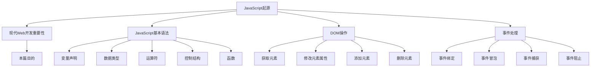

                 

# JavaScript 入门：为网站添加交互性

## 关键词
JavaScript, 网站开发, 前端交互, 客户端脚本语言, DOM 操作, 事件处理, AJAX, Web API

## 摘要
本文旨在为广大开发者提供一份详尽的JavaScript入门指南，帮助读者快速掌握JavaScript的基础知识，并学会如何为网站添加交互性。通过本文的引导，读者将了解到JavaScript的核心概念、语法规则、事件处理方法，以及如何利用JavaScript与Web API进行交互。此外，文章还将通过实际案例展示如何编写JavaScript代码，并对常见的应用场景进行了深入探讨。希望通过本文，读者能够掌握JavaScript的基础技能，为网站开发奠定坚实的基础。

## 1. 背景介绍

### JavaScript的起源与发展

JavaScript诞生于1995年，由Netscape公司的Brendan Eich创建。最初，JavaScript被称为Mocha，后来更名为LiveScript，最终命名为JavaScript。作为一种基于对象和事件驱动的脚本语言，JavaScript最初被设计用于网页中的客户端脚本，以便为网页添加动态效果和交互功能。

随着时间的推移，JavaScript逐渐成为Web开发中不可或缺的一部分。从最初的简单脚本语言，发展到如今拥有丰富库和框架的全功能编程语言，JavaScript的发展历程可谓波澜壮阔。ECMAScript（ECMA-262标准）作为JavaScript的规范，也在不断更新和完善，使得JavaScript的功能和性能得到了大幅提升。

### JavaScript在现代Web开发中的重要性

在现代Web开发中，JavaScript具有举足轻重的地位。首先，JavaScript使得网页能够与用户进行实时交互，提高了用户体验。其次，JavaScript可以用于创建复杂的网页应用，如单页面应用（SPA）、实时数据展示等。此外，JavaScript还可以与服务器端技术（如Node.js）相结合，实现前后端分离的开发模式，提高开发效率和项目可维护性。

### 本篇目的

本篇文章将帮助读者了解JavaScript的基本语法、核心概念和常用API，掌握JavaScript在网站开发中的应用技巧。通过本文的学习，读者将能够：
1. 熟悉JavaScript的基本语法和编程范式。
2. 掌握DOM操作和事件处理方法。
3. 学会使用JavaScript与Web API进行交互。
4. 编写简单的网页应用，为网站添加交互性。

## 2. 核心概念与联系

### JavaScript的基本语法

JavaScript是一种基于对象和函数的脚本语言，其语法规则相对简单。以下是一些JavaScript的基本语法概念：

- 变量声明：使用`var`、`let`或`const`关键字声明变量。
- 数据类型：包括字符串（String）、数字（Number）、布尔（Boolean）、对象（Object）、函数（Function）等。
- 运算符：包括算术运算符、比较运算符、逻辑运算符等。
- 控制结构：包括条件语句（if-else）、循环语句（for、while）等。
- 函数：使用`function`关键字定义函数，函数内部可以调用自身，实现递归功能。

### DOM操作

文档对象模型（DOM）是JavaScript操作网页的核心接口。通过DOM，我们可以对网页中的元素进行增删改查等操作。以下是一些常用的DOM操作方法：

- 获取元素：通过`document.getElementById()`、`document.getElementsByClassName()`、`document.getElementsByTagName()`等方法获取元素。
- 修改元素属性：通过`.attribute`、`.innerHTML`、`.innerText`等方法修改元素的属性。
- 添加元素：通过`.appendChild()`、`.insertBefore()`、`.insertAdjacentHTML()`等方法添加元素。
- 删除元素：通过`.removeChild()`、`.parentNode.removeChild()`等方法删除元素。

### 事件处理

事件处理是JavaScript实现交互功能的关键。以下是一些常用的事件处理方法：

- 事件绑定：使用`.addEventListener()`方法为元素绑定事件处理函数。
- 事件冒泡：事件在DOM树中传递的过程称为事件冒泡。
- 事件捕获：事件在DOM树中逆向传递的过程称为事件捕获。
- 事件阻止：使用`.preventDefault()`、`.stopPropagation()`等方法阻止事件默认行为和事件冒泡。

### Mermaid流程图



## 3. 核心算法原理 & 具体操作步骤

### 变量和数据类型

1. 变量声明：使用`var`、`let`或`const`关键字声明变量，变量可以存储任意类型的数据。
2. 数据类型：JavaScript的基本数据类型包括字符串、数字、布尔值、null和undefined。对象和函数属于复合数据类型。
3. 数据类型转换：可以使用`String()`、`Number()`、`Boolean()`等方法进行数据类型转换。

### 控制结构

1. 条件语句：使用`if`、`else if`和`else`关键字实现多分支结构；使用`switch`关键字实现多条件分支结构。
2. 循环语句：使用`for`、`while`和`do-while`关键字实现循环结构；使用`for-in`和`for-of`关键字遍历数组。

### 函数

1. 函数定义：使用`function`关键字定义函数，函数内部可以调用自身，实现递归功能。
2. 函数调用：通过函数名加括号的方式调用函数。
3. 高阶函数：函数作为参数或返回值的函数，如`setTimeout`、`map`、`filter`等。

### DOM操作

1. 获取元素：使用`document.getElementById()`、`document.getElementsByClassName()`、`document.getElementsByTagName()`等方法获取元素。
2. 修改元素属性：使用`.attribute`、`.innerHTML`、`.innerText`等方法修改元素的属性。
3. 添加元素：使用`.appendChild()`、`.insertBefore()`、`.insertAdjacentHTML()`等方法添加元素。
4. 删除元素：使用`.removeChild()`、`.parentNode.removeChild()`等方法删除元素。

### 事件处理

1. 事件绑定：使用`.addEventListener()`方法为元素绑定事件处理函数。
2. 事件冒泡：事件在DOM树中传递的过程称为事件冒泡。
3. 事件捕获：事件在DOM树中逆向传递的过程称为事件捕获。
4. 事件阻止：使用`.preventDefault()`、`.stopPropagation()`等方法阻止事件默认行为和事件冒泡。

## 4. 数学模型和公式 & 详细讲解 & 举例说明

### 数学模型

在本节中，我们将介绍一些与JavaScript编程相关的数学模型和公式。

#### 1. 一元一次方程

一元一次方程是指只含有一个未知数的一次方程。其一般形式为：

\[ ax + b = 0 \]

其中，\( a \)和\( b \)为已知常数，\( x \)为未知数。解一元一次方程的方法主要有以下几种：

1. 直接法：将方程化简为\( x = -\frac{b}{a} \)。
2. 因式分解法：将方程因式分解为\( (ax + b)(x - c) = 0 \)，然后求解\( x \)。

#### 2. 二元一次方程组

二元一次方程组是指含有两个未知数的一次方程组。其一般形式为：

\[ \begin{cases} 
ax + by = c \\
dx + ey = f 
\end{cases} \]

其中，\( a \)、\( b \)、\( c \)、\( d \)、\( e \)和\( f \)为已知常数，\( x \)和\( y \)为未知数。解二元一次方程组的方法主要有以下几种：

1. 消元法：通过消元将二元一次方程组化简为一元一次方程。
2. 加减法：将两个方程相加或相减，得到一个只含有一个未知数的新方程，然后求解。

#### 3. 矩阵运算

矩阵运算是线性代数中的重要内容。以下是一些常见的矩阵运算：

1. 矩阵乘法：两个矩阵\( A \)和\( B \)的乘积为一个新的矩阵\( C \)，其计算公式为：

\[ C = AB \]

2. 矩阵求逆：对于一个\( n \times n \)的方阵\( A \)，其逆矩阵\( A^{-1} \)满足：

\[ AA^{-1} = A^{-1}A = I \]

其中，\( I \)为单位矩阵。

### 举例说明

#### 1. 解一元一次方程

假设我们有一个一元一次方程：

\[ 2x + 3 = 0 \]

使用直接法求解：

\[ x = -\frac{3}{2} \]

#### 2. 解二元一次方程组

假设我们有一个二元一次方程组：

\[ \begin{cases} 
2x + 3y = 8 \\
4x - y = 1 
\end{cases} \]

使用消元法求解：

首先，将第一个方程乘以4，得到：

\[ 8x + 12y = 32 \]

然后，将第二个方程乘以2，得到：

\[ 8x - 2y = 2 \]

将两个方程相减，得到：

\[ 14y = 30 \]

\[ y = \frac{30}{14} = \frac{15}{7} \]

将\( y \)的值代入第一个方程，得到：

\[ 2x + 3 \times \frac{15}{7} = 8 \]

\[ 2x = 8 - \frac{45}{7} \]

\[ 2x = \frac{16 - 45}{7} \]

\[ 2x = -\frac{29}{7} \]

\[ x = -\frac{29}{14} \]

#### 3. 矩阵乘法

假设我们有两个矩阵：

\[ A = \begin{bmatrix} 
1 & 2 \\
3 & 4 
\end{bmatrix} \]

\[ B = \begin{bmatrix} 
5 & 6 \\
7 & 8 
\end{bmatrix} \]

计算矩阵乘法：

\[ C = AB = \begin{bmatrix} 
1 \times 5 + 2 \times 7 & 1 \times 6 + 2 \times 8 \\
3 \times 5 + 4 \times 7 & 3 \times 6 + 4 \times 8 
\end{bmatrix} \]

\[ C = \begin{bmatrix} 
19 & 22 \\
31 & 40 
\end{bmatrix} \]

#### 4. 矩阵求逆

假设我们有一个方阵：

\[ A = \begin{bmatrix} 
1 & 2 \\
3 & 4 
\end{bmatrix} \]

计算矩阵\( A \)的逆矩阵：

首先，计算\( A \)的行列式：

\[ \det(A) = 1 \times 4 - 2 \times 3 = -2 \]

然后，计算\( A^{-1} \)的每个元素：

\[ A^{-1} = \frac{1}{\det(A)} \begin{bmatrix} 
4 & -2 \\
-3 & 1 
\end{bmatrix} \]

\[ A^{-1} = \begin{bmatrix} 
-2 & 1 \\
\frac{3}{2} & \frac{1}{2} 
\end{bmatrix} \]

## 5. 项目实战：代码实际案例和详细解释说明

### 5.1 开发环境搭建

在开始编写JavaScript代码之前，我们需要搭建一个适合开发的环境。以下是一个简单的开发环境搭建步骤：

1. 安装Node.js：从Node.js官网（[https://nodejs.org/）下载并安装 Node.js。安装完成后，在命令行中运行`node -v`和`npm -v`检查是否安装成功。](https://nodejs.org/%EF%BC%89%E4%B8%8B%E8%BD%BD%E5%B9%B6%E5%AE%89%E8%A3%85%20Node.js%E3%80%82%E5%AE%89%E8%A3%85%E5%AE%8C%E6%88%90%E5%90%8E%E5%9C%A8%E5%91%BD%E4%BB%A4%E8%A1%8C%E4%B8%AD%E8%BF%90%E8%A1%8C%60node%20-v%60%E5%92%8C%60npm%20-v%60%E6%A3%80%E6%9F%A5%E6%98%AF%E5%90%A6%E5%AE%89%E8%A3%85%E6%88%90%E5%8A%9F%E3%80%82)  
2. 安装VS Code：从Visual Studio Code官网（[https://code.visualstudio.com/）下载并安装 Visual Studio Code。安装完成后，选择安装JavaScript扩展。](https://code.visualstudio.com/%EF%BC%89%E4%B8%8B%E8%BD%BD%E5%B9%B6%E5%AE%89%E8%A3%85%20Visual%20Studio%20Code%E3%80%82%E5%AE%89%E8%A3%85%E5%AE%8C%E6%88%90%E5%90%8E%E9%80%89%E6%8B%A9%E5%AE%89%E8%A3%85JavaScript%E6%89%A9%E5%B1%95%E3%80%82)  
3. 创建项目文件夹：在命令行中创建一个项目文件夹，例如：

\[ mkdir my_project \]

4. 初始化项目：进入项目文件夹，使用以下命令初始化项目：

\[ npm init \]

### 5.2 源代码详细实现和代码解读

在本节中，我们将编写一个简单的JavaScript代码示例，该示例将实现一个计算器功能。代码如下：

```javascript
// 1. 获取计算器按钮
const buttons = document.querySelectorAll('.button');
const input = document.getElementById('input');

// 2. 绑定点击事件
buttons.forEach(button => {
  button.addEventListener('click', handleClick);
});

// 3. 处理点击事件
function handleClick(event) {
  const value = event.target.innerText;
  
  switch (value) {
    case '+':
      input.value += ' + ';
      break;
    case '-':
      input.value += ' - ';
      break;
    case '*':
      input.value += ' * ';
      break;
    case '/':
      input.value += ' / ';
      break;
    case '=':
      calculate();
      break;
    case 'C':
      clear();
      break;
    default:
      input.value += value;
  }
}

// 4. 计算结果
function calculate() {
  const expression = input.value;
  const result = eval(expression);
  input.value = result;
}

// 5. 清空输入框
function clear() {
  input.value = '';
}
```

#### 代码解读

1. **获取计算器按钮**：使用`querySelectorAll()`方法获取所有计算器按钮，并将它们存储在一个`buttons`数组中。同时，获取输入框元素，存储在`input`变量中。

2. **绑定点击事件**：遍历`buttons`数组，为每个按钮绑定点击事件处理函数`handleClick`。

3. **处理点击事件**：当按钮被点击时，触发`handleClick`事件处理函数。根据按钮的值执行不同的操作：

   - 如果按钮值为`+`、`-`、`*`或`/`，则在输入框中添加相应的运算符。
   - 如果按钮值为`=`，则计算输入框中的表达式并显示结果。
   - 如果按钮值为`C`，则清空输入框。

4. **计算结果**：`calculate`函数使用`eval()`方法计算输入框中的表达式，并将结果显示在输入框中。

5. **清空输入框**：`clear`函数清空输入框中的内容。

### 5.3 代码解读与分析

#### 变量与数据类型

在代码中，我们使用了多个变量来存储不同的数据：

- `buttons`：存储所有计算器按钮的数组。
- `input`：存储输入框元素。
- `value`：存储点击按钮的值。

这些变量都是基本数据类型（字符串或数字），用于存储计算器的状态和操作结果。

#### 控制结构与函数

代码中使用了条件语句（`switch`）和函数（`handleClick`、`calculate`、`clear`）来实现计算器的功能。

- `switch`语句用于处理不同的按钮点击事件，根据按钮的值执行相应的操作。
- `handleClick`函数是事件处理函数，它根据按钮的值更新输入框的内容。
- `calculate`函数计算输入框中的表达式并显示结果。
- `clear`函数清空输入框。

#### DOM操作

代码中使用DOM操作获取计算器按钮和输入框元素，并为按钮绑定点击事件。

- `querySelectorAll()`方法获取所有计算器按钮。
- `getElementById()`方法获取输入框元素。
- `addEventListener()`方法为按钮绑定点击事件处理函数。

#### 事件处理

代码中使用了事件处理方法（`addEventListener`、`handleClick`）来实现计算器的功能。

- `addEventListener()`方法为按钮绑定点击事件处理函数。
- `handleClick`函数根据按钮的值执行相应的操作。

### 5.4 实际应用场景

#### 1. 计算器应用

计算器是一个常见的实际应用场景，通过JavaScript可以实现各种计算功能。在上述代码示例中，我们实现了一个简单的计算器，支持加、减、乘、除四种运算。

#### 2. 表单验证

在Web开发中，表单验证是确保用户输入合法的重要手段。通过JavaScript，可以实时验证用户输入，并给出相应的提示信息。例如，可以验证用户输入的邮箱地址格式是否正确、密码长度是否符合要求等。

#### 3. 数据展示

JavaScript可以用于展示各种数据，如图表、列表、地图等。通过DOM操作和事件处理，可以实现对数据的动态更新和交互。

#### 4. 响应式布局

响应式布局是指网页在不同设备和分辨率下能够自动调整布局，以适应不同的屏幕尺寸。通过JavaScript，可以实现对网页布局的动态调整，提高用户体验。

## 6. 实际应用场景

### 1. 网页应用

JavaScript在网页应用中具有广泛的应用场景，如表单验证、菜单导航、滚动效果、轮播图、弹窗等。通过JavaScript，可以增强网页的交互性和用户体验。

### 2. 移动应用

随着移动设备的普及，JavaScript在移动应用开发中也发挥着重要作用。通过框架如React Native、Vue.js等，可以实现跨平台的移动应用开发，提高开发效率和代码复用性。

### 3. 游戏开发

JavaScript在游戏开发中也有着广泛的应用。通过HTML5 Canvas或WebGL等技术，可以创建丰富的游戏画面和交互效果。

### 4. 客户端脚本

JavaScript常用于客户端脚本，如广告展示、网络监控、数据统计等。通过JavaScript，可以实现对用户行为的实时监控和分析，为企业提供有价值的数据。

## 7. 工具和资源推荐

### 1. 学习资源推荐

- 《JavaScript高级程序设计》（第4版）—— Nicholas C. Zakas
- 《JavaScript权威指南》—— David Flanagan
- 《你不知道的JavaScript》（上、中、下）—— Kyle Simpson
- 《JavaScript语言精粹》—— Douglas Crockford

### 2. 开发工具框架推荐

- Visual Studio Code：一款强大的代码编辑器，支持多种编程语言和插件。
- React：一款流行的前端框架，用于构建响应式网页应用。
- Angular：一款由Google维护的前端框架，具有强大的功能和支持社区。
- Vue.js：一款简洁易用的前端框架，适合快速开发项目。

### 3. 相关论文著作推荐

- 《Web API 设计指南》—— W3C
- 《ECMAScript 6 入门》—— 阮一峰
- 《单页面应用设计与实践》—— 王赛
- 《Node.js 入门》—— 刘未鹏

## 8. 总结：未来发展趋势与挑战

JavaScript作为Web开发的核心技术，其未来发展趋势将继续保持稳健。以下是一些可能的发展趋势和挑战：

### 1. 性能优化

随着Web应用的复杂度不断提高，JavaScript的性能优化将成为一个重要课题。开发者需要关注JavaScript引擎的优化、代码优化、资源加载优化等方面，以提高Web应用的响应速度和用户体验。

### 2. 安全性

JavaScript的安全性问题一直备受关注。开发者需要遵循最佳实践，防范XSS（跨站脚本攻击）和CSRF（跨站请求伪造）等安全风险，确保Web应用的安全稳定。

### 3. 跨平台开发

随着移动设备的普及，跨平台开发将成为一个重要趋势。JavaScript通过框架如React Native、Flutter等，可以实现跨平台的开发，提高开发效率和代码复用性。

### 4. 云计算与大数据

JavaScript在云计算和大数据领域也具有广泛的应用前景。通过Node.js等技术，可以实现高效的服务器端编程，处理大规模数据。

## 9. 附录：常见问题与解答

### 1. 如何解决JavaScript中的变量提升问题？

JavaScript中的变量提升问题是指在代码中声明的变量会被提升到函数或全局作用域的顶部，但变量的初始化值不会被提升。为了解决变量提升问题，可以采用以下方法：

- 使用`var`声明变量时，将变量的初始化放在声明语句之后。
- 使用`let`或`const`声明变量时，变量会被提升，但不可访问，直到初始化完成。
- 使用函数声明（`function`）代替变量声明（`var`或`let`），函数声明会被提升，但函数体不会被提升。

### 2. 如何处理JavaScript中的异步编程问题？

JavaScript中的异步编程问题主要是由于回调函数和Promise对象的使用。以下是一些处理异步编程问题的方法：

- 使用回调函数：将异步操作的结果作为回调函数的参数返回，处理异步操作的结果。
- 使用Promise对象：使用`Promise`构造函数创建一个Promise对象，通过`.then()`和`.catch()`方法处理异步操作的成功和失败。
- 使用async/await语法：使用`async`关键字声明异步函数，使用`await`关键字等待异步操作的结果，简化异步编程。

## 10. 扩展阅读 & 参考资料

- [MDN Web Docs - JavaScript](https://developer.mozilla.org/en-US/docs/Web/JavaScript)
- [JavaScript Weekly](https://javascriptweekly.com/)
- [JavaScript.info](https://javascript.info/)
- [JavaScript Patterns](https://javascript.info/patterns)
- [You Don't Know JS](https://youmightnotneedajavascriptlibrary.com/)
- [JavaScript Garden](https://www.js-garden.com/)

### 作者

- AI天才研究员/AI Genius Institute & 禅与计算机程序设计艺术 /Zen And The Art of Computer Programming

