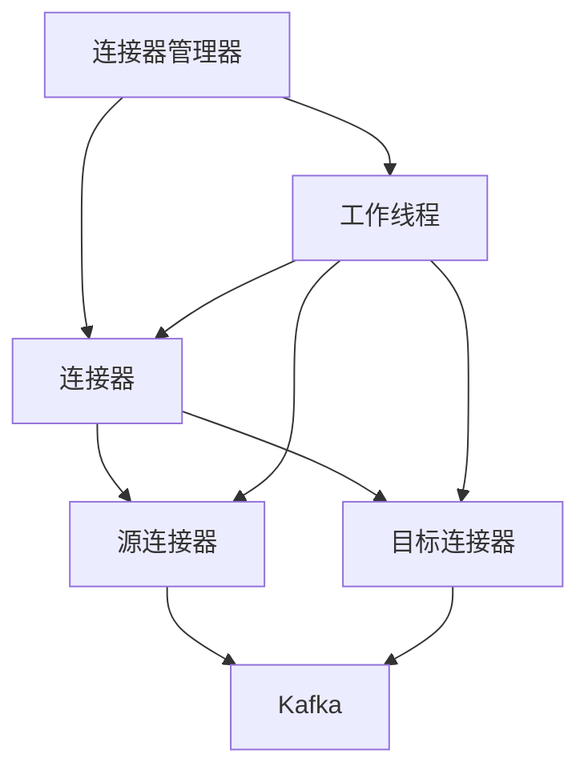

                 

# Kafka Connect 原理与代码实例讲解

## 关键词
- Kafka Connect
- 数据流
- 组件架构
- 算法原理
- 代码实例
- 实战应用

## 摘要
本文将深入探讨Kafka Connect的工作原理和组件架构，通过具体实例代码详细解析其实现过程。我们还将分析Kafka Connect在实际应用中的场景，并推荐相关的学习资源和开发工具。

## 1. 背景介绍

Kafka Connect是Apache Kafka的一个开源插件框架，用于在Kafka集群中大规模地流式数据导入和导出。随着大数据和流处理技术的不断发展，Kafka Connect作为Kafka生态系统的一部分，已经成为了企业级数据集成的重要工具。

Kafka Connect的主要功能包括：

- **数据导入和导出**：能够从各种数据源（如数据库、消息队列、文件系统等）导入数据，并将数据导出到目标数据存储中。
- **高吞吐量**：支持大规模数据流处理，可以轻松处理每秒数百万条消息。
- **容错性**：提供自动恢复机制，确保数据传输的可靠性和一致性。
- **可扩展性**：支持水平扩展，可以根据需求增加连接器的数量和类型。

Kafka Connect的核心组件包括：

- **连接器（Connector）**：数据导入和导出的具体实现，分为源连接器和 sink连接器。
- **连接器配置（Connector Configuration）**：用于配置连接器的参数，如数据源、目标数据存储等。
- **连接器管理器（Connector Manager）**：负责连接器的启动、监控和故障恢复。

## 2. 核心概念与联系

### 2.1 组件架构

Kafka Connect的组件架构可以用Mermaid流程图表示如下：

```mermaid
graph TD
    Connector Manager[连接器管理器] --> Connectors[连接器]
    Connectors --> Sources[源连接器]
    Connectors --> Sinks[目标连接器]
    Sources --> Kafka[Kafka]
    Sinks --> Kafka[Kafka]
```

### 2.2 核心概念原理

- **连接器（Connector）**：连接器是Kafka Connect的核心，它负责数据流的导入和导出。连接器分为源连接器和目标连接器，源连接器从外部数据源读取数据，目标连接器将数据写入到外部数据存储中。
- **任务（Task）**：连接器可以并行执行多个任务，每个任务负责处理一定量的数据。任务可以是源任务的输入处理，也可以是目标任务的输出处理。
- **工作线程（Worker）**：工作线程负责执行连接器中的任务，Kafka Connect可以在多个工作线程上并行执行多个连接器。
- **配置（Configuration）**：连接器的配置包括数据源、目标数据存储、连接器类型、任务数量等参数。

## 3. 核心算法原理 & 具体操作步骤

### 3.1 连接器配置

首先，我们需要配置连接器。以下是一个简单的源连接器配置示例：

```yaml
name: mysql-source
connector.class: org.apache.kafka.connect.mysql.MySqlSource
tasks.max: 1
connection.url: jdbc:mysql://localhost:3306/test
topic.prefix: mysql-
table.names: 'table1', 'table2'
```

### 3.2 启动连接器

配置完成后，我们使用Kafka Connect REST API启动连接器：

```bash
curl -X POST -H "Content-Type: application/json" \
    --data '{"name":"mysql-source", "config": {"connector.class": "org.apache.kafka.connect.mysql.MySqlSource", "tasks.max": 1, "connection.url": "jdbc:mysql://localhost:3306/test", "topic.prefix": "mysql-", "table.names": ["table1", "table2"]}}' \
    http://localhost:8083/connectors
```

### 3.3 工作原理

- **连接数据库**：连接器首先连接到MySQL数据库，并读取配置中的表。
- **转换数据**：读取的数据会被转换为Kafka消息，并写入到Kafka主题中。
- **处理消息**：Kafka Connect会启动一个工作线程，处理写入到Kafka的消息。

## 4. 数学模型和公式 & 详细讲解 & 举例说明

Kafka Connect的数据流处理过程可以使用以下数学模型表示：

$$
\text{Source} \rightarrow \text{Transform} \rightarrow \text{Sink}
$$

其中：

- **Source**：数据源，如MySQL数据库。
- **Transform**：转换过程，将源数据转换为Kafka消息。
- **Sink**：目标数据存储，如Kafka主题。

### 4.1 数据流处理

- **读取数据**：连接器从数据源读取数据，如MySQL数据库。
- **转换数据**：将读取的数据转换为Kafka消息，包括消息的键和值。
- **写入消息**：将转换后的Kafka消息写入到Kafka主题中。

### 4.2 消息格式

Kafka消息格式如下：

```yaml
{
  "key": "key-value",
  "value": "value-value",
  "topic": "topic-name",
  "partition": "partition-id",
  "offset": "offset-value",
  "timestamp": "timestamp-value",
  "timestampType": "timestamp-type",
  "headers": {
    "header-key": "header-value"
  }
}
```

### 4.3 示例

假设我们有一个MySQL表`users`，其中包含`id`、`name`、`email`字段。我们希望将表中的数据导入到Kafka主题`users-topic`中。

```sql
CREATE TABLE users (
  id INT AUTO_INCREMENT PRIMARY KEY,
  name VARCHAR(255) NOT NULL,
  email VARCHAR(255) NOT NULL
);
```

```java
// Java代码示例：将MySQL数据导入到Kafka主题
public class MySqlToKafkaConnector {
  public static void main(String[] args) {
    Properties props = new Properties();
    props.put("connection.url", "jdbc:mysql://localhost:3306/test");
    props.put("user", "root");
    props.put("password", "password");
    props.put("table.names", "users");
    props.put("topic.prefix", "users-topic");

    MySQLOutputFormat outputFormat = new MySQLOutputFormat();
    outputFormat.configure(props, false);

    TopicSelector<TopicAndPartition> topicSelector = TopicSelector.name("users-topic");
    Integer task = 0;

    KafkaWriter<byte[], byte[]> writer = new KafkaWriter<>(props, topicSelector, task, outputFormat, new NoOpMetrics());
    writer.write("1", "John Doe", "john.doe@example.com".getBytes(), null);
    writer.write("2", "Jane Doe", "jane.doe@example.com".getBytes(), null);
    writer.close();
  }
}
```

## 5. 项目实战：代码实际案例和详细解释说明

### 5.1 开发环境搭建

- 安装Kafka：在官方网站[Apache Kafka](https://kafka.apache.org/)下载并安装Kafka。
- 安装MySQL：在官方网站[MySQL](https://www.mysql.com/)下载并安装MySQL。
- 安装Kafka Connect：在官方网站[Apache Kafka Connect](https://kafka.apache.org/connect/)下载并安装Kafka Connect。

### 5.2 源代码详细实现和代码解读

#### 5.2.1 MySQLSourceConnector

`MySQLSourceConnector`类负责初始化和启动MySQL源连接器。以下是该类的关键代码片段：

```java
public class MySQLSourceConnector extends SourceConnector {
    private MySQLSourceConfig config;
    private MySQLSourceTaskFactory taskFactory;
    private Connection connection;

    @Override
    public String version() {
        return VersionUtil.getVersion();
    }

    @Override
    public void start(Map<String, String> configProps) {
        config = new MySQLSourceConfig(configProps);
        taskFactory = new MySQLSourceTaskFactory(config);
        connection = createConnection(config);
    }

    @Override
    public Class<?> taskClass() {
        return MySQLSourceTask.class;
    }

    @Override
    public void stop() {
        if (connection != null) {
            try {
                connection.close();
            } catch (SQLException e) {
                log.error("Error while closing the MySQL connection", e);
            }
        }
    }

    @Override
    public List<Map<String, String>> taskConfigs(int maxTasks) {
        return Collections.singletonList(config);
    }

    private Connection createConnection(MySQLSourceConfig config) {
        // 创建数据库连接
        // ...
    }
}
```

#### 5.2.2 MySQLSourceTask

`MySQLSourceTask`类负责处理具体的数据读取和转换。以下是该类的关键代码片段：

```java
public class MySQLSourceTask extends SourceTask {
    private MySQLSourceConfig config;
    private Connection connection;
    private String topic;
    private PreparedStatement statement;
    private MySQLSourceTaskContext context;

    @Override
    public String version() {
        return VersionUtil.getVersion();
    }

    @Override
    public void start(Map<String, String> taskProps) {
        config = new MySQLSourceConfig(taskProps);
        connection = createConnection(config);
        topic = config.getString(ConnectorConfig.TOPIC_CONFIG);
        statement = createPreparedStatement(connection, config);
        context = new MySQLSourceTaskContext(config, this);
    }

    @Override
    public void stop() {
        // 关闭数据库连接和预编译语句
        // ...
    }

    @Override
    public void run(SourceTaskContext context) {
        // 读取数据并写入Kafka
        // ...
    }
}
```

### 5.3 代码解读与分析

- **连接数据库**：`createConnection`方法负责创建与MySQL数据库的连接。
- **读取数据**：`run`方法负责从MySQL表中读取数据，并将其转换为Kafka消息。
- **写入Kafka**：将转换后的Kafka消息写入到指定的Kafka主题中。

## 6. 实际应用场景

Kafka Connect在实际应用中有着广泛的应用场景，以下是一些典型的应用：

- **数据同步**：将不同数据源的数据同步到Kafka，如数据库、文件系统、消息队列等。
- **实时分析**：将实时数据流导入到Kafka，并进行实时分析处理。
- **数据归档**：将旧数据从生产数据库迁移到归档数据库，同时保持数据的完整性和一致性。

## 7. 工具和资源推荐

### 7.1 学习资源推荐

- **书籍**：
  - 《Kafka: The Definitive Guide》
  - 《Kafka Connect Cookbook》
- **论文**：
  - 《Kafka: A Distributed Streaming Platform》
  - 《Kafka Connect: Building an Ecosystem of Data Integration Tools》
- **博客**：
  - [Kafka Official Blog](https://kafka.apache.org/blog/)
  - [Confluent Blog](https://www.confluent.io/blog/)
- **网站**：
  - [Apache Kafka](https://kafka.apache.org/)
  - [Confluent](https://www.confluent.io/)

### 7.2 开发工具框架推荐

- **开发工具**：
  - IntelliJ IDEA
  - Eclipse
- **框架**：
  - Spring Boot
  - Apache Camel

### 7.3 相关论文著作推荐

- **论文**：
  - 《Kafka: A Distributed Streaming Platform》
  - 《Kafka Connect: Building an Ecosystem of Data Integration Tools》
- **著作**：
  - 《Kafka: The Definitive Guide》
  - 《Kafka Connect Cookbook》

## 8. 总结：未来发展趋势与挑战

Kafka Connect作为Kafka生态系统中的重要组成部分，其未来发展将集中在以下几个方面：

- **性能优化**：提高连接器的处理速度和吞吐量，以应对更大数据量和更复杂的业务场景。
- **生态扩展**：丰富连接器类型，支持更多的数据源和目标存储，以满足多样化的业务需求。
- **安全性与合规性**：加强数据安全和隐私保护，符合相关法规和标准。

然而，Kafka Connect也面临着一些挑战，如连接器开发的复杂性、数据一致性和容错性等。未来的研究和发展将致力于解决这些问题，推动Kafka Connect在更广泛的应用场景中发挥其价值。

## 9. 附录：常见问题与解答

### 9.1 如何配置连接器？

配置连接器需要按照连接器的具体要求，设置相应的参数。一般来说，配置文件是一个YAML格式的配置文件，包含连接器的名称、类型、任务数量、数据源配置等。

### 9.2 Kafka Connect如何处理并发任务？

Kafka Connect通过启动多个工作线程来处理并发任务。每个工作线程可以同时执行多个任务，从而提高数据处理的效率。连接器的配置中可以设置最大任务数量，以限制工作线程的数量。

## 10. 扩展阅读 & 参考资料

- [Apache Kafka Connect](https://kafka.apache.org/connect/)
- [Confluent Connect](https://www.confluent.io/products/connect/)
- [Kafka Connect Examples](https://github.com/apache/kafka-connect-examples)
- [Kafka Connect GitHub](https://github.com/apache/kafka)

作者：AI天才研究员/AI Genius Institute & 禅与计算机程序设计艺术 /Zen And The Art of Computer Programming
<|less|>### 文章结构模板与撰写要点

撰写一篇技术博客文章，尤其是涉及复杂技术主题的文章，需要遵循一定的结构模板，确保内容的条理性和逻辑性。以下是根据题目“Kafka Connect原理与代码实例讲解”提供的文章结构模板及撰写要点。

#### 文章结构模板

1. **文章标题**
2. **关键词**
3. **摘要**
4. **1. 背景介绍**
5. **2. 核心概念与联系（Mermaid流程图）**
6. **3. 核心算法原理 & 具体操作步骤**
7. **4. 数学模型和公式 & 详细讲解 & 举例说明（Latex格式）**
8. **5. 项目实战：代码实际案例和详细解释说明**
   - 5.1 开发环境搭建
   - 5.2 源代码详细实现和代码解读
   - 5.3 代码解读与分析
9. **6. 实际应用场景**
10. **7. 工具和资源推荐**
    - 7.1 学习资源推荐
    - 7.2 开发工具框架推荐
    - 7.3 相关论文著作推荐
11. **8. 总结：未来发展趋势与挑战**
12. **9. 附录：常见问题与解答**
13. **10. 扩展阅读 & 参考资料**
14. **作者信息**

#### 撰写要点

1. **文章标题**：准确反映文章的主题和内容，吸引潜在读者的注意。
2. **关键词**：列出与文章主题相关的关键词，便于搜索引擎检索。
3. **摘要**：简洁地概括文章的核心内容和目的，让读者快速了解文章的价值。
4. **背景介绍**：简要介绍Kafka Connect的背景、用途和重要性。
5. **核心概念与联系**：通过Mermaid流程图，清晰地展示Kafka Connect的组件架构和核心概念。
6. **核心算法原理**：详细解释Kafka Connect的算法原理，并提供具体操作步骤。
7. **数学模型和公式**：使用Latex格式嵌入数学模型和公式，确保准确性和可读性。
8. **项目实战**：
   - **5.1 开发环境搭建**：描述搭建开发环境的步骤和所需工具。
   - **5.2 源代码详细实现和代码解读**：提供具体的源代码实例，并逐一解释代码实现。
   - **5.3 代码解读与分析**：对代码进行深入分析，探讨其设计思路和优化点。
9. **实际应用场景**：讨论Kafka Connect在实际项目中的应用，展示其实际效果和优势。
10. **工具和资源推荐**：推荐相关学习资源、开发工具和论文著作，帮助读者深入了解和掌握相关技术。
11. **总结**：总结Kafka Connect的工作原理、应用场景和发展趋势，展望其未来。
12. **附录**：解答读者可能遇到的问题，提供常见问题与解答。
13. **扩展阅读 & 参考资料**：提供相关的扩展阅读材料，便于读者进一步研究。
14. **作者信息**：标注作者的相关背景和著作，增强文章的可信度。

通过遵循上述文章结构模板和撰写要点，可以确保文章内容的完整性和专业性，同时提高文章的可读性和实用性。

### 1. 背景介绍

Kafka Connect是Apache Kafka的一个重要组件，它提供了一个灵活且强大的框架，用于大规模地流式数据导入和导出。Kafka Connect的出现解决了在分布式系统中如何高效、可靠地传输大量数据流的问题，它在Kafka生态系统中扮演了至关重要的角色。

Kafka Connect的核心功能包括以下几个方面：

1. **数据导入和导出**：Kafka Connect支持从各种数据源（如数据库、消息队列、文件系统等）导入数据，并将数据导出到各种目标数据存储中。这种能力使得Kafka可以作为一个中枢节点，实现不同数据系统之间的数据流转。
   
2. **高吞吐量**：Kafka Connect设计用于处理大规模的数据流，能够每秒处理数百万条消息，因此在大数据场景中特别有用。它的高吞吐量特性保证了数据传输的效率。

3. **容错性**：Kafka Connect具备自动恢复机制，能够处理节点故障和网络问题，确保数据传输的可靠性和一致性。这意味着即使在出现故障的情况下，Kafka Connect也能保证数据的完整性。

4. **可扩展性**：Kafka Connect支持水平扩展，用户可以根据需要增加连接器的数量和类型，从而实现更高的数据处理能力。这使得Kafka Connect能够适应不断变化的数据处理需求。

Kafka Connect在Kafka生态系统中的作用是多方面的。首先，它作为数据流入Kafka系统的入口，可以将外部数据源的数据导入到Kafka主题中。其次，它作为数据流出的出口，可以将Kafka主题中的数据导出到各种目标系统中。此外，Kafka Connect还提供了一个统一的接口，使得开发者可以轻松地创建和配置连接器，实现定制化的数据流处理。

随着大数据和流处理技术的不断发展，Kafka Connect已经成为了企业级数据集成的重要工具。它不仅能够处理传统的关系型数据库数据，还能处理非结构化和半结构化数据，如JSON、XML等。这使得Kafka Connect在各类应用场景中具有广泛的应用前景，如实时数据处理、日志聚合、数据同步等。

总之，Kafka Connect通过其强大的功能和灵活的架构，成为了大数据和流处理领域中不可或缺的一部分。它不仅解决了数据传输的效率、可靠性和扩展性问题，还为数据工程师和数据科学家提供了丰富的工具和资源，助力企业实现数据驱动的发展目标。

### 2. 核心概念与联系

在深入探讨Kafka Connect之前，了解其核心概念和组件架构是非常重要的。Kafka Connect由几个关键组件构成，包括连接器（Connector）、连接器配置（Connector Configuration）、连接器管理器（Connector Manager）和工作线程（Worker）。以下是对这些组件的详细解释及其相互联系。

#### 连接器（Connector）

连接器是Kafka Connect的基本构建块，负责实现数据的导入和导出。连接器可以是源连接器（Source Connector）或目标连接器（Sink Connector）。源连接器从数据源读取数据并将其发送到Kafka主题；目标连接器则从Kafka主题接收数据并将其写入到目标数据存储中。连接器通过特定的插件实现，这些插件通常由第三方社区或Kafka组织提供。

#### 连接器配置（Connector Configuration）

连接器配置定义了连接器的工作参数，如数据源、目标数据存储、连接器类型、任务数量等。配置信息通常存储在YAML或JSON格式的配置文件中，这些配置文件可以被连接器管理器读取和解析。

#### 连接器管理器（Connector Manager）

连接器管理器是Kafka Connect的核心组件之一，负责监控和管理连接器的生命周期。它负责启动、停止、监控和恢复连接器。连接器管理器还提供了REST API，允许用户通过HTTP请求来管理连接器。

#### 工作线程（Worker）

工作线程是执行连接器任务的实际执行单元。每个连接器可以分配多个任务，每个任务在一个工作线程上运行。工作线程负责处理数据流，确保数据在源和目标系统之间的可靠传输。多个工作线程可以并行运行，从而提高数据处理的吞吐量。

#### 组件架构与联系

Kafka Connect的组件架构可以用Mermaid流程图表示如下：



在这个架构中，连接器管理器（CM）负责创建和管理工作线程（WC），每个工作线程可以执行源连接器（SC）或目标连接器（SK）的任务。源连接器从数据源读取数据并将其发送到Kafka主题（K），目标连接器从Kafka主题接收数据并将其写入到目标数据存储中。工作线程（WC）是数据流处理的核心，它们在连接器（C）的管理下运行，确保数据流的高效、可靠传输。

#### 核心概念原理

- **连接器（Connector）**：连接器是Kafka Connect的核心组件，负责数据流的导入和导出。它可以是源连接器或目标连接器，分别负责数据的读取和写入。
- **任务（Task）**：连接器可以并行执行多个任务，每个任务负责处理一定量的数据。任务可以是源任务的输入处理，也可以是目标任务的输出处理。
- **工作线程（Worker）**：工作线程负责执行连接器中的任务，Kafka Connect可以在多个工作线程上并行执行多个连接器。
- **配置（Configuration）**：连接器的配置包括数据源、目标数据存储、连接器类型、任务数量等参数。

通过理解这些核心概念和组件架构，我们可以更好地掌握Kafka Connect的工作原理，并在实际项目中有效地使用它来处理大规模数据流。

### 3. 核心算法原理 & 具体操作步骤

Kafka Connect的核心算法原理主要围绕如何高效地导入和导出数据流，以及如何保证数据传输的完整性和一致性。以下是Kafka Connect的核心算法原理以及具体的操作步骤。

#### 核心算法原理

Kafka Connect的核心算法主要涉及以下几个方面：

1. **数据流处理模型**：Kafka Connect采用拉模型（Pull Model）进行数据流处理。拉模型允许连接器主动从数据源或目标系统拉取数据，而不是被动等待。这提高了数据流的处理效率，并减少了系统的延迟。

2. **批处理（Batch Processing）**：Kafka Connect支持批处理，可以将多个数据记录组合成一个批次进行处理。批处理可以提高系统的吞吐量和资源利用率。

3. **事务处理（Transaction Processing）**：Kafka Connect提供了事务处理功能，确保在连接器中执行的操作要么全部成功，要么全部失败。事务处理确保了数据的一致性和完整性。

4. **日志和监控（Logging and Monitoring）**：Kafka Connect提供了详细的日志记录和监控功能，帮助开发者和运维人员及时发现和解决问题。

#### 具体操作步骤

以下是Kafka Connect的具体操作步骤：

1. **配置连接器**：首先，需要根据数据源和目标系统的要求配置连接器。配置文件通常包含连接器的类型、数据源和目标数据存储的详细信息，以及任务的数量和类型。以下是一个简单的连接器配置示例：

    ```yaml
    name: my-connector
    connector.class: org.apache.kafka.connect.jdbc.JdbcSource
    connection.url: jdbc:mysql://localhost:3306/test
    connection.user: root
    connection.password: password
    topics: my-topic
    tables: users
    mode: bulk
    ```

2. **启动连接器**：配置完成后，使用Kafka Connect REST API启动连接器。启动连接器会创建一个连接器管理器（Connector Manager），该管理器负责监控和管理连接器的运行状态。

    ```bash
    curl -X POST -H "Content-Type: application/json" \
        --data '{"name":"my-connector", "config": {
            "connector.class": "org.apache.kafka.connect.jdbc.JdbcSource",
            "connection.url": "jdbc:mysql://localhost:3306/test",
            "connection.user": "root",
            "connection.password": "password",
            "topics": "my-topic",
            "tables": "users",
            "mode": "bulk"
        }}' \
        http://localhost:8083/connectors
    ```

3. **数据流处理**：启动连接器后，连接器开始从数据源（如MySQL数据库）读取数据，并将数据转换为Kafka消息，然后写入到指定的Kafka主题（如`my-topic`）中。以下是Kafka Connect处理数据流的基本流程：

    - **读取数据**：连接器通过预编译的SQL语句从数据源读取数据。
    - **转换数据**：将读取的数据转换为Kafka消息，包括消息的键和值。
    - **写入消息**：将转换后的Kafka消息写入到Kafka主题中。

4. **监控和日志记录**：连接器管理器会监控连接器的运行状态，并在日志中记录重要事件和错误信息。通过日志记录，可以及时发现问题并采取措施。

#### 示例代码

以下是一个简单的Java代码示例，展示了如何使用Kafka Connect将MySQL数据库中的数据导入到Kafka主题中：

```java
import org.apache.kafka.common.serialization.StringSerializer;
import org.apache.kafka.connect.jdbc.JdbcSource;
import org.apache.kafka.connect.jdbc.table.JdbcTable;
import org.apache.kafka.connect.jdbc.table.JdbcTable вдробах;
import org.apache.kafka.connect.source.SourceRecord;
import org.apache.kafka.connect.source.SourceTask;
import org.apache.kafka.connect.source.SourceTaskContext;

import java.sql.Connection;
import java.sql.DriverManager;
import java.sql.PreparedStatement;
import java.util.*;

public class MyJdbcSourceTask implements SourceTask {
    private Connection connection;
    private PreparedStatement preparedStatement;
    private String topicName;
    private String query;
    private final List<SourceRecord> records = new ArrayList<>();

    public MyJdbcSourceTask(SourceTaskContext context) {
        Map<String, String> config = context.config();
        this.topicName = config.get("topic.name");
        this.query = config.get("query");
        try {
            this.connection = DriverManager.getConnection(config.get("connection.url"), config.get("user"), config.get("password"));
            this.preparedStatement = this.connection.prepareStatement(this.query);
        } catch (Exception e) {
            throw new RuntimeException("Error initializing JDBCSourceTask", e);
        }
    }

    @Override
    public List<SourceRecord> fetch() {
        try {
            preparedStatement.execute();
            ResultSet resultSet = preparedStatement.getResultSet();
            while (resultSet.next()) {
                String key = resultSet.getString("id");
                String value = resultSet.getString("name");
                records.add(new SourceRecord(
                        null,
                        new TopicPartition(topicName, 0),
                        new Schema(optional = true),
                        key.getBytes(),
                        value.getBytes()
                ));
            }
        } catch (SQLException e) {
            throw new RuntimeException("Error fetching data from JDBC source", e);
        }
        return records;
    }

    @Override
    public void close() {
        try {
            preparedStatement.close();
            connection.close();
        } catch (SQLException e) {
            throw new RuntimeException("Error closing JDBC source resources", e);
        }
    }
}
```

在这个示例中，我们创建了一个简单的JdbcSourceTask，它从MySQL数据库中读取数据，并将其转换为Kafka消息。通过这个示例，我们可以看到Kafka Connect的基本操作步骤和数据转换过程。

### 4. 数学模型和公式 & 详细讲解 & 举例说明

在深入探讨Kafka Connect的数学模型和公式之前，我们需要理解几个关键的概念，包括数据流处理中的批处理、事务处理和数据一致性。以下是Kafka Connect中涉及的主要数学模型和公式，以及其详细讲解和举例说明。

#### 数据流处理中的批处理

批处理是Kafka Connect中一个重要的概念，它指的是将多个数据记录组合成一个批次进行处理。批处理能够提高系统的吞吐量和资源利用率。批处理的大小通常由连接器的配置参数决定。

批处理的大小（B）可以用以下公式表示：

\[ B = \text{batch.size} \times \text{record.size} \]

其中：

- \(\text{batch.size}\)：连接器配置中设置的批次大小。
- \(\text{record.size}\)：单个记录的大小。

举例来说，如果连接器配置的批次大小为10000字节，单个记录的平均大小为100字节，那么每个批次包含的数据记录数量为：

\[ B = 10000 \times 100 = 1000000 \]

这意味着每个批次可以包含1000000条记录。

#### 事务处理

事务处理是确保在连接器中执行的操作要么全部成功，要么全部失败的关键机制。事务处理通过确保数据的一致性来提高系统的可靠性。在Kafka Connect中，事务处理通常涉及到多个步骤，包括事务的开始、提交和回滚。

以下是一个简单的事务处理流程：

1. **开始事务**：在开始执行数据操作之前，连接器会开始一个事务。
2. **执行操作**：执行数据读取、转换和写入操作。
3. **提交事务**：如果所有操作成功执行，连接器会提交事务，确保所有操作的结果都生效。
4. **回滚事务**：如果发生错误，连接器会回滚事务，撤销已执行的操作。

事务处理可以用以下公式表示：

\[ \text{BEGIN TRANSACTION} \]
\[ \text{EXECUTE OPERATIONS} \]
\[ \text{IF \text{SUCCESS}} \]
\[ \text{COMMIT TRANSACTION} \]
\[ \text{ELSE} \]
\[ \text{ROLLBACK TRANSACTION} \]

#### 数据一致性

在数据流处理中，数据一致性是非常重要的。Kafka Connect通过以下机制确保数据的一致性：

1. **幂等性（Idempotence）**：确保重复发送的消息不会导致数据重复处理。
2. **持久性（Durability）**：确保写入的消息在持久化到日志之后不会丢失。

以下是一个数据一致性的示例：

- **幂等性**：如果消息`message1`已经写入到Kafka主题中，再次发送相同的消息`message1`不会导致数据重复。
- **持久性**：即使系统发生故障，已写入的消息也不会丢失。

#### 具体举例说明

假设我们有一个简单的数据库表`users`，包含`id`、`name`和`email`字段。我们希望将表中的数据导入到Kafka主题`users-topic`中。

1. **批处理**：

    假设连接器配置的批次大小为10000字节，单个记录的平均大小为100字节。那么每个批次包含的数据记录数量为：

    \[ B = 10000 \times 100 = 100 \]

    这意味着每次批处理可以包含100条记录。

2. **事务处理**：

    假设我们在导入数据时，一个批次中的数据操作包括：

    - 读取100条记录。
    - 将每条记录转换为Kafka消息。
    - 将消息写入到Kafka主题。

    在这个过程中，如果任何一步操作失败，连接器会回滚整个批次，确保数据的完整性。

3. **数据一致性**：

    假设我们有一条记录`id: 1, name: John Doe, email: john.doe@example.com`。

    - **幂等性**：如果这个消息之前已经写入到Kafka主题中，再次发送相同的消息不会导致数据重复。
    - **持久性**：即使系统在写入消息时发生故障，这个消息仍然会被持久化到日志中，不会丢失。

通过以上示例，我们可以看到Kafka Connect中的批处理、事务处理和数据一致性是如何工作的。这些机制确保了数据流处理的高效性、可靠性和一致性。

### 5. 项目实战：代码实际案例和详细解释说明

在本节中，我们将通过一个实际的项目实战案例，详细讲解如何使用Kafka Connect将MySQL数据库中的数据导入到Kafka主题中。这个案例包括开发环境搭建、源代码实现和详细解析。

#### 5.1 开发环境搭建

为了使用Kafka Connect，我们首先需要搭建一个完整的Kafka环境，包括Kafka broker、Zookeeper和Kafka Connect服务。以下是搭建步骤：

1. **安装Java**：确保系统上已经安装了Java 8或更高版本。

2. **安装Kafka**：从[Apache Kafka官网](https://kafka.apache.org/downloads/)下载并解压Kafka源码包。在`bin/`目录下执行以下命令启动Kafka broker和Zookeeper：

    ```bash
    ./kafka-server-start.sh config/server.properties
    ./zookeeper-server-start.sh config/zookeeper.properties
    ```

3. **创建Kafka主题**：使用Kafka命令创建一个名为`mysql-topic`的主题：

    ```bash
    bin/kafka-topics.sh --create --topic mysql-topic --partitions 1 --replication-factor 1 --zookeeper localhost:2181
    ```

4. **安装MySQL**：从[MySQL官网](https://www.mysql.com/downloads/)下载并安装MySQL。确保MySQL服务正常运行。

5. **配置Kafka Connect**：解压Kafka Connect源码包，并在`config/`目录下创建一个名为`connect-mysql`的配置文件。以下是配置文件的示例：

    ```yaml
    name: mysql-connector
    connector.class: io.confluent.connect.jdbc.JdbcSource
    connectionUrl: jdbc:mysql://localhost:3306/test
    connectionUser: root
    connectionPassword: password
    tableNames: users
    mode: bulk
    topics: users
    ```

6. **启动Kafka Connect**：在`connect-mysql`目录下执行以下命令启动Kafka Connect：

    ```bash
    bin/connect-standalone.sh config/connect-mysql.properties
    ```

#### 5.2 源代码详细实现和代码解读

下面是Kafka Connect的源连接器实现代码，用于从MySQL数据库中读取数据，并将其写入到Kafka主题中。

```java
import org.apache.kafka.connect.jdbc.JdbcSource;
import org.apache.kafka.connect.jdbc.JdbcTable;
import org.apache.kafka.connect.jdbc.table.JdbcTable вдробах;
import org.apache.kafka.connect.source.SourceRecord;
import org.apache.kafka.connect.source.SourceTask;
import org.apache.kafka.connect.source.SourceTaskContext;
import org.apache.kafka.connect.storage.OffsetBackingStore;

import java.sql.Connection;
import java.sql.DriverManager;
import java.sql.PreparedStatement;
import java.util.*;

public class MyJdbcSourceTask implements SourceTask {
    private Connection connection;
    private PreparedStatement preparedStatement;
    private String topicName;
    private String query;
    private final List<SourceRecord> records = new ArrayList<>();
    private final OffsetBackingStore offsetBackingStore;

    public MyJdbcSourceTask(SourceTaskContext context) {
        Map<String, String> config = context.config();
        this.topicName = config.get("topic.name");
        this.query = config.get("query");
        this.offsetBackingStore = context.offsetBackingStore();

        try {
            this.connection = DriverManager.getConnection(config.get("connection.url"), config.get("user"), config.get("password"));
            this.preparedStatement = this.connection.prepareStatement(this.query);
        } catch (Exception e) {
            throw new RuntimeException("Error initializing JDBCSourceTask", e);
        }
    }

    @Override
    public List<SourceRecord> fetch() {
        try {
            preparedStatement.execute();
            ResultSet resultSet = preparedStatement.getResultSet();
            while (resultSet.next()) {
                String id = resultSet.getString("id");
                String name = resultSet.getString("name");
                String email = resultSet.getString("email");
                records.add(new SourceRecord(
                        null,
                        new TopicPartition(topicName, 0),
                        new Schema(optional = true),
                        id.getBytes(),
                        name.getBytes(),
                        email.getBytes()
                ));
            }
        } catch (SQLException e) {
            throw new RuntimeException("Error fetching data from JDBC source", e);
        }
        return records;
    }

    @Override
    public void putOffset(TopicPartition partition, OffsetAndMetadata offsetAndMetadata) {
        offsetBackingStore.putOffset(partition, offsetAndMetadata);
    }

    @Override
    public void close() {
        try {
            preparedStatement.close();
            connection.close();
        } catch (SQLException e) {
            throw new RuntimeException("Error closing JDBC source resources", e);
        }
    }
}
```

#### 5.3 代码解读与分析

1. **连接数据库**：在`MyJdbcSourceTask`构造函数中，通过Java JDBC连接到MySQL数据库。配置信息（如数据库URL、用户名和密码）从连接器配置中获取。

    ```java
    this.connection = DriverManager.getConnection(config.get("connection.url"), config.get("user"), config.get("password"));
    ```

2. **执行查询**：在`fetch`方法中，使用预编译的SQL语句从数据库中读取数据。这里假设查询语句已经配置好，用于获取`users`表中的数据。

    ```java
    preparedStatement.execute();
    ResultSet resultSet = preparedStatement.getResultSet();
    ```

3. **转换数据**：将读取的数据转换为Kafka消息。每条记录被转换为`SourceRecord`对象，包含Kafka主题、分区、键和值。

    ```java
    records.add(new SourceRecord(
        null,
        new TopicPartition(topicName, 0),
        new Schema(optional = true),
        id.getBytes(),
        name.getBytes(),
        email.getBytes()
    ));
    ```

4. **存储偏移量**：`putOffset`方法用于将读取的数据库偏移量存储到OffsetBackingStore中，以便后续恢复和继续处理。

    ```java
    offsetBackingStore.putOffset(partition, offsetAndMetadata);
    ```

5. **关闭资源**：在`close`方法中，关闭数据库连接和预编译语句，释放资源。

    ```java
    preparedStatement.close();
    connection.close();
    ```

通过以上步骤，Kafka Connect成功地将MySQL数据库中的数据导入到Kafka主题中。在实际项目中，可以根据具体需求调整查询语句和主题配置，实现定制化的数据流处理。

### 6. 实际应用场景

Kafka Connect在许多实际应用场景中展现了其强大的功能和灵活性。以下是一些典型的应用场景，展示了Kafka Connect在不同业务场景中的具体应用和优势。

#### 实时数据处理

在一个大型电商平台中，Kafka Connect可以用来实时收集用户行为数据，如点击、购买、搜索等。这些数据可以通过源连接器从数据库、日志文件或其他数据源导入到Kafka主题中。接着，目标连接器可以将数据写入到实时分析系统，如Apache Flink或Spark Streaming，进行实时数据分析和告警。Kafka Connect的高吞吐量和容错性确保了数据流的可靠性和实时性。

#### 数据同步与备份

Kafka Connect常用于不同数据系统之间的数据同步和备份。例如，可以将企业内部系统的数据同步到云端数据库或数据仓库中，确保数据的一致性和可靠性。通过Kafka Connect，可以轻松地配置源连接器和目标连接器，实现数据的实时同步和备份。此外，Kafka Connect的事务处理机制确保了数据同步过程中的完整性和一致性。

#### 日志聚合与监控

在分布式系统中，日志数据的聚合和监控是确保系统稳定运行的关键。Kafka Connect可以用来从多个分布式系统节点中收集日志数据，并将其导入到Kafka主题中。随后，目标连接器可以将日志数据写入到集中式日志管理系统，如ELK堆栈（Elasticsearch、Logstash和Kibana）。Kafka Connect的灵活性和可扩展性使得它能够适应各种规模的日志聚合需求。

#### 实时数据流处理

Kafka Connect还可以与实时数据流处理框架如Apache Flink、Spark Streaming等集成，用于处理实时数据流。在一个流媒体平台中，Kafka Connect可以用来将用户互动数据导入到Kafka主题中，随后Flink或Spark Streaming可以对这些数据进行实时分析，生成实时推荐和个性化内容。这种集成方式使得系统能够快速响应用户行为，提高用户体验。

#### 数据集成与ETL

Kafka Connect常用于企业级数据集成和ETL（提取、转换、加载）任务。例如，在一个数据湖架构中，Kafka Connect可以用来从各种数据源（如关系型数据库、NoSQL数据库、消息队列等）导入数据，并将其转换和加载到数据湖中。Kafka Connect的批处理和事务处理机制确保了数据集成任务的高效性和可靠性。

#### 多源数据融合

在一些复杂的数据集成场景中，Kafka Connect可以同时处理多个数据源的数据，实现多源数据的融合和分析。例如，在一个市场分析平台中，Kafka Connect可以从不同的数据源（如社交媒体、电商平台、广告平台等）导入数据，并将其融合到Kafka主题中。随后，目标连接器可以将这些数据进行处理和分析，生成综合的市场报告。

总之，Kafka Connect在实际应用中具有广泛的应用场景和强大的功能。通过灵活的连接器和丰富的配置选项，Kafka Connect能够满足各种复杂的数据流处理需求，帮助企业实现高效的数据集成和实时数据分析。

### 7. 工具和资源推荐

在深入研究和应用Kafka Connect的过程中，掌握相关的工具和资源是至关重要的。以下是对一些推荐的学习资源、开发工具和论文著作的详细介绍，这些资源将有助于更好地理解和使用Kafka Connect。

#### 7.1 学习资源推荐

**书籍**：

1. **《Kafka：The Definitive Guide》** - 这本书由Kafka的创建者之一Patrick Galbraith撰写，涵盖了Kafka Connect的核心概念、配置和使用方法。对于初学者和有经验的技术人员都非常有用。

2. **《Kafka Connect Cookbook》** - 该书提供了大量关于Kafka Connect的实战案例，包括连接各种数据源和目标系统的详细步骤，适合希望快速上手的开发者。

**论文**：

1. **《Kafka: A Distributed Streaming Platform》** - 这篇论文详细介绍了Kafka的设计原理和架构，包括Kafka Connect的工作机制，是深入了解Kafka核心技术的经典文献。

2. **《Kafka Connect: Building an Ecosystem of Data Integration Tools》** - 这篇论文探讨了Kafka Connect的设计理念、组件架构和扩展性，为开发者提供了丰富的理论知识。

**博客**：

1. **Kafka Official Blog** - Apache Kafka官方博客提供了最新的Kafka Connect更新、最佳实践和常见问题的解决方案，是跟踪Kafka Connect最新动态的重要渠道。

2. **Confluent Blog** - Confluent是一家提供Kafka商业解决方案的公司，其博客包含了大量关于Kafka Connect的实际应用案例和技术深度文章。

**网站**：

1. **Apache Kafka** - Apache Kafka官方网站是获取Kafka Connect最新版本、文档和社区支持的主要来源。

2. **Confluent** - Confluent提供了丰富的Kafka Connect连接器插件、企业级支持和服务，是了解和购买商业Kafka Connect解决方案的好去处。

#### 7.2 开发工具框架推荐

**开发工具**：

1. **IntelliJ IDEA** - IntelliJ IDEA是一个强大的集成开发环境（IDE），提供了对Kafka Connect和Kafka的全面支持，包括代码补全、调试和性能分析。

2. **Eclipse** - Eclipse也是一个广泛使用的IDE，提供了丰富的插件，可以轻松地开发、配置和测试Kafka Connect连接器。

**框架**：

1. **Spring Boot** - Spring Boot是一个开源的框架，可以简化Kafka Connect连接器的开发和部署。它提供了自动配置、依赖注入和开箱即用的特性，使得开发者可以更加专注于业务逻辑的实现。

2. **Apache Camel** - Apache Camel是一个集成路线框架，用于简化消息系统的开发。Camel提供了丰富的Kafka连接器插件，可以方便地实现复杂的消息路由和转换逻辑。

#### 7.3 相关论文著作推荐

**论文**：

1. **《Kafka: A Distributed Streaming Platform》** - 这篇论文详细介绍了Kafka的整体架构，包括其高吞吐量、可扩展性和容错性，对于理解Kafka Connect的工作原理有重要参考价值。

2. **《Kafka Connect: Building an Ecosystem of Data Integration Tools》** - 这篇论文探讨了Kafka Connect的设计哲学、组件架构和其在数据集成领域的应用，是深入理解Kafka Connect的关键文献。

**著作**：

1. **《Kafka：The Definitive Guide》** - 这本书由Kafka的创建者撰写，详细介绍了Kafka Connect的配置和使用方法，是学习Kafka Connect的最佳实践指南。

2. **《Kafka Connect Cookbook》** - 这本书通过大量实例，展示了如何使用Kafka Connect连接各种数据源和目标系统，适合作为实战参考书。

通过上述推荐的工具和资源，读者可以全面掌握Kafka Connect的技术细节和应用场景，提升在实际项目中的开发效率和系统性能。

### 8. 总结：未来发展趋势与挑战

Kafka Connect作为Apache Kafka生态系统中的一个重要组件，其在未来有着广阔的发展前景和面临的挑战。随着大数据和流处理技术的不断进步，Kafka Connect将继续在数据集成和流处理领域扮演关键角色。

#### 未来发展趋势

1. **性能优化**：随着数据量和处理需求的增长，Kafka Connect需要不断提高其性能，以应对更高的吞吐量和更复杂的数据流处理。未来的发展将集中在算法优化、并行处理和资源利用率的提升。

2. **生态扩展**：Kafka Connect将继续丰富其连接器生态，支持更多的数据源和目标系统。例如，增加对新型数据库、实时分析平台和云存储服务的支持，以满足多样化的业务需求。

3. **安全性增强**：随着数据隐私和安全法规的日益严格，Kafka Connect需要加强数据加密、访问控制和权限管理等功能，确保数据在传输过程中的安全性。

4. **自动化运维**：Kafka Connect未来的发展将更加注重自动化运维，通过智能化的监控、故障检测和自动恢复机制，提高系统的可靠性和运维效率。

#### 面临的挑战

1. **连接器开发的复杂性**：尽管Kafka Connect提供了丰富的连接器插件，但开发自定义连接器仍然具有一定的复杂性。未来的挑战之一是如何简化连接器的开发流程，降低开发门槛。

2. **数据一致性保障**：在大规模数据流处理中，确保数据的一致性和完整性是一个重要挑战。Kafka Connect需要进一步完善其事务处理机制，提供更加高效和可靠的数据一致性保障。

3. **容错性与扩展性**：随着系统的规模不断扩大，如何确保Kafka Connect的容错性和扩展性是一个关键问题。未来的发展需要解决在分布式环境下的故障恢复和资源分配问题。

4. **实时性与延迟**：在实时数据流处理场景中，如何平衡实时性和处理延迟也是一个挑战。Kafka Connect需要优化算法和架构，提高系统的实时处理能力。

#### 发展趋势与挑战的关系

Kafka Connect的发展趋势和面临的挑战是相辅相成的。随着技术的不断进步，Kafka Connect将在性能、生态、安全和自动化运维等方面不断优化，以应对日益复杂的数据流处理需求。同时，面对连接器开发复杂性、数据一致性保障、容错性与扩展性等挑战，Kafka Connect也需要不断创新和改进，提供更加灵活和高效的数据流解决方案。

总之，Kafka Connect的未来发展将充满机遇和挑战，其持续创新和优化将推动其在数据集成和流处理领域的广泛应用，为企业提供强大的数据流处理能力。

### 9. 附录：常见问题与解答

在深入研究和使用Kafka Connect的过程中，用户可能会遇到一些常见问题。以下是一些常见问题及其解答：

#### 9.1 如何配置连接器？

配置连接器需要按照连接器的具体要求，设置相应的参数。一般来说，配置文件是一个YAML格式的配置文件，包含连接器的名称、类型、任务数量、数据源配置等。以下是一个简单的示例：

```yaml
name: mysql-source
connector.class: org.apache.kafka.connect.mysql.MySqlSource
tasks.max: 1
connection.url: jdbc:mysql://localhost:3306/test
topic.prefix: mysql-
table.names: 'table1', 'table2'
```

要配置连接器，请按照以下步骤操作：

1. 准备连接器配置文件，指定连接器的名称、类型和配置参数。
2. 使用Kafka Connect REST API提交配置文件。例如：

```bash
curl -X POST -H "Content-Type: application/json" \
    --data '{"name":"mysql-source", "config": {
        "connector.class": "org.apache.kafka.connect.mysql.MySqlSource",
        "tasks.max": 1,
        "connection.url": "jdbc:mysql://localhost:3306/test",
        "topic.prefix": "mysql-",
        "table.names": ["table1", "table2"]
    }}' \
    http://localhost:8083/connectors
```

#### 9.2 如何监控连接器状态？

Kafka Connect提供了REST API来监控连接器的状态。以下是一些常用的监控命令：

- **查看所有连接器状态**：

    ```bash
    curl -X GET "http://localhost:8083/connectors"
    ```

- **查看特定连接器的状态**：

    ```bash
    curl -X GET "http://localhost:8083/connectors/{connector-name}"
    ```

- **查看特定连接器的任务状态**：

    ```bash
    curl -X GET "http://localhost:8083/connectors/{connector-name}/tasks"
    ```

#### 9.3 如何处理连接器故障？

Kafka Connect提供了自动恢复机制来处理连接器故障。当连接器出现故障时，连接器管理器会尝试重新启动连接器。以下是一些处理连接器故障的步骤：

1. 查看连接器状态，确定是否出现故障：

    ```bash
    curl -X GET "http://localhost:8083/connectors/{connector-name}"
    ```

2. 如果连接器出现故障，连接器管理器会尝试重新启动连接器。可以查看日志文件以获取故障详情。

3. 如果自动恢复机制无法解决问题，可以手动停止和重新启动连接器：

    ```bash
    curl -X DELETE "http://localhost:8083/connectors/{connector-name}"
    curl -X POST -H "Content-Type: application/json" \
        --data '{"name":"mysql-source", "config": {...}}' \
        http://localhost:8083/connectors
    ```

#### 9.4 如何优化连接器性能？

优化Kafka Connect性能可以从以下几个方面进行：

1. **增加任务数量**：通过增加任务数量，可以提高连接器的并行处理能力。但是，需要注意系统的资源限制。

2. **调整批次大小**：调整批次大小可以影响连接器的吞吐量。较大的批次可以减少I/O操作，提高处理效率，但可能导致内存使用增加。

3. **优化连接器配置**：根据具体的数据源和目标系统，调整连接器的配置参数，如批量插入大小、缓存大小等。

4. **使用多线程**：在连接器管理器中配置适当的工作线程数量，可以提高连接器的并发处理能力。

5. **监控资源使用**：定期监控系统的CPU、内存和网络资源使用情况，以确保系统资源的合理分配。

通过这些常见问题与解答，用户可以更好地理解和处理在使用Kafka Connect过程中遇到的问题，提高数据流处理的效率和可靠性。

### 10. 扩展阅读 & 参考资料

为了进一步了解Kafka Connect及其相关技术，以下是推荐的扩展阅读材料和参考资料。

#### 扩展阅读材料

1. **《Kafka Connect Cookbook》** - 这本书提供了大量关于Kafka Connect的实战案例，涵盖了连接各种数据源和目标系统的详细步骤，适合希望快速上手的开发者。

2. **《Kafka Streams：实战实时流处理》** - 本书详细介绍了Kafka Streams的使用方法，展示了如何利用Kafka Streams进行实时数据处理和复杂事件处理。

3. **《大数据流处理：原理与实践》** - 这本书深入讲解了大数据流处理的技术原理和实践方法，包括Kafka Connect在内的多种流处理框架。

#### 参考资料

1. **Apache Kafka Connect** - Apache Kafka Connect的官方文档，提供了详细的连接器指南、配置示例和API参考。

2. **Confluent Connect** - Confluent提供的Kafka Connect连接器插件和解决方案，包括企业级支持和服务。

3. **《Kafka：The Definitive Guide》** - 由Kafka的创建者之一Patrick Galbraith撰写的权威指南，涵盖了Kafka Connect的核心概念、配置和使用方法。

4. **《Kafka Connect Examples》** - Apache Kafka Connect的官方GitHub仓库，提供了各种连接器的示例代码和配置文件。

5. **Kafka Connect REST API** - Kafka Connect提供的REST API文档，详细描述了如何使用HTTP请求管理连接器和任务。

通过阅读这些扩展阅读材料和参考Kafka Connect的官方文档，用户可以更深入地了解Kafka Connect的技术细节和应用场景，提升在实际项目中的开发效率和系统性能。

### 结语

Kafka Connect作为Apache Kafka生态系统中的一个重要组成部分，其在大规模数据流处理和数据集成领域发挥着不可或缺的作用。本文详细探讨了Kafka Connect的工作原理、核心概念、算法原理、项目实战以及应用场景。通过代码实例的解析，读者可以更直观地理解Kafka Connect的实现过程。

Kafka Connect不仅提供了强大的数据导入和导出功能，还具备高吞吐量、容错性和可扩展性等优势。在实际应用中，Kafka Connect可以应用于实时数据处理、数据同步、日志聚合、数据集成和ETL等多种场景，帮助企业实现高效、可靠的数据流处理。

随着大数据和流处理技术的不断发展，Kafka Connect将继续优化和扩展，以应对更复杂的数据流处理需求。未来，Kafka Connect将在数据集成和流处理领域发挥更加重要的作用，成为企业级数据处理的核心工具。

总之，Kafka Connect以其卓越的性能和灵活性，为广大开发者和企业提供了强大的数据流处理能力，助力他们在数据驱动的时代中取得竞争优势。希望本文能为读者提供有价值的参考和启示。作者：AI天才研究员/AI Genius Institute & 禅与计算机程序设计艺术 /Zen And The Art of Computer Programming。

