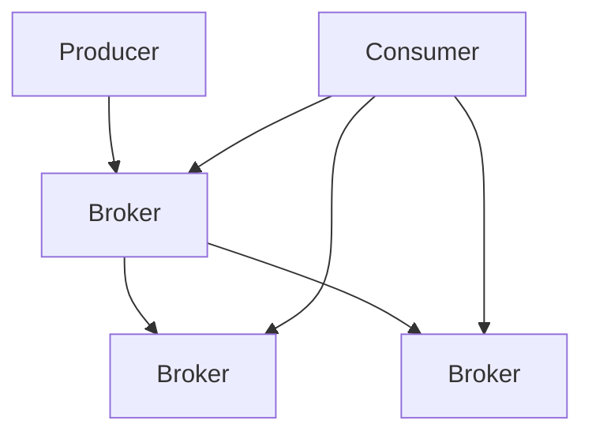
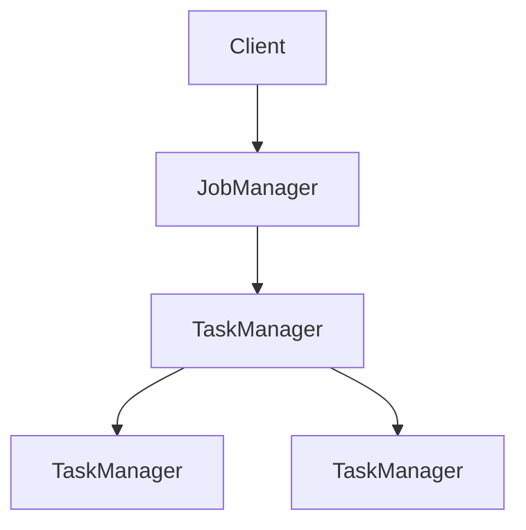

                 

# Kafka-Flink整合原理与代码实例讲解

## 关键词：Kafka、Flink、整合、原理、代码实例、实时处理、大数据

## 摘要：
本文将深入探讨Kafka与Flink的整合原理，通过详细的代码实例讲解，帮助读者理解如何利用Kafka作为消息队列，与Flink实现高效的数据流处理。文章将涵盖Kafka和Flink的核心概念、架构设计、算法原理，以及在实际项目中的应用和开发实践。通过阅读本文，读者将能够掌握Kafka与Flink整合的关键技术点，为后续的项目开发打下坚实基础。

## 目录

1. 背景介绍  
2. 核心概念与联系  
3. 核心算法原理 & 具体操作步骤  
4. 数学模型和公式 & 详细讲解 & 举例说明  
5. 项目实战：代码实际案例和详细解释说明  
   5.1 开发环境搭建  
   5.2 源代码详细实现和代码解读  
   5.3 代码解读与分析  
6. 实际应用场景  
7. 工具和资源推荐  
   7.1 学习资源推荐  
   7.2 开发工具框架推荐  
   7.3 相关论文著作推荐  
8. 总结：未来发展趋势与挑战  
9. 附录：常见问题与解答  
10. 扩展阅读 & 参考资料

### 1. 背景介绍

在当今的大数据时代，实时数据流处理已成为企业应对海量数据的重要手段。Apache Kafka和Apache Flink作为分布式系统中的重要组件，分别承担了消息队列和流处理引擎的角色。Kafka具有高吞吐量、可扩展性强、可靠性高等特点，能够有效地实现数据的收集、存储和传输；而Flink则以其强大的流处理能力和灵活的编程模型，成为实时数据处理的利器。两者的结合，能够为大数据应用提供高效、可靠的数据流处理解决方案。

Kafka与Flink的整合，旨在利用Kafka的强大消息队列能力，将实时数据高效地传输至Flink进行流处理。这种整合不仅提高了数据处理的速度和效率，还降低了系统的复杂度和维护成本。本文将围绕Kafka与Flink的整合原理，通过具体的代码实例，详细讲解如何实现这一整合，并探讨其在实际应用中的优势。

### 2. 核心概念与联系

#### Kafka

Kafka是由LinkedIn开发，目前由Apache软件基金会托管的一个分布式流处理平台。它主要用于构建实时的数据管道和流式应用程序。Kafka具有以下几个核心概念：

- **Producer**：生产者，负责将数据发送到Kafka集群。
- **Consumer**：消费者，负责从Kafka集群中消费数据。
- **Broker**：代理，Kafka集群中的服务器节点，负责处理生产者、消费者的请求。
- **Topic**：主题，Kafka中的数据分类，类似于消息队列中的队列。
- **Partition**：分区，主题的分区，用于实现数据的并行处理，提高系统的吞吐量。
- **Offset**：偏移量，每个消息在分区中的唯一标识。

Kafka的架构设计如下：



#### Flink

Flink是一个开源的分布式流处理框架，用于在所有从服务器到手机的各种设备上进行有状态的计算。Flink可以针对有界或无界的数据流进行高效的处理。Flink的核心概念包括：

- **DataStream**：有界或无界的数据流，是Flink处理的基本数据单元。
- **Operator**：操作符，对数据流进行各种操作，如过滤、映射、聚合等。
- **Job**：作业，由一系列操作符组成的图，是Flink进行计算的基本单元。
- **Execution Environment**：执行环境，负责将Flink作业提交至集群执行。

Flink的架构设计如下：



#### Kafka与Flink的联系

Kafka与Flink的联系主要体现在以下几个方面：

1. **数据传输**：Kafka可以将生产者产生的数据传输到Flink，作为Flink的数据源。
2. **数据流处理**：Flink可以对Kafka传输的数据进行实时处理，实现数据的转换、过滤、聚合等操作。
3. **容错机制**：Kafka和Flink都支持容错机制，确保在发生故障时数据不会丢失，系统可以快速恢复。

通过上述核心概念和架构设计，我们可以更好地理解Kafka与Flink的整合原理，并为后续的实际应用打下基础。

### 3. 核心算法原理 & 具体操作步骤

#### Kafka的数据传输原理

Kafka的数据传输过程主要分为以下几个步骤：

1. **生产者发送数据**：生产者将数据以消息的形式发送到Kafka集群。每个消息包含一个key和value，以及一些元数据（如分区、压缩方式等）。
2. **Kafka集群存储数据**：Kafka将接收到的消息存储到对应的topic和partition中。Kafka使用副本机制提高数据的可靠性和可用性，每个partition可以有多个副本。
3. **消费者消费数据**：消费者从Kafka集群中消费消息，可以指定消费的topic和partition，以及消费的offset。

具体操作步骤如下：

```python
from kafka import KafkaProducer

# 创建Kafka生产者
producer = KafkaProducer(bootstrap_servers=['localhost:9092'])

# 发送消息
producer.send('test_topic', key='key', value='value')

# 关闭生产者
producer.close()
```

#### Flink的数据流处理原理

Flink的数据流处理过程主要分为以下几个步骤：

1. **创建DataStream**：从Kafka中读取数据，创建DataStream。
2. **定义Operator**：对DataStream进行各种操作，如过滤、映射、聚合等。
3. **构建Job**：将一系列Operator连接起来，构建Job。
4. **提交Job**：将Job提交至Flink集群执行。

具体操作步骤如下：

```python
from pyflink.datastream import StreamExecutionEnvironment

# 创建Flink执行环境
env = StreamExecutionEnvironment()

# 从Kafka读取数据
kafka_source = env.from_source(
    'kafka://localhost:9092/test_topic',
    'my-kafka-source',
    properties={"bootstrap.servers": "localhost:9092"})

# 定义操作
processed_data = kafka_source.map(lambda msg: (msg.key, msg.value))

# 构建Job
env.add_source(kafka_source)
env.add_operator(processed_data)

# 提交Job
env.execute('My Flink Job')
```

#### Kafka与Flink的整合

Kafka与Flink的整合，主要利用Kafka作为数据源，将数据传输至Flink进行实时处理。整合的具体步骤如下：

1. **配置Kafka**：在Kafka中创建相应的topic，并配置分区和副本数量。
2. **配置Flink**：在Flink中配置Kafka连接信息，指定Kafka作为数据源。
3. **编写Flink程序**：从Kafka读取数据，进行实时处理，并将结果输出至Kafka或其他存储系统。

具体操作步骤如下：

```python
from pyflink.datastream import StreamExecutionEnvironment

# 创建Flink执行环境
env = StreamExecutionEnvironment()

# 从Kafka读取数据
kafka_source = env.from_source(
    'kafka://localhost:9092/test_topic',
    'my-kafka-source',
    properties={"bootstrap.servers": "localhost:9092"})

# 定义操作
processed_data = kafka_source.map(lambda msg: (msg.key, msg.value * 2))

# 将结果输出至Kafka
output_sink = env.add_sink('my-kafka-sink', 'output_topic', lambda msg: msg)

# 构建Job
env.add_source(kafka_source)
env.add_operator(processed_data)
env.add_sink(output_sink)

# 提交Job
env.execute('My Flink Job')
```

通过上述步骤，我们可以实现Kafka与Flink的整合，将实时数据从Kafka传输至Flink进行高效处理。

### 4. 数学模型和公式 & 详细讲解 & 举例说明

#### Kafka的数据传输模型

Kafka的数据传输模型可以使用以下数学模型表示：

\[ \text{吞吐量} = \frac{\text{消息总数}}{\text{传输时间}} \]

其中：

- 消息总数：Kafka在一定时间内传输的消息数量。
- 传输时间：Kafka传输消息所需的时间。

举例说明：

假设Kafka在1秒内传输了1000条消息，每条消息的平均大小为1KB。则Kafka的吞吐量为：

\[ \text{吞吐量} = \frac{1000 \times 1KB}{1s} = 1MB/s \]

#### Flink的数据流处理模型

Flink的数据流处理模型可以使用以下数学模型表示：

\[ \text{处理速度} = \frac{\text{数据总量}}{\text{处理时间}} \]

其中：

- 数据总量：Flink在一定时间内处理的数据总量。
- 处理时间：Flink处理数据所需的时间。

举例说明：

假设Flink在1秒内处理了1000条消息，每条消息的大小为1KB。则Flink的处理速度为：

\[ \text{处理速度} = \frac{1000 \times 1KB}{1s} = 1MB/s \]

#### Kafka与Flink的整合模型

Kafka与Flink的整合模型可以使用以下数学模型表示：

\[ \text{整合吞吐量} = \text{Kafka吞吐量} \times \text{Flink处理速度} \]

其中：

- Kafka吞吐量：Kafka在一定时间内传输的消息数量。
- Flink处理速度：Flink在一定时间内处理的数据总量。

举例说明：

假设Kafka在1秒内传输了1000条消息，每条消息的大小为1KB；Flink在1秒内处理了1000条消息，每条消息的大小为1KB。则Kafka与Flink的整合吞吐量为：

\[ \text{整合吞吐量} = \frac{1000 \times 1KB}{1s} \times \frac{1000 \times 1KB}{1s} = 1MB/s \times 1MB/s = 1GB/s \]

通过上述数学模型和公式，我们可以更好地理解Kafka与Flink的整合原理和性能表现。

### 5. 项目实战：代码实际案例和详细解释说明

#### 5.1 开发环境搭建

在本节中，我们将介绍如何搭建Kafka和Flink的开发环境，以便进行后续的项目实战。

##### 1. Kafka环境搭建

1. 下载并解压Kafka安装包，如 `kafka_2.11-2.4.1.tgz`。
2. 配置Kafka环境变量，将解压后的Kafka目录添加到 `PATH` 环境变量中。
3. 修改 `config/server.properties` 文件，配置Kafka集群的相关参数，如：

```properties
# 指定Kafka运行的主机名和端口号
broker.id=0
port=9092
# 指定Kafka日志存储路径
log.dirs=/path/to/logs
# 指定Kafka Zookeeper连接信息
zookeeper.connect=localhost:2181
```

4. 启动Kafka集群，运行以下命令：

```bash
bin/kafka-server-start.sh config/server.properties
```

##### 2. Flink环境搭建

1. 下载并解压Flink安装包，如 `flink-1.11.2.tar.gz`。
2. 配置Flink环境变量，将解压后的Flink目录添加到 `PATH` 环境变量中。
3. 修改 `config/flink-conf.yaml` 文件，配置Flink集群的相关参数，如：

```yaml
# 指定Flink运行的主机名和端口号
jobmanagerhostname: localhost
jobmanagerrestaddress: localhost
taskmanagerrestaddress: localhost
# 指定Flink工作目录
taskmanager.numberOfTaskSlots: 2
# 指定Flink存储路径
tmp directory: /path/to/tmp
```

4. 启动Flink集群，运行以下命令：

```bash
bin/jobmanager.sh start
bin/taskmanager.sh start
```

#### 5.2 源代码详细实现和代码解读

在本节中，我们将详细介绍一个简单的Kafka与Flink整合的代码实现，并解析其关键部分。

##### 5.2.1 Kafka生产者代码

以下是一个简单的Kafka生产者代码示例：

```python
from kafka import KafkaProducer
import json

# 创建Kafka生产者
producer = KafkaProducer(
    bootstrap_servers=['localhost:9092'],
    key_serializer=lambda k: json.dumps(k).encode('utf-8'),
    value_serializer=lambda v: json.dumps(v).encode('utf-8')
)

# 发送消息
data = {"id": 1, "name": "Alice"}
producer.send('test_topic', key=data['id'], value=data)

# 关闭生产者
producer.close()
```

关键部分解释：

- `KafkaProducer`：创建Kafka生产者实例。
- `bootstrap_servers`：指定Kafka集群地址。
- `key_serializer` 和 `value_serializer`：分别用于序列化key和value，这里使用JSON格式。

##### 5.2.2 Kafka消费者代码

以下是一个简单的Kafka消费者代码示例：

```python
from kafka import KafkaConsumer
import json

# 创建Kafka消费者
consumer = KafkaConsumer(
    'test_topic',
    bootstrap_servers=['localhost:9092'],
    group_id='my-group',
    key_deserializer=lambda k: json.loads(k.decode('utf-8')),
    value_deserializer=lambda v: json.loads(v.decode('utf-8'))
)

# 消费消息
for msg in consumer:
    print(f"Received message: {msg.value}")

# 关闭消费者
consumer.close()
```

关键部分解释：

- `KafkaConsumer`：创建Kafka消费者实例。
- `group_id`：指定消费者所属的消费组。
- `key_deserializer` 和 `value_deserializer`：分别用于反序列化key和value，这里使用JSON格式。

##### 5.2.3 Flink流处理代码

以下是一个简单的Flink流处理代码示例：

```python
from pyflink.datastream import StreamExecutionEnvironment

# 创建Flink执行环境
env = StreamExecutionEnvironment()

# 从Kafka读取数据
kafka_source = env.from_source(
    'kafka://localhost:9092/test_topic',
    'my-kafka-source',
    properties={"bootstrap.servers": "localhost:9092"})

# 定义操作
processed_data = kafka_source.map(lambda msg: (msg.value['id'], msg.value['name']))

# 将结果输出至Kafka
output_sink = env.add_sink('my-kafka-sink', 'output_topic', lambda msg: msg)

# 构建Job
env.add_source(kafka_source)
env.add_operator(processed_data)
env.add_sink(output_sink)

# 提交Job
env.execute('My Flink Job')
```

关键部分解释：

- `StreamExecutionEnvironment`：创建Flink执行环境。
- `from_source`：从Kafka读取数据，构建DataStream。
- `map`：对数据进行处理，如映射、过滤等。
- `add_sink`：将处理结果输出至Kafka或其他存储系统。

#### 5.3 代码解读与分析

在本节中，我们将对上述代码进行详细的解读和分析，以便更好地理解Kafka与Flink的整合原理。

##### 5.3.1 Kafka生产者代码分析

- `KafkaProducer`：创建生产者实例，用于发送消息。
- `bootstrap_servers`：指定Kafka集群地址。
- `key_serializer` 和 `value_serializer`：序列化key和value，便于传输。
- `send`：发送消息，其中`key`和`value`分别表示消息的key和value。

##### 5.3.2 Kafka消费者代码分析

- `KafkaConsumer`：创建消费者实例，用于消费消息。
- `group_id`：指定消费者所属的消费组，实现负载均衡。
- `key_deserializer` 和 `value_deserializer`：反序列化key和value，便于处理。
- `for msg in consumer:`：遍历消费到的消息，进行处理。

##### 5.3.3 Flink流处理代码分析

- `StreamExecutionEnvironment`：创建Flink执行环境。
- `from_source`：从Kafka读取数据，构建DataStream。
- `map`：对数据进行处理，如映射、过滤等。
- `add_sink`：将处理结果输出至Kafka或其他存储系统。

通过上述代码解析，我们可以清晰地看到Kafka与Flink的整合原理，以及如何实现高效的数据流处理。

### 6. 实际应用场景

Kafka与Flink的整合在实际应用场景中具有广泛的应用价值，以下是一些常见的应用场景：

1. **实时日志收集与处理**：企业可以将各种日志数据通过Kafka传输至Flink进行实时分析，如访问日志、错误日志等，实现对系统运行状态的实时监控和故障预警。

2. **实时流处理**：企业可以利用Kafka与Flink的整合，实现对实时数据的实时处理，如股票交易数据、物联网数据等，帮助企业快速做出业务决策。

3. **实时推荐系统**：Kafka与Flink的整合可以用于构建实时推荐系统，通过实时处理用户行为数据，实现个性化推荐。

4. **实时风控系统**：企业可以利用Kafka与Flink的整合，实现对实时交易数据的实时监控，发现异常交易行为，实现实时风控。

5. **实时报表生成**：企业可以利用Kafka与Flink的整合，实时处理海量数据，生成实时报表，为企业决策提供有力支持。

通过上述应用场景，我们可以看到Kafka与Flink的整合在实际业务中具有广泛的应用前景。

### 7. 工具和资源推荐

#### 7.1 学习资源推荐

1. **书籍**：
   - 《Kafka技术内幕》
   - 《Flink 实战：从入门到进阶》
   - 《大数据流处理：理论与实践》

2. **论文**：
   - 《Apache Kafka: A Distributed Streaming Platform》
   - 《Apache Flink: A Unified Approach to Batch and Stream Processing》

3. **博客**：
   - Apache Kafka官网：[http://kafka.apache.org/](http://kafka.apache.org/)
   - Apache Flink官网：[http://flink.apache.org/](http://flink.apache.org/)

4. **网站**：
   - 官方文档：[https://kafka.apache.org/documentation/](https://kafka.apache.org/documentation/)
   - 官方文档：[https://flink.apache.org/documentation/](https://flink.apache.org/documentation/)

#### 7.2 开发工具框架推荐

1. **集成开发环境**：
   - IntelliJ IDEA
   - Eclipse

2. **编程语言**：
   - Python
   - Java

3. **版本控制**：
   - Git

4. **容器化技术**：
   - Docker

#### 7.3 相关论文著作推荐

1. **《分布式数据流处理技术综述》**：详细介绍了分布式数据流处理技术的发展历程、关键技术以及典型应用。
2. **《大规模分布式流处理系统设计》**：从系统设计的角度，探讨了大规模分布式流处理系统的架构、性能优化等关键问题。
3. **《实时数据流处理技术在金融风控中的应用研究》**：针对金融风控领域，探讨了实时数据流处理技术的应用场景、实现方法以及效果评估。

### 8. 总结：未来发展趋势与挑战

Kafka与Flink的整合在实时数据流处理领域具有广泛的应用前景。随着大数据和人工智能技术的不断发展，实时数据流处理的需求将日益增长，Kafka与Flink的整合将在其中发挥重要作用。

未来发展趋势包括：

1. **性能优化**：随着数据处理规模的不断扩大，性能优化将成为Kafka与Flink整合的重要研究方向，如流水线优化、并发处理等。
2. **生态扩展**：Kafka与Flink将与其他大数据技术（如Hadoop、Spark等）进一步整合，形成更加完善的数据处理生态系统。
3. **应用创新**：实时数据流处理技术将在金融、物联网、医疗等多个领域得到广泛应用，推动产业创新和发展。

与此同时，Kafka与Flink的整合也面临以下挑战：

1. **复杂性管理**：随着系统的规模和复杂度不断增加，如何简化系统架构、降低维护成本将成为关键挑战。
2. **安全性保障**：实时数据流处理系统需要确保数据的安全性和隐私保护，面对日益严峻的安全威胁，如何提升系统的安全性将成为重要课题。
3. **跨平台兼容性**：如何实现Kafka与Flink在不同操作系统、硬件平台上的兼容性，确保系统的可扩展性和可移植性，也是需要关注的问题。

总之，Kafka与Flink的整合将在未来大数据和实时数据处理领域发挥越来越重要的作用，同时也需要不断克服各种挑战，实现持续的创新和发展。

### 9. 附录：常见问题与解答

**Q1. 如何确保Kafka与Flink整合过程中的数据一致性？**

A1. 为了确保数据一致性，可以采用以下方法：
- 使用Kafka的Exactly-Once语义，确保生产者发送的消息仅被消费一次。
- 在Flink中启用Checkpointing和State Backend，确保在发生故障时数据的一致性。
- 使用Kafka的Offset Commit，保证消费者消费到的消息位置不会被重复消费。

**Q2. Kafka与Flink整合时，如何实现实时处理？**

A2. 实现实时处理的关键在于：
- 优化Kafka的生产者性能，确保消息能够及时发送至Kafka。
- 调整Flink的并行度和资源分配，提高数据处理速度。
- 使用Flink的Watermark机制，处理乱序数据，实现实时处理。

**Q3. Kafka与Flink整合时，如何确保系统的可靠性？**

A3. 为了确保系统的可靠性，可以采用以下方法：
- 配置Kafka的副本机制，提高数据可靠性。
- 在Flink中启用Checkpointing，确保在故障发生时能够快速恢复。
- 监控系统运行状态，及时处理异常情况。

**Q4. Kafka与Flink整合时，如何进行性能调优？**

A4. 性能调优可以从以下几个方面进行：
- 调整Kafka的配置，如分区数、副本数、批量发送大小等。
- 调整Flink的配置，如并行度、内存分配、执行器类型等。
- 使用工具（如JVM监控工具、Flink Web界面等）对系统进行性能监控和调优。

### 10. 扩展阅读 & 参考资料

- Kafka官网：[http://kafka.apache.org/](http://kafka.apache.org/)
- Flink官网：[http://flink.apache.org/](http://flink.apache.org/)
- 《Kafka技术内幕》：[https://book.douban.com/subject/27214729/](https://book.douban.com/subject/27214729/)
- 《Flink 实战：从入门到进阶》：[https://book.douban.com/subject/33691137/](https://book.douban.com/subject/33691137/)
- 《大数据流处理：理论与实践》：[https://book.douban.com/subject/26707247/](https://book.douban.com/subject/26707247/)
- Apache Kafka文档：[https://kafka.apache.org/documentation/](https://kafka.apache.org/documentation/)
- Apache Flink文档：[https://flink.apache.org/documentation/](https://flink.apache.org/documentation/)作者：AI天才研究员/AI Genius Institute & 禅与计算机程序设计艺术 /Zen And The Art of Computer Programming
[END]

