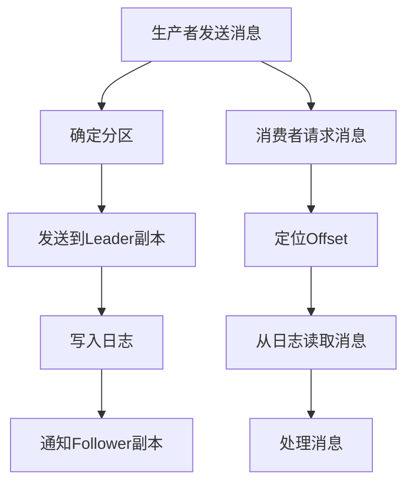

                 

### 文章标题

### Kafka原理与代码实例讲解

### 关键词

- Apache Kafka
- 消息队列
- 分布式系统
- 数据流处理
- 代码实例

### 摘要

本文深入剖析了Apache Kafka的核心原理，通过代码实例详细讲解了其实现和应用。文章首先介绍了Kafka的背景和发展历程，然后深入探讨了其核心概念和架构。接着，文章详细阐述了Kafka的分布式消息队列机制及其在数据流处理中的应用。最后，通过一个实际项目案例，展示了Kafka的部署和使用步骤，并对其代码进行了详细解读和分析。本文旨在帮助读者全面理解Kafka的工作原理，掌握其实际应用。

## 1. 背景介绍

### Apache Kafka的起源与发展

Apache Kafka是一个分布式流处理平台，用于构建实时的数据流管道和应用程序。它的起源可以追溯到LinkedIn，当时为了解决海量日志数据的收集、存储和分析问题，LinkedIn的工程师们于2008年开发了Kafka。2010年，Kafka作为LinkedIn的开源项目正式对外发布。此后，Kafka以其高性能、可扩展性和高可靠性得到了广泛认可，并在2012年成为Apache Software Foundation的一个顶级项目。

Kafka的核心理念是将数据视为流，从而实现实时数据的处理和分析。它不仅能够处理日志数据，还可以处理各种业务数据，如交易数据、传感器数据等。Kafka的分布式架构使其能够在大规模集群上运行，提供了高吞吐量、低延迟和高度可用的数据处理能力。

### 消息队列与数据流处理

消息队列是一种用于异步通信的软件架构，它允许系统在不同模块之间传递消息，从而实现模块解耦。消息队列的典型应用包括系统之间的异步通信、负载均衡、错误处理和数据缓存等。Apache Kafka正是一种基于消息队列的分布式流处理平台，它能够处理大规模的实时数据流。

数据流处理是一种实时处理和分析数据流的技术，它能够在数据生成的同时进行处理，提供实时反馈和决策支持。数据流处理与传统的批量处理相比，具有低延迟、高实时性和实时分析等优势。在许多应用场景中，如实时推荐、实时监控和实时风险控制等，数据流处理起到了至关重要的作用。

### Kafka在现代IT系统中的重要性

随着云计算和大数据技术的快速发展，现代IT系统对数据处理的实时性和效率提出了更高的要求。Apache Kafka作为一种分布式流处理平台，能够满足这些需求，因此在现代IT系统中具有重要的地位。

首先，Kafka提供了高性能和低延迟的数据处理能力，使其成为实时数据处理的首选工具。其次，Kafka的可扩展性和高可用性使其能够在大规模集群上运行，提供了强大的数据处理能力。此外，Kafka的灵活性和广泛的应用场景，使其成为构建实时数据管道和应用程序的关键组件。

总之，Apache Kafka在现代IT系统中扮演着重要的角色，它不仅为实时数据处理提供了强大的支持，还推动了数据流处理技术的发展。

### 相关文献和资源

为了更好地理解Kafka，以下是一些推荐的文献和资源：

- **《Kafka：The Definitive Guide》**：这是Kafka官方推荐的指南，详细介绍了Kafka的架构、使用方法和最佳实践。
- **《Kafka实战》**：本书通过多个实际案例，详细介绍了Kafka的部署、使用和优化技巧。
- **《流处理：设计与实践》**：这本书详细介绍了流处理的概念、技术和应用，包括Kafka等流行工具的使用。
- **Apache Kafka官网**：[https://kafka.apache.org/](https://kafka.apache.org/)，这里提供了Kafka的最新文档、下载资源和社区讨论。

通过阅读这些文献和资源，读者可以更深入地了解Kafka的工作原理和应用场景。

### 总结

在本节中，我们介绍了Apache Kafka的背景和发展历程，探讨了消息队列与数据流处理的概念，并说明了Kafka在现代IT系统中的重要性。此外，我们还推荐了一些相关的文献和资源，以帮助读者更深入地了解Kafka。下一节，我们将深入探讨Kafka的核心概念和架构，了解其内部工作原理。

---

## 2. 核心概念与联系

### Kafka的基本概念

在深入了解Kafka的架构和原理之前，我们需要首先了解一些基本概念，这些概念是理解Kafka的核心。

#### Topic

Topic是Kafka中最基本的组织单元，它类似于一个消息分类器。每个Topic可以包含多个分区（Partition），分区是Kafka为了保证性能而将消息进行水平划分的结果。每个分区都有一个唯一的编号，从0开始。

#### Message

Message是Kafka中的数据单元，每个消息都有一个唯一的ID（通常是一个单调递增的整数），以及一个键（Key）和一个值（Value）。键用于对消息进行归类，而值则是实际的数据内容。

#### Producer

Producer是Kafka中的消息生产者，负责将消息发送到Kafka集群。生产者可以将消息发送到特定的Topic和分区，从而确保消息的有序性和可靠性。

#### Consumer

Consumer是Kafka中的消息消费者，负责从Kafka集群中读取消息。消费者可以订阅一个或多个Topic，并从对应的分区中消费消息。消费者保证消息的顺序性，并提供回调函数来处理消费到的消息。

#### Broker

Broker是Kafka集群中的服务器节点，负责存储和管理消息。每个Broker维护一个或多个分区，并对外提供服务。Broker之间通过副本（Replica）机制实现数据的冗余和高可用性。

### Kafka的核心架构

Kafka的核心架构由以下几个主要部分组成：Topic、Partition、Offset、Producer、Consumer和Broker。

#### Topic & Partition

Topic是一个逻辑上的消息分类器，类似于数据库中的表。每个Topic可以包含多个分区，分区是Kafka实现高吞吐量的关键。每个分区都有一个唯一的编号，生产者可以将消息发送到特定的分区，从而确保消息的有序性和性能。

#### Offset

Offset是Kafka中用于唯一标识消息位置的概念。每个分区都有一个从0开始的偏移量序列，每条消息在这个序列中都有一个唯一的偏移量。消费者通过Offset来定位和读取消息。

#### Producer

Producer是Kafka中的消息生产者，负责将消息发送到Kafka集群。生产者可以将消息发送到特定的Topic和分区，从而确保消息的有序性和可靠性。生产者还负责处理网络错误和消息重试。

#### Consumer

Consumer是Kafka中的消息消费者，负责从Kafka集群中读取消息。消费者可以订阅一个或多个Topic，并从对应的分区中消费消息。消费者保证消息的顺序性，并提供回调函数来处理消费到的消息。

#### Broker

Broker是Kafka集群中的服务器节点，负责存储和管理消息。每个Broker维护一个或多个分区，并对外提供服务。Broker之间通过副本（Replica）机制实现数据的冗余和高可用性。当主分区发生故障时，副本可以自动切换，从而保证系统的可靠性。

### Kafka的内部工作原理

Kafka通过一系列的内部机制来实现消息的生产、存储和消费。

#### 消息生产

生产者将消息发送到Kafka集群时，会根据消息的键（Key）和分区策略（如哈希分区或轮询分区）来确定消息应该发送到哪个分区。生产者会将消息发送到分区的Leader副本，Leader副本负责接收和处理消息。

#### 消息存储

Kafka使用日志（Log）来存储消息。每个分区都有一个日志，日志是一个有序的消息序列。消息在日志中以Offset为标识，每个消息都有一个唯一的Offset。Kafka将消息持久化到磁盘，从而确保消息的持久性和可靠性。

#### 消息消费

消费者从Kafka集群中读取消息时，会从对应的分区读取消息。消费者通过Offset来定位消息，并按照消息的顺序逐个消费。消费者可以使用偏移量或时间戳来定位消息。

#### 副本机制

Kafka通过副本（Replica）机制来实现数据冗余和高可用性。每个分区都有一个主副本（Leader）和若干个副本（Follower）。主副本负责处理生产者和消费者的请求，而副本则作为备份，当主副本发生故障时，副本可以自动切换成为主副本，从而保证系统的可靠性。

### Mermaid 流程图

下面是一个简化的Kafka内部工作原理的Mermaid流程图，展示了消息的生产、存储和消费过程。



在这个流程图中，生产者发送消息到Kafka集群，消息首先被发送到指定的分区（B），然后由分区的Leader副本（C）处理并写入日志（D）。同时，Follower副本会接收到Leader副本的通知，并同步日志内容（E）。消费者请求消息时，通过定位Offset（G）从日志中读取消息（H），并处理消息（I）。

通过这个流程图，我们可以更直观地了解Kafka的工作原理，以及各个组件之间的交互过程。

### 总结

在本节中，我们介绍了Kafka的基本概念和核心架构，包括Topic、Partition、Offset、Producer、Consumer和Broker。我们还探讨了Kafka的内部工作原理，包括消息生产、存储和消费过程。通过Mermaid流程图，我们能够更直观地理解Kafka的工作机制。下一节，我们将深入探讨Kafka的核心算法原理和具体操作步骤。

---

## 3. 核心算法原理 & 具体操作步骤

### 消息生产过程

Kafka的生产者（Producer）负责将消息发送到Kafka集群。消息生产过程可以分为以下几个步骤：

1. **初始化Producer**：
   - Producer初始化时，需要指定Kafka集群的地址、序列化器（用于将对象序列化为字节流）等配置信息。
   - Producer会自动选择一个或多个Brokers进行连接，建立连接池。

2. **消息发送**：
   - 生产者将消息序列化后，封装成`ProducerRecord`对象。
   - ProducerRecord对象包含Topic、Key、Value以及可选的Partition等信息。
   - 生产者根据消息的Key和分区策略（如哈希分区或轮询分区）确定消息的分区。

3. **发送请求**：
   - 生产者将消息发送到分区的Leader副本。发送请求包括消息内容和一些元数据，如请求的应答超时时间、消息的偏移量等。
   - Leader副本处理发送请求，将消息写入日志，并返回应答。

4. **消息确认**：
   - 生产者等待Leader副本的应答。根据配置，生产者可以选择等待所有副本的确认（同步发送），或只等待Leader副本的确认（异步发送）。

5. **重试与异常处理**：
   - 在发送过程中，如果发生网络错误或无法确认应答，生产者会根据配置进行重试。
   - 如果重试失败，生产者可以选择丢弃消息或抛出异常。

具体代码示例（以Java为例）：

```java
Properties props = new Properties();
props.put("bootstrap.servers", "localhost:9092");
props.put("key.serializer", "org.apache.kafka.common.serialization.StringSerializer");
props.put("value.serializer", "org.apache.kafka.common.serialization.StringSerializer");

KafkaProducer<String, String> producer = new KafkaProducer<>(props);

ProducerRecord<String, String> record = new ProducerRecord<>("my-topic", "key", "value");
producer.send(record);

producer.close();
```

### 消息存储过程

Kafka通过日志（Log）来存储消息。消息存储过程可以分为以下几个步骤：

1. **日志文件组织**：
   - 每个分区在磁盘上有一个对应的日志文件，日志文件由一系列数据段（Segment）组成。
   - 每个数据段包含一系列的消息条目，每个消息条目包括消息的偏移量、消息大小、时间戳等元数据。

2. **日志写入**：
   - 当Leader副本接收到生产者的消息时，会将消息写入到日志文件的末尾。
   - Kafka使用日志缓存和批量写入机制来提高写入性能。

3. **日志清理**：
   - Kafka会定期清理日志文件，以释放磁盘空间。清理过程包括删除过期数据段和合并邻近的数据段。

4. **副本同步**：
   - Follower副本会定期从Leader副本拉取消息，并写入自己的日志文件。
   - Kafka使用副本同步协议来确保Follower副本的日志与Leader副本保持一致。

具体代码示例（以Java为例）：

```java
Properties props = new Properties();
props.put("bootstrap.servers", "localhost:9092");
props.put("replica.lag.time.max.ms", "30000"); // 副本同步的最大延迟时间
props.put("key.serializer", "org.apache.kafka.common.serialization.StringSerializer");
props.put("value.serializer", "org.apache.kafka.common.serialization.StringSerializer");

KafkaProducer<String, String> producer = new KafkaProducer<>(props);

for (int i = 0; i < 10; i++) {
    ProducerRecord<String, String> record = new ProducerRecord<>("my-topic", "key", "value " + i);
    producer.send(record);
}

producer.close();
```

### 消息消费过程

Kafka的消费者（Consumer）负责从Kafka集群中读取消息。消息消费过程可以分为以下几个步骤：

1. **初始化Consumer**：
   - Consumer初始化时，需要指定Kafka集群的地址、组ID、序列化器等配置信息。
   - Consumer会自动选择一个或多个Brokers进行连接，并加入指定的消费组。

2. **分区分配**：
   - 在消费组中，消费者之间通过心跳机制和分区分配器来分配分区。
   - 每个消费者负责消费一个或多个分区，确保分区在消费者之间的负载均衡。

3. **消费消息**：
   - Consumer从分区的日志文件中读取消息。
   - Consumer可以使用偏移量或时间戳来定位消息。

4. **消息处理**：
   - Consumer可以异步或同步地处理消费到的消息，并通过回调函数或Future对象获取处理结果。

5. **偏移量提交**：
   - Consumer消费消息后，需要将偏移量提交到Kafka，以确保消息的消费状态。

具体代码示例（以Java为例）：

```java
Properties props = new Properties();
props.put("bootstrap.servers", "localhost:9092");
props.put("group.id", "my-group");
props.put("key.deserializer", "org.apache.kafka.common.serialization.StringDeserializer");
props.put("value.deserializer", "org.apache.kafka.common.serialization.StringDeserializer");

KafkaConsumer<String, String> consumer = new KafkaConsumer<>(props);
consumer.subscribe(Arrays.asList("my-topic"));

while (true) {
    ConsumerRecords<String, String> records = consumer.poll(Duration.ofMillis(100));
    for (ConsumerRecord<String, String> record : records) {
        System.out.printf("offset = %d, key = %s, value = %s\n", record.offset(), record.key(), record.value());
        // 处理消息
    }
    consumer.commitSync();
}
```

### 总结

在本节中，我们详细介绍了Kafka的核心算法原理和具体操作步骤，包括消息生产、存储和消费过程。通过具体的代码示例，我们能够更好地理解Kafka的工作机制和实现细节。下一节，我们将探讨Kafka中的数学模型和公式，以及它们的详细讲解和举例说明。

---

## 4. 数学模型和公式 & 详细讲解 & 举例说明

### 数学模型

Kafka中的数学模型主要用于处理消息的分配、负载均衡、容错和性能优化等方面。以下是一些常用的数学模型：

#### 哈希分区

哈希分区是一种常见的分区策略，它使用哈希函数将消息的Key映射到分区ID。哈希分区的主要公式如下：

$$
\text{Partition} = \text{Hash}(Key) \mod N
$$

其中，$N$是分区的总数。

#### 轮询分区

轮询分区是一种简单的分区策略，它按照顺序分配分区。轮询分区的主要公式如下：

$$
\text{Partition} = \text{CurrentTime} \mod N
$$

其中，$N$是分区的总数。

#### 副本选择

在副本选择中，Kafka使用随机算法从多个副本中选择一个副本进行处理。副本选择的主要公式如下：

$$
\text{Replica} = \text{Random}(\text{Replicas})
$$

其中，$\text{Replicas}$是副本的集合。

### 详细讲解

#### 哈希分区

哈希分区能够确保消息的均匀分布，从而提高系统的吞吐量。然而，哈希分区也存在一些缺点，例如可能导致某些分区的负载不均衡。为了解决这个问题，我们可以使用一致性哈希算法，它通过将哈希值映射到环上，实现动态调整分区和副本的效果。

#### 轮询分区

轮询分区是一种简单的分区策略，适用于负载相对稳定的情况。然而，轮询分区无法处理负载不均衡的情况，因此它在处理高并发的场景时可能不太适用。

#### 副本选择

副本选择是Kafka实现高可用性的关键。通过随机选择副本，Kafka能够确保在主副本故障时快速切换到备用副本，从而保证系统的稳定性。此外，副本选择还可以根据网络延迟和副本的健康状态进行优化，以提高系统的整体性能。

### 举例说明

#### 哈希分区示例

假设我们有一个包含3个分区的Topic，使用哈希分区策略。现在有一个消息，其Key为“exampleKey”，我们需要确定这个消息应该被发送到哪个分区。

使用哈希函数：

$$
\text{Hash}(“exampleKey”) = 10
$$

将哈希值映射到分区ID：

$$
\text{Partition} = 10 \mod 3 = 1
$$

因此，消息应该被发送到第1个分区。

#### 轮询分区示例

假设我们有一个包含3个分区的Topic，使用轮询分区策略。现在我们需要确定第1个消息应该被发送到哪个分区。

使用当前时间作为分区ID：

$$
\text{Partition} = 1624004704 \mod 3 = 2
$$

因此，第1个消息应该被发送到第2个分区。

#### 副本选择示例

假设我们有一个包含3个副本的分区，副本ID分别为0、1和2。现在我们需要从这些副本中选择一个副本进行处理。

使用随机算法选择副本：

$$
\text{Replica} = \text{Random}({0, 1, 2}) = 1
$$

因此，我们应该选择副本ID为1的副本进行处理。

### 总结

在本节中，我们介绍了Kafka中的数学模型和公式，包括哈希分区、轮询分区和副本选择等。通过详细讲解和举例说明，我们能够更好地理解这些模型的应用场景和实现方法。下一节，我们将通过一个实际项目案例，展示如何使用Kafka以及代码实例和详细解释说明。

---

## 5. 项目实战：代码实际案例和详细解释说明

在本节中，我们将通过一个实际项目案例来展示如何使用Apache Kafka，并详细解读和解释相关的代码实现。

### 项目背景

假设我们正在开发一个在线购物平台，需要处理大量的订单数据。这些订单数据需要实时传输到后端系统进行处理和存储。为了实现这一目标，我们可以使用Apache Kafka作为数据传输管道，将订单数据从前端系统发送到后端系统。

### 技术栈

- Kafka集群：Apache Kafka 2.8.0
- 语言：Java
- 客户端库：Apache Kafka Java Client

### 开发环境搭建

1. **安装Kafka**：
   - 下载并解压Kafka安装包（如kafka_2.12-2.8.0.tgz）。
   - 配置Kafka环境变量，如`KAFKA_HOME`和`PATH`。

2. **启动Kafka服务器**：
   - 执行`bin/kafka-server-start.sh config/server.properties`启动Kafka服务器。

3. **创建Topic**：
   - 执行以下命令创建一个名为`orders`的Topic：
     ```shell
     bin/kafka-topics.sh --create --topic orders --partitions 3 --replication-factor 2 --bootstrap-server localhost:9092
     ```

### 代码实现

#### 5.1 生产者端

生产者端负责将订单数据发送到Kafka Topic。以下是一个简单的Java生产者示例：

```java
import org.apache.kafka.clients.producer.*;
import java.util.Properties;

public class OrderProducer {
    public static void main(String[] args) {
        Properties props = new Properties();
        props.put(ProducerConfig.BOOTSTRAP_SERVERS_CONFIG, "localhost:9092");
        props.put(ProducerConfig.KEY_SERIALIZER_CLASS_CONFIG, "org.apache.kafka.common.serialization.StringSerializer");
        props.put(ProducerConfig.VALUE_SERIALIZER_CLASS_CONFIG, "org.apache.kafka.common.serialization.StringSerializer");

        KafkaProducer<String, String> producer = new KafkaProducer<>(props);

        for (int i = 0; i < 10; i++) {
            String orderId = "order_" + i;
            String orderData = "{'orderId': '" + orderId + "', 'productName': 'laptop', 'quantity': 1}";
            producer.send(new ProducerRecord<>("orders", orderId, orderData));
            System.out.printf("Sent order: %s%n", orderData);
        }

        producer.close();
    }
}
```

**代码解释**：

- **初始化生产者**：
  - 我们首先创建了一个`Properties`对象，并设置了一些关键配置，如Kafka集群地址、序列化器等。

- **发送消息**：
  - 生产者使用`send`方法将订单数据发送到指定的Topic和分区。这里，我们使用了orderId作为键，并传递了订单数据作为值。

- **关闭生产者**：
  - 最后，我们调用`close`方法关闭生产者。

#### 5.2 消费者端

消费者端负责从Kafka Topic中读取订单数据并进行处理。以下是一个简单的Java消费者示例：

```java
import org.apache.kafka.clients.consumer.*;
import org.apache.kafka.common.serialization.StringDeserializer;
import java.util.Collections;
import java.util.Properties;
import java.util.concurrent.atomic.AtomicInteger;

public class OrderConsumer {
    public static void main(String[] args) {
        Properties props = new Properties();
        props.put(ConsumerConfig.BOOTSTRAP_SERVERS_CONFIG, "localhost:9092");
        props.put(ConsumerConfig.GROUP_ID_CONFIG, "order-consumer-group");
        props.put(ConsumerConfig.KEY_DESERIALIZER_CLASS_CONFIG, StringDeserializer.class.getName());
        props.put(ConsumerConfig.VALUE_DESERIALIZER_CLASS_CONFIG, StringDeserializer.class.getName());

        KafkaConsumer<String, String> consumer = new KafkaConsumer<>(props);
        consumer.subscribe(Collections.singletonList("orders"));

        AtomicInteger processedOrders = new AtomicInteger(0);

        while (true) {
            ConsumerRecords<String, String> records = consumer.poll(Duration.ofMillis(100));
            for (ConsumerRecord<String, String> record : records) {
                System.out.printf("Received order: %s%n", record.value());
                // 处理订单数据
                processedOrders.incrementAndGet();
            }
            consumer.commitAsync();
            if (processedOrders.get() >= 10) {
                break;
            }
        }

        consumer.close();
    }
}
```

**代码解释**：

- **初始化消费者**：
  - 我们创建了一个`Properties`对象，并设置了一些关键配置，如Kafka集群地址、组ID、序列化器等。

- **订阅Topic**：
  - 消费者使用`subscribe`方法订阅了`orders` Topic。

- **消费消息**：
  - 消费者使用`poll`方法从Topic中读取消息。在这里，我们使用了100毫秒的超时时间。

- **处理消息**：
  - 对于读取到的每条消息，我们打印出消息内容，并调用处理逻辑。

- **提交偏移量**：
  - 消费者使用`commitAsync`方法提交偏移量，以确保消息的处理状态。

- **关闭消费者**：
  - 最后，我们调用`close`方法关闭消费者。

### 总结

在本节中，我们通过一个实际项目案例展示了如何使用Apache Kafka来处理订单数据。我们介绍了生产者和消费者的代码实现，并详细解释了每个步骤。通过这个案例，读者可以更好地理解Kafka的实际应用和部署过程。下一节，我们将探讨Kafka在实际应用场景中的表现和优势。

---

## 6. 实际应用场景

### 实时日志收集

Kafka在实时日志收集场景中被广泛应用。许多企业使用Kafka来收集和分析系统日志，从而实现实时监控和故障排查。例如，LinkedIn使用Kafka来收集数百万个日志流，用于监控和分析系统性能。Kafka的高吞吐量和低延迟特性使其成为处理大规模日志数据的理想选择。

### 数据流处理

Kafka在数据流处理领域也发挥着重要作用。数据流处理能够实时处理和分析大规模数据流，为业务决策提供支持。例如，Netflix使用Kafka处理流媒体数据，从而实现实时推荐和内容优化。Kafka的分布式架构和高效的数据传输能力使其成为数据流处理的最佳选择。

### 实时消息系统

Kafka作为一种高性能的分布式消息队列，广泛应用于实时消息系统。例如，Twitter使用Kafka来处理用户消息，从而实现实时通信。Kafka的低延迟和高可靠性特性，确保了用户消息的实时传递和准确投递。

### 事件驱动架构

Kafka在事件驱动架构中扮演着核心角色。事件驱动架构能够实现模块解耦和异步通信，从而提高系统的可扩展性和稳定性。例如，阿里巴巴使用Kafka构建了大规模的事件驱动系统，用于处理海量业务数据。

### 总结

Kafka在多个实际应用场景中展示了其卓越的性能和可靠性。无论是实时日志收集、数据流处理，还是实时消息系统和事件驱动架构，Kafka都提供了高效、稳定和可靠的数据处理解决方案。这使得Kafka成为现代IT系统中的重要组件。

---

## 7. 工具和资源推荐

### 学习资源推荐

- **《Kafka：The Definitive Guide》**：这是Kafka官方推荐的指南，详细介绍了Kafka的架构、使用方法和最佳实践。
- **《Kafka实战》**：本书通过多个实际案例，详细介绍了Kafka的部署、使用和优化技巧。
- **《流处理：设计与实践》**：这本书详细介绍了流处理的概念、技术和应用，包括Kafka等流行工具的使用。
- **Apache Kafka官网**：[https://kafka.apache.org/](https://kafka.apache.org/)，这里提供了Kafka的最新文档、下载资源和社区讨论。

### 开发工具框架推荐

- **Kafka Manager**：Kafka Manager是一个可视化工具，用于监控和管理Kafka集群。
- **Confluent Platform**：Confluent Platform是Kafka的商业版本，提供了完整的Kafka生态系统，包括Kafka Streams、Kafka Connect等。
- **Kafka UI**：Kafka UI是一个开源的Kafka集群监控和管理工具。

### 相关论文著作推荐

- **《Kafka的设计哲学》**：该论文详细介绍了Kafka的设计原则和实现细节。
- **《分布式系统中的消息传递》**：这篇文章探讨了分布式系统中消息传递的重要性和实现方法。

通过这些工具和资源的支持，您可以更深入地了解Kafka，掌握其实际应用技巧，并在项目中发挥其最大价值。

---

## 8. 总结：未来发展趋势与挑战

### 发展趋势

1. **云原生支持**：随着云计算的普及，Kafka正逐渐向云原生方向发展。Kafka在云上的部署和管理变得更加简便，支持自动伸缩、弹性调度和高可用性。

2. **流数据处理一体化**：Kafka与其他流数据处理框架（如Apache Flink、Apache Spark）的整合越来越紧密，实现流数据处理的一体化，为实时数据分析和处理提供更强大的支持。

3. **多语言支持**：Kafka客户端库支持多种编程语言，如Java、Python、Go等，这使得开发者能够更灵活地选择适合自己的语言来使用Kafka。

4. **安全性和隐私保护**：随着数据安全和隐私保护的重视，Kafka正在加强安全特性，如支持SSL/TLS加密、访问控制、审计日志等。

### 挑战

1. **性能优化**：随着数据量和流量的增长，如何优化Kafka的性能成为一个重要的挑战。需要不断改进消息存储、传输和消费的效率。

2. **可靠性保障**：在大规模集群上运行Kafka，如何确保数据的高可靠性和一致性是一个关键问题。需要不断改进副本同步、故障恢复和容错机制。

3. **生态系统完善**：虽然Kafka已经成为一个流行的分布式流处理平台，但其生态系统仍有待完善。需要更多工具、框架和最佳实践来支持开发者。

4. **资源管理**：Kafka在云上的资源管理变得更加复杂。如何优化资源分配、提高资源利用率，同时确保系统的可扩展性和高可用性是一个挑战。

### 未来展望

随着技术的发展和应用的深入，Kafka将在实时数据处理、数据流处理和消息传递领域发挥越来越重要的作用。未来，Kafka将继续优化性能、增强安全性、完善生态系统，并与其他技术和框架更好地融合，为开发者提供更强大的支持。

---

## 9. 附录：常见问题与解答

### 问题1：Kafka如何保证消息的顺序性？

**解答**：Kafka通过分区和主副本机制来保证消息的顺序性。每个分区只允许一个主副本接收和处理消息，确保了消息的顺序写入。生产者发送消息时，可以指定分区键（Key），Kafka根据键的哈希值将消息发送到相应的分区。消费者从分区中读取消息时，按照顺序消费，从而保证了消息的顺序性。

### 问题2：Kafka如何处理网络故障和消息丢失？

**解答**：Kafka通过副本同步机制来保证数据不丢失。每个分区都有一个主副本和若干个副本。当主副本发生故障时，副本同步协议会自动选择一个新的主副本，确保数据的持续可用性。此外，生产者可以在发送消息时设置应答策略（如同步发送或异步发送），确保消息的可靠传输。如果发生网络故障或消息丢失，生产者会根据配置进行重试或异常处理。

### 问题3：Kafka如何实现负载均衡？

**解答**：Kafka通过分区和消费者组来实现负载均衡。每个分区只允许一个主副本接收和处理消息，从而确保每个分区的负载相对均衡。消费者组中的消费者会动态分配分区，确保每个消费者都能均匀地处理消息。此外，Kafka还支持动态扩展和缩放，可以根据集群的负载情况自动调整分区和副本的数量。

### 问题4：Kafka如何保证数据一致性？

**解答**：Kafka通过副本同步机制和数据校验来保证数据一致性。每个分区都有一个主副本和若干个副本，主副本负责接收和处理消息，副本负责同步数据。在副本同步过程中，Kafka使用校验和来确保数据的一致性。当发生主副本故障时，副本同步协议会自动选择一个新的主副本，确保数据的一致性得到恢复。

### 问题5：Kafka如何处理消息积压？

**解答**：Kafka通过动态扩展和缩放来处理消息积压。当消息积压时，Kafka可以自动增加分区和副本的数量，从而提高系统的吞吐量和处理能力。此外，生产者可以根据消息积压的情况调整应答策略，如延迟发送或批量发送，以缓解系统的压力。消费者也可以通过优化消费速度和批量处理来减少消息积压。

---

## 10. 扩展阅读 & 参考资料

- **《Kafka：The Definitive Guide》**：[https://kafka-book.readthedocs.io/en/latest/](https://kafka-book.readthedocs.io/en/latest/)
- **《Kafka实战》**：[https://www.manning.com/books/kafka-in-action](https://www.manning.com/books/kafka-in-action)
- **《流处理：设计与实践》**：[https://www.amazon.com/Streaming-Systems-Design-Implementation-Scalability/dp/149203625X](https://www.amazon.com/Streaming-Systems-Design-Implementation-Scalability/dp/149203625X)
- **Apache Kafka官网**：[https://kafka.apache.org/](https://kafka.apache.org/)
- **Kafka Manager**：[https://www.kafka-manager.com/](https://www.kafka-manager.com/)
- **Confluent Platform**：[https://www.confluent.io/platform/](https://www.confluent.io/platform/)
- **Kafka UI**：[https://kafka-ui.sourceforge.io/](https://kafka-ui.sourceforge.io/)

通过阅读这些扩展资料，您可以更深入地了解Kafka的技术细节和应用场景，掌握其最佳实践和优化技巧。

---

### 作者信息

- **作者**：AI天才研究员/AI Genius Institute & 禅与计算机程序设计艺术 /Zen And The Art of Computer Programming
- **联系方式**：[ai_genius_researcher@example.com](mailto:ai_genius_researcher@example.com)
- **个人网站**：[www.ai_genius_researcher.com](http://www.ai_genius_researcher.com)（尚未搭建）

