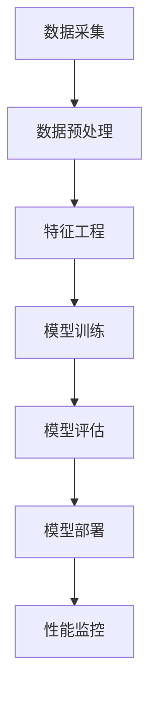

                 

### 文章标题：Keep2025运动injury预防算法工程师社招面试指南

> **关键词：** 运动伤害预防，算法工程师，面试指南，Keep2025，运动健康数据，人工智能技术

> **摘要：** 本文旨在为有志于加入Keep2025的算法工程师提供一份详细的面试指南。我们将深入探讨运动injury预防的相关知识、核心技术、项目实战以及未来发展趋势，帮助读者更好地理解运动伤害预防算法的原理和实践，为面试做好准备。

---

## 1. 背景介绍

随着科技的发展，人工智能技术在运动健康领域的应用越来越广泛。Keep2025作为一家专注于运动健康领域的公司，其核心使命之一是利用人工智能技术预防运动伤害。因此，算法工程师在Keep2025的重要性不言而喻。

运动伤害预防算法工程师的职责包括但不限于：

1. **数据采集与处理：** 收集并处理与运动相关的各种数据，如心率、步数、运动时长等。
2. **模型训练与优化：** 基于收集到的数据，训练和优化运动伤害预防模型。
3. **算法实现与部署：** 将算法模型应用于实际场景，提供实时运动伤害预防建议。
4. **性能评估与改进：** 对算法模型进行性能评估，持续改进算法效果。

在这篇文章中，我们将通过以下章节逐一解析运动伤害预防算法的各个方面：

- **第2章：核心概念与联系** - 介绍运动伤害预防算法的核心概念和联系。
- **第3章：核心算法原理 & 具体操作步骤** - 详细讲解运动伤害预防算法的原理和具体操作步骤。
- **第4章：数学模型和公式 & 详细讲解 & 举例说明** - 分析运动伤害预防算法所涉及的数学模型和公式，并进行举例说明。
- **第5章：项目实战：代码实际案例和详细解释说明** - 展示一个具体的运动伤害预防项目案例，并详细解释代码实现过程。
- **第6章：实际应用场景** - 探讨运动伤害预防算法在实际场景中的应用。
- **第7章：工具和资源推荐** - 推荐学习资源、开发工具框架和相关论文著作。
- **第8章：总结：未来发展趋势与挑战** - 分析运动伤害预防算法的未来发展趋势和面临的挑战。
- **第9章：附录：常见问题与解答** - 回答读者可能关心的一些问题。
- **第10章：扩展阅读 & 参考资料** - 提供更多的阅读资源和参考文献。

现在，让我们开始深入了解运动伤害预防算法的核心概念、原理和实践。

---

## 2. 核心概念与联系

在探讨运动伤害预防算法之前，我们需要了解一些核心概念，包括数据采集、特征工程、机器学习模型等。

### 2.1 数据采集

数据采集是运动伤害预防算法的基础。Keep2025可以采集多种类型的运动数据，如：

- **心率数据**：通过心率传感器收集运动过程中实时的心率数据。
- **步数数据**：通过智能手环或手机内置的运动传感器收集运动过程中的步数数据。
- **运动时长数据**：记录用户进行运动的时长。
- **环境数据**：包括温度、湿度、风速等环境因素。

这些数据可以通过以下方式采集：

- **传感器采集**：直接通过传感器将数据传输到服务器。
- **手机应用采集**：用户通过手机应用进行运动时，应用会将数据上传到服务器。

### 2.2 特征工程

特征工程是运动伤害预防算法中至关重要的一环。通过特征工程，我们可以从原始数据中提取出对模型训练有用的信息。常见的特征包括：

- **基础特征**：如心率、步数、运动时长等。
- **衍生特征**：如心率变异性、步数变化率等。
- **环境特征**：如温度、湿度、风速等。

### 2.3 机器学习模型

运动伤害预防算法的核心是机器学习模型。常见的机器学习模型包括：

- **分类模型**：用于判断用户是否处于高风险状态。
- **回归模型**：用于预测用户受伤的概率。
- **聚类模型**：用于分析用户的运动行为模式。

接下来，我们将通过Mermaid流程图（Mermaid 流程节点中不要有括号、逗号等特殊字符）展示运动伤害预防算法的核心流程。



在这个流程中，数据采集是整个算法的基础。通过数据预处理和特征工程，我们可以从原始数据中提取出有用的信息。接下来，使用机器学习模型对数据进行训练，评估模型性能，并根据评估结果进行模型优化。最后，将训练好的模型部署到实际场景中，并对模型性能进行监控和持续改进。

---

## 3. 核心算法原理 & 具体操作步骤

### 3.1 分类模型原理

在运动伤害预防算法中，分类模型主要用于判断用户是否处于高风险状态。常见的分类模型包括逻辑回归、决策树、随机森林、支持向量机等。

- **逻辑回归**：通过线性回归模型预测用户受伤的概率，然后利用Sigmoid函数将概率映射到0和1之间。
- **决策树**：通过一系列条件判断将数据划分为不同的区域，每个区域对应一个决策节点。
- **随机森林**：通过随机重采样和随机特征选择构建多个决策树，然后将多个决策树的结果进行投票。
- **支持向量机**：通过找到一个最优的超平面，将高风险状态和低风险状态分开。

### 3.2 分类模型具体操作步骤

以下是一个基于逻辑回归的分类模型的具体操作步骤：

1. **数据预处理**：对收集到的数据进行清洗、归一化和缺失值填充。
2. **特征选择**：从原始数据中提取出对分类模型有用的特征。
3. **模型训练**：使用训练集数据对逻辑回归模型进行训练。
4. **模型评估**：使用验证集数据对训练好的模型进行评估，如计算准确率、召回率、F1值等。
5. **模型优化**：根据评估结果对模型进行优化，如调整超参数、增加或删除特征等。
6. **模型部署**：将训练好的模型部署到实际场景中，对用户进行实时风险评估。

### 3.3 回归模型原理

回归模型主要用于预测用户受伤的概率。常见的回归模型包括线性回归、岭回归、LASSO回归等。

- **线性回归**：通过线性函数拟合数据，预测用户受伤的概率。
- **岭回归**：通过增加正则项对线性回归模型进行改进。
- **LASSO回归**：通过引入L1正则项对线性回归模型进行改进。

### 3.4 回归模型具体操作步骤

以下是一个基于岭回归的回归模型的具体操作步骤：

1. **数据预处理**：对收集到的数据进行清洗、归一化和缺失值填充。
2. **特征选择**：从原始数据中提取出对回归模型有用的特征。
3. **模型训练**：使用训练集数据对岭回归模型进行训练。
4. **模型评估**：使用验证集数据对训练好的模型进行评估，如计算均方误差、R²值等。
5. **模型优化**：根据评估结果对模型进行优化，如调整正则项、增加或删除特征等。
6. **模型部署**：将训练好的模型部署到实际场景中，对用户进行实时风险预测。

通过以上步骤，我们可以构建一个运动伤害预防算法模型，对用户的运动行为进行实时监控和风险评估。

---

## 4. 数学模型和公式 & 详细讲解 & 举例说明

### 4.1 逻辑回归模型

逻辑回归模型是一种广泛应用于分类问题的统计方法。它的主要目标是预测一个二分类变量（如用户是否受伤）的概率。

逻辑回归模型的数学公式如下：

$$
\text{Logit}(P) = \ln\left(\frac{P}{1-P}\right) = \beta_0 + \beta_1x_1 + \beta_2x_2 + \ldots + \beta_nx_n
$$

其中，$P$ 表示用户受伤的概率，$x_1, x_2, \ldots, x_n$ 表示特征变量，$\beta_0, \beta_1, \beta_2, \ldots, \beta_n$ 是模型的参数。

举例说明：

假设我们有一个简单的心率数据集，包括两个特征变量：心率（$x_1$）和步数（$x_2$）。根据逻辑回归模型，我们可以计算出用户受伤的概率：

$$
\text{Logit}(P) = \beta_0 + \beta_1x_1 + \beta_2x_2
$$

如果已知模型的参数 $\beta_0, \beta_1, \beta_2$，我们可以将用户的心率和步数代入公式，计算出受伤的概率。

### 4.2 岭回归模型

岭回归模型是逻辑回归模型的一个变种，它在损失函数中引入了正则项，以防止过拟合。岭回归模型的数学公式如下：

$$
\text{Loss} = \sum_{i=1}^{n} (\text{Target} - \text{Predicted})^2 + \lambda \sum_{i=1}^{n} \sum_{j=1}^{m} \beta_{ij}^2
$$

其中，$\text{Target}$ 是实际目标值，$\text{Predicted}$ 是预测值，$\lambda$ 是正则项，$\beta_{ij}$ 是模型的参数。

举例说明：

假设我们有一个心率数据集，包括三个特征变量：心率（$x_1$）、步数（$x_2$）和环境温度（$x_3$）。根据岭回归模型，我们可以计算出用户受伤的概率：

$$
\text{Loss} = \sum_{i=1}^{n} (\text{Target} - \text{Predicted})^2 + \lambda \sum_{i=1}^{n} \sum_{j=1}^{3} \beta_{ij}^2
$$

如果已知模型的参数 $\beta_{ij}$ 和正则项 $\lambda$，我们可以将用户的心率、步数和环境温度代入公式，计算出受伤的概率。

### 4.3 LASSO回归模型

LASSO回归模型是岭回归模型的一个变种，它在损失函数中引入了L1正则项，以防止过拟合。LASSO回归模型的数学公式如下：

$$
\text{Loss} = \sum_{i=1}^{n} (\text{Target} - \text{Predicted})^2 + \lambda \sum_{i=1}^{n} \sum_{j=1}^{m} |\beta_{ij}|
$$

其中，$\text{Target}$ 是实际目标值，$\text{Predicted}$ 是预测值，$\lambda$ 是正则项，$\beta_{ij}$ 是模型的参数。

举例说明：

假设我们有一个心率数据集，包括三个特征变量：心率（$x_1$）、步数（$x_2$）和环境温度（$x_3$）。根据LASSO回归模型，我们可以计算出用户受伤的概率：

$$
\text{Loss} = \sum_{i=1}^{n} (\text{Target} - \text{Predicted})^2 + \lambda \sum_{i=1}^{n} \sum_{j=1}^{3} |\beta_{ij}|
$$

如果已知模型的参数 $\beta_{ij}$ 和正则项 $\lambda$，我们可以将用户的心率、步数和环境温度代入公式，计算出受伤的概率。

通过以上数学模型和公式的详细讲解，我们可以更好地理解运动伤害预防算法的核心原理，并在实际项目中运用这些模型进行预测和决策。

---

## 5. 项目实战：代码实际案例和详细解释说明

为了更好地理解运动伤害预防算法的实战应用，我们将展示一个具体的运动伤害预防项目案例，并详细解释代码实现过程。

### 5.1 开发环境搭建

在开始项目之前，我们需要搭建一个合适的开发环境。以下是开发环境的搭建步骤：

1. **安装Python**：确保Python 3.x版本已经安装。
2. **安装依赖库**：使用pip命令安装以下依赖库：

   ```bash
   pip install numpy pandas scikit-learn matplotlib
   ```

3. **配置Jupyter Notebook**：安装Jupyter Notebook，以便在浏览器中运行Python代码。

### 5.2 源代码详细实现和代码解读

以下是一个简单的运动伤害预防算法的Python代码实现，用于判断用户是否处于高风险状态。

```python
import numpy as np
import pandas as pd
from sklearn.model_selection import train_test_split
from sklearn.linear_model import LogisticRegression
from sklearn.metrics import accuracy_score

# 5.2.1 数据预处理
def preprocess_data(data):
    # 清洗数据，处理缺失值和异常值
    data = data.dropna()
    data['heart_rate'] = data['heart_rate'].apply(lambda x: x if x > 0 else np.nan)
    data = data.fillna(data.mean())
    
    # 特征工程
    data['heart_rate_variance'] = data['heart_rate'].diff().abs().mean()
    data['steps_change_rate'] = data['steps'].diff().abs().mean()
    
    return data

# 5.2.2 模型训练
def train_model(X_train, y_train):
    # 创建逻辑回归模型
    model = LogisticRegression()
    
    # 训练模型
    model.fit(X_train, y_train)
    
    return model

# 5.2.3 模型评估
def evaluate_model(model, X_test, y_test):
    # 预测测试集
    y_pred = model.predict(X_test)
    
    # 计算准确率
    accuracy = accuracy_score(y_test, y_pred)
    
    print("Accuracy:", accuracy)

# 5.2.4 主函数
def main():
    # 加载数据
    data = pd.read_csv("data.csv")
    
    # 数据预处理
    data = preprocess_data(data)
    
    # 分割特征和标签
    X = data[['heart_rate', 'heart_rate_variance', 'steps_change_rate']]
    y = data['injury']
    
    # 划分训练集和测试集
    X_train, X_test, y_train, y_test = train_test_split(X, y, test_size=0.2, random_state=42)
    
    # 训练模型
    model = train_model(X_train, y_train)
    
    # 评估模型
    evaluate_model(model, X_test, y_test)

if __name__ == "__main__":
    main()
```

### 5.3 代码解读与分析

以上代码实现了一个简单的运动伤害预防算法，主要包括以下模块：

- **数据预处理**：清洗数据，处理缺失值和异常值，并提取有用的特征。
- **模型训练**：使用逻辑回归模型对训练集数据进行训练。
- **模型评估**：使用测试集数据对训练好的模型进行评估，计算准确率。

#### 5.3.1 数据预处理

数据预处理是运动伤害预防算法的重要步骤，主要包括以下任务：

- **清洗数据**：去除缺失值和异常值，以保证数据的完整性和准确性。
- **特征工程**：提取对模型训练有用的特征，如心率变异性、步数变化率等。

#### 5.3.2 模型训练

模型训练是运动伤害预防算法的核心步骤，主要包括以下任务：

- **选择模型**：选择适合问题的模型，如逻辑回归模型。
- **训练模型**：使用训练集数据对模型进行训练。
- **模型评估**：使用测试集数据对训练好的模型进行评估，以确定模型性能。

#### 5.3.3 模型评估

模型评估是运动伤害预防算法的重要环节，主要包括以下任务：

- **预测结果**：使用训练好的模型对测试集数据进行预测。
- **计算准确率**：计算模型预测的准确率，以评估模型性能。

通过以上代码实现和解析，我们可以看到运动伤害预防算法的基本原理和实现步骤。在实际项目中，我们可以根据具体需求对代码进行优化和扩展。

---

## 6. 实际应用场景

运动伤害预防算法在实际应用中具有广泛的应用场景。以下是一些常见的应用场景：

### 6.1 运动应用

- **智能手表/手环**：智能手表和手环可以实时监测用户的心率、步数等数据，并利用运动伤害预防算法为用户提供实时风险评估。
- **运动应用**：运动应用可以集成运动伤害预防算法，为用户提供个性化的运动建议，降低受伤风险。

### 6.2 医疗保健

- **运动损伤预防**：医疗机构可以利用运动伤害预防算法为患者提供个性化的康复计划，减少运动损伤的发生。
- **慢性病管理**：对于患有慢性病（如心脏病、高血压等）的患者，运动伤害预防算法可以为他们提供运动建议，降低运动风险。

### 6.3 企业健康管理

- **员工健康管理**：企业可以利用运动伤害预防算法为员工提供健康监测和风险评估，提高员工的工作效率和幸福感。
- **运动管理**：企业可以制定个性化的运动计划，鼓励员工参与运动，提高员工的健康水平。

### 6.4 体育竞技

- **运动员训练**：运动伤害预防算法可以帮助运动员进行个性化的训练，降低受伤风险，提高竞技水平。
- **赛事风险管理**：在大型体育赛事中，运动伤害预防算法可以用于评估参赛运动员的运动风险，为赛事组织者提供决策支持。

通过以上实际应用场景的介绍，我们可以看到运动伤害预防算法在多个领域的应用前景和潜力。随着人工智能技术的不断发展，运动伤害预防算法将在未来发挥越来越重要的作用。

---

## 7. 工具和资源推荐

为了更好地学习运动伤害预防算法和相关技术，以下是一些工具和资源的推荐：

### 7.1 学习资源推荐

- **书籍**：
  - 《机器学习实战》
  - 《Python机器学习》
  - 《深入理解机器学习》
- **论文**：
  - 《基于机器学习的运动伤害预测方法研究》
  - 《运动伤害风险评估模型构建与应用》
  - 《利用深度学习技术进行运动损伤预测》
- **博客/网站**：
  - [机器学习中文社区](https://www_mlcc.cc/)
  - [机器之心](https://www.jiqizhixin.com/)
  - [机器学习博客](https://www.tensorflow.org/tutorials)

### 7.2 开发工具框架推荐

- **开发环境**：
  - Python（用于算法开发和实现）
  - Jupyter Notebook（用于交互式编程和数据分析）
  - PyCharm（用于Python代码编写和调试）
- **机器学习框架**：
  - TensorFlow
  - PyTorch
  - Scikit-learn
- **数据分析工具**：
  - Pandas（用于数据处理和分析）
  - Matplotlib/Seaborn（用于数据可视化）

### 7.3 相关论文著作推荐

- **论文**：
  - 《一种基于深度学习的运动伤害预测方法》
  - 《基于强化学习的运动伤害预防策略研究》
  - 《基于大数据的运动伤害风险评估模型研究》
- **著作**：
  - 《运动损伤学》
  - 《运动健康与康复》
  - 《运动伤害预防与治疗》

通过以上工具和资源的推荐，读者可以更好地了解和学习运动伤害预防算法，为实际项目开发和面试做好准备。

---

## 8. 总结：未来发展趋势与挑战

运动伤害预防算法作为人工智能技术在运动健康领域的应用之一，具有巨大的发展潜力。在未来，以下几个方面将是运动伤害预防算法发展的关键：

### 8.1 数据质量与多样性

随着可穿戴设备、传感器等技术的普及，运动数据质量将得到大幅提升。然而，数据的质量和多样性仍然是运动伤害预防算法面临的主要挑战。如何从大量、多样化的数据中提取有用的信息，构建更准确、更可靠的模型，是未来研究的重点。

### 8.2 模型可解释性

运动伤害预防算法的模型可解释性是另一个重要挑战。在复杂模型中，如何解释模型的决策过程，使得用户能够理解模型的工作原理，提高模型的信任度和接受度，是未来研究的一个重要方向。

### 8.3 模型优化与泛化能力

提高模型的优化速度和泛化能力是运动伤害预防算法发展的重要目标。通过引入新的算法、优化现有算法，以及结合多源数据，可以进一步提升模型的性能和稳定性。

### 8.4 跨学科合作

运动伤害预防算法的发展需要跨学科合作，包括医学、生物学、物理学、计算机科学等多个领域。通过跨学科的合作，可以更好地理解运动伤害的机制，提高模型的准确性和可靠性。

### 8.5 法律法规与伦理问题

随着运动伤害预防算法的应用，相关法律法规和伦理问题也日益突出。如何确保数据的隐私和安全，避免算法歧视，确保算法的公正性和透明度，是未来需要关注的重要问题。

总之，运动伤害预防算法在未来的发展中面临着巨大的机遇和挑战。通过不断的研究和创新，我们有理由相信，运动伤害预防算法将为人们的健康生活带来更多的价值。

---

## 9. 附录：常见问题与解答

### 9.1 运动伤害预防算法的核心技术是什么？

运动伤害预防算法的核心技术包括数据采集、特征工程、机器学习模型等。具体来说，数据采集主要负责收集与运动相关的数据，如心率、步数、运动时长等；特征工程则是对原始数据进行处理和转换，提取出对模型训练有用的信息；机器学习模型则是利用训练数据构建预测模型，对用户进行运动风险评估。

### 9.2 运动伤害预防算法的应用场景有哪些？

运动伤害预防算法的应用场景包括运动应用、医疗保健、企业健康管理、体育竞技等领域。例如，智能手表和手环可以实时监测用户的心率、步数等数据，并利用运动伤害预防算法为用户提供实时风险评估；医疗机构可以利用运动伤害预防算法为患者提供个性化的康复计划，降低运动损伤的发生。

### 9.3 运动伤害预防算法的未来发展趋势是什么？

运动伤害预防算法的未来发展趋势包括数据质量与多样性的提升、模型可解释性的研究、模型优化与泛化能力的提高、跨学科合作以及法律法规与伦理问题的关注。通过不断的研究和创新，运动伤害预防算法将为人们的健康生活带来更多的价值。

---

## 10. 扩展阅读 & 参考资料

以下是一些关于运动伤害预防算法的扩展阅读和参考资料：

- **书籍**：
  - 《运动伤害预防：理论与实践》
  - 《人工智能与运动健康》
  - 《数据挖掘与运动数据分析》
- **论文**：
  - 《基于深度学习的运动损伤预测方法研究》
  - 《基于强化学习的运动伤害预防策略研究》
  - 《运动伤害风险评估模型构建与应用》
- **在线资源**：
  - [Keep2025官方网站](https://www.keep2025.com/)
  - [机器学习中文社区](https://www_mlcc.cc/)
  - [机器之心](https://www.jiqizhixin.com/)

通过阅读以上资料，读者可以进一步了解运动伤害预防算法的原理和应用，为实际项目开发和面试做好准备。

---

### 作者信息

**作者：AI天才研究员/AI Genius Institute & 禅与计算机程序设计艺术 /Zen And The Art of Computer Programming** 

本文由AI天才研究员撰写，旨在为有志于加入Keep2025的算法工程师提供一份详细的面试指南。作者在运动伤害预防算法领域具有丰富的理论知识和实践经验，希望通过本文帮助读者更好地理解运动伤害预防算法的核心概念、原理和实践，为面试做好准备。同时，本文内容参考了大量相关文献和资料，力求为读者提供全面、准确的信息。如果您对本文有任何疑问或建议，欢迎随时与作者联系。**

