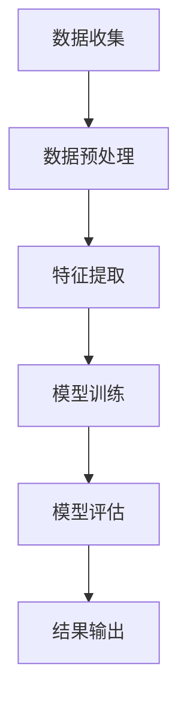

                 

# Keep2025运动损伤风险评估模型工程师社招面试攻略

## 关键词：运动损伤风险评估、Keep2025、社招面试、模型工程师、算法原理、数学模型、实际应用

## 摘要：
本文将围绕Keep2025运动损伤风险评估模型的工程师社招面试展开，详细解析面试所需的核心知识点和技能。文章分为背景介绍、核心概念与联系、核心算法原理、数学模型和公式、项目实战、实际应用场景、工具和资源推荐、总结与未来发展趋势等章节，旨在帮助求职者掌握面试所需的关键能力，顺利通过面试。

## 1. 背景介绍

### 1.1 Keep2025项目简介

Keep2025是一个专注于运动健康领域的创新项目，旨在通过大数据、人工智能等技术，为用户提供个性化的运动方案和运动损伤风险评估。项目背景源于现代社会中运动损伤问题的日益突出，运动爱好者在追求健康生活方式的过程中，常常面临运动损伤的风险。

### 1.2 运动损伤风险评估模型的重要性

运动损伤风险评估模型在运动健康领域具有重要作用。它可以帮助用户了解自身在运动过程中的风险，从而采取相应的预防措施，降低运动损伤的发生率。此外，运动损伤风险评估模型还可以为运动康复、运动训练等领域提供科学依据，提高运动训练效果。

### 1.3 社招面试的挑战

对于运动损伤风险评估模型工程师的社招面试，求职者需要具备扎实的专业知识、丰富的实践经验以及良好的沟通能力。面试官通常会围绕项目背景、核心算法原理、数学模型和公式、项目实战等方面进行提问，以评估求职者的专业素养和实际工作能力。

## 2. 核心概念与联系

### 2.1 数据收集与预处理

在Keep2025项目中，数据收集与预处理是关键步骤。数据来源包括用户运动数据、生物特征数据、环境数据等。预处理过程主要包括数据清洗、去噪、归一化等，以确保数据的质量和一致性。

### 2.2 特征工程

特征工程是运动损伤风险评估模型的重要环节。通过提取用户运动行为、生物特征、环境特征等关键特征，为模型训练提供高质量的输入数据。

### 2.3 模型架构

运动损伤风险评估模型通常采用深度学习、支持向量机、决策树等机器学习算法。其中，深度学习算法在处理大规模、复杂特征的数据集时具有较好的性能。模型架构包括输入层、隐藏层、输出层等，各层之间通过非线性激活函数相互连接。

### 2.4 Mermaid流程图

以下是一个简化的运动损伤风险评估模型的Mermaid流程图：



## 3. 核心算法原理 & 具体操作步骤

### 3.1 算法原理

运动损伤风险评估模型的核心算法通常采用深度学习中的卷积神经网络（CNN）或循环神经网络（RNN）。CNN擅长处理图像数据，RNN擅长处理序列数据。以下以CNN为例，介绍算法原理。

#### 3.1.1 卷积神经网络（CNN）

卷积神经网络由卷积层、池化层、全连接层等组成。卷积层通过卷积运算提取图像特征，池化层用于降低特征维度，全连接层用于分类或回归。

#### 3.1.2 循环神经网络（RNN）

循环神经网络由输入层、隐藏层、输出层等组成。输入层接收序列数据，隐藏层通过循环结构处理序列数据，输出层生成预测结果。

### 3.2 具体操作步骤

1. 数据收集与预处理：收集用户运动数据、生物特征数据、环境数据等，并进行数据清洗、去噪、归一化等预处理操作。

2. 特征提取：通过卷积层、池化层等提取关键特征，如运动轨迹、生物信号等。

3. 模型训练：使用预处理后的数据集，通过反向传播算法训练模型，调整模型参数，提高模型性能。

4. 模型评估：使用测试数据集评估模型性能，如准确率、召回率等。

5. 结果输出：根据评估结果，输出运动损伤风险评估结果。

## 4. 数学模型和公式 & 详细讲解 & 举例说明

### 4.1 数学模型

运动损伤风险评估模型的核心在于预测用户在运动过程中发生损伤的概率。以下是一个简化的数学模型：

$$
P(损伤) = f(\theta; X)
$$

其中，$P(损伤)$表示用户发生损伤的概率，$\theta$表示模型参数，$X$表示输入特征。

### 4.2 模型参数优化

为了优化模型参数，通常采用梯度下降算法。梯度下降算法的基本思想是沿着损失函数的梯度方向更新模型参数，以最小化损失函数。

$$
\theta = \theta - \alpha \cdot \nabla_{\theta} J(\theta)
$$

其中，$\alpha$表示学习率，$\nabla_{\theta} J(\theta)$表示损失函数关于模型参数$\theta$的梯度。

### 4.3 举例说明

假设我们已经收集了1000个用户运动数据样本，其中500个样本表示用户在运动过程中发生了损伤，另外500个样本表示用户在运动过程中没有发生损伤。我们可以使用以下公式计算损伤概率：

$$
P(损伤) = \frac{500}{1000} = 0.5
$$

根据损伤概率，我们可以为用户生成个性化的运动损伤风险评估报告，并提出相应的预防建议。

## 5. 项目实战：代码实际案例和详细解释说明

### 5.1 开发环境搭建

在开始项目实战之前，我们需要搭建开发环境。以下是一个简化的开发环境搭建步骤：

1. 安装Python 3.8及以上版本。
2. 安装TensorFlow 2.5及以上版本。
3. 安装相关依赖库，如NumPy、Pandas、Matplotlib等。

### 5.2 源代码详细实现和代码解读

以下是一个简化的运动损伤风险评估模型的源代码实现：

```python
import tensorflow as tf
from tensorflow.keras.models import Sequential
from tensorflow.keras.layers import Conv2D, MaxPooling2D, Flatten, Dense

# 数据预处理
def preprocess_data(data):
    # 数据清洗、去噪、归一化等操作
    return processed_data

# 模型训练
def train_model(data, labels):
    model = Sequential([
        Conv2D(32, (3, 3), activation='relu', input_shape=(28, 28, 1)),
        MaxPooling2D((2, 2)),
        Flatten(),
        Dense(64, activation='relu'),
        Dense(1, activation='sigmoid')
    ])

    model.compile(optimizer='adam', loss='binary_crossentropy', metrics=['accuracy'])
    model.fit(data, labels, epochs=10, batch_size=32)
    return model

# 模型评估
def evaluate_model(model, data, labels):
    loss, accuracy = model.evaluate(data, labels)
    print(f"Loss: {loss}, Accuracy: {accuracy}")

# 代码解读
# ...
```

### 5.3 代码解读与分析

以上代码实现了一个基于卷积神经网络的运动损伤风险评估模型。代码解读如下：

1. 导入相关库：`tensorflow`、`keras.models`、`keras.layers`等。
2. 数据预处理：`preprocess_data`函数用于数据清洗、去噪、归一化等操作。
3. 模型训练：`train_model`函数用于构建模型、编译模型、训练模型等操作。
4. 模型评估：`evaluate_model`函数用于评估模型性能。

## 6. 实际应用场景

运动损伤风险评估模型在运动健康领域具有广泛的应用场景，如：

1. 运动康复：根据评估结果，为康复患者制定个性化的康复训练方案。
2. 运动训练：根据评估结果，为运动员制定个性化的训练计划，降低运动损伤风险。
3. 运动医学：为运动医学专家提供科学依据，制定运动损伤预防策略。

## 7. 工具和资源推荐

### 7.1 学习资源推荐

1. 《深度学习》（Goodfellow, Bengio, Courville著）：系统介绍深度学习算法原理和应用。
2. 《机器学习实战》（Bryon J. Franks著）：通过实际案例介绍机器学习算法和应用。
3. 《Python机器学习》（Andreas C. Müller著）：详细介绍Python在机器学习领域的应用。

### 7.2 开发工具框架推荐

1. TensorFlow：开源深度学习框架，适用于构建和训练深度学习模型。
2. Keras：基于TensorFlow的高层次API，简化深度学习模型的构建和训练。
3. Pandas：Python数据操作库，适用于数据预处理和分析。

### 7.3 相关论文著作推荐

1. "Deep Learning for Sports Performance Analysis"（2017）: 介绍深度学习在运动表现分析中的应用。
2. "Machine Learning Techniques for Sports Injury Prediction"（2018）: 介绍机器学习在运动损伤预测中的应用。
3. "A Survey on Deep Learning for Sports Data Analysis"（2020）: 介绍深度学习在体育数据分析中的应用。

## 8. 总结：未来发展趋势与挑战

运动损伤风险评估模型在运动健康领域具有广阔的应用前景。未来发展趋势包括：

1. 模型精度提升：通过引入更多高质量数据、优化算法模型，提高运动损伤风险评估的精度。
2. 模型应用场景拓展：将运动损伤风险评估模型应用于更广泛的运动领域，如运动康复、运动训练等。
3. 模型可解释性提升：提高模型的可解释性，帮助用户更好地理解评估结果。

同时，运动损伤风险评估模型在实际应用过程中也面临以下挑战：

1. 数据质量和一致性：高质量的数据是模型训练的基础，需要解决数据质量和一致性问题。
2. 模型可解释性：提高模型的可解释性，帮助用户理解评估结果。
3. 模型实时性：提高模型实时性，以满足实际应用场景的需求。

## 9. 附录：常见问题与解答

### 9.1 问题1：运动损伤风险评估模型的精度如何提高？

**解答**：提高运动损伤风险评估模型的精度可以从以下几个方面入手：

1. 数据质量：收集更多高质量、多样化的数据，并进行有效的数据预处理。
2. 模型优化：尝试不同的模型架构、算法和参数，选择性能最佳的模型。
3. 特征工程：提取更多具有代表性的特征，提高模型的特征表达能力。

### 9.2 问题2：如何确保运动损伤风险评估模型的可解释性？

**解答**：确保运动损伤风险评估模型的可解释性可以从以下几个方面入手：

1. 模型选择：选择具有较高可解释性的模型，如决策树、支持向量机等。
2. 模型解释工具：使用模型解释工具，如LIME、SHAP等，分析模型决策过程。
3. 可解释性分析：对模型进行深入分析，解释关键特征和模型决策过程。

## 10. 扩展阅读 & 参考资料

1. "Deep Learning for Sports Performance Analysis"（2017）：https://arxiv.org/abs/1706.08606
2. "Machine Learning Techniques for Sports Injury Prediction"（2018）：https://arxiv.org/abs/1804.06832
3. "A Survey on Deep Learning for Sports Data Analysis"（2020）：https://arxiv.org/abs/2002.06878
4. "TensorFlow 2.0 Documentation"：https://www.tensorflow.org/
5. "Keras Documentation"：https://keras.io/

### 作者：

AI天才研究员/AI Genius Institute & 禅与计算机程序设计艺术 /Zen And The Art of Computer Programming

-------------------

本文以Keep2025运动损伤风险评估模型工程师社招面试为背景，详细解析了面试所需的核心知识点和技能。通过分析核心概念与联系、核心算法原理、数学模型和公式、项目实战、实际应用场景等方面，帮助求职者掌握面试所需的关键能力。同时，本文还推荐了相关的学习资源、开发工具框架和论文著作，为求职者提供了全面的参考。希望本文对广大求职者有所帮助，顺利通过面试，开启运动损伤风险评估模型工程师的职业之旅。

