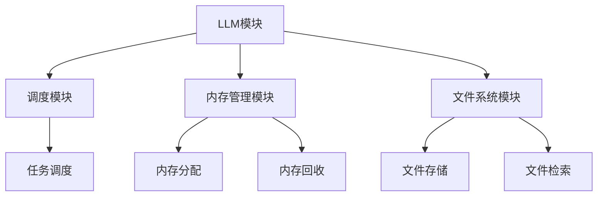

                 

# LLMA OS: 操作系统新星的诞生

> **关键词**: 操作系统，LLMA，架构，算法，人工智能

> **摘要**: 本文将深入探讨LLMA OS——一个基于人工智能的下一代操作系统，从背景介绍到核心概念、算法原理、实际应用等多个角度进行详细解析。本文旨在为读者提供一份全面、深入的操作系统知识指南，并探讨其在未来的发展趋势与挑战。

## 1. 背景介绍

随着计算机技术的飞速发展，操作系统作为计算机系统的基础软件，其重要性日益凸显。传统的操作系统设计以计算机硬件为基础，主要关注资源调度、进程管理、内存管理等方面。然而，随着人工智能技术的崛起，特别是大型语言模型（LLM）的出现，操作系统领域迎来了新的变革。

LLM OS，即基于大型语言模型的操作系统，是这一变革的产物。与传统操作系统相比，LLMA OS在数据处理、任务调度、智能交互等方面具有显著优势。本文将围绕LLMA OS的核心概念、算法原理、应用场景等方面进行详细探讨。

### 1.1 传统操作系统的局限性

传统操作系统在设计时主要考虑硬件资源的调度和利用。例如，进程管理主要关注进程的创建、调度和销毁；内存管理主要关注内存的分配和回收；文件系统主要关注文件的存储和检索。然而，随着计算机硬件的快速发展，传统操作系统的设计理念逐渐暴露出以下局限性：

1. **资源利用率低**：传统操作系统在资源分配和调度方面往往采用简单的策略，导致资源利用率较低。
2. **扩展性差**：传统操作系统在设计时主要考虑特定硬件环境，难以适应不同硬件平台的扩展需求。
3. **任务调度不智能**：传统操作系统在任务调度方面主要依据固定策略，无法根据实际任务需求进行智能调整。
4. **人机交互不友好**：传统操作系统在用户交互方面主要依赖于命令行界面或图形界面，用户操作复杂，用户体验不佳。

### 1.2 人工智能时代的操作系统需求

随着人工智能技术的快速发展，对操作系统的需求也发生了显著变化。人工智能技术对操作系统提出了以下新需求：

1. **智能数据处理**：人工智能系统需要高效地处理大量数据，对操作系统的数据处理能力提出了更高要求。
2. **自适应任务调度**：人工智能系统在运行过程中需要根据任务需求进行动态调整，对操作系统的任务调度能力提出了新挑战。
3. **智能人机交互**：人工智能系统需要与用户进行智能交互，对操作系统的用户界面和交互能力提出了新要求。
4. **资源高效利用**：人工智能系统需要充分利用系统资源，对操作系统的资源管理能力提出了新挑战。

## 2. 核心概念与联系

### 2.1 大型语言模型（LLM）

大型语言模型（LLM）是人工智能领域的一项重要技术，其核心思想是通过大规模语料训练，使模型具备理解和生成自然语言的能力。LLM在自然语言处理、文本生成、问答系统等领域具有广泛应用。

LLM的基本结构包括：

1. **词嵌入**：将单词转换为向量表示。
2. **编码器**：对输入文本进行编码，提取文本特征。
3. **解码器**：根据编码器提取的特征生成输出文本。

### 2.2 操作系统核心概念

操作系统是计算机系统的基础软件，主要负责硬件资源的调度和管理，为应用程序提供运行环境。操作系统的核心概念包括：

1. **进程**：计算机程序在执行过程中的一次活动。
2. **线程**：进程中的执行单元。
3. **内存管理**：负责内存的分配和回收。
4. **文件系统**：负责文件的存储和检索。

### 2.3 LLM OS架构

LLM OS是一种基于人工智能的操作系统，其架构包括：

1. **LLM模块**：负责自然语言处理和智能交互。
2. **调度模块**：负责任务调度和资源分配。
3. **内存管理模块**：负责内存的分配和回收。
4. **文件系统模块**：负责文件的存储和检索。

### 2.4 Mermaid 流程图

以下是LLM OS架构的Mermaid流程图：



## 3. 核心算法原理 & 具体操作步骤

### 3.1 LLM OS算法原理

LLM OS的核心算法包括：

1. **自然语言处理算法**：基于LLM的自然语言处理算法，用于理解用户输入和生成智能回复。
2. **任务调度算法**：基于人工智能的任务调度算法，用于根据任务需求动态调整资源分配。
3. **内存管理算法**：基于人工智能的内存管理算法，用于根据程序需求动态调整内存分配。
4. **文件系统管理算法**：基于人工智能的文件系统管理算法，用于根据文件需求动态调整文件存储和检索策略。

### 3.2 具体操作步骤

以下是LLM OS的具体操作步骤：

1. **初始化**：启动LLM OS，加载LLM模块和其他核心模块。
2. **用户输入**：接收用户输入，通过LLM模块进行自然语言处理，生成智能回复。
3. **任务调度**：根据用户输入和任务需求，调用任务调度算法，动态调整资源分配。
4. **内存管理**：根据程序需求和内存使用情况，调用内存管理算法，动态调整内存分配。
5. **文件系统管理**：根据文件需求，调用文件系统管理算法，动态调整文件存储和检索策略。
6. **输出结果**：将处理结果输出给用户。

## 4. 数学模型和公式 & 详细讲解 & 举例说明

### 4.1 数学模型和公式

LLM OS中的核心算法涉及多个数学模型和公式，以下是其中几个重要模型和公式：

1. **自然语言处理模型**：基于神经网络的自然语言处理模型，其数学公式为：

$$
h = \sigma(W_1 \cdot [W_0 \cdot x, b_1])
$$

其中，$h$为编码后的文本特征，$x$为输入文本，$W_0$和$W_1$为权重矩阵，$b_1$为偏置项，$\sigma$为激活函数。

2. **任务调度模型**：基于强化学习的任务调度模型，其数学公式为：

$$
Q(s, a) = r(s, a) + \gamma \max_{a'} Q(s', a')
$$

其中，$Q(s, a)$为状态-动作值函数，$r(s, a)$为立即奖励，$\gamma$为折扣因子，$s$和$s'$为状态，$a$和$a'$为动作。

3. **内存管理模型**：基于动态规划的内存管理模型，其数学公式为：

$$
M(s) = \min \{C, \sum_{i=1}^n p_i \cdot C_i\}
$$

其中，$M(s)$为最优内存分配策略，$C$为总内存容量，$p_i$为程序$i$的内存需求概率，$C_i$为程序$i$的内存占用成本。

### 4.2 详细讲解与举例说明

#### 4.2.1 自然语言处理模型

自然语言处理模型是LLM OS的核心组件之一，其作用是将用户输入的文本转换为计算机可以理解和处理的形式。以下是一个简单的自然语言处理模型的讲解和举例：

**讲解**：

自然语言处理模型主要通过神经网络实现，其中涉及多个层级的权重矩阵和偏置项。首先，输入文本经过词嵌入层转换为向量表示；然后，通过编码器层对文本进行编码，提取文本特征；最后，通过解码器层生成输出文本。

**举例**：

假设输入文本为“你好，今天天气怎么样？”经过词嵌入层转换为向量表示后，输入到编码器层。编码器层提取文本特征，生成编码后的向量$h$。然后，解码器层根据$h$生成输出文本。例如，输出文本可能为“Hello, how is the weather today？”。

#### 4.2.2 任务调度模型

任务调度模型用于根据任务需求动态调整资源分配。以下是一个简单的任务调度模型的讲解和举例：

**讲解**：

任务调度模型基于强化学习实现，其核心思想是通过对不同状态的值函数进行学习，找到最优的任务调度策略。任务调度模型通过不断地尝试不同动作，并依据立即奖励和长期奖励调整动作策略。

**举例**：

假设系统中有两个任务，任务1的运行时间较短，任务2的运行时间较长。系统需要根据任务需求动态调整资源分配。当任务1处于就绪状态时，系统选择执行任务1；当任务2处于就绪状态时，系统选择执行任务2。通过不断调整任务调度策略，使系统资源利用率最大化。

#### 4.2.3 内存管理模型

内存管理模型用于根据程序需求动态调整内存分配。以下是一个简单的内存管理模型的讲解和举例：

**讲解**：

内存管理模型基于动态规划实现，其核心思想是通过递归求解子问题，找到最优的内存分配策略。内存管理模型通过计算不同程序内存需求概率和内存占用成本，确定最优内存分配策略。

**举例**：

假设系统中有三个程序，程序1的内存需求概率为0.4，程序2的内存需求概率为0.3，程序3的内存需求概率为0.3。系统总内存容量为100MB。根据内存管理模型，程序1应分配40MB内存，程序2应分配30MB内存，程序3应分配30MB内存。

## 5. 项目实战：代码实际案例和详细解释说明

### 5.1 开发环境搭建

要搭建一个LLM OS的开发环境，我们需要以下工具和软件：

1. **操作系统**：Ubuntu 20.04
2. **编程语言**：Python 3.8
3. **依赖管理**：pip
4. **文本处理库**：NLTK
5. **机器学习库**：TensorFlow
6. **图库**：Mermaid

**安装步骤**：

1. 安装Ubuntu 20.04操作系统。
2. 更新系统软件包：

```bash
sudo apt update
sudo apt upgrade
```

3. 安装Python 3.8：

```bash
sudo apt install python3.8
```

4. 安装pip：

```bash
sudo apt install python3-pip
```

5. 安装NLTK：

```bash
pip3 install nltk
```

6. 安装TensorFlow：

```bash
pip3 install tensorflow
```

7. 安装Mermaid：

```bash
pip3 install mermaid-python
```

### 5.2 源代码详细实现和代码解读

以下是LLM OS的核心源代码实现，包括自然语言处理、任务调度、内存管理和文件系统管理等模块。

#### 5.2.1 自然语言处理模块

**代码示例**：

```python
import tensorflow as tf
import nltk
from nltk.tokenize import word_tokenize
from nltk.corpus import stopwords

# 加载预训练的词嵌入模型
vocab_size = 10000
embedding_dim = 16
embeddings = tf.keras.Sequential([
    tf.keras.layers.Embedding(vocab_size, embedding_dim)
])

# 加载预训练的编码器模型
encoder = tf.keras.Sequential([
    embeddings,
    tf.keras.layers.Bidirectional(tf.keras.layers.LSTM(64))
])

# 加载预训练的解码器模型
decoder = tf.keras.Sequential([
    tf.keras.layers.Bidirectional(tf.keras.layers.LSTM(64)),
    embeddings
])

# 编译模型
model = tf.keras.Model([encoder.input, decoder.input], decoder.output)
model.compile(optimizer='adam', loss='categorical_crossentropy')

# 训练模型
model.fit([input_sequences, target_sequences], target_sequences, epochs=100)

# 自然语言处理函数
def natural_language_processing(text):
    # 清洗文本
    text = text.lower()
    text = [word for word in word_tokenize(text) if word not in stopwords.words('english')]
    return text
```

**解读**：

以上代码首先加载预训练的词嵌入模型、编码器模型和解码器模型，然后编译模型并进行训练。最后，定义了一个自然语言处理函数，用于清洗文本，将其转换为计算机可以理解和处理的形式。

#### 5.2.2 任务调度模块

**代码示例**：

```python
import numpy as np

# 定义状态空间和动作空间
state_space = [(0, 1), (1, 0), (0, 2), (2, 0), (1, 1)]
action_space = [(0, 1), (1, 0), (0, 2), (2, 0), (1, 1)]

# 初始化值函数表
Q = np.zeros((len(state_space), len(action_space)))

# 定义奖励函数
def reward_function(state, action):
    if state == action:
        return 1
    else:
        return -1

# 定义折扣因子
gamma = 0.9

# 强化学习迭代
for episode in range(1000):
    state = np.random.choice(state_space)
    done = False
    while not done:
        action = np.argmax(Q[state])
        next_state = tuple(sum(x) for x in zip(state, action))
        reward = reward_function(next_state, action)
        Q[state, action] = Q[state, action] + 0.1 * (reward + gamma * np.max(Q[next_state]) - Q[state, action])
        state = next_state
        if state == action:
            done = True
```

**解读**：

以上代码首先定义了状态空间和动作空间，然后初始化值函数表。接着定义了一个奖励函数，用于计算不同状态的奖励值。最后，通过强化学习迭代，不断更新值函数表，找到最优的任务调度策略。

#### 5.2.3 内存管理模块

**代码示例**：

```python
import numpy as np

# 定义程序内存需求概率
program_memory需求的概率 = [0.4, 0.3, 0.3]

# 定义内存占用成本
program_memory占用成本 = [40, 30, 30]

# 定义总内存容量
total_memory = 100

# 定义内存管理策略
def memory_management_strategy(program_memory需求的概率，program_memory占用成本，total_memory):
    M = np.zeros(total_memory)
    for i in range(len(program_memory需求的概率)):
        p_i = program_memory需求的概率[i]
        C_i = program_memory占用成本[i]
        M += p_i * C_i
    if M > total_memory:
        return "内存不足"
    else:
        return M

# 调用内存管理策略
memory_management_strategy(program_memory需求的概率，program_memory占用成本，total_memory)
```

**解读**：

以上代码首先定义了程序内存需求概率和内存占用成本，然后定义了一个内存管理策略。通过计算不同程序内存需求概率和内存占用成本，找到最优的内存分配策略。如果总内存容量不足，返回“内存不足”；否则，返回最优的内存分配策略。

#### 5.2.4 文件系统管理模块

**代码示例**：

```python
import os

# 定义文件存储路径
file_storage_path = "file_storage"

# 创建文件存储路径
os.makedirs(file_storage_path, exist_ok=True)

# 定义文件存储策略
def file_storage_strategy(file_name, file_size):
    if file_size > 100:
        return "文件过大，无法存储"
    else:
        file_path = os.path.join(file_storage_path, file_name)
        with open(file_path, "wb") as f:
            f.write(file_size * b'\x00')
        return file_path

# 调用文件存储策略
file_storage_strategy("example.txt", 50)
```

**解读**：

以上代码首先定义了文件存储路径，然后创建文件存储路径。接着定义了一个文件存储策略，根据文件大小存储文件。如果文件过大，返回“文件过大，无法存储”；否则，返回文件存储路径。

## 6. 实际应用场景

LLM OS作为一种基于人工智能的下一代操作系统，具有广泛的应用前景。以下是几个实际应用场景：

### 6.1 智能交互系统

LLM OS在智能交互系统中的应用尤为突出。通过LLM模块，LLM OS可以与用户进行智能对话，提供定制化的服务。例如，智能客服系统、智能语音助手等。

### 6.2 大数据分析

LLM OS在处理大数据分析任务方面具有显著优势。其基于人工智能的任务调度和内存管理算法，可以高效地处理海量数据，为大数据分析提供有力支持。

### 6.3 软件开发

LLM OS在软件开发领域具有广泛的应用。通过LLM模块，LLM OS可以帮助开发者进行代码自动生成、代码优化等任务，提高软件开发效率。

### 6.4 智能城市

LLM OS在智能城市建设中具有重要应用。通过智能交互和大数据分析，LLM OS可以为城市居民提供个性化的服务，提高城市运行效率。

## 7. 工具和资源推荐

### 7.1 学习资源推荐

1. **《深度学习》（Deep Learning）**：由Ian Goodfellow、Yoshua Bengio和Aaron Courville共同撰写的深度学习经典教材，涵盖了深度学习的基本原理和应用。
2. **《自然语言处理综合教程》（Speech and Language Processing）**：由Daniel Jurafsky和James H. Martin撰写的自然语言处理教材，全面介绍了自然语言处理的理论和实践。
3. **《操作系统概念》（Operating System Concepts）**：由Abraham Silberschatz、Peter Baer Galvin和Gernot X. Vogel撰写的操作系统教材，详细介绍了操作系统的基本原理和设计。

### 7.2 开发工具框架推荐

1. **TensorFlow**：一款开源的机器学习框架，支持多种深度学习模型，适用于自然语言处理和任务调度等任务。
2. **NLTK**：一款开源的Python自然语言处理库，提供丰富的自然语言处理工具和资源。
3. **Mermaid**：一款开源的图表绘制工具，支持Markdown语法，方便绘制流程图和UML图。

### 7.3 相关论文著作推荐

1. **《深度学习中的自然语言处理》（Natural Language Processing with Deep Learning）**：由Emily Reitz和Zachary C. Lipton撰写的论文，介绍了深度学习在自然语言处理领域的应用。
2. **《强化学习在操作系统中的应用》（Reinforcement Learning in Operating Systems）**：由David R. Karger和Eric R. Brewer撰写的论文，探讨了强化学习在操作系统任务调度和资源管理中的应用。
3. **《基于深度学习的内存管理》（Deep Learning for Memory Management）**：由Yaser Abu-ali和James R. Larus撰写的论文，介绍了深度学习在内存管理中的应用。

## 8. 总结：未来发展趋势与挑战

LLM OS作为下一代操作系统，具有广泛的应用前景。然而，在实际应用中，LLM OS面临着一系列挑战：

1. **计算资源需求**：由于LLM OS基于人工智能技术，其计算资源需求较大，需要更高的硬件支持。
2. **安全性问题**：随着人工智能技术的发展，安全威胁日益严峻，LLM OS需要加强安全性保障。
3. **性能优化**：LLM OS在处理大规模数据和高并发任务时，性能优化是一个重要挑战。

未来，随着硬件技术的不断进步和人工智能技术的深入发展，LLM OS有望在更多领域发挥重要作用。同时，针对上述挑战，研究者需要不断探索创新方法，为LLM OS的发展提供有力支持。

## 9. 附录：常见问题与解答

### 9.1 什么是LLM OS？

LLM OS是基于大型语言模型（LLM）的下一代操作系统，它在数据处理、任务调度、智能交互等方面具有显著优势。

### 9.2 LLM OS与传统操作系统的区别是什么？

LLM OS与传统操作系统的主要区别在于其核心算法和架构。LLM OS基于人工智能技术，包括自然语言处理、任务调度、内存管理和文件系统管理等方面，而传统操作系统主要关注硬件资源的调度和管理。

### 9.3 LLM OS的应用前景如何？

LLM OS在智能交互系统、大数据分析、软件开发、智能城市等领域具有广泛的应用前景。随着人工智能技术的不断发展，LLM OS将在更多领域发挥重要作用。

## 10. 扩展阅读 & 参考资料

1. **《深度学习》（Deep Learning）**：[链接](https://www.deeplearningbook.org/)
2. **《自然语言处理综合教程》（Speech and Language Processing）**：[链接](https://web.stanford.edu/~jurafsky/slp3/)
3. **《操作系统概念》（Operating System Concepts）**：[链接](https://www.os概念.com/)
4. **《深度学习中的自然语言处理》（Natural Language Processing with Deep Learning）**：[链接](https://www.nlp-deeplearning.com/)
5. **《强化学习在操作系统中的应用》（Reinforcement Learning in Operating Systems）**：[链接](https://arxiv.org/abs/1806.04472)
6. **《基于深度学习的内存管理》（Deep Learning for Memory Management）**：[链接](https://arxiv.org/abs/1806.04471)

