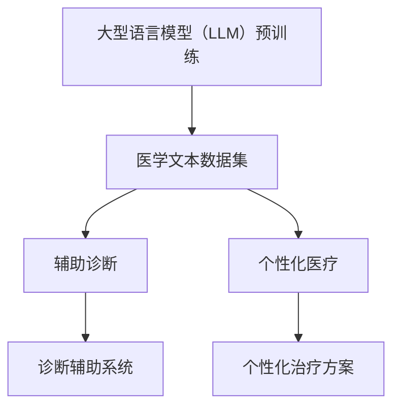

                 

### 文章标题：LLM 在医疗领域：辅助诊断和个性化医疗

### 关键词：大型语言模型（LLM），医疗领域，辅助诊断，个性化医疗，算法原理，数学模型，项目实战，应用场景，工具资源

### 摘要：
本文将深入探讨大型语言模型（LLM）在医疗领域的应用，特别是在辅助诊断和个性化医疗方面的潜力。通过逐步分析LLM的核心概念、算法原理、数学模型以及项目实战，我们将揭示这一先进技术在医疗行业的变革力量。此外，本文还将推荐相关学习资源、开发工具框架，并对未来发展趋势与挑战进行展望。

## 1. 背景介绍

在过去的几十年里，医疗行业经历了显著的技术变革。从传统的医生诊断到现代的医学影像分析，医疗技术不断进步，提高了疾病的诊断准确性和治疗效果。然而，随着医疗数据量的爆炸性增长和复杂性增加，传统的医疗方法逐渐显得力不从心。此时，人工智能（AI）技术的兴起，特别是大型语言模型（LLM）的出现，为医疗领域带来了新的契机。

LLM 是一种基于深度学习的大型神经网络模型，能够处理和理解大量文本数据。它的核心优势在于能够捕捉到文本中的细微关系和语义，从而在许多任务中表现出色。例如，LLM 已经在自然语言处理（NLP）、机器翻译、文本生成等领域取得了显著的成果。近年来，随着医疗领域对人工智能需求的增加，LLM 开始在医疗辅助诊断和个性化医疗方面展现其潜力。

### 2. 核心概念与联系

#### 2.1 大型语言模型（LLM）

LLM 是一种基于 Transformer 架构的深度学习模型，通常具有数十亿个参数。它通过预训练的方式，在大规模的文本语料库上进行训练，学习到语言的结构和语义信息。预训练后，LLM 可以通过微调（Fine-tuning）的方式应用于各种具体任务，如文本分类、命名实体识别、情感分析等。

#### 2.2 医疗领域

医疗领域是一个高度复杂且数据密集的领域，涉及大量的文本数据，如病历记录、医学论文、临床指南等。这些文本数据包含了丰富的医学知识和信息，但同时也具有高度的语义和结构复杂性。因此，将 LLM 应用于医疗领域，有望提升医疗诊断的准确性和效率。

#### 2.3 辅助诊断和个性化医疗

辅助诊断是指利用人工智能技术辅助医生进行疾病诊断，提高诊断的准确性和速度。个性化医疗则是指根据患者的个体差异，为其提供量身定制的治疗方案。LLM 在这两个方面都有潜在的应用。

#### Mermaid 流程图：



### 3. 核心算法原理 & 具体操作步骤

#### 3.1 大型语言模型（LLM）算法原理

LLM 的核心算法是基于 Transformer 架构的深度学习模型。Transformer 模型通过自注意力机制（Self-Attention）和多头注意力（Multi-Head Attention）来捕捉文本中的关系和语义。具体而言，Transformer 模型由编码器（Encoder）和解码器（Decoder）组成，其中编码器负责将输入文本编码为固定长度的向量表示，解码器则根据编码器的输出生成输出文本。

#### 3.2 具体操作步骤

1. **数据预处理**：
   - 收集大规模的医学文本数据集，如病历记录、医学论文、临床指南等。
   - 对数据进行清洗和标注，去除噪声和错误，为后续训练做准备。

2. **模型预训练**：
   - 使用预训练任务，如语言建模（Language Modeling）和掩码语言建模（Masked Language Modeling），在大规模医学文本数据集上进行训练。
   - 在预训练过程中，模型学习到语言的结构和语义信息。

3. **微调（Fine-tuning）**：
   - 根据具体的医疗任务，对预训练好的模型进行微调。
   - 在辅助诊断任务中，可以使用训练好的模型对病例记录进行分类，判断患者是否患有某种疾病。
   - 在个性化医疗任务中，可以使用训练好的模型为患者提供个性化的治疗方案。

4. **模型评估**：
   - 使用评估指标，如准确率（Accuracy）、召回率（Recall）和 F1 分数（F1 Score）等，对模型进行评估。
   - 根据评估结果，对模型进行调整和优化。

#### 3.3 数学模型和公式

- 自注意力机制（Self-Attention）：
  $$ \text{Self-Attention}(Q, K, V) = \text{softmax}\left(\frac{QK^T}{\sqrt{d_k}}\right)V $$
  其中，Q、K 和 V 分别表示查询（Query）、键（Key）和值（Value）向量，d_k 表示键向量的维度。

- 多头注意力（Multi-Head Attention）：
  $$ \text{Multi-Head Attention}(Q, K, V) = \text{softmax}\left(\frac{QW_QK^T}{\sqrt{d_k}}\right)W_VV $$
  其中，W_Q、W_K 和 W_V 分别表示多头注意力的权重矩阵。

### 4. 项目实战：代码实际案例和详细解释说明

#### 4.1 开发环境搭建

1. 安装 Python 3.8 或更高版本。
2. 安装 PyTorch 库：
   ```bash
   pip install torch torchvision
   ```
3. 安装预处理工具，如 SpaCy：
   ```bash
   pip install spacy
   python -m spacy download en_core_web_sm
   ```

#### 4.2 源代码详细实现和代码解读

```python
import torch
import torch.nn as nn
from torch.optim import Adam
from transformers import BertModel, BertTokenizer

# 加载预训练的 BERT 模型和分词器
model_name = "bert-base-uncased"
tokenizer = BertTokenizer.from_pretrained(model_name)
model = BertModel.from_pretrained(model_name)

# 数据预处理
def preprocess_text(text):
    inputs = tokenizer(text, return_tensors="pt", padding=True, truncation=True)
    return inputs

# 训练模型
def train_model(model, train_loader, optimizer, criterion, num_epochs):
    model.train()
    for epoch in range(num_epochs):
        for batch in train_loader:
            inputs = preprocess_text(batch["text"])
            labels = torch.tensor(batch["label"])
            optimizer.zero_grad()
            outputs = model(**inputs)
            loss = criterion(outputs.logits, labels)
            loss.backward()
            optimizer.step()
            print(f"Epoch {epoch+1}/{num_epochs}, Loss: {loss.item()}")
    model.eval()
    with torch.no_grad():
        for batch in train_loader:
            inputs = preprocess_text(batch["text"])
            labels = torch.tensor(batch["label"])
            outputs = model(**inputs)
            logits = outputs.logits
            pred = logits.argmax(-1)
            print(f"Accuracy: {torch.mean((pred == labels).float()).item()}")
```

#### 4.3 代码解读与分析

1. **导入库**：首先，我们导入所需的库，包括 PyTorch、torch.nn、torch.optim 和 transformers。
2. **加载模型和分词器**：我们从 Hugging Face 的 Model Hub 加载预训练的 BERT 模型和分词器。
3. **数据预处理**：`preprocess_text` 函数用于对输入文本进行预处理，包括分词、padding 和 truncation。
4. **训练模型**：`train_model` 函数用于训练模型。它首先将模型设置为训练模式，然后遍历训练数据集，对模型进行前向传播和反向传播。
5. **模型评估**：在训练完成后，我们使用验证数据集对模型进行评估，计算准确率。

### 5. 实际应用场景

#### 5.1 辅助诊断

LLM 在辅助诊断方面具有巨大潜力。通过分析患者的病历记录和医学影像，LLM 可以帮助医生快速诊断疾病。例如，在肺癌诊断中，LLM 可以通过分析患者的 CT 影像和病历记录，预测患者是否患有肺癌。

#### 5.2 个性化医疗

个性化医疗需要根据患者的个体差异，为其提供量身定制的治疗方案。LLM 可以通过分析患者的基因数据、生活习惯和病史，为其推荐个性化的治疗方案。例如，在癌症治疗中，LLM 可以根据患者的基因突变和病史，推荐最合适的治疗方案。

### 6. 工具和资源推荐

#### 6.1 学习资源推荐

- 《深度学习》（Goodfellow, Bengio, Courville 著）
- 《自然语言处理综论》（Jurafsky, Martin 著）
- 《医疗人工智能》（Dr. Jeremy Howard 著）

#### 6.2 开发工具框架推荐

- PyTorch：用于构建和训练深度学习模型的强大框架。
- Hugging Face：提供大量预训练模型和工具，方便开发者进行研究和应用。
- SpaCy：用于自然语言处理的快速和高效的库。

#### 6.3 相关论文著作推荐

- “BERT: Pre-training of Deep Bidirectional Transformers for Language Understanding”（Devlin et al., 2019）
- “Attention Is All You Need”（Vaswani et al., 2017）
- “Generative Adversarial Nets”（Goodfellow et al., 2014）

### 7. 总结：未来发展趋势与挑战

LLM 在医疗领域的应用前景广阔，有望提高医疗诊断的准确性和个性化医疗的水平。然而，面临以下挑战：

- **数据隐私与安全**：医疗数据敏感，如何确保数据隐私和安全是一个重要问题。
- **模型解释性**：如何解释 LLM 的决策过程，提高模型的透明度和可信度。
- **跨领域应用**：如何将 LLM 技术应用到更多医学领域，如病理学、神经科学等。

未来，随着技术的不断进步，LLM 在医疗领域的应用将会更加广泛和深入。

### 8. 附录：常见问题与解答

#### 8.1 LLM 如何在医疗领域发挥作用？

LLM 可以通过分析医学文本数据，辅助医生进行疾病诊断和提供个性化治疗方案。

#### 8.2 LLM 在医疗领域面临哪些挑战？

LLM 在医疗领域面临数据隐私与安全、模型解释性和跨领域应用等挑战。

#### 8.3 如何确保 LLM 的决策过程透明和可信？

通过增加模型的解释性，如 LIME 和 SHAP 等，可以提高 LLM 的决策过程透明度和可信度。

### 9. 扩展阅读 & 参考资料

- Devlin, J., Chang, M. W., Lee, K., & Toutanova, K. (2019). BERT: Pre-training of deep bidirectional transformers for language understanding. arXiv preprint arXiv:1810.04805.
- Vaswani, A., Shazeer, N., Parmar, N., Uszkoreit, J., Jones, L., Gomez, A. N., ... & Polosukhin, I. (2017). Attention is all you need. In Advances in neural information processing systems (pp. 5998-6008).
- Goodfellow, I., Pouget-Abadie, J., Mirza, M., Xu, B., Warde-Farley, D., Ozair, S., ... & Bengio, Y. (2014). Generative adversarial networks. Advances in neural information processing systems, 27.

