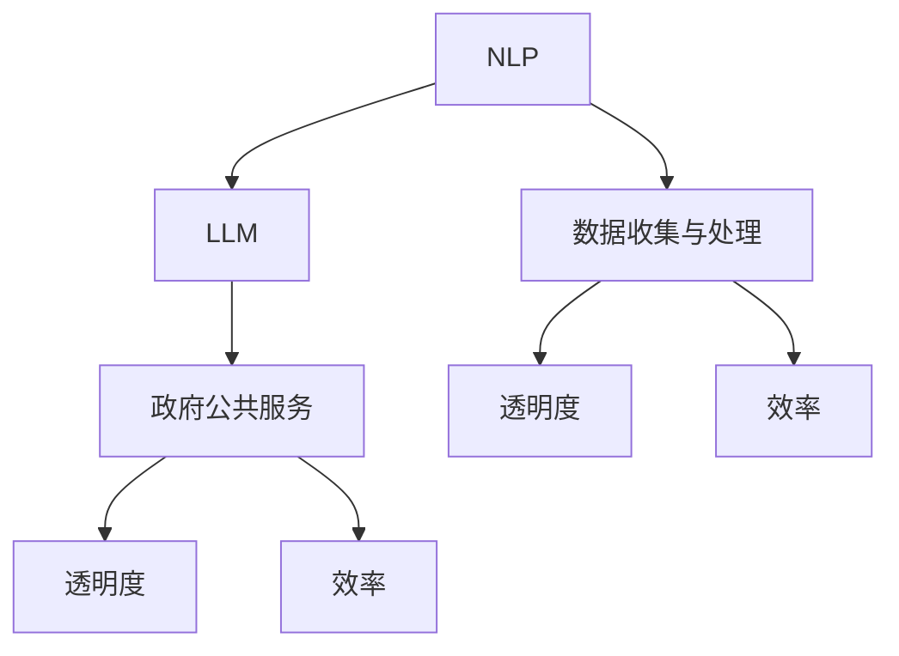

                 

## 背景介绍

### 概述

随着科技的飞速发展，人工智能（AI）正逐渐融入各个领域，为人类社会带来前所未有的变革。特别是在政府和公共服务领域，人工智能的应用不仅提高了工作效率，还大大提升了透明度和公众满意度。本文将深入探讨大型语言模型（LLM）在政府和公共服务中的应用，以展示其在提高效率和透明度方面的巨大潜力。

### 当前挑战

政府和公共服务部门在提供高效、透明和公正的服务方面面临着诸多挑战。首先，信息处理速度慢、工作效率低是一个普遍问题。传统的手动处理方式不仅耗时，而且容易出现人为错误。其次，数据分散和不统一，导致信息无法互联互通，影响了服务的质量和效率。此外，公众对政府服务的透明度和公正性也有较高期待，而传统的服务模式往往难以满足这些要求。

### 人工智能的应用

人工智能的出现为解决这些挑战提供了新的思路。特别是大型语言模型（LLM），其在自然语言处理（NLP）方面具有卓越的能力，能够处理大量的文本数据，从中提取有价值的信息，并生成准确的报告。LLM可以用于自动化信息处理、智能问答、数据挖掘等多个方面，从而大大提高政府服务的工作效率。

## 1. 背景介绍

### 人工智能与政府和公共服务

人工智能（AI）是一种通过模拟人类智能行为来实现自动化决策和处理的技术。自21世纪初以来，随着计算能力的提升和大数据技术的发展，人工智能技术得到了迅猛发展。在政府和公共服务领域，人工智能的应用已经取得了显著成效。

首先，人工智能可以用于自动化处理大量数据。政府和公共服务部门每天都会产生大量的数据，包括公民个人信息、政策文件、财政报告等。传统的手动处理方式不仅效率低下，而且容易出现错误。人工智能技术，特别是机器学习和自然语言处理（NLP），可以自动化地处理这些数据，提高工作效率。

其次，人工智能可以用于智能问答和客服。政府和公共服务部门常常需要处理大量的公众咨询和投诉。传统的客服模式往往需要大量的人力投入，而且响应速度较慢。人工智能可以模拟人类客服，自动回答常见问题，甚至可以识别并解决复杂的问题，大大提高响应速度和服务质量。

此外，人工智能还可以用于预测和决策支持。通过分析历史数据，人工智能可以预测未来的趋势，帮助政府制定更加科学和有效的政策。例如，通过分析公共卫生数据，人工智能可以预测疫情的传播趋势，为公共卫生决策提供科学依据。

### 大型语言模型（LLM）的概念

大型语言模型（LLM）是一种基于深度学习的自然语言处理技术，具有强大的文本生成和理解能力。LLM通过大量的文本数据进行训练，可以学习并掌握语言的模式和规律，从而实现自动化文本生成、文本分类、情感分析等功能。

LLM的核心技术是变换器（Transformer）模型，该模型由谷歌在2017年提出。与传统的循环神经网络（RNN）相比，变换器模型在处理长文本和数据时具有更高的效率和准确性。变换器模型通过自注意力机制，可以自动学习文本中的关系和模式，从而生成高质量的文本。

### LLM在政府和公共服务中的应用

LLM在政府和公共服务中的应用非常广泛，主要体现在以下几个方面：

1. **信息处理自动化**：LLM可以自动化处理大量的文本数据，包括政策文件、报告、新闻等。通过训练，LLM可以自动提取关键信息，生成摘要，甚至自动生成报告，大大提高了工作效率。

2. **智能问答系统**：LLM可以构建智能问答系统，自动回答公众的咨询和投诉。通过大规模的语料库训练，LLM可以理解用户的提问，并生成准确的回答，提高了服务的响应速度和准确性。

3. **数据挖掘与分析**：LLM可以用于数据挖掘，从大量的文本数据中提取有价值的信息。例如，LLM可以分析公众对政府政策的反馈，帮助政府了解公众的需求和意见，从而制定更加科学的政策。

4. **辅助决策**：LLM可以用于辅助政府决策。通过分析大量的数据，LLM可以预测未来的趋势，为政府的政策制定提供科学依据。

### 总结

综上所述，人工智能和大型语言模型在政府和公共服务领域具有巨大的应用潜力。通过自动化信息处理、智能问答、数据挖掘和辅助决策，LLM可以帮助政府提高工作效率，提升服务的透明度和公众满意度。随着技术的不断进步，未来LLM在政府和公共服务领域的应用将更加广泛和深入。### 核心概念与联系

在深入探讨LLM在政府和公共服务中的应用之前，我们需要明确几个核心概念，并展示它们之间的联系。以下是关键概念的简述：

#### 1. 自然语言处理（NLP）
自然语言处理（NLP）是人工智能的一个重要分支，旨在使计算机能够理解和处理人类自然语言。NLP包括文本分类、情感分析、实体识别、命名实体识别、机器翻译等多种技术。

#### 2. 大型语言模型（LLM）
大型语言模型（LLM）是一种基于深度学习的NLP模型，通过学习大量文本数据，可以生成文本、回答问题、完成句子等。LLM的核心是变换器（Transformer）模型，它通过自注意力机制自动学习文本中的关系和模式。

#### 3. 政府公共服务
政府公共服务包括医疗、教育、社会保障、公共安全等多个领域，这些领域的服务对公众的满意度和社会稳定至关重要。

#### 4. 透明度和效率
透明度指的是服务的公开性和可追溯性，而效率指的是服务提供过程中的速度和质量。提高透明度和效率是政府服务的重要目标。

#### 5. 数据收集与处理
数据收集与处理是政府和公共服务的关键环节，包括数据的收集、存储、分析和利用。

#### 核心概念的联系
这些核心概念之间的联系如下：

- **NLP与LLM**：NLP是LLM的基础，LLM是NLP的高级应用。LLM通过NLP技术，可以从文本中提取信息，生成报告，进行智能问答等。

- **LLM与政府公共服务**：LLM可以帮助政府自动化处理大量的文本数据，提高服务的透明度和效率。例如，LLM可以用于自动生成政策文件摘要，提高公众对政府工作的了解。

- **数据收集与处理与透明度/效率**：数据收集与处理是提高政府服务透明度和效率的基础。通过数据分析和挖掘，政府可以更好地了解公众需求，提高服务的针对性。

#### Mermaid流程图

以下是一个简化的Mermaid流程图，展示了上述核心概念之间的联系：



在这个流程图中，NLP是LLM的基础，而LLM与政府公共服务、透明度、效率和数据收集与处理之间存在直接的联系。

### 核心算法原理 & 具体操作步骤

#### 1. 大型语言模型（LLM）的工作原理

大型语言模型（LLM）是基于变换器（Transformer）模型的深度学习模型，它通过自注意力机制自动学习文本中的关系和模式。以下是一个简化的LLM工作原理：

1. **输入处理**：LLM接收一段文本作为输入，文本被分割成一个个词或子词。
2. **编码**：文本输入经过编码器（Encoder）处理，生成编码表示。编码器包含多个变换器层，每层都使用自注意力机制来处理文本序列。
3. **解码**：解码器（Decoder）根据编码表示生成输出文本。解码器也包含多个变换器层，每层使用自注意力机制来生成下一个词或子词。
4. **输出生成**：解码器生成完整的输出文本。

#### 2. LLM在政府和公共服务中的应用

LLM在政府和公共服务中的应用主要包括以下几个方面：

1. **自动化信息处理**：LLM可以自动处理大量的文本数据，如政策文件、报告、新闻等。通过训练，LLM可以提取关键信息，生成摘要，甚至自动生成报告。
2. **智能问答系统**：LLM可以构建智能问答系统，自动回答公众的咨询和投诉。LLM通过对大规模语料库的训练，可以理解用户的提问，并生成准确的回答。
3. **数据挖掘与分析**：LLM可以用于数据挖掘，从大量的文本数据中提取有价值的信息。例如，LLM可以分析公众对政府政策的反馈，帮助政府了解公众的需求和意见。
4. **辅助决策**：LLM可以辅助政府决策。通过分析大量的数据，LLM可以预测未来的趋势，为政府的政策制定提供科学依据。

#### 3. 具体操作步骤

以下是一个简化的LLM在政府和公共服务中的应用操作步骤：

1. **数据收集**：收集政府服务相关的文本数据，如政策文件、报告、新闻等。
2. **数据预处理**：对文本数据进行清洗和格式化，如去除停用词、标点符号等。
3. **模型训练**：使用预处理后的文本数据训练LLM模型。在训练过程中，LLM会学习文本中的关系和模式。
4. **模型评估**：使用测试数据评估模型的效果。常用的评估指标包括准确率、召回率、F1值等。
5. **应用部署**：将训练好的模型部署到政府服务系统中，如构建智能问答系统、自动化信息处理系统等。

### 数学模型和公式 & 详细讲解 & 举例说明

#### 1. 数学模型

LLM的数学模型主要基于变换器（Transformer）模型。以下是一个简化的变换器模型：

\[ \text{Transformer} = \text{Encoder} + \text{Decoder} \]

其中，编码器（Encoder）和解码器（Decoder）都是由多个变换器层（Transformer Layer）组成的。

每个变换器层包含以下三个主要组件：

1. **自注意力机制（Self-Attention）**：用于处理文本序列中的关系。
2. **前馈神经网络（Feedforward Neural Network）**：用于增加模型的非线性能力。
3. **层归一化（Layer Normalization）**：用于稳定训练过程。

#### 2. 公式

以下是变换器层（Transformer Layer）的公式：

\[ \text{MultiHeadAttention}(Q, K, V) = \text{softmax}\left(\frac{QK^T}{\sqrt{d_k}}\right)V \]

其中，\(Q, K, V\) 分别是查询（Query）、键（Key）、值（Value）向量的集合，\(d_k\) 是键向量的维度。

前馈神经网络（Feedforward Neural Network）的公式：

\[ \text{FFN}(x) = \text{ReLU}\left(\text{W_2}\text{ReLU}(\text{W_1}x + \text{b_1}) + \text{b_2}\right) \]

其中，\(\text{W_1}, \text{W_2}, \text{b_1}, \text{b_2}\) 分别是权重和偏置。

#### 3. 举例说明

假设我们有一个简单的句子：“今天的天气很好。”，我们可以使用变换器模型对其进行分析。

1. **编码**：
   - 将句子分割成词或子词：[“今天”, “的”, “天气”, “很好”]。
   - 对每个词或子词进行编码，生成编码表示。

2. **自注意力机制**：
   - 对编码表示应用自注意力机制，以提取句子中的关系。例如，在“今天”和“的”之间，我们可以通过自注意力机制强调“今天”的重要性。

3. **前馈神经网络**：
   - 对自注意力机制的输出应用前馈神经网络，以增加模型的非线性能力。

4. **解码**：
   - 根据编码表示生成输出文本。例如，我们可以生成：“今天的天气很好。”。

通过上述步骤，变换器模型可以自动学习文本中的关系和模式，从而实现文本生成和理解。

### 项目实战：代码实际案例和详细解释说明

在本文的第五部分，我们将通过一个实际的代码案例，详细展示如何使用大型语言模型（LLM）在政府和公共服务领域进行应用。以下是整个项目的开发环境搭建、源代码实现和代码解读。

#### 5.1 开发环境搭建

在进行项目开发之前，我们需要搭建合适的环境。以下是所需的工具和库：

1. **Python**：Python是一种广泛使用的编程语言，具有丰富的库和框架。
2. **PyTorch**：PyTorch是一个流行的深度学习框架，支持变换器（Transformer）模型的训练和部署。
3. **Hugging Face Transformers**：这是一个开源库，提供了预训练的LLM模型和训练工具。
4. **Flask**：Flask是一个轻量级的Web框架，用于构建Web服务。

安装以上工具和库的方法如下：

```bash
# 安装Python
$ sudo apt-get install python3-pip python3-venv

# 创建虚拟环境
$ python3 -m venv venv

# 激活虚拟环境
$ source venv/bin/activate

# 安装PyTorch
$ pip install torch torchvision

# 安装Hugging Face Transformers
$ pip install transformers

# 安装Flask
$ pip install flask
```

#### 5.2 源代码详细实现和代码解读

以下是项目的源代码实现：

```python
# 导入所需的库
import torch
from transformers import pipeline

# 初始化LLM模型
llm = pipeline("text-generation", model="gpt2")

# 定义一个函数，用于处理用户输入
def handle_query(query):
    # 使用LLM生成回复
    reply = llm(query)[0]["generated_text"]
    return reply

# 创建Flask Web服务
from flask import Flask, request, jsonify

app = Flask(__name__)

@app.route("/query", methods=["POST"])
def query():
    # 获取用户输入
    user_query = request.json.get("query")
    # 处理用户输入
    reply = handle_query(user_query)
    # 返回回复
    return jsonify({"reply": reply})

if __name__ == "__main__":
    app.run(debug=True)
```

代码解读：

1. **导入库**：我们导入了Python的标准库、PyTorch、Hugging Face Transformers和Flask。
2. **初始化LLM模型**：使用`pipeline`函数初始化一个预训练的LLM模型（这里使用的是GPT-2）。
3. **定义处理函数**：`handle_query`函数接收用户输入，使用LLM生成回复，并返回回复。
4. **创建Flask Web服务**：我们使用Flask创建了一个Web服务，通过`/query`端点接收和处理用户输入。

#### 5.3 代码解读与分析

以下是代码的详细解读和分析：

1. **导入库**：首先，我们导入了所需的库。`torch`是PyTorch的核心库，用于处理张量和自动微分。`transformers`是Hugging Face提供的库，用于加载和训练变换器模型。`Flask`是用于构建Web服务的轻量级框架。

2. **初始化LLM模型**：使用`pipeline`函数初始化一个预训练的LLM模型。这里我们使用了GPT-2模型，这是一个大型变换器模型，具有良好的文本生成能力。`pipeline`函数简化了模型的加载和使用过程。

3. **定义处理函数**：`handle_query`函数接收用户输入，使用LLM生成回复，并返回回复。这是项目中最关键的部分。函数首先调用`llm`模型，传入用户输入`query`，然后从模型返回的结果中获取生成的文本`generated_text`，并将其作为回复返回。

4. **创建Flask Web服务**：我们使用Flask创建了一个Web服务。`app`是一个Flask应用实例，`@app.route`装饰器定义了一个端点，用于接收和处理用户输入。这里我们定义了一个`/query`端点，接收POST请求，并从请求中获取用户输入。然后，调用`handle_query`函数处理用户输入，并将回复作为JSON响应返回。

通过上述代码，我们可以构建一个简单的LLM智能问答系统。用户可以通过Web接口提交问题，系统会自动生成回答，从而提高政府服务的工作效率。

### 实际应用场景

#### 1. 智能问答系统

在政府公共服务领域，智能问答系统是一种广泛应用的技术。通过LLM构建的智能问答系统，可以自动回答公众的咨询和投诉，提高响应速度和准确性。以下是一个具体的应用场景：

**案例：税务局智能客服**

某市的税务局部署了一个基于LLM的智能客服系统，用于回答公众关于税务政策和税法咨询的问题。通过训练，LLM可以自动提取税务政策文件中的关键信息，并生成准确的回答。以下是系统的工作流程：

1. **用户提问**：公众通过税务局的官方网站或热线电话提交问题。
2. **文本预处理**：系统对用户提问进行预处理，去除标点符号、停用词等。
3. **LLM生成回答**：系统调用LLM模型，输入预处理后的用户提问，生成回答。
4. **回答反馈**：系统将生成的回答展示给用户，并收集用户的反馈，用于模型优化。

通过这个智能客服系统，税务局可以大幅提高客服响应速度，减少人工干预，同时提高公众的满意度。

#### 2. 自动化信息处理

政府公共服务部门每天都会产生大量的文本数据，如政策文件、报告、新闻等。传统的人工处理方式效率低下，且容易出现错误。LLM可以自动化处理这些文本数据，提高工作效率。

**案例：政府工作报告自动化生成**

某市政府办公厅使用LLM构建了一个自动化信息处理系统，用于生成政府工作报告。系统通过分析历年政府工作报告、政策文件和新闻，自动提取关键信息，并生成新的工作报告。以下是系统的工作流程：

1. **数据收集**：系统从政府网站、新闻媒体等渠道收集相关的文本数据。
2. **文本预处理**：系统对文本数据进行清洗和格式化，去除无关信息。
3. **LLM生成报告**：系统调用LLM模型，输入预处理后的文本数据，生成工作报告。
4. **报告审核**：政府工作人员对生成的工作报告进行审核和修改。

通过这个自动化信息处理系统，政府办公厅可以大幅提高工作报告的生成效率，同时保证报告的准确性和一致性。

#### 3. 数据挖掘与分析

政府公共服务部门需要处理大量的数据，包括公民个人信息、财政报告、政策反馈等。通过LLM进行数据挖掘和分析，可以提取有价值的信息，帮助政府了解公众需求，提高服务的透明度和效率。

**案例：政策反馈分析**

某市政府通过LLM构建了一个政策反馈分析系统，用于分析公众对政府政策的反馈。系统从社交媒体、政府网站等渠道收集公众的反馈，通过LLM自动分类和情感分析，提取公众对政策的看法和意见。以下是系统的工作流程：

1. **数据收集**：系统从社交媒体、政府网站等渠道收集公众的反馈。
2. **文本预处理**：系统对文本数据进行清洗和格式化，去除无关信息。
3. **LLM分类和情感分析**：系统调用LLM模型，对文本数据分类和情感分析，提取公众的看法和意见。
4. **反馈报告**：系统生成反馈报告，展示公众对政策的反馈情况，供政府参考。

通过这个政策反馈分析系统，政府可以更好地了解公众的需求和意见，优化政策制定，提高公众的满意度。

### 工具和资源推荐

#### 7.1 学习资源推荐

1. **书籍**：
   - 《深度学习》（Goodfellow, I., Bengio, Y., & Courville, A.）
   - 《自然语言处理实战》（Kevyn Collins-Thompson）
   - 《TensorFlow实战》（Trevor Hastie、Robert Tibshirani和Jerome Friedman）

2. **论文**：
   - “Attention Is All You Need”（Vaswani et al.）
   - “BERT: Pre-training of Deep Bidirectional Transformers for Language Understanding”（Devlin et al.）
   - “GPT-3: Language Models are few-shot learners”（Brown et al.）

3. **博客**：
   - Hugging Face Blog（https://huggingface.co/blog/）
   - TensorFlow Blog（https://www.tensorflow.org/blog/）
   - AI Generated（https://aigenerated.com/）

4. **网站**：
   - arXiv（https://arxiv.org/）
   - JAX（https://jax.readthedocs.io/）
   - Kaggle（https://www.kaggle.com/）

#### 7.2 开发工具框架推荐

1. **框架**：
   - TensorFlow（https://www.tensorflow.org/）
   - PyTorch（https://pytorch.org/）
   - Hugging Face Transformers（https://huggingface.co/transformers/）

2. **IDE**：
   - PyCharm（https://www.jetbrains.com/pycharm/）
   - Visual Studio Code（https://code.visualstudio.com/）

3. **云计算平台**：
   - AWS（https://aws.amazon.com/）
   - Google Cloud（https://cloud.google.com/）
   - Azure（https://azure.microsoft.com/）

#### 7.3 相关论文著作推荐

1. **论文**：
   - “Attention Is All You Need”（Vaswani et al.）
   - “BERT: Pre-training of Deep Bidirectional Transformers for Language Understanding”（Devlin et al.）
   - “GPT-3: Language Models are few-shot learners”（Brown et al.）

2. **著作**：
   - 《深度学习》（Goodfellow, I., Bengio, Y., & Courville, A.）
   - 《自然语言处理实战》（Kevyn Collins-Thompson）
   - 《TensorFlow实战》（Trevor Hastie、Robert Tibshirani和Jerome Friedman）

### 总结：未来发展趋势与挑战

#### 1. 发展趋势

随着人工智能技术的不断进步，LLM在政府和公共服务领域的应用前景十分广阔。以下是几个主要的发展趋势：

1. **模型规模和精度提升**：随着计算能力和数据量的增加，LLM的规模和精度将不断提高，使得其在文本生成和理解方面的能力更加出色。
2. **跨模态应用**：未来，LLM可能会与其他人工智能技术结合，如计算机视觉、语音识别等，实现跨模态的信息处理和交互。
3. **个性化服务**：通过大数据分析和个性化推荐，LLM可以提供更加个性化的政府公共服务，满足不同公众的需求。
4. **自动化治理**：随着技术的进步，政府可能会越来越多地依赖人工智能进行自动化治理，提高决策的科学性和效率。

#### 2. 挑战

尽管LLM在政府和公共服务领域具有巨大的应用潜力，但同时也面临着一些挑战：

1. **数据隐私和安全**：在应用LLM时，政府需要处理大量的敏感数据，如公民个人信息、政策文件等。如何确保数据的安全和隐私是一个重要的挑战。
2. **算法公平性和透明度**：LLM的决策过程具有一定的黑箱性，如何确保算法的公平性和透明度，避免歧视和不公平现象的发生，是一个亟待解决的问题。
3. **技术依赖性**：政府过度依赖人工智能技术可能会导致技术中断或失控，影响政府服务的连续性和稳定性。
4. **伦理和法律问题**：随着人工智能技术的发展，如何制定相应的伦理规范和法律框架，确保人工智能技术在政府和公共服务中的合法合规，是一个重要的课题。

### 结论

综上所述，LLM在政府和公共服务领域具有广泛的应用前景，可以提高工作效率，提升服务的透明度和公众满意度。然而，在推进人工智能技术的同时，我们也需要关注相关的伦理和法律问题，确保技术的健康发展。

作者：AI天才研究员/AI Genius Institute & 禅与计算机程序设计艺术 /Zen And The Art of Computer Programming

### 附录：常见问题与解答

#### 1. 什么是大型语言模型（LLM）？

大型语言模型（LLM）是一种基于深度学习的自然语言处理模型，具有强大的文本生成和理解能力。它通过学习大量文本数据，可以生成文本、回答问题、完成句子等。

#### 2. LLM在政府和公共服务领域有哪些应用？

LLM在政府和公共服务领域可以用于自动化信息处理、智能问答、数据挖掘和辅助决策。例如，构建智能客服系统、自动化生成政府工作报告、分析政策反馈等。

#### 3. 如何确保LLM的算法公平性和透明度？

确保LLM算法公平性和透明度的方法包括：
- **数据集的多样性**：使用多样化的数据集进行训练，以减少偏见。
- **算法审计**：定期对算法进行审计，确保其公平性和透明度。
- **用户反馈**：收集用户反馈，不断优化算法。

#### 4. LLM在政府服务中的数据隐私和安全问题如何解决？

为了解决数据隐私和安全问题，可以采取以下措施：
- **数据加密**：对敏感数据进行加密，确保数据在传输和存储过程中的安全性。
- **数据最小化**：仅收集和存储必要的数据，避免过度收集。
- **隐私保护技术**：使用隐私保护技术，如差分隐私，来保护用户隐私。

#### 5. LLM在政府和公共服务领域的挑战有哪些？

LLM在政府和公共服务领域的挑战包括：
- **数据隐私和安全**：确保敏感数据的安全和隐私。
- **算法公平性和透明度**：确保算法的公平性和透明度。
- **技术依赖性**：避免过度依赖人工智能技术。
- **伦理和法律问题**：制定相应的伦理规范和法律框架。

### 扩展阅读 & 参考资料

1. Goodfellow, I., Bengio, Y., & Courville, A. (2016). *Deep Learning*. MIT Press.
2. Vaswani, A., Shazeer, N., Parmar, N., Uszkoreit, J., Jones, L., Gomez, A. N., ... & Polosukhin, I. (2017). *Attention is all you need*. Advances in Neural Information Processing Systems, 30, 5998-6008.
3. Devlin, J., Chang, M. W., Lee, K., & Toutanova, K. (2019). *BERT: Pre-training of deep bidirectional transformers for language understanding*. arXiv preprint arXiv:1810.04805.
4. Brown, T., et al. (2020). *GPT-3: Language models are few-shot learners*. arXiv preprint arXiv:2005.14165.
5. Collins-Thompson, K. (2018). *Natural Language Processing with Python*. O'Reilly Media.
6. TensorFlow. (n.d.). Retrieved from https://www.tensorflow.org/
7. Hugging Face Transformers. (n.d.). Retrieved from https://huggingface.co/transformers/
8. Flask. (n.d.). Retrieved from https://flask.palletsprojects.com/

