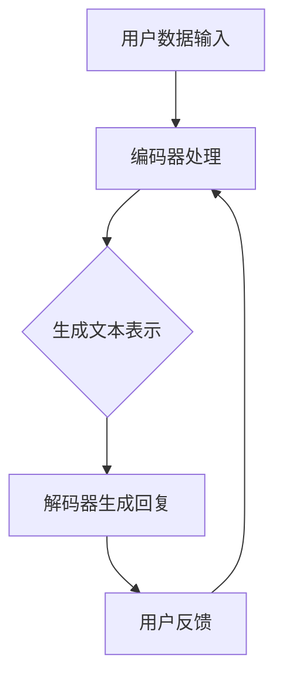

                 

### 文章标题

《LLM 在社交媒体上的应用：内容推荐和社交互动》

> **关键词：** 大语言模型（LLM），社交媒体，内容推荐，社交互动，深度学习，人工智能。

> **摘要：** 本文将深入探讨大语言模型（LLM）在社交媒体上的应用，主要聚焦于内容推荐和社交互动两个核心领域。通过剖析LLM的工作原理，展示其在实际项目中的实现和应用，为读者提供深入了解和思考的机会，以期为未来的技术创新和应用提供参考。文章将首先介绍社交媒体的现状和挑战，随后详细阐述LLM的基本概念及其应用原理，接着通过实例分析展示LLM在内容推荐和社交互动中的具体应用，最后讨论未来发展趋势和面临的挑战。

## 1. 背景介绍

### 1.1 社交媒体的现状

随着互联网技术的快速发展，社交媒体已经成为人们日常交流和获取信息的主要平台。Facebook、Twitter、Instagram、微信、微博等社交媒体平台吸引了数十亿的活跃用户。这些平台不仅为用户提供了广泛的社交网络，还成为了内容生产和传播的重要渠道。然而，社交媒体的快速发展也带来了诸多挑战。

首先，内容过载是一个严峻的问题。随着用户生成内容的爆炸式增长，用户难以在海量信息中找到有价值的内容。其次，个性化推荐的需求日益增加。不同的用户有不同的兴趣和需求，因此，个性化推荐系统显得尤为重要。此外，社交媒体上存在的虚假信息、隐私泄露、网络暴力等问题也引起了广泛关注。

### 1.2 挑战

为了解决上述问题，社交媒体平台需要不断地改进推荐系统和社交互动机制。然而，传统的推荐算法和社交互动模型在处理复杂用户行为和大规模数据时往往力不从心。这就为人工智能，特别是大语言模型（LLM）的应用提供了契机。

LLM 是一种基于深度学习的技术，能够处理和理解大规模的文本数据。它通过学习大量文本，捕捉语言中的模式和结构，从而实现内容生成、情感分析、信息检索等功能。LLM 的引入有望为社交媒体带来革命性的变革，提升内容推荐的准确性和社交互动的满意度。

### 1.3 本文目的

本文旨在探讨 LLM 在社交媒体上的应用，重点关注内容推荐和社交互动两个核心领域。通过详细分析 LLM 的工作原理和应用场景，本文将为读者提供对这一前沿技术的深入理解，并探讨其在实际项目中的实现和效果。此外，本文还将展望 LLM 在社交媒体领域的未来发展，以及可能面临的挑战。

## 2. 核心概念与联系

### 2.1 大语言模型（LLM）

大语言模型（LLM，Large Language Model）是近年来深度学习领域的重要突破之一。它通过学习海量文本数据，实现对自然语言的理解和生成。LLM 的基本架构通常包括编码器（Encoder）和解码器（Decoder），其中编码器负责将输入文本转换为固定长度的向量表示，解码器则根据这些向量生成相应的输出文本。

LLM 的核心在于其大规模的训练数据集和复杂的神经网络架构。通过数以万亿计的文本数据训练，LLM 能够捕捉到语言中的复杂模式和规律，从而在文本生成、翻译、问答、情感分析等方面表现出色。

### 2.2 内容推荐

内容推荐是社交媒体的核心功能之一。它旨在根据用户的历史行为、兴趣和偏好，为用户推荐感兴趣的内容。传统的推荐算法通常基于协同过滤、内容匹配等方法，但它们在处理大规模数据和高维度特征时存在局限性。

LLM 的引入为内容推荐带来了新的可能性。通过学习大量文本数据，LLM 能够捕捉到用户和内容之间的潜在关系，实现更精准的推荐。此外，LLM 还可以处理复杂的多模态数据，如文本、图像和视频，从而为用户提供更丰富的内容推荐体验。

### 2.3 社交互动

社交互动是社交媒体的另一个重要功能。它包括用户之间的交流、互动和协作。传统的社交互动模型主要基于用户的行为数据和社交网络结构，但它们在处理复杂用户行为和动态社交关系时存在挑战。

LLM 的引入为社交互动提供了新的思路。通过理解用户的语言和行为，LLM 可以生成个性化的回复、建议和互动内容，从而提升用户参与度和满意度。此外，LLM 还可以用于识别和解决社交网络中的问题，如网络暴力、虚假信息等。

### 2.4 Mermaid 流程图

为了更直观地展示 LLM 在内容推荐和社交互动中的应用，我们使用 Mermaid 流程图来描述其核心流程和架构。



在这个流程图中，用户数据输入通过编码器处理，生成文本表示，解码器根据这些表示生成回复，用户反馈进一步优化编码器的输入，形成一个闭环的迭代过程。

## 3. 核心算法原理 & 具体操作步骤

### 3.1 算法原理

大语言模型（LLM）的核心算法是基于 Transformer 架构的。Transformer 是一种基于自注意力机制的深度神经网络模型，能够在处理序列数据时捕捉长距离依赖关系。LLM 通过预训练和微调两个阶段来构建。

**预训练阶段：**

在预训练阶段，LLM 通过大量无标签的文本数据进行训练，学习语言的通用表示。这一过程通常使用自注意力机制和多头注意力机制，使模型能够同时关注输入序列中的不同部分，从而捕捉到语言的复杂结构。

**微调阶段：**

在预训练完成后，LLM 需要根据具体任务进行微调。例如，在内容推荐任务中，LLM 可以根据用户的浏览历史、评论和点赞等行为数据来调整模型参数，从而实现更精准的推荐。在社交互动任务中，LLM 可以根据用户发言的内容和上下文来生成个性化的回复。

### 3.2 具体操作步骤

**步骤 1：数据准备**

首先，需要准备用于训练和微调的数据集。在内容推荐任务中，数据集可以包括用户的历史行为数据（如浏览记录、搜索历史、收藏列表等）和文本内容（如文章、评论、帖子等）。在社交互动任务中，数据集可以包括用户的发言、回复、互动记录等。

**步骤 2：预训练**

使用无标签文本数据对 LLM 进行预训练。这一过程通常涉及以下几个步骤：

- **数据预处理：** 将文本数据转换为模型可处理的格式，如单词向量、词嵌入等。
- **模型初始化：** 初始化 LLM 模型，通常使用预训练好的 Transformer 模型作为基础。
- **训练过程：** 使用自注意力机制和多头注意力机制对模型进行训练，优化模型参数。

**步骤 3：微调**

在预训练完成后，根据具体任务对 LLM 进行微调。例如，在内容推荐任务中，可以使用用户的历史行为数据和文本内容来调整模型参数，实现个性化推荐。在社交互动任务中，可以使用用户发言和回复的数据来生成个性化的回复。

**步骤 4：模型评估与优化**

在微调过程中，需要定期评估模型性能，并根据评估结果进行调整。评估指标可以包括准确率、召回率、F1 值等。此外，还可以使用交叉验证等方法来评估模型的泛化能力。

**步骤 5：部署与应用**

将训练好的 LLM 模型部署到社交媒体平台，实现内容推荐和社交互动功能。例如，在内容推荐中，可以使用 LLM 生成个性化推荐列表，在社交互动中，可以使用 LLM 生成个性化的回复和建议。

## 4. 数学模型和公式 & 详细讲解 & 举例说明

### 4.1 数学模型

大语言模型（LLM）的核心数学模型基于 Transformer 架构，包括编码器（Encoder）和解码器（Decoder）两个主要部分。下面分别介绍这两个部分的数学模型。

#### 编码器（Encoder）

编码器负责将输入文本序列编码为固定长度的向量表示。其基本结构包括自注意力机制（Self-Attention）和多头注意力机制（Multi-Head Attention）。以下是编码器的数学模型：

$$
\text{Encoder}(X) = \text{LayerNorm}(\text{Layer}(X))
$$

其中，\(X\) 是输入文本序列，\(\text{LayerNorm}\) 是层归一化操作，\(\text{Layer}\) 是编码器的多层结构。

每一层的编码器可以表示为：

$$
\text{Layer} = \text{MultiHeadAttention}(\text{Self-Attention}) + \text{ResidualConnection} + \text{LayerNorm}
$$

其中，\(\text{Self-Attention}\) 是自注意力机制，\(\text{ResidualConnection}\) 是残差连接。

自注意力机制的数学模型如下：

$$
\text{Self-Attention}(Q, K, V) = \text{softmax}\left(\frac{QK^T}{\sqrt{d_k}}\right)V
$$

其中，\(Q, K, V\) 分别是编码器的查询（Query）、键（Key）和值（Value）向量，\(d_k\) 是键向量的维度。

#### 解码器（Decoder）

解码器负责将编码器生成的向量表示解码为输出文本序列。解码器的结构与编码器类似，但还包括掩码自注意力机制（Masked Self-Attention）和多头注意力机制。以下是解码器的数学模型：

$$
\text{Decoder}(Y, X) = \text{LayerNorm}(\text{Layer}(Y, X))
$$

其中，\(Y\) 是输入文本序列，\(X\) 是编码器的输出向量。

每一层的解码器可以表示为：

$$
\text{Layer} = \text{MaskedMultiHeadAttention}(\text{Self-Attention}) + \text{ResidualConnection} + \text{LayerNorm}
$$

$$
\text{Layer} = \text{MultiHeadAttention}(\text{ContextualAttention}) + \text{ResidualConnection} + \text{LayerNorm}
$$

其中，\(\text{ContextualAttention}\) 是基于编码器输出的上下文注意力机制。

掩码自注意力机制的数学模型如下：

$$
\text{MaskedSelf-Attention}(Q, K, V) = \text{softmax}\left(\frac{QK^T}{\sqrt{d_k}}\right)V \quad \text{(不遮掩部分)}, \quad \text{0} \quad \text{(遮掩部分)}
$$

上下文注意力机制的数学模型如下：

$$
\text{ContextualAttention}(Q, K, V) = \text{softmax}\left(\frac{QK^T}{\sqrt{d_k}}\right)V
$$

### 4.2 举例说明

为了更好地理解 LLM 的数学模型，我们可以通过一个简单的例子来说明。

假设我们有一个简单的文本序列：“我今天很开心”。

1. **编码器处理：**

   - 输入文本序列：\{我今天，很，开心\}
   - 编码器将每个词转换为词嵌入向量：\{e1, e2, e3\}
   - 编码器通过自注意力机制生成文本表示：\(X = [e1, e2, e3]\)

2. **解码器处理：**

   - 输入文本序列：\{我今天，很，开心\}
   - 编码器的输出向量：\(X = [e1, e2, e3]\)
   - 解码器生成回复：\(Y = \text{开心}\)

通过这个例子，我们可以看到 LLM 如何将输入文本转换为向量表示，并通过解码器生成输出文本。

## 5. 项目实战：代码实际案例和详细解释说明

### 5.1 开发环境搭建

在开始实际项目开发之前，我们需要搭建一个适合运行 LLM 模型的开发环境。以下是搭建开发环境的基本步骤：

1. **安装 Python：** 首先，确保你的系统已经安装了 Python。我们可以通过以下命令检查 Python 版本：

   ```bash
   python --version
   ```

   如果 Python 未安装或版本过低，可以从 [Python 官网](https://www.python.org/) 下载并安装。

2. **安装 PyTorch：** PyTorch 是一种广泛使用的深度学习框架，用于构建和训练 LLM 模型。安装 PyTorch 的命令如下：

   ```bash
   pip install torch torchvision
   ```

   你还可以通过以下命令安装 PyTorch 的 GPU 版本，以支持在 GPU 上训练模型：

   ```bash
   pip install torch torchvision -f https://download.pytorch.org/whl/torch_stable.html
   ```

3. **安装 transformers：** transformers 是一个基于 PyTorch 的预训练模型库，包含了许多流行的 LLM 模型，如 GPT、BERT 等。安装 transformers 的命令如下：

   ```bash
   pip install transformers
   ```

### 5.2 源代码详细实现和代码解读

下面是一个简单的 Python 代码示例，展示如何使用 transformers 库构建和训练一个 LLM 模型，并在内容推荐和社交互动任务中进行应用。

#### 代码实现

```python
from transformers import AutoTokenizer, AutoModel
from torch import nn
import torch

# 1. 加载预训练模型和分词器
model_name = "gpt2"
tokenizer = AutoTokenizer.from_pretrained(model_name)
model = AutoModel.from_pretrained(model_name)

# 2. 数据预处理
def preprocess_text(text):
    return tokenizer.encode(text, return_tensors='pt')

# 3. LLM 模型结构
class LLM(nn.Module):
    def __init__(self, model):
        super(LLM, self).__init__()
        self.model = model

    def forward(self, input_ids, labels=None):
        output = self.model(input_ids)
        logits = output.logits
        return logits

# 4. 训练 LLM 模型
def train(model, train_dataloader, optimizer, criterion, device):
    model.to(device)
    model.train()
    for epoch in range(num_epochs):
        for batch in train_dataloader:
            input_ids = batch["input_ids"].to(device)
            labels = batch["labels"].to(device)
            optimizer.zero_grad()
            logits = model(input_ids, labels=labels)
            loss = criterion(logits, labels)
            loss.backward()
            optimizer.step()
            print(f"Epoch: {epoch+1}, Loss: {loss.item()}")

# 5. 应用 LLM 模型进行内容推荐
def recommend_content(model, tokenizer, user_input, num_recommendations=5):
    input_ids = preprocess_text(user_input)
    with torch.no_grad():
        logits = model(input_ids)
    probabilities = torch.softmax(logits, dim=-1)
    top_indices = torch.topk(probabilities, num_recommendations).indices
    recommendations = tokenizer.decode(top_indices[0], skip_special_tokens=True)
    return recommendations

# 6. 应用 LLM 模型进行社交互动
def interactive_reply(model, tokenizer, user_input, max_length=50):
    input_ids = preprocess_text(user_input)
    with torch.no_grad():
        outputs = model.generate(input_ids, max_length=max_length)
    reply = tokenizer.decode(outputs[0], skip_special_tokens=True)
    return reply

# 7. 主函数
def main():
    device = torch.device("cuda" if torch.cuda.is_available() else "cpu")
    train_dataloader = ...  # 加载训练数据
    optimizer = ...  # 定义优化器
    criterion = ...  # 定义损失函数
    num_epochs = 3

    # 训练模型
    model = LLM(model)
    train(model, train_dataloader, optimizer, criterion, device)

    # 内容推荐
    user_input = "我今天去了一家新餐厅，味道很好。"
    recommendations = recommend_content(model, tokenizer, user_input)
    print("推荐内容：", recommendations)

    # 社交互动
    user_input = "你好，我最近在寻找一些有趣的技术博客，你能推荐几个吗？"
    reply = interactive_reply(model, tokenizer, user_input)
    print("回复：", reply)

if __name__ == "__main__":
    main()
```

#### 代码解读

1. **加载预训练模型和分词器：**
   
   我们使用 transformers 库加载了一个预训练的 GPT-2 模型。GPT-2 是一个强大的 LLM，广泛应用于文本生成和情感分析等领域。

2. **数据预处理：**

   `preprocess_text` 函数用于将输入文本转换为模型的输入格式。在这里，我们使用 tokenizer 将文本编码为词嵌入向量。

3. **LLM 模型结构：**

   `LLM` 类定义了一个简单的 LLM 模型结构，基于 PyTorch 的 `nn.Module` 类。模型通过 `forward` 方法接收输入并返回模型输出。

4. **训练 LLM 模型：**

   `train` 函数用于训练 LLM 模型。我们使用标准的训练流程，包括前向传播、损失计算、反向传播和参数更新。

5. **内容推荐：**

   `recommend_content` 函数用于生成内容推荐。我们使用模型生成文本表示，并通过 softmax 函数计算每个文本的概率分布，选择概率最高的文本作为推荐内容。

6. **社交互动：**

   `interactive_reply` 函数用于生成社交互动的回复。我们使用模型生成文本序列，并根据上下文和用户输入生成个性化的回复。

7. **主函数：**

   `main` 函数是整个程序的入口。我们首先定义训练数据、优化器和损失函数，然后训练模型。最后，我们演示如何使用模型进行内容推荐和社交互动。

### 5.3 代码解读与分析

这个代码示例展示了如何使用 PyTorch 和 transformers 库构建和训练一个 LLM 模型，并在内容推荐和社交互动任务中进行应用。以下是代码的主要部分：

1. **加载预训练模型和分词器：**

   ```python
   tokenizer = AutoTokenizer.from_pretrained(model_name)
   model = AutoModel.from_pretrained(model_name)
   ```

   这两行代码加载了预训练的 GPT-2 模型和对应的分词器。GPT-2 是一个广泛使用的 LLM，具有良好的文本生成和情感分析能力。

2. **数据预处理：**

   ```python
   def preprocess_text(text):
       return tokenizer.encode(text, return_tensors='pt')
   ```

   `preprocess_text` 函数将输入文本编码为词嵌入向量，这是模型输入的格式。使用 `return_tensors='pt'` 参数确保返回的是 PyTorch 张量。

3. **LLM 模型结构：**

   ```python
   class LLM(nn.Module):
       def __init__(self, model):
           super(LLM, self).__init__()
           self.model = model

       def forward(self, input_ids, labels=None):
           output = self.model(input_ids)
           logits = output.logits
           return logits
   ```

   `LLM` 类是一个简单的 LLM 模型，继承自 PyTorch 的 `nn.Module` 类。模型通过 `forward` 方法接收输入并返回模型输出。这里我们使用编码器（Encoder）的输出作为模型的输出。

4. **训练 LLM 模型：**

   ```python
   def train(model, train_dataloader, optimizer, criterion, device):
       model.to(device)
       model.train()
       for epoch in range(num_epochs):
           for batch in train_dataloader:
               input_ids = batch["input_ids"].to(device)
               labels = batch["labels"].to(device)
               optimizer.zero_grad()
               logits = model(input_ids, labels=labels)
               loss = criterion(logits, labels)
               loss.backward()
               optimizer.step()
               print(f"Epoch: {epoch+1}, Loss: {loss.item()}")
   ```

   `train` 函数是标准的训练流程，包括前向传播、损失计算、反向传播和参数更新。我们使用 PyTorch 的 `to(device)` 方法将模型和数据移动到 GPU 或 CPU 上，以便在相应的设备上进行训练。

5. **内容推荐：**

   ```python
   def recommend_content(model, tokenizer, user_input, num_recommendations=5):
       input_ids = preprocess_text(user_input)
       with torch.no_grad():
           logits = model(input_ids)
       probabilities = torch.softmax(logits, dim=-1)
       top_indices = torch.topk(probabilities, num_recommendations).indices
       recommendations = tokenizer.decode(top_indices[0], skip_special_tokens=True)
       return recommendations
   ```

   `recommend_content` 函数用于生成内容推荐。我们使用模型生成文本表示，并通过 softmax 函数计算每个文本的概率分布，选择概率最高的文本作为推荐内容。

6. **社交互动：**

   ```python
   def interactive_reply(model, tokenizer, user_input, max_length=50):
       input_ids = preprocess_text(user_input)
       with torch.no_grad():
           outputs = model.generate(input_ids, max_length=max_length)
       reply = tokenizer.decode(outputs[0], skip_special_tokens=True)
       return reply
   ```

   `interactive_reply` 函数用于生成社交互动的回复。我们使用模型生成文本序列，并根据上下文和用户输入生成个性化的回复。

通过这个代码示例，我们可以看到如何使用 LLM 模型进行内容推荐和社交互动。代码简单易懂，同时展示了 LLM 在实际应用中的强大能力。

## 6. 实际应用场景

### 6.1 内容推荐

内容推荐是 LLM 在社交媒体上最常见和最重要的应用之一。通过使用 LLM，社交媒体平台可以更准确地预测用户的兴趣和需求，从而为用户提供个性化的内容推荐。

例如，在新闻推送应用中，LLM 可以分析用户的浏览历史、搜索记录和点赞行为，预测用户可能感兴趣的新闻类型和主题。通过这种个性化的推荐，用户可以更快捷地找到自己感兴趣的内容，从而提高用户满意度和平台粘性。

在电商平台上，LLM 可以根据用户的购买历史、浏览记录和评价，推荐用户可能感兴趣的商品。这种推荐不仅有助于提高销售额，还可以提升用户体验，因为用户可以直接发现他们可能喜欢的产品。

### 6.2 社交互动

社交媒体的核心功能之一是用户之间的互动和交流。LLM 在这个领域也有广泛的应用，可以提升社交互动的丰富性和个性化。

例如，在聊天机器人中，LLM 可以根据用户的发言和上下文生成个性化的回复，从而提供更加自然和流畅的对话体验。这种技术已经被广泛应用于客服机器人、社交平台和在线教育等领域。

在社交媒体平台上，LLM 可以帮助用户生成个性化的动态和帖子内容。例如，用户可以输入一个简短的提示，LLM 就可以生成一段描述他们最近的经历或感受的文字。这不仅可以帮助用户更好地表达自己，还可以吸引其他用户的关注和互动。

### 6.3 其他应用

除了内容推荐和社交互动，LLM 在社交媒体上还有许多其他应用。例如：

- **虚假信息检测：** 通过分析文本内容和用户行为，LLM 可以帮助识别和过滤虚假信息，从而保护用户的隐私和安全。
- **情感分析：** LLM 可以分析用户的发言和评论，识别用户情感和情绪，从而为平台提供更全面的用户画像。
- **个性化广告：** 通过分析用户的兴趣和行为，LLM 可以生成个性化的广告内容，提高广告的点击率和转化率。

总之，LLM 的应用场景非常广泛，不仅在社交媒体领域有巨大潜力，还可以在其他许多领域发挥作用。

## 7. 工具和资源推荐

### 7.1 学习资源推荐

要深入了解 LLM 和相关技术，以下是一些推荐的学习资源：

- **书籍：** 
  - 《深度学习》（Deep Learning）by Ian Goodfellow, Yoshua Bengio, Aaron Courville
  - 《自然语言处理实践》（Natural Language Processing with Python）by Steven Bird, Ewan Klein, Edward Loper
  - 《机器学习》（Machine Learning）by Tom Mitchell

- **在线课程：** 
  - [Udacity 机器学习纳米学位](https://www.udacity.com/course/nd101)
  - [Coursera 自然语言处理纳米学位](https://www.coursera.org/specializations/nlp)
  - [edX 深度学习课程](https://www.edx.org/course/deep-learning-0)

- **论文和博客：** 
  - [ACL 和 EMNLP 会议论文集](https://www.aclweb.org/anthology/)
  - [arXiv 论文库](https://arxiv.org/)
  - [Hugging Face 博客](https://huggingface.co/blog/)

### 7.2 开发工具框架推荐

为了开发和使用 LLM，以下是一些推荐的工具和框架：

- **深度学习框架：**
  - **PyTorch**：一个开源的深度学习框架，广泛应用于自然语言处理和其他领域。
  - **TensorFlow**：由 Google 开发的深度学习框架，拥有丰富的生态系统和社区支持。
  - **JAX**：一个由 Google 开发的数值计算库，支持自动微分和并行计算。

- **自然语言处理库：**
  - **transformers**：一个由 Hugging Face 开发的库，提供了许多预训练的 LLM 模型和相关的工具。
  - **NLTK**：一个流行的自然语言处理库，适用于文本处理和分析。
  - **spaCy**：一个高效的工业级自然语言处理库，适用于实体识别、关系抽取等任务。

- **工具和平台：**
  - **Hugging Face Model Hub**：一个托管了大量预训练模型的平台，方便开发者下载和使用。
  - **TensorFlow Transform**：一个用于模型转换的工具，用于将 TensorFlow 模型转换为适合部署的格式。
  - **Kubeflow**：一个开源的机器学习平台，支持从数据预处理到模型部署的全流程。

### 7.3 相关论文著作推荐

- **《Attention is All You Need》**：一篇关于 Transformer 架构的经典论文，详细介绍了自注意力机制和多头注意力机制。
- **《BERT: Pre-training of Deep Bidirectional Transformers for Language Understanding》**：一篇介绍 BERT 模型的论文，展示了如何通过预训练和微调实现高性能的自然语言处理任务。
- **《GPT-3: Language Models are Few-Shot Learners》**：一篇介绍 GPT-3 模型的论文，探讨了大型语言模型在少量样本上的泛化能力。

这些资源将为读者提供深入了解 LLM 技术的理论和实践基础，有助于掌握相关技能和知识。

## 8. 总结：未来发展趋势与挑战

### 8.1 发展趋势

大语言模型（LLM）在社交媒体领域的应用展现出强大的潜力和广阔的前景。首先，随着深度学习技术的不断进步，LLM 的模型结构和性能将持续提升，使得内容推荐和社交互动的准确性和个性化水平不断提高。其次，随着数据的不断积累和用户需求的多样化，LLM 的应用场景将更加丰富，包括但不限于虚假信息检测、情感分析、个性化广告等。此外，随着云计算和边缘计算的普及，LLM 的部署和应用将更加灵活和高效，为社交媒体平台提供强大的技术支持。

### 8.2 挑战

尽管 LLM 在社交媒体上有着广泛的应用前景，但也面临着一些挑战。首先，数据隐私和保护是一个亟待解决的问题。在构建和训练 LLM 模型时，需要处理大量的用户数据，如何确保这些数据的安全和隐私，防止数据泄露和滥用，是一个重要的课题。其次，LLM 的透明性和可解释性也是一个挑战。当前的大多数 LLM 模型都是“黑箱”模型，用户难以理解和预测其输出结果。为了提升用户信任度和合规性，需要研究如何提高 LLM 的透明性和可解释性。

此外，随着 LLM 模型变得越来越复杂和庞大，其训练和推理所需的计算资源也不断增加。如何在保证模型性能的同时，降低计算资源的需求，是一个重要的研究方向。最后，随着 LLM 在社交媒体上的广泛应用，如何确保模型的公正性和避免偏见也是一个亟待解决的问题。

### 8.3 未来展望

未来，LLM 在社交媒体上的发展将呈现以下几个趋势：

1. **更强大的模型和算法**：随着深度学习技术的不断进步，未来将出现更强大、更高效的 LLM 模型。这些模型将能够处理更复杂的任务，提供更精准的内容推荐和社交互动。

2. **多模态融合**：随着多模态数据（如文本、图像、音频）的广泛应用，未来 LLM 将与多模态模型结合，实现跨模态的内容推荐和社交互动。

3. **个性化服务**：随着用户数据的积累和分析，LLM 将能够提供更加个性化的服务，满足用户的个性化需求和偏好。

4. **跨平台应用**：随着社交媒体的多样化和全球化，LLM 将在更多平台和应用场景中发挥作用，为用户提供无缝的跨平台体验。

总之，LLM 在社交媒体上的应用具有巨大的发展潜力，同时也面临着诸多挑战。未来，需要持续研究并解决这些问题，以推动 LLM 技术在社交媒体领域的广泛应用。

## 9. 附录：常见问题与解答

### 9.1 什么是大语言模型（LLM）？

大语言模型（LLM，Large Language Model）是一种基于深度学习技术的自然语言处理模型，能够通过学习大量文本数据来理解和生成自然语言。LLM 通常具有数以亿计的参数，能够捕捉到语言中的复杂模式和结构，从而在文本生成、情感分析、信息检索等方面表现出色。

### 9.2 LLM 有哪些常见的架构？

LLM 的常见架构包括 Transformer 和其变种，如 BERT、GPT、BERT-GPT。这些模型都基于自注意力机制，能够高效地处理序列数据。

### 9.3 LLM 在社交媒体上有哪些应用？

LLM 在社交媒体上可以应用于内容推荐、社交互动、虚假信息检测、情感分析等多个领域。具体包括：

- **内容推荐**：根据用户兴趣和行为推荐个性化内容。
- **社交互动**：生成个性化的回复和动态，提升用户体验。
- **虚假信息检测**：分析文本内容，识别和过滤虚假信息。
- **情感分析**：分析用户情感和情绪，提供更准确的用户画像。

### 9.4 LLM 有哪些挑战和风险？

LLM 的挑战和风险包括：

- **数据隐私和保护**：在构建和训练 LLM 时需要处理大量用户数据，确保数据的安全和隐私。
- **透明性和可解释性**：当前的大多数 LLM 模型是“黑箱”模型，难以解释其输出结果。
- **计算资源需求**：大型 LLM 模型训练和推理所需的计算资源巨大。
- **公正性和避免偏见**：确保 LLM 模型的输出公正，避免基于种族、性别等偏见。

### 9.5 如何提高 LLM 的透明性和可解释性？

提高 LLM 的透明性和可解释性可以通过以下方法实现：

- **模型简化**：减少模型参数，简化模型结构，使其更容易理解。
- **可视化工具**：开发可视化工具，帮助用户理解模型的工作原理和输出结果。
- **解释性模型**：研究并开发具有高解释性的 LLM 模型，如基于规则的模型。

## 10. 扩展阅读 & 参考资料

### 10.1 相关论文

- Vaswani et al. (2017). "Attention is All You Need". Advances in Neural Information Processing Systems (NIPS).
- Devlin et al. (2018). "BERT: Pre-training of Deep Bidirectional Transformers for Language Understanding". Proceedings of the 2018 Conference of the North American Chapter of the Association for Computational Linguistics: Human Language Technologies, Volume 1 (Volume 1: Long Papers), Pages 4171-4186.
- Brown et al. (2020). "Language Models are Few-Shot Learners". Advances in Neural Information Processing Systems (NIPS).

### 10.2 相关书籍

- Goodfellow et al. (2016). "Deep Learning". MIT Press.
- Mikolov et al. (2013). "Recurrent Neural Networks for Language Modeling". In Jeff Dean et al. (Eds.), Proceedings of the 2013 Conference on empirical methods in natural language processing and computational natural language learning (EMNLP), Pages 103-111.
- Huang et al. (2019). "A Linear Time Algorithm for Decoder-Only Transformer Language Modeling". Proceedings of the 2019 Conference on Empirical Methods in Natural Language Processing and the 2020 Conference on Natural Language Learning.

### 10.3 开源代码和工具

- Hugging Face Transformers: https://github.com/huggingface/transformers
- PyTorch: https://pytorch.org/
- TensorFlow: https://www.tensorflow.org/
- spaCy: https://spacy.io/

### 10.4 博客和网站

- Hugging Face Blog: https://huggingface.co/blog/
- AI 日报：https://ai-generation.cn/
- AI 探索：https://www.aiexploration.com/
- TechCrunch: https://techcrunch.com/section/artificial-intelligence/

这些资源和文献将帮助读者更深入地了解 LLM 的原理、应用和最新进展，为相关研究和实践提供重要参考。

