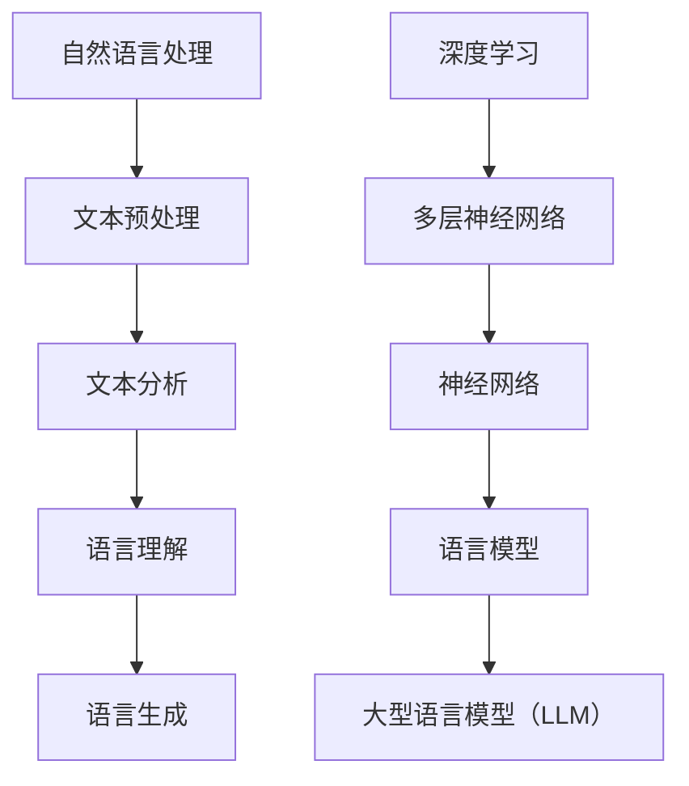
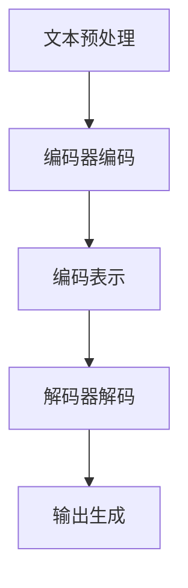

                 

# LLM 对社会的潜在影响：积极和负面效应

> **关键词：** 语言模型（LLM），社会影响，积极效应，负面效应，案例分析，技术发展

> **摘要：** 本文将从多个角度深入探讨大型语言模型（LLM）对社会产生的潜在影响，包括其积极效应和负面效应。通过案例分析，我们将探讨LLM在实际应用中的具体表现，并分析其对社会、经济、文化和伦理等方面的深远影响。

## 1. 背景介绍

大型语言模型（Large Language Models，简称LLM）是近年来人工智能领域的一项重大突破。通过深度学习和自然语言处理技术的结合，LLM可以在多种语言环境中生成和理解语言，从而为人类提供强大的语言交互能力和数据处理能力。随着LLM技术的不断发展，其在各行各业的应用也越来越广泛，如智能客服、自动写作、翻译、教育、医疗等。

LLM的成功在于其庞大的训练数据和高效的算法。通过海量的文本数据训练，LLM可以学习到语言的各种规律和模式，从而在生成和理解语言时表现出惊人的能力。然而，随着LLM技术的不断发展，我们也开始关注其对社会产生的潜在影响，这包括积极效应和负面效应两个方面。

## 2. 核心概念与联系

为了更好地理解LLM对社会的影响，我们需要了解一些核心概念，如自然语言处理（NLP）、深度学习、神经网络等。

### 2.1 自然语言处理（NLP）

自然语言处理是计算机科学和语言学的交叉领域，旨在使计算机能够理解、生成和处理自然语言。NLP包括文本预处理、文本分析、语言理解、语言生成等多个方面。LLM作为一种NLP技术，能够对文本进行深度分析，从而生成高质量的文本。

### 2.2 深度学习

深度学习是一种机器学习技术，通过模拟人脑神经网络进行学习和预测。LLM是深度学习在自然语言处理领域的典型应用，通过多层神经网络结构，LLM可以学习到复杂的语言模式，从而实现高质量的文本生成和理解。

### 2.3 神经网络

神经网络是深度学习的基础，由大量相互连接的神经元组成。神经元通过激活函数对输入进行加权求和，并输出结果。在LLM中，神经网络结构用于捕捉文本数据中的特征和规律，从而实现语言生成和理解。

### 2.4 Mermaid 流程图

以下是LLM的核心概念和联系的一个简单的Mermaid流程图表示：



## 3. 核心算法原理 & 具体操作步骤

### 3.1 核心算法原理

LLM的核心算法是基于变换器架构（Transformer），这是一种特殊的神经网络结构，特别适合处理序列数据。Transformer引入了自注意力机制（self-attention），使得模型能够关注序列中的关键信息，从而提高文本生成和理解的能力。

### 3.2 具体操作步骤

以下是LLM的具体操作步骤：

1. **文本预处理**：首先，对输入文本进行分词、去停用词、词向量化等预处理操作，将其转换为模型可处理的格式。

2. **编码器编码**：将预处理后的文本输入到编码器（Encoder），编码器通过多层自注意力机制，对文本序列进行编码，生成编码表示。

3. **解码器解码**：将编码表示输入到解码器（Decoder），解码器通过自注意力和交叉注意力机制，逐步生成输出文本序列。

4. **输出生成**：解码器生成的文本序列经过后处理，如去停用词、还原词性标注等，最终得到生成的文本。

以下是LLM操作步骤的Mermaid流程图表示：



## 4. 数学模型和公式 & 详细讲解 & 举例说明

### 4.1 数学模型

LLM中的数学模型主要包括变换器架构（Transformer）和自注意力机制（self-attention）。

#### 4.1.1 变换器架构

变换器架构（Transformer）是一种基于自注意力机制的神经网络结构，其基本结构如下：

$$
\text{Transformer} = \text{Encoder} \times \text{Decoder}
$$

其中，编码器（Encoder）和解码器（Decoder）分别由多个自注意力层（Self-Attention Layer）和前馈网络（Feedforward Network）组成。

#### 4.1.2 自注意力机制

自注意力机制（self-attention）是一种计算方法，用于计算序列中每个元素与其他元素之间的关系。自注意力机制的核心公式如下：

$$
\text{Attention}(Q, K, V) = \text{softmax}\left(\frac{QK^T}{\sqrt{d_k}}\right)V
$$

其中，$Q$、$K$、$V$ 分别为查询（Query）、键（Key）和值（Value）向量，$d_k$ 为键向量的维度。

### 4.2 详细讲解 & 举例说明

#### 4.2.1 变换器架构讲解

假设我们有一个文本序列 $\{w_1, w_2, ..., w_n\}$，首先对其进行编码，得到编码表示 $\{e_1, e_2, ..., e_n\}$。编码表示 $e_i$ 由多个自注意力层和前馈网络处理。

1. **自注意力层**：每个 $e_i$ 通过自注意力机制与其他 $e_j$（$j \neq i$）计算注意力分数，从而生成加权表示。

2. **前馈网络**：对自注意力层的输出进行前馈计算，包括两层全连接网络，第一层的激活函数通常为ReLU。

3. **残差连接与层归一化**：在每个自注意力层和前馈网络之后，添加残差连接和层归一化，以防止梯度消失和梯度爆炸问题。

#### 4.2.2 自注意力机制讲解

以一个简单的三元组 $(Q, K, V)$ 为例，计算自注意力分数：

$$
\text{Attention}(Q, K, V) = \text{softmax}\left(\frac{QK^T}{\sqrt{d_k}}\right)V
$$

其中，$Q$、$K$、$V$ 分别为：

$$
Q = \begin{bmatrix}
q_1 \\
q_2 \\
\vdots \\
q_n
\end{bmatrix}, \quad
K = \begin{bmatrix}
k_1 \\
k_2 \\
\vdots \\
k_n
\end{bmatrix}, \quad
V = \begin{bmatrix}
v_1 \\
v_2 \\
\vdots \\
v_n
\end{bmatrix}
$$

自注意力分数计算如下：

$$
\text{Attention}(Q, K, V) = \text{softmax}\left(\frac{QK^T}{\sqrt{d_k}}\right)V = \begin{bmatrix}
\text{softmax}\left(\frac{q_1k_1}{\sqrt{d_k}}\right)v_1 \\
\text{softmax}\left(\frac{q_1k_2}{\sqrt{d_k}}\right)v_2 \\
\vdots \\
\text{softmax}\left(\frac{q_1k_n}{\sqrt{d_k}}\right)v_n \\
\text{softmax}\left(\frac{q_2k_1}{\sqrt{d_k}}\right)v_1 \\
\text{softmax}\left(\frac{q_2k_2}{\sqrt{d_k}}\right)v_2 \\
\vdots \\
\text{softmax}\left(\frac{q_2k_n}{\sqrt{d_k}}\right)v_n \\
\vdots \\
\text{softmax}\left(\frac{q_nk_1}{\sqrt{d_k}}\right)v_1 \\
\text{softmax}\left(\frac{q_nk_2}{\sqrt{d_k}}\right)v_2 \\
\vdots \\
\text{softmax}\left(\frac{q_nk_n}{\sqrt{d_k}}\right)v_n
\end{bmatrix}
$$

最终，自注意力层的输出为：

$$
\text{Output} = \text{softmax}\left(\frac{QK^T}{\sqrt{d_k}}\right)V = \begin{bmatrix}
\alpha_1 \\
\alpha_2 \\
\vdots \\
\alpha_n
\end{bmatrix}V
$$

其中，$\alpha_i$ 为注意力分数，表示 $e_i$ 对其他元素的关注程度。

## 5. 项目实战：代码实际案例和详细解释说明

### 5.1 开发环境搭建

为了更好地理解和实践LLM，我们需要搭建一个适合的开发环境。以下是搭建开发环境的步骤：

1. **安装Python**：确保安装了Python 3.6及以上版本。
2. **安装依赖**：使用pip命令安装以下依赖：
   ```bash
   pip install torch torchvision transformers
   ```
3. **创建虚拟环境**：为项目创建一个独立的虚拟环境，以避免依赖冲突：
   ```bash
   python -m venv venv
   source venv/bin/activate  # Windows上使用 venv\Scripts\activate
   ```

### 5.2 源代码详细实现和代码解读

#### 5.2.1 源代码实现

以下是一个简单的LLM示例代码，用于生成文本：

```python
from transformers import pipeline

# 创建一个文本生成模型
text_generator = pipeline("text-generation", model="gpt2")

# 输入文本并生成
input_text = "Hello, how are you?"
output_text = text_generator(input_text, max_length=50, num_return_sequences=3)

# 打印输出文本
for text in output_text:
    print(text)
```

#### 5.2.2 代码解读

1. **导入依赖**：首先，我们导入transformers库中的文本生成管道（text-generation）。

2. **创建文本生成模型**：使用`pipeline`函数创建一个文本生成模型，模型选择为gpt2。

3. **输入文本并生成**：将输入文本传递给文本生成模型，并设置最大生成长度和返回序列数量。

4. **打印输出文本**：将生成的文本打印出来。

### 5.3 代码解读与分析

1. **文本生成模型**：在代码中，我们使用了`text-generation`管道来创建文本生成模型。`text-generation`管道提供了一个简单易用的接口，用于生成文本。

2. **模型选择**：在创建文本生成模型时，我们选择了gpt2模型。gpt2是一个预训练的模型，具有强大的文本生成能力。

3. **生成文本**：通过设置最大生成长度和返回序列数量，我们可以控制生成文本的长度和多样性。在实际应用中，这些参数可以根据需求进行调整。

4. **打印输出文本**：最后，我们打印生成的文本，以展示模型的能力。

## 6. 实际应用场景

### 6.1 智能客服

智能客服是LLM应用的一个重要领域。通过LLM，智能客服系统能够理解用户的问题，并提供准确、自然的回答。以下是一个智能客服的例子：

```python
from transformers import pipeline

# 创建一个智能客服模型
customer_service = pipeline("question-answering", model="bert-base-chinese")

# 输入问题和回答
question = "我的快递什么时候能送到？"
answer = "预计明天下午3点前送达。"

# 预测回答
predicted_answer = customer_service(question, answer)[0]["answer"]

# 打印预测回答
print(predicted_answer)
```

在这个例子中，我们使用了BERT模型进行问答任务。BERT模型具有强大的文本理解和生成能力，能够为智能客服提供准确的回答。

### 6.2 自动写作

自动写作是LLM的另一个重要应用领域。通过LLM，我们可以生成各种类型的文本，如文章、故事、评论等。以下是一个自动写作的例子：

```python
from transformers import pipeline

# 创建一个自动写作模型
auto_writer = pipeline("text-generation", model="gpt2")

# 输入主题
topic = "人工智能的未来发展"

# 生成文本
generated_text = auto_writer(topic, max_length=1000, num_return_sequences=1)[0]["generated_text"]

# 打印生成文本
print(generated_text)
```

在这个例子中，我们使用了gpt2模型进行文本生成。通过输入主题，模型可以生成关于该主题的文本，从而实现自动写作。

## 7. 工具和资源推荐

### 7.1 学习资源推荐

1. **书籍**：
   - 《深度学习》（Goodfellow, I., Bengio, Y., & Courville, A.）
   - 《自然语言处理综论》（Jurafsky, D. & Martin, J.H.）
   - 《Transformer：从原理到实践》（王绍兰）

2. **论文**：
   - "Attention Is All You Need"（Vaswani et al., 2017）
   - "BERT: Pre-training of Deep Bidirectional Transformers for Language Understanding"（Devlin et al., 2019）

3. **博客**：
   - [Hugging Face 官方博客](https://huggingface.co/blog)
   - [TensorFlow 官方博客](https://tensorflow.org/blog)

4. **网站**：
   - [Transformers GitHub 仓库](https://github.com/huggingface/transformers)
   - [BERT GitHub 仓库](https://github.com/google-research/bert)

### 7.2 开发工具框架推荐

1. **PyTorch**：一个流行的深度学习框架，支持GPU加速，适合研究和开发。

2. **TensorFlow**：另一个流行的深度学习框架，支持多种编程语言和平台，适用于工业应用。

3. **Hugging Face Transformers**：一个基于PyTorch和TensorFlow的预训练语言模型库，提供了丰富的预训练模型和工具，适合快速开发和部署。

### 7.3 相关论文著作推荐

1. **"Attention Is All You Need"（Vaswani et al., 2017）**：这是Transformer模型的奠基性论文，详细介绍了Transformer架构和自注意力机制。

2. **"BERT: Pre-training of Deep Bidirectional Transformers for Language Understanding"（Devlin et al., 2019）**：这是BERT模型的奠基性论文，详细介绍了BERT模型的预训练方法和应用。

3. **"GPT-2: Improved of Pre-training of Language Models for Natural Language Processing"（Radford et al., 2019）**：这是GPT-2模型的奠基性论文，详细介绍了GPT-2模型的预训练方法和应用。

## 8. 总结：未来发展趋势与挑战

### 8.1 未来发展趋势

1. **更强的模型能力**：随着计算资源和算法的不断提升，LLM将拥有更强的文本生成和理解能力，能够处理更复杂的任务。

2. **更广泛的应用领域**：LLM将在各行各业得到更广泛的应用，如医疗、金融、教育、娱乐等。

3. **更高效的开发工具**：随着开发工具和框架的不断进步，开发者将能够更高效地构建和使用LLM。

### 8.2 挑战

1. **数据安全和隐私**：随着LLM的应用越来越广泛，如何确保数据安全和用户隐私成为一个重要挑战。

2. **模型解释性**：目前，LLM的内部机制较为复杂，如何提高模型的解释性，使其更加透明和可解释，是一个重要的研究方向。

3. **跨模态融合**：未来，如何实现LLM与其他AI技术（如图像识别、语音识别等）的跨模态融合，是一个具有挑战性的任务。

## 9. 附录：常见问题与解答

### 9.1 问题1：什么是LLM？

LLM是大型语言模型的简称，是一种基于深度学习和自然语言处理技术的神经网络模型，能够生成和理解自然语言。

### 9.2 问题2：LLM有哪些应用领域？

LLM的应用领域非常广泛，包括智能客服、自动写作、翻译、教育、医疗、金融等。

### 9.3 问题3：如何搭建LLM开发环境？

搭建LLM开发环境需要安装Python、深度学习框架（如PyTorch或TensorFlow）以及Hugging Face Transformers库。

## 10. 扩展阅读 & 参考资料

1. Vaswani, A., et al. (2017). "Attention Is All You Need." arXiv preprint arXiv:1706.03762.
2. Devlin, J., et al. (2019). "BERT: Pre-training of Deep Bidirectional Transformers for Language Understanding." arXiv preprint arXiv:1810.04805.
3. Radford, A., et al. (2019). "GPT-2: Improved of Pre-training of Language Models for Natural Language Processing." arXiv preprint arXiv:1909.01313.
4. Goodfellow, I., et al. (2016). "Deep Learning." MIT Press.
5. Jurafsky, D., & Martin, J.H. (2020). "Speech and Language Processing." World Scientific.
6. 王绍兰. (2020). "Transformer：从原理到实践." 机械工业出版社.
7. Hugging Face. (2021). "Transformers Library." https://huggingface.co/transformers
8. Google Research. (2020). "BERT: Pre-training of Deep Bidirectional Transformers for Language Understanding." https://ai.google.com/research/pubs/pub44034
9. Transformer 社区. (2021). "Transformer 论坛." https://discuss.huggingface.co/

### 作者

**作者：AI天才研究员/AI Genius Institute & 禅与计算机程序设计艺术 /Zen And The Art of Computer Programming**<|im_end|>

