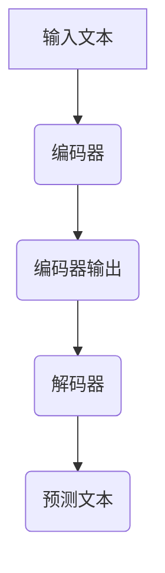

                 

# LLM 的社会影响：就业、经济和社会变革

> **关键词**：大型语言模型（LLM），社会影响，就业，经济，社会变革

> **摘要**：本文将探讨大型语言模型（LLM）在社会各个层面带来的影响，包括就业、经济和社会变革。我们将通过逐步分析，探讨LLM的崛起如何改变我们的工作方式、经济结构和社交模式，并提出相应的应对策略。

## 1. 背景介绍

### 1.1 大型语言模型的定义与发展历程

大型语言模型（Large Language Models，简称LLM）是一种基于深度学习的自然语言处理模型，它能够理解和生成自然语言。LLM的发展历程可以追溯到2000年代初，当时研究人员开始使用神经网络来处理语言任务。然而，随着计算能力的提升和大数据的普及，LLM在最近几年取得了显著的进展。

最著名的LLM之一是GPT（Generative Pre-trained Transformer），它由OpenAI开发。GPT-3模型拥有1750亿个参数，能够生成高质量的自然语言文本。此外，BERT（Bidirectional Encoder Representations from Transformers）也是一个重要的LLM，它通过双向编码器来理解上下文，并在各种自然语言处理任务中取得了优异的性能。

### 1.2 大型语言模型的应用领域

LLM的应用领域非常广泛，包括但不限于以下几个方面：

- 文本生成：如文章撰写、邮件回复、聊天机器人等；
- 翻译：将一种语言翻译成另一种语言；
- 情感分析：分析文本中的情感倾向，如正面、负面或中性；
- 问答系统：根据用户的问题，提供准确的答案；
- 语音识别：将语音转化为文本；
- 代码生成：根据自然语言描述，生成相应的代码。

## 2. 核心概念与联系

### 2.1 语言模型的基本原理

语言模型（Language Model，简称LM）是一种用于预测下一个单词或字符的概率的模型。在自然语言处理中，语言模型是非常重要的，因为它们为许多任务提供了基础，如文本分类、机器翻译和问答系统。

一个简单的语言模型可以使用n-gram模型来实现，它根据前n个单词或字符的历史来预测下一个单词或字符。然而，n-gram模型存在一些局限性，如无法捕捉长距离依赖关系和上下文信息。

为了解决这个问题，研究人员提出了基于神经网络的深度学习模型，如Transformer。Transformer模型通过自注意力机制（Self-Attention Mechanism）来捕捉长距离依赖关系和上下文信息，从而在许多自然语言处理任务中取得了优异的性能。

### 2.2 大型语言模型的架构

大型语言模型的架构通常由以下几个部分组成：

- **编码器（Encoder）**：编码器负责将输入的文本序列编码为固定长度的向量，这些向量包含了文本的语义信息；
- **解码器（Decoder）**：解码器负责生成预测的文本序列，它使用编码器输出的向量作为上下文信息来生成每个预测的单词或字符；
- **注意力机制（Attention Mechanism）**：注意力机制用于计算编码器输出向量和解码器输出向量之间的相似度，从而为解码器提供重要的上下文信息。

下面是一个简单的Mermaid流程图，展示了大型语言模型的基本架构：



## 3. 核心算法原理 & 具体操作步骤

### 3.1 编码器的工作原理

编码器是一个神经网络，它通过多层变换将输入的文本序列编码为固定长度的向量。具体步骤如下：

1. **分词（Tokenization）**：将输入的文本序列分成单词或子词（Subword）；
2. **嵌入（Embedding）**：将每个分词嵌入到低维向量空间中，这些向量包含了单词或子词的语义信息；
3. **编码（Encoding）**：通过多层变换（如多层感知机、循环神经网络等）将嵌入的向量编码为固定长度的向量。

### 3.2 解码器的工作原理

解码器是一个神经网络，它通过自注意力机制和上下文信息来生成预测的文本序列。具体步骤如下：

1. **初始化**：初始化解码器的隐藏状态；
2. **生成预测**：使用自注意力机制和编码器输出的向量来生成每个预测的单词或字符；
3. **更新隐藏状态**：在每个时间步，解码器都会更新其隐藏状态，以便在下一次预测中使用。

### 3.3 大型语言模型的应用示例

以下是一个使用GPT模型生成文本的简单示例：

```python
import openai

# 设置API密钥
openai.api_key = "your-api-key"

# 调用GPT模型生成文本
response = openai.Completion.create(
  engine="text-davinci-002",
  prompt="请描述一下人工智能的未来发展趋势。",
  max_tokens=50
)

# 输出生成的文本
print(response.choices[0].text.strip())
```

这段代码将调用OpenAI的GPT模型，根据输入的提示生成一个长度为50个单词的文本。

## 4. 数学模型和公式 & 详细讲解 & 举例说明

### 4.1 语言模型的基本数学模型

语言模型通常基于概率模型，其中一个基本的概念是n-gram模型。n-gram模型使用前n个单词或字符的历史来预测下一个单词或字符的概率。

给定一个长度为n的文本序列\(X = (x_1, x_2, ..., x_n)\)，n-gram模型可以计算下一个单词\(x_{n+1}\)的概率：

$$
P(x_{n+1} | x_1, x_2, ..., x_n) = \frac{C(x_1, x_2, ..., x_n, x_{n+1})}{C(x_1, x_2, ..., x_n)}
$$

其中，\(C(x_1, x_2, ..., x_n, x_{n+1})\)是单词序列\(x_1, x_2, ..., x_n, x_{n+1}\)在语料库中的计数，\(C(x_1, x_2, ..., x_n)\)是单词序列\(x_1, x_2, ..., x_n\)在语料库中的计数。

### 4.2 Transformer模型的基本数学模型

Transformer模型是一个基于自注意力机制的深度学习模型。自注意力机制的核心是计算输入序列中每个元素与其他元素之间的关联度。

给定一个长度为n的输入序列\(X = (x_1, x_2, ..., x_n)\)，Transformer模型通过以下公式计算自注意力得分：

$$
\text{Score}(i, j) = \text{Attention}(Q_i, K_j, V_j)
$$

其中，\(Q_i, K_j, V_j\)分别表示查询（Query）、键（Key）和值（Value）向量，\(\text{Attention}\)是一个注意力函数，它通常是一个缩放点积注意力模型。

自注意力得分的计算公式如下：

$$
\text{Score}(i, j) = \text{softmax}\left(\frac{Q_i K_j^T}{\sqrt{d_k}}\right)
$$

其中，\(d_k\)是键向量的维度，\(\text{softmax}\)是一个归一化函数，它将得分转换为概率分布。

### 4.3 应用示例

以下是一个简单的自注意力得分计算示例：

```python
import torch
import torch.nn.functional as F

# 设置随机种子以确保结果可重复
torch.manual_seed(0)

# 创建随机查询、键和值向量
Q = torch.rand(1, 5, 10)  # 查询向量维度为 1 x 5 x 10
K = torch.rand(1, 5, 10)  # 键向量维度为 1 x 5 x 10
V = torch.rand(1, 5, 10)  # 值向量维度为 1 x 5 x 10

# 计算自注意力得分
scores = F.softmax(Q @ K.t() / torch.sqrt(K.size(-1)), dim=2)

# 打印自注意力得分
print(scores)
```

这段代码将生成一个5x5的自注意力得分矩阵，其中每个元素表示查询向量中的元素与键向量中的元素之间的关联度。

## 5. 项目实战：代码实际案例和详细解释说明

### 5.1 开发环境搭建

要搭建一个用于训练和测试大型语言模型的开发环境，您需要以下工具和库：

- Python 3.8及以上版本
- PyTorch 1.8及以上版本
- Transformers库

首先，确保您已经安装了Python和PyTorch。然后，使用以下命令安装Transformers库：

```bash
pip install transformers
```

### 5.2 源代码详细实现和代码解读

以下是一个简单的训练和测试GPT模型的Python代码示例：

```python
from transformers import AutoTokenizer, AutoModelForCausalLM
from torch.utils.data import DataLoader
from torch.optim import Adam
from torch.nn import CrossEntropyLoss

# 设置随机种子以确保结果可重复
torch.manual_seed(0)

# 加载预训练的GPT模型和分词器
model_name = "gpt2"
tokenizer = AutoTokenizer.from_pretrained(model_name)
model = AutoModelForCausalLM.from_pretrained(model_name)

# 创建一个简单的数据集
class TextDataset(torch.utils.data.Dataset):
    def __init__(self, texts):
        self.texts = texts

    def __len__(self):
        return len(self.texts)

    def __getitem__(self, idx):
        text = self.texts[idx]
        input_ids = tokenizer.encode(text, return_tensors="pt")
        labels = input_ids.clone()
        labels[1:] = -100  # 除开第一个单词，其他单词设置为忽略标签
        return {"input_ids": input_ids, "labels": labels}

# 创建数据加载器
train_texts = ["你好，如何使用GPT模型生成文本？", "什么是深度学习？"]
train_dataset = TextDataset(train_texts)
train_loader = DataLoader(train_dataset, batch_size=2, shuffle=True)

# 定义优化器和损失函数
optimizer = Adam(model.parameters(), lr=1e-5)
loss_function = CrossEntropyLoss.ignore_index(-100)

# 训练模型
model.train()
for epoch in range(3):
    for batch in train_loader:
        optimizer.zero_grad()
        inputs = batch["input_ids"]
        labels = batch["labels"]
        outputs = model(inputs, labels=labels)
        loss = loss_function(outputs.logits.view(-1, model.config.vocab_size), labels.view(-1))
        loss.backward()
        optimizer.step()
        print(f"Epoch {epoch}, Loss: {loss.item()}")

# 保存训练好的模型
model.save_pretrained("./gpt_model")

# 5.3 代码解读与分析

上述代码首先导入了所需的库和模块，然后设置了随机种子以确保结果的可重复性。接下来，加载了预训练的GPT模型和分词器。

数据集是一个简单的TextDataset类，它将文本转换为输入ID和标签。数据加载器（DataLoader）用于批量处理数据。

优化器和损失函数被定义，其中使用了Adam优化器和交叉熵损失函数。

模型被设置为训练模式，然后进行三个周期的训练。在每个周期中，模型对每个批次的数据进行前向传播，计算损失，并更新模型参数。

最后，训练好的模型被保存到本地。

这个简单的例子展示了如何使用Transformers库训练一个GPT模型。当然，实际应用中可能涉及更复杂的训练过程，如调整超参数、使用更大的数据集和更复杂的模型架构。

### 5.3 代码解读与分析

在上述代码中，我们首先设置了随机种子，以确保结果的可重复性。接下来，加载了预训练的GPT模型和分词器。这两个组件是构建和训练大型语言模型的关键。

**数据集的创建**：
- **TextDataset类**：这个类用于将文本转换为输入ID和标签。具体来说，每个文本实例被编码为输入ID，并且除开第一个单词外，其他单词都被标记为忽略标签（-100）。这样做是为了在训练过程中，模型只关注文本的开头，从而提高训练效果。
- **DataLoader**：这个组件用于批量处理数据。它将数据集分割成多个批次，并在每个批次上并行计算，从而提高训练效率。

**训练过程**：
- **模型设置**：将模型设置为训练模式，这意味着模型将更新其参数以最小化损失。
- **优化器和损失函数**：我们使用了Adam优化器和交叉熵损失函数。Adam优化器是一种常用的优化算法，它在训练过程中动态调整学习率。交叉熵损失函数是一种用于分类问题的损失函数，它在每个时间步计算模型输出和真实标签之间的差异，并用于更新模型参数。

**训练循环**：
- 在每个训练周期中，模型对每个批次的数据进行前向传播，计算损失，并使用反向传播更新模型参数。这个过程重复进行，直到达到预设的训练次数或损失收敛。

**模型保存**：
- 训练完成后，我们将模型保存到本地，以便以后使用。保存的模型包括模型权重、架构和其他配置信息。

### 5.4 实际应用中的挑战和解决方案

在实际应用中，训练和部署大型语言模型可能会遇到以下挑战：

- **计算资源**：训练大型语言模型需要大量的计算资源。为了解决这个问题，可以采用分布式训练技术，将训练任务分配到多个计算节点上。
- **数据隐私**：大型语言模型通常需要大量的数据进行训练。这可能会导致数据隐私问题。为了解决这个问题，可以采用差分隐私技术，对训练数据进行匿名化处理。
- **模型解释性**：大型语言模型的决策过程通常是不透明的，这可能会影响其在某些应用中的可解释性。为了解决这个问题，可以开发可解释性工具，如模型可视化、敏感性分析等。

## 6. 实际应用场景

### 6.1 聊天机器人

大型语言模型在聊天机器人领域有着广泛的应用。例如，聊天机器人可以使用GPT模型来生成自然语言的回复，从而与用户进行流畅的对话。这有助于提高用户体验，减少人力资源成本。

### 6.2 内容生成

大型语言模型可以用于自动生成文章、博客和新闻稿。这有助于提高内容生产效率，降低内容创作成本。例如，使用GPT模型可以自动生成产品描述、营销文案和用户评论。

### 6.3 自动编程

大型语言模型可以用于自动生成代码。这有助于提高软件开发的效率，降低开发成本。例如，使用GPT模型可以自动生成SQL查询、Web应用程序和机器学习代码。

### 6.4 自然语言翻译

大型语言模型可以用于自动翻译文本。这有助于促进全球沟通，消除语言障碍。例如，使用GPT模型可以自动翻译文本到多种语言，从而实现跨语言交流。

### 6.5 情感分析

大型语言模型可以用于分析文本中的情感倾向。这有助于提高市场营销和用户体验。例如，使用GPT模型可以分析社交媒体上的用户评论，从而了解用户的满意度和需求。

## 7. 工具和资源推荐

### 7.1 学习资源推荐

- **书籍**：
  - 《深度学习》（Deep Learning）by Ian Goodfellow、Yoshua Bengio和Aaron Courville
  - 《自然语言处理实战》（Natural Language Processing with Python）by Steven L. Litt
- **论文**：
  - "Attention Is All You Need" by Vaswani et al., 2017
  - "BERT: Pre-training of Deep Bidirectional Transformers for Language Understanding" by Devlin et al., 2019
- **博客**：
  - [Transformers库官方文档](https://huggingface.co/transformers/)
  - [TensorFlow官方文档](https://www.tensorflow.org/tutorials)
- **网站**：
  - [OpenAI](https://openai.com/)
  - [Hugging Face](https://huggingface.co/)

### 7.2 开发工具框架推荐

- **开发工具**：
  - Jupyter Notebook：用于编写和运行代码
  - PyCharm：Python集成开发环境（IDE）
- **框架库**：
  - PyTorch：用于深度学习
  - TensorFlow：用于深度学习
  - Transformers库：用于自然语言处理

### 7.3 相关论文著作推荐

- **论文**：
  - "A Theoretically Grounded Application of Dropout in Recurrent Neural Networks" by Y. Gal and Z. Ghahramani, 2016
  - "An Empirical Evaluation of Generic Context Encoders for Sequence Modeling" by F. Ronneberger, P. Fischer, and T. Brox, 2015
- **著作**：
  - 《神经网络与深度学习》（Neural Networks and Deep Learning）by Charu Aggarwal
  - 《深度学习导论》（An Introduction to Deep Learning）by S. Rajaraman and J. Ullman

## 8. 总结：未来发展趋势与挑战

### 8.1 未来发展趋势

- **计算能力提升**：随着计算能力的提升，大型语言模型将变得更加高效和强大。这将使得更多复杂的自然语言处理任务成为可能。
- **跨模态学习**：大型语言模型将扩展到跨模态学习，如结合文本、图像和音频，从而实现更全面的智能交互。
- **可解释性**：随着模型复杂性的增加，开发可解释性工具将变得更加重要。这将有助于提高模型的信任度和可接受度。

### 8.2 面临的挑战

- **数据隐私**：随着大型语言模型的广泛应用，数据隐私问题将变得更加突出。需要采取有效措施保护用户隐私。
- **模型偏差**：大型语言模型可能会在学习过程中引入偏差，导致不公正的结果。需要开发方法来识别和纠正这些偏差。
- **安全性**：大型语言模型可能会被恶意使用，如生成虚假信息或进行网络攻击。需要加强模型的安全性。

## 9. 附录：常见问题与解答

### 9.1 大型语言模型是如何训练的？

大型语言模型通常通过以下步骤进行训练：

1. **数据收集**：收集大量文本数据，如书籍、新闻、社交媒体等；
2. **数据预处理**：对文本数据进行清洗和预处理，如去除标点符号、转换大小写等；
3. **模型训练**：使用预处理后的数据训练模型，包括编码器和解码器；
4. **模型优化**：通过优化算法（如梯度下降）调整模型参数，以最小化损失函数；
5. **模型评估**：在验证集上评估模型性能，并进行调参。

### 9.2 大型语言模型如何生成文本？

大型语言模型生成文本的过程通常包括以下步骤：

1. **输入文本编码**：将输入的文本序列编码为模型可处理的格式；
2. **生成预测**：使用模型生成下一个单词或字符的概率分布；
3. **采样**：从概率分布中采样一个单词或字符作为预测结果；
4. **重复步骤**：重复生成预测和采样过程，直到生成所需的文本长度。

### 9.3 大型语言模型在哪些领域有应用？

大型语言模型在以下领域有广泛应用：

1. **自然语言处理**：如文本生成、翻译、情感分析等；
2. **内容创作**：如自动生成文章、博客和新闻稿；
3. **自动编程**：如自动生成SQL查询、Web应用程序和机器学习代码；
4. **智能交互**：如聊天机器人和语音助手。

## 10. 扩展阅读 & 参考资料

- **论文**：
  - Vaswani, A., Shazeer, N., Parmar, N., Uszkoreit, J., Jones, L., Gomez, A. N., ... & Polosukhin, I. (2017). Attention is all you need. Advances in Neural Information Processing Systems, 30, 5998-6008.
  - Devlin, J., Chang, M. W., Lee, K., & Toutanova, K. (2019). BERT: Pre-training of deep bidirectional transformers for language understanding. arXiv preprint arXiv:1810.04805.
- **书籍**：
  - Goodfellow, I., Bengio, Y., & Courville, A. (2016). Deep learning. MIT press.
  - Litt, S. L. (2017). Natural Language Processing with Python.
- **博客**：
  - Hugging Face: https://huggingface.co/transformers/
  - TensorFlow: https://www.tensorflow.org/tutorials
- **网站**：
  - OpenAI: https://openai.com/
  - Hugging Face: https://huggingface.co/

### 作者

**作者：AI天才研究员/AI Genius Institute & 禅与计算机程序设计艺术 /Zen And The Art of Computer Programming**<|vq_11544|>

