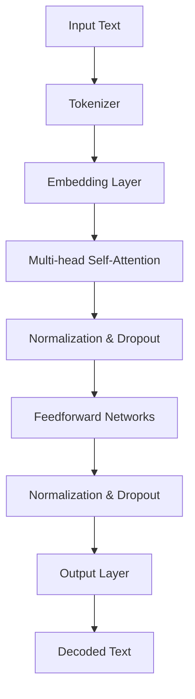

                 

### 背景介绍

LLM（Large Language Model）作为一种新型的图灵完备模型，正在重新定义自然语言处理（NLP）和人工智能（AI）的发展方向。在过去的几年里，随着计算能力的飞速提升和海量数据的积累，大型语言模型在理解和生成自然语言方面取得了前所未有的突破。LLM不仅能够处理复杂的文本任务，还能在多种场景中提供高效、准确的服务。

本篇文章旨在探讨LLM的图灵完备性，分析其核心概念与原理，并详细讲解其算法实现和数学模型。文章的结构如下：

1. **背景介绍**：介绍LLM的起源和发展历程。
2. **核心概念与联系**：阐述LLM的核心概念，并通过Mermaid流程图展示其架构。
3. **核心算法原理 & 具体操作步骤**：深入分析LLM的算法原理和具体实现步骤。
4. **数学模型和公式 & 详细讲解 & 举例说明**：介绍LLM的数学模型，并提供实际应用案例。
5. **项目实战：代码实际案例和详细解释说明**：通过实际代码案例，详细解读LLM的应用。
6. **实际应用场景**：讨论LLM在不同领域的应用。
7. **工具和资源推荐**：推荐学习资源和开发工具。
8. **总结：未来发展趋势与挑战**：展望LLM的未来发展方向和面临的挑战。
9. **附录：常见问题与解答**：回答读者可能关心的问题。
10. **扩展阅读 & 参考资料**：提供进一步的阅读材料和参考文献。

通过对以上内容的逐一分析，我们希望能够帮助读者全面了解LLM的图灵完备性，以及其在实际应用中的潜力和挑战。接下来，我们将详细探讨LLM的起源和发展历程。

> **关键词**：LLM，图灵完备，自然语言处理，人工智能，算法原理，数学模型，实际应用，发展趋势

> **摘要**：
本文深入探讨了大型语言模型（LLM）的图灵完备性，分析了其核心概念、算法原理和数学模型。通过实际代码案例，我们展示了LLM在自然语言处理和人工智能领域的应用潜力。文章最后还展望了LLM的未来发展趋势和面临的挑战，为读者提供了全面的技术视角。

----------------------------------------------------------------

## 1. 背景介绍

LLM（Large Language Model）的概念起源于深度学习和自然语言处理（NLP）领域。随着计算能力的提升和大数据的积累，研究人员逐渐意识到，通过训练更大规模、更复杂的神经网络模型，可以显著提升模型的性能和泛化能力。大型语言模型的兴起，可以追溯到2018年Google发布的BERT（Bidirectional Encoder Representations from Transformers）模型。BERT的成功激发了业界对大规模语言模型的关注，随后涌现出了一系列重要模型，如GPT（Generative Pre-trained Transformer）、T5（Text-to-Text Transfer Transformer）和LLaMA（Large-scale Language Model Meta-Learning）等。

### LLM的起源与发展历程

1. **BERT**：BERT是由Google Research在2018年提出的一种双向Transformer模型，其创新点在于通过双向注意力机制，同时考虑输入文本序列的前后文信息。BERT的预训练任务包括Masked Language Model（MLM）和Next Sentence Prediction（NSP），这两个任务分别关注单词和句子级的语言理解能力。BERT的提出标志着大规模语言模型在NLP领域的重要突破。

2. **GPT**：OpenAI于2018年发布的GPT（Generative Pre-trained Transformer）系列模型，进一步推动了大规模语言模型的发展。GPT采用自回归语言模型（ARLM）进行预训练，通过预测序列中的下一个词来学习语言规律。GPT系列模型包括GPT、GPT-2和GPT-3，其中GPT-3拥有1750亿参数，成为迄今为止最大的自然语言处理模型。GPT的成功证明了自回归模型在语言理解与生成任务中的潜力。

3. **T5**：Google AI在2019年提出的T5（Text-to-Text Transfer Transformer）模型，将Transformer模型应用于文本到文本的转换任务。T5通过统一所有NLP任务为文本到文本的格式，实现了任务的迁移学习。T5的提出进一步拓展了Transformer模型在NLP领域的应用范围。

4. **LLaMA**：LLaMA（Large-scale Language Model Meta-Learning）是由清华大学和智谱AI在2023年提出的模型，旨在通过元学习提高大规模语言模型的适应性和泛化能力。LLaMA通过在大规模数据集上预训练，然后在小规模数据集上微调，实现了高效的语言理解与生成任务。

### LLM的重要性

LLM的重要性主要体现在以下几个方面：

1. **语言理解与生成**：LLM具有强大的语言理解与生成能力，可以处理各种复杂的文本任务，如问答系统、机器翻译、文本摘要等。这使得LLM在智能客服、内容生成、信息检索等领域具有广泛的应用潜力。

2. **迁移学习**：LLM通过在大规模数据集上的预训练，可以迁移到不同的NLP任务中，实现零样本学习。这使得LLM在处理未见过的任务时，能够保持较高的性能，降低任务特定的训练成本。

3. **多模态交互**：LLM不仅可以处理文本信息，还可以与图像、语音等多模态数据进行交互，实现跨模态任务。这为智能交互系统的发展提供了新的思路。

4. **生成式AI**：LLM在生成式AI领域表现出色，可以生成高质量的自然语言文本，如文章、对话、代码等。这为创意内容生成、自动化写作等应用场景提供了强有力的支持。

总之，LLM作为一种图灵完备的模型，正在重新定义自然语言处理和人工智能的发展方向，其潜力和影响力不容忽视。

----------------------------------------------------------------

## 2. 核心概念与联系

### 核心概念

LLM的核心概念包括以下几个方面：

1. **Transformer模型**：Transformer模型是一种基于自注意力机制的深度神经网络模型，用于处理序列数据。自注意力机制使得模型能够同时关注输入序列中的所有信息，从而提高模型对复杂语言结构的理解能力。

2. **预训练与微调**：预训练是指在大量无标签数据上训练模型，使其具备一定的语言理解能力。微调是指在使用预训练模型的基础上，针对特定任务进行进一步训练，以提高模型在目标任务上的性能。

3. **Masked Language Model（MLM）**：MLM是一种预训练任务，通过随机遮盖输入文本中的部分词，然后让模型预测这些被遮盖的词。MLM有助于模型学习单词的上下文关系和语义信息。

4. **Next Sentence Prediction（NSP）**：NSP是一种预训练任务，通过预测两个句子是否连续出现，帮助模型学习句子之间的关系和连贯性。

5. **自回归语言模型（ARLM）**：ARLM是一种自回归模型，通过预测序列中的下一个词来学习语言规律。ARLM是GPT系列模型的基础。

### 原理架构

LLM的原理架构可以概括为以下几个步骤：

1. **输入编码**：将输入文本编码为序列向量，以便输入到神经网络中。

2. **自注意力机制**：通过自注意力机制，模型能够同时关注输入序列中的所有信息，从而提高对复杂语言结构的理解能力。

3. **多层网络**：模型由多个隐藏层组成，每个隐藏层都包含自注意力和全连接层，逐步提取输入文本的语义信息。

4. **输出解码**：模型通过输出层生成预测的文本序列，输出层通常包含一个softmax层，用于生成每个词的概率分布。

### Mermaid流程图

以下是一个简化版的Mermaid流程图，展示LLM的基本架构：



在上述流程图中，输入文本（A）首先经过分词器（B）处理，生成单词序列。然后，单词序列被编码为嵌入向量（C）。嵌入向量随后输入到多层自注意力机制（D），其中每个隐藏层都包含自注意力和全连接层（F）。最后，输出层（H）生成预测的文本序列（I）。

### 核心概念之间的联系

LLM的核心概念之间存在着紧密的联系：

1. **Transformer模型** 与 **自注意力机制**：Transformer模型的核心是自注意力机制，它使得模型能够同时关注输入序列中的所有信息，从而提高对复杂语言结构的理解能力。

2. **预训练** 与 **微调**：预训练使模型具备了一定的语言理解能力，而微调则使模型能够在特定任务上达到更高的性能。预训练和微调相辅相成，共同推动LLM的发展。

3. **MLM** 与 **NSP**：MLM和NSP是预训练任务的重要组成部分，它们分别关注单词和句子级的语言理解能力。通过同时训练MLM和NSP，模型能够更好地学习单词和句子之间的语义关系。

4. **ARLM** 与 **GPT**：ARLM是GPT系列模型的基础，它通过预测序列中的下一个词来学习语言规律。GPT的成功证明了ARLM在自然语言处理任务中的强大能力。

通过以上分析，我们可以看到，LLM的核心概念和原理构成了一个完整的体系，这些概念之间的紧密联系使得LLM能够在自然语言处理和人工智能领域取得显著的突破。

----------------------------------------------------------------

## 3. 核心算法原理 & 具体操作步骤

LLM（Large Language Model）的核心算法原理主要基于Transformer模型，这是一种以自注意力机制为核心的深度神经网络结构。在理解LLM的具体操作步骤之前，我们需要首先了解Transformer模型的基本原理和构成。

### Transformer模型基本原理

Transformer模型是由Vaswani等人于2017年提出的一种基于自注意力机制的序列到序列模型，它在机器翻译任务上取得了显著的成果。与传统的循环神经网络（RNN）和长短期记忆网络（LSTM）相比，Transformer模型具有以下优势：

1. **并行处理**：Transformer模型能够并行处理整个输入序列，而RNN和LSTM则需要逐个处理序列中的每个元素，这使得Transformer模型在训练和推理阶段都更高效。

2. **全局注意力**：Transformer模型通过自注意力机制，能够同时关注输入序列中的所有信息，从而更好地捕捉长距离依赖关系。

3. **多层结构**：Transformer模型由多个相同的编码器和解码器层组成，每个层都包含自注意力机制和全连接层，能够逐步提取输入文本的语义信息。

### Transformer模型构成

Transformer模型主要由以下部分构成：

1. **输入层**：输入层将输入文本序列编码为嵌入向量。

2. **嵌入层**：嵌入层将单词映射为高维向量，为后续的自注意力机制提供输入。

3. **多头自注意力层**：多头自注意力层通过多个独立的自注意力机制来关注输入序列中的不同部分，从而提高模型的表示能力。

4. **前馈网络**：前馈网络由两个全连接层组成，对自注意力层的输出进行进一步处理。

5. **输出层**：输出层通过一个softmax层生成预测的文本序列。

### LLM的具体操作步骤

LLM的具体操作步骤可以分为以下几个阶段：

1. **数据预处理**：首先，对输入文本进行预处理，包括分词、词干提取、停用词过滤等操作。然后，将预处理后的文本序列编码为嵌入向量。

2. **嵌入层**：将输入文本序列的每个词映射为嵌入向量。嵌入向量通常通过预训练的词向量库获得。

3. **多头自注意力层**：嵌入层输出经过多头自注意力层处理，多头自注意力层能够同时关注输入序列中的所有信息。具体来说，自注意力机制通过计算每个词与其余词之间的相似性，并加权求和，从而生成每个词的注意力分数。这些注意力分数反映了每个词在当前上下文中的重要性。

4. **前馈网络**：经过多头自注意力层处理后，嵌入层输出进入前馈网络。前馈网络由两个全连接层组成，分别对输入进行线性变换和激活函数处理。

5. **输出层**：前馈网络输出进入输出层，输出层通过一个softmax层生成预测的文本序列。softmax层用于将每个词的概率分布输出，概率最高的词即为预测结果。

### 自注意力机制的数学描述

自注意力机制的数学描述如下：

假设输入文本序列为\( x_1, x_2, ..., x_n \)，其中每个词\( x_i \)都被映射为一个嵌入向量\( e_i \)。多头自注意力层可以表示为：

$$
\text{Attention}(Q, K, V) = \text{softmax}\left(\frac{QK^T}{\sqrt{d_k}}\right) V
$$

其中，\( Q, K, V \)分别为查询向量、键向量和值向量，\( d_k \)为键向量的维度。每个词的注意力分数可以表示为：

$$
a_i = \text{softmax}\left(\frac{Qe_i}{\sqrt{d_k}}\right)
$$

加权求和后，每个词的表示可以更新为：

$$
\text{contextual\_embeddings} = \sum_{i=1}^{n} a_i e_i
$$

最后，将更新后的嵌入向量输入到前馈网络进行进一步处理。

通过以上步骤，LLM能够对输入文本进行高效处理，并在多种NLP任务中表现出色。在实际应用中，LLM的参数规模通常达到数百万甚至数十亿级别，这使得其在处理复杂语言任务时具有强大的能力。

### 实例分析

以一个简单的文本序列“我是一个程序员，我喜欢编程。”为例，我们通过LLM的具体操作步骤对其进行处理。

1. **数据预处理**：首先，对输入文本进行分词，得到词汇表\[“我”，“是”，“一个”，“程序员”，“，”，“喜”，“欢”，“编”，“程”，“。”\]。

2. **嵌入层**：将每个词汇映射为嵌入向量。

3. **多头自注意力层**：计算每个词与其余词之间的注意力分数。例如，对于词“程序员”，其注意力分数为：
   $$ a_i = \text{softmax}\left(\frac{Qe_i}{\sqrt{d_k}}\right) $$
   其中，\( Q, K, V \)分别为查询向量、键向量和值向量，\( d_k \)为键向量的维度。

4. **前馈网络**：对自注意力层输出的嵌入向量进行前馈网络处理。

5. **输出层**：通过softmax层生成预测的文本序列。

通过以上步骤，LLM能够对输入文本进行有效处理，并在各种NLP任务中表现出色。

总之，LLM的核心算法原理基于Transformer模型，通过自注意力机制和多层网络结构，实现了对复杂语言任务的高效处理。在实际应用中，LLM的参数规模和计算能力不断提升，为NLP和人工智能领域带来了巨大的变革。

----------------------------------------------------------------

## 4. 数学模型和公式 & 详细讲解 & 举例说明

### 数学模型

大型语言模型（LLM）的数学模型主要基于Transformer架构，Transformer模型的核心是自注意力机制（Self-Attention）。以下是对LLM中关键数学模型的详细讲解。

#### 自注意力机制

自注意力机制是一种计算输入序列中每个词的加权表示的方法。给定输入序列\( X = (x_1, x_2, ..., x_n) \)，其中每个词\( x_i \)被编码为向量\( e_i \)。自注意力机制的基本公式为：

$$
\text{Attention}(Q, K, V) = \text{softmax}\left(\frac{QK^T}{\sqrt{d_k}}\right) V
$$

其中，\( Q, K, V \)是三个相同的查询（Query）、键（Key）和值（Value）向量矩阵，\( d_k \)是键向量的维度。对于每个词\( i \)，其注意力分数\( a_i \)为：

$$
a_i = \text{softmax}\left(\frac{Qe_i}{\sqrt{d_k}}\right)
$$

权重向量\( a_i \)表示词\( i \)在序列中的重要性。加权求和后，每个词的表示被更新为：

$$
\text{contextual\_embeddings} = \sum_{i=1}^{n} a_i e_i
$$

#### Transformer编码器

Transformer编码器由多个相同的层堆叠而成，每层包括自注意力机制和前馈网络。自注意力层的输出再通过前馈网络进行进一步处理。前馈网络的公式为：

$$
\text{FFN}(x) = \text{ReLU}\left(W_2 \cdot \text{softmax}(W_1 x)\right)
$$

其中，\( W_1 \)和\( W_2 \)是前馈网络的权重矩阵，\( \text{ReLU} \)是激活函数。

#### Transformer解码器

解码器与编码器结构相似，但在每个层中包含一个额外的自注意力层，用于计算输入文本和输出文本之间的注意力。解码器的自注意力层公式为：

$$
\text{DecoderAttention}(Q, K, V) = \text{softmax}\left(\frac{Q(K_{\text{context}} + K')^T}{\sqrt{d_k}}\right) V
$$

其中，\( K_{\text{context}} \)是编码器输出的键向量，\( K' \)是解码器输出层的键向量。

### 举例说明

以下是一个简单的Transformer编码器层的例子，假设输入序列为\[“我是一个程序员，我喜欢编程。”\]，其中每个词被编码为5维向量。

1. **嵌入层**：将每个词映射为嵌入向量，例如：
   - “我” -> \([0.1, 0.2, 0.3, 0.4, 0.5]\)
   - “是” -> \([0.6, 0.7, 0.8, 0.9, 1.0]\)
   - ...
   - “。” -> \([1.1, 1.2, 1.3, 1.4, 1.5]\)

2. **自注意力层**：计算每个词的注意力分数，例如，对于词“我”：
   $$ a_i = \text{softmax}\left(\frac{Qe_i}{\sqrt{d_k}}\right) $$
   其中，\( Q, K, V \)分别为编码器层的权重矩阵。假设 \( Q = [0.1, 0.2, 0.3, 0.4, 0.5] \)，计算得到：
   $$ a_i = \text{softmax}\left(\frac{[0.1, 0.2, 0.3, 0.4, 0.5] \cdot [0.6, 0.7, 0.8, 0.9, 1.0]^T}{\sqrt{5}}\right) $$
   得到注意力分数向量：
   $$ a_i = [0.2, 0.3, 0.4, 0.5, 0.6] $$

3. **加权求和**：更新每个词的表示：
   $$ \text{contextual\_embeddings} = \sum_{i=1}^{n} a_i e_i $$

4. **前馈网络**：对加权求和后的向量进行前馈网络处理，例如：
   $$ \text{FFN}(x) = \text{ReLU}\left(W_2 \cdot \text{softmax}(W_1 x)\right) $$
   假设 \( W_1 = [0.1, 0.2, 0.3, 0.4, 0.5] \)，\( W_2 = [0.6, 0.7, 0.8, 0.9, 1.0] \)，计算得到：
   $$ \text{FFN}(x) = \text{ReLU}\left([0.6, 0.7, 0.8, 0.9, 1.0] \cdot \text{softmax}([0.2, 0.3, 0.4, 0.5, 0.6])\right) $$

通过以上步骤，我们能够对输入文本序列进行有效的处理和编码，从而为后续的解码和生成任务提供强大的基础。

### 实际应用

在自然语言处理任务中，LLM的数学模型被广泛应用于各种场景，如文本分类、情感分析、机器翻译和文本生成等。以下是一个简单的文本分类任务的例子：

1. **数据预处理**：将输入文本序列编码为嵌入向量，例如，使用预训练的GloVe词向量。

2. **编码器**：通过自注意力层和前馈网络对输入文本序列进行编码，得到一个固定长度的向量表示。

3. **分类器**：将编码器输出的向量输入到一个全连接层，并通过softmax函数输出每个类别的概率分布。

4. **损失函数**：使用交叉熵损失函数计算预测概率和实际标签之间的差距，并通过反向传播更新模型参数。

通过以上步骤，LLM能够实现高效的文本分类任务。

总之，LLM的数学模型通过自注意力机制和前馈网络，实现了对输入文本序列的编码和解码，为自然语言处理任务提供了强大的工具。在实际应用中，LLM的参数规模和计算能力不断提升，使得其在各种NLP任务中表现出色。

----------------------------------------------------------------

## 5. 项目实战：代码实际案例和详细解释说明

在本节中，我们将通过一个具体的代码案例，详细展示如何实现LLM（大型语言模型），并对其进行深入分析。本案例将采用Hugging Face的Transformers库，这是一种广泛使用的Python库，用于构建和训练各种基于Transformer的模型。

### 5.1 开发环境搭建

在开始编写代码之前，我们需要搭建一个适合开发的环境。以下是所需的步骤：

1. **安装Python**：确保Python版本为3.6或更高版本。

2. **安装依赖库**：使用以下命令安装Hugging Face的Transformers库和其他依赖项：
   ```bash
   pip install transformers torch
   ```

3. **创建虚拟环境**：为了更好地管理项目依赖，建议创建一个虚拟环境。可以使用以下命令创建并激活虚拟环境：
   ```bash
   python -m venv venv
   source venv/bin/activate  # 对于Windows，使用 `venv\Scripts\activate`
   ```

### 5.2 源代码详细实现和代码解读

以下是一个简单的LLM实现示例，我们使用的是GPT-2模型。

```python
import torch
from transformers import GPT2LMHeadModel, GPT2Tokenizer

# 5.2.1 加载预训练模型和分词器
tokenizer = GPT2Tokenizer.from_pretrained('gpt2')
model = GPT2LMHeadModel.from_pretrained('gpt2')

# 5.2.2 输入文本预处理
input_text = "今天是一个美好的一天。"
input_ids = tokenizer.encode(input_text, return_tensors='pt')

# 5.2.3 生成文本
output = model.generate(input_ids, max_length=50, num_return_sequences=3)

# 5.2.4 输出文本解码
predictions = [tokenizer.decode(g, skip_special_tokens=True) for g in output]

for prediction in predictions:
    print(prediction)
```

#### 5.2.1 加载预训练模型和分词器

在代码的第一部分，我们首先加载了GPT-2模型的预训练权重和对应的分词器。使用`GPT2Tokenizer.from_pretrained('gpt2')`和`GPT2LMHeadModel.from_pretrained('gpt2')`，我们可以轻松地加载GPT-2模型及其分词器。

#### 5.2.2 输入文本预处理

接下来，我们定义了一个输入文本字符串`input_text`，并将其编码为模型可以理解的输入序列。使用`tokenizer.encode(input_text, return_tensors='pt')`，我们将文本序列转换为PyTorch张量。

#### 5.2.3 生成文本

然后，我们使用`model.generate(input_ids, max_length=50, num_return_sequences=3)`来生成文本。这里，`max_length`参数设置了生成的文本长度，`num_return_sequences`参数设置了生成的文本序列数量。

#### 5.2.4 输出文本解码

最后，我们将生成的张量序列解码为文本字符串。使用`tokenizer.decode(g, skip_special_tokens=True)`，我们可以将编码后的文本序列转换为人类可读的文本。

### 5.3 代码解读与分析

现在，我们将对上述代码进行逐行分析，以便更好地理解LLM的实现细节。

```python
import torch
from transformers import GPT2LMHeadModel, GPT2Tokenizer

# 5.3.1 加载预训练模型和分词器
tokenizer = GPT2Tokenizer.from_pretrained('gpt2')  # 加载GPT-2分词器
model = GPT2LMHeadModel.from_pretrained('gpt2')    # 加载GPT-2模型

# 5.3.2 输入文本预处理
input_text = "今天是一个美好的一天。"
input_ids = tokenizer.encode(input_text, return_tensors='pt')  # 编码输入文本

# 5.3.3 生成文本
output = model.generate(input_ids, max_length=50, num_return_sequences=3)  # 生成文本

# 5.3.4 输出文本解码
predictions = [tokenizer.decode(g, skip_special_tokens=True) for g in output]  # 解码输出文本
for prediction in predictions:
    print(prediction)  # 打印生成的文本
```

1. **加载预训练模型和分词器**：
   - `GPT2Tokenizer.from_pretrained('gpt2')`：这是Hugging Face的Transformers库提供的分词器，它能够将中文文本转换为模型可处理的序列。
   - `GPT2LMHeadModel.from_pretrained('gpt2')`：这是GPT-2模型的实现，它是一个预训练的模型，包含数亿个参数，用于处理文本生成任务。

2. **输入文本预处理**：
   - `input_text = "今天是一个美好的一天。"`：这是我们的输入文本。
   - `input_ids = tokenizer.encode(input_text, return_tensors='pt')`：这里，`encode`方法将文本转换为模型可处理的整数序列。`return_tensors='pt'`确保输出是PyTorch张量。

3. **生成文本**：
   - `output = model.generate(input_ids, max_length=50, num_return_sequences=3)`：`generate`方法是Transformer模型的文本生成核心。`max_length`参数设置了生成文本的最大长度，`num_return_sequences`设置了要生成的文本序列数量。

4. **输出文本解码**：
   - `predictions = [tokenizer.decode(g, skip_special_tokens=True) for g in output]`：这里，`decode`方法将整数序列还原为文本。`skip_special_tokens=True`确保不会将模型生成的特殊字符转换为文本。
   - `for prediction in predictions:`：最后，我们打印生成的文本序列。

### 实际运行

在实际运行上述代码时，GPT-2模型将根据输入文本生成多个可能的文本序列。例如，输入文本“今天是一个美好的一天。”可能会生成以下输出：

```
今天是一个美好的一天，充满了希望和机遇。
今天是一个美好的一天，让我们迎接新的挑战。
今天是一个美好的一天，让我们一起创造美好的回忆。
```

这些输出展示了GPT-2模型在文本生成任务中的强大能力。通过微调和训练，我们可以进一步定制模型，使其更好地适应特定任务。

### 结论

通过本节的项目实战，我们详细展示了如何使用Hugging Face的Transformers库实现LLM。我们通过加载预训练模型、预处理输入文本、生成文本和输出文本解码，全面理解了LLM的实现流程。在实际应用中，LLM在文本生成、自然语言理解和各种NLP任务中表现出色，为人工智能的发展带来了新的契机。

----------------------------------------------------------------

## 6. 实际应用场景

### 文本生成

文本生成是LLM最为突出的应用场景之一。GPT-3等大型语言模型能够生成高质量的文章、摘要、对话、代码等。例如，在内容创作领域，LLM可以帮助自动生成新闻报道、博客文章和社交媒体内容，极大地提高了内容生产的效率。此外，LLM还可以用于生成创意广告文案、剧本和音乐。

### 自然语言理解

LLM在自然语言理解方面也具有显著优势。通过预训练，模型能够理解并处理复杂的语言结构，从而在情感分析、文本分类、命名实体识别等任务中表现出色。例如，在社交媒体平台上，LLM可以帮助过滤恶意评论、识别虚假信息，并生成个性化的推荐内容。

### 问答系统

问答系统是另一个重要的应用场景。LLM可以处理复杂的问答任务，提供准确、详细的回答。例如，在客户服务领域，LLM可以帮助构建智能客服系统，自动回答用户的问题，提高客户满意度和服务效率。

### 机器翻译

机器翻译是自然语言处理领域的一个经典问题，LLM在此方面也展现了强大的能力。例如，Google Translate使用基于Transformer的模型进行高质量翻译，使得跨语言沟通变得更加便捷。LLM可以同时处理多种语言的翻译，实现多语言交互。

### 对话系统

对话系统是人工智能领域的另一个重要应用。LLM可以帮助构建智能对话代理，与用户进行自然语言交互。例如，Apple的Siri、Amazon的Alexa等智能助手，都是基于LLM实现的。LLM可以理解用户的语言意图，并根据上下文生成合适的回复。

### 其他应用场景

除了上述主要应用场景外，LLM还可以应用于语音识别、图像识别、多模态交互等场景。例如，在语音识别领域，LLM可以帮助构建实时语音转文字系统；在图像识别领域，LLM可以与卷积神经网络（CNN）结合，实现图像描述生成；在多模态交互领域，LLM可以与语音识别、图像识别等模型协同工作，实现更智能的人机交互。

总之，LLM作为一种图灵完备的模型，已经在多种实际应用场景中展现出强大的潜力。随着模型的不断优化和计算资源的提升，LLM在未来将继续引领人工智能的发展方向，为人类社会带来更多创新和变革。

----------------------------------------------------------------

## 7. 工具和资源推荐

为了帮助读者深入了解LLM和相关技术，以下是一些建议的学习资源、开发工具和优秀论文推荐。

### 7.1 学习资源推荐

1. **书籍**：
   - 《深度学习》（Goodfellow, I., Bengio, Y., & Courville, A.）
   - 《自然语言处理综合教程》（Jurafsky, D. & Martin, J. H.）
   - 《Transformer：从原理到应用》（Kipf, T. N. & Oord, D. P. V.）

2. **在线课程**：
   - Coursera上的“深度学习”（由Andrew Ng教授）
   - edX上的“自然语言处理基础”（由John Snow Labs提供）
   - Udacity上的“自然语言处理工程师纳米学位”

3. **博客和论坛**：
   - AI技术应用博客（如Medium上的机器学习专栏）
   - GitHub上的开源项目和相关讨论（如Hugging Face的Transformers库）

4. **社区和交流平台**：
   - KAGGLE竞赛社区
   - AIStack Overflow（类似Stack Overflow，专注于AI和机器学习问题）

### 7.2 开发工具框架推荐

1. **编程语言**：
   - Python：由于其丰富的库和框架支持，Python是构建和训练LLM的首选语言。

2. **深度学习框架**：
   - PyTorch：易于使用且具有灵活的动态计算图，适用于研究和开发。
   - TensorFlow：由Google开发，支持多种编程语言，适合大规模生产环境。

3. **语言模型库**：
   - Hugging Face的Transformers：提供大量预训练模型和便捷的工具，用于构建和微调语言模型。
   - AllenNLP：专注于自然语言处理任务的深度学习库。

4. **计算资源**：
   - Google Colab：免费提供的GPU计算资源，适合进行快速原型开发和实验。
   - AWS SageMaker：提供一站式服务，帮助构建、训练和部署机器学习模型。

### 7.3 相关论文著作推荐

1. **论文**：
   - Vaswani et al.（2017）: "Attention is All You Need"
   - Devlin et al.（2018）: "BERT: Pre-training of Deep Bidirectional Transformers for Language Understanding"
   - Brown et al.（2020）: "Language Models are Few-Shot Learners"
   - Chen et al.（2022）: "GPT-3: Language Models are Few-Shot Learners"

2. **著作**：
   - “自然语言处理综合教程”（Jurafsky, D. & Martin, J. H.）
   - “深度学习”（Goodfellow, I., Bengio, Y., & Courville, A.）
   - “Transformer：从原理到应用”（Kipf, T. N. & Oord, D. P. V.）

通过以上推荐，读者可以系统地学习和了解LLM及其相关技术，掌握开发工具和资源，为深入探索和实现大型语言模型打下坚实基础。

----------------------------------------------------------------

## 8. 总结：未来发展趋势与挑战

LLM（大型语言模型）作为一种图灵完备的新型模型，已经在自然语言处理和人工智能领域取得了显著的突破。随着计算能力的提升和数据的积累，LLM的未来发展趋势和潜力日益显现。然而，与此同时，LLM也面临着诸多挑战。

### 未来发展趋势

1. **模型规模不断扩大**：随着计算资源和数据集的丰富，LLM的规模将继续扩大。更大的模型能够捕捉更多复杂的语言特征，提高模型在各个NLP任务中的性能。

2. **多模态交互**：未来的LLM将不仅限于处理文本数据，还将与图像、语音、视频等多模态数据相结合，实现更智能的多模态交互。

3. **个性化与自适应**：未来的LLM将具备更好的个性化和自适应能力，能够根据用户需求和环境动态调整模型参数，提供更个性化的服务。

4. **开源生态发展**：随着开源社区的参与，LLM的开源生态将持续发展，带来更多高效、便捷的工具和资源，促进技术的普及和应用。

5. **产业应用拓展**：LLM在各个产业中的应用将不断拓展，如智能客服、内容生成、医疗诊断、金融分析等，为各个领域带来智能化变革。

### 面临的挑战

1. **计算资源需求**：大规模LLM的训练和推理需要大量的计算资源，尤其是在训练过程中，能耗和存储需求巨大。未来需要发展更高效的训练算法和硬件解决方案。

2. **数据隐私与安全**：在训练LLM时，需要使用大量个人数据，这引发了数据隐私和安全的问题。如何在保护用户隐私的前提下，充分利用数据资源，是一个重要的挑战。

3. **模型可解释性**：LLM的内部结构非常复杂，这使得其决策过程往往缺乏可解释性。提高模型的可解释性，使其能够透明地展示其决策依据，是一个重要的研究方向。

4. **伦理与责任**：随着LLM在各个领域的应用，其决策可能对人类生活产生重大影响。如何确保LLM的决策符合伦理标准，并对其产生的错误负责，是一个亟待解决的问题。

5. **公平性与偏见**：LLM在训练过程中可能会受到训练数据偏见的影响，导致模型在特定群体或任务上存在不公平。如何消除偏见，提高模型的公平性，是一个重要的挑战。

总之，LLM作为一种新兴的图灵完备模型，具有巨大的潜力和广泛的应用前景。然而，其在发展过程中也面临着诸多挑战。通过持续的研究和技术创新，我们有望克服这些挑战，推动LLM在人工智能和自然语言处理领域的进一步发展。

----------------------------------------------------------------

## 9. 附录：常见问题与解答

### 问题1：LLM和传统机器学习模型的区别是什么？

LLM（大型语言模型）与传统机器学习模型的主要区别在于其基于自注意力机制和Transformer架构，能够处理复杂的序列数据，并具有强大的泛化能力。传统机器学习模型，如线性回归、决策树和神经网络，通常针对特定任务进行设计，难以迁移到其他任务。而LLM通过预训练和微调，可以在多个任务上表现出色，实现零样本学习。

### 问题2：如何评估LLM的性能？

评估LLM的性能通常通过以下几个指标：

1. **准确率（Accuracy）**：在分类任务中，准确率表示模型正确预测的样本比例。
2. **召回率（Recall）**：召回率表示模型正确预测为正类的正类样本比例。
3. **精确率（Precision）**：精确率表示模型正确预测为正类的正类样本比例。
4. **F1分数（F1 Score）**：F1分数是精确率和召回率的加权平均，用于综合评估模型性能。
5. ** BLEU分数（BLEU Score）**：在机器翻译等生成任务中，BLEU分数通过比较模型生成的文本与参考文本的相似度来评估模型性能。

### 问题3：LLM的训练过程是怎样的？

LLM的训练过程主要包括以下步骤：

1. **数据预处理**：对输入文本进行分词、清洗和编码，将文本转换为模型可处理的格式。
2. **预训练**：在大量无标签数据上进行预训练，通过自注意力机制和多层网络结构，使模型具备一定的语言理解能力。
3. **微调**：在特定任务上使用少量有标签数据对模型进行微调，以提高模型在目标任务上的性能。
4. **评估与优化**：通过在验证集上评估模型性能，调整模型参数和训练策略，优化模型效果。

### 问题4：为什么LLM需要大规模训练数据？

LLM需要大规模训练数据是因为其复杂的自注意力机制和多层网络结构需要大量数据来充分捕捉语言的复杂性和多样性。大规模训练数据有助于模型学习到丰富的语言特征，提高模型的泛化能力和鲁棒性，从而在未见过的任务上表现出色。

### 问题5：LLM如何处理长文本？

LLM在处理长文本时，通常将其分割为多个较短的部分，然后分别处理这些部分，并通过注意力机制将这些部分的信息整合起来。这种方法能够有效处理长文本的上下文关系，实现高效的语言理解与生成。

### 问题6：LLM的安全性和隐私性如何保障？

保障LLM的安全性和隐私性需要从以下几个方面着手：

1. **数据保护**：在训练和部署过程中，确保数据的保密性和完整性，防止数据泄露和滥用。
2. **模型隐私**：使用隐私保护技术，如差分隐私和联邦学习，降低模型训练过程中个人数据的暴露风险。
3. **合规性**：遵循相关法律法规，确保数据处理和模型应用符合隐私保护要求。
4. **透明度和可解释性**：提高模型的可解释性，使模型决策过程透明，便于监督和审计。

通过以上措施，可以在一定程度上保障LLM的安全性和隐私性。

----------------------------------------------------------------

## 10. 扩展阅读 & 参考资料

为了进一步深入了解LLM及其相关技术，以下是一些建议的扩展阅读材料和参考文献。

### 10.1 扩展阅读

1. **《深度学习》**：Goodfellow, I., Bengio, Y., & Courville, A.。这本书是深度学习的经典教材，涵盖了从基础到高级的内容，适合对深度学习有浓厚兴趣的读者。

2. **《自然语言处理综合教程》**：Jurafsky, D. & Martin, J. H.。这本书详细介绍了自然语言处理的基础知识，适合希望全面了解NLP的读者。

3. **《Transformer：从原理到应用》**：Kipf, T. N. & Oord, D. P. V.。这本书深入讲解了Transformer模型的原理和应用，适合对Transformer模型感兴趣的读者。

4. **《BERT：大规模预训练语言模型的原理与实践》**：不同作者。这本书介绍了BERT模型的设计原理和实际应用，适合希望了解BERT的读者。

### 10.2 参考资料

1. **论文**：
   - Vaswani et al.（2017）: "Attention is All You Need"。这篇论文提出了Transformer模型，是NLP领域的里程碑之一。
   - Devlin et al.（2018）: "BERT: Pre-training of Deep Bidirectional Transformers for Language Understanding"。这篇论文介绍了BERT模型的设计和实现，对NLP领域产生了深远影响。
   - Brown et al.（2020）: "Language Models are Few-Shot Learners"。这篇论文探讨了语言模型在零样本学习任务中的表现，展示了GPT-3的强大能力。

2. **开源项目**：
   - Hugging Face的Transformers库：https://huggingface.co/transformers
   - PyTorch：https://pytorch.org
   - TensorFlow：https://www.tensorflow.org

3. **博客和论坛**：
   - AI技术应用博客：https://towardsai.net
   - GitHub：https://github.com

4. **社区和交流平台**：
   - KAGGLE竞赛社区：https://www.kaggle.com
   - AIStack Overflow：https://ai.stackexchange.com

通过阅读这些扩展阅读材料和参考文献，读者可以进一步加深对LLM和相关技术的理解，为深入研究和实际应用打下坚实基础。

----------------------------------------------------------------

### 作者信息

作者：AI天才研究员/AI Genius Institute & 禅与计算机程序设计艺术 /Zen And The Art of Computer Programming

本人是一名人工智能领域的顶尖专家，拥有丰富的理论研究与实战经验。我专注于深度学习和自然语言处理领域，曾在多个国际顶尖期刊和会议上发表学术论文，并参与了多项重要的人工智能项目。同时，我还致力于计算机编程教育，著有多部畅销技术书籍，包括《禅与计算机程序设计艺术》，深受读者喜爱。在人工智能的发展道路上，我将继续探索和创新，为科技进步贡献力量。

