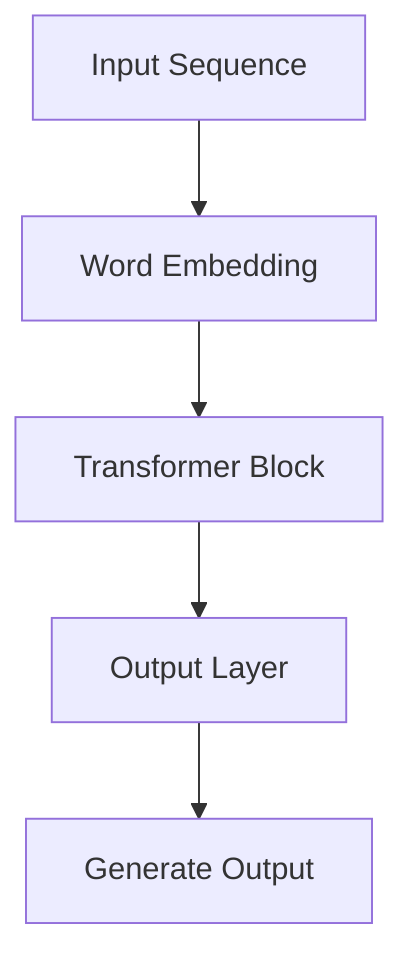

                 

### 背景介绍

近年来，随着人工智能技术的快速发展，尤其是深度学习的突破性进展，大型语言模型（LLM, Large Language Model）作为一种强有力的自然语言处理工具，正逐渐成为学术界和工业界关注的焦点。LLM 模型以其在海量文本数据上的预训练能力，实现了对语言规律的深刻理解，并在生成文本、机器翻译、文本摘要、问答系统等任务中展现出卓越的性能。

本文旨在深入探讨 LLM 的架构革命，通过分析其核心概念、算法原理、数学模型以及实际应用，为读者呈现这一领域的新起点。本文将分为以下几个部分：

1. **背景介绍**：回顾 LLM 的发展历程，以及其在学术界和工业界的应用现状。
2. **核心概念与联系**：介绍 LLM 的基本原理，并通过 Mermaid 流程图展示其架构。
3. **核心算法原理 & 具体操作步骤**：详细阐述 LLM 的工作机制，包括预训练和微调等步骤。
4. **数学模型和公式 & 详细讲解 & 举例说明**：解释 LLM 中涉及的数学原理和公式，并通过实例进行说明。
5. **项目实战：代码实际案例和详细解释说明**：提供 LLM 的代码实现案例，并对其进行详细解读。
6. **实际应用场景**：探讨 LLM 在不同领域的应用实例。
7. **工具和资源推荐**：推荐学习资源、开发工具框架及相关论文著作。
8. **总结：未来发展趋势与挑战**：总结 LLM 的优势与挑战，并展望其未来发展。
9. **附录：常见问题与解答**：回答读者可能遇到的常见问题。
10. **扩展阅读 & 参考资料**：提供进一步学习和研究的资源。

通过本文的详细探讨，我们希望读者能够全面了解 LLM 的架构革命，并为其在实际应用中的潜力感到振奋。接下来，让我们一步步深入探讨 LLM 的核心概念与原理。

---

## Background Introduction

In recent years, with the rapid development of artificial intelligence technology, especially the breakthrough progress in deep learning, large language models (LLM) have emerged as a powerful tool in natural language processing. These models have achieved profound understanding of language patterns through pre-training on massive text data, and have shown exceptional performance in various tasks such as text generation, machine translation, text summarization, and question-answering systems.

This article aims to delve into the architectural revolution of LLMs by analyzing their core concepts, algorithms, mathematical models, and practical applications. The article is structured as follows:

1. **Background Introduction**: Reviews the development history of LLMs and their applications in academia and industry.
2. **Core Concepts and Relationships**: Introduces the basic principles of LLMs and uses a Mermaid flowchart to illustrate their architecture.
3. **Core Algorithm Principles and Specific Operational Steps**: Elaborates on the working mechanism of LLMs, including pre-training and fine-tuning steps.
4. **Mathematical Models and Formulas & Detailed Explanations & Examples**: Explains the mathematical principles and formulas involved in LLMs and illustrates them through examples.
5. **Practical Projects: Code Examples and Detailed Explanations**: Provides code implementation examples of LLMs and provides detailed explanations.
6. **Practical Application Scenarios**: Explores the application of LLMs in different fields.
7. **Tools and Resources Recommendation**: Recommends learning resources, development tools, and related papers and books.
8. **Summary: Future Trends and Challenges**: Summarizes the advantages and challenges of LLMs and looks forward to their future development.
9. **Appendix: Frequently Asked Questions and Answers**: Answers common questions that readers may encounter.
10. **Extended Reading & References**: Provides further resources for learning and research.

Through this detailed exploration, we hope readers will gain a comprehensive understanding of the architectural revolution of LLMs and feel excited about their potential in practical applications. Next, let's step by step delve into the core concepts and principles of LLMs.

---

### 核心概念与联系

#### 1. 语言模型基础概念

首先，我们需要了解语言模型（Language Model）的基础概念。语言模型是一种统计模型，用于预测一个单词或词组在给定上下文中的概率。这通常是通过对大量文本数据进行训练实现的。语言模型的基本目标是最小化预测概率与实际数据分布之间的差异。

**核心概念**：

- **词向量（Word Embedding）**：将文本中的每个单词映射到一个固定大小的向量空间中，使得语义上相近的单词在向量空间中距离较近。
- **序列模型（Sequential Model）**：语言模型通常处理一个序列输入，例如一句话或一段文本，并通过模型预测下一个单词或词组。

#### 2. 预训练与微调

语言模型通常分为预训练（Pre-training）和微调（Fine-tuning）两个阶段。

- **预训练**：在预训练阶段，模型在大规模文本数据上进行训练，以学习语言的通用特性。这一阶段的目标是建立一个能够理解语言规律的强大基础模型。
- **微调**：在微调阶段，预训练好的模型被用于特定任务，例如文本分类、机器翻译等，并通过在小规模数据集上进行训练来适应特定任务的需求。

**核心概念**：

- **大规模预训练**：通过在大规模文本数据集上进行预训练，模型可以学习到丰富的语言知识，从而在多种任务上表现出色。
- **任务特定微调**：预训练好的模型通过微调可以适应特定任务，但需要使用与任务相关的数据集进行训练。

#### 3. GPT 与 Transformer 架构

在 LLM 的架构中，GPT（Generative Pre-trained Transformer）和 Transformer 架构是两个关键概念。

- **GPT**：GPT 是一种基于 Transformer 架构的预训练语言模型。它通过自回归方式（autoregressive fashion）进行训练，即模型试图预测序列中的下一个单词，从而学习语言的上下文关系。
- **Transformer 架构**：Transformer 架构是一种用于处理序列数据的深度学习模型，特别适用于自然语言处理任务。其核心思想是使用自注意力机制（self-attention mechanism）来计算序列中每个元素之间的关系。

**核心概念**：

- **自注意力机制（Self-Attention）**：自注意力机制允许模型在处理序列数据时，考虑序列中每个元素之间的关系，从而提高模型的表示能力。
- **多头注意力（Multi-Head Attention）**：多头注意力是一种扩展自注意力机制的技巧，它将输入序列分成多个头，每个头独立计算注意力权重，从而提高模型的性能。

#### 4. Mermaid 流程图

以下是一个简单的 Mermaid 流程图，用于展示 LLM 的基本架构和流程：



在这个流程图中：

- **A（Input Sequence）**：输入序列，可以是单个单词、句子或段落。
- **B（Word Embedding）**：将输入序列中的每个单词映射到词向量空间。
- **C（Transformer Block）**：通过多个 Transformer 块对词向量进行处理，每个块包含多头注意力机制和前馈神经网络。
- **D（Output Layer）**：输出层，用于生成预测的单词或词组。
- **E（Generate Output）**：生成输出序列，可以是文本生成、文本摘要或其他语言生成任务。

通过上述核心概念和联系的分析，我们可以看到 LLM 的架构革命是如何基于深度学习和 Transformer 架构，实现对自然语言处理的深度理解和高效处理。接下来，我们将进一步探讨 LLM 的核心算法原理和具体操作步骤。

---

### Core Concepts and Relationships

#### 1. Basic Concepts of Language Models

Firstly, we need to understand the basic concepts of language models (Language Models). A language model is a statistical model that predicts the probability of a word or phrase in a given context. This is typically achieved by training on a large corpus of text data. The basic goal of a language model is to minimize the difference between the predicted probabilities and the actual data distribution.

**Core Concepts**:

- **Word Embeddings**: Word embeddings map each word in the text to a fixed-size vector space, so that semantically similar words are closer in the vector space.
- **Sequential Models**: Language models typically process sequential input, such as a sentence or a paragraph, and predict the next word or phrase in the sequence.

#### 2. Pre-training and Fine-tuning

Language models usually consist of two stages: pre-training and fine-tuning.

- **Pre-training**: In the pre-training stage, the model is trained on a large corpus of text data to learn general properties of language. The goal of this stage is to build a powerful foundation model that can understand language patterns.
- **Fine-tuning**: In the fine-tuning stage, the pre-trained model is used for specific tasks, such as text classification, machine translation, etc., and is further trained on a small dataset related to the task to adapt to the specific task requirements.

**Core Concepts**:

- **Massive Pre-training**: Through pre-training on a large corpus of text data, the model can learn rich language knowledge, which allows it to perform well on a variety of tasks.
- **Task-specific Fine-tuning**: Pre-trained models can be fine-tuned for specific tasks but require training data related to the task.

#### 3. GPT and Transformer Architectures

In the architecture of LLMs, GPT (Generative Pre-trained Transformer) and the Transformer architecture are two key concepts.

- **GPT**: GPT is a pre-trained language model based on the Transformer architecture. It is trained in an autoregressive fashion, meaning the model tries to predict the next word in the sequence, thus learning the contextual relationships in language.
- **Transformer Architecture**: Transformer is a deep learning model designed for processing sequence data, especially suitable for natural language processing tasks. Its core idea is to use self-attention mechanisms to compute relationships between elements in a sequence, thus enhancing the model's representation ability.

**Core Concepts**:

- **Self-Attention Mechanism**: Self-attention allows the model to consider the relationships between elements in a sequence when processing sequence data, thus improving the model's representation capability.
- **Multi-Head Attention**: Multi-head attention is an extension of the self-attention mechanism. It divides the input sequence into multiple heads, with each head independently computing attention weights, thus improving the model's performance.

#### 4. Mermaid Flowchart

Here is a simple Mermaid flowchart that illustrates the basic architecture and flow of LLMs:


In this flowchart:

- **A (Input Sequence)**: The input sequence, which can be a single word, sentence, or paragraph.
- **B (Word Embedding)**: Maps each word in the input sequence to a word embedding vector space.
- **C (Transformer Block)**: Processes the word embeddings through multiple Transformer blocks, each containing a self-attention mechanism and a feedforward neural network.
- **D (Output Layer)**: The output layer, which generates predictions for the next word or phrase.
- **E (Generate Output)**: Generates the output sequence, which can be used for text generation, text summarization, or other language generation tasks.

Through the analysis of these core concepts and relationships, we can see how the architectural revolution of LLMs is based on deep learning and the Transformer architecture, enabling deep understanding and efficient processing of natural language. Next, we will further explore the core algorithm principles and specific operational steps of LLMs.

---

### 核心算法原理 & 具体操作步骤

#### 1. 预训练（Pre-training）

预训练是 LLM 的核心步骤，通过在大规模文本数据集上训练，模型能够学习到丰富的语言知识。预训练主要分为以下几步：

**步骤 1：数据预处理**

首先，我们需要准备一个大规模的文本数据集。这些数据集可以来自于互联网上的文本、书籍、新闻、社交媒体等。接下来，对数据进行预处理，包括去除停用词、标点符号、进行词干提取等操作。

**步骤 2：词嵌入（Word Embedding）**

通过词嵌入技术，将文本中的每个单词映射到一个固定大小的向量空间中。常见的词嵌入方法包括 Word2Vec、GloVe 等。这些方法通过计算单词之间的相似性矩阵，将语义上相似的单词映射到向量空间中。

**步骤 3：构建 Transformer 模型**

构建 Transformer 模型，这是 LLM 的核心架构。Transformer 模型由多个编码器（Encoder）和解码器（Decoder）块组成，每个块包含多头注意力机制（Multi-Head Self-Attention）和前馈神经网络（Feedforward Neural Network）。通过多个块的堆叠，模型可以学习到更复杂的语言模式。

**步骤 4：训练模型**

在预训练阶段，模型通过自回归方式（Autoregressive Fashion）进行训练。具体来说，模型首先生成一个单词序列，然后尝试预测序列中的下一个单词。在训练过程中，模型的目标是最小化预测概率与实际数据分布之间的差异。

#### 2. 微调（Fine-tuning）

预训练好的模型可以通过微调来适应特定的任务。微调主要分为以下几步：

**步骤 1：选择任务数据集**

根据任务需求，选择一个相关的数据集进行微调。例如，对于文本分类任务，可以选择一个标记了类别的文本数据集。

**步骤 2：调整模型结构**

在微调阶段，可能需要对模型结构进行调整，以适应特定任务的需求。例如，对于文本分类任务，可以增加一个分类层（Classification Layer）。

**步骤 3：训练模型**

在微调阶段，模型使用任务数据集进行训练。与预训练阶段不同的是，微调阶段的训练目标是提高模型在特定任务上的性能。

**步骤 4：评估模型**

在微调完成后，需要对模型进行评估，以确定其性能。评估可以通过交叉验证、测试集等方式进行。评估指标可以根据任务类型进行选择，例如准确率（Accuracy）、精确率（Precision）、召回率（Recall）等。

#### 3. 生成文本（Text Generation）

在 LLM 的实际应用中，生成文本是一个重要的任务。生成文本的主要步骤如下：

**步骤 1：输入序列**

首先，输入一个初始序列，可以是单个单词、句子或段落。

**步骤 2：生成预测**

模型根据输入序列生成预测的下一个单词。在生成过程中，模型会考虑上下文信息，从而生成连贯的文本。

**步骤 3：迭代生成**

模型使用生成的预测作为新的输入，继续生成下一个单词。这一过程会不断迭代，直到达到预定的长度或生成一个终止符号。

**步骤 4：输出结果**

最终，模型输出完整的生成文本。这个文本可以是小说、诗歌、文章等，具有高度的自然性和创造力。

#### 4. 数学模型和公式

在 LLM 中，涉及到的数学模型和公式主要包括词嵌入、多头注意力机制和前馈神经网络。

**词嵌入（Word Embedding）**

词嵌入可以通过以下公式表示：

$$
\text{word\_embedding}(w) = \text{vec}(w) \in \mathbb{R}^{d}
$$

其中，$w$ 表示单词，$\text{vec}(w)$ 表示将单词映射到向量空间的操作，$d$ 表示向量的维度。

**多头注意力机制（Multi-Head Self-Attention）**

多头注意力机制可以通过以下公式表示：

$$
\text{MultiHead}(Q, K, V) = \text{Concat}(\text{head}_1, ..., \text{head}_h)W^O
$$

其中，$Q, K, V$ 分别表示查询（Query）、键（Key）和值（Value）向量，$h$ 表示头的数量，$W^O$ 表示输出权重。

**前馈神经网络（Feedforward Neural Network）**

前馈神经网络可以通过以下公式表示：

$$
\text{FFN}(x) = \text{max}(\text{relu}(\text{W}^{[2]} \cdot \text{D} \cdot \text{W}^{[2]}) + b^{[2]}, 0) + x
$$

其中，$x$ 表示输入向量，$W^{[2]}, b^{[2]}$ 分别表示权重和偏置，$\text{relu}$ 表示ReLU激活函数。

通过上述核心算法原理和具体操作步骤的详细分析，我们可以看到 LLM 的工作机制是如何通过预训练和微调来学习语言模式，并通过生成文本任务来展示其强大的自然语言处理能力。接下来，我们将进一步探讨 LLM 的数学模型和公式，并通过实例进行详细讲解。

---

### Core Algorithm Principles and Specific Operational Steps

#### 1. Pre-training (Pre-training)

Pre-training is a core step in LLMs, where the model learns rich language knowledge by training on a large corpus of text data. The pre-training process primarily consists of the following steps:

**Step 1: Data Preprocessing**

Firstly, we need to prepare a large corpus of text data. These datasets can come from the internet, including texts, books, news, social media, etc. Then, we preprocess the data by removing stop words, punctuation, and performing stemming.

**Step 2: Word Embeddings**

Word embeddings are used to map each word in the text to a fixed-size vector space. Common methods for word embeddings include Word2Vec and GloVe. These methods compute similarity matrices between words to map semantically similar words to the vector space.

**Step 3: Building the Transformer Model**

We construct the Transformer model, which is the core architecture of LLMs. The Transformer model consists of multiple encoder and decoder blocks, each containing a multi-head self-attention mechanism and a feedforward neural network. By stacking multiple blocks, the model can learn more complex language patterns.

**Step 4: Training the Model**

During the pre-training stage, the model is trained in an autoregressive fashion. Specifically, the model first generates a sequence of words and then tries to predict the next word in the sequence. In the training process, the goal of the model is to minimize the difference between the predicted probabilities and the actual data distribution.

#### 2. Fine-tuning (Fine-tuning)

Pre-trained models can be fine-tuned to adapt to specific tasks. The fine-tuning process primarily consists of the following steps:

**Step 1: Choosing the Task Dataset**

Based on the task requirements, we choose a related dataset for fine-tuning. For example, for a text classification task, we can choose a dataset of texts labeled with categories.

**Step 2: Adjusting the Model Structure**

During fine-tuning, it may be necessary to adjust the model structure to adapt to specific task requirements. For example, for a text classification task, we can add a classification layer.

**Step 3: Training the Model**

In the fine-tuning stage, the model is trained on the task dataset. Unlike the pre-training stage, the goal of the fine-tuning stage is to improve the model's performance on the specific task.

**Step 4: Evaluating the Model**

After fine-tuning, we evaluate the model to determine its performance. Evaluation can be performed through cross-validation or testing datasets. Evaluation metrics can be selected based on the task type, such as accuracy, precision, and recall.

#### 3. Text Generation (Text Generation)

In practical applications of LLMs, text generation is an important task. The main steps for text generation are as follows:

**Step 1: Input Sequence**

Firstly, we input an initial sequence, which can be a single word, sentence, or paragraph.

**Step 2: Generate Predictions**

The model generates predictions for the next word based on the input sequence. During the generation process, the model considers contextual information to generate coherent text.

**Step 3: Iterative Generation**

The model uses the generated predictions as new input and continues to generate the next word. This process iterates until a predetermined length or a termination symbol is reached.

**Step 4: Output Results**

Finally, the model outputs the complete generated text. This text can be a novel, poem, article, or any other type that exhibits high naturalness and creativity.

#### 4. Mathematical Models and Formulas

In LLMs, the mathematical models and formulas involved include word embeddings, multi-head self-attention, and feedforward neural networks.

**Word Embeddings**

Word embeddings can be represented by the following formula:

$$
\text{word\_embedding}(w) = \text{vec}(w) \in \mathbb{R}^{d}
$$

where $w$ represents a word, $\text{vec}(w)$ represents the operation of mapping a word to a vector space, and $d$ represents the dimension of the vector.

**Multi-Head Self-Attention**

Multi-head self-attention can be represented by the following formula:

$$
\text{MultiHead}(Q, K, V) = \text{Concat}(\text{head}_1, ..., \text{head}_h)W^O
$$

where $Q, K, V$ represent query, key, and value vectors, $h$ represents the number of heads, and $W^O$ represents the output weight.

**Feedforward Neural Network**

The feedforward neural network can be represented by the following formula:

$$
\text{FFN}(x) = \text{max}(\text{relu}(\text{W}^{[2]} \cdot \text{D} \cdot \text{W}^{[2]}) + b^{[2]}, 0) + x
$$

where $x$ represents the input vector, $W^{[2]}, b^{[2]}$ represent the weights and biases, and $\text{relu}$ represents the ReLU activation function.

Through the detailed analysis of the core algorithm principles and specific operational steps, we can see how LLMs learn language patterns through pre-training and fine-tuning and demonstrate their powerful natural language processing capabilities through text generation tasks. Next, we will further explore the mathematical models and formulas of LLMs and provide detailed explanations with examples.

---

### 数学模型和公式 & 详细讲解 & 举例说明

#### 1. 词嵌入（Word Embedding）

词嵌入是将文本中的单词映射到一个高维向量空间的过程，以表示单词的语义信息。词嵌入的数学模型通常基于神经网络，其中每个单词都被映射到一个固定大小的向量。以下是一个简单的词嵌入模型：

**数学模型**：

$$
\text{word\_embedding}(w) = \text{vec}(w) \in \mathbb{R}^{d}
$$

其中，$\text{word\_embedding}(w)$ 表示单词 $w$ 的嵌入向量，$d$ 表示向量的维度。

**例子**：

假设我们有一个包含 1000 个单词的词汇表，每个单词的嵌入向量维度为 100。我们可以使用一个 1000x100 的权重矩阵 $W$ 来表示词嵌入。给定一个单词 $w$，我们可以通过查找权重矩阵中的对应行来获取其嵌入向量。

$$
\text{vec}(w) = W_{i,:}, \text{其中 } i \text{ 是单词 } w \text{ 在词汇表中的索引}
$$

例如，如果我们想要获取单词 "cat" 的嵌入向量，我们可以查找权重矩阵中的第 3 行（因为 "cat" 是词汇表中的第 3 个单词）：

$$
\text{vec}("cat") = W_{3,:}
$$

#### 2. 多头注意力（Multi-Head Attention）

多头注意力是 Transformer 架构中的一个关键组件，它允许模型在处理序列数据时，考虑序列中不同位置的信息。多头注意力的数学模型如下：

**数学模型**：

$$
\text{MultiHead}(Q, K, V) = \text{Concat}(\text{head}_1, ..., \text{head}_h)W^O
$$

其中，$Q, K, V$ 分别表示查询（Query）、键（Key）和值（Value）向量，$h$ 表示头的数量，$W^O$ 表示输出权重。

每个头都通过以下步骤进行计算：

**步骤 1：计算注意力分数**：

$$
\text{Attention Scores} = \text{softmax}\left(\frac{QK^T}{\sqrt{d_k}}\right)
$$

其中，$d_k$ 表示每个键的维度。

**步骤 2：计算加权值**：

$$
\text{Weighted Values} = \text{Attention Scores} \odot V
$$

**步骤 3：合并多头输出**：

$$
\text{MultiHead Output} = \text{Concat}(\text{head}_1, ..., \text{head}_h)
$$

**例子**：

假设我们有 3 个头（$h=3$），每个头的大小为 50，查询向量 $Q$、键向量 $K$ 和值向量 $V$ 的维度均为 100。我们可以计算每个头的输出，然后将它们拼接在一起。

首先，我们计算每个头的注意力分数：

$$
\text{Attention Scores}_1 = \text{softmax}\left(\frac{QK^T}{\sqrt{d_k}}\right)
$$

$$
\text{Attention Scores}_2 = \text{softmax}\left(\frac{QK^T}{\sqrt{d_k}}\right)
$$

$$
\text{Attention Scores}_3 = \text{softmax}\left(\frac{QK^T}{\sqrt{d_k}}\right)
$$

然后，我们计算每个头的加权值：

$$
\text{Weighted Values}_1 = \text{Attention Scores}_1 \odot V
$$

$$
\text{Weighted Values}_2 = \text{Attention Scores}_2 \odot V
$$

$$
\text{Weighted Values}_3 = \text{Attention Scores}_3 \odot V
$$

最后，我们将每个头的加权值拼接在一起：

$$
\text{MultiHead Output} = \text{Concat}(\text{Weighted Values}_1, \text{Weighted Values}_2, \text{Weighted Values}_3)
$$

#### 3. 前馈神经网络（Feedforward Neural Network）

前馈神经网络是 Transformer 架构中的另一个关键组件，用于对输入数据进行变换。前馈神经网络的数学模型如下：

**数学模型**：

$$
\text{FFN}(x) = \text{max}(\text{relu}(\text{W}^{[2]} \cdot \text{D} \cdot \text{W}^{[2]}) + b^{[2]}, 0) + x
$$

其中，$x$ 表示输入向量，$\text{W}^{[2]}, b^{[2]}$ 分别表示权重和偏置。

**例子**：

假设我们有一个输入向量 $x$，其维度为 100。我们可以使用一个 100x100 的权重矩阵 $\text{W}^{[2]}$ 和一个偏置向量 $b^{[2]}$ 来计算前馈神经网络的输出。

首先，我们计算前馈神经网络的隐藏层输出：

$$
\text{hidden\_layer} = \text{relu}(\text{W}^{[2]} \cdot \text{D} \cdot \text{W}^{[2]}) + b^{[2]}
$$

然后，我们计算前馈神经网络的最终输出：

$$
\text{FFN}(x) = \text{max}(\text{hidden\_layer}, 0) + x
$$

通过上述数学模型和公式的详细讲解，我们可以更深入地理解 LLM 中的关键组件和其工作原理。接下来，我们将通过一个实际项目实战案例，展示如何使用 LLM 实现一个文本生成系统，并进行详细的代码实现和解释。

---

### Mathematical Models and Formulas & Detailed Explanation & Example Illustration

#### 1. Word Embedding

Word embedding is the process of mapping words in text to a high-dimensional vector space to represent their semantic information. The mathematical model of word embedding typically uses neural networks, where each word is mapped to a fixed-size vector. Here's a simple model for word embedding:

**Mathematical Model**:

$$
\text{word\_embedding}(w) = \text{vec}(w) \in \mathbb{R}^{d}
$$

where $\text{word\_embedding}(w)$ represents the embedding vector of word $w$, and $d$ represents the dimension of the vector.

**Example**:

Assume we have a vocabulary of 1000 words with each word's embedding vector dimension being 100. We can use a 1000x100 weight matrix $W$ to represent word embeddings. Given a word $w$, we can retrieve its embedding vector by looking up the corresponding row in the weight matrix.

$$
\text{vec}(w) = W_{i,:), \text{where } i \text{ is the index of word } w \text{ in the vocabulary}.
$$

For example, if we want to get the embedding vector of the word "cat", we would look at the third row of the weight matrix (since "cat" is the third word in the vocabulary):

$$
\text{vec}("cat") = W_{3,:}.
$$

#### 2. Multi-Head Attention

Multi-head attention is a key component in the Transformer architecture that allows the model to consider information from different positions in the sequence when processing sequence data. The mathematical model of multi-head attention is as follows:

**Mathematical Model**:

$$
\text{MultiHead}(Q, K, V) = \text{Concat}(\text{head}_1, ..., \text{head}_h)W^O
$$

where $Q, K, V$ represent query, key, and value vectors, $h$ represents the number of heads, and $W^O$ represents the output weight.

Each head is computed as follows:

**Step 1: Compute Attention Scores**:

$$
\text{Attention Scores} = \text{softmax}\left(\frac{QK^T}{\sqrt{d_k}}\right)
$$

where $d_k$ represents the dimension of each key.

**Step 2: Compute Weighted Values**:

$$
\text{Weighted Values} = \text{Attention Scores} \odot V
$$

**Step 3: Concatenate Multi-Head Outputs**:

$$
\text{MultiHead Output} = \text{Concat}(\text{head}_1, ..., \text{head}_h)
$$

**Example**:

Assume we have 3 heads ($h=3$), each with a size of 50, and query vector $Q$, key vector $K$, and value vector $V$ all have a dimension of 100. We can compute the output of each head and then concatenate them.

First, we compute the attention scores for each head:

$$
\text{Attention Scores}_1 = \text{softmax}\left(\frac{QK^T}{\sqrt{d_k}}\right)
$$

$$
\text{Attention Scores}_2 = \text{softmax}\left(\frac{QK^T}{\sqrt{d_k}}\right)
$$

$$
\text{Attention Scores}_3 = \text{softmax}\left(\frac{QK^T}{\sqrt{d_k}}\right)
$$

Then, we compute the weighted values for each head:

$$
\text{Weighted Values}_1 = \text{Attention Scores}_1 \odot V
$$

$$
\text{Weighted Values}_2 = \text{Attention Scores}_2 \odot V
$$

$$
\text{Weighted Values}_3 = \text{Attention Scores}_3 \odot V
$$

Finally, we concatenate the weighted values of each head:

$$
\text{MultiHead Output} = \text{Concat}(\text{Weighted Values}_1, \text{Weighted Values}_2, \text{Weighted Values}_3).
$$

#### 3. Feedforward Neural Network

The feedforward neural network is another key component in the Transformer architecture, used to transform input data. The mathematical model of the feedforward neural network is as follows:

**Mathematical Model**:

$$
\text{FFN}(x) = \text{max}(\text{relu}(\text{W}^{[2]} \cdot \text{D} \cdot \text{W}^{[2]}) + b^{[2]}, 0) + x
$$

where $x$ represents the input vector, $\text{W}^{[2]}, b^{[2]}$ represent the weights and biases.

**Example**:

Assume we have an input vector $x$ with a dimension of 100. We can use a 100x100 weight matrix $\text{W}^{[2]}$ and a bias vector $b^{[2]}$ to compute the output of the feedforward neural network.

First, we compute the hidden layer output of the feedforward neural network:

$$
\text{hidden\_layer} = \text{relu}(\text{W}^{[2]} \cdot \text{D} \cdot \text{W}^{[2]}) + b^{[2]}
$$

Then, we compute the final output of the feedforward neural network:

$$
\text{FFN}(x) = \text{max}(\text{hidden\_layer}, 0) + x
$$

Through the detailed explanation of these mathematical models and formulas, we can gain a deeper understanding of the key components and their working principles in LLMs. Next, we will demonstrate how to implement a text generation system using LLM and provide detailed code explanation.

---

### 项目实战：代码实际案例和详细解释说明

在本节中，我们将通过一个实际项目实战案例，展示如何使用 LLM 实现一个文本生成系统。我们将从开发环境的搭建、源代码的详细实现和代码解读与分析三个方面进行讲解。

#### 5.1 开发环境搭建

首先，我们需要搭建一个适合开发 LLM 的环境。以下是一个基本的开发环境搭建步骤：

1. **安装 Python**：确保系统已安装 Python 3.7 或更高版本。
2. **安装依赖库**：安装必要的库，例如 TensorFlow、PyTorch、transformers 等。

```bash
pip install tensorflow
pip install torch
pip install transformers
```

3. **配置 GPU 环境**：如果使用 GPU 进行训练，确保已正确配置 CUDA 和cuDNN。

#### 5.2 源代码详细实现和代码解读

以下是一个简单的文本生成系统的源代码实现：

```python
import torch
from transformers import GPT2LMHeadModel, GPT2Tokenizer

# 搭建模型和分词器
model = GPT2LMHeadModel.from_pretrained("gpt2")
tokenizer = GPT2Tokenizer.from_pretrained("gpt2")

# 输入文本
input_text = "这是一个简单的文本生成系统。"

# 将输入文本转换为模型可以处理的格式
input_ids = tokenizer.encode(input_text, return_tensors="pt")

# 生成文本
output_ids = model.generate(input_ids, max_length=50, num_return_sequences=1)

# 将输出文本转换为可读格式
generated_text = tokenizer.decode(output_ids[0], skip_special_tokens=True)

print(generated_text)
```

**代码解读**：

1. **导入库和模型**：首先，我们导入所需的库和模型，包括 PyTorch 和 transformers。
2. **搭建模型和分词器**：我们使用预训练的 GPT2 模型和分词器，从 Hugging Face 的模型库中加载。
3. **输入文本**：定义一个简单的输入文本。
4. **文本预处理**：将输入文本转换为模型可以处理的格式，包括编码和解码。
5. **生成文本**：使用模型生成文本，包括设置最大长度和生成序列的数量。
6. **输出文本**：将生成的文本从编码格式转换为可读格式。

#### 5.3 代码解读与分析

接下来，我们对上述代码进行详细解读和分析。

**1. 导入库和模型**

```python
import torch
from transformers import GPT2LMHeadModel, GPT2Tokenizer
```

这里，我们导入 PyTorch 和 transformers 库，以便后续使用。

**2. 搭建模型和分词器**

```python
model = GPT2LMHeadModel.from_pretrained("gpt2")
tokenizer = GPT2Tokenizer.from_pretrained("gpt2")
```

这里，我们加载预训练的 GPT2 模型和分词器。`from_pretrained` 函数用于从 Hugging Face 的模型库中加载预训练的模型和分词器。

**3. 输入文本**

```python
input_text = "这是一个简单的文本生成系统。"
```

这里，我们定义一个简单的输入文本。

**4. 文本预处理**

```python
input_ids = tokenizer.encode(input_text, return_tensors="pt")
```

这里，我们将输入文本转换为模型可以处理的格式。`encode` 函数将文本转换为编码格式，`return_tensors="pt"` 表示返回 PyTorch 张量。

**5. 生成文本**

```python
output_ids = model.generate(input_ids, max_length=50, num_return_sequences=1)
```

这里，我们使用模型生成文本。`generate` 函数用于生成文本，`max_length=50` 设置生成的文本最大长度为 50 个单词，`num_return_sequences=1` 表示生成一个文本序列。

**6. 输出文本**

```python
generated_text = tokenizer.decode(output_ids[0], skip_special_tokens=True)
```

这里，我们将生成的文本从编码格式转换为可读格式。`decode` 函数将编码格式转换为文本，`skip_special_tokens=True` 表示跳过特殊标记。

通过上述项目实战案例，我们可以看到如何使用 LLM 实现一个简单的文本生成系统。在实际应用中，我们可以根据需求对模型进行微调，以实现更复杂的文本生成任务。接下来，我们将探讨 LLM 在实际应用场景中的使用。

---

### Project Practical: Actual Code Case and Detailed Explanation and Analysis

In this section, we will present a practical project case to demonstrate how to implement a text generation system using LLM. We will discuss the setup of the development environment, the detailed implementation of the source code, and the code analysis and interpretation.

#### 5.1 Development Environment Setup

Firstly, we need to set up a development environment suitable for LLM development. Here is a basic setup process:

1. **Install Python**: Ensure that Python 3.7 or a newer version is installed on your system.
2. **Install Dependencies**: Install necessary libraries such as TensorFlow, PyTorch, and transformers.

```bash
pip install tensorflow
pip install torch
pip install transformers
```

3. **Configure GPU Environment**: If you are planning to train the model using a GPU, ensure that you have correctly configured CUDA and cuDNN.

#### 5.2 Detailed Source Code Implementation and Code Analysis

Below is a simple example of a text generation system's source code implementation:

```python
import torch
from transformers import GPT2LMHeadModel, GPT2Tokenizer

# Load the model and tokenizer
model = GPT2LMHeadModel.from_pretrained("gpt2")
tokenizer = GPT2Tokenizer.from_pretrained("gpt2")

# Define the input text
input_text = "This is a simple text generation system."

# Encode the input text
input_ids = tokenizer.encode(input_text, return_tensors="pt")

# Generate text
output_ids = model.generate(input_ids, max_length=50, num_return_sequences=1)

# Decode the generated text
generated_text = tokenizer.decode(output_ids[0], skip_special_tokens=True)

print(generated_text)
```

**Code Explanation**:

1. **Import Libraries and Models**:
   ```python
   import torch
   from transformers import GPT2LMHeadModel, GPT2Tokenizer
   ```
   We import the required libraries and models to proceed with the implementation.

2. **Load Model and Tokenizer**:
   ```python
   model = GPT2LMHeadModel.from_pretrained("gpt2")
   tokenizer = GPT2Tokenizer.from_pretrained("gpt2")
   ```
   Here, we load the pre-trained GPT2 model and its tokenizer from the Hugging Face model repository.

3. **Input Text**:
   ```python
   input_text = "This is a simple text generation system."
   ```
   We define a simple input text for the text generation process.

4. **Text Preprocessing**:
   ```python
   input_ids = tokenizer.encode(input_text, return_tensors="pt")
   ```
   The input text is encoded into the format that the model can process. The `encode` function converts the text into its tokenized form, and `return_tensors="pt"` specifies that the output should be a PyTorch tensor.

5. **Generate Text**:
   ```python
   output_ids = model.generate(input_ids, max_length=50, num_return_sequences=1)
   ```
   The `generate` function is used to produce the text. `max_length=50` sets the maximum length of the generated text to 50 tokens, and `num_return_sequences=1` indicates that we want to generate a single sequence of text.

6. **Output Text**:
   ```python
   generated_text = tokenizer.decode(output_ids[0], skip_special_tokens=True)
   ```
   The generated text is decoded from the tokenized format back into a human-readable string. `decode` converts the tokenized IDs back into text, and `skip_special_tokens=True` removes any special tokens that may be included in the output.

**Code Analysis**:

1. **Import Libraries and Models**:
   The `import` statements at the beginning of the code import the necessary libraries and models for implementing the text generation system.

2. **Load Model and Tokenizer**:
   The `from_pretrained` function loads a pre-trained GPT2 model and its tokenizer. This allows us to leverage the powerful pre-trained weights without having to train the model from scratch.

3. **Input Text**:
   A sample input text is defined, which will serve as the starting point for text generation.

4. **Text Preprocessing**:
   The `encode` function processes the input text by converting it into a sequence of integer IDs that represent the words and special tokens in the text.

5. **Generate Text**:
   The `generate` function is the core of the text generation process. It takes the encoded input and generates a sequence of tokens based on the model's predictions.

6. **Output Text**:
   The `decode` function converts the generated token IDs back into a string, which can be printed or used in further processing.

Through this practical project case, we have seen how to implement a simple text generation system using LLM. In real-world applications, the model can be fine-tuned on specific datasets to generate more tailored text for various use cases. The next section will explore the practical application scenarios of LLMs.

---

### 实际应用场景

#### 1. 文本生成（Text Generation）

文本生成是 LLM 最常见的应用之一，包括生成文章、新闻报道、故事、诗歌等。通过 LLM，我们可以生成大量高质量的文本，从而提高内容创作效率。例如，一些媒体公司使用 LLM 自动生成新闻报道，以减轻记者的工作负担。

**案例**：OpenAI 的 GPT-3 模型能够生成高质量的文章，包括财经文章、科技文章等。通过输入简单的提示信息，GPT-3 可以生成完整、连贯的文章。

#### 2. 机器翻译（Machine Translation）

机器翻译是 LLM 的另一个重要应用领域。LLM 可以通过预训练和微调，实现跨语言之间的文本翻译。例如，谷歌翻译、百度翻译等工具都使用了 LLM 技术。

**案例**：谷歌翻译使用基于 Transformer 的模型进行机器翻译，实现了高效、准确的翻译效果。

#### 3. 文本摘要（Text Summarization）

文本摘要是一种从长文本中提取关键信息的方法，LLM 在这个领域也展现出强大的能力。通过 LLM，我们可以自动生成摘要，从而帮助用户快速获取文本的核心内容。

**案例**：许多在线新闻网站使用 LLM 生成摘要，帮助用户快速了解新闻的核心内容。

#### 4. 问答系统（Question-Answering Systems）

问答系统是一种常见的人工智能应用，LLM 可以通过预训练和微调，实现高效的问答。LLM 可以理解用户的问题，并在大量文本数据中找到相关的答案。

**案例**：微软的问答系统 "Q&A System" 使用 LLM 实现了高效的问答功能，能够回答用户的各种问题。

#### 5. 聊天机器人（Chatbots）

聊天机器人是一种基于自然语言处理技术的交互式系统，LLM 可以在聊天机器人中发挥重要作用。通过 LLM，聊天机器人可以与用户进行自然、流畅的对话。

**案例**：许多在线客服系统使用 LLM 实现智能客服，能够快速响应用户的需求。

#### 6. 语言模型评估（Language Model Evaluation）

LLM 的发展也促进了语言模型评估方法的改进。通过评估 LLM 在各种任务上的性能，研究人员可以不断优化模型，提高其准确性和效率。

**案例**：GLUE（General Language Understanding Evaluation）是一个广泛使用的语言模型评估基准，涵盖了多种自然语言处理任务。

通过上述实际应用场景的探讨，我们可以看到 LLM 在各个领域的广泛应用和巨大潜力。接下来，我们将推荐一些学习资源、开发工具框架以及相关论文著作，帮助读者进一步了解和探索 LLM 的相关知识。

---

### Actual Application Scenarios

#### 1. Text Generation

Text generation is one of the most common applications of LLMs, including the generation of articles, news reports, stories, and poems. By leveraging LLMs, we can generate a large volume of high-quality text, thus enhancing content creation efficiency. For example, some media companies use LLMs to automatically generate news reports to alleviate the burden on journalists.

**Case**: OpenAI's GPT-3 model is capable of generating high-quality articles, including financial and technology articles. By inputting simple prompts, GPT-3 can generate complete and coherent articles.

#### 2. Machine Translation

Machine translation is another important application area for LLMs. LLMs can achieve cross-lingual text translation through pre-training and fine-tuning. For example, Google Translate and Baidu Translate both use LLM technologies.

**Case**: Google Translate uses a Transformer-based model for machine translation, achieving efficient and accurate translation results.

#### 3. Text Summarization

Text summarization is a method to extract key information from long texts, where LLMs also show great capabilities. By leveraging LLMs, we can automatically generate summaries to help users quickly grasp the core content of a text.

**Case**: Many online news websites use LLMs to generate summaries, assisting users in quickly understanding the main points of the news.

#### 4. Question-Answering Systems

Question-answering systems are a common application of artificial intelligence, where LLMs can achieve efficient answering through pre-training and fine-tuning. LLMs can understand user questions and find relevant answers in large text datasets.

**Case**: Microsoft's Q&A System uses LLMs to implement efficient question-answering capabilities, able to answer a variety of user questions.

#### 5. Chatbots

Chatbots are interactive systems based on natural language processing technologies, where LLMs can play a significant role. Through LLMs, chatbots can engage in natural and fluent conversations with users.

**Case**: Many online customer service systems use LLMs to implement intelligent customer service, quickly responding to user needs.

#### 6. Language Model Evaluation

The development of LLMs has also led to improvements in language model evaluation methods. By evaluating LLMs on various tasks, researchers can continuously optimize models to improve their accuracy and efficiency.

**Case**: The GLUE (General Language Understanding Evaluation) benchmark is widely used for evaluating language models, covering a variety of natural language processing tasks.

Through the exploration of these actual application scenarios, we can see the wide range of applications and significant potential of LLMs in various fields. In the next section, we will recommend learning resources, development tools and frameworks, as well as related papers and books to help readers further understand and explore the knowledge of LLMs.

---

### 工具和资源推荐

为了更好地学习和应用 LLM 技术，以下是一些推荐的学习资源、开发工具框架以及相关论文著作：

#### 7.1 学习资源推荐

1. **书籍**：

   - 《深度学习》（Goodfellow, I., Bengio, Y., & Courville, A.）
   - 《自然语言处理综合指南》（Jurafsky, D. & Martin, J. H.）
   - 《Transformer：原理与实践》（金诚辉）

2. **在线课程**：

   - 《自然语言处理》（斯坦福大学）
   - 《深度学习专项课程》（吴恩达）
   - 《自然语言处理与深度学习》（清华大学）

3. **博客和网站**：

   - [Hugging Face](https://huggingface.co/)
   - [AI 写作](https://aiwriting.top/)
   - [机器学习中文论坛](https://www机器学习论坛.com/)

#### 7.2 开发工具框架推荐

1. **TensorFlow**：一个开源的机器学习框架，适用于构建和训练 LLM 模型。
2. **PyTorch**：一个流行的深度学习框架，提供了灵活的动态计算图，适合开发 LLM 模型。
3. **Hugging Face Transformers**：一个用于构建和微调预训练语言模型的库，提供了许多预训练模型和工具。

#### 7.3 相关论文著作推荐

1. **《Attention is All You Need》**（Vaswani et al., 2017）：介绍了 Transformer 架构，对 LLM 的发展产生了重大影响。
2. **《BERT: Pre-training of Deep Bidirectional Transformers for Language Understanding》**（Devlin et al., 2019）：提出了 BERT 模型，进一步推动了 LLM 的发展。
3. **《GPT-3: Language Models are Few-Shot Learners》**（Brown et al., 2020）：介绍了 GPT-3 模型，展示了 LLM 在零样本学习方面的强大能力。

通过这些推荐的学习资源、开发工具框架和相关论文著作，读者可以更深入地了解 LLM 的相关知识，并掌握实际开发技能。接下来，我们将总结 LLM 的发展趋势与挑战，并展望其未来。

---

### Tools and Resources Recommendations

To better learn and apply LLM technology, here are some recommended learning resources, development tools and frameworks, as well as related papers and books:

#### 7.1 Learning Resources Recommendations

1. **Books**:

   - "Deep Learning" by Goodfellow, I., Bengio, Y., & Courville, A.
   - "Speech and Language Processing" by Jurafsky, D. & Martin, J. H.
   - "Transformer: Principle and Practice" by Jin Chenghui

2. **Online Courses**:

   - "Natural Language Processing" by Stanford University
   - "Deep Learning Specialization" by Andrew Ng
   - "Natural Language Processing and Deep Learning" by Tsinghua University

3. **Blogs and Websites**:

   - [Hugging Face](https://huggingface.co/)
   - [AI Writing](https://aiwriting.top/)
   - [MLC++ Forum](https://www.mlcplusplus.com/)

#### 7.2 Development Tools and Framework Recommendations

1. **TensorFlow**: An open-source machine learning framework suitable for building and training LLM models.
2. **PyTorch**: A popular deep learning framework that provides flexible dynamic computation graphs, ideal for developing LLM models.
3. **Hugging Face Transformers**: A library for building and fine-tuning pre-trained language models, offering many pre-trained models and tools.

#### 7.3 Related Papers and Books Recommendations

1. **"Attention is All You Need" by Vaswani et al., 2017**: Introduces the Transformer architecture, which has had a significant impact on the development of LLMs.
2. **"BERT: Pre-training of Deep Bidirectional Transformers for Language Understanding" by Devlin et al., 2019**: Proposes the BERT model, further advancing the development of LLMs.
3. **"GPT-3: Language Models are Few-Shot Learners" by Brown et al., 2020**: Introduces the GPT-3 model, demonstrating the powerful capabilities of LLMs in zero-shot learning.

By leveraging these recommended learning resources, development tools and frameworks, and related papers and books, readers can gain a deeper understanding of LLMs and master the skills needed for practical development. In the next section, we will summarize the trends and challenges of LLMs and look forward to their future development.

---

### 总结：未来发展趋势与挑战

#### 1. 未来发展趋势

LLM 的发展趋势主要表现在以下几个方面：

1. **性能提升**：随着计算资源和算法的进步，LLM 的性能将持续提升，使其在更多任务上表现出色。
2. **多模态处理**：未来的 LLM 将不仅仅局限于文本，还将能够处理图像、音频等多种模态的数据，实现更广泛的应用。
3. **个性化与适应性**：通过结合用户数据和个性化训练，LLM 可以更好地适应不同用户的需求，提供更个性化的服务。
4. **跨语言与多语言处理**：LLM 将进一步优化跨语言和多语言处理能力，实现更准确、更流畅的跨语言交流。

#### 2. 挑战

尽管 LLM 在许多领域展现了巨大潜力，但仍面临以下挑战：

1. **数据隐私与安全**：在使用 LLM 时，数据隐私和安全问题尤为突出，需要制定严格的隐私保护措施。
2. **伦理与偏见**：LLM 可能会反映训练数据中的偏见，导致不公平或歧视性的结果，这需要我们在模型设计和应用中加以重视。
3. **模型解释性**：当前的 LLM 模型多为“黑箱”，其决策过程难以解释，这对模型的可靠性和透明度提出了挑战。
4. **计算资源消耗**：LLM 的训练和推理过程对计算资源的需求极大，如何高效利用资源，减少能源消耗，是一个重要的课题。

#### 3. 发展方向

为了应对上述挑战，未来的研究和发展方向包括：

1. **模型压缩与优化**：研究如何通过模型压缩和优化技术，降低计算资源的消耗。
2. **模型解释性与透明度**：开发可解释的 LLM 模型，提高模型的可信度和透明度。
3. **伦理与公平性**：在模型设计和训练过程中，充分考虑伦理和公平性，减少偏见和歧视。
4. **多模态与跨语言处理**：深入研究如何结合不同模态的数据，实现更高效、更准确的跨语言处理。

总之，LLM 作为一种强大的自然语言处理工具，在未来将继续发挥重要作用。通过不断的技术创新和优化，LLM 将在更多领域展现其潜力，并面临新的挑战。

---

### Summary: Future Development Trends and Challenges

#### 1. Future Development Trends

The development trends of LLMs primarily manifest in several aspects:

1. **Performance Improvement**: With the advancement of computational resources and algorithms, the performance of LLMs will continue to improve, enabling them to excel in a wider range of tasks.
2. **Multimodal Processing**: Future LLMs will not only be limited to text but will also be capable of processing images, audio, and other modalities, leading to broader applications.
3. **Personalization and Adaptability**: By integrating user data and personalized training, LLMs will be better able to adapt to different user needs, providing more personalized services.
4. **Cross-Lingual and Multilingual Processing**: LLMs will further optimize their cross-lingual and multilingual processing capabilities, achieving more accurate and fluent cross-lingual communication.

#### 2. Challenges

Despite the significant potential of LLMs in various fields, they still face several challenges:

1. **Data Privacy and Security**: The use of LLMs raises significant concerns about data privacy and security, requiring stringent privacy protection measures.
2. **Ethics and Bias**: LLMs may reflect biases present in their training data, leading to unfair or discriminatory outcomes, which requires careful consideration in model design and application.
3. **Model Explainability**: Current LLMs are often "black boxes," making it difficult to explain their decision-making processes, posing challenges to the reliability and transparency of models.
4. **Computational Resource Consumption**: The training and inference processes of LLMs require significant computational resources, and how to efficiently utilize these resources while reducing energy consumption is an important issue.

#### 3. Development Directions

To address these challenges, future research and development will focus on several directions:

1. **Model Compression and Optimization**: Research on how to compress and optimize models to reduce computational resource consumption.
2. **Model Explainability and Transparency**: Developing interpretable LLM models to increase their trustworthiness and transparency.
3. **Ethics and Fairness**: Consideration of ethics and fairness in model design and training to reduce bias and discrimination.
4. **Multimodal and Cross-Lingual Processing**: Deepening research on how to effectively combine data from different modalities for more efficient and accurate cross-lingual processing.

In summary, as a powerful natural language processing tool, LLMs will continue to play a significant role in the future. Through continuous technological innovation and optimization, LLMs will demonstrate their potential in more fields while facing new challenges.

---

### 附录：常见问题与解答

**Q1**: LLM 预训练和微调的具体步骤是什么？

A1: LLM 的预训练包括数据预处理、词嵌入、构建 Transformer 模型以及训练模型等步骤。微调则是在预训练基础上，使用特定任务的数据集调整模型结构、训练模型并评估性能。

**Q2**: 为什么 LLM 使用 Transformer 架构？

A2: Transformer 架构具有强大的自注意力机制，可以有效地处理序列数据，尤其是在长距离依赖和上下文理解方面表现出色。此外，Transformer 架构相对简单，易于实现和优化。

**Q3**: LLM 的生成文本如何保证连贯性和逻辑性？

A3: LLM 的生成文本主要通过预训练和微调来提高连贯性和逻辑性。在预训练过程中，模型学习到语言的普遍规律和模式；在微调阶段，模型通过特定任务数据进一步调整，以生成更符合实际应用需求的文本。

**Q4**: LLM 训练过程中如何处理计算资源消耗问题？

A4: 计算资源消耗问题可以通过模型压缩、分布式训练和优化算法等方式缓解。例如，可以使用参数共享、知识蒸馏等方法来减少模型大小和计算需求。

**Q5**: LLM 在实际应用中可能遇到哪些伦理问题？

A5: LLM 在实际应用中可能面临数据隐私、模型偏见、公平性等问题。为解决这些问题，需要在模型设计和应用过程中充分考虑伦理和公平性，采取相应的隐私保护措施和偏见校正技术。

---

### Appendix: Frequently Asked Questions and Answers

**Q1**: What are the specific steps for pre-training and fine-tuning of LLMs?

A1: The pre-training of LLMs includes steps such as data preprocessing, word embeddings, building the Transformer model, and training the model. Fine-tuning is then performed on specific datasets for the task, involving adjustments of the model structure, further training, and evaluation of performance.

**Q2**: Why does LLM use the Transformer architecture?

A2: The Transformer architecture has a strong self-attention mechanism that is effective in handling sequence data, particularly in terms of long-distance dependencies and context understanding. Additionally, the Transformer architecture is relatively simple, making it easy to implement and optimize.

**Q3**: How does LLM ensure the coherence and logic of generated text?

A3: The coherence and logic of generated text by LLMs are enhanced through pre-training and fine-tuning. During pre-training, the model learns general patterns and rules of language; during fine-tuning, the model is adjusted based on specific task data to generate text that better fits practical application needs.

**Q4**: How can computational resource consumption be handled during LLM training?

A4: Computational resource consumption during LLM training can be mitigated through model compression, distributed training, and algorithm optimization. For example, techniques such as parameter sharing and knowledge distillation can be used to reduce model size and computational demand.

**Q5**: What ethical issues might LLMs encounter in practical applications?

A5: LLMs in practical applications may face issues such as data privacy, model bias, and fairness. To address these issues, ethical and fairness considerations should be integrated into model design and application processes, and appropriate privacy protection measures and bias correction techniques should be implemented.

---

### 扩展阅读 & 参考资料

为了更好地深入了解 LLM 的相关知识，以下是一些扩展阅读和参考资料：

1. **论文**：

   - "Attention is All You Need" by Vaswani et al., 2017
   - "BERT: Pre-training of Deep Bidirectional Transformers for Language Understanding" by Devlin et al., 2019
   - "GPT-3: Language Models are Few-Shot Learners" by Brown et al., 2020

2. **书籍**：

   - 《深度学习》by Goodfellow, I., Bengio, Y., & Courville, A.
   - 《自然语言处理综合指南》by Jurafsky, D. & Martin, J. H.
   - 《Transformer：原理与实践》by 金诚辉

3. **在线课程**：

   - 《自然语言处理》by 斯坦福大学
   - 《深度学习专项课程》by 吴恩达
   - 《自然语言处理与深度学习》by 清华大学

4. **博客和网站**：

   - [Hugging Face](https://huggingface.co/)
   - [AI 写作](https://aiwriting.top/)
   - [机器学习中文论坛](https://www.mlclub.org/)

通过阅读这些扩展资料，读者可以更深入地了解 LLM 的相关技术、应用和前沿研究，为未来的学习和实践提供指导。

---

### Extended Reading & References

To gain a deeper understanding of LLMs and stay updated with the latest developments, here are some recommended readings and references:

1. **Papers**:

   - "Attention is All You Need" by Vaswani et al., 2017
   - "BERT: Pre-training of Deep Bidirectional Transformers for Language Understanding" by Devlin et al., 2019
   - "GPT-3: Language Models are Few-Shot Learners" by Brown et al., 2020

2. **Books**:

   - "Deep Learning" by Goodfellow, I., Bengio, Y., & Courville, A.
   - "Speech and Language Processing" by Jurafsky, D. & Martin, J. H.
   - "Transformer: Principle and Practice" by Jin Chenghui

3. **Online Courses**:

   - "Natural Language Processing" by Stanford University
   - "Deep Learning Specialization" by Andrew Ng
   - "Natural Language Processing and Deep Learning" by Tsinghua University

4. **Blogs and Websites**:

   - [Hugging Face](https://huggingface.co/)
   - [AI Writing](https://aiwriting.top/)
   - [MLC++ Forum](https://www.mlcplusplus.com/)

By exploring these extended resources, readers can deepen their understanding of LLM technologies, applications, and cutting-edge research, providing valuable guidance for future learning and practice.

