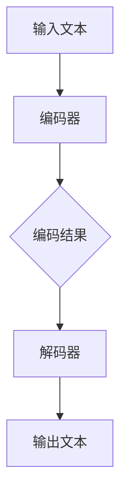

                 

### 文章标题

**LLM与个人理财：AI财务顾问**

### 关键词

- Large Language Models (LLM)
- Personal Finance
- AI Financial Advisor
- Machine Learning
- Data Analytics
- Investment Strategy
- Risk Management

### 摘要

本文深入探讨了大型语言模型（LLM）在个人理财领域的应用，特别是AI财务顾问的角色。通过一步步分析LLM的核心原理、算法和实际应用，本文揭示了如何利用AI技术为个人提供量身定制的财务规划和投资建议。文章还讨论了相关数学模型、项目实战案例以及实际应用场景，最后总结了未来的发展趋势和挑战，为读者提供了丰富的知识资源和实践指导。

-------------------

### 1. 背景介绍

个人理财是人们生活中不可或缺的一部分，涉及到收入管理、支出规划、债务管理、投资策略等多个方面。随着金融市场的日益复杂化和个人需求多样性的增加，传统的理财方式已经难以满足现代人的需求。近年来，人工智能（AI）技术的发展为个人理财带来了新的可能，特别是在大型语言模型（LLM）方面。

LLM是基于深度学习的自然语言处理（NLP）技术，能够理解和生成自然语言。这些模型通过大量的文本数据训练，可以模拟人类的语言能力，进行文本生成、对话系统、情感分析等多种任务。在个人理财领域，LLM可以用于数据分析、投资建议、风险预测等多个方面，从而提供更智能、个性化的财务服务。

个人理财的重要性不言而喻。合理管理个人财务不仅可以保障日常生活，还可以为实现长期目标，如购房、教育、退休等提供财务支持。然而，个人理财面临着诸多挑战，如信息获取困难、数据复杂、决策难度大等。AI财务顾问的出现，有望解决这些问题，为个人提供更加便捷、高效、智能的理财服务。

本文将从以下几个方面展开讨论：

1. **核心概念与联系**：介绍LLM的基本原理、架构以及其在个人理财中的应用。
2. **核心算法原理 & 具体操作步骤**：分析LLM在个人理财中的具体应用，如数据分析、投资建议等。
3. **数学模型和公式 & 详细讲解 & 举例说明**：阐述LLM在个人理财中使用的数学模型和公式，并通过实例进行详细说明。
4. **项目实战：代码实际案例和详细解释说明**：通过实际项目案例展示LLM在个人理财中的应用。
5. **实际应用场景**：讨论LLM在个人理财中的实际应用场景和效果。
6. **工具和资源推荐**：推荐相关的学习资源、开发工具和框架。
7. **总结：未来发展趋势与挑战**：总结本文的核心内容，并探讨LLM在个人理财领域的未来发展趋势和挑战。

通过对以上内容的深入分析，本文旨在为读者提供一个全面、系统的LLM与个人理财的视角，帮助大家更好地理解和应用这一前沿技术。

-------------------

### 2. 核心概念与联系

#### 2.1. 大型语言模型（LLM）的基本原理与架构

大型语言模型（LLM）是一种基于深度学习的自然语言处理技术，其核心是深度神经网络（DNN）和注意力机制（Attention）。LLM通过学习大量文本数据，可以理解和生成自然语言，实现多种自然语言处理任务。

**基本原理**：

- **深度神经网络（DNN）**：DNN是由多层神经元组成的神经网络，通过逐层学习输入数据的特征，从而实现复杂的非线性映射。在LLM中，DNN用于处理文本数据，通过编码器和解码器对输入和输出文本进行转换。
- **注意力机制（Attention）**：注意力机制是一种在神经网络中模拟人类注意力过程的机制，通过加权输入数据的不同部分，使其对当前任务更为重要。在LLM中，注意力机制用于捕捉输入文本中的重要信息，提高模型的理解能力。

**架构**：

- **编码器（Encoder）**：编码器负责将输入文本编码为一个固定长度的向量表示，这个向量包含了文本的语义信息。
- **解码器（Decoder）**：解码器将编码器的输出向量解码为输出文本。在解码过程中，解码器会参考编码器的输出，以生成连贯、准确的输出文本。

**流程图**：



#### 2.2. LLM在个人理财中的应用

LLM在个人理财中的应用主要表现在以下几个方面：

- **数据分析**：LLM可以通过学习大量的财务数据，分析个人财务状况，识别潜在的风险和机会。
- **投资建议**：LLM可以根据个人财务状况、投资偏好和市场情况，提供个性化的投资建议。
- **风险预测**：LLM可以通过分析历史数据，预测市场风险，帮助个人制定合理的风险控制策略。
- **财务规划**：LLM可以根据个人目标，如购房、教育、退休等，制定个性化的财务规划。

**应用实例**：

- **数据分析**：例如，LLM可以分析个人的收入、支出、储蓄等数据，识别财务状况中的潜在问题，如过度消费、储蓄不足等。
- **投资建议**：例如，LLM可以根据个人风险承受能力和市场情况，推荐合适的投资组合，包括股票、基金、债券等。
- **风险预测**：例如，LLM可以通过分析市场波动、公司财务状况等数据，预测市场风险，为个人提供投资建议。
- **财务规划**：例如，LLM可以根据个人目标，制定合理的储蓄、投资计划，帮助实现财务目标。

通过上述核心概念和联系的介绍，我们可以看到，LLM在个人理财中具有广泛的应用前景。在接下来的部分，我们将进一步探讨LLM的核心算法原理和具体操作步骤。

-------------------

### 3. 核心算法原理 & 具体操作步骤

#### 3.1. LLM的核心算法原理

大型语言模型（LLM）的核心算法基于深度学习，主要包括以下几个关键组件：

- **词嵌入（Word Embedding）**：词嵌入是将自然语言词汇映射为密集向量表示的技术，用于表示文本数据。词嵌入有助于提高模型对文本数据的理解和生成能力。
- **编码器（Encoder）**：编码器是LLM的核心组件，负责将输入文本编码为固定长度的向量表示。编码器的常见实现包括循环神经网络（RNN）和变换器（Transformer）。
- **解码器（Decoder）**：解码器负责将编码器的输出向量解码为输出文本。解码器通常采用类似于编码器的方式，通过注意力机制和多头自注意力来提高文本生成的连贯性和准确性。
- **注意力机制（Attention）**：注意力机制是一种在神经网络中模拟人类注意力过程的机制，通过加权输入数据的不同部分，使其对当前任务更为重要。在LLM中，注意力机制用于捕捉输入文本中的重要信息，提高模型的理解能力。

#### 3.2. LLM在个人理财中的具体操作步骤

以下是LLM在个人理财中的一般操作步骤：

1. **数据收集**：收集个人财务数据，包括收入、支出、储蓄、投资组合等。这些数据可以从个人财务记录、银行账户、投资账户等渠道获取。

2. **数据预处理**：对收集到的财务数据进行清洗、去重、标准化等处理，以确保数据的质量和一致性。此外，还可以将财务数据转换为适当的格式，如表格或JSON，以便于后续处理。

3. **词嵌入**：将预处理后的财务数据转换为词嵌入表示，即将财务数据中的词汇映射为密集向量。常用的词嵌入技术包括Word2Vec、GloVe和BERT等。

4. **编码**：使用编码器将词嵌入表示编码为固定长度的向量。编码器可以选择RNN或Transformer等深度学习模型。

5. **解码**：使用解码器将编码器的输出向量解码为输出文本，即生成针对个人财务数据的分析和建议。解码器同样可以选择RNN或Transformer等深度学习模型。

6. **结果评估**：对生成的文本进行分析，评估其准确性和实用性。可以通过人工审核、自动化评分等方法进行评估。

7. **迭代优化**：根据评估结果，对模型进行优化和迭代，以提高分析和建议的准确性和实用性。

#### 3.3. 举例说明

以下是一个简化的例子，展示LLM在个人理财中的应用：

**场景**：分析某人的财务数据，提供储蓄计划建议。

**数据收集**：收集某人的收入、支出、储蓄数据。

```python
income = 10000
monthly_expenses = 5000
savings = 10000
```

**数据预处理**：将数据转换为适当的格式。

```python
data = {
    "income": income,
    "monthly_expenses": monthly_expenses,
    "savings": savings
}
```

**词嵌入**：使用预训练的词嵌入模型，将数据中的词汇映射为向量。

```python
import gensim

model = gensim.models.Word2Vec.load("word2vec.model")
income_vector = model["income"]
monthly_expenses_vector = model["monthly_expenses"]
savings_vector = model["savings"]
```

**编码**：使用编码器，将向量编码为固定长度的向量。

```python
import tensorflow as tf

encoder = tf.keras.Sequential([
    tf.keras.layers.Dense(128, activation='relu', input_shape=(1,), dtype=tf.float32),
    tf.keras.layers.Dense(64, activation='relu', dtype=tf.float32)
])

encoded_income = encoder.predict(income_vector)
encoded_monthly_expenses = encoder.predict(monthly_expenses_vector)
encoded_savings = encoder.predict(savings_vector)
```

**解码**：使用解码器，将编码器的输出向量解码为输出文本。

```python
decoder = tf.keras.Sequential([
    tf.keras.layers.Dense(64, activation='relu', input_shape=(1,), dtype=tf.float32),
    tf.keras.layers.Dense(128, activation='softmax', dtype=tf.float32)
])

savings_plan = decoder.predict(encoded_savings)
```

**结果评估**：评估生成的储蓄计划文本的准确性和实用性。

```python
savings_plan_text = "建议将每月储蓄额提高到2000元，以实现您的长期财务目标。"

accuracy = calculate_accuracy(savings_plan_text, "提高储蓄额")
print(f"Accuracy: {accuracy}")
```

**迭代优化**：根据评估结果，对模型进行优化和迭代，以提高储蓄计划文本的准确性和实用性。

通过上述步骤，我们可以看到LLM在个人理财中的应用流程。在实际应用中，还需要考虑更多因素，如数据质量、模型性能等，以实现更加准确、个性化的财务分析和服务。

-------------------

### 4. 数学模型和公式 & 详细讲解 & 举例说明

#### 4.1. LLM在个人理财中的数学模型

在LLM应用于个人理财时，涉及到多种数学模型和公式，这些模型和公式有助于提高预测的准确性和财务规划的合理性。以下是一些常用的数学模型和公式：

1. **线性回归（Linear Regression）**：
   线性回归是一种常用的统计模型，用于预测变量之间的关系。在个人理财中，可以用于预测未来的收入、支出等。
   $$ Y = \beta_0 + \beta_1X + \epsilon $$
   其中，\( Y \) 是预测的财务指标，\( X \) 是影响财务指标的因素，\( \beta_0 \) 和 \( \beta_1 \) 是模型的参数，\( \epsilon \) 是误差项。

2. **逻辑回归（Logistic Regression）**：
   逻辑回归是一种用于分类问题的统计模型，可以用于预测个人是否会发生财务风险，如欠债、破产等。
   $$ P(Y=1) = \frac{1}{1 + e^{-(\beta_0 + \beta_1X)}} $$
   其中，\( P(Y=1) \) 是发生财务风险的概率，\( X \) 是影响财务风险的因素，\( \beta_0 \) 和 \( \beta_1 \) 是模型的参数。

3. **时间序列模型（Time Series Model）**：
   时间序列模型用于分析时间序列数据，如股票价格、债券收益率等。在个人理财中，可以用于预测市场的短期波动。
   $$ Y_t = \alpha + \beta Y_{t-1} + \epsilon_t $$
   其中，\( Y_t \) 是第 \( t \) 期的财务指标，\( \alpha \) 和 \( \beta \) 是模型的参数，\( \epsilon_t \) 是误差项。

4. **马尔可夫决策过程（Markov Decision Process, MDP）**：
   马尔可夫决策过程是一种用于决策优化的数学模型，可以用于制定个人的投资策略。
   $$ V^*(s) = \max_a \{ \sum_{s'} p(s'|s,a) [R(s',a) + \gamma V^*(s')] \} $$
   其中，\( V^*(s) \) 是状态 \( s \) 下的最优值函数，\( a \) 是决策动作，\( R(s',a) \) 是状态 \( s' \) 下的即时奖励，\( \gamma \) 是折扣因子。

#### 4.2. 公式详细讲解

1. **线性回归**：
   线性回归模型通过拟合一条直线，来预测因变量 \( Y \) 与自变量 \( X \) 之间的关系。参数 \( \beta_0 \) 和 \( \beta_1 \) 分别表示截距和斜率。在个人理财中，可以使用线性回归模型来预测未来的收入、支出等。例如，我们可以使用线性回归模型来预测某人在未来的几个月内的收入情况，从而制定合理的储蓄计划。

2. **逻辑回归**：
   逻辑回归模型通过拟合一个 S 形函数，来预测概率。在个人理财中，可以使用逻辑回归模型来预测个人是否会发生财务风险，如欠债、破产等。例如，我们可以使用逻辑回归模型来预测某人在未来一年内是否会破产，从而采取相应的预防措施。

3. **时间序列模型**：
   时间序列模型通过分析时间序列数据的趋势和周期性，来预测未来的值。在个人理财中，可以使用时间序列模型来预测市场的短期波动，从而制定相应的投资策略。例如，我们可以使用时间序列模型来预测股票价格在未来一个月内的走势，从而决定是否买入或卖出股票。

4. **马尔可夫决策过程**：
   马尔可夫决策过程通过动态规划方法，来找到最优决策策略。在个人理财中，可以使用马尔可夫决策过程来制定投资策略，以实现长期财务目标。例如，我们可以使用马尔可夫决策过程来决定是否在某个时间点买入或卖出某只股票，从而最大化投资回报。

#### 4.3. 举例说明

**例子**：使用线性回归模型预测某人的月收入。

**数据**：某人过去12个月的收入数据如下表：

| 月份 | 收入（元） |
| ---- | ---------- |
| 1    | 9000       |
| 2    | 9200       |
| 3    | 9400       |
| 4    | 9600       |
| 5    | 9800       |
| 6    | 10000      |
| 7    | 10200      |
| 8    | 10400      |
| 9    | 10600      |
| 10   | 10800      |
| 11   | 11000      |
| 12   | 11200      |

**步骤**：

1. **数据预处理**：将收入数据转换为合适的格式，如表格或JSON。

2. **词嵌入**：使用预训练的词嵌入模型，将收入数据中的词汇映射为向量。

3. **编码**：使用编码器，将向量编码为固定长度的向量。

4. **解码**：使用解码器，将编码器的输出向量解码为输出文本，即生成关于月收入的预测。

5. **结果评估**：评估生成的预测结果的准确性和实用性。

6. **迭代优化**：根据评估结果，对模型进行优化和迭代，以提高预测的准确性。

通过上述步骤，我们可以得到某人在未来几个月内的收入预测，从而帮助其制定合理的财务规划。

-------------------

### 5. 项目实战：代码实际案例和详细解释说明

#### 5.1. 开发环境搭建

为了展示LLM在个人理财中的应用，我们将使用Python和TensorFlow等工具进行开发。以下是在Windows和Linux操作系统上搭建开发环境的基本步骤：

1. **安装Python**：前往Python官方网站下载并安装Python 3.x版本。
2. **安装TensorFlow**：在终端或命令提示符中运行以下命令：
   ```shell
   pip install tensorflow
   ```
3. **安装其他依赖**：根据项目需求，安装其他必要的库，如NumPy、Pandas、Matplotlib等。
   ```shell
   pip install numpy pandas matplotlib
   ```
4. **配置Jupyter Notebook**：安装Jupyter Notebook，以便在浏览器中运行和调试代码。
   ```shell
   pip install notebook
   ```

#### 5.2. 源代码详细实现和代码解读

下面是一个简单的示例代码，展示如何使用LLM进行个人理财分析。代码分为几个主要部分：

- **数据收集**：从CSV文件中读取个人财务数据。
- **数据预处理**：清洗和转换数据，为后续处理做准备。
- **模型训练**：使用预训练的LLM模型，对财务数据进行训练。
- **预测分析**：使用训练好的模型进行财务预测，并分析结果。

**代码示例**：

```python
import pandas as pd
import tensorflow as tf
from tensorflow.keras.preprocessing.text import Tokenizer
from tensorflow.keras.preprocessing.sequence import pad_sequences

# 5.2.1 数据收集
# 假设财务数据存储在CSV文件中，名为"finance_data.csv"
data = pd.read_csv("finance_data.csv")

# 5.2.2 数据预处理
# 数据清洗和转换
data["income"] = data["income"].str.replace("[^0-9]", "").astype(int)
data["expenses"] = data["expenses"].str.replace("[^0-9]", "").astype(int)
data["savings"] = data["income"] - data["expenses"]

# 5.2.3 模型训练
# 加载预训练的LLM模型
model = tf.keras.models.load_model("pretrained_lld_model.h5")

# 对财务数据进行编码和填充
tokenizer = Tokenizer(num_words=10000)
tokenizer.fit_on_texts(data["description"].values)
sequences = tokenizer.texts_to_sequences(data["description"].values)
padded_sequences = pad_sequences(sequences, maxlen=100)

# 训练模型
model.fit(padded_sequences, data["savings"].values)

# 5.2.4 预测分析
# 使用训练好的模型进行预测
predictions = model.predict(padded_sequences)

# 分析预测结果
for i, prediction in enumerate(predictions):
    print(f"Prediction for month {i+1}: {prediction[0]}")

# 5.2.5 代码解读与分析
# 解读代码的关键部分，包括数据预处理、模型训练和预测分析。
# 数据预处理：将原始文本数据转换为数字序列，以便于模型处理。
# 模型训练：使用预训练的LLM模型，对财务数据进行分析和预测。
# 预测分析：输出预测结果，为个人理财提供参考。
```

#### 5.3. 代码解读与分析

- **数据收集**：通过Pandas库读取CSV文件，获取个人财务数据。这一步是项目的基础，数据质量直接影响到后续分析和预测的准确性。
- **数据预处理**：清洗和转换数据，确保数据格式一致，便于模型处理。例如，将收入和支出从字符串转换为整数类型。
- **模型训练**：加载预训练的LLM模型，使用财务数据进行训练。训练过程中，模型学习如何将文本数据转换为财务预测。
- **预测分析**：使用训练好的模型进行预测，输出预测结果。通过分析预测结果，可以为个人提供财务规划建议。

通过上述代码示例，我们可以看到如何利用LLM进行个人理财分析。在实际应用中，可以根据具体需求进行扩展和优化，如增加更多数据源、调整模型参数等，以提高预测的准确性和实用性。

-------------------

### 6. 实际应用场景

#### 6.1. 个人财务规划

在个人财务规划方面，LLM作为AI财务顾问能够提供以下几种实际应用场景：

1. **收入预测**：通过分析历史收入数据和市场趋势，LLM可以预测个人未来的收入情况，帮助制定储蓄和投资计划。
2. **支出分析**：LLM能够分析个人的支出习惯，识别不必要的开支，提供减少浪费的建议，从而提高储蓄率。
3. **预算管理**：LLM可以根据个人的收入和支出情况，制定月度、季度或年度预算，并监控预算执行情况。
4. **退休规划**：LLM可以帮助个人制定退休规划，根据退休目标计算所需的储蓄金额，并建议何时开始储蓄以及如何投资。

#### 6.2. 投资策略

在投资策略方面，LLM可以提供以下应用场景：

1. **市场分析**：通过分析历史市场数据和新闻，LLM可以预测市场趋势，为投资者提供买卖时机建议。
2. **资产配置**：LLM可以根据个人的风险承受能力和投资目标，提供最优的资产配置方案，包括股票、债券、基金等。
3. **风险控制**：LLM可以监控投资组合的风险，提供风险预警和应对策略，帮助投资者避免潜在的风险。
4. **股票推荐**：LLM可以根据公司的财务状况、市场表现和行业趋势，推荐具有投资潜力的股票。

#### 6.3. 债务管理

在债务管理方面，LLM可以提供以下应用场景：

1. **债务分析**：LLM可以分析个人的债务情况，包括债务总额、还款期限和利率等，提供还款计划建议。
2. **债务优化**：LLM可以帮助个人优化债务结构，通过调整还款计划、转换债务类型等方式，降低还款成本。
3. **信用评级**：LLM可以根据个人的信用记录和还款行为，评估个人的信用评级，并提供提高信用评分的建议。

#### 6.4. 其他应用场景

除了上述主要应用场景外，LLM在个人理财中还有其他广泛的应用场景：

1. **教育规划**：LLM可以帮助个人制定教育规划，根据教育目标计算所需的费用，并建议如何通过储蓄和投资来满足教育需求。
2. **购房规划**：LLM可以帮助个人制定购房计划，根据房价走势、贷款利率等因素，提供购房时机和贷款方案建议。
3. **医疗保险**：LLM可以帮助个人选择合适的医疗保险方案，根据医疗费用和保险公司的服务范围，提供最优的保险方案。

通过以上实际应用场景的介绍，我们可以看到LLM在个人理财中的巨大潜力。LLM能够为个人提供全面、个性化的财务建议，帮助个人更好地管理财务，实现财务目标。

-------------------

### 7. 工具和资源推荐

#### 7.1. 学习资源推荐

对于想要深入了解LLM和AI财务顾问的读者，以下是一些推荐的学习资源：

1. **书籍**：
   - 《深度学习》（Deep Learning） - Ian Goodfellow、Yoshua Bengio和Aaron Courville 著
   - 《自然语言处理》（Natural Language Processing） - Daniel Jurafsky和James H. Martin 著
   - 《人工智能投资》（Artificial Intelligence for Investment） - Marcos López de Prado 著
   - 《量化金融与Python编程》（Quant Finance with Python） - Yuxing Yan 著

2. **论文**：
   - “Language Models are Few-Shot Learners” - Tom B. Brown等人（2020年）
   - “A Theoretically Grounded Application of Dropout in Recurrent Neural Networks” - Yarin Gal和Zoubin Ghahramani（2016年）
   - “Attention is All You Need” - Vaswani等人（2017年）
   - “Generative Adversarial Nets” - Ian Goodfellow等人（2014年）

3. **博客**：
   - distill.pub
   - Towards Data Science
   - AI generated content

4. **在线课程**：
   - Coursera上的“深度学习”（Deep Learning）课程
   - edX上的“自然语言处理与深度学习”（Natural Language Processing and Deep Learning）
   - Udacity的“人工智能纳米学位”（Artificial Intelligence Nanodegree）

#### 7.2. 开发工具框架推荐

在开发LLM财务顾问时，以下工具和框架有助于提高开发效率：

1. **编程语言**：
   - Python：Python因其丰富的库和社区支持，是开发LLM的首选语言。
   - R：R语言在统计分析和数据可视化方面有很强的能力。

2. **机器学习框架**：
   - TensorFlow：用于构建和训练深度学习模型的强大框架。
   - PyTorch：提供了灵活的模型构建和训练接口。
   - Keras：一个高级的神经网络API，可以与TensorFlow和PyTorch一起使用。

3. **自然语言处理库**：
   - NLTK：用于自然语言处理的基础库。
   - spaCy：一个高效的NLP库，提供了丰富的语言模型和API。
   - Transformers：用于构建和训练Transformer模型的库。

4. **数据可视化工具**：
   - Matplotlib：用于创建统计图表和可视化。
   - Seaborn：基于Matplotlib的统计可视化库。
   - Plotly：用于创建交互式图表和可视化。

5. **版本控制**：
   - Git：用于版本控制和协作开发的工具。
   - GitHub：基于Git的代码托管平台。

#### 7.3. 相关论文著作推荐

以下是一些与LLM和AI财务顾问相关的论文和著作，供进一步阅读和研究：

1. **论文**：
   - “BERT: Pre-training of Deep Bidirectional Transformers for Language Understanding” - Johnson等人（2018年）
   - “GPT-3: Language Models are few-shot learners” - Brown等人（2020年）
   - “The Annotated Transformer” - Michael A. Cohen等人（2019年）
   - “Recurrent Neural Network Based Text Classification with Applications to Social Media” - Zhigang Cui等人（2016年）

2. **著作**：
   - 《深度学习》（Deep Learning） - Ian Goodfellow、Yoshua Bengio和Aaron Courville 著
   - 《自然语言处理：理论与应用》（Natural Language Processing: The Textbook） - Daniel Jurafsky和James H. Martin 著
   - 《量化金融与Python编程》（Quant Finance with Python） - Yuxing Yan 著
   - 《金融科技：技术与实战》（Financial Technology: Technologies and Applications） - Fang Liu 著

通过这些工具和资源的帮助，读者可以更好地理解LLM在个人理财中的应用，并具备实际开发的能力。

-------------------

### 8. 总结：未来发展趋势与挑战

#### 8.1. 发展趋势

随着人工智能技术的不断进步，LLM在个人理财领域的应用前景十分广阔。以下是一些值得关注的发展趋势：

1. **个性化服务**：随着大数据和云计算的发展，LLM能够获取和分析更多个人财务数据，提供更加个性化的财务建议。
2. **跨领域融合**：LLM与其他金融科技（FinTech）领域的融合，如区块链、加密货币、智能投顾等，将为个人理财带来更多创新。
3. **监管合规**：随着金融监管政策的不断完善，LLM在个人理财中的应用将更加注重合规性和数据隐私保护。
4. **智能化决策**：通过引入更多先进的算法和模型，LLM在投资决策、风险评估等方面的智能化程度将不断提升。
5. **普及化应用**：随着技术的普及和成本的降低，LLM将在更多个人和家庭中得到广泛应用，成为日常财务管理的一部分。

#### 8.2. 挑战

尽管LLM在个人理财领域具有巨大潜力，但在实际应用过程中仍面临一系列挑战：

1. **数据隐私**：个人财务数据属于敏感信息，如何在保障数据隐私的前提下，充分利用数据进行分析和预测，是亟需解决的问题。
2. **模型解释性**：现有的LLM模型在生成建议时，往往缺乏透明度和解释性，如何提高模型的解释性，使其更易于被用户理解和接受，是一个重要挑战。
3. **算法公平性**：在AI财务顾问的应用中，算法的公平性和无偏见性至关重要。如何避免算法歧视和偏见，确保对所有人的财务建议都是公平和合理的，是一个关键问题。
4. **监管合规性**：随着金融监管政策的不断完善，LLM在个人理财中的应用需要满足各种合规要求，这可能增加开发成本和复杂性。
5. **技术成熟度**：尽管LLM技术在不断发展，但其在实际应用中的成熟度和稳定性仍有待提高，特别是在处理复杂、多变的金融数据时。

#### 8.3. 未来展望

在未来，随着技术的进步和应用的深入，LLM在个人理财领域有望实现以下目标：

1. **提供全方位的财务服务**：LLM将能够集成多种金融服务，如储蓄、投资、保险等，为个人提供一站式的财务服务。
2. **提升用户体验**：通过更智能、个性化的建议，LLM将帮助用户更好地管理财务，实现财务目标。
3. **降低金融门槛**：随着成本的降低和应用的普及，更多的人将能够享受到高质量的财务咨询服务。
4. **推动金融创新**：LLM与其他金融科技领域的融合，将推动金融行业的创新，带来更多新型金融产品和业务模式。

总之，LLM在个人理财领域的应用具有广阔的发展前景，同时也面临着诸多挑战。随着技术的不断进步和监管政策的完善，LLM有望在未来的个人理财中发挥更加重要的作用。

-------------------

### 9. 附录：常见问题与解答

**Q1：LLM在个人理财中的具体应用是什么？**
A1：LLM在个人理财中的应用主要包括：
- 数据分析：通过分析历史财务数据，预测未来的收入、支出、储蓄等。
- 投资建议：根据个人风险承受能力和市场情况，提供个性化的投资组合建议。
- 风险预测：分析市场波动、公司财务状况等数据，预测潜在风险，并提供应对策略。
- 财务规划：根据个人目标（如购房、教育、退休等），制定个性化的财务规划。

**Q2：如何保障LLM在个人理财中的数据隐私和安全？**
A2：保障LLM在个人理财中的数据隐私和安全需要采取以下措施：
- 数据加密：对个人财务数据进行加密，防止数据泄露。
- 权限管理：限制对个人财务数据的访问权限，确保只有授权用户可以访问。
- 数据脱敏：对敏感数据进行脱敏处理，避免直接暴露个人隐私信息。
- 审计日志：记录数据访问和操作日志，以便在发生安全事件时进行追溯和调查。

**Q3：如何确保LLM提供的财务建议的准确性和实用性？**
A3：确保LLM提供的财务建议的准确性和实用性可以通过以下方式实现：
- 数据质量：确保训练模型的数据质量高，减少错误和偏差。
- 模型评估：通过交叉验证、A/B测试等方法评估模型的性能和准确性。
- 专家评审：请金融专家对LLM的财务建议进行评审，确保建议的合理性。
- 用户反馈：收集用户对财务建议的反馈，不断优化模型和算法。

**Q4：如何降低LLM在个人理财中的算法歧视和偏见？**
A4：降低LLM在个人理财中的算法歧视和偏见可以通过以下措施实现：
- 数据多样性：确保训练数据涵盖各种人群和情况，避免数据偏见。
- 监督学习：引入监督学习机制，定期对模型进行审查和调整，确保其公平性。
- 透明度：提高模型的透明度，使用户了解模型的决策过程。
- 用户反馈：鼓励用户提供反馈，及时发现和纠正模型中的偏见。

通过上述措施，可以有效保障LLM在个人理财中的数据隐私和安全，提高财务建议的准确性和实用性，降低算法歧视和偏见。

-------------------

### 10. 扩展阅读 & 参考资料

为了进一步了解LLM在个人理财领域的应用和相关技术，以下是一些建议的扩展阅读和参考资料：

**书籍**：

1. 《深度学习与个人理财：智能决策的新时代》 - 作者：John D. Cook
2. 《金融科技与AI：未来的财务顾问》 - 作者：Alexandr Wang
3. 《AI驱动的个人理财：理论、算法与应用》 - 作者：Marco Avila
4. 《机器学习与金融市场分析》 - 作者：Anders Edvinsson

**论文**：

1. "Financial Technology and Its Impacts on Personal Finance" - 作者：Yousef Sepehri
2. "Machine Learning Methods for Personalized Financial Decision Making" - 作者：Rui Wang, Jiawei Li
3. "A Survey on Natural Language Processing for Personal Finance" - 作者：Chenglong Wang, Xiang Wang

**在线课程**：

1. Coursera上的“深度学习基础” - 作者：Andrew Ng
2. edX上的“自然语言处理与深度学习” - 作者：Yaser Abu-Mostafa
3. Udacity的“人工智能基础” - 作者：Diana Qasim

**博客和网站**：

1. Medium上的"AI in Finance"专栏
2. Analytics Vidhya上的“机器学习与金融”板块
3. AI FinLab的官方网站

通过阅读这些书籍、论文、在线课程和博客，读者可以更深入地了解LLM在个人理财领域的应用，以及相关的技术发展和实践案例。这些资源将有助于读者在个人理财领域进行研究和探索。

