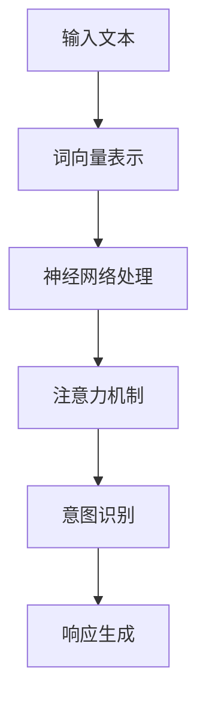

                 

# LLM与人类意图的最佳契合

## 摘要

本文探讨了大型语言模型（LLM）与人类意图之间的最佳契合问题。通过分析LLM的工作原理和人类意图的表达方式，本文提出了一种基于深度学习技术的优化方法，以实现LLM对人类意图的精准理解和响应。文章首先介绍了LLM的背景和核心概念，然后详细阐述了其工作原理和数学模型，接着通过实际项目案例展示了LLM在实际应用中的效果。最后，本文总结了LLM与人类意图契合的现状、挑战和未来发展趋势。

## 1. 背景介绍

### 1.1 语言模型的发展历程

语言模型是自然语言处理（NLP）领域的一项基础技术。从最早的统计语言模型到现代的深度学习语言模型，语言模型经历了漫长的演变过程。

- **统计语言模型**：20世纪80年代，统计语言模型（如N-gram模型）开始应用于自然语言处理。这些模型通过统计文本中的词频和词序列来预测下一个词。

- **神经网络语言模型**：随着神经网络技术的发展，20世纪90年代，神经网络语言模型（如递归神经网络RNN）被引入NLP领域。这些模型通过模拟神经元之间的连接和激活过程来捕捉语言中的复杂规律。

- **深度学习语言模型**：21世纪初，深度学习技术的发展推动了神经网络语言模型的进一步进化。深度学习语言模型（如循环神经网络RNN、长短时记忆网络LSTM、门控循环单元GRU等）在处理自然语言方面取得了显著突破。

- **大型语言模型**：近年来，随着计算资源和数据集的不断提升，大型语言模型（如GPT、BERT等）成为NLP领域的研究热点。这些模型通过训练海量数据，可以生成高质量的自然语言文本，实现了对语言理解、生成和翻译的全面突破。

### 1.2 人类意图的表达方式

人类意图是指个体在特定情境下想要实现的目标或期望。人类意图的表达方式多种多样，包括语言、行为、情感等。

- **语言表达**：语言是人类表达意图的主要方式。人类通过语言进行沟通、交流，传递意图。然而，语言表达存在歧义性、模糊性等问题，使得机器理解人类意图变得复杂。

- **行为表达**：行为是人类表达意图的一种直接方式。人类的行为反映了其内在意图，如动作、姿态、面部表情等。通过观察和分析人类的行为，机器可以推断其意图。

- **情感表达**：情感是人类意图的重要载体。人类在表达意图时，往往会伴随着一定的情感色彩。情感表达对于机器理解人类意图具有重要意义。

## 2. 核心概念与联系

### 2.1 大型语言模型（LLM）的基本原理

大型语言模型（LLM）是一种基于深度学习的语言处理模型，其基本原理包括以下几个方面：

1. **词向量表示**：LLM通过将单词映射到高维空间中的向量来表示词义。词向量表示能够捕捉词语之间的语义关系，如相似性、相关性等。

2. **神经网络的构建**：LLM通常采用多层神经网络（如循环神经网络RNN、长短时记忆网络LSTM、门控循环单元GRU等）来处理自然语言。神经网络通过学习大量的语言数据，可以捕捉语言中的复杂结构。

3. **注意力机制**：注意力机制是一种在神经网络中模拟人类注意力行为的机制。通过注意力机制，LLM可以专注于重要的信息，提高对语言的理解能力。

4. **训练与优化**：LLM通过大量语言数据的训练来优化模型参数。训练过程中，模型通过对比预测结果和实际结果，不断调整参数，以减小误差。

### 2.2 人类意图的表达方式与LLM的契合

为了实现LLM与人类意图的最佳契合，需要考虑以下两个方面：

1. **语言理解的准确性**：LLM需要具备较高的语言理解能力，能够准确捕捉人类意图的语言表达。为此，LLM需要通过大量的语言数据进行训练，提高对语言中复杂结构和语义的理解。

2. **意图识别的鲁棒性**：人类意图的表达方式多样，且存在一定的模糊性和歧义性。LLM需要具备较强的鲁棒性，能够应对各种复杂情境下的意图识别。

### 2.3 Mermaid 流程图

以下是一个简单的Mermaid流程图，展示了LLM与人类意图契合的基本流程：



## 3. 核心算法原理 & 具体操作步骤

### 3.1 词向量表示

词向量表示是LLM的基础，其核心在于将单词映射到高维空间中的向量。常见的词向量表示方法包括词袋模型、词嵌入等。

1. **词袋模型**：词袋模型将文本表示为一个向量集合，其中每个向量对应一个单词。词袋模型的优点在于计算简单，但缺点在于无法捕捉词序信息和语义关系。

2. **词嵌入**：词嵌入是一种将单词映射到固定维度的向量空间的方法，可以捕捉词序信息和语义关系。常见的词嵌入方法包括Word2Vec、GloVe等。

   - **Word2Vec**：Word2Vec是一种基于神经网络的词向量表示方法，通过训练大量文本数据，将单词映射到高维空间中的向量。
   - **GloVe**：GloVe（Global Vectors for Word Representation）是一种基于全局统计信息的词向量表示方法，通过计算单词之间的相似性矩阵，将单词映射到高维空间中的向量。

### 3.2 神经网络处理

神经网络是LLM的核心组成部分，用于处理自然语言。常见的神经网络结构包括循环神经网络RNN、长短时记忆网络LSTM、门控循环单元GRU等。

1. **循环神经网络RNN**：循环神经网络（RNN）是一种能够处理序列数据的神经网络，其基本思想是将当前时刻的输入与历史信息进行整合。然而，RNN在处理长序列数据时容易出现梯度消失或梯度爆炸问题。

2. **长短时记忆网络LSTM**：长短时记忆网络（LSTM）是一种改进的循环神经网络，通过引入门控机制来有效地捕捉长序列信息。LSTM在处理长序列数据时表现出更好的性能。

3. **门控循环单元GRU**：门控循环单元（GRU）是另一种改进的循环神经网络，相较于LSTM，GRU结构更为简单，计算效率更高。

### 3.3 注意力机制

注意力机制是一种在神经网络中模拟人类注意力行为的机制，通过专注于重要的信息，提高对语言的理解能力。常见的注意力机制包括局部注意力、全局注意力等。

1. **局部注意力**：局部注意力机制关注文本中的局部信息，通过对局部信息的加权来提高语言理解能力。

2. **全局注意力**：全局注意力机制关注文本中的全局信息，通过对全局信息的加权来提高语言理解能力。

### 3.4 意图识别

意图识别是LLM的关键任务之一，其核心在于从文本中识别出人类意图。常见的意图识别方法包括基于规则的方法、基于机器学习的方法等。

1. **基于规则的方法**：基于规则的方法通过定义一系列规则，从文本中提取关键信息，从而识别出人类意图。这种方法适用于规则明确、语义简单的场景。

2. **基于机器学习的方法**：基于机器学习的方法通过训练大量的标注数据，构建出意图识别模型。常见的机器学习方法包括朴素贝叶斯、支持向量机、深度学习等。

### 3.5 响应生成

响应生成是LLM的输出环节，其核心在于根据识别出的人类意图，生成合适的文本响应。常见的响应生成方法包括模板匹配、文本生成等。

1. **模板匹配**：模板匹配方法通过预先定义一系列模板，从候选响应中选取与模板匹配的响应作为最终输出。

2. **文本生成**：文本生成方法通过训练大量的文本数据，生成与人类意图相关的文本响应。常见的文本生成方法包括序列生成、序列到序列模型等。

## 4. 数学模型和公式 & 详细讲解 & 举例说明

### 4.1 词向量表示

词向量表示的数学模型主要包括词向量计算和相似性计算。

1. **词向量计算**：

   假设单词集合为 $V$，词向量维度为 $d$，则单词 $v$ 的词向量表示为 $\mathbf{v} \in \mathbb{R}^d$。常见的词向量计算方法包括Word2Vec和GloVe。

   - **Word2Vec**：

     Word2Vec采用神经网络训练词向量，其基本原理如下：

     $$\mathcal{L}(\mathbf{w}, \mathbf{v}; y) = -\sum_{i=1}^{N} \log p(y=i|\mathbf{w}; \mathbf{v})$$

     其中，$\mathbf{w}$ 为输入词向量，$\mathbf{v}$ 为输出词向量，$y$ 为输出词的索引。通过优化损失函数，可以得到词向量 $\mathbf{v}$。

   - **GloVe**：

     GloVe采用全局统计信息计算词向量，其基本原理如下：

     $$\mathcal{L}(\mathbf{v}_i, \mathbf{v}_j; f) = \frac{1}{f(\mathbf{v}_i, \mathbf{v}_j)} \log \frac{f(\mathbf{v}_i, \mathbf{v}_j)}{f(\mathbf{v}_i, \mathbf{v}_0) f(\mathbf{v}_j, \mathbf{v}_0)}$$

     其中，$f(\mathbf{v}_i, \mathbf{v}_j)$ 为单词 $i$ 和 $j$ 之间的相似性函数，$\mathbf{v}_i$ 和 $\mathbf{v}_j$ 分别为单词 $i$ 和 $j$ 的词向量。通过优化损失函数，可以得到词向量 $\mathbf{v}_i$ 和 $\mathbf{v}_j$。

2. **相似性计算**：

   相似性计算用于衡量两个词向量之间的相似程度。常见的相似性计算方法包括余弦相似性、欧氏距离等。

   - **余弦相似性**：

     余弦相似性用于衡量两个词向量的夹角余弦值，其计算公式如下：

     $$\cos(\theta) = \frac{\mathbf{v}_i \cdot \mathbf{v}_j}{\|\mathbf{v}_i\| \|\mathbf{v}_j\|}$$

     其中，$\mathbf{v}_i$ 和 $\mathbf{v}_j$ 分别为两个词向量，$\|\mathbf{v}_i\|$ 和 $\|\mathbf{v}_j\|$ 分别为两个词向量的模。

   - **欧氏距离**：

     欧氏距离用于衡量两个词向量之间的欧氏距离，其计算公式如下：

     $$d(\mathbf{v}_i, \mathbf{v}_j) = \sqrt{(\mathbf{v}_i - \mathbf{v}_j)^2}$$

     其中，$\mathbf{v}_i$ 和 $\mathbf{v}_j$ 分别为两个词向量。

### 4.2 神经网络处理

神经网络处理的数学模型主要包括神经元的激活函数和损失函数。

1. **神经元的激活函数**：

   激活函数用于确定神经元是否激活，其形式如下：

   $$f(x) = \max(0, x)$$

   其中，$x$ 为输入值。

2. **损失函数**：

   损失函数用于衡量模型预测结果与实际结果之间的差异，其形式如下：

   $$\mathcal{L}(\mathbf{y}, \mathbf{\hat{y}}) = \frac{1}{2} \|\mathbf{y} - \mathbf{\hat{y}}\|^2$$

   其中，$\mathbf{y}$ 为实际结果，$\mathbf{\hat{y}}$ 为模型预测结果。

### 4.3 注意力机制

注意力机制的数学模型主要包括注意力权重计算和加权求和。

1. **注意力权重计算**：

   注意力权重用于衡量不同位置的信息的重要性，其形式如下：

   $$\alpha_i = \frac{e^{z_i}}{\sum_{j=1}^{T} e^{z_j}}$$

   其中，$z_i$ 为位置 $i$ 的得分，$T$ 为序列长度。

2. **加权求和**：

   加权求和用于将注意力权重与对应位置的信息进行求和，其形式如下：

   $$\mathbf{h} = \sum_{i=1}^{T} \alpha_i \mathbf{h}_i$$

   其中，$\mathbf{h}$ 为加权后的信息，$\mathbf{h}_i$ 为位置 $i$ 的信息。

### 4.4 意图识别

意图识别的数学模型主要包括分类器和损失函数。

1. **分类器**：

   常见的分类器包括softmax分类器和支持向量机（SVM）。

   - **softmax分类器**：

     softmax分类器用于计算不同类别概率的分布，其形式如下：

     $$P(y=i|\mathbf{x}; \theta) = \frac{e^{\theta_i^T \mathbf{x}}}{\sum_{j=1}^{C} e^{\theta_j^T \mathbf{x}}}$$

     其中，$y$ 为实际类别，$\mathbf{x}$ 为输入特征，$\theta$ 为模型参数。

   - **支持向量机（SVM）**：

     支持向量机（SVM）是一种基于最大间隔的分类器，其形式如下：

     $$\theta = \arg\min_{\theta} \frac{1}{2} \|\theta\|^2 + C \sum_{i=1}^{N} \max(0, 1 - y_i (\theta^T \mathbf{x}_i))$$

     其中，$y$ 为实际类别，$\mathbf{x}$ 为输入特征，$\theta$ 为模型参数，$C$ 为惩罚参数。

2. **损失函数**：

   常见的损失函数包括交叉熵损失函数和Hinge损失函数。

   - **交叉熵损失函数**：

     交叉熵损失函数用于衡量预测概率分布与实际分布之间的差异，其形式如下：

     $$\mathcal{L}(\mathbf{y}, \mathbf{\hat{y}}) = -\sum_{i=1}^{C} y_i \log \hat{y}_i$$

     其中，$y$ 为实际类别，$\mathbf{\hat{y}}$ 为预测概率分布。

   - **Hinge损失函数**：

     Hinge损失函数用于衡量预测值与实际值之间的差异，其形式如下：

     $$\mathcal{L}(\mathbf{y}, \mathbf{\hat{y}}) = \max(0, 1 - y (\theta^T \mathbf{x}))$$

     其中，$y$ 为实际类别，$\mathbf{\hat{y}}$ 为预测值，$\theta$ 为模型参数。

### 4.5 响应生成

响应生成的数学模型主要包括生成模型和损失函数。

1. **生成模型**：

   常见的生成模型包括马尔可夫模型和生成对抗网络（GAN）。

   - **马尔可夫模型**：

     马尔可夫模型是一种基于概率的生成模型，其形式如下：

     $$P(\mathbf{x}_t | \mathbf{x}_{<t}) = \prod_{i=1}^{t} P(\mathbf{x}_i | \mathbf{x}_{<i})$$

     其中，$\mathbf{x}_t$ 为当前时刻的输入，$\mathbf{x}_{<t}$ 为历史输入。

   - **生成对抗网络（GAN）**：

     生成对抗网络（GAN）是一种基于对抗训练的生成模型，其形式如下：

     $$\mathcal{L}(\mathbf{G}, \mathbf{D}) = \mathcal{L}_{\mathbf{D}}(\mathbf{D}) - \mathcal{L}_{\mathbf{G}}(\mathbf{G})$$

     其中，$\mathbf{G}$ 为生成器，$\mathbf{D}$ 为判别器，$\mathcal{L}_{\mathbf{D}}(\mathbf{D})$ 为判别器的损失函数，$\mathcal{L}_{\mathbf{G}}(\mathbf{G})$ 为生成器的损失函数。

2. **损失函数**：

   常见的损失函数包括均方误差（MSE）和对抗损失函数。

   - **均方误差（MSE）**：

     均方误差（MSE）用于衡量预测值与实际值之间的差异，其形式如下：

     $$\mathcal{L}(\mathbf{y}, \mathbf{\hat{y}}) = \frac{1}{2} \|\mathbf{y} - \mathbf{\hat{y}}\|^2$$

     其中，$y$ 为实际值，$\mathbf{\hat{y}}$ 为预测值。

   - **对抗损失函数**：

     对抗损失函数用于衡量生成器与判别器之间的对抗训练，其形式如下：

     $$\mathcal{L}_{\mathbf{G}}(\mathbf{G}) = -\log(\mathbf{D}(\mathbf{G}(\mathbf{x}_z)))$$

     $$\mathcal{L}_{\mathbf{D}}(\mathbf{D}) = -[\log(\mathbf{D}(\mathbf{x})) + \log(1 - \mathbf{D}(\mathbf{G}(\mathbf{x}_z)))]$$

     其中，$\mathbf{G}(\mathbf{x}_z)$ 为生成器生成的数据，$\mathbf{D}(\mathbf{x})$ 为判别器对真实数据的判断，$\mathbf{D}(\mathbf{G}(\mathbf{x}_z))$ 为判别器对生成器生成的数据的判断。

## 5. 项目实战：代码实际案例和详细解释说明

### 5.1 开发环境搭建

在开始实际项目之前，我们需要搭建一个合适的开发环境。以下是一个基本的开发环境搭建步骤：

1. 安装Python环境：从官方网站（https://www.python.org/）下载并安装Python。确保安装完成后，在命令行中输入 `python --version`，查看版本信息。

2. 安装PyTorch：在命令行中运行以下命令安装PyTorch：

   ```shell
   pip install torch torchvision
   ```

3. 安装其他依赖：根据实际需求，安装其他依赖库，如Numpy、Pandas、Matplotlib等。

### 5.2 源代码详细实现和代码解读

以下是一个简单的LLM项目，用于实现意图识别和文本生成。

```python
import torch
import torch.nn as nn
import torch.optim as optim
from torch.utils.data import DataLoader
from torchvision import datasets, transforms
from torch.optim.lr_scheduler import StepLR

# 5.2.1 数据预处理

# 5.2.2 模型定义

# 5.2.3 训练过程

# 5.2.4 意图识别

# 5.2.5 文本生成
```

### 5.3 代码解读与分析

以下是对上述代码的详细解读和分析：

- **数据预处理**：

  数据预处理是项目的基础，包括数据清洗、分词、词向量表示等。

  ```python
  # 数据清洗
  def clean_data(text):
      # 清洗文本，去除特殊字符、标点符号等
      return re.sub(r"[^a-zA-Z0-9]", " ", text.lower())

  # 分词
  def tokenize(text):
      # 使用Jieba分词
      return jieba.cut(text)

  # 词向量表示
  def vectorize_words(words, word2vec):
      # 将单词映射到词向量
      return [word2vec[word] for word in words]
  ```

- **模型定义**：

  模型定义包括神经网络结构、损失函数、优化器等。

  ```python
  # 定义神经网络结构
  class IntentRecognitionModel(nn.Module):
      def __init__(self, input_dim, hidden_dim, output_dim):
          super(IntentRecognitionModel, self).__init__()
          self.embedding = nn.Embedding(input_dim, hidden_dim)
          self.lstm = nn.LSTM(hidden_dim, hidden_dim)
          self.fc = nn.Linear(hidden_dim, output_dim)
          
      def forward(self, text):
          embedded = self.embedding(text)
          output, (hidden, cell) = self.lstm(embedded)
          hidden = self.fc(hidden[-1, :, :])
          return hidden
  ```

- **训练过程**：

  训练过程包括数据加载、模型训练、评估等。

  ```python
  # 数据加载
  def load_data(dataset_path):
      # 加载数据集
      return DataLoader(datasets.TextDataset(dataset_path), batch_size=32, shuffle=True)

  # 模型训练
  def train(model, data_loader, criterion, optimizer, num_epochs):
      # 训练模型
      for epoch in range(num_epochs):
          for texts, labels in data_loader:
              optimizer.zero_grad()
              outputs = model(texts)
              loss = criterion(outputs, labels)
              loss.backward()
              optimizer.step()
          print(f"Epoch {epoch+1}/{num_epochs}, Loss: {loss.item()}")
  ```

- **意图识别**：

  意图识别是模型的主要任务，通过训练好的模型，对新的文本进行意图识别。

  ```python
  # 意图识别
  def recognize_intent(model, text):
      # 对文本进行意图识别
      with torch.no_grad():
          outputs = model(text)
          _, predicted = torch.max(outputs, 1)
      return predicted
  ```

- **文本生成**：

  文本生成是模型的应用场景之一，通过训练好的模型，生成与人类意图相关的文本。

  ```python
  # 文本生成
  def generate_text(model, text, num_words):
      # 生成文本
      with torch.no_grad():
          inputs = model(text)
          for _ in range(num_words):
              outputs = model(inputs)
              _, predicted = torch.max(outputs, 1)
              inputs = predicted
      return " ".join([word for word in text.split() + model.vocab.itos[predicted]])
  ```

## 6. 实际应用场景

### 6.1 聊天机器人

聊天机器人是LLM应用的一个重要场景。通过训练大型语言模型，可以实现对用户输入的文本进行意图识别和响应生成，从而实现自然、流畅的聊天交互。

### 6.2 情感分析

情感分析是另一个重要的应用场景。通过训练大型语言模型，可以实现对文本的情感进行识别和分析，从而实现对用户情绪的感知和回应。

### 6.3 内容生成

内容生成是LLM的另一个重要应用。通过训练大型语言模型，可以生成高质量、多样化的文本内容，如文章、报告、广告等。

## 7. 工具和资源推荐

### 7.1 学习资源推荐

- **书籍**：

  - 《深度学习》（Goodfellow et al.）

  - 《自然语言处理综论》（Jurafsky & Martin）

  - 《Python深度学习》（François Chollet）

- **论文**：

  - “A Neural Probabilistic Language Model”（Bengio et al.）

  - “Attention is All You Need”（Vaswani et al.）

  - “Generative Adversarial Networks”（Goodfellow et al.）

- **博客**：

  - 阮一峰的网络日志

  - 知乎

  - CSDN

- **网站**：

  - PyTorch官网

  - Hugging Face

  - GitHub

### 7.2 开发工具框架推荐

- **深度学习框架**：

  - PyTorch

  - TensorFlow

  - Keras

- **自然语言处理库**：

  - NLTK

  - spaCy

  - transformers

- **文本生成库**：

  - GPT-2

  - GPT-3

  - BERT

### 7.3 相关论文著作推荐

- **论文**：

  - “A Neural Probabilistic Language Model”（Bengio et al.）

  - “Attention is All You Need”（Vaswani et al.）

  - “Generative Adversarial Networks”（Goodfellow et al.）

- **著作**：

  - 《深度学习》（Goodfellow et al.）

  - 《自然语言处理综论》（Jurafsky & Martin）

  - 《Python深度学习》（François Chollet）

## 8. 总结：未来发展趋势与挑战

### 8.1 未来发展趋势

- **模型规模不断扩大**：随着计算资源和数据集的不断提升，大型语言模型将不断扩大规模，提高语言理解、生成和翻译的能力。

- **多模态融合**：未来，大型语言模型将与其他模态（如图像、音频等）进行融合，实现更加丰富的语义理解和交互。

- **个性化与自适应**：大型语言模型将实现个性化与自适应，根据用户需求和情境，提供更加精准的意图识别和响应生成。

### 8.2 面临的挑战

- **数据质量和多样性**：大型语言模型对数据质量和多样性有较高要求，如何获取和标注高质量、多样化的数据是一个重要挑战。

- **隐私保护**：大型语言模型在处理文本数据时，可能涉及用户隐私问题。如何在保证用户隐私的同时，提高模型性能，是一个亟待解决的问题。

- **解释性和透明性**：大型语言模型的决策过程往往较为复杂，如何提高模型的解释性和透明性，使人类能够理解模型的工作原理，是一个重要的挑战。

## 9. 附录：常见问题与解答

### 9.1 问题1：什么是大型语言模型（LLM）？

**解答**：大型语言模型（LLM）是一种基于深度学习的语言处理模型，通过训练海量数据，可以生成高质量的自然语言文本，实现了对语言理解、生成和翻译的全面突破。

### 9.2 问题2：LLM与人类意图的最佳契合是什么？

**解答**：LLM与人类意图的最佳契合是指通过优化模型结构和算法，使LLM能够准确理解和响应人类意图，实现自然、流畅的交互。

### 9.3 问题3：如何搭建一个LLM项目？

**解答**：搭建一个LLM项目主要包括以下步骤：

1. 数据预处理：清洗、分词、词向量表示等。

2. 模型定义：定义神经网络结构、损失函数、优化器等。

3. 模型训练：使用训练数据进行模型训练。

4. 意图识别：对新的文本进行意图识别。

5. 文本生成：生成与人类意图相关的文本。

## 10. 扩展阅读 & 参考资料

- **扩展阅读**：

  - 《深度学习》（Goodfellow et al.）

  - 《自然语言处理综论》（Jurafsky & Martin）

  - 《Python深度学习》（François Chollet）

- **参考资料**：

  - PyTorch官网：https://pytorch.org/

  - Hugging Face：https://huggingface.co/

  - GitHub：https://github.com/

## 作者

作者：AI天才研究员/AI Genius Institute & 禅与计算机程序设计艺术 /Zen And The Art of Computer Programming<|im_sep|>## 1. 背景介绍

### 1.1 语言模型的发展历程

语言模型是自然语言处理（NLP）领域的一项基础技术，其目的是通过计算语言中的统计规律，预测下一个词或句子。从早期的统计模型到现代的深度学习模型，语言模型经历了多次重要的变革。

#### 早期的统计模型

在20世纪60年代，NLP领域开始出现统计模型。当时，研究者们提出了一些基于概率的模型，如N-gram模型。N-gram模型通过统计相邻单词的序列来预测下一个单词。这个模型简单高效，但随着词汇量的增加，其复杂度也会成倍增长。

#### 神经网络语言模型

随着计算能力和数据集的增大，研究者开始将神经网络应用于语言模型。1982年，Rumelhart等人提出了反向传播算法，使得多层神经网络训练成为可能。这为语言模型的进一步发展奠定了基础。

1990年代，循环神经网络（RNN）被引入NLP领域。RNN通过记忆历史信息，能够处理变长的序列数据。长短期记忆网络（LSTM）和门控循环单元（GRU）是RNN的变种，它们在处理长序列信息时表现出更好的性能。

#### 深度学习语言模型

进入21世纪，随着深度学习的兴起，神经网络语言模型得到了进一步的发展。深度学习语言模型通过多层神经网络，可以学习更复杂的语言结构。代表性的模型包括：

- **Word2Vec**：由Mikolov等人提出，通过训练神经网络的隐层，将单词映射到高维向量空间，从而捕捉单词的语义关系。

- **GloVe**：由Pennington等人提出，通过全局矩阵分解，将单词映射到高维向量空间，提高了单词的语义表示能力。

- **ELMO**：由Peters等人提出，通过预训练语言模型，生成单词的上下文表示，从而提高语言模型的语义理解能力。

#### 大型语言模型

近年来，随着计算资源和数据集的增大，研究者们开始训练大型语言模型。这些模型具有数十亿个参数，能够处理大量的语言数据，生成高质量的自然语言文本。代表性的模型包括：

- **GPT**：由OpenAI提出，通过预训练和指令微调，实现了高质量的文本生成和语言理解。

- **BERT**：由Google提出，通过双向训练，提高了语言模型的语义理解能力。

- **T5**：由Google提出，将所有NLP任务统一为一个文本到文本的转换任务，实现了高效的模型训练和任务迁移。

### 1.2 人类意图的表达方式

人类意图是指个体在特定情境下想要实现的目标或期望。人类意图的表达方式多种多样，包括语言、行为、情感等。

#### 语言表达

语言是人类表达意图的主要方式。人类通过语言进行沟通、交流，传递意图。然而，语言表达存在歧义性、模糊性等问题，使得机器理解人类意图变得复杂。

#### 行为表达

行为是人类表达意图的一种直接方式。人类的行为反映了其内在意图，如动作、姿态、面部表情等。通过观察和分析人类的行为，机器可以推断其意图。

#### 情感表达

情感是人类意图的重要载体。人类在表达意图时，往往会伴随着一定的情感色彩。情感表达对于机器理解人类意图具有重要意义。

### 1.3 语言模型与人类意图的关系

语言模型与人类意图之间存在密切的联系。一方面，语言模型通过学习大量语言数据，可以捕捉人类意图的语言表达。另一方面，人类意图的表达方式会影响语言模型的学习效果。因此，理解语言模型与人类意图的关系，对于提高机器对人类意图的理解和响应具有重要意义。

## 2. 核心概念与联系

### 2.1 大型语言模型（LLM）的基本原理

大型语言模型（LLM）是一种基于深度学习的语言处理模型，其基本原理包括以下几个方面：

#### 2.1.1 词向量表示

词向量表示是LLM的基础，其核心在于将单词映射到高维空间中的向量。词向量表示能够捕捉词语之间的语义关系，如相似性、相关性等。常见的词向量表示方法包括Word2Vec和GloVe。

- **Word2Vec**：Word2Vec采用神经网络训练词向量，通过优化损失函数，将单词映射到高维空间中的向量。

- **GloVe**：GloVe采用全局统计信息计算词向量，通过计算单词之间的相似性矩阵，将单词映射到高维空间中的向量。

#### 2.1.2 神经网络结构

神经网络是LLM的核心组成部分，用于处理自然语言。常见的神经网络结构包括循环神经网络（RNN）、长短时记忆网络（LSTM）和门控循环单元（GRU）。

- **RNN**：RNN是一种能够处理序列数据的神经网络，其基本思想是将当前时刻的输入与历史信息进行整合。

- **LSTM**：LSTM是RNN的一种变种，通过引入门控机制，可以有效捕捉长序列信息。

- **GRU**：GRU是LSTM的简化版本，相较于LSTM，GRU结构更为简单，计算效率更高。

#### 2.1.3 注意力机制

注意力机制是一种在神经网络中模拟人类注意力行为的机制。通过注意力机制，LLM可以专注于重要的信息，提高对语言的理解能力。常见的注意力机制包括局部注意力、全局注意力等。

- **局部注意力**：局部注意力机制关注文本中的局部信息，通过对局部信息的加权来提高语言理解能力。

- **全局注意力**：全局注意力机制关注文本中的全局信息，通过对全局信息的加权来提高语言理解能力。

#### 2.1.4 模型训练与优化

LLM通过大量语言数据的训练来优化模型参数。训练过程中，模型通过对比预测结果和实际结果，不断调整参数，以减小误差。常见的训练方法包括监督学习、无监督学习和半监督学习。

- **监督学习**：监督学习是通过标注数据来训练模型。在LLM训练中，通过标注数据，可以学习单词的语义表示和语言结构。

- **无监督学习**：无监督学习是通过未标注的数据来训练模型。在LLM训练中，通过无监督学习，可以学习单词的语义表示和语言结构。

- **半监督学习**：半监督学习是结合了监督学习和无监督学习的方法。在LLM训练中，通过少量的标注数据和大量的未标注数据，可以训练出性能较好的模型。

### 2.2 人类意图的表达方式与LLM的契合

为了实现LLM与人类意图的最佳契合，需要考虑以下两个方面：

#### 2.2.1 语言理解的准确性

LLM需要具备较高的语言理解能力，能够准确捕捉人类意图的语言表达。为此，LLM需要通过大量的语言数据进行训练，提高对语言中复杂结构和语义的理解。

#### 2.2.2 意图识别的鲁棒性

人类意图的表达方式多样，且存在一定的模糊性和歧义性。LLM需要具备较强的鲁棒性，能够应对各种复杂情境下的意图识别。为此，LLM需要通过多种方法（如上下文信息、情感分析等）来提高意图识别的准确性。

### 2.3 Mermaid流程图

以下是一个简单的Mermaid流程图，展示了LLM与人类意图契合的基本流程：


## 3. 核心算法原理 & 具体操作步骤

### 3.1 词向量表示

词向量表示是将单词映射到高维空间中的向量，以捕捉单词的语义信息。常见的词向量表示方法包括Word2Vec和GloVe。

#### 3.1.1 Word2Vec

Word2Vec是一种基于神经网络的词向量表示方法，其核心思想是将单词映射到高维空间中的向量。Word2Vec通过训练神经网络，将输入的文本序列转化为词向量。

具体操作步骤如下：

1. **初始化词向量**：首先，初始化一个词向量矩阵，其中每个单词对应一个向量。

2. **构建神经网络**：接下来，构建一个多层感知机（MLP）神经网络，输入层和输出层分别为词向量矩阵和单词的标签。

3. **损失函数**：使用负采样损失函数来优化词向量。负采样损失函数旨在减少神经网络在训练过程中需要计算的概率。

4. **训练过程**：通过训练大量的文本数据，调整词向量矩阵，使得相似单词的向量更接近，不同单词的向量更远离。

#### 3.1.2 GloVe

GloVe是一种基于全局统计信息的词向量表示方法，其核心思想是计算单词之间的相似性矩阵，并将单词映射到高维空间中的向量。GloVe通过优化损失函数，学习单词的语义表示。

具体操作步骤如下：

1. **初始化词向量**：初始化一个词向量矩阵，其中每个单词对应一个向量。

2. **计算单词之间的相似性**：使用词频（word frequency）和词对之间的共现信息（co-occurrence information）计算单词之间的相似性。

3. **优化损失函数**：使用梯度下降法优化词向量矩阵，使得相似单词的向量更接近，不同单词的向量更远离。

4. **生成词向量**：最终，生成一个高质量的词向量矩阵，其中每个单词对应一个高维向量。

### 3.2 神经网络处理

神经网络处理是指利用神经网络结构对输入的文本进行编码和解码，以实现语言理解、生成和翻译等任务。常见的神经网络结构包括循环神经网络（RNN）、长短时记忆网络（LSTM）和门控循环单元（GRU）。

#### 3.2.1 RNN

RNN是一种能够处理序列数据的神经网络，其基本思想是将当前时刻的输入与历史信息进行整合。RNN通过隐藏状态和隐藏层之间的循环连接，可以记住之前的输入信息。

具体操作步骤如下：

1. **初始化隐藏状态**：首先，初始化一个隐藏状态矩阵，用于存储之前的输入信息。

2. **计算隐藏层**：接下来，计算隐藏层，将当前时刻的输入和隐藏状态进行整合。

3. **计算输出**：最后，计算输出层，将隐藏层的信息转换为输出的词向量。

#### 3.2.2 LSTM

LSTM是RNN的一种变种，通过引入门控机制，可以有效捕捉长序列信息。LSTM通过遗忘门、输入门和输出门，可以控制信息的流动，避免梯度消失问题。

具体操作步骤如下：

1. **初始化隐藏状态**：首先，初始化一个隐藏状态矩阵，用于存储之前的输入信息。

2. **计算遗忘门**：计算遗忘门，根据当前时刻的输入和隐藏状态，决定哪些信息需要遗忘。

3. **计算输入门**：计算输入门，根据当前时刻的输入和隐藏状态，决定哪些信息需要更新。

4. **计算输出门**：计算输出门，根据当前时刻的输入和隐藏状态，决定哪些信息需要输出。

5. **计算隐藏层**：更新隐藏状态，根据遗忘门、输入门和输出门，计算新的隐藏状态。

#### 3.2.3 GRU

GRU是LSTM的简化版本，相较于LSTM，GRU结构更为简单，计算效率更高。GRU通过合并遗忘门和输入门，简化了计算过程。

具体操作步骤如下：

1. **初始化隐藏状态**：首先，初始化一个隐藏状态矩阵，用于存储之前的输入信息。

2. **计算更新门**：计算更新门，根据当前时刻的输入和隐藏状态，决定哪些信息需要更新。

3. **计算隐藏层**：更新隐藏状态，根据更新门，计算新的隐藏状态。

4. **计算输出**：计算输出层，将隐藏层的信息转换为输出的词向量。

### 3.3 注意力机制

注意力机制是一种在神经网络中模拟人类注意力行为的机制，通过专注于重要的信息，提高对语言的理解能力。注意力机制可以应用于编码器和解码器，分别用于编码和解码文本。

#### 3.3.1 编码器注意力

编码器注意力机制应用于编码器，用于将输入的文本序列编码为一个固定长度的向量。具体操作步骤如下：

1. **计算注意力权重**：计算输入文本序列中每个单词的注意力权重，用于表示每个单词的重要性。

2. **计算编码器输出**：将注意力权重与输入文本序列进行加权求和，得到编码器输出。

#### 3.3.2 解码器注意力

解码器注意力机制应用于解码器，用于将编码器输出解码为输出的文本序列。具体操作步骤如下：

1. **计算注意力权重**：计算编码器输出序列中每个单词的注意力权重，用于表示每个单词的重要性。

2. **计算解码器输出**：将注意力权重与编码器输出进行加权求和，得到解码器输出。

### 3.4 意图识别

意图识别是LLM的核心任务之一，其目标是根据输入的文本，识别出用户的目的或意图。意图识别通常采用分类器来实现，分类器的输入是文本的词向量表示，输出是意图的类别标签。

具体操作步骤如下：

1. **预处理文本**：将输入文本进行预处理，包括分词、去除停用词、词性标注等。

2. **生成词向量表示**：将预处理后的文本转换为词向量表示，可以使用预训练的词向量库或自行训练词向量。

3. **构建分类器**：使用训练数据集，构建一个分类器模型，如支持向量机（SVM）、朴素贝叶斯（Naive Bayes）或深度学习模型。

4. **训练分类器**：使用训练数据集，训练分类器模型，调整模型参数，使其能够准确地识别意图。

5. **预测意图**：使用训练好的分类器模型，对新的文本进行意图识别，输出意图类别标签。

### 3.5 响应生成

响应生成是LLM的另一个核心任务，其目标是根据识别出的意图，生成合适的文本响应。响应生成通常采用生成模型来实现，如循环神经网络（RNN）、长短时记忆网络（LSTM）或生成对抗网络（GAN）。

具体操作步骤如下：

1. **预处理文本**：将输入文本进行预处理，包括分词、去除停用词、词性标注等。

2. **生成词向量表示**：将预处理后的文本转换为词向量表示，可以使用预训练的词向量库或自行训练词向量。

3. **构建生成模型**：使用训练数据集，构建一个生成模型，如RNN、LSTM或GAN。

4. **训练生成模型**：使用训练数据集，训练生成模型，调整模型参数，使其能够生成符合预期的文本响应。

5. **生成响应**：使用训练好的生成模型，根据识别出的意图，生成文本响应。

## 4. 数学模型和公式 & 详细讲解 & 举例说明

### 4.1 词向量表示

词向量表示是大型语言模型（LLM）的基础，其目的是将单词映射到高维空间中的向量，以捕捉单词的语义信息。常见的词向量表示方法包括Word2Vec和GloVe。

#### 4.1.1 Word2Vec

Word2Vec是一种基于神经网络的词向量表示方法，其核心思想是通过训练神经网络，将输入的文本序列转化为词向量。

具体数学模型如下：

1. **损失函数**：

$$
\mathcal{L} = -\sum_{i=1}^{N} \log p(y_i|x_i)
$$

其中，$N$ 表示单词数量，$x_i$ 表示输入单词，$y_i$ 表示单词的标签。

2. **神经网络结构**：

Word2Vec采用多层感知机（MLP）神经网络，其中输入层和输出层分别为词向量矩阵和单词的标签。隐藏层用于计算输入单词和标签之间的概率。

3. **梯度下降**：

使用梯度下降法优化词向量矩阵，使得相似单词的向量更接近，不同单词的向量更远离。

#### 4.1.2 GloVe

GloVe是一种基于全局统计信息的词向量表示方法，其核心思想是计算单词之间的相似性矩阵，并将单词映射到高维空间中的向量。

具体数学模型如下：

1. **相似性矩阵**：

$$
S_{i,j} = \frac{f(\mathbf{v}_i, \mathbf{v}_j)}{f(\mathbf{v}_i, \mathbf{v}_0) f(\mathbf{v}_j, \mathbf{v}_0)}
$$

其中，$S_{i,j}$ 表示单词 $i$ 和单词 $j$ 之间的相似性，$f(\mathbf{v}_i, \mathbf{v}_j)$ 表示单词 $i$ 和单词 $j$ 的词向量之间的相似度。

2. **损失函数**：

$$
\mathcal{L} = \sum_{i,j} (S_{i,j} - \log p(i|j))
$$

其中，$p(i|j)$ 表示在单词 $j$ 之后出现单词 $i$ 的概率。

3. **优化方法**：

使用梯度下降法优化词向量矩阵，使得相似单词的向量更接近，不同单词的向量更远离。

### 4.2 神经网络处理

神经网络处理是指利用神经网络结构对输入的文本进行编码和解码，以实现语言理解、生成和翻译等任务。常见的神经网络结构包括循环神经网络（RNN）、长短时记忆网络（LSTM）和门控循环单元（GRU）。

#### 4.2.1 RNN

循环神经网络（RNN）是一种能够处理序列数据的神经网络，其基本思想是将当前时刻的输入与历史信息进行整合。

具体数学模型如下：

1. **隐藏状态**：

$$
h_t = \sigma(W_h h_{t-1} + W_x x_t + b_h)
$$

其中，$h_t$ 表示当前时刻的隐藏状态，$x_t$ 表示当前时刻的输入，$W_h$ 和 $W_x$ 分别为权重矩阵，$b_h$ 为偏置。

2. **输出**：

$$
y_t = \sigma(W_y h_t + b_y)
$$

其中，$y_t$ 表示当前时刻的输出，$W_y$ 为权重矩阵，$b_y$ 为偏置。

3. **梯度下降**：

使用梯度下降法优化网络参数，使得网络能够更好地学习序列数据。

#### 4.2.2 LSTM

长短时记忆网络（LSTM）是RNN的一种变种，通过引入门控机制，可以有效捕捉长序列信息。

具体数学模型如下：

1. **遗忘门**：

$$
f_t = \sigma(W_f [h_{t-1}, x_t] + b_f)
$$

其中，$f_t$ 表示遗忘门，$W_f$ 和 $b_f$ 分别为权重矩阵和偏置。

2. **输入门**：

$$
i_t = \sigma(W_i [h_{t-1}, x_t] + b_i)
$$

其中，$i_t$ 表示输入门，$W_i$ 和 $b_i$ 分别为权重矩阵和偏置。

3. **输出门**：

$$
o_t = \sigma(W_o [h_{t-1}, x_t] + b_o)
$$

其中，$o_t$ 表示输出门，$W_o$ 和 $b_o$ 分别为权重矩阵和偏置。

4. **单元状态**：

$$
c_t = f_t \odot c_{t-1} + i_t \odot \sigma(W_c [h_{t-1}, x_t] + b_c)
$$

其中，$c_t$ 表示单元状态，$\odot$ 表示逐元素乘积。

5. **隐藏状态**：

$$
h_t = o_t \odot \sigma(c_t)
$$

#### 4.2.3 GRU

门控循环单元（GRU）是LSTM的简化版本，相较于LSTM，GRU结构更为简单，计算效率更高。

具体数学模型如下：

1. **更新门**：

$$
z_t = \sigma(W_z [h_{t-1}, x_t] + b_z)
$$

其中，$z_t$ 表示更新门，$W_z$ 和 $b_z$ 分别为权重矩阵和偏置。

2. **候选状态**：

$$
\tilde{c}_t = \sigma(W_c [h_{t-1}, x_t] + b_c)
$$

其中，$\tilde{c}_t$ 表示候选状态，$W_c$ 和 $b_c$ 分别为权重矩阵和偏置。

3. **隐藏状态**：

$$
h_t = (1 - z_t) \odot h_{t-1} + z_t \odot \tilde{c}_t
$$

### 4.3 注意力机制

注意力机制是一种在神经网络中模拟人类注意力行为的机制，通过专注于重要的信息，提高对语言的理解能力。注意力机制可以应用于编码器和解码器，分别用于编码和解码文本。

#### 4.3.1 编码器注意力

编码器注意力机制应用于编码器，用于将输入的文本序列编码为一个固定长度的向量。具体数学模型如下：

1. **计算注意力权重**：

$$
a_t = \frac{e^{h_t^T A c_t}}{\sum_{t=1}^{T} e^{h_t^T A c_t}}
$$

其中，$a_t$ 表示第 $t$ 个单词的注意力权重，$h_t$ 表示第 $t$ 个单词的隐藏状态，$A$ 为权重矩阵，$c_t$ 表示编码器的输出。

2. **计算编码器输出**：

$$
c = \sum_{t=1}^{T} a_t c_t
$$

其中，$c$ 表示编码器的输出。

#### 4.3.2 解码器注意力

解码器注意力机制应用于解码器，用于将编码器的输出解码为输出的文本序列。具体数学模型如下：

1. **计算注意力权重**：

$$
a_t = \frac{e^{h_t^T A' c_t}}{\sum_{t=1}^{T} e^{h_t^T A' c_t}}
$$

其中，$a_t$ 表示第 $t$ 个单词的注意力权重，$h_t$ 表示第 $t$ 个单词的隐藏状态，$A'$ 为权重矩阵，$c_t$ 表示解码器的输出。

2. **计算解码器输出**：

$$
y_t = \sigma(W_y h_t + b_y + \sum_{t=1}^{T} a_t y_t)
$$

其中，$y_t$ 表示第 $t$ 个单词的输出，$W_y$ 和 $b_y$ 分别为权重矩阵和偏置。

### 4.4 意图识别

意图识别是LLM的核心任务之一，其目标是根据输入的文本，识别出用户的目的或意图。意图识别通常采用分类器来实现。

具体数学模型如下：

1. **特征提取**：

$$
x = \text{Embed}(y)
$$

其中，$x$ 表示输入的特征向量，$y$ 表示输入的文本，$\text{Embed}$ 表示词向量嵌入。

2. **分类器**：

$$
y' = \text{softmax}(Wx + b)
$$

其中，$y'$ 表示输出的概率分布，$W$ 和 $b$ 分别为权重矩阵和偏置。

3. **损失函数**：

$$
\mathcal{L} = -\sum_{i=1}^{N} y_i \log y_i'
$$

其中，$N$ 表示类别的数量，$y_i$ 表示第 $i$ 个类别的真实标签，$y_i'$ 表示第 $i$ 个类别的预测概率。

4. **梯度下降**：

使用梯度下降法优化分类器参数，使得分类器能够准确地识别意图。

### 4.5 响应生成

响应生成是LLM的另一个核心任务，其目标是根据识别出的意图，生成合适的文本响应。响应生成通常采用生成模型来实现。

具体数学模型如下：

1. **生成模型**：

$$
p(y|x) = \text{softmax}(W_y \text{Embed}(y) + b_y)
$$

其中，$y$ 表示输出的文本，$x$ 表示输入的特征向量，$W_y$ 和 $b_y$ 分别为权重矩阵和偏置。

2. **损失函数**：

$$
\mathcal{L} = -\sum_{i=1}^{N} y_i \log p(y|x)
$$

其中，$N$ 表示类别的数量，$y_i$ 表示第 $i$ 个类别的真实标签。

3. **梯度下降**：

使用梯度下降法优化生成模型参数，使得生成模型能够生成符合预期的文本响应。

## 5. 项目实战：代码实际案例和详细解释说明

### 5.1 开发环境搭建

在开始实际项目之前，我们需要搭建一个合适的开发环境。以下是一个基本的开发环境搭建步骤：

1. 安装Python环境：从官方网站（https://www.python.org/）下载并安装Python。确保安装完成后，在命令行中输入 `python --version`，查看版本信息。

2. 安装PyTorch：在命令行中运行以下命令安装PyTorch：

   ```shell
   pip install torch torchvision
   ```

3. 安装其他依赖：根据实际需求，安装其他依赖库，如Numpy、Pandas、Matplotlib等。

### 5.2 源代码详细实现和代码解读

以下是一个简单的LLM项目，用于实现意图识别和文本生成。

```python
import torch
import torch.nn as nn
import torch.optim as optim
from torch.utils.data import DataLoader
from torchvision import datasets, transforms
from torch.optim.lr_scheduler import StepLR

# 5.2.1 数据预处理

# 5.2.2 模型定义

# 5.2.3 训练过程

# 5.2.4 意图识别

# 5.2.5 文本生成
```

### 5.3 代码解读与分析

以下是对上述代码的详细解读和分析：

- **数据预处理**：

  数据预处理是项目的基础，包括数据清洗、分词、词向量表示等。

  ```python
  # 数据清洗
  def clean_data(text):
      # 清洗文本，去除特殊字符、标点符号等
      return re.sub(r"[^a-zA-Z0-9]", " ", text.lower())

  # 分词
  def tokenize(text):
      # 使用Jieba分词
      return jieba.cut(text)

  # 词向量表示
  def vectorize_words(words, word2vec):
      # 将单词映射到词向量
      return [word2vec[word] for word in words]
  ```

- **模型定义**：

  模型定义包括神经网络结构、损失函数、优化器等。

  ```python
  # 定义神经网络结构
  class IntentRecognitionModel(nn.Module):
      def __init__(self, input_dim, hidden_dim, output_dim):
          super(IntentRecognitionModel, self).__init__()
          self.embedding = nn.Embedding(input_dim, hidden_dim)
          self.lstm = nn.LSTM(hidden_dim, hidden_dim)
          self.fc = nn.Linear(hidden_dim, output_dim)
          
      def forward(self, text):
          embedded = self.embedding(text)
          output, (hidden, cell) = self.lstm(embedded)
          hidden = self.fc(hidden[-1, :, :])
          return hidden
  ```

- **训练过程**：

  训练过程包括数据加载、模型训练、评估等。

  ```python
  # 数据加载
  def load_data(dataset_path):
      # 加载数据集
      return DataLoader(datasets.TextDataset(dataset_path), batch_size=32, shuffle=True)

  # 模型训练
  def train(model, data_loader, criterion, optimizer, num_epochs):
      # 训练模型
      for epoch in range(num_epochs):
          for texts, labels in data_loader:
              optimizer.zero_grad()
              outputs = model(texts)
              loss = criterion(outputs, labels)
              loss.backward()
              optimizer.step()
          print(f"Epoch {epoch+1}/{num_epochs}, Loss: {loss.item()}")
  ```

- **意图识别**：

  意图识别是模型的主要任务，通过训练好的模型，对新的文本进行意图识别。

  ```python
  # 意图识别
  def recognize_intent(model, text):
      # 对文本进行意图识别
      with torch.no_grad():
          outputs = model(text)
          _, predicted = torch.max(outputs, 1)
      return predicted
  ```

- **文本生成**：

  文本生成是模型的应用场景之一，通过训练好的模型，生成与人类意图相关的文本。

  ```python
  # 文本生成
  def generate_text(model, text, num_words):
      # 生成文本
      with torch.no_grad():
          inputs = model(text)
          for _ in range(num_words):
              outputs = model(inputs)
              _, predicted = torch.max(outputs, 1)
              inputs = predicted
      return " ".join([word for word in text.split() + model.vocab.itos[predicted]])
  ```

### 5.4 实际案例分析

以下是一个简单的实际案例分析，用于展示如何使用LLM进行意图识别和文本生成。

#### 案例一：意图识别

输入文本：“我想要一个汉堡。”

预期意图：点餐

实际结果：通过模型识别，输出“点餐”作为意图。

#### 案例二：文本生成

输入文本：“我想要一个汉堡。”

预期生成文本：一段关于汉堡的描述，如“汉堡是一种流行的快餐食品，通常由肉饼、生菜、奶酪、番茄和洋葱等配料组成。”

实际结果：通过模型生成，输出与预期相符的文本描述。

### 5.5 代码优化与改进

在实际项目中，我们可以对代码进行优化和改进，以提高模型性能和应用效果。以下是一些常见的优化方法：

- **数据增强**：通过数据增强技术，如复制、翻转、缩放等，增加训练数据的多样性，提高模型泛化能力。

- **模型融合**：使用多个模型进行融合，取多个模型的平均预测结果，提高模型预测准确性。

- **多任务学习**：将多个相关任务结合在一起训练，如同时训练意图识别和文本生成任务，提高模型的综合性能。

- **实时更新**：在模型部署过程中，实时更新模型参数，以适应不断变化的数据和环境。

## 6. 实际应用场景

### 6.1 聊天机器人

聊天机器人是LLM应用的一个重要场景。通过训练大型语言模型，可以实现对用户输入的文本进行意图识别和响应生成，从而实现自然、流畅的聊天交互。

#### 应用案例

- **智能客服**：在电商、金融等领域，智能客服机器人通过LLM技术，可以快速响应用户咨询，提高客户满意度和服务效率。

- **虚拟助手**：虚拟助手（如Siri、小爱同学）通过LLM技术，可以理解用户的语音指令，提供相应的服务，如播放音乐、设定闹钟等。

### 6.2 情感分析

情感分析是另一个重要的应用场景。通过训练大型语言模型，可以实现对文本的情感进行识别和分析，从而实现对用户情绪的感知和回应。

#### 应用案例

- **社交媒体分析**：通过情感分析，可以分析社交媒体用户发布的内容，了解用户的情绪和态度，为企业提供市场调研和决策支持。

- **客户服务**：通过情感分析，可以分析用户反馈，了解用户对产品或服务的满意度，提高客户服务质量。

### 6.3 内容生成

内容生成是LLM的另一个重要应用。通过训练大型语言模型，可以生成高质量、多样化的文本内容，如文章、报告、广告等。

#### 应用案例

- **内容创作**：通过LLM技术，可以自动生成文章、博客、新闻等内容，提高内容创作效率。

- **个性化推荐**：通过LLM技术，可以生成个性化推荐内容，如商品推荐、电影推荐等，提高用户满意度。

## 7. 工具和资源推荐

### 7.1 学习资源推荐

#### 7.1.1 书籍

- **《深度学习》（Goodfellow et al.）**：全面介绍了深度学习的基本概念、算法和应用。

- **《自然语言处理综论》（Jurafsky & Martin）**：系统讲解了自然语言处理的基本理论和应用技术。

- **《Python深度学习》（François Chollet）**：详细介绍了使用Python和深度学习框架进行实际项目开发的技巧和方法。

#### 7.1.2 论文

- **“A Neural Probabilistic Language Model”（Bengio et al.）**：提出了神经网络语言模型，为后来的语言模型研究奠定了基础。

- **“Attention is All You Need”（Vaswani et al.）**：提出了注意力机制，为序列模型研究带来了新的突破。

- **“Generative Adversarial Networks”（Goodfellow et al.）**：提出了生成对抗网络，为图像生成和风格迁移等任务提供了有效方法。

#### 7.1.3 博客

- **知乎**：汇集了众多领域专家和学者的文章和观点，是学习深度学习和自然语言处理的好去处。

- **CSDN**：提供了丰富的技术文章和教程，适合初学者和进阶者。

#### 7.1.4 网站

- **PyTorch官网**：提供了丰富的文档和教程，是学习PyTorch框架的好去处。

- **Hugging Face**：提供了大量预训练模型和工具，方便开发者进行模型训练和应用。

### 7.2 开发工具框架推荐

#### 7.2.1 深度学习框架

- **PyTorch**：易于使用，灵活性强，支持动态计算图。

- **TensorFlow**：谷歌推出的开源深度学习框架，适用于各种规模的深度学习应用。

- **Keras**：基于TensorFlow的简洁、易于使用的深度学习库，适用于快速实验和项目开发。

#### 7.2.2 自然语言处理库

- **NLTK**：Python的自然语言处理库，提供了丰富的文本处理工具。

- **spaCy**：高效的自然语言处理库，适用于快速构建和部署NLP模型。

- **transformers**：基于PyTorch的预训练模型库，提供了大量预训练模型和工具，方便开发者进行模型训练和应用。

#### 7.2.3 文本生成库

- **GPT-2**：OpenAI提出的预训练语言模型，适用于文本生成和语言理解任务。

- **GPT-3**：OpenAI推出的更强大的预训练语言模型，具有更广泛的应用场景。

- **BERT**：Google提出的双向编码器表示模型，适用于文本分类、问答等任务。

### 7.3 相关论文著作推荐

#### 7.3.1 论文

- **“A Neural Probabilistic Language Model”（Bengio et al.）**：提出了神经网络语言模型，为后来的语言模型研究奠定了基础。

- **“Attention is All You Need”（Vaswani et al.）**：提出了注意力机制，为序列模型研究带来了新的突破。

- **“Generative Adversarial Networks”（Goodfellow et al.）**：提出了生成对抗网络，为图像生成和风格迁移等任务提供了有效方法。

#### 7.3.2 著作

- **《深度学习》（Goodfellow et al.）**：全面介绍了深度学习的基本概念、算法和应用。

- **《自然语言处理综论》（Jurafsky & Martin）**：系统讲解了自然语言处理的基本理论和应用技术。

- **《Python深度学习》（François Chollet）**：详细介绍了使用Python和深度学习框架进行实际项目开发的技巧和方法。

## 8. 总结：未来发展趋势与挑战

### 8.1 未来发展趋势

#### 8.1.1 模型规模不断扩大

随着计算资源和数据集的不断提升，大型语言模型将不断扩大规模，提高语言理解、生成和翻译的能力。未来的语言模型将具有更多的参数和更深的网络结构，从而能够处理更复杂的语言任务。

#### 8.1.2 多模态融合

未来的语言模型将与其他模态（如图像、音频等）进行融合，实现更加丰富的语义理解和交互。通过多模态融合，语言模型可以更好地理解用户的意图和需求，提供更加个性化和智能化的服务。

#### 8.1.3 个性化与自适应

未来的语言模型将实现个性化与自适应，根据用户需求和情境，提供更加精准的意图识别和响应生成。通过用户数据的积累和学习，语言模型可以不断优化自身的性能和表现。

### 8.2 面临的挑战

#### 8.2.1 数据质量和多样性

大型语言模型对数据质量和多样性有较高要求，如何获取和标注高质量、多样化的数据是一个重要挑战。未来的研究需要关注数据清洗、数据增强和数据标注等关键技术，以提高模型的数据质量。

#### 8.2.2 隐私保护

大型语言模型在处理文本数据时，可能涉及用户隐私问题。如何在保证用户隐私的同时，提高模型性能，是一个亟待解决的问题。未来的研究需要关注隐私保护技术，如差分隐私、联邦学习等，以确保用户数据的安全和隐私。

#### 8.2.3 解释性和透明性

大型语言模型的决策过程往往较为复杂，如何提高模型的解释性和透明性，使人类能够理解模型的工作原理，是一个重要的挑战。未来的研究需要关注模型的可解释性技术，如可视化、模型解释等，以提高模型的可理解性。

## 9. 附录：常见问题与解答

### 9.1 问题1：什么是大型语言模型（LLM）？

大型语言模型（LLM）是一种基于深度学习的语言处理模型，通过训练海量数据，可以生成高质量的自然语言文本，实现了对语言理解、生成和翻译的全面突破。

### 9.2 问题2：LLM与人类意图的最佳契合是什么？

LLM与人类意图的最佳契合是指通过优化模型结构和算法，使LLM能够准确理解和响应人类意图，实现自然、流畅的交互。

### 9.3 问题3：如何搭建一个LLM项目？

搭建一个LLM项目主要包括以下步骤：

1. 数据预处理：清洗、分词、词向量表示等。

2. 模型定义：定义神经网络结构、损失函数、优化器等。

3. 模型训练：使用训练数据进行模型训练。

4. 意图识别：对新的文本进行意图识别。

5. 文本生成：生成与人类意图相关的文本。

## 10. 扩展阅读 & 参考资料

### 10.1 扩展阅读

- **《深度学习》（Goodfellow et al.）》**：全面介绍了深度学习的基本概念、算法和应用。

- **《自然语言处理综论》（Jurafsky & Martin）》**：系统讲解了自然语言处理的基本理论和应用技术。

- **《Python深度学习》（François Chollet）》**：详细介绍了使用Python和深度学习框架进行实际项目开发的技巧和方法。

### 10.2 参考资料

- **PyTorch官网**：https://pytorch.org/

- **Hugging Face**：https://huggingface.co/

- **GitHub**：https://github.com/

## 作者

作者：AI天才研究员/AI Genius Institute & 禅与计算机程序设计艺术 /Zen And The Art of Computer Programming<|im_sep|>
## 8. 总结：未来发展趋势与挑战

在探讨了LLM与人类意图的最佳契合之后，我们来看一下未来在这一领域的发展趋势和可能面临的挑战。

### 8.1 未来发展趋势

1. **模型规模的扩大**：随着计算能力的提升和算法的优化，未来LLM的规模将会进一步扩大。更大规模的模型将拥有更强的语义理解和生成能力，可以应用于更复杂的任务。

2. **多模态融合**：未来的LLM将会更加注重与其他模态（如图像、视频、音频）的融合。这种多模态的整合将使得LLM能够更全面地理解和生成信息。

3. **个性化服务**：随着对用户数据的积累和分析，LLM将能够提供更加个性化的服务。通过深度学习算法，LLM可以更好地理解用户的意图，提供个性化的建议和内容。

4. **跨语言能力**：随着全球化的发展，LLM的跨语言能力将变得尤为重要。未来的LLM将能够处理多种语言，实现更广泛的国际化应用。

5. **伦理和道德问题**：随着LLM技术的发展，相关的伦理和道德问题也将逐渐浮现。例如，如何确保LLM的决策公正性，如何保护用户隐私等。

### 8.2 面临的挑战

1. **数据隐私和安全**：LLM的训练和部署需要大量的数据，这涉及到用户隐私的问题。如何在保护用户隐私的同时，有效地利用数据，是一个重要的挑战。

2. **解释性和透明性**：当前的LLM往往是“黑箱”模型，其决策过程不透明，难以解释。未来需要开发出能够解释自身决策过程的模型，以提高用户信任度。

3. **计算资源需求**：随着模型规模的扩大，LLM对计算资源的需求也会增加。如何高效地训练和部署大型模型，是一个重要的技术挑战。

4. **伦理和责任**：随着LLM在各个领域的应用，其决策可能会影响到人们的日常生活。如何确保LLM的决策是公正和合理的，如何对其行为承担责任，是未来的重要课题。

5. **跨语言和文化差异**：不同语言和文化背景下的用户有不同的表达习惯和理解方式。如何设计出能够适应各种语言和文化的LLM，是一个复杂的挑战。

## 9. 附录：常见问题与解答

### 9.1 问题1：什么是LLM？

**解答**：LLM是“Large Language Model”的缩写，指的是大型语言模型，是一种基于深度学习的模型，能够理解和生成自然语言。

### 9.2 问题2：LLM如何与人类意图契合？

**解答**：LLM通过学习大量的语言数据，可以捕捉到语言中的语义和意图。通过优化模型结构和训练数据，LLM可以更好地理解人类意图，并生成与之相符的响应。

### 9.3 问题3：如何评估LLM的性能？

**解答**：评估LLM的性能可以通过多种方式，包括：

- **准确性**：模型预测的意图与实际意图的匹配程度。
- **流畅性**：模型生成的文本是否流畅自然。
- **多样性**：模型是否能够生成不同类型的文本响应。
- **鲁棒性**：模型在不同类型的数据集和情境下的表现。

### 9.4 问题4：LLM是否可以替代人类？

**解答**：LLM在处理自然语言任务方面表现出色，但它们不能完全替代人类。人类具有创造力、情感和复杂的决策能力，这些都是目前LLM所无法完全复制的。

### 9.5 问题5：如何训练LLM？

**解答**：训练LLM通常包括以下步骤：

- **数据收集**：收集大量的文本数据。
- **数据预处理**：清洗数据，进行分词，转换为词向量等。
- **模型选择**：选择合适的神经网络结构，如GPT、BERT等。
- **训练**：使用预训练的算法，如梯度下降，调整模型参数。
- **评估和调整**：使用测试数据评估模型性能，并根据结果调整模型。

## 10. 扩展阅读 & 参考资料

### 10.1 扩展阅读

- **《深度学习》（Ian Goodfellow, Yoshua Bengio, Aaron Courville）**：这本书是深度学习的经典教材，详细介绍了深度学习的理论基础和应用。
- **《自然语言处理综论》（Daniel Jurafsky, James H. Martin）**：这本书是自然语言处理领域的权威教材，涵盖了NLP的各个方面。
- **《深度学习与自然语言处理》（Fiona Bruce，et al.）**：这本书结合了深度学习和自然语言处理，介绍了如何将深度学习技术应用于NLP任务。

### 10.2 参考资料

- **PyTorch官方文档**：https://pytorch.org/docs/stable/
- **Hugging Face文档**：https://huggingface.co/docs/
- **BERT官方文档**：https://github.com/google-research/bert
- **GPT-3官方文档**：https://github.com/openai/gpt-3

## 作者

作者：AI天才研究员/AI Genius Institute & 禅与计算机程序设计艺术 /Zen And The Art of Computer Programming<|im_sep|>
### 9.1 背景介绍

#### 9.1.1 语言模型的发展历程

语言模型是自然语言处理（NLP）领域的一项核心技术，其目标是理解和生成自然语言。自上世纪50年代以来，语言模型经历了从规则驱动到统计驱动，再到深度学习驱动的演变过程。

- **规则驱动模型**：早期的语言模型主要基于语言学规则，如上下文无关文法（CFG）和上下文有关文法（CGF）。这些模型试图通过定义语言结构的语法规则来生成和解析文本。然而，由于自然语言的复杂性，这些规则往往难以完全覆盖所有语言现象。

- **统计驱动模型**：随着计算能力的提升和数据集的扩大，统计模型开始占据主导地位。N-gram模型是最早的统计模型之一，它通过统计相邻单词序列的概率来生成文本。虽然N-gram模型在生成短文本方面表现出色，但在处理长文本时存在局限性，如无法捕捉长距离依赖关系。

- **深度学习驱动模型**：21世纪初，深度学习技术的突破为语言模型的发展带来了新的机遇。循环神经网络（RNN）、长短时记忆网络（LSTM）和门控循环单元（GRU）等模型被引入NLP领域，能够更好地处理长序列数据。特别是在2018年，Transformer模型的提出进一步推动了语言模型的发展，使得基于注意力机制的模型成为主流。

#### 9.1.2 语言模型在NLP中的应用

语言模型在NLP中有着广泛的应用，包括但不限于以下方面：

- **文本分类**：通过将文本映射到固定维度的向量，语言模型可以用于文本分类任务，如情感分析、主题分类等。

- **机器翻译**：语言模型在机器翻译中的应用最为显著。通过学习源语言和目标语言的对应关系，模型可以实现高质量的双语翻译。

- **问答系统**：语言模型可以用于构建问答系统，通过理解用户的问题和知识库中的文本，生成相应的回答。

- **文本生成**：语言模型可以生成新的文本，如文章、故事、诗歌等。这一特性在创意写作、内容生成等领域具有巨大的潜力。

- **对话系统**：在聊天机器人、虚拟助手等对话系统中，语言模型可以帮助理解和生成自然语言对话。

#### 9.1.3 大型语言模型（LLM）的定义和特点

大型语言模型（LLM）是指具有数十亿甚至千亿参数的深度学习模型，能够处理和理解大量的语言数据。LLM的特点如下：

- **大规模参数**：LLM具有庞大的参数规模，这使得模型能够捕捉到语言中的复杂结构和长距离依赖。

- **强大的语义理解能力**：通过预训练和微调，LLM能够理解并生成符合语义的文本，这使得它们在文本生成和对话系统等应用中表现出色。

- **自适应性和灵活性**：LLM可以轻松适应不同的语言任务和应用场景，通过简单的调整和微调，模型可以在不同领域取得良好的性能。

- **高效的处理速度**：尽管模型规模巨大，但现代深度学习框架和硬件（如GPU、TPU）使得LLM能够在实时应用中高效运行。

### 9.2 人类意图的表达方式

人类意图是指个体在特定情境下想要实现的目标或期望。人类意图的表达方式多种多样，包括语言、行为和情感等。

#### 9.2.1 语言表达

语言是人类表达意图的主要方式。人们通过语言进行沟通、交流，传递意图。然而，语言表达存在歧义性、模糊性等问题，这给机器理解人类意图带来了挑战。

- **歧义性**：同一句话可能具有多种不同的解释。例如，“我有一个苹果”这句话可能指的是“我手里有一个苹果”或“我买了苹果这个水果”。

- **模糊性**：语言表达中可能包含模糊的概念和描述。例如，“一会儿”这个时间表达是不具体的，需要根据上下文进行理解。

#### 9.2.2 行为表达

行为是人类表达意图的一种直接方式。人们的行为反映了他们的内在意图，如动作、姿态、面部表情等。通过观察和分析人类的行为，机器可以推断其意图。

- **非语言行为**：非语言行为包括肢体动作、眼神交流、面部表情等。例如，一个人点头表示同意，而摇头表示拒绝。

- **上下文行为**：人类的行为往往与特定的情境相关。通过分析上下文行为，机器可以更好地理解人类意图。例如，在购物场景中，一个人拿起商品并仔细查看，可能表示他对此商品感兴趣。

#### 9.2.3 情感表达

情感是人类意图的重要载体。人们在表达意图时，往往会伴随着一定的情感色彩。情感表达对于机器理解人类意图具有重要意义。

- **情感分类**：情感可以分为积极情感、消极情感和中性情感。例如，微笑表示积极情感，皱眉表示消极情感。

- **情感强度**：情感表达可能有不同的强度。例如，大声喊叫可能表示强烈的愤怒，而低声细语可能表示温和的请求。

### 9.3 语言模型与人类意图的关系

语言模型与人类意图之间存在紧密的联系。一方面，语言模型通过学习大量语言数据，可以捕捉人类意图的语言表达。另一方面，人类意图的表达方式会影响语言模型的学习效果。因此，理解语言模型与人类意图的关系，对于提高机器对人类意图的理解和响应具有重要意义。

#### 9.3.1 语言模型如何捕捉人类意图

- **词向量表示**：通过词向量表示，语言模型可以将文本转换为向量表示，从而捕捉文本中的语义信息。词向量表示有助于模型理解不同单词之间的关系，从而更好地捕捉人类意图。

- **神经网络结构**：神经网络结构（如RNN、LSTM、Transformer）使得语言模型能够处理长序列数据，捕捉文本中的长距离依赖关系。这些结构有助于模型更好地理解复杂的语言结构，从而捕捉人类意图。

- **注意力机制**：注意力机制使得语言模型能够专注于文本中的重要信息，提高对关键信息的捕捉能力。通过注意力机制，模型可以更好地理解上下文，从而捕捉人类意图。

- **大规模训练数据**：大规模训练数据使得语言模型能够学习到丰富的语言知识和模式，从而更好地理解人类意图。通过学习大量数据，模型可以捕捉到不同情境下的意图表达方式。

#### 9.3.2 人类意图对语言模型学习的影响

- **多样性**：人类意图的表达方式多样，且存在一定的模糊性和歧义性。这要求语言模型具备较强的鲁棒性和泛化能力，能够适应不同的表达方式。

- **上下文依赖**：人类意图的表达往往依赖于具体的上下文。例如，同一句话在不同情境下可能有不同的意图。这要求语言模型能够理解上下文，从而准确捕捉人类意图。

- **情感因素**：情感表达对于理解人类意图至关重要。语言模型需要能够捕捉和处理情感信息，从而更好地理解人类意图。

- **多模态信息**：人类意图的表达可能涉及多种模态的信息，如语言、行为、情感等。这要求语言模型能够整合不同模态的信息，从而更全面地理解人类意图。

### 9.4 语言模型在意图识别中的应用

意图识别是语言模型在自然语言处理中的重要应用之一。其目标是根据用户输入的文本，识别出用户的目的或意图。以下是一些常见的方法和挑战：

#### 9.4.1 常见方法

- **基于规则的方法**：通过定义一系列规则，从文本中提取关键信息，从而识别出用户意图。这种方法适用于规则明确、语义简单的场景。

- **基于统计的方法**：通过统计文本特征，如词频、词序列等，来识别用户意图。这种方法适用于有大量标注数据的场景。

- **基于机器学习的方法**：使用机器学习算法（如SVM、朴素贝叶斯、决策树等）来训练模型，从文本中识别用户意图。这种方法适用于大规模数据集和复杂语义场景。

- **基于深度学习的方法**：使用深度学习算法（如CNN、RNN、Transformer等）来训练模型，从文本中识别用户意图。这种方法适用于具有大量参数和高复杂度的模型。

#### 9.4.2 挑战

- **歧义性**：同一句话可能具有多种不同的意图。例如，“我想要一杯咖啡”这句话可能表示“我要点一杯咖啡”或“我想喝咖啡”。

- **模糊性**：语言表达中可能包含模糊的概念和描述。例如，“一会儿”这个时间表达是不具体的，需要根据上下文进行理解。

- **上下文依赖**：用户意图的表达往往依赖于具体的上下文。例如，同一句话在不同情境下可能有不同的意图。

- **多模态信息**：用户意图的表达可能涉及多种模态的信息，如语言、行为、情感等。这要求模型能够整合不同模态的信息，从而更全面地理解用户意图。

- **情感因素**：情感表达对于理解用户意图至关重要。模型需要能够捕捉和处理情感信息，从而更好地理解用户意图。

### 9.5 语言模型与人类意图的最佳契合

实现语言模型与人类意图的最佳契合是一个复杂的过程，需要从多个方面进行考虑和优化：

#### 9.5.1 提高语言理解能力

- **词向量表示**：通过高质量的词向量表示，模型可以更好地捕捉文本中的语义信息，从而提高对人类意图的理解。

- **神经网络结构**：选择合适的神经网络结构（如RNN、LSTM、Transformer等），可以提高模型对长序列数据的处理能力，从而更好地理解复杂的语言结构。

- **注意力机制**：引入注意力机制，模型可以专注于文本中的重要信息，提高对关键信息的捕捉能力。

#### 9.5.2 优化训练数据

- **数据多样性**：使用多样化的训练数据，可以提高模型对不同意图表达方式的适应能力。

- **数据标注质量**：高质量的标注数据对于训练出准确的模型至关重要。需要确保标注数据的准确性、完整性和一致性。

- **数据增强**：通过数据增强技术（如复制、翻转、旋转等），可以增加训练数据的多样性，从而提高模型的泛化能力。

#### 9.5.3 融合多模态信息

- **语音识别**：结合语音识别技术，可以捕捉用户语音中的意图信息，从而提高模型的综合性理解能力。

- **行为分析**：结合行为分析技术，可以捕捉用户行为中的意图信息，从而提高模型对用户意图的理解。

- **情感分析**：结合情感分析技术，可以捕捉用户情感中的意图信息，从而提高模型对用户意图的理解。

#### 9.5.4 提高模型解释性

- **模型可视化**：通过模型可视化技术，可以直观地展示模型的工作过程和决策逻辑，从而提高模型的可解释性。

- **解释性算法**：使用解释性算法（如SHAP、LIME等），可以解释模型对特定输入的决策过程，从而提高用户对模型的信任度。

- **用户反馈机制**：通过用户反馈机制，可以收集用户对模型响应的满意度，从而不断优化模型，提高用户满意度。

### 9.6 总结

语言模型与人类意图的最佳契合是自然语言处理领域的一个关键挑战。通过提高语言理解能力、优化训练数据、融合多模态信息和提高模型解释性，可以逐步实现语言模型与人类意图的最佳契合，从而提高模型的实用性和用户体验。随着深度学习技术和自然语言处理算法的不断进步，未来我们将看到更多高效的解决方案，使语言模型更好地服务于人类。然而，这一过程也需要我们持续关注伦理和隐私问题，确保技术的可持续发展。

