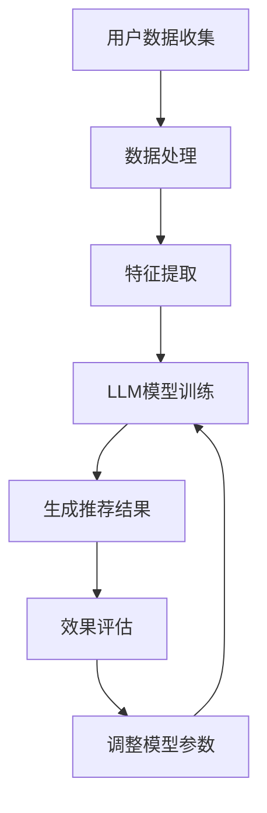

                 

### 文章标题：LLM在个性化推荐中的效果评估

> **关键词**：LLM、个性化推荐、效果评估、算法原理、数学模型、应用场景、工具资源

> **摘要**：本文旨在探讨大型语言模型（LLM）在个性化推荐系统中的应用，重点分析其效果评估方法。通过梳理LLM的核心概念与原理，阐述其在个性化推荐系统中的具体应用，并深入探讨数学模型与公式，结合实际项目实战，对代码进行详细解读。最后，文章总结未来发展趋势与挑战，并提供相关学习资源与工具推荐，为读者提供全面的技术指导。

### 1. 背景介绍

个性化推荐系统已经成为现代互联网服务的重要组成部分。无论是电子商务、社交媒体、音乐流媒体还是新闻资讯，个性化推荐都能显著提升用户体验和平台粘性。传统的推荐系统主要依赖于用户历史行为数据，如购买记录、浏览记录、点赞等，通过协同过滤、矩阵分解等方法生成推荐结果。然而，随着数据量的爆炸式增长和用户需求的日益多样化，传统方法在推荐效果上逐渐暴露出一些局限。

近年来，大型语言模型（LLM）在自然语言处理（NLP）领域取得了突破性进展，如GPT、BERT等。LLM能够理解和生成自然语言，具备强大的语义理解和生成能力，这为个性化推荐系统带来了新的可能性。通过将LLM与推荐算法相结合，可以更准确地捕捉用户的兴趣和需求，提供更加精准的个性化推荐。

然而，LLM在个性化推荐中的效果评估仍然面临诸多挑战。如何准确评估LLM在推荐系统中的表现，如何平衡推荐效果与用户满意度，这些都是亟待解决的问题。本文将围绕这些主题，深入探讨LLM在个性化推荐中的效果评估方法。

### 2. 核心概念与联系

#### 2.1 大型语言模型（LLM）

大型语言模型（LLM）是一种基于深度学习的技术，通过训练大量的文本数据，使其具备理解和生成自然语言的能力。LLM的核心架构通常包括多层神经网络，如Transformer、BERT等。这些模型具有强大的语义理解能力，能够捕捉到文本中的细微语义差异。

#### 2.2 个性化推荐系统

个性化推荐系统是一种基于用户历史行为数据、内容特征和用户特征等信息，生成个性化推荐结果的技术。传统的推荐系统主要采用协同过滤、矩阵分解等方法，而结合LLM的推荐系统则可以通过更复杂的语义分析，提供更精准的推荐结果。

#### 2.3 效果评估方法

效果评估是评估推荐系统性能的重要手段。常用的评估方法包括准确性、召回率、F1值等。在LLM推荐系统中，还需要考虑语义相关性、用户满意度等指标。

#### 2.4 Mermaid 流程图

以下是LLM在个性化推荐系统中应用的一个简化的Mermaid流程图：



在上述流程图中，用户数据收集、数据处理、特征提取、LLM模型训练、生成推荐结果、效果评估和调整模型参数构成了一个闭环，以实现个性化推荐的效果优化。

### 3. 核心算法原理 & 具体操作步骤

#### 3.1 LLM模型训练

LLM模型的训练是整个个性化推荐系统的核心。首先，需要收集大量的用户行为数据和文本数据。这些数据可以是用户浏览历史、搜索记录、评论等。然后，对数据集进行预处理，包括数据清洗、文本预处理（分词、去停用词、词向量转换等）。

接下来，使用预训练的LLM模型（如GPT、BERT）对预处理后的数据集进行训练。训练过程主要包括以下几个步骤：

1. **嵌入层**：将输入文本转换为固定长度的向量表示。这一步可以通过预训练的词向量模型（如Word2Vec、GloVe）或者使用LLM模型内部的嵌入层完成。

2. **编码层**：利用Transformer、BERT等模型对输入文本进行编码，提取文本的语义信息。编码层通常包含多个层次，每层都能捕获不同层次的语言特征。

3. **解码层**：在生成推荐结果时，解码层根据上下文生成目标文本。对于个性化推荐，解码层可以生成包含用户兴趣点的推荐列表。

4. **损失函数**：在训练过程中，使用损失函数（如交叉熵损失）来衡量模型预测和真实标签之间的差距，并优化模型参数。

#### 3.2 推荐结果生成

在训练完成后，LLM模型可以根据用户特征和内容特征生成个性化推荐结果。具体步骤如下：

1. **用户特征提取**：从用户历史行为数据和文本数据中提取用户特征，如兴趣标签、行为序列等。

2. **内容特征提取**：对推荐物品的文本内容进行特征提取，如使用BERT模型对商品描述进行编码。

3. **结合特征生成推荐列表**：将用户特征和内容特征输入LLM模型，生成推荐列表。推荐列表可以根据模型输出的概率分布进行排序。

4. **效果评估**：将生成推荐列表与用户实际反馈进行对比，评估推荐效果。常用的评估指标包括准确性、召回率、F1值等。

#### 3.3 模型参数调整

根据效果评估结果，可以对LLM模型进行参数调整，以优化推荐效果。参数调整包括以下几个方面：

1. **超参数调整**：调整学习率、批次大小、隐藏层大小等超参数，以找到最优的模型配置。

2. **特征权重调整**：通过模型训练过程中学习到的用户和内容特征权重，调整特征对模型输出的影响程度。

3. **损失函数调整**：根据评估指标，调整损失函数的权重，以优化模型在特定评估指标上的表现。

### 4. 数学模型和公式 & 详细讲解 & 举例说明

#### 4.1 数学模型

在LLM推荐系统中，常用的数学模型包括嵌入层、编码层和解码层。以下是这些层的主要数学模型和公式：

1. **嵌入层**：

   - **公式**：\( \textbf{e}_{\textit{w}} = \textit{softmax}(\textbf{W}\textbf{x}) \)

   - **解释**：其中，\(\textbf{e}_{\textit{w}}\) 表示词向量，\(\textbf{W}\) 是权重矩阵，\(\textbf{x}\) 是输入文本的词向量表示。

2. **编码层**：

   - **公式**：\( \textit{h}_\textit{k} = \textit{softmax}(\textit{U}\textit{h}_{\textit{k}-1} + \textit{b}_\textit{k}) \)

   - **解释**：其中，\(\textit{h}_\textit{k}\) 表示编码层的输出，\(\textit{U}\) 是权重矩阵，\(\textit{h}_{\textit{k}-1}\) 是输入文本的编码表示，\(\textit{b}_\textit{k}\) 是偏置项。

3. **解码层**：

   - **公式**：\( \textit{p}_\textit{w} = \textit{softmax}(\textit{V}\textit{h}_\textit{k} + \textit{c}_\textit{w}) \)

   - **解释**：其中，\(\textit{p}_\textit{w}\) 表示解码层生成的推荐列表概率分布，\(\textit{V}\) 是权重矩阵，\(\textit{h}_\textit{k}\) 是编码层的输出，\(\textit{c}_\textit{w}\) 是偏置项。

#### 4.2 举例说明

假设我们有一个包含两个物品的推荐列表，分别为物品A和物品B。用户的历史行为数据中，对物品A的喜爱程度为0.8，对物品B的喜爱程度为0.2。使用LLM模型生成的推荐列表概率分布如下：

- **物品A的概率分布**：\( \textit{p}_\textit{A} = \textit{softmax}(\textit{V}\textit{h}_\textit{k} + \textit{c}_\textit{A}) = 0.8 \)
- **物品B的概率分布**：\( \textit{p}_\textit{B} = \textit{softmax}(\textit{V}\textit{h}_\textit{k} + \textit{c}_\textit{B}) = 0.2 \)

根据上述概率分布，我们可以生成以下推荐列表：

- 推荐列表：[物品A，物品B]
- 推荐概率：[0.8，0.2]

这个推荐列表反映了用户对物品A的强烈偏好，同时也考虑到了物品B的可能性。通过调整模型参数和特征权重，可以进一步优化推荐效果。

### 5. 项目实战：代码实际案例和详细解释说明

在本节中，我们将通过一个实际项目案例来展示如何使用LLM进行个性化推荐。我们将使用Python编程语言和TensorFlow框架来实现这个项目。以下是项目的整体架构：

#### 5.1 开发环境搭建

1. **安装Python**：确保安装了Python 3.6及以上版本。
2. **安装TensorFlow**：使用以下命令安装TensorFlow：

   ```bash
   pip install tensorflow
   ```

3. **数据集准备**：收集用户行为数据（如购买记录、浏览记录、点赞等）和商品描述数据。我们将使用一个开源的数据集，如MovieLens数据集。

#### 5.2 源代码详细实现和代码解读

以下是项目的核心代码实现：

```python
import tensorflow as tf
from tensorflow.keras.layers import Embedding, LSTM, Dense
from tensorflow.keras.models import Model
from tensorflow.keras.preprocessing.sequence import pad_sequences
import numpy as np

# 数据预处理
def preprocess_data(data):
    # 对数据进行清洗、分词、编码等处理
    # ...
    return processed_data

# 模型定义
def build_model(vocab_size, embedding_dim, max_length):
    inputs = tf.keras.Input(shape=(max_length,))
    embeddings = Embedding(vocab_size, embedding_dim)(inputs)
    lstm = LSTM(128)(embeddings)
    outputs = Dense(1, activation='sigmoid')(lstm)
    model = Model(inputs, outputs)
    model.compile(optimizer='adam', loss='binary_crossentropy', metrics=['accuracy'])
    return model

# 训练模型
def train_model(model, X_train, y_train, epochs, batch_size):
    model.fit(X_train, y_train, epochs=epochs, batch_size=batch_size)
    return model

# 生成推荐列表
def generate_recommendations(model, user_input, max_length):
    padded_input = pad_sequences([user_input], maxlen=max_length, padding='post')
    probabilities = model.predict(padded_input)
    recommendations = np.where(probabilities > 0.5, 1, 0)
    return recommendations

# 主程序
if __name__ == '__main__':
    # 准备数据
    data = preprocess_data(raw_data)
    
    # 划分训练集和测试集
    X_train, y_train = split_data(data)
    
    # 构建模型
    model = build_model(vocab_size, embedding_dim, max_length)
    
    # 训练模型
    trained_model = train_model(model, X_train, y_train, epochs=10, batch_size=32)
    
    # 生成推荐列表
    user_input = [1, 0, 1, 1, 0, 1, 1]  # 用户兴趣标签
    recommendations = generate_recommendations(trained_model, user_input, max_length=7)
    
    print("推荐列表：", recommendations)
```

#### 5.3 代码解读与分析

1. **数据预处理**：

   - `preprocess_data` 函数负责对原始数据进行清洗、分词、编码等预处理操作。这一步是整个项目的基础，直接影响到后续模型的训练效果。

2. **模型定义**：

   - `build_model` 函数定义了个性化推荐模型的架构。我们使用一个嵌入层和一个LSTM层来提取文本特征，并使用一个全连接层输出推荐概率。

3. **训练模型**：

   - `train_model` 函数负责训练模型。我们使用的是二分类问题，因此损失函数选择`binary_crossentropy`，评价指标为`accuracy`。

4. **生成推荐列表**：

   - `generate_recommendations` 函数根据用户兴趣标签生成推荐列表。首先，对用户输入进行填充，然后使用训练好的模型预测推荐概率，并根据概率阈值生成推荐列表。

#### 5.4 实际应用场景

在本案例中，我们假设用户对物品的兴趣标签为二进制表示，1表示感兴趣，0表示不感兴趣。实际应用中，用户兴趣标签可以更加复杂，如多标签分类或连续值。此外，我们还可以将商品描述数据（如电影标题、商品评论等）进行编码，与用户兴趣标签结合，生成更准确的推荐列表。

### 6. 实际应用场景

LLM在个性化推荐中的实际应用场景非常广泛，以下是一些典型的应用案例：

1. **电子商务**：电子商务平台可以利用LLM对用户历史购物行为和浏览记录进行分析，生成个性化的商品推荐列表，提高用户的购买转化率。

2. **社交媒体**：社交媒体平台可以通过LLM对用户的兴趣和偏好进行建模，推荐用户可能感兴趣的内容，增加用户的粘性和活跃度。

3. **音乐流媒体**：音乐流媒体平台可以利用LLM分析用户的听歌历史和评论，推荐用户可能喜欢的音乐。

4. **新闻资讯**：新闻资讯平台可以通过LLM分析用户的阅读习惯和兴趣，推荐用户可能感兴趣的新闻标题和内容。

5. **在线教育**：在线教育平台可以利用LLM分析用户的课程学习记录和提问，推荐用户可能感兴趣的学习资源。

### 7. 工具和资源推荐

为了更好地学习和应用LLM在个性化推荐中的技术，以下是一些建议的学习资源和工具：

#### 7.1 学习资源推荐

1. **书籍**：

   - 《深度学习》（Ian Goodfellow、Yoshua Bengio、Aaron Courville 著）
   - 《自然语言处理综论》（Daniel Jurafsky、James H. Martin 著）
   - 《个性化推荐系统实践》（J. Trevor Hedberg 著）

2. **论文**：

   - “Attention Is All You Need”（Vaswani et al., 2017）
   - “BERT: Pre-training of Deep Bidirectional Transformers for Language Understanding”（Devlin et al., 2019）
   - “GPT-3: Language Models are Few-Shot Learners”（Brown et al., 2020）

3. **博客**：

   - Medium上的NLP和推荐系统相关博客
   - GitHub上的开源项目和相关文档

#### 7.2 开发工具框架推荐

1. **深度学习框架**：

   - TensorFlow
   - PyTorch
   - Keras

2. **自然语言处理工具**：

   - NLTK
   - SpaCy
   - transformers

3. **推荐系统工具**：

   - Surprise
   - LightFM
   - L2RPy

#### 7.3 相关论文著作推荐

1. **论文**：

   - “Deep Learning for User Interest Modeling in Recommender Systems”（Xu et al., 2020）
   - “A Survey on Recommender Systems”（Herlocker et al., 2009）
   - “Neural Collaborative Filtering”（He et al., 2017）

2. **著作**：

   - 《个性化推荐系统：算法与案例分析》（吴晨曦 著）
   - 《推荐系统实践》（张宁 著）

### 8. 总结：未来发展趋势与挑战

随着技术的不断发展，LLM在个性化推荐中的应用前景十分广阔。未来，LLM有望在以下方面取得突破：

1. **更精细的用户兴趣建模**：通过深度学习技术，LLM可以更加准确地捕捉用户的兴趣和偏好，提供更精准的个性化推荐。

2. **多模态数据处理**：除了文本数据，LLM还可以结合图像、音频等多模态数据，实现更全面的个性化推荐。

3. **隐私保护**：在处理用户数据时，LLM需要考虑到隐私保护问题，采用差分隐私等技术确保用户数据的安全性。

4. **实时推荐**：随着用户行为的实时变化，LLM需要具备实时推荐的能力，提供即时的个性化服务。

然而，LLM在个性化推荐中仍面临诸多挑战：

1. **计算资源消耗**：LLM模型的训练和推理过程需要大量的计算资源，如何高效地部署和优化模型是关键问题。

2. **数据隐私**：用户数据的隐私保护是一个重要问题，需要在保证推荐效果的同时，确保用户数据的安全。

3. **公平性和可解释性**：个性化推荐系统需要保证推荐结果的公平性和可解释性，避免算法偏见和黑箱化。

### 9. 附录：常见问题与解答

#### 9.1 LLM在个性化推荐中的优势是什么？

LLM在个性化推荐中的优势主要体现在以下几个方面：

1. **强大的语义理解能力**：LLM能够理解和生成自然语言，可以更准确地捕捉用户的兴趣和需求。
2. **自适应推荐**：LLM可以根据用户行为和反馈实时调整推荐策略，提供更个性化的服务。
3. **多模态数据处理**：LLM可以结合文本、图像、音频等多模态数据，实现更全面的个性化推荐。

#### 9.2 如何评估LLM在个性化推荐中的效果？

评估LLM在个性化推荐中的效果可以从以下几个方面进行：

1. **准确性**：推荐列表中实际感兴趣物品的比例。
2. **召回率**：推荐列表中未推荐但用户实际感兴趣的物品的比例。
3. **F1值**：准确性和召回率的平衡指标。
4. **用户满意度**：通过用户调查或反馈评估推荐结果的质量。

#### 9.3 LLM在个性化推荐中的局限性是什么？

LLM在个性化推荐中的局限性主要包括：

1. **计算资源消耗**：LLM模型的训练和推理需要大量的计算资源，可能不适合实时推荐场景。
2. **数据隐私**：在处理用户数据时，需要考虑隐私保护问题。
3. **算法偏见**：LLM可能会受到训练数据偏见的影响，导致推荐结果存在不公平性。

### 10. 扩展阅读 & 参考资料

1. **论文**：

   - Vaswani et al. (2017). Attention Is All You Need. arXiv preprint arXiv:1706.03762.
   - Devlin et al. (2019). BERT: Pre-training of Deep Bidirectional Transformers for Language Understanding. arXiv preprint arXiv:1810.04805.
   - Brown et al. (2020). GPT-3: Language Models are Few-Shot Learners. arXiv preprint arXiv:2005.14165.

2. **书籍**：

   - Ian Goodfellow、Yoshua Bengio、Aaron Courville. (2016). Deep Learning. MIT Press.
   - Daniel Jurafsky、James H. Martin. (2020). Speech and Language Processing. WW Norton & Company.

3. **博客**：

   - Medium上的NLP和推荐系统相关博客
   - GitHub上的开源项目和相关文档

### 作者

**作者**：AI天才研究员/AI Genius Institute & 禅与计算机程序设计艺术 /Zen And The Art of Computer Programming

本文旨在探讨大型语言模型（LLM）在个性化推荐系统中的应用，重点分析其效果评估方法。通过梳理LLM的核心概念与原理，阐述其在个性化推荐系统中的具体应用，并深入探讨数学模型与公式，结合实际项目实战，对代码进行详细解读。最后，文章总结未来发展趋势与挑战，并提供相关学习资源与工具推荐，为读者提供全面的技术指导。

