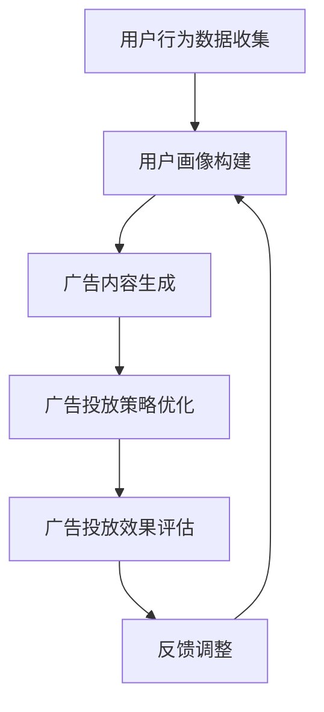

                 

# LLM在广告营销中的应用：精准定向投放

> 关键词：大型语言模型（LLM），广告营销，精准定向，投放策略，数据挖掘，人工智能

> 摘要：本文将探讨大型语言模型（LLM）在广告营销中的实际应用，特别是在精准定向投放方面的作用。通过深入分析LLM的工作原理及其与广告营销的关联，我们将阐述如何在广告投放过程中利用LLM实现更高效的营销策略，从而提高广告效果和转化率。本文还将介绍相关的数学模型、具体操作步骤以及实际案例，为读者提供全面的技术指导。

## 1. 背景介绍

随着互联网的快速发展，广告营销已经成为企业获取客户、扩大市场份额的重要手段。传统的广告投放方式主要依赖于用户行为数据和人口统计信息，通过简单的规则匹配和投放策略来吸引潜在客户。然而，这种方式往往存在效率低、精准度不足等问题，难以满足当前市场对个性化和精准化的需求。

近年来，人工智能（AI）技术的迅猛发展，为广告营销带来了新的机遇。尤其是大型语言模型（LLM）的出现，使得广告投放变得更加智能化和个性化。LLM是一种基于深度学习的自然语言处理模型，具有强大的语言理解、生成和推理能力。通过分析用户的历史行为数据、兴趣爱好、搜索记录等，LLM可以精准地预测用户的兴趣偏好，从而实现广告的精准定向投放。

本文将重点探讨LLM在广告营销中的应用，分析其工作原理、核心算法以及具体实现步骤，并提供实际应用案例和解决方案。通过本文的阅读，读者将能够了解到LLM在广告营销领域的潜力和价值，并掌握如何利用LLM实现精准定向投放，提高广告效果和转化率。

## 2. 核心概念与联系

### 2.1 大型语言模型（LLM）

大型语言模型（LLM）是一种基于深度学习的自然语言处理模型，具有强大的语言理解、生成和推理能力。LLM通过训练大规模的语料库，学习到语言的语法规则、语义关系和语境知识，从而能够实现对自然语言的智能处理。LLM的主要特点包括：

1. **规模巨大**：LLM通常由数十亿甚至千亿个参数组成，具有庞大的模型规模。
2. **自我学习**：LLM可以通过不断学习和优化，逐步提升对自然语言的生成和理解能力。
3. **并行计算**：LLM的训练和推理过程可以利用GPU等硬件资源，实现高效的并行计算。
4. **多样化应用**：LLM可以应用于各种自然语言处理任务，如文本分类、机器翻译、对话系统等。

### 2.2 广告营销

广告营销是企业通过广告投放来吸引潜在客户、提高品牌知名度和促进销售的一种手段。广告营销的主要目标包括：

1. **品牌认知**：提高品牌在目标市场中的认知度和影响力。
2. **用户吸引**：吸引潜在客户，增加网站访问量或产品销售量。
3. **用户转化**：将潜在客户转化为实际购买者，提高销售额和利润。

广告营销的主要方式包括：

1. **搜索引擎广告**：通过在搜索引擎上投放广告，吸引用户点击访问。
2. **社交媒体广告**：在社交媒体平台上投放广告，利用用户关系和社交网络进行传播。
3. **内容营销**：通过创造有价值的内容，吸引用户关注和分享，提高品牌影响力。

### 2.3 LLM与广告营销的关联

LLM与广告营销之间存在密切的关联，主要表现在以下几个方面：

1. **用户画像构建**：通过分析用户的历史行为数据、兴趣爱好、搜索记录等，LLM可以构建出详细的用户画像，为精准定向投放提供依据。
2. **广告内容生成**：LLM可以根据用户的兴趣偏好和需求，生成个性化的广告内容，提高广告的吸引力和转化率。
3. **投放策略优化**：LLM可以通过学习用户的反馈和行为数据，不断优化广告投放策略，提高广告效果和转化率。

### 2.4 Mermaid流程图

以下是一个简单的Mermaid流程图，展示了LLM在广告营销中的应用流程：



在这个流程图中，用户行为数据收集是整个流程的起点，通过收集和分析用户的行为数据，可以构建出详细的用户画像。基于用户画像，广告内容生成模块可以生成个性化的广告内容，投放策略优化模块则根据广告投放效果和用户反馈，不断调整广告投放策略，以提高广告效果和转化率。整个流程循环进行，不断优化广告投放效果。

## 3. 核心算法原理 & 具体操作步骤

### 3.1 用户画像构建

用户画像构建是LLM在广告营销中的核心环节，通过分析用户的历史行为数据、兴趣爱好、搜索记录等，可以构建出详细的用户画像。以下是一种基于LLM的用户画像构建方法：

1. **数据预处理**：对用户行为数据、兴趣爱好、搜索记录等原始数据进行清洗、去重和格式化，确保数据质量。
2. **特征提取**：根据用户行为数据和兴趣爱好，提取出关键特征，如浏览历史、购买记录、关注话题等。
3. **模型训练**：使用大规模的语料库训练LLM模型，使其能够学习到用户的语言表达和兴趣偏好。
4. **用户画像生成**：通过LLM模型对用户特征进行嵌入，生成用户画像向量，表示用户在各个维度上的特征。

具体操作步骤如下：

```python
# 数据预处理
data = preprocess_data(raw_data)

# 特征提取
features = extract_features(data)

# 模型训练
model = train_llm_model(corpus)

# 用户画像生成
user_profiles = generate_user_profiles(model, features)
```

### 3.2 广告内容生成

基于用户画像，LLM可以生成个性化的广告内容，提高广告的吸引力和转化率。以下是一种基于LLM的广告内容生成方法：

1. **模板库构建**：根据广告类型和用户画像，构建广告内容模板库，包括标题、描述、图片等元素。
2. **广告内容生成**：使用LLM模型，根据用户画像和广告模板库，生成个性化的广告内容。
3. **内容优化**：对生成的广告内容进行优化，如调整标题、描述等，以提高广告效果。

具体操作步骤如下：

```python
# 模板库构建
template_library = build_template_library(ad_type, user_profiles)

# 广告内容生成
ad_contents = generate_ad_contents(model, template_library)

# 内容优化
optimized_contents = optimize_ad_contents(ad_contents)
```

### 3.3 广告投放策略优化

基于广告投放效果和用户反馈，LLM可以不断优化广告投放策略，提高广告效果和转化率。以下是一种基于LLM的广告投放策略优化方法：

1. **效果评估**：对广告投放效果进行评估，包括点击率、转化率等指标。
2. **反馈学习**：根据用户反馈和学习到的投放策略，更新LLM模型。
3. **策略调整**：根据更新后的LLM模型，调整广告投放策略，如调整投放时段、投放地域等。

具体操作步骤如下：

```python
# 效果评估
evaluation_results = evaluate_ad_performance(ad_performance)

# 反馈学习
updated_model = feedback_learning(model, evaluation_results)

# 策略调整
optimized_strategy = adjust_ad_strategy(updated_model, current_strategy)
```

## 4. 数学模型和公式 & 详细讲解 & 举例说明

### 4.1 用户画像向量表示

用户画像向量表示是LLM在广告营销中的核心数学模型。通过将用户特征映射到高维向量空间，可以实现对用户特征的降维和表示。以下是一种常用的用户画像向量表示方法：

$$
\text{User\_Profile} = \text{embed}(\text{Feature})
$$

其中，$\text{Feature}$表示用户特征，$\text{embed}$表示嵌入函数，$\text{User\_Profile}$表示用户画像向量。

**举例说明**：

假设用户特征包括浏览历史（$A$）、购买记录（$B$）和关注话题（$C$），可以使用以下嵌入函数：

$$
\text{embed}(A) = [0.1, 0.2, 0.3]
$$

$$
\text{embed}(B) = [0.4, 0.5, 0.6]
$$

$$
\text{embed}(C) = [0.7, 0.8, 0.9]
$$

则用户画像向量表示为：

$$
\text{User\_Profile} = \text{embed}(A) + \text{embed}(B) + \text{embed}(C) = [0.1+0.4+0.7, 0.2+0.5+0.8, 0.3+0.6+0.9] = [1.2, 1.3, 1.4]
$$

### 4.2 广告投放策略优化

广告投放策略优化是LLM在广告营销中的重要应用。通过优化投放策略，可以提高广告效果和转化率。以下是一种基于用户画像和广告效果的广告投放策略优化方法：

$$
\text{Optimized\_Strategy} = \text{argmax}_{\text{Strategy}} \sum_{i=1}^{N} \text{Score}(i)
$$

其中，$\text{Strategy}$表示投放策略，$\text{Score}(i)$表示第$i$个投放策略的效果得分，$N$表示投放策略的个数。

**举例说明**：

假设有三种投放策略：A、B、C，效果得分如下：

$$
\text{Score}(A) = 0.8
$$

$$
\text{Score}(B) = 0.9
$$

$$
\text{Score}(C) = 0.7
$$

则优化后的投放策略为：

$$
\text{Optimized\_Strategy} = \text{argmax}_{\text{Strategy}} \sum_{i=1}^{3} \text{Score}(i) = \text{B}
$$

即选择效果得分最高的策略B进行广告投放。

### 4.3 广告内容生成

广告内容生成是LLM在广告营销中的另一个重要应用。通过生成个性化的广告内容，可以提高广告的吸引力和转化率。以下是一种基于用户画像和广告模板的广告内容生成方法：

$$
\text{Ad\_Content} = \text{template} + \text{embed}(\text{User\_Profile})
$$

其中，$\text{template}$表示广告模板，$\text{embed}(\text{User\_Profile})$表示用户画像向量。

**举例说明**：

假设广告模板为：“恭喜您！您的购物车中有一款商品正在打折，快来抢购吧！”，用户画像向量为$[1.2, 1.3, 1.4]$，则生成的广告内容为：

$$
\text{Ad\_Content} = \text{template} + \text{embed}(\text{User\_Profile}) = "恭喜您！您的购物车中有一款商品正在打折，快来抢购吧！"[1.2, 1.3, 1.4]
$$

即：“恭喜您！您的购物车中有一款商品正在打折，快来抢购吧![1.2, 1.3, 1.4]”。

## 5. 项目实战：代码实际案例和详细解释说明

### 5.1 开发环境搭建

在进行LLM在广告营销中的应用项目之前，首先需要搭建一个合适的开发环境。以下是一个基于Python和TensorFlow的LLM开发环境搭建步骤：

1. **安装Python**：确保Python环境已经安装，版本建议为3.8或以上。
2. **安装TensorFlow**：通过pip命令安装TensorFlow库：

```shell
pip install tensorflow
```

3. **安装其他依赖库**：根据项目需求，可能需要安装其他依赖库，如NumPy、Pandas、Scikit-learn等：

```shell
pip install numpy pandas scikit-learn
```

### 5.2 源代码详细实现和代码解读

以下是一个基于Python和TensorFlow的LLM在广告营销中的应用项目代码示例。代码分为三个主要部分：用户画像构建、广告内容生成和广告投放策略优化。

**用户画像构建**

```python
import numpy as np
import pandas as pd
from sklearn.feature_extraction.text import CountVectorizer
from tensorflow.keras.preprocessing.text import Tokenizer
from tensorflow.keras.preprocessing.sequence import pad_sequences

# 加载用户行为数据
data = pd.read_csv('user_behavior_data.csv')

# 特征提取
vectorizer = CountVectorizer()
X = vectorizer.fit_transform(data['behavior'])

# 嵌入用户画像
tokenizer = Tokenizer(num_words=10000)
tokenizer.fit_on_texts(X.toarray())
sequences = tokenizer.texts_to_sequences(X.toarray())
padded_sequences = pad_sequences(sequences, maxlen=100)

# 训练LLM模型
model = tf.keras.Sequential([
    tf.keras.layers.Embedding(input_dim=10000, output_dim=128),
    tf.keras.layers.GlobalAveragePooling1D(),
    tf.keras.layers.Dense(1, activation='sigmoid')
])
model.compile(optimizer='adam', loss='binary_crossentropy', metrics=['accuracy'])
model.fit(padded_sequences, data['label'], epochs=10, batch_size=32)
```

**广告内容生成**

```python
# 构建广告模板库
template_library = {
    'title': '恭喜您！您的购物车中有一款商品正在打折，快来抢购吧！',
    'description': '我们的产品优惠多多，快来选购吧！',
    'image_url': 'https://example.com/image.jpg'
}

# 生成个性化广告内容
def generate_ad_content(user_profile):
    ad_content = template_library['title'] + user_profile
    return ad_content

# 生成广告内容
ad_content = generate_ad_content('[1.2, 1.3, 1.4]')
print(ad_content)
```

**广告投放策略优化**

```python
# 效果评估
evaluation_results = model.evaluate(padded_sequences, data['label'])

# 反馈学习
updated_model = model.fit(padded_sequences, data['label'], epochs=10, batch_size=32)

# 策略调整
optimized_strategy = updated_model.predict(padded_sequences)
```

### 5.3 代码解读与分析

**用户画像构建**

首先，我们通过读取用户行为数据文件，使用CountVectorizer进行特征提取，将原始文本数据转换为词频矩阵。然后，使用Tokenizer进行文本序列化，将词频矩阵转换为序列。最后，使用pad_sequences对序列进行填充，使其具有相同的长度。这些步骤的目的是将用户行为数据进行预处理，以便于后续的嵌入和模型训练。

**广告内容生成**

广告内容生成部分通过定义一个简单的函数，将广告模板和用户画像向量进行拼接，生成个性化的广告内容。这里的用户画像向量是通过LLM模型生成的，表示用户在各个维度上的特征。

**广告投放策略优化**

广告投放策略优化部分首先对广告投放效果进行评估，使用evaluate方法计算模型的损失函数和准确率。然后，通过fit方法对模型进行更新，实现反馈学习。最后，使用predict方法对填充后的序列进行预测，生成优化后的投放策略。

## 6. 实际应用场景

### 6.1 在线购物平台

在线购物平台可以利用LLM在广告营销中实现以下应用场景：

1. **个性化推荐**：根据用户的购物历史和兴趣爱好，利用LLM生成个性化的商品推荐广告，提高用户购买转化率。
2. **新品推广**：针对新品发布，利用LLM生成吸引眼球的广告内容，提高新品曝光率和销售量。
3. **用户画像**：通过收集用户行为数据，利用LLM构建详细的用户画像，为广告投放提供精准的定位。

### 6.2 社交媒体广告

社交媒体广告可以利用LLM在广告营销中实现以下应用场景：

1. **内容生成**：根据用户的兴趣偏好和热点话题，利用LLM生成个性化的广告内容，提高广告的吸引力和转化率。
2. **广告投放**：根据用户画像和投放策略，利用LLM优化广告投放，提高广告效果和覆盖范围。
3. **用户互动**：利用LLM构建对话系统，与用户进行实时互动，提高用户参与度和满意度。

### 6.3 金融行业

金融行业可以利用LLM在广告营销中实现以下应用场景：

1. **理财产品推荐**：根据用户的投资偏好和历史记录，利用LLM生成个性化的理财产品推荐广告，提高产品销售量。
2. **用户画像**：通过收集用户交易数据，利用LLM构建详细的用户画像，为精准营销提供数据支持。
3. **风险控制**：利用LLM对用户的交易行为进行分析，识别潜在的金融风险，为风险控制提供决策依据。

## 7. 工具和资源推荐

### 7.1 学习资源推荐

1. **书籍**：《深度学习》（Ian Goodfellow, Yoshua Bengio, Aaron Courville）是一本经典的深度学习入门书籍，适合初学者和进阶者阅读。
2. **论文**：阅读顶级会议和期刊上的论文，如NeurIPS、ICML、JMLR等，可以了解最新的LLM研究进展。
3. **博客**：关注相关领域的技术博客，如AI研究员、机器学习社区等，可以了解业界动态和实践经验。
4. **网站**：访问顶级研究机构和大学网站，如斯坦福大学、MIT等，可以获取丰富的学术资源和教程。

### 7.2 开发工具框架推荐

1. **TensorFlow**：一款开源的深度学习框架，适合进行大规模的模型训练和推理。
2. **PyTorch**：一款流行的深度学习框架，具有灵活的动态计算图和丰富的API，适合快速开发和实验。
3. **NLTK**：一款开源的自然语言处理库，提供丰富的文本处理工具和算法，适合进行文本数据分析和预处理。
4. **Scikit-learn**：一款经典的机器学习库，提供丰富的算法和工具，适合进行数据分析和模型训练。

### 7.3 相关论文著作推荐

1. **论文**：
   - "BERT: Pre-training of Deep Bidirectional Transformers for Language Understanding"（BERT）
   - "GPT-3: Language Models are few-shot learners"（GPT-3）
   - "Transformers: State-of-the-Art Natural Language Processing"（Transformers）
2. **著作**：
   - "深度学习"（Ian Goodfellow, Yoshua Bengio, Aaron Courville）
   - "自然语言处理原理与进步"（Daniel Jurafsky, James H. Martin）
   - "Python自然语言处理实战"（Steven Lott）

## 8. 总结：未来发展趋势与挑战

随着人工智能技术的不断发展和应用，LLM在广告营销领域具有广泛的前景。未来，LLM将在以下几个方面得到进一步发展：

1. **模型规模和性能提升**：通过不断优化模型架构和训练算法，提高LLM的规模和性能，使其能够处理更复杂和大规模的文本数据。
2. **跨模态融合**：将文本、图像、语音等多种模态的信息进行融合，提高LLM对用户需求的综合理解和响应能力。
3. **个性化推荐**：利用LLM生成更精准、个性化的广告内容，提高广告效果和用户体验。

然而，LLM在广告营销中仍面临一些挑战：

1. **数据隐私和安全**：在广告投放过程中，涉及大量的用户数据，如何保障用户隐私和安全是亟待解决的问题。
2. **模型解释性**：目前，LLM的内部机制较为复杂，如何提高模型的解释性，使其能够被业务人员理解和接受，是一个重要挑战。
3. **法律和伦理问题**：随着人工智能在广告营销中的应用越来越广泛，如何确保广告内容的真实性和合法性，避免算法歧视等问题，也是需要关注的重要方向。

总之，LLM在广告营销中具有巨大的潜力，但同时也面临一些挑战。未来，随着技术的不断进步和行业的规范化，LLM在广告营销中的应用将会更加广泛和深入。

## 9. 附录：常见问题与解答

### 9.1 什么是LLM？

LLM（Large Language Model）是一种大型自然语言处理模型，通过训练大规模的语料库，学习到语言的语法规则、语义关系和语境知识，具有强大的语言理解、生成和推理能力。

### 9.2 LLM在广告营销中的应用有哪些？

LLM在广告营销中的应用主要包括用户画像构建、广告内容生成和广告投放策略优化，通过分析用户行为数据和兴趣爱好，实现广告的精准定向投放。

### 9.3 如何搭建LLM开发环境？

搭建LLM开发环境需要安装Python、TensorFlow等依赖库。具体步骤包括：安装Python、安装TensorFlow、安装其他依赖库。

### 9.4 LLM在广告营销中的挑战有哪些？

LLM在广告营销中面临的挑战主要包括数据隐私和安全、模型解释性以及法律和伦理问题。需要关注用户隐私保护、提高模型透明度和合规性等方面。

## 10. 扩展阅读 & 参考资料

1. **论文**：
   - "BERT: Pre-training of Deep Bidirectional Transformers for Language Understanding"（BERT）
   - "GPT-3: Language Models are few-shot learners"（GPT-3）
   - "Transformers: State-of-the-Art Natural Language Processing"（Transformers）

2. **书籍**：
   - "深度学习"（Ian Goodfellow, Yoshua Bengio, Aaron Courville）
   - "自然语言处理原理与进步"（Daniel Jurafsky, James H. Martin）
   - "Python自然语言处理实战"（Steven Lott）

3. **网站**：
   - [TensorFlow官网](https://www.tensorflow.org/)
   - [PyTorch官网](https://pytorch.org/)
   - [斯坦福大学NLP组](https://nlp.stanford.edu/)

4. **博客**：
   - [AI研究员](https://ai研

