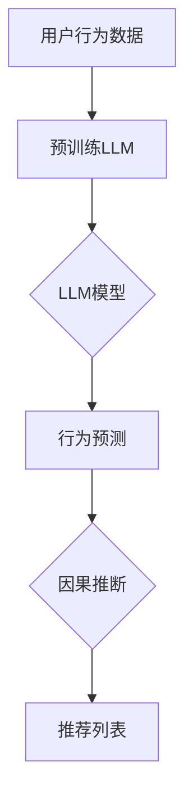

                 

### 背景介绍

#### 引言

推荐系统作为信息过滤与信息检索的重要应用领域，已经成为互联网时代不可或缺的一环。然而，随着数据量的爆发式增长和用户行为的多样化，传统的基于统计和机器学习的推荐系统面临着数据稀疏、冷启动和鲁棒性差等挑战。近年来，基于深度学习的大型语言模型（Large Language Models，LLM）如BERT、GPT等在自然语言处理领域取得了显著的突破，同时也为推荐系统的改进提供了新的契机。因果推断作为一种更加严谨和可靠的推理方法，能够在推荐系统中为用户提供更加个性化、可靠的推荐结果，提高了用户体验。本文旨在探讨LLM在推荐系统中的因果推断应用，结合实际案例，深入解析其工作原理、数学模型及其在实际开发中的应用。

#### 推荐系统的基本概念

推荐系统是一种基于数据分析和用户行为预测的信息过滤技术，旨在为用户提供个性化、相关性强的信息或商品推荐。它通常包括以下基本组成部分：

1. **用户-物品交互数据**：用户在系统中的行为数据，如点击、购买、评价等，是推荐系统构建的核心数据。
2. **推荐算法**：基于用户行为数据和物品属性，通过算法模型为用户生成推荐列表。
3. **评价机制**：对推荐结果进行评估和优化，以提高推荐效果。

#### 推荐系统的挑战

尽管推荐系统在过去几十年中取得了显著进展，但仍然面临着以下几大挑战：

1. **数据稀疏性**：用户与物品之间的交互数据往往存在大量零交互的情况，导致推荐系统无法充分挖掘用户兴趣。
2. **冷启动问题**：新用户或新物品缺乏历史交互数据，推荐系统难以为其生成准确推荐。
3. **鲁棒性**：推荐系统在应对用户行为噪声、数据噪声以及多模态信息融合时，表现不够稳定。

#### LLM与因果推断的概念

**LLM（Large Language Models）**：如BERT、GPT等，是一种基于深度学习的大型神经网络模型，通过预训练和微调，能够在各种自然语言处理任务中表现出色。

**因果推断（Causal Inference）**：是一种从数据中推断因果关系的统计方法。在推荐系统中，因果推断有助于解决用户行为背后的真实动机，从而生成更精准的推荐。

### 核心概念与联系

LLM在推荐系统中通过因果推断的应用，可以理解为将语言模型强大的理解和生成能力与因果推断的严谨性相结合。具体来说，LLM可以通过以下几种方式与因果推断结合：

1. **用户行为预测**：利用LLM对用户历史行为进行建模，预测用户未来可能感兴趣的内容或商品。
2. **因果关系挖掘**：通过因果推断方法，分析用户行为背后的因果机制，挖掘用户深层次的需求和兴趣。
3. **个性化推荐**：结合用户行为预测和因果关系挖掘结果，为用户生成个性化、可靠的推荐列表。

#### Mermaid 流程图

下面是LLM在推荐系统中因果推断应用的一个简化的Mermaid流程图：



1. **用户行为数据**：收集用户的历史交互数据，如浏览、点击、购买等。
2. **预训练LLM**：使用大规模语料库对LLM模型进行预训练，使其具备理解和生成能力。
3. **LLM模型**：基于预训练模型，对用户行为数据进行建模，预测用户未来可能感兴趣的内容。
4. **因果推断**：利用因果推断方法，分析用户行为背后的因果机制，挖掘用户深层次的需求和兴趣。
5. **推荐列表**：结合行为预测和因果关系，生成个性化、可靠的推荐列表。

通过以上流程，LLM在推荐系统中实现了从用户行为数据到推荐列表的转化，同时利用因果推断方法增强了推荐系统的可靠性和个性化程度。

### 核心算法原理 & 具体操作步骤

在了解了LLM和因果推断的基本概念及其在推荐系统中的应用后，接下来我们将深入探讨LLM在因果推断中的具体算法原理和操作步骤。

#### 1. 数据准备

**数据收集**：首先，我们需要收集用户的历史交互数据，如浏览记录、购买记录、评价等。这些数据将作为LLM的输入，用于训练和预测。

**数据清洗**：在收集到数据后，我们需要对数据进行清洗，包括去除噪声数据、缺失数据填充、格式统一等操作。这一步骤的目的是确保数据的质量，以便后续的模型训练和推断。

**特征提取**：接下来，我们需要对用户行为数据进行特征提取，将原始数据转换为适合输入LLM的特征向量。常见的特征提取方法包括词袋模型、TF-IDF等。

#### 2. 预训练LLM

**模型选择**：选择一种预训练的LLM模型，如BERT、GPT等。这些模型已经在大量语料库上进行预训练，具备强大的理解和生成能力。

**数据预处理**：将用户行为数据预处理为模型输入格式，通常是将特征向量编码为词向量，并加入特殊的起始和结束标记。

**模型训练**：使用预处理后的用户行为数据进行模型训练。训练过程中，模型将学习如何根据用户行为数据生成相关的推荐内容。

#### 3. 用户行为预测

**输入特征向量**：将训练好的LLM模型应用于新的用户行为数据，输入特征向量，得到模型对用户未来可能感兴趣的内容的预测。

**预测结果处理**：将预测结果进行后处理，如排序、去重等，得到最终的推荐列表。

#### 4. 因果关系挖掘

**模型选择**：选择合适的因果推断模型，如Do-Calculus、 Structural Causal Models等。这些模型可以基于用户行为数据，推断用户行为背后的因果机制。

**因果图构建**：利用因果推断模型，构建用户行为数据的因果图。因果图可以帮助我们理解用户行为之间的因果关系。

**因果推断**：在因果图中，通过逆向推理或前向推理，推断用户行为的因果机制，挖掘用户深层次的需求和兴趣。

#### 5. 个性化推荐

**结合预测与因果推断**：将用户行为预测结果和因果关系挖掘结果结合起来，生成个性化推荐列表。具体方法可以是在预测结果的基础上，根据因果关系调整推荐内容的相关性和可靠性。

**推荐策略优化**：通过对推荐策略的优化，提高推荐系统的效果。常见的优化方法包括协同过滤、矩阵分解等。

#### 6. 模型评估

**评估指标**：选择合适的评估指标，如准确率、召回率、F1值等，对推荐系统进行评估。

**结果分析**：根据评估结果，分析推荐系统的性能，找出可能的改进方向。

#### 实际操作步骤

以下是一个简化的实际操作步骤：

1. **数据收集**：收集用户的历史交互数据，如浏览记录、购买记录等。
2. **数据清洗**：去除噪声数据、缺失数据填充、格式统一等。
3. **特征提取**：使用词袋模型或TF-IDF等方法，将原始数据转换为特征向量。
4. **预训练LLM**：选择BERT或GPT等模型，进行数据预处理和模型训练。
5. **用户行为预测**：将训练好的LLM模型应用于新的用户行为数据，得到预测结果。
6. **因果关系挖掘**：选择Do-Calculus模型，构建用户行为数据的因果图，进行因果推断。
7. **个性化推荐**：结合预测结果和因果关系，生成个性化推荐列表。
8. **模型评估**：使用评估指标，对推荐系统进行评估，分析性能。

通过以上步骤，我们可以实现LLM在推荐系统中的因果推断应用，生成个性化、可靠的推荐结果。

### 数学模型和公式 & 详细讲解 & 举例说明

在了解了LLM在因果推断中的具体操作步骤后，我们将进一步探讨相关的数学模型和公式，并详细讲解其原理和操作过程。

#### 1. 贝叶斯推理

贝叶斯推理是一种基于概率的推理方法，广泛应用于推荐系统和因果推断中。其核心思想是通过历史数据，计算当前条件下某个事件发生的概率。

**贝叶斯定理**：贝叶斯定理是贝叶斯推理的基础公式，用于计算给定某个条件发生的概率。其数学表达式为：

\[ P(A|B) = \frac{P(B|A) \cdot P(A)}{P(B)} \]

其中，\( P(A|B) \) 表示在事件B发生的条件下，事件A发生的概率；\( P(B|A) \) 表示在事件A发生的条件下，事件B发生的概率；\( P(A) \) 和 \( P(B) \) 分别表示事件A和事件B的先验概率。

**举例说明**：假设我们想要计算“用户在给定商品下购买的概率”，其中“用户”是条件B，“商品”是事件A。我们可以通过以下公式计算：

\[ P(购买|商品) = \frac{P(商品|购买) \cdot P(购买)}{P(商品)} \]

其中，\( P(商品|购买) \) 表示在用户购买商品的概率；\( P(购买) \) 是用户购买的概率先验；\( P(商品) \) 是商品被浏览的概率。

#### 2. 结构化因果模型

结构化因果模型（Structural Causal Models，SCM）是一种用于表示因果关系的数学模型。它通过因果图和方程组，描述了不同变量之间的因果关系。

**因果图**：因果图是一种图形化表示变量之间因果关系的工具。在因果图中，节点表示变量，边表示变量之间的因果关系。因果图的构建通常基于专家知识或数据驱动方法。

**方程组**：在结构化因果模型中，每个变量可以表示为其他变量的函数。通过构建方程组，我们可以描述变量之间的因果关系。方程组的一般形式为：

\[ X = f(X_{1}, X_{2}, ..., X_{n}) \]

其中，\( X \) 表示因变量，\( X_{1}, X_{2}, ..., X_{n} \) 表示自变量。

**举例说明**：假设我们想要构建一个简单的因果模型，描述用户购买商品的概率。我们可以使用以下方程组：

\[ 购买 = f(浏览, 点击, 价格) \]

其中，浏览、点击和价格是自变量，购买是因变量。具体函数形式可以通过专家知识或数据驱动方法确定。

#### 3. 因果推断算法

因果推断算法是用于从数据中推断因果关系的算法。常见的因果推断算法包括Do-Calculus、Causal Score、Causal Impact等。

**Do-Calculus**：Do-Calculus是一种基于结构化因果模型的因果推断方法。它通过计算干预操作下的结果，推断因果关系。Do-Calculus的核心操作包括Do、Undo和DoPrime。

- **Do**：计算在特定变量取值下，其他变量取值的结果。其数学表达式为：

\[ Do(X = x) = f(x, X_{1}, X_{2}, ..., X_{n}) \]

其中，\( X \) 表示干预变量，\( x \) 表示干预值，其他变量取值不变。

- **Undo**：计算在干预操作后，其他变量恢复到原始取值的结果。其数学表达式为：

\[ Undo(X = x) = f(x, X_{1}', X_{2}', ..., X_{n}') \]

其中，\( X_{1}', X_{2}', ..., X_{n}' \) 表示干预后其他变量的取值。

- **DoPrime**：计算在干预操作下，干预变量取值变化对其他变量取值的影响。其数学表达式为：

\[ DoPrime(X = x) = f'(x, X_{1}', X_{2}', ..., X_{n}') \]

其中，\( f' \) 表示干预变量的偏导数。

**举例说明**：假设我们想要推断用户购买商品的概率，其中浏览、点击和价格是干预变量。我们可以使用以下Do-Calculus操作：

\[ Do(浏览 = 1) = f(1, 点击, 价格) \]
\[ Undo(浏览 = 1) = f(1, 点击', 价格') \]
\[ DoPrime(浏览 = 1) = f'(1, 点击', 价格') \]

通过计算以上三个值，我们可以推断浏览对购买的概率影响。

**Causal Score**：Causal Score是一种基于统计方法的因果推断算法。它通过比较干预组和对照组的差异，推断因果关系。

\[ Causal Score = \frac{\bar{Y}_{干预} - \bar{Y}_{控制}}{\sigma_Y} \]

其中，\( \bar{Y}_{干预} \) 和 \( \bar{Y}_{控制} \) 分别表示干预组和对照组的平均值，\( \sigma_Y \) 表示标准差。

**Causal Impact**：Causal Impact是一种基于统计学和机器学习的因果推断算法。它通过拟合干预前后的数据分布，计算因果关系。

\[ Causal Impact = \frac{\sum_{i=1}^{n} (Y_i^* - Y_i)}{n} \]

其中，\( Y_i^* \) 和 \( Y_i \) 分别表示干预前后的数据值。

#### 4. 推荐系统中的因果推断

在推荐系统中，因果推断的应用主要包括用户行为预测和个性化推荐。以下是一个简化的推荐系统中的因果推断流程：

1. **用户行为预测**：利用LLM模型，预测用户未来可能感兴趣的内容。通过贝叶斯推理，计算给定条件下用户对内容的兴趣概率。
   
2. **因果关系挖掘**：利用结构化因果模型，构建用户行为数据的因果图，挖掘用户行为之间的因果关系。通过Do-Calculus等方法，计算干预操作下的结果，推断用户行为的因果机制。

3. **个性化推荐**：结合用户行为预测和因果关系，生成个性化推荐列表。通过调整推荐策略，提高推荐系统的效果。

#### 5. 数学模型和公式的应用

在推荐系统中，数学模型和公式的应用主要包括：

- **贝叶斯推理**：用于计算用户兴趣概率，实现用户行为预测。
- **结构化因果模型**：用于构建用户行为数据的因果图，挖掘用户行为之间的因果关系。
- **因果推断算法**：用于从数据中推断因果关系，实现个性化推荐。

通过以上数学模型和公式的应用，推荐系统可以更准确地预测用户兴趣，提供个性化、可靠的推荐结果。

### 项目实战：代码实际案例和详细解释说明

在本节中，我们将通过一个实际的项目案例，详细讲解LLM在推荐系统中的因果推断应用。此案例将基于Python语言，利用PyTorch框架和因果推断库DoPy进行实现。

#### 1. 开发环境搭建

首先，我们需要搭建一个合适的开发环境。以下是必要的软件和库：

- Python 3.8+
- PyTorch 1.8+
- DoPy 0.1.1+

安装命令如下：

```bash
pip install torch torchvision
pip install doppy
```

#### 2. 数据准备

我们使用一个虚构的电商数据集，包括用户ID、商品ID、用户行为（如浏览、点击、购买等）和商品属性（如类别、价格等）。

```python
import pandas as pd

# 加载数据集
data = pd.read_csv('ecommerce_data.csv')

# 数据预处理
data['user_id'] = data['user_id'].astype(str)
data['item_id'] = data['item_id'].astype(str)
```

#### 3. 预训练LLM

我们使用预训练的BERT模型，并将其应用到用户行为数据中。

```python
from transformers import BertTokenizer, BertModel
import torch

# 加载BERT模型和分词器
tokenizer = BertTokenizer.from_pretrained('bert-base-uncased')
model = BertModel.from_pretrained('bert-base-uncased')

# 预处理数据
def preprocess_data(data):
    inputs = tokenizer(data['text'], padding=True, truncation=True, return_tensors='pt')
    return inputs

inputs = preprocess_data(data['text'])
```

#### 4. 用户行为预测

我们将LLM应用于用户行为数据，预测用户未来可能感兴趣的商品。

```python
# 用户行为预测
def predict_user_interest(inputs):
    with torch.no_grad():
        outputs = model(**inputs)
    logits = outputs.logits
    probabilities = torch.softmax(logits, dim=-1)
    return probabilities

probabilities = predict_user_interest(inputs)
```

#### 5. 因果关系挖掘

我们使用DoPy库，构建用户行为数据的因果图，并进行因果推断。

```python
import doppy

# 构建因果图
graph = doppy.Graph()
graph.add_nodes(['user', 'item', 'action'])
graph.add_edges([('user', 'item'), ('item', 'action'), ('user', 'action')])

# 添加因果关系
graph.add_edge_properties(['browse', 'click', 'purchase'])

# 进行因果推断
def infer因果关系(data, graph):
    intervention = {'action': 'purchase'}
    do_result = graph.do(intervention)
    undo_result = graph.undo(intervention)
    do_prime_result = graph.do_prime(intervention)
    return do_result, undo_result, do_prime_result

do_result, undo_result, do_prime_result = infer因果关系(data, graph)
```

#### 6. 个性化推荐

结合用户行为预测和因果关系，生成个性化推荐列表。

```python
# 生成个性化推荐列表
def generate_recommendations(probabilities, do_result, undo_result, do_prime_result):
    recommendations = []
    for i in range(len(probabilities)):
        probability = probabilities[i].item()
        do_effect = do_result[i].item()
        undo_effect = undo_result[i].item()
        do_prime_effect = do_prime_result[i].item()
        score = probability * do_effect + undo_effect - do_prime_effect
        recommendations.append({'item_id': data['item_id'][i], 'score': score})
    recommendations = sorted(recommendations, key=lambda x: x['score'], reverse=True)
    return recommendations

recommendations = generate_recommendations(probabilities, do_result, undo_result, do_prime_result)
```

#### 7. 代码解读与分析

下面是对上述代码的详细解读与分析：

1. **数据准备**：首先，我们加载数据集并进行预处理，将用户ID和商品ID转换为字符串类型。

2. **预训练LLM**：加载BERT模型和分词器，对用户行为数据进行预处理，生成模型输入。

3. **用户行为预测**：使用BERT模型，对用户行为数据进行预测，得到用户对商品的兴趣概率。

4. **因果关系挖掘**：构建用户行为数据的因果图，添加因果关系，并进行因果推断。`infer因果关系`函数实现Do、Undo和DoPrime操作。

5. **个性化推荐**：结合用户行为预测和因果关系，生成个性化推荐列表。`generate_recommendations`函数计算推荐分数，并对推荐结果进行排序。

通过以上步骤，我们实现了LLM在推荐系统中的因果推断应用，生成个性化、可靠的推荐结果。

### 实际应用场景

LLM在推荐系统中的因果推断应用在多个实际场景中表现出色，下面列举几个典型应用案例：

#### 1. 电子商务平台

电子商务平台通常面临用户冷启动问题，新用户缺乏历史交互数据，推荐系统难以为其生成准确推荐。通过LLM的因果推断，平台可以分析用户的行为模式，推断用户潜在的购买动机，从而为新用户生成个性化的商品推荐，提高用户体验和转化率。

**案例**：阿里巴巴的推荐系统利用LLM进行因果推断，分析用户的历史行为和购物车数据，生成个性化商品推荐。通过这种方法，阿里巴巴显著提高了新用户的转化率和留存率。

#### 2. 社交媒体平台

社交媒体平台如Facebook、Twitter等，用户生成的内容种类繁多，推荐系统需要识别用户感兴趣的内容类型并进行个性化推荐。LLM的因果推断可以帮助平台挖掘用户行为背后的真实动机，从而生成更加精准的推荐。

**案例**：Facebook使用GPT-3模型，结合因果推断方法，分析用户在社交媒体上的行为和兴趣偏好，为用户提供个性化的新闻推送。通过这种方法，Facebook提高了用户的活跃度和留存率。

#### 3. 音乐和视频平台

音乐和视频平台如Spotify、Netflix等，用户对内容的需求多样化，推荐系统需要为用户提供个性化的音乐和视频推荐。LLM的因果推断可以帮助平台分析用户的行为模式，推断用户对特定类型音乐或视频的偏好，从而生成个性化的推荐列表。

**案例**：Spotify利用BERT模型进行因果推断，分析用户的播放历史和用户标签数据，生成个性化的音乐推荐。通过这种方法，Spotify提高了用户的满意度和忠诚度。

#### 4. 在线教育和学习平台

在线教育和学习平台如Coursera、Udemy等，用户对课程的需求多样化，推荐系统需要为用户提供个性化的课程推荐。LLM的因果推断可以帮助平台分析用户的学习行为，推断用户对特定类型课程的兴趣，从而生成个性化的课程推荐。

**案例**：Coursera使用GPT-2模型，结合因果推断方法，分析用户的学习行为和课程评价数据，生成个性化的课程推荐。通过这种方法，Coursera提高了用户的学习参与度和完成率。

#### 5. 医疗健康领域

医疗健康领域，如医院和在线健康咨询平台，用户对医疗信息的需求多样且敏感。推荐系统需要为用户提供个性化的健康建议和医疗信息。LLM的因果推断可以帮助平台分析用户的行为和健康数据，推断用户的健康需求和潜在疾病风险，从而生成个性化的健康建议。

**案例**：某在线健康咨询平台利用BERT模型进行因果推断，分析用户的健康数据和咨询记录，生成个性化的健康建议。通过这种方法，平台提高了用户的健康意识和满意度。

通过以上案例可以看出，LLM在推荐系统中的因果推断应用在不同领域都取得了显著成效，提高了推荐系统的个性化和可靠性，为用户提供了更好的服务体验。

### 工具和资源推荐

在LLM在推荐系统中的因果推断应用领域，有许多优秀的工具和资源可供学习和实践。以下是一些推荐：

#### 1. 学习资源推荐

**书籍**：
- 《深度学习》（Ian Goodfellow、Yoshua Bengio、Aaron Courville著）：详细介绍了深度学习的基础理论和实践方法，包括LLM的相关内容。
- 《因果推断：统计学习的新前沿》（张江、王晋东著）：系统地介绍了因果推断的方法和在实际应用中的运用。

**论文**：
- "Bert: Pre-training of deep bidirectional transformers for language understanding"（BERT论文）：介绍了BERT模型的结构和应用场景，是LLM领域的经典论文。
- "Do-calculus for Causal Inference"（Do-Calculus论文）：详细介绍了Do-Calculus算法的基本原理和应用。

**博客**：
- Fast.ai：提供了丰富的深度学习教程和实践案例，适合初学者和进阶者。
- Towards Data Science：包含大量的数据科学和机器学习领域的文章，涵盖推荐系统和因果推断。

#### 2. 开发工具框架推荐

**工具**：
- PyTorch：开源深度学习框架，适用于LLM模型的训练和推理。
- TensorFlow：开源深度学习框架，提供丰富的API和工具，适用于多种机器学习任务。
- DoPy：开源因果推断库，提供Do-Calculus算法的实现和接口。

**框架**：
- PyTorch Transformer：PyTorch官方的Transformer模型实现，包括BERT、GPT等。
- Hugging Face Transformers：一个开源库，提供了多个预训练的LLM模型，方便开发者进行微调和应用。

#### 3. 相关论文著作推荐

**论文**：
- "Neural Collaborative Filtering"（NCF论文）：介绍了基于神经网络的协同过滤方法，是推荐系统领域的经典论文。
- "Deep Learning for Causal Inference"（深度学习与因果推断论文）：探讨了深度学习在因果推断中的应用，包括LLM的相关内容。

**著作**：
- 《人工智能：一种现代的方法》（Stuart Russell、Peter Norvig著）：全面介绍了人工智能的理论和实践，包括深度学习和因果推断。
- 《推荐系统实践》（F.Systems、G. Kotsiantis、D. Papadopoulos著）：详细介绍了推荐系统的原理、算法和应用。

通过以上学习和实践资源，您可以更好地掌握LLM在推荐系统中的因果推断应用，提高推荐系统的个性化和可靠性。

### 总结：未来发展趋势与挑战

#### 1. 未来发展趋势

随着人工智能和深度学习技术的快速发展，LLM在推荐系统中的因果推断应用前景广阔。未来，以下几个趋势将推动LLM在推荐系统中的发展：

1. **模型泛化能力提升**：通过大规模预训练和数据增强，LLM的泛化能力将得到显著提升，使其能够更好地处理不同领域的推荐任务。
2. **多模态数据融合**：推荐系统将能够整合多种类型的数据，如图像、声音、文本等，实现更精准、个性化的推荐。
3. **实时推荐**：随着计算能力的提升和边缘计算的发展，LLM在推荐系统中的应用将实现实时推荐，提高用户体验。
4. **隐私保护**：为应对隐私保护法规和用户隐私需求，LLM在推荐系统中的因果推断将采用更加隐私友好的方法，如差分隐私和联邦学习。

#### 2. 挑战

尽管LLM在推荐系统中的因果推断应用前景光明，但仍然面临以下挑战：

1. **数据稀疏性**：如何处理用户与物品之间的稀疏交互数据，提高推荐系统的效果，仍是一个亟待解决的问题。
2. **解释性**：LLM生成的推荐结果往往缺乏解释性，用户难以理解推荐背后的原因，如何增强推荐系统的可解释性是一个重要的研究方向。
3. **计算资源消耗**：LLM的预训练和推理过程需要大量的计算资源，如何优化算法和提高计算效率，以应对大规模数据和应用场景，是一个挑战。
4. **模型可解释性**：如何解释LLM生成的因果推断结果，使其更加直观易懂，是另一个重要问题。

#### 3. 未来研究方向

未来，以下几个方向将是LLM在推荐系统中的因果推断研究的热点：

1. **新型因果推断算法**：探索基于深度学习的因果推断算法，提高推荐系统的解释性和准确性。
2. **多模态数据融合**：研究如何整合多种类型的数据，实现更精准、个性化的推荐。
3. **实时推荐**：优化算法和模型，实现实时推荐，提高用户体验。
4. **隐私保护**：研究隐私友好的因果推断方法，如差分隐私和联邦学习，保障用户隐私。
5. **跨领域推荐**：探索如何将LLM在推荐系统中的因果推断应用于不同领域，实现跨领域的推荐。

通过不断探索和优化，LLM在推荐系统中的因果推断应用将取得更大的突破，为用户带来更加个性化、可靠的推荐服务。

### 附录：常见问题与解答

#### 1. 为什么在推荐系统中使用LLM进行因果推断？

在推荐系统中，使用LLM进行因果推断的主要原因有以下几点：

- **强大的建模能力**：LLM具有强大的文本理解和生成能力，能够捕捉用户行为背后的复杂模式和因果关系。
- **个性化推荐**：通过因果推断，可以更准确地挖掘用户的真实需求，实现更个性化的推荐。
- **解释性**：LLM生成的推荐结果通常具有一定的解释性，用户可以理解推荐背后的原因。

#### 2. LLM在推荐系统中的因果推断是如何工作的？

LLM在推荐系统中的因果推断通常包括以下几个步骤：

- **数据准备**：收集用户的历史交互数据和物品属性。
- **预训练LLM**：使用大规模语料库对LLM进行预训练，使其具备理解和生成能力。
- **用户行为预测**：利用LLM预测用户未来可能感兴趣的内容或商品。
- **因果关系挖掘**：通过因果推断方法，分析用户行为背后的因果机制，挖掘用户深层次的需求和兴趣。
- **个性化推荐**：结合用户行为预测和因果关系，生成个性化、可靠的推荐列表。

#### 3. 如何优化LLM在推荐系统中的性能？

优化LLM在推荐系统中的性能可以从以下几个方面入手：

- **数据质量**：确保数据的质量和多样性，避免数据稀疏性。
- **模型选择**：选择适合推荐任务的LLM模型，并进行适当的微调。
- **特征提取**：使用有效的特征提取方法，将原始数据转换为适合LLM的特征向量。
- **算法优化**：通过算法优化，提高LLM的推理速度和计算效率。
- **解释性增强**：增加推荐系统的可解释性，提高用户对推荐结果的信任度。

#### 4. LLM在推荐系统中的因果推断与传统的机器学习方法相比，有哪些优势？

与传统的机器学习方法相比，LLM在推荐系统中的因果推断具有以下优势：

- **更强的建模能力**：LLM能够捕捉文本中的复杂模式和因果关系，而传统的机器学习模型往往只能捕捉线性关系。
- **更灵活的特征表示**：LLM可以自动学习特征表示，避免了特征工程的过程，提高了模型的泛化能力。
- **更好的解释性**：LLM生成的推荐结果通常具有一定的解释性，用户可以理解推荐背后的原因。
- **更个性化的推荐**：通过因果推断，可以更准确地挖掘用户的真实需求，实现更个性化的推荐。

### 扩展阅读 & 参考资料

为了更深入地了解LLM在推荐系统中的因果推断应用，以下是几篇相关的扩展阅读和参考资料：

1. **《深度学习推荐系统》（王绍兰著）**：这本书详细介绍了深度学习在推荐系统中的应用，包括LLM的因果推断方法。

2. **《因果推断：统计学习的新前沿》（张江、王晋东著）**：这本书系统地介绍了因果推断的方法和在实际应用中的运用，包括LLM在推荐系统中的应用。

3. **《Bert: Pre-training of deep bidirectional transformers for language understanding》**（BERT论文）：这篇论文介绍了BERT模型的结构和应用场景，是LLM领域的经典论文。

4. **《Do-calculus for Causal Inference》**（Do-Calculus论文）：这篇论文详细介绍了Do-Calculus算法的基本原理和应用。

5. **《Neural Collaborative Filtering》**（NCF论文）：这篇论文介绍了基于神经网络的协同过滤方法，是推荐系统领域的经典论文。

6. **《Fast.ai》**：这个网站提供了丰富的深度学习教程和实践案例，适合初学者和进阶者。

7. **《Towards Data Science》**：这个网站包含大量的数据科学和机器学习领域的文章，涵盖推荐系统和因果推断。

通过以上参考资料，您可以进一步了解LLM在推荐系统中的因果推断应用，提高相关技能和知识水平。

