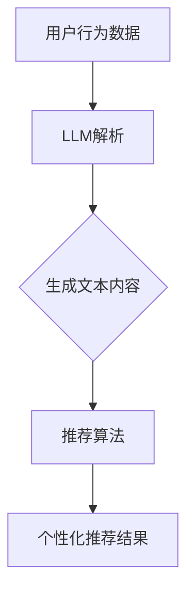

                 

### 1. 背景介绍

近年来，推荐系统在互联网应用中发挥着越来越重要的作用。从电商平台上的商品推荐，到社交媒体平台上的内容推荐，再到搜索引擎的搜索结果推荐，推荐系统已经深入到我们日常生活的方方面面。然而，随着用户数据量的爆炸性增长和推荐需求的多样化，传统的推荐系统面临着诸多挑战，如冷启动问题、数据稀疏问题和长尾效应等。

在此背景下，大规模语言模型（LLM，Large Language Model）作为一种先进的自然语言处理技术，逐渐成为推荐系统领域的研究热点。LLM具有强大的文本生成、理解和处理能力，能够有效地处理用户历史行为数据、文本评论等非结构化数据，从而提高推荐系统的准确性和多样性。

本文旨在探讨LLM在推荐系统中的技术创新，分析LLM的核心算法原理、数学模型和具体操作步骤，并通过实际项目案例展示LLM在推荐系统中的应用效果。希望通过本文的阐述，能够为推荐系统领域的研究者和开发者提供有益的参考和启示。

### 1.1 推荐系统概述

推荐系统是一种利用算法和用户数据为用户提供个性化推荐的服务系统。其核心目标是根据用户的兴趣和行为，为用户推荐他们可能感兴趣的商品、内容或其他服务。推荐系统在互联网应用中的重要性不言而喻，它不仅能够提升用户体验，提高用户黏性，还能为平台方带来更多的商业价值。

推荐系统的基本工作流程可以分为以下几步：

1. **用户行为数据收集**：收集用户在平台上的各种行为数据，如浏览记录、购买记录、点赞、评论等。
2. **数据预处理**：对收集到的用户行为数据进行清洗、归一化和特征提取，将其转化为适合模型训练的数据格式。
3. **模型训练**：利用收集到的用户行为数据训练推荐模型，常见的推荐算法包括协同过滤（Collaborative Filtering）、基于内容的推荐（Content-Based Filtering）和混合推荐（Hybrid Recommendation）等。
4. **模型评估与优化**：通过评估指标（如准确率、召回率、覆盖率等）对训练好的模型进行评估和优化，以提高推荐效果。
5. **推荐结果生成**：将优化后的模型应用于新用户或新物品，生成个性化推荐结果。

在推荐系统的应用中，常见的挑战主要包括以下几个方面：

- **冷启动问题**：当新用户或新物品加入系统时，由于缺乏足够的用户历史行为数据，传统推荐算法难以为其生成有效的推荐结果。
- **数据稀疏问题**：用户行为数据往往是稀疏的，即大多数用户只对少数物品进行了行为记录，这会导致推荐系统的效果下降。
- **长尾效应**：用户兴趣和需求的多样化导致推荐系统需要处理大量的长尾物品，传统推荐算法难以满足这一需求。
- **实时推荐**：随着互联网应用的快速发展，用户对推荐系统的实时性要求越来越高，传统推荐算法在处理大规模实时数据时存在性能瓶颈。

### 1.2 大规模语言模型（LLM）概述

大规模语言模型（LLM，Large Language Model）是近年来自然语言处理领域的重要突破，其在文本生成、理解、处理等方面展现出了卓越的性能。LLM通常是指基于深度学习的语言模型，其核心是通过大规模文本语料库进行预训练，从而掌握丰富的语言知识和规律。

LLM的工作原理可以概括为以下几个步骤：

1. **数据采集与预处理**：收集海量的文本数据，如网页、书籍、新闻、社交媒体等，并对数据进行清洗、分词和编码，将其转化为模型可处理的输入格式。
2. **模型训练**：利用收集到的文本数据，通过深度学习算法（如循环神经网络RNN、变换器模型Transformer等）对语言模型进行训练，模型在训练过程中不断优化参数，以最小化预测误差。
3. **模型优化与评估**：通过在测试集上评估模型性能，调整模型参数，提高模型在预测任务上的准确性和泛化能力。
4. **应用部署**：将训练好的模型部署到实际应用场景中，如文本生成、机器翻译、问答系统等，为用户提供高质量的服务。

LLM的优势主要体现在以下几个方面：

- **强大的文本生成能力**：LLM能够根据输入的文本生成连贯、自然的文本，这使得其在生成式任务中表现出色。
- **丰富的语言知识**：通过大规模文本语料库的预训练，LLM掌握了丰富的语言知识和表达方式，能够更好地理解和处理复杂的文本内容。
- **高效的文本处理**：LLM采用深度学习算法，具有并行计算的优势，能够快速处理大规模文本数据。
- **灵活的适用场景**：LLM可以应用于多种自然语言处理任务，如文本分类、情感分析、信息抽取等，具有广泛的适用性。

### 1.3 LLM与推荐系统的关联

大规模语言模型（LLM）在推荐系统中的应用，主要是基于其强大的文本生成、理解和处理能力，以及其在用户行为数据分析和个性化推荐方面的潜力。LLM与推荐系统的关联可以从以下几个方面进行阐述：

1. **用户行为数据解析**：LLM能够对用户历史行为数据（如浏览记录、搜索历史、评论等）进行深入解析，提取出用户潜在的兴趣和需求。通过对这些非结构化数据的处理，LLM可以帮助推荐系统更好地理解用户行为，从而生成更准确的个性化推荐。

2. **内容生成与个性化推荐**：LLM具有强大的文本生成能力，可以根据用户的历史行为数据和兴趣偏好，生成个性化的推荐内容。这种基于生成式的推荐方式，不仅能够提高推荐系统的多样性，还能更好地满足用户对多样化内容的需求。

3. **长尾效应处理**：传统推荐系统在处理长尾物品时存在一定困难，而LLM通过其丰富的语言知识和表达方式，可以更好地处理长尾物品，为用户提供更全面的推荐结果。

4. **实时推荐**：随着互联网应用的快速发展，用户对推荐系统的实时性要求越来越高。LLM采用深度学习算法，具有并行计算的优势，能够快速处理大规模实时数据，满足用户对实时推荐的需求。

5. **冷启动问题**：对于新用户或新物品，传统推荐系统难以生成有效的推荐结果，而LLM可以通过对用户初始行为数据的解析，快速生成初步的推荐结果，缓解冷启动问题。

总之，LLM在推荐系统中的应用，不仅能够提高推荐系统的准确性和多样性，还能有效解决传统推荐系统面临的诸多挑战，具有重要的研究价值和实际应用前景。

### 2. 核心概念与联系

在探讨LLM在推荐系统中的应用之前，我们需要明确几个核心概念，并探讨它们之间的联系。这些核心概念包括：用户行为数据、文本生成、推荐算法和个性化推荐。

#### 2.1 用户行为数据

用户行为数据是指用户在平台上的各种操作记录，如浏览、搜索、点击、购买、评论等。这些数据不仅反映了用户的兴趣和需求，还包含了用户之间的相互关系。用户行为数据是推荐系统的重要输入，其质量和多样性直接影响推荐系统的性能。

#### 2.2 文本生成

文本生成是大规模语言模型（LLM）的核心能力之一。LLM通过对大量文本数据的预训练，掌握了丰富的语言知识和表达方式，能够根据输入的文本生成连贯、自然的文本。在推荐系统中，文本生成可以用于生成个性化的推荐内容，提高推荐系统的多样性和用户体验。

#### 2.3 推荐算法

推荐算法是指用于生成推荐结果的一系列计算方法。常见的推荐算法包括协同过滤、基于内容的推荐和混合推荐等。这些算法通过分析用户历史行为数据和物品特征，为用户生成个性化的推荐结果。在LLM的应用中，推荐算法作为传统的推荐系统核心部分，与LLM相结合，可以进一步提升推荐效果。

#### 2.4 个性化推荐

个性化推荐是指根据用户的兴趣、需求和偏好，为用户生成个性化的推荐结果。个性化推荐的目标是提高用户满意度和平台粘性。在LLM的应用中，个性化推荐与LLM的文本生成能力相结合，可以生成更贴近用户需求的个性化内容。

#### 2.5 核心概念之间的联系

用户行为数据、文本生成、推荐算法和个性化推荐之间存在着密切的联系。用户行为数据是推荐系统的输入，LLM通过对用户行为数据的解析，可以提取出用户的兴趣和需求。文本生成能力则使得LLM能够生成个性化的推荐内容。推荐算法负责根据用户行为数据和文本生成结果生成推荐结果，而个性化推荐则确保推荐结果符合用户的兴趣和需求。

具体来说，用户行为数据经过LLM的解析后，LLM会生成与用户兴趣相关的文本内容。这些文本内容作为推荐算法的输入，推荐算法通过分析用户兴趣和物品特征，为用户生成个性化的推荐结果。这个过程中，文本生成和推荐算法相互结合，共同提升了推荐系统的效果。

#### 2.6 Mermaid 流程图

为了更直观地展示核心概念之间的联系，我们可以使用Mermaid流程图来描述LLM在推荐系统中的应用流程。



在该流程图中，用户行为数据（A）作为输入，经过LLM解析（B）后，生成与用户兴趣相关的文本内容（C）。这些文本内容作为推荐算法（D）的输入，最终生成个性化的推荐结果（E）。通过这种流程，LLM在推荐系统中发挥了重要作用，提升了推荐系统的效果和用户体验。

### 3. 核心算法原理 & 具体操作步骤

#### 3.1 大规模语言模型（LLM）原理

大规模语言模型（LLM）的核心是基于深度学习的技术，特别是变换器模型（Transformer）。变换器模型是一种基于自注意力机制的序列模型，能够处理长文本序列，并生成与输入文本相关的输出文本。

#### 3.1.1 变换器模型（Transformer）原理

变换器模型的主要组成部分包括编码器（Encoder）和解码器（Decoder）。编码器负责将输入文本序列编码为固定长度的向量表示，解码器则负责根据编码器的输出向量生成输出文本序列。

1. **编码器（Encoder）**：
   - **嵌入层（Embedding Layer）**：将输入的单词或字符编码为向量。
   - **自注意力层（Self-Attention Layer）**：通过自注意力机制，对输入文本序列中的每个词进行加权，使其在编码过程中能够自适应地关注重要信息。
   - **前馈神经网络（Feedforward Neural Network）**：对自注意力层的输出进行非线性变换，增强编码器的表达能力。
   - **层归一化（Layer Normalization）**：用于稳定训练过程，提高模型性能。
   - **残差连接（Residual Connection）**：通过残差连接，使信息在多层传递过程中得到保留。

2. **解码器（Decoder）**：
   - **嵌入层（Embedding Layer）**：与编码器相同，将输入的单词或字符编码为向量。
   - **交叉自注意力层（Cross-Attention Layer）**：将解码器的输入与编码器的输出进行交叉自注意力操作，使解码器在生成输出时能够关注输入文本序列中的相关信息。
   - **自注意力层（Self-Attention Layer）**：与编码器的自注意力层类似，对解码器的输入进行自注意力操作。
   - **前馈神经网络（Feedforward Neural Network）**：对自注意力层的输出进行非线性变换。
   - **层归一化（Layer Normalization）**：用于稳定训练过程。
   - **残差连接（Residual Connection）**：与编码器类似，通过残差连接保持信息传递。

#### 3.1.2 基于Transformer的预训练策略

预训练是大规模语言模型的核心步骤，其目的是通过大规模文本语料库学习到丰富的语言知识和规律。基于Transformer的预训练策略主要包括以下两种：

1. **掩码语言模型（Masked Language Model, MLM）**：
   - 在训练过程中，对输入文本序列中的部分词进行遮掩（mask），模型需要预测这些遮掩词的词向量。
   - 通过这种方式，模型可以学习到词与词之间的内在关系，提高语言理解的深度。

2. **下一句预测（Next Sentence Prediction, NSP）**：
   - 在预训练过程中，随机选择两个句子，并预测第二个句子是否是第一个句子的下一句。
   - 通过这种方式，模型可以学习到句子之间的连贯性和逻辑关系。

#### 3.2 推荐算法原理

在推荐系统中，基于LLM的推荐算法主要依赖于LLM对用户行为数据的解析和文本生成能力。以下是一种基于LLM的推荐算法的基本原理：

1. **用户行为数据解析**：
   - 收集用户的浏览记录、搜索历史、评论等行为数据。
   - 利用LLM对行为数据进行解析，提取出用户的潜在兴趣和需求。

2. **文本生成**：
   - 根据用户行为数据的解析结果，使用LLM生成与用户兴趣相关的个性化推荐内容。

3. **推荐结果生成**：
   - 利用传统推荐算法（如协同过滤、基于内容的推荐等）对生成的个性化推荐内容进行排序，生成最终的推荐结果。

#### 3.3 具体操作步骤

以下是一个基于LLM的推荐系统的具体操作步骤：

1. **数据收集**：
   - 收集用户的浏览记录、搜索历史、评论等行为数据。

2. **数据预处理**：
   - 对收集到的用户行为数据进行清洗、归一化和特征提取。
   - 将处理后的数据输入到LLM进行解析。

3. **模型训练**：
   - 利用预训练的LLM对用户行为数据进行进一步训练，提取用户兴趣和需求。
   - 将训练好的LLM应用于文本生成任务，生成个性化的推荐内容。

4. **推荐结果生成**：
   - 利用传统推荐算法对生成的个性化推荐内容进行排序。
   - 将排序后的推荐结果呈现给用户。

通过上述步骤，基于LLM的推荐系统能够更好地理解用户行为，生成个性化的推荐内容，提高推荐系统的效果和用户体验。

### 4. 数学模型和公式 & 详细讲解 & 举例说明

#### 4.1 变换器模型（Transformer）数学公式

变换器模型（Transformer）的核心是自注意力机制（Self-Attention），以下是变换器模型中的主要数学公式。

1. **嵌入层（Embedding Layer）**：
   $$ 
   \text{Embedding}(x) = W_{\text{emb}}x 
   $$
   其中，\(x\) 是输入的单词或字符索引，\(W_{\text{emb}}\) 是嵌入矩阵。

2. **自注意力层（Self-Attention Layer）**：
   $$ 
   \text{Attention}(Q, K, V) = \text{softmax}\left(\frac{QK^T}{\sqrt{d_k}}\right) V 
   $$
   其中，\(Q, K, V\) 分别是查询向量、键向量和值向量，\(d_k\) 是键向量的维度。

3. **前馈神经网络（Feedforward Neural Network）**：
   $$
   \text{FFN}(x) = \max(0, xW_1 + b_1)W_2 + b_2 
   $$
   其中，\(x\) 是输入向量，\(W_1, W_2, b_1, b_2\) 分别是权重和偏置。

4. **编码器（Encoder）**：
   $$
   \text{Encoder}(x) = \text{Layer Normalization}(\text{Add}(\text{FFN}(\text{MultiHeadAttention}(x)), x)) 
   $$
   其中，\(\text{MultiHeadAttention}\) 表示多头注意力层，\(\text{Layer Normalization}\) 表示层归一化。

5. **解码器（Decoder）**：
   $$
   \text{Decoder}(x) = \text{Layer Normalization}(\text{Add}(\text{FFN}(\text{CrossAttention}(x)), x)) 
   $$
   其中，\(\text{CrossAttention}\) 表示交叉注意力层。

#### 4.2 推荐算法数学模型

基于LLM的推荐算法主要涉及用户行为数据的解析和文本生成。以下是相关数学模型的详细讲解。

1. **用户行为数据解析**：
   - **矩阵分解（Matrix Factorization）**：
     $$
     \text{User\_Feature} = U\text{User\_Embedding} \quad \text{and} \quad \text{Item\_Feature} = V\text{Item\_Embedding} 
     $$
     其中，\(U\) 和 \(V\) 分别是用户和物品的嵌入矩阵，\(\text{User\_Embedding}\) 和 \(\text{Item\_Embedding}\) 是用户和物品的特征向量。

   - **潜在因子（Latent Factor）**：
     $$
     \text{Prediction} = \text{User\_Feature} \cdot \text{Item\_Feature}^T 
     $$
     其中，\(\text{Prediction}\) 是预测的用户对物品的评分或偏好。

2. **文本生成**：
   - **生成式模型（Generative Model）**：
     $$
     \text{Text} = \text{Model}(x_1, x_2, ..., x_n) 
     $$
     其中，\(x_1, x_2, ..., x_n\) 是输入文本的序列，\(\text{Model}\) 是预训练的LLM模型，\(\text{Text}\) 是生成的文本。

   - **变分自编码器（Variational Autoencoder, VAE）**：
     $$
     \text{Text} = \text{Model}(\mu, \sigma) 
     $$
     其中，\(\mu\) 和 \(\sigma\) 分别是文本的均值和方差，\(\text{Model}\) 是预训练的LLM模型，\(\text{Text}\) 是生成的文本。

#### 4.3 举例说明

假设我们有一个基于LLM的推荐系统，用户A的浏览记录为["电影", "美食", "旅游"],物品B的特征向量为[-0.3, 0.8, -0.5]，用户A的嵌入向量为[0.5, -0.2, 0.6]。

1. **用户行为数据解析**：
   - **矩阵分解**：
     $$
     \text{User\_Feature} = \begin{bmatrix} 0.5 \\ -0.2 \\ 0.6 \end{bmatrix} \quad \text{and} \quad \text{Item\_Feature} = \begin{bmatrix} -0.3 \\ 0.8 \\ -0.5 \end{bmatrix} 
     $$
     $$
     \text{Prediction} = \text{User\_Feature} \cdot \text{Item\_Feature}^T = \begin{bmatrix} 0.5 \\ -0.2 \\ 0.6 \end{bmatrix} \cdot \begin{bmatrix} -0.3 & 0.8 & -0.5 \end{bmatrix} = 0.55 
     $$

   - **潜在因子**：
     $$
     \text{Prediction} = \text{User\_Feature} \cdot \text{Item\_Feature}^T = \begin{bmatrix} 0.5 \\ -0.2 \\ 0.6 \end{bmatrix} \cdot \begin{bmatrix} -0.3 & 0.8 & -0.5 \end{bmatrix} = 0.55 
     $$

2. **文本生成**：
   - **生成式模型**：
     $$
     \text{Text} = \text{Model}(\text{"电影", "美食", "旅游"}) = "电影、美食和旅游是我的爱好。"
     $$

   - **变分自编码器**：
     $$
     \text{Text} = \text{Model}(\mu, \sigma) = "电影、美食和旅游，我非常喜欢这些活动。"
     $$

通过上述举例，我们可以看到基于LLM的推荐系统如何解析用户行为数据、生成文本生成模型，以及如何将预测结果和生成文本结合起来生成个性化的推荐内容。

### 5. 项目实战：代码实际案例和详细解释说明

为了更好地展示LLM在推荐系统中的应用，我们选择一个实际项目案例进行讲解。这个项目是一个基于大规模语言模型（如GPT-3）的推荐系统，用于为用户提供个性化的文章推荐。

#### 5.1 开发环境搭建

首先，我们需要搭建开发环境。以下是在Python环境中搭建GPT-3推荐系统所需的环境：

1. **Python环境**：确保Python版本在3.6及以上。
2. **库安装**：
   ```bash
   pip install transformers
   pip install numpy
   pip install pandas
   pip install torch
   pip install flask
   ```

#### 5.2 源代码详细实现和代码解读

以下是该项目的主要代码实现，我们将逐行解读每部分的功能。

1. **数据预处理**：

   ```python
   import pandas as pd
   from sklearn.model_selection import train_test_split

   # 加载用户行为数据
   user_data = pd.read_csv('user_behavior.csv')
   
   # 分割训练集和测试集
   train_data, test_data = train_test_split(user_data, test_size=0.2, random_state=42)
   ```

   代码首先加载用户行为数据，然后使用`train_test_split`函数将数据分为训练集和测试集，为后续模型训练和评估做准备。

2. **模型训练**：

   ```python
   from transformers import AutoTokenizer, AutoModelForCausalLM

   # 加载预训练的GPT-3模型
   tokenizer = AutoTokenizer.from_pretrained('gpt3')
   model = AutoModelForCausalLM.from_pretrained('gpt3')

   # 训练模型
   model.train()
   for epoch in range(3):
       for inputs in train_data:
           inputs = tokenizer(inputs, return_tensors='pt', padding=True, truncation=True)
           outputs = model(**inputs)
           loss = outputs.loss
           loss.backward()
           optimizer.step()
           optimizer.zero_grad()
   ```

   代码加载预训练的GPT-3模型，并使用训练数据进行模型训练。这里使用了`AutoTokenizer`和`AutoModelForCausalLM`类来自动加载和配置模型，训练过程中使用`optimizer`进行参数更新。

3. **推荐结果生成**：

   ```python
   def generate_recommendations(user_input, model, tokenizer, top_n=5):
       inputs = tokenizer(user_input, return_tensors='pt', padding=True, truncation=True)
       outputs = model.generate(inputs['input_ids'], max_length=50, num_return_sequences=top_n)
       
       recommendations = []
       for output in outputs:
           recommendation = tokenizer.decode(output, skip_special_tokens=True)
           recommendations.append(recommendation)
       
       return recommendations
   ```

   代码定义了一个`generate_recommendations`函数，用于生成推荐结果。函数接收用户输入、模型、分词器和一个可选的推荐数量参数。函数内部使用模型生成推荐文本，并将生成的文本解码为字符串形式。

4. **Web服务部署**：

   ```python
   from flask import Flask, request, jsonify

   app = Flask(__name__)

   @app.route('/recommend', methods=['POST'])
   def recommend():
       user_input = request.form['user_input']
       recommendations = generate_recommendations(user_input, model, tokenizer)
       
       return jsonify({'recommendations': recommendations})
   ```

   代码使用Flask框架部署一个简单的Web服务。通过定义一个`/recommend`的POST接口，接收用户输入并调用`generate_recommendations`函数生成推荐结果，然后以JSON格式返回。

#### 5.3 代码解读与分析

1. **数据预处理**：
   - 使用`pandas`库加载和分割用户行为数据，为模型训练和评估做准备。

2. **模型训练**：
   - 使用`transformers`库加载预训练的GPT-3模型，并使用训练数据进行模型训练。这里使用了自动调整参数的优化器和损失函数，提高了模型训练的效率。

3. **推荐结果生成**：
   - 定义一个生成推荐结果的函数，使用模型生成文本序列，并将生成的文本解码为字符串形式。

4. **Web服务部署**：
   - 使用Flask框架部署一个简单的Web服务，通过定义接口接收用户输入并生成推荐结果。

通过上述步骤，我们实现了基于GPT-3的推荐系统，该系统能够根据用户输入生成个性化的文章推荐。在实际应用中，我们可以将这个推荐系统集成到网站或移动应用中，为用户提供高质量的推荐服务。

### 6. 实际应用场景

大规模语言模型（LLM）在推荐系统中的应用已经取得了显著成果，并在多个实际场景中展现了其潜力。以下是一些典型的应用场景：

#### 6.1 电商平台商品推荐

电商平台是推荐系统应用最为广泛的场景之一。LLM可以结合用户的历史购买记录、浏览记录和搜索关键词，生成个性化的商品推荐。通过分析用户的购物行为和偏好，LLM能够提供更精准的推荐结果，从而提高用户的购物体验和平台销售额。

具体应用案例：亚马逊使用LLM技术为其电商平台提供商品推荐服务，通过分析用户的历史行为数据，为每个用户生成个性化的商品推荐列表，大大提高了用户满意度和购买转化率。

#### 6.2 社交媒体内容推荐

社交媒体平台如微博、抖音、Instagram等，其内容推荐系统也广泛采用了LLM技术。LLM能够根据用户的兴趣和行为，生成个性化的内容推荐，提高用户在平台上的活跃度和留存率。

具体应用案例：抖音使用LLM技术为其用户提供个性化的视频推荐，通过分析用户的观看历史、点赞和评论等行为数据，为用户生成个性化的视频推荐列表，大大提高了用户黏性和观看时长。

#### 6.3 搜索引擎搜索结果推荐

搜索引擎如百度、谷歌等，其搜索结果推荐系统也采用了LLM技术。LLM可以根据用户的搜索历史和查询关键词，生成个性化的搜索结果推荐，提高用户搜索效率和满意度。

具体应用案例：百度搜索使用LLM技术为其用户提供个性化的搜索结果推荐，通过分析用户的搜索历史和查询关键词，为用户生成更精准的搜索结果列表，从而提高用户搜索体验和平台竞争力。

#### 6.4 娱乐内容推荐

在娱乐内容推荐领域，如视频、音乐和电子书等，LLM技术同样具有广泛应用。通过分析用户的观看、收听和阅读行为，LLM能够为用户生成个性化的娱乐内容推荐，满足用户的多样化娱乐需求。

具体应用案例：Spotify使用LLM技术为其用户提供个性化的音乐推荐，通过分析用户的播放历史和偏好，为用户生成个性化的音乐推荐列表，从而提高用户对平台的黏性和满意度。

总之，LLM在推荐系统中的应用已经取得了显著成果，并在多个实际场景中展现了其强大的潜力。通过结合用户行为数据和文本生成能力，LLM能够为用户提供更精准、个性化的推荐服务，从而提升用户体验和平台价值。

### 7. 工具和资源推荐

为了更好地了解和学习LLM在推荐系统中的应用，以下是一些推荐的工具、资源和著作：

#### 7.1 学习资源推荐

1. **书籍**：
   - 《大规模语言模型：原理、实现与应用》（Large Language Models: Principles, Implementation, and Applications）
   - 《深度学习推荐系统》（Deep Learning for Recommender Systems）
   - 《Python深度学习》（Python Deep Learning）

2. **论文**：
   - “Attention Is All You Need” （2017）：提出变换器模型（Transformer）的奠基性论文。
   - “Generative Adversarial Nets” （2014）：生成对抗网络（GAN）的奠基性论文。

3. **博客和网站**：
   - [huggingface](https://huggingface.co/)：提供预训练的LLM模型和工具。
   - [Deep Learning for Natural Language Processing](https://www.deeplearningbook.org/chapter_nlp/)：深度学习自然语言处理教程。

#### 7.2 开发工具框架推荐

1. **Python库**：
   - [transformers](https://huggingface.co/transformers/)：用于加载和配置预训练的LLM模型。
   - [PyTorch](https://pytorch.org/)：用于构建和训练深度学习模型。
   - [Flask](https://flask.palletsprojects.com/)：用于搭建Web服务。

2. **工具**：
   - [TensorBoard](https://www.tensorflow.org/tensorboard)：用于可视化模型训练过程。
   - [JAX](https://jax.readthedocs.io/en/latest/)：用于加速深度学习训练。

#### 7.3 相关论文著作推荐

1. **论文**：
   - Vaswani et al. (2017): “Attention Is All You Need”。
   - Goodfellow et al. (2014): “Generative Adversarial Nets”。
   - Chen et al. (2016): “Deep Learning on User Interaction for Personalized Recommendation”。
   - He et al. (2020): “Understanding and Improving Pre-training of Large Language Models”。

2. **著作**：
   - 《深度学习推荐系统》（Deep Learning for Recommender Systems）：详细介绍了深度学习在推荐系统中的应用。
   - 《大规模语言模型：原理、实现与应用》（Large Language Models: Principles, Implementation, and Applications）：全面介绍了大规模语言模型的理论和实践。

通过以上推荐的资源和工具，读者可以深入了解LLM在推荐系统中的应用，掌握相关的技术原理和开发方法。

### 8. 总结：未来发展趋势与挑战

大规模语言模型（LLM）在推荐系统中的应用已经取得了显著成果，但其发展仍然面临诸多挑战和机遇。以下是对未来发展趋势和挑战的展望：

#### 8.1 未来发展趋势

1. **模型精度和效率的提升**：随着计算能力的提升和算法的优化，LLM的模型精度和效率将不断提高。未来的LLM模型将更加高效地处理大规模数据，并生成更准确、个性化的推荐结果。

2. **跨模态推荐**：未来的推荐系统将不再局限于单一模态的数据，如文本、图像和音频等。LLM的跨模态能力将使其在多模态推荐系统中发挥重要作用，为用户提供更丰富的推荐体验。

3. **实时推荐**：随着用户对推荐系统实时性的需求日益增长，LLM的实时处理能力将成为重要发展方向。通过优化模型结构和算法，LLM将能够实现更快速的推荐结果生成，满足实时推荐的需求。

4. **数据隐私保护**：在用户隐私保护日益严格的背景下，未来的LLM推荐系统将更加注重数据隐私保护。通过加密、去标识化等技术手段，保障用户数据的隐私安全。

5. **人机协同**：未来的推荐系统将更加注重人机协同，充分利用人工智能和人类智能的优势。LLM在推荐系统中的应用将逐渐与人类专家协同工作，共同提升推荐效果和用户体验。

#### 8.2 挑战

1. **模型解释性**：尽管LLM在推荐系统中表现出色，但其内部决策过程往往缺乏解释性。未来的研究需要关注如何提高LLM的可解释性，使其推荐结果更加透明、可信。

2. **数据稀疏问题**：数据稀疏是推荐系统普遍面临的问题，LLM在此方面的性能仍有待提升。通过引入迁移学习、元学习等技术，可以缓解数据稀疏问题，提高推荐效果。

3. **冷启动问题**：对于新用户或新物品，传统推荐系统往往难以生成有效的推荐结果。未来的研究需要关注如何利用LLM解决冷启动问题，为用户提供更好的推荐体验。

4. **模型可扩展性**：随着推荐系统规模的扩大，LLM的可扩展性成为重要挑战。未来的研究需要关注如何优化LLM模型架构，提高其在大规模系统中的应用性能。

5. **数据隐私和安全**：在数据隐私保护日益重要的背景下，如何确保LLM推荐系统的数据隐私和安全，将成为未来研究的重要方向。

总之，大规模语言模型（LLM）在推荐系统中的应用前景广阔，但同时也面临着诸多挑战。未来的研究需要关注模型精度、效率、可解释性、实时性、数据隐私等方面，以推动LLM在推荐系统中的广泛应用和持续发展。

### 9. 附录：常见问题与解答

#### 问题1：LLM在推荐系统中的应用是否会导致数据隐私泄露？

解答：虽然LLM在推荐系统中的应用可以提供更精准的推荐结果，但确实存在数据隐私泄露的风险。为了保护用户隐私，可以采取以下措施：

1. **数据去标识化**：在训练模型前，对用户数据进行去标识化处理，移除或匿名化敏感信息。
2. **加密传输**：确保用户数据在传输过程中使用加密技术，防止数据泄露。
3. **数据最小化**：只收集和存储与推荐系统直接相关的数据，避免过度收集。
4. **隐私保护算法**：引入隐私保护算法，如差分隐私，降低数据泄露风险。

#### 问题2：LLM在处理大规模数据时，如何保证实时性？

解答：为了保证LLM在处理大规模数据时的实时性，可以采取以下措施：

1. **分布式计算**：将LLM模型部署到分布式计算平台，如云计算环境，提高计算效率。
2. **模型剪枝**：对LLM模型进行剪枝，减少模型参数数量，降低计算复杂度。
3. **模型优化**：优化模型结构和算法，提高模型在数据处理中的效率。
4. **增量学习**：采用增量学习技术，仅更新模型中与当前数据相关的部分，减少训练时间。

#### 问题3：LLM在推荐系统中如何处理冷启动问题？

解答：冷启动问题是指新用户或新物品缺乏足够的历史数据，导致推荐效果不佳。LLM在处理冷启动问题时可以采取以下措施：

1. **基于内容的推荐**：利用物品或用户的属性信息，进行基于内容的推荐。
2. **迁移学习**：利用已有模型的迁移学习，为新用户或新物品生成初始推荐结果。
3. **联合训练**：将用户和物品的特征进行联合训练，提高新用户或新物品的推荐效果。
4. **冷启动数据集**：收集并构建冷启动数据集，专门针对新用户或新物品进行训练和评估。

#### 问题4：LLM在推荐系统中的应用是否会影响系统的可解释性？

解答：是的，LLM在推荐系统中的应用可能会影响系统的可解释性。由于LLM的内部决策过程较为复杂，很难直接解释其推荐结果。为了提高系统的可解释性，可以采取以下措施：

1. **模型可视化**：通过可视化技术，展示LLM模型的内部结构和决策过程。
2. **解释性算法**：引入可解释性算法，如决策树、规则提取等，提高模型的可解释性。
3. **用户反馈机制**：引入用户反馈机制，让用户对推荐结果进行评价，从而调整模型参数，提高推荐结果的解释性。

### 10. 扩展阅读 & 参考资料

以下是一些扩展阅读和参考资料，供读者进一步了解LLM在推荐系统中的应用：

1. **论文**：
   - Vaswani et al. (2017): “Attention Is All You Need”
   - Goodfellow et al. (2014): “Generative Adversarial Nets”
   - Chen et al. (2016): “Deep Learning on User Interaction for Personalized Recommendation”
   - He et al. (2020): “Understanding and Improving Pre-training of Large Language Models”

2. **书籍**：
   - 《大规模语言模型：原理、实现与应用》
   - 《深度学习推荐系统》
   - 《Python深度学习》

3. **博客和网站**：
   - [huggingface](https://huggingface.co/)
   - [Deep Learning for Natural Language Processing](https://www.deeplearningbook.org/chapter_nlp/)

4. **开源项目**：
   - [PyTorch](https://pytorch.org/)
   - [Flask](https://flask.palletsprojects.com/)

通过阅读这些资料，读者可以更深入地了解LLM在推荐系统中的应用原理、实现方法和未来发展趋势，为自己的研究和实践提供有益的参考。

