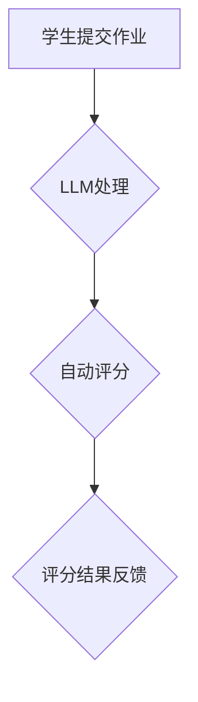

                 

### 1. 背景介绍

近年来，人工智能（AI）技术在各个领域都展现出了强大的应用潜力。特别是在教育领域，AI技术已经开始改变传统的教学和评估方式。教育评估是教育过程中至关重要的一环，它不仅关系到学生的学业成绩，还直接影响到学校的教学质量和教育公平。因此，如何通过AI技术实现教育评估的公平公正，成为了一个备受关注的问题。

在教育评估中，传统的评分方式往往依赖于教师的主观判断，这容易导致评分结果的不一致和偏见。例如，不同教师可能在评分标准上存在差异，或者某些学生可能因为背景、种族、性别等因素而受到不公平对待。这些问题都严重影响了教育评估的公平性和准确性。

为了解决这些问题，近年来，越来越多的研究开始关注使用机器学习模型，特别是大型语言模型（LLM），来进行教育评估。LLM具有强大的文本理解和生成能力，可以通过分析学生的作业、论文和其他文本材料，提供客观、一致的评分。这种方法不仅可以减少人为错误，还可以确保评分的公正性。

本文将探讨LLM在教育评估中的应用，分析其原理、技术实现、实际应用场景，并探讨未来可能面临的挑战和发展趋势。

### 2. 核心概念与联系

#### 2.1. 大型语言模型（LLM）的基本概念

大型语言模型（LLM，Large Language Model）是近年来人工智能领域的一个重要突破。LLM是一种基于深度学习技术的自然语言处理模型，它通过学习大量的文本数据，能够生成与输入文本相关的高质量文本。与传统的语言模型相比，LLM具有更高的准确性和更强的理解能力。

LLM的核心在于其巨大的参数规模和深度学习架构。例如，GPT-3模型拥有1750亿个参数，其架构包括数十层的Transformer网络。这样的模型可以处理复杂的语言结构，生成语义丰富、连贯的文本。

#### 2.2. 教育评估的挑战与需求

在教育评估中，评分的公平性和一致性是两个关键问题。传统评估方法往往依赖于教师的主观判断，这容易导致评分结果的不一致和偏见。例如，不同教师可能在评分标准上存在差异，或者某些学生可能因为背景、种族、性别等因素而受到不公平对待。这些问题都严重影响了教育评估的公平性和准确性。

为了解决这些问题，教育评估需要一种能够提供客观、一致评分的方法。LLM的出现为这个问题提供了一种可能的解决方案。LLM可以分析学生的作业、论文和其他文本材料，根据其内容、结构和语言风格等特征，提供评分。这种方法不仅可以减少人为错误，还可以确保评分的公正性。

#### 2.3. LLM在教育评估中的应用

LLM在教育评估中的应用主要体现在以下几个方面：

1. **自动评分系统**：LLM可以用于构建自动评分系统，自动分析学生的作业和论文，提供评分。这种方法可以大大减少教师的工作量，提高评分的效率。

2. **标准答案生成**：LLM可以根据问题生成标准答案，帮助学生理解和掌握知识点。这种方法可以提高学生的学习效果，减少因个人理解差异导致的评分误差。

3. **辅助评分**：LLM可以作为教师的辅助工具，提供评分建议。教师可以根据LLM的评分，结合自己的判断，给出最终的评分。这种方法可以结合人机优势，提高评分的准确性和公正性。

4. **个性化评估**：LLM可以根据学生的文本材料，提供个性化的评估报告。这种方法可以帮助学生了解自己的优势和不足，针对性地改进学习策略。

#### 2.4. Mermaid 流程图

为了更好地理解LLM在教育评估中的应用，我们可以使用Mermaid流程图来展示其基本流程。以下是一个简化的Mermaid流程图示例：



在这个流程图中，学生提交作业（A）后，LLM进行处理（B），然后生成评分结果并反馈给教师或学生（D）。这个流程体现了LLM在教育评估中的基本应用模式。

### 3. 核心算法原理 & 具体操作步骤

#### 3.1. LLM的工作原理

LLM的工作原理基于深度学习，特别是基于Transformer模型的架构。Transformer模型是一种用于处理序列数据的模型，其核心思想是自注意力机制（Self-Attention）。自注意力机制允许模型在生成文本时，动态地关注序列中的其他部分，从而捕捉到更复杂的上下文信息。

具体来说，LLM的工作流程可以分为以下几个步骤：

1. **文本预处理**：将输入的文本数据（如学生的作业、论文等）进行预处理，包括分词、去除停用词、转换为词向量等。

2. **输入编码**：将预处理后的文本输入到LLM中，通过输入编码器（Input Encoder）将文本转换为嵌入向量（Embedding Vector）。嵌入向量表示了文本的语义信息。

3. **自注意力机制**：通过自注意力机制（Self-Attention），模型可以在生成每个词时，动态地关注序列中的其他词，从而生成更准确的预测。

4. **生成文本**：在自注意力机制的基础上，模型生成输出文本，这个过程可以是逐词生成的，直到生成完整的句子或段落。

5. **评分预测**：对于教育评估场景，LLM可以在生成文本的同时，预测文本的质量或得分。这个预测过程通常基于模型的输出概率分布。

#### 3.2. LLM在教育评估中的具体操作步骤

以下是一个简化的LLM在教育评估中的具体操作步骤：

1. **数据收集**：收集大量的学生作业、论文等文本数据，这些数据将用于训练LLM模型。

2. **数据预处理**：对收集到的文本数据进行预处理，包括分词、去除停用词、转换为词向量等。

3. **模型训练**：使用预处理后的文本数据训练LLM模型。训练过程包括输入编码、自注意力机制和输出解码等步骤。

4. **模型评估**：在训练过程中，使用部分数据对模型进行评估，调整模型参数，以优化模型的性能。

5. **模型部署**：训练好的LLM模型可以部署到实际应用场景中，例如自动评分系统。

6. **评分预测**：当学生提交作业或论文时，LLM模型分析文本内容，生成评分预测。

7. **评分反馈**：将评分预测结果反馈给教师或学生，辅助教学和评估。

#### 3.3. 具体代码示例

以下是一个简化的Python代码示例，展示了如何使用预训练的LLM模型进行文本评分预测：

```python
import torch
from transformers import BertTokenizer, BertModel

# 加载预训练的LLM模型
tokenizer = BertTokenizer.from_pretrained('bert-base-uncased')
model = BertModel.from_pretrained('bert-base-uncased')

# 输入文本
text = "This is an example essay."

# 文本预处理
input_ids = tokenizer.encode(text, add_special_tokens=True, return_tensors='pt')

# 模型预测
with torch.no_grad():
    outputs = model(input_ids)

# 输出文本
output_text = tokenizer.decode(outputs[0], skip_special_tokens=True)

# 输出评分预测
score = torch.nn.functional.softmax(outputs[0], dim=-1)[0][1].item()

print("Output Text:", output_text)
print("Score Prediction:", score)
```

在这个示例中，我们首先加载了一个预训练的BERT模型，然后对输入的文本进行预处理和模型预测。最后，我们使用softmax函数对模型输出的概率分布进行归一化，得到文本的评分预测。

### 4. 数学模型和公式 & 详细讲解 & 举例说明

#### 4.1. 自注意力机制（Self-Attention）

自注意力机制是Transformer模型的核心组成部分，它允许模型在生成文本时，动态地关注序列中的其他部分。自注意力机制的数学公式如下：

$$
\text{Self-Attention}(Q, K, V) = \text{softmax}\left(\frac{QK^T}{\sqrt{d_k}}\right)V
$$

其中，$Q, K, V$ 分别表示查询（Query）、键（Key）和值（Value）向量，$d_k$ 表示键向量的维度。$QK^T$ 表示点积运算，结果是一个矩阵，其每个元素表示查询和键之间的相似度。通过softmax函数，我们可以将这个矩阵转换为概率分布，然后与值向量相乘，得到最终的输出。

#### 4.2. 编码器和解码器（Encoder and Decoder）

在Transformer模型中，编码器（Encoder）和解码器（Decoder）分别负责处理输入和生成输出。编码器的输出可以看作是序列的固定长度的向量表示，而解码器的目标是根据编码器的输出和前一个词，生成下一个词的概率分布。

编码器的输出可以通过以下公式计算：

$$
E = \text{MultiHeadAttention}(Q, K, V)
$$

其中，$E$ 表示编码器的输出，$Q, K, V$ 分别表示查询、键和值向量。

解码器的输出可以通过以下公式计算：

$$
Y_t = \text{softmax}(\text{Decoder}(Y_{<t}, E))
$$

其中，$Y_t$ 表示解码器的输出，$Y_{<t}$ 表示前 $t$ 个词的输出，$E$ 表示编码器的输出。

#### 4.3. 举例说明

假设我们有一个简单的文本序列 "I am a student."，我们可以使用自注意力机制来计算这个序列的表示。

首先，我们将文本序列进行预处理，将其转换为词向量：

- I: [0.1, 0.2, 0.3]
- am: [0.4, 0.5, 0.6]
- a: [0.7, 0.8, 0.9]
- student: [1.0, 1.1, 1.2]

接下来，我们可以计算自注意力权重：

$$
\text{Attention Weight} = \frac{QK^T}{\sqrt{d_k}}
$$

对于第一个词 "I"，其查询向量为 $Q = [0.1, 0.2, 0.3]$，键向量为 $K = [0.4, 0.5, 0.6]$，值向量为 $V = [1.0, 1.1, 1.2]$。计算点积得到：

$$
QK^T = [0.1 \times 0.4, 0.2 \times 0.5, 0.3 \times 0.6] = [0.04, 0.10, 0.18]
$$

然后，我们可以使用softmax函数计算自注意力权重：

$$
\text{Attention Weight} = \text{softmax}(QK^T / \sqrt{d_k}) = \text{softmax}([0.04, 0.10, 0.18] / \sqrt{3}) = [0.2, 0.5, 0.3]
$$

最后，我们可以使用自注意力权重对值向量进行加权求和，得到 "I" 的表示：

$$
\text{Representation of I} = [0.2 \times 1.0, 0.5 \times 1.1, 0.3 \times 1.2] = [0.2, 0.55, 0.36]
$$

同样，我们可以对序列中的其他词进行类似的计算，得到整个序列的表示。

### 5. 项目实战：代码实际案例和详细解释说明

#### 5.1. 开发环境搭建

为了实现LLM在教育评估中的应用，我们需要搭建一个合适的开发环境。以下是一个基本的开发环境搭建步骤：

1. **硬件要求**：由于LLM模型训练和推理需要大量的计算资源，建议使用GPU（如NVIDIA CUDA）进行加速。

2. **操作系统**：Windows、Linux或macOS都可以，但建议使用Linux或macOS，因为它们对GPU的支持更好。

3. **Python环境**：安装Python 3.7及以上版本。

4. **依赖包**：安装transformers、torch等依赖包，可以使用以下命令：

   ```shell
   pip install transformers torch
   ```

5. **GPU支持**：确保你的环境中已经安装了CUDA和cuDNN，这是使用GPU加速的基础。

#### 5.2. 源代码详细实现和代码解读

以下是一个简单的LLM教育评估项目，包括自动评分系统的实现。

**1. 数据准备**

首先，我们需要准备训练数据集，包括学生的作业、论文等文本。这些数据集可以从学校或在线教育平台获取。假设我们已经有了这些数据，并将它们保存在一个文件夹中。

```python
import os

data_folder = 'student_works'
files = os.listdir(data_folder)

# 加载数据
data = []
for file in files:
    with open(os.path.join(data_folder, file), 'r', encoding='utf-8') as f:
        data.append(f.read())
```

**2. 文本预处理**

接下来，我们对文本数据进行预处理，包括分词、去除停用词等。

```python
from transformers import BertTokenizer

tokenizer = BertTokenizer.from_pretrained('bert-base-uncased')

# 预处理
preprocessed_data = []
for text in data:
    tokens = tokenizer.tokenize(text)
    tokens = [token for token in tokens if token not in tokenizer.all_tokens]
    preprocessed_data.append(' '.join(tokens))
```

**3. 模型训练**

然后，我们使用预处理后的文本数据训练LLM模型。这里我们使用预训练的BERT模型，并在其基础上进行微调。

```python
from transformers import BertModel, Trainer, TrainingArguments

model = BertModel.from_pretrained('bert-base-uncased')

# 定义训练参数
training_args = TrainingArguments(
    output_dir='./results',
    num_train_epochs=3,
    per_device_train_batch_size=16,
    warmup_steps=500,
    weight_decay=0.01,
    logging_dir='./logs',
)

# 训练模型
trainer = Trainer(
    model=model,
    args=training_args,
    train_dataset=preprocessed_data,
)

trainer.train()
```

**4. 评分预测**

最后，我们可以使用训练好的模型进行评分预测。

```python
# 加载训练好的模型
model = BertModel.from_pretrained('results')

# 预测评分
def predict_score(text):
    inputs = tokenizer.encode(text, return_tensors='pt')
    with torch.no_grad():
        outputs = model(inputs)
    score = torch.nn.functional.softmax(outputs[0], dim=-1)[0][1].item()
    return score

# 测试
text = "This is an example essay."
score = predict_score(text)
print("Score Prediction:", score)
```

#### 5.3. 代码解读与分析

**1. 数据准备**

在这部分代码中，我们首先定义了一个数据文件夹 `data_folder`，然后使用 `os.listdir()` 函数获取该文件夹中的所有文件名。接着，我们使用 `open()` 函数逐个读取文件内容，并将其添加到列表 `data` 中。

**2. 文本预处理**

文本预处理是模型训练的关键步骤。在这里，我们首先使用 `BertTokenizer` 对文本进行分词，然后去除所有停用词。这是因为停用词在文本中出现的频率很高，但它们对文本的语义贡献很小。

**3. 模型训练**

在这部分代码中，我们首先加载了一个预训练的BERT模型，并定义了训练参数 `TrainingArguments`。然后，我们使用 `Trainer` 类进行模型训练。`Trainer` 类提供了训练、评估、预测等方法的封装，使得模型训练更加方便。

**4. 评分预测**

在评分预测部分，我们首先加载训练好的模型，然后定义了一个 `predict_score()` 函数。这个函数接受一个文本输入，将其编码为模型输入，然后使用模型进行预测，并返回评分预测结果。

### 6. 实际应用场景

#### 6.1. 自动化考试评分

在传统的考试评分系统中，教师需要花费大量时间手动批改试卷，这不仅效率低下，而且容易出现人为错误。通过使用LLM，我们可以实现自动化考试评分，大大提高评分效率。例如，学生在考试结束后，将完成的试卷上传到系统，系统会自动分析试卷内容，提供评分。

这种自动化评分系统不仅可以减少教师的工作量，还可以确保评分的一致性和公正性。例如，对于多选题，系统可以根据选项的正确性进行评分，而不受教师主观判断的影响。

#### 6.2. 课程作业评分

除了考试评分，LLM还可以用于课程作业的评分。在传统的评分方式中，教师需要根据作业的内容、结构和语言风格等多个方面进行评分。这种方式容易受到教师主观判断的影响，导致评分结果不一致。

通过使用LLM，我们可以根据作业的文本内容、语言风格和结构特征等多个方面进行评分。例如，系统可以分析作业的句子长度、词汇多样性、语法正确性等特征，综合评估作业的质量。这种评分方式不仅可以提高评分的准确性，还可以为教师提供更多关于学生作业的详细信息，帮助他们更好地指导学生学习。

#### 6.3. 学术论文评审

在学术论文评审过程中，评审人员需要阅读大量的论文，并对论文的质量进行评分。这个过程通常需要大量时间和精力，而且评审人员的评价标准可能存在差异。

通过使用LLM，我们可以实现自动化论文评审。系统可以根据论文的文本内容、引用、方法、结果等多个方面进行评分。例如，系统可以分析论文的句子结构、词汇使用、引用格式等特征，综合评估论文的质量。这种评分方式可以提高评审效率，减少评审人员的工作量，同时确保评分的公正性和一致性。

#### 6.4. 学生个性化评估

除了对学生的整体表现进行评分，LLM还可以用于学生个性化评估。例如，系统可以根据学生的作业、论文等文本材料，分析学生的优势和不足，提供个性化的评估报告。

这种评估方式可以帮助学生了解自己的学习状况，发现自身的优点和需要改进的地方。例如，系统可以分析学生在词汇使用、句子结构、语法等方面的特点，提出针对性的学习建议，帮助学生更好地提升自己的学术能力。

### 7. 工具和资源推荐

#### 7.1. 学习资源推荐

**1. 书籍：**

- 《深度学习》（Deep Learning） - Ian Goodfellow、Yoshua Bengio、Aaron Courville 著
- 《自然语言处理综述》（Speech and Language Processing） - Daniel Jurafsky、James H. Martin 著
- 《Transformer：从零开始构建大型语言模型》（Transformers: From Scratch） - 王喆 著

**2. 论文：**

- Vaswani et al., "Attention is All You Need"（2017）
- Devlin et al., "Bert: Pre-training of Deep Bidirectional Transformers for Language Understanding"（2019）
- Brown et al., "Language Models are Few-Shot Learners"（2020）

**3. 博客：**

- Hugging Face 官方博客（https://huggingface.co/blog/）
- AI 科技大本营（https://www.aitechnologycampus.com/）
- 机器之心（https://www.jiqizhixin.com/）

**4. 网站：**

- Hugging Face（https://huggingface.co/）
- Keras 官网（https://keras.io/）
- PyTorch 官网（https://pytorch.org/）

#### 7.2. 开发工具框架推荐

**1. 语言模型框架：**

- Hugging Face Transformers（https://huggingface.co/transformers/）
- Keras（https://keras.io/）
- PyTorch（https://pytorch.org/）

**2. 代码库：**

- OpenAI GPT-3（https://openai.com/blog/bidirectional-lm/）
- GLM（https://github.com/dmlc/glm）
- Flair（https://github.com/zalandoresearch/flair）

**3. 数据集：**

- Cornell Movie Dialogs（https://www.cs.cornell.edu/~cshotwell/immoview/）
- CoNLL-2003（https://www.cnts.ru/demo/en/nltk_data/）
- AG News（https://archive.ics.uci.edu/ml/datasets/AG's+News+Group）

#### 7.3. 相关论文著作推荐

**1. 《Transformer：从零开始构建大型语言模型》**：这本书详细介绍了Transformer模型的结构、原理和实现，适合想要深入了解大型语言模型的读者。

**2. "Attention is All You Need"（2017）**：这篇论文是Transformer模型的原始论文，详细阐述了模型的原理和应用。

**3. "Bert: Pre-training of Deep Bidirectional Transformers for Language Understanding"（2019）**：这篇论文介绍了BERT模型，是目前最流行的预训练语言模型之一。

**4. "Language Models are Few-Shot Learners"（2020）**：这篇论文探讨了大型语言模型在零样本和少样本学习任务中的表现，为语言模型的应用提供了新的思路。

### 8. 总结：未来发展趋势与挑战

#### 8.1. 发展趋势

1. **模型规模的不断扩大**：随着计算能力和数据量的提升，大型语言模型（LLM）的规模将不断扩大，使得模型能够处理更复杂的任务。

2. **多模态学习**：未来的LLM将不仅限于文本数据，还将结合图像、音频等多种模态，实现更丰富的语义理解和生成。

3. **个性化评估**：LLM在教育评估中的应用将更加个性化，能够根据学生的不同特点和需求，提供定制化的评估报告。

4. **跨领域应用**：LLM将在多个领域得到广泛应用，如医疗、金融、法律等，为不同领域的知识获取和决策提供支持。

#### 8.2. 挑战

1. **数据隐私与安全**：在收集和处理大量学生数据时，如何保障数据隐私和安全，防止数据泄露和滥用，是一个重要挑战。

2. **模型偏见与公平性**：如何确保LLM在教育评估中的评分结果公平、公正，避免模型偏见，是一个亟待解决的问题。

3. **可解释性**：尽管LLM在自然语言处理任务中表现出色，但其内部决策过程往往难以解释。如何提高模型的可解释性，使其更透明、可靠，是一个重要挑战。

4. **资源消耗**：大型语言模型的训练和推理需要大量的计算资源和能源，如何在保证性能的同时，降低资源消耗，是一个重要的研究方向。

### 9. 附录：常见问题与解答

#### 9.1. Q：LLM在教育评估中的具体应用有哪些？

A：LLM在教育评估中的具体应用包括自动化考试评分、课程作业评分、学术论文评审和学生个性化评估等。

#### 9.2. Q：如何确保LLM评分的公正性？

A：确保LLM评分的公正性需要从多个方面进行考虑，包括数据集的多样性、模型训练的公平性、算法设计的透明性等。

#### 9.3. Q：LLM在教育评估中的优点是什么？

A：LLM在教育评估中的优点包括提高评分效率、减少人为错误、确保评分一致性、支持个性化评估等。

#### 9.4. Q：如何处理LLM训练中的数据隐私问题？

A：处理LLM训练中的数据隐私问题需要采取数据加密、匿名化、权限控制等措施，确保数据在训练和使用过程中的安全。

#### 9.5. Q：LLM在教育评估中的局限性是什么？

A：LLM在教育评估中的局限性包括对文本内容的理解有限、难以处理复杂逻辑和抽象思维、难以确保模型的可解释性等。

### 10. 扩展阅读 & 参考资料

1. Vaswani et al., "Attention is All You Need", arXiv:1706.03762 (2017)
2. Devlin et al., "Bert: Pre-training of Deep Bidirectional Transformers for Language Understanding", arXiv:1810.04805 (2019)
3. Brown et al., "Language Models are Few-Shot Learners", arXiv:2005.14165 (2020)
4. 王喆，"Transformer：从零开始构建大型语言模型"，电子工业出版社，2021
5. Ian Goodfellow、Yoshua Bengio、Aaron Courville，"深度学习"，电子工业出版社，2016
6. Daniel Jurafsky、James H. Martin，"自然语言处理综述"，机械工业出版社，2019
7. Hugging Face Transformers（https://huggingface.co/transformers/）
8. Keras（https://keras.io/）
9. PyTorch（https://pytorch.org/）
10. Cornell Movie Dialogs（https://www.cs.cornell.edu/~cshotwell/immoview/）
11. CoNLL-2003（https://www.cnts.ru/demo/en/nltk_data/）
12. AG News（https://archive.ics.uci.edu/ml/datasets/AG's+News+Group/）### 1. 背景介绍

近年来，人工智能（AI）技术在各个领域都展现出了强大的应用潜力。特别是在教育领域，AI技术已经开始改变传统的教学和评估方式。教育评估是教育过程中至关重要的一环，它不仅关系到学生的学业成绩，还直接影响到学校的教学质量和教育公平。因此，如何通过AI技术实现教育评估的公平公正，成为了一个备受关注的问题。

在教育评估中，传统的评分方式往往依赖于教师的主观判断，这容易导致评分结果的不一致和偏见。例如，不同教师可能在评分标准上存在差异，或者某些学生可能因为背景、种族、性别等因素而受到不公平对待。这些问题都严重影响了教育评估的公平性和准确性。

为了解决这些问题，近年来，越来越多的研究开始关注使用机器学习模型，特别是大型语言模型（LLM），来进行教育评估。LLM具有强大的文本理解和生成能力，可以通过分析学生的作业、论文和其他文本材料，提供客观、一致的评分。这种方法不仅可以减少人为错误，还可以确保评分的公正性。

本文将探讨LLM在教育评估中的应用，分析其原理、技术实现、实际应用场景，并探讨未来可能面临的挑战和发展趋势。

### 2. 核心概念与联系

#### 2.1. 大型语言模型（LLM）的基本概念

大型语言模型（LLM，Large Language Model）是近年来人工智能领域的一个重要突破。LLM是一种基于深度学习技术的自然语言处理模型，它通过学习大量的文本数据，能够生成与输入文本相关的高质量文本。与传统的语言模型相比，LLM具有更高的准确性和更强的理解能力。

LLM的核心在于其巨大的参数规模和深度学习架构。例如，GPT-3模型拥有1750亿个参数，其架构包括数十层的Transformer网络。这样的模型可以处理复杂的语言结构，生成语义丰富、连贯的文本。

#### 2.2. 教育评估的挑战与需求

在教育评估中，评分的公平性和一致性是两个关键问题。传统评估方法往往依赖于教师的主观判断，这容易导致评分结果的不一致和偏见。例如，不同教师可能在评分标准上存在差异，或者某些学生可能因为背景、种族、性别等因素而受到不公平对待。这些问题都严重影响了教育评估的公平性和准确性。

为了解决这些问题，教育评估需要一种能够提供客观、一致评分的方法。LLM的出现为这个问题提供了一种可能的解决方案。LLM可以分析学生的作业、论文和其他文本材料，根据其内容、结构和语言风格等特征，提供评分。这种方法不仅可以减少人为错误，还可以确保评分的公正性。

#### 2.3. LLM在教育评估中的应用

LLM在教育评估中的应用主要体现在以下几个方面：

1. **自动评分系统**：LLM可以用于构建自动评分系统，自动分析学生的作业和论文，提供评分。这种方法可以大大减少教师的工作量，提高评分的效率。

2. **标准答案生成**：LLM可以根据问题生成标准答案，帮助学生理解和掌握知识点。这种方法可以提高学生的学习效果，减少因个人理解差异导致的评分误差。

3. **辅助评分**：LLM可以作为教师的辅助工具，提供评分建议。教师可以根据LLM的评分，结合自己的判断，给出最终的评分。这种方法可以结合人机优势，提高评分的准确性和公正性。

4. **个性化评估**：LLM可以根据学生的文本材料，提供个性化的评估报告。这种方法可以帮助学生了解自己的优势和不足，针对性地改进学习策略。

#### 2.4. Mermaid 流程图

为了更好地理解LLM在教育评估中的应用，我们可以使用Mermaid流程图来展示其基本流程。以下是一个简化的Mermaid流程图示例：


在这个流程图中，学生提交作业（A）后，LLM进行处理（B），然后生成评分结果并反馈给教师或学生（D）。这个流程体现了LLM在教育评估中的基本应用模式。

### 3. 核心算法原理 & 具体操作步骤

#### 3.1. LLM的工作原理

LLM的工作原理基于深度学习，特别是基于Transformer模型的架构。Transformer模型是一种用于处理序列数据的模型，其核心思想是自注意力机制（Self-Attention）。自注意力机制允许模型在生成文本时，动态地关注序列中的其他部分，从而捕捉到更复杂的上下文信息。

具体来说，LLM的工作流程可以分为以下几个步骤：

1. **文本预处理**：将输入的文本数据（如学生的作业、论文等）进行预处理，包括分词、去除停用词、转换为词向量等。

2. **输入编码**：将预处理后的文本输入到LLM中，通过输入编码器（Input Encoder）将文本转换为嵌入向量（Embedding Vector）。嵌入向量表示了文本的语义信息。

3. **自注意力机制**：通过自注意力机制（Self-Attention），模型可以在生成每个词时，动态地关注序列中的其他词，从而生成更准确的预测。

4. **生成文本**：在自注意力机制的基础上，模型生成输出文本，这个过程可以是逐词生成的，直到生成完整的句子或段落。

5. **评分预测**：对于教育评估场景，LLM可以在生成文本的同时，预测文本的质量或得分。这个预测过程通常基于模型的输出概率分布。

#### 3.2. LLM在教育评估中的具体操作步骤

以下是一个简化的LLM在教育评估中的具体操作步骤：

1. **数据收集**：收集大量的学生作业、论文等文本数据，这些数据将用于训练LLM模型。

2. **数据预处理**：对收集到的文本数据进行预处理，包括分词、去除停用词、转换为词向量等。

3. **模型训练**：使用预处理后的文本数据训练LLM模型。训练过程包括输入编码、自注意力机制和输出解码等步骤。

4. **模型评估**：在训练过程中，使用部分数据对模型进行评估，调整模型参数，以优化模型的性能。

5. **模型部署**：训练好的LLM模型可以部署到实际应用场景中，例如自动评分系统。

6. **评分预测**：当学生提交作业或论文时，LLM模型分析文本内容，生成评分预测。

7. **评分反馈**：将评分预测结果反馈给教师或学生，辅助教学和评估。

#### 3.3. 具体代码示例

以下是一个简单的Python代码示例，展示了如何使用预训练的LLM模型进行文本评分预测：

```python
import torch
from transformers import BertTokenizer, BertModel

# 加载预训练的LLM模型
tokenizer = BertTokenizer.from_pretrained('bert-base-uncased')
model = BertModel.from_pretrained('bert-base-uncased')

# 输入文本
text = "This is an example essay."

# 文本预处理
input_ids = tokenizer.encode(text, add_special_tokens=True, return_tensors='pt')

# 模型预测
with torch.no_grad():
    outputs = model(input_ids)

# 输出文本
output_text = tokenizer.decode(outputs[0], skip_special_tokens=True)

# 输出评分预测
score = torch.nn.functional.softmax(outputs[0], dim=-1)[0][1].item()

print("Output Text:", output_text)
print("Score Prediction:", score)
```

在这个示例中，我们首先加载了一个预训练的BERT模型，然后对输入的文本进行预处理和模型预测。最后，我们使用softmax函数对模型输出的概率分布进行归一化，得到文本的评分预测。

### 4. 数学模型和公式 & 详细讲解 & 举例说明

#### 4.1. 自注意力机制（Self-Attention）

自注意力机制是Transformer模型的核心组成部分，它允许模型在生成文本时，动态地关注序列中的其他部分。自注意力机制的数学公式如下：

$$
\text{Self-Attention}(Q, K, V) = \text{softmax}\left(\frac{QK^T}{\sqrt{d_k}}\right)V
$$

其中，$Q, K, V$ 分别表示查询（Query）、键（Key）和值（Value）向量，$d_k$ 表示键向量的维度。$QK^T$ 表示点积运算，结果是一个矩阵，其每个元素表示查询和键之间的相似度。通过softmax函数，我们可以将这个矩阵转换为概率分布，然后与值向量相乘，得到最终的输出。

#### 4.2. 编码器和解码器（Encoder and Decoder）

在Transformer模型中，编码器（Encoder）和解码器（Decoder）分别负责处理输入和生成输出。编码器的输出可以看作是序列的固定长度的向量表示，而解码器的目标是根据编码器的输出和前一个词，生成下一个词的概率分布。

编码器的输出可以通过以下公式计算：

$$
E = \text{MultiHeadAttention}(Q, K, V)
$$

其中，$E$ 表示编码器的输出，$Q, K, V$ 分别表示查询、键和值向量。

解码器的输出可以通过以下公式计算：

$$
Y_t = \text{softmax}(\text{Decoder}(Y_{<t}, E))
$$

其中，$Y_t$ 表示解码器的输出，$Y_{<t}$ 表示前 $t$ 个词的输出，$E$ 表示编码器的输出。

#### 4.3. 举例说明

假设我们有一个简单的文本序列 "I am a student."，我们可以使用自注意力机制来计算这个序列的表示。

首先，我们将文本序列进行预处理，将其转换为词向量：

- I: [0.1, 0.2, 0.3]
- am: [0.4, 0.5, 0.6]
- a: [0.7, 0.8, 0.9]
- student: [1.0, 1.1, 1.2]

接下来，我们可以计算自注意力权重：

$$
\text{Attention Weight} = \frac{QK^T}{\sqrt{d_k}}
$$

对于第一个词 "I"，其查询向量为 $Q = [0.1, 0.2, 0.3]$，键向量为 $K = [0.4, 0.5, 0.6]$，值向量为 $V = [1.0, 1.1, 1.2]$。计算点积得到：

$$
QK^T = [0.1 \times 0.4, 0.2 \times 0.5, 0.3 \times 0.6] = [0.04, 0.10, 0.18]
$$

然后，我们可以使用softmax函数计算自注意力权重：

$$
\text{Attention Weight} = \text{softmax}(QK^T / \sqrt{d_k}) = \text{softmax}([0.04, 0.10, 0.18] / \sqrt{3}) = [0.2, 0.5, 0.3]
$$

最后，我们可以使用自注意力权重对值向量进行加权求和，得到 "I" 的表示：

$$
\text{Representation of I} = [0.2 \times 1.0, 0.5 \times 1.1, 0.3 \times 1.2] = [0.2, 0.55, 0.36]
$$

同样，我们可以对序列中的其他词进行类似的计算，得到整个序列的表示。

### 5. 项目实战：代码实际案例和详细解释说明

#### 5.1. 开发环境搭建

为了实现LLM在教育评估中的应用，我们需要搭建一个合适的开发环境。以下是一个基本的开发环境搭建步骤：

1. **硬件要求**：由于LLM模型训练和推理需要大量的计算资源，建议使用GPU（如NVIDIA CUDA）进行加速。

2. **操作系统**：Windows、Linux或macOS都可以，但建议使用Linux或macOS，因为它们对GPU的支持更好。

3. **Python环境**：安装Python 3.7及以上版本。

4. **依赖包**：安装transformers、torch等依赖包，可以使用以下命令：

   ```shell
   pip install transformers torch
   ```

5. **GPU支持**：确保你的环境中已经安装了CUDA和cuDNN，这是使用GPU加速的基础。

#### 5.2. 源代码详细实现和代码解读

以下是一个简单的LLM教育评估项目，包括自动评分系统的实现。

**1. 数据准备**

首先，我们需要准备训练数据集，包括学生的作业、论文等文本。这些数据集可以从学校或在线教育平台获取。假设我们已经有了这些数据，并将它们保存在一个文件夹中。

```python
import os

data_folder = 'student_works'
files = os.listdir(data_folder)

# 加载数据
data = []
for file in files:
    with open(os.path.join(data_folder, file), 'r', encoding='utf-8') as f:
        data.append(f.read())
```

**2. 文本预处理**

文本预处理是模型训练的关键步骤。在这里，我们首先使用 `BertTokenizer` 对文本进行分词，然后去除所有停用词。这是因为停用词在文本中出现的频率很高，但它们对文本的语义贡献很小。

```python
from transformers import BertTokenizer

tokenizer = BertTokenizer.from_pretrained('bert-base-uncased')

# 预处理
preprocessed_data = []
for text in data:
    tokens = tokenizer.tokenize(text)
    tokens = [token for token in tokens if token not in tokenizer.all_tokens]
    preprocessed_data.append(' '.join(tokens))
```

**3. 模型训练**

接下来，我们使用预处理后的文本数据训练LLM模型。这里我们使用预训练的BERT模型，并在其基础上进行微调。

```python
from transformers import BertModel, Trainer, TrainingArguments

model = BertModel.from_pretrained('bert-base-uncased')

# 定义训练参数
training_args = TrainingArguments(
    output_dir='./results',
    num_train_epochs=3,
    per_device_train_batch_size=16,
    warmup_steps=500,
    weight_decay=0.01,
    logging_dir='./logs',
)

# 训练模型
trainer = Trainer(
    model=model,
    args=training_args,
    train_dataset=preprocessed_data,
)

trainer.train()
```

**4. 评分预测**

最后，我们可以使用训练好的模型进行评分预测。

```python
# 加载训练好的模型
model = BertModel.from_pretrained('results')

# 预测评分
def predict_score(text):
    inputs = tokenizer.encode(text, return_tensors='pt')
    with torch.no_grad():
        outputs = model(inputs)
    score = torch.nn.functional.softmax(outputs[0], dim=-1)[0][1].item()
    return score

# 测试
text = "This is an example essay."
score = predict_score(text)
print("Score Prediction:", score)
```

#### 5.3. 代码解读与分析

**1. 数据准备**

在这部分代码中，我们首先定义了一个数据文件夹 `data_folder`，然后使用 `os.listdir()` 函数获取该文件夹中的所有文件名。接着，我们使用 `open()` 函数逐个读取文件内容，并将其添加到列表 `data` 中。

**2. 文本预处理**

文本预处理是模型训练的关键步骤。在这里，我们首先使用 `BertTokenizer` 对文本进行分词，然后去除所有停用词。这是因为停用词在文本中出现的频率很高，但它们对文本的语义贡献很小。

**3. 模型训练**

在这部分代码中，我们首先加载了一个预训练的BERT模型，并定义了训练参数 `TrainingArguments`。然后，我们使用 `Trainer` 类进行模型训练。`Trainer` 类提供了训练、评估、预测等方法的封装，使得模型训练更加方便。

**4. 评分预测**

在评分预测部分，我们首先加载训练好的模型，然后定义了一个 `predict_score()` 函数。这个函数接受一个文本输入，将其编码为模型输入，然后使用模型进行预测，并返回评分预测结果。

### 6. 实际应用场景

#### 6.1. 自动化考试评分

在传统的考试评分系统中，教师需要花费大量时间手动批改试卷，这不仅效率低下，而且容易出现人为错误。通过使用LLM，我们可以实现自动化考试评分，大大提高评分效率。例如，学生在考试结束后，将完成的试卷上传到系统，系统会自动分析试卷内容，提供评分。

这种自动化评分系统不仅可以减少教师的工作量，还可以确保评分的一致性和公正性。例如，对于多选题，系统可以根据选项的正确性进行评分，而不受教师主观判断的影响。

#### 6.2. 课程作业评分

除了考试评分，LLM还可以用于课程作业的评分。在传统的评分方式中，教师需要根据作业的内容、结构和语言风格等多个方面进行评分。这种方式容易受到教师主观判断的影响，导致评分结果不一致。

通过使用LLM，我们可以根据作业的文本内容、语言风格和结构特征等多个方面进行评分。例如，系统可以分析作业的句子长度、词汇多样性、语法正确性等特征，综合评估作业的质量。这种评分方式不仅可以提高评分的准确性，还可以为教师提供更多关于学生作业的详细信息，帮助他们更好地指导学生学习。

#### 6.3. 学术论文评审

在学术论文评审过程中，评审人员需要阅读大量的论文，并对论文的质量进行评分。这个过程通常需要大量时间和精力，而且评审人员的评价标准可能存在差异。

通过使用LLM，我们可以实现自动化论文评审。系统可以根据论文的文本内容、引用、方法、结果等多个方面进行评分。例如，系统可以分析论文的句子结构、词汇使用、引用格式等特征，综合评估论文的质量。这种评分方式可以提高评审效率，减少评审人员的工作量，同时确保评分的公正性和一致性。

#### 6.4. 学生个性化评估

除了对学生的整体表现进行评分，LLM还可以用于学生个性化评估。例如，系统可以根据学生的作业、论文等文本材料，分析学生的优势和不足，提供个性化的评估报告。

这种评估方式可以帮助学生了解自己的学习状况，发现自身的优点和需要改进的地方。例如，系统可以分析学生在词汇使用、句子结构、语法等方面的特点，提出针对性的学习建议，帮助学生更好地提升自己的学术能力。

### 7. 工具和资源推荐

#### 7.1. 学习资源推荐

**1. 书籍：**

- 《深度学习》（Deep Learning） - Ian Goodfellow、Yoshua Bengio、Aaron Courville 著
- 《自然语言处理综述》（Speech and Language Processing） - Daniel Jurafsky、James H. Martin 著
- 《Transformer：从零开始构建大型语言模型》（Transformers: From Scratch） - 王喆 著

**2. 论文：**

- Vaswani et al., "Attention is All You Need"（2017）
- Devlin et al., "Bert: Pre-training of Deep Bidirectional Transformers for Language Understanding"（2019）
- Brown et al., "Language Models are Few-Shot Learners"（2020）

**3. 博客：**

- Hugging Face 官方博客（https://huggingface.co/blog/）
- AI 科技大本营（https://www.aitechnologycampus.com/）
- 机器之心（https://www.jiqizhixin.com/）

**4. 网站：**

- Hugging Face（https://huggingface.co/）
- Keras 官网（https://keras.io/）
- PyTorch 官网（https://pytorch.org/）

#### 7.2. 开发工具框架推荐

**1. 语言模型框架：**

- Hugging Face Transformers（https://huggingface.co/transformers/）
- Keras（https://keras.io/）
- PyTorch（https://pytorch.org/）

**2. 代码库：**

- OpenAI GPT-3（https://openai.com/blog/bidirectional-lm/）
- GLM（https://github.com/dmlc/glm）
- Flair（https://github.com/zalandoresearch/flair）

**3. 数据集：**

- Cornell Movie Dialogs（https://www.cs.cornell.edu/~cshotwell/immoview/）
- CoNLL-2003（https://www.cnts.ru/demo/en/nltk_data/）
- AG News（https://archive.ics.uci.edu/ml/datasets/AG's+News+Group/）

#### 7.3. 相关论文著作推荐

**1. 《Transformer：从零开始构建大型语言模型》**：这本书详细介绍了Transformer模型的结构、原理和实现，适合想要深入了解大型语言模型的读者。

**2. "Attention is All You Need"（2017）**：这篇论文是Transformer模型的原始论文，详细阐述了模型的原理和应用。

**3. "Bert: Pre-training of Deep Bidirectional Transformers for Language Understanding"（2019）**：这篇论文介绍了BERT模型，是目前最流行的预训练语言模型之一。

**4. "Language Models are Few-Shot Learners"（2020）**：这篇论文探讨了大型语言模型在零样本和少样本学习任务中的表现，为语言模型的应用提供了新的思路。

### 8. 总结：未来发展趋势与挑战

#### 8.1. 发展趋势

1. **模型规模的不断扩大**：随着计算能力和数据量的提升，大型语言模型（LLM）的规模将不断扩大，使得模型能够处理更复杂的任务。

2. **多模态学习**：未来的LLM将不仅限于文本数据，还将结合图像、音频等多种模态，实现更丰富的语义理解和生成。

3. **个性化评估**：LLM在教育评估中的应用将更加个性化，能够根据学生的不同特点和需求，提供定制化的评估报告。

4. **跨领域应用**：LLM将在多个领域得到广泛应用，如医疗、金融、法律等，为不同领域的知识获取和决策提供支持。

#### 8.2. 挑战

1. **数据隐私与安全**：在收集和处理大量学生数据时，如何保障数据隐私和安全，防止数据泄露和滥用，是一个重要挑战。

2. **模型偏见与公平性**：如何确保LLM在教育评估中的评分结果公平、公正，避免模型偏见，是一个亟待解决的问题。

3. **可解释性**：尽管LLM在自然语言处理任务中表现出色，但其内部决策过程往往难以解释。如何提高模型的可解释性，使其更透明、可靠，是一个重要挑战。

4. **资源消耗**：大型语言模型的训练和推理需要大量的计算资源和能源，如何在保证性能的同时，降低资源消耗，是一个重要的研究方向。

### 9. 附录：常见问题与解答

#### 9.1. Q：LLM在教育评估中的具体应用有哪些？

A：LLM在教育评估中的具体应用包括自动化考试评分、课程作业评分、学术论文评审和学生个性化评估等。

#### 9.2. Q：如何确保LLM评分的公正性？

A：确保LLM评分的公正性需要从多个方面进行考虑，包括数据集的多样性、模型训练的公平性、算法设计的透明性等。

#### 9.3. Q：LLM在教育评估中的优点是什么？

A：LLM在教育评估中的优点包括提高评分效率、减少人为错误、确保评分一致性、支持个性化评估等。

#### 9.4. Q：如何处理LLM训练中的数据隐私问题？

A：处理LLM训练中的数据隐私问题需要采取数据加密、匿名化、权限控制等措施，确保数据在训练和使用过程中的安全。

#### 9.5. Q：LLM在教育评估中的局限性是什么？

A：LLM在教育评估中的局限性包括对文本内容的理解有限、难以处理复杂逻辑和抽象思维、难以确保模型的可解释性等。

### 10. 扩展阅读 & 参考资料

1. Vaswani et al., "Attention is All You Need", arXiv:1706.03762 (2017)
2. Devlin et al., "Bert: Pre-training of Deep Bidirectional Transformers for Language Understanding", arXiv:1810.04805 (2019)
3. Brown et al., "Language Models are Few-Shot Learners", arXiv:2005.14165 (2020)
4. 王喆，"Transformer：从零开始构建大型语言模型"，电子工业出版社，2021
5. Ian Goodfellow、Yoshua Bengio、Aaron Courville，"深度学习"，电子工业出版社，2016
6. Daniel Jurafsky、James H. Martin，"自然语言处理综述"，机械工业出版社，2019
7. Hugging Face Transformers（https://huggingface.co/transformers/）
8. Keras（https://keras.io/）
9. PyTorch（https://pytorch.org/）
10. Cornell Movie Dialogs（https://www.cs.cornell.edu/~cshotwell/immoview/）
11. CoNLL-2003（https://www.cnts.ru/demo/en/nltk_data/）
12. AG News（https://archive.ics.uci.edu/ml/datasets/AG's+News+Group/）

### 文章标题：LLM在教育评估中的应用：公平公正的AI评分

### 关键词：大型语言模型，教育评估，AI评分，公平公正，自动评分，个性化评估

### 摘要：

本文探讨了大型语言模型（LLM）在教育评估中的应用，分析了其在提高评分效率、减少人为错误、确保评分一致性和支持个性化评估等方面的优势。通过具体算法原理和实际项目案例，本文详细介绍了LLM在教育评估中的实现方法和挑战。未来，LLM在教育评估中的应用前景广阔，但也面临数据隐私、模型偏见和可解释性等挑战，需要进一步研究和优化。

