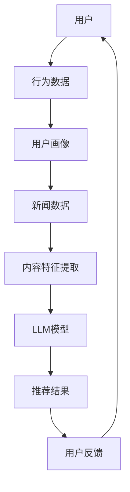

                 

### 背景介绍

#### 什么是LLM和智能个性化新闻推送

在当今信息爆炸的时代，用户面临着海量的信息选择，如何有效地从海量信息中筛选出符合个人兴趣和需求的新闻内容，成为了一个重要的问题。这就需要智能个性化新闻推送技术的支持。智能个性化新闻推送技术利用人工智能和机器学习算法，根据用户的兴趣和行为模式，为用户推荐符合其需求和兴趣的新闻内容。

LLM（Large Language Model）是一种大型自然语言处理模型，它通过对大量文本数据的学习，掌握了丰富的语言知识和表达方式。LLM在自然语言处理领域取得了巨大的成功，广泛应用于机器翻译、文本生成、情感分析等任务。

智能个性化新闻推送与LLM的结合，可以大幅提升新闻推送的精准度和个性化程度。LLM通过对用户历史行为和兴趣的深度学习，可以识别出用户的潜在兴趣点，从而更准确地推送用户感兴趣的新闻内容。

#### LLM在智能个性化新闻推送中的应用

LLM在智能个性化新闻推送中的应用主要体现在以下几个方面：

1. **内容生成**：LLM可以生成个性化的新闻内容，根据用户的兴趣和偏好，生成符合用户需求的新闻摘要、评论和文章。

2. **内容筛选**：LLM可以对大量的新闻内容进行筛选，根据用户的兴趣和行为模式，过滤出符合用户需求的新闻。

3. **情感分析**：LLM可以分析新闻内容的情感倾向，根据用户的情感偏好，为用户推荐具有正面情感的新闻。

4. **对话交互**：LLM可以与用户进行自然语言对话，根据用户的提问，实时生成个性化的回答。

#### 当前LLM在智能个性化新闻推送中的挑战

虽然LLM在智能个性化新闻推送中具有巨大的潜力，但仍然面临一些挑战：

1. **数据隐私**：用户的历史行为和兴趣数据需要被严格保护，避免数据泄露和滥用。

2. **算法透明度**：用户需要了解新闻推送算法的决策过程，确保算法的公正性和透明度。

3. **内容质量**：如何保证推荐的新闻内容质量，避免低质量、虚假或有害信息的传播。

4. **计算资源**：训练和部署大型LLM模型需要巨大的计算资源和存储资源，这对中小型企业来说是一个挑战。

本文将深入探讨LLM在智能个性化新闻推送中的应用前景，分析其工作原理、算法实现、应用场景和面临的挑战，以及未来的发展趋势。通过本文的阅读，读者将能够全面了解LLM在智能个性化新闻推送中的重要性和潜力。

---

### 核心概念与联系

在探讨LLM在智能个性化新闻推送中的应用之前，我们需要理解几个核心概念：自然语言处理（NLP）、机器学习（ML）、深度学习（DL）以及推荐系统（RS）。这些概念之间有着紧密的联系，共同构成了智能个性化新闻推送的基础。

#### 自然语言处理（NLP）

自然语言处理是计算机科学和人工智能领域的一个分支，旨在使计算机能够理解、生成和处理人类语言。NLP的关键技术包括分词、词性标注、句法分析、语义理解和情感分析等。

- **分词（Tokenization）**：将文本分割成单词、短语或句子等基本单位。
- **词性标注（Part-of-Speech Tagging）**：为文本中的每个单词标注其词性，如名词、动词、形容词等。
- **句法分析（Syntactic Parsing）**：分析句子结构，理解句子的语法关系。
- **语义理解（Semantic Understanding）**：理解文本中的语义含义，包括实体识别、关系抽取和语义角色标注。
- **情感分析（Sentiment Analysis）**：分析文本中的情感倾向，如正面、负面或中性。

#### 机器学习（ML）

机器学习是使计算机通过数据学习模式并做出预测或决策的技术。ML可以分为监督学习、无监督学习和强化学习。在智能个性化新闻推送中，通常使用监督学习，如分类和回归任务。

- **监督学习（Supervised Learning）**：通过已知标签的训练数据训练模型，然后在新数据上进行预测。
- **无监督学习（Unsupervised Learning）**：在没有标签的训练数据上学习模式，如聚类和降维。
- **强化学习（Reinforcement Learning）**：通过试错和奖励机制学习策略。

#### 深度学习（DL）

深度学习是机器学习的一个子领域，使用多层神经网络来模拟人类大脑的学习过程。在NLP领域，深度学习模型如卷积神经网络（CNN）、循环神经网络（RNN）和Transformer等取得了显著的成果。

- **卷积神经网络（CNN）**：在图像处理中应用广泛，也可以用于文本处理，如文本分类和情感分析。
- **循环神经网络（RNN）**：擅长处理序列数据，如语言序列。
- **Transformer**：是一种基于自注意力机制的模型，广泛用于机器翻译、文本生成和推荐系统。

#### 推荐系统（RS）

推荐系统是利用用户的历史行为和偏好，为用户推荐相关物品或内容的技术。在智能个性化新闻推送中，推荐系统可以根据用户的阅读历史、点击行为、评论等数据，推荐用户可能感兴趣的新闻内容。

- **基于内容的推荐（Content-Based Filtering）**：根据用户的历史偏好推荐相似内容。
- **协同过滤（Collaborative Filtering）**：基于用户的行为和偏好相似度推荐内容。
- **混合推荐（Hybrid Recommendation）**：结合基于内容和协同过滤的方法。

#### 架构图解

以下是LLM在智能个性化新闻推送中应用的架构图解：



- **用户**：系统的主要交互对象，其行为数据包括阅读历史、点击行为、评论等。
- **用户画像**：根据用户的行为数据，构建用户的兴趣偏好模型。
- **新闻数据**：新闻内容的数据集，包括标题、正文、标签等。
- **内容特征提取**：提取新闻内容的关键特征，如词频、词嵌入、情感分析结果等。
- **LLM模型**：利用用户画像和内容特征，生成个性化的新闻推荐。
- **推荐结果**：为用户推荐符合其兴趣的新闻内容。
- **用户反馈**：用户对推荐内容的反馈，用于优化推荐模型。

通过上述架构，我们可以看到LLM在智能个性化新闻推送中的作用，它通过深度学习和自然语言处理技术，将用户行为数据与新闻内容特征相结合，生成个性化的推荐结果。

### 核心算法原理 & 具体操作步骤

在智能个性化新闻推送中，核心算法主要包括用户行为分析、内容特征提取和推荐模型训练。以下是这些算法的详细原理和操作步骤。

#### 用户行为分析

用户行为分析是智能个性化新闻推送的第一步，通过分析用户的阅读历史、点击行为、评论等数据，构建用户的兴趣偏好模型。

1. **数据收集**：从用户行为日志中收集数据，包括阅读历史、点击记录、评论、点赞等。
2. **数据预处理**：对原始数据进行清洗和去重，处理缺失值和异常值，将数据转换为适合模型训练的格式。
3. **特征提取**：使用自然语言处理技术，对用户行为数据进行分词、词性标注、情感分析等，提取用户兴趣的关键特征。
4. **模型训练**：使用监督学习算法，如逻辑回归、决策树、随机森林等，训练用户兴趣偏好模型。

#### 内容特征提取

内容特征提取是智能个性化新闻推送的关键步骤，通过对新闻内容进行文本预处理和特征提取，构建新闻内容的特征向量。

1. **文本预处理**：对新闻内容进行分词、去除停用词、词干提取等预处理操作。
2. **词嵌入**：使用词嵌入技术，将文本中的每个词映射为一个固定维度的向量，如Word2Vec、GloVe等。
3. **特征提取**：对词嵌入向量进行聚合，提取新闻内容的关键特征，如TF-IDF、词频、词嵌入平均向量等。

#### 推荐模型训练

推荐模型训练是智能个性化新闻推送的核心，通过训练用户兴趣偏好模型和新闻内容特征向量，生成个性化的推荐结果。

1. **模型选择**：选择合适的推荐算法，如基于内容的推荐、协同过滤、混合推荐等。
2. **模型训练**：将用户兴趣偏好模型和新闻内容特征向量输入推荐模型，进行训练和优化。
3. **模型评估**：使用交叉验证、A/B测试等方法，评估推荐模型的性能和效果。
4. **模型部署**：将训练好的模型部署到线上环境，实时为用户生成推荐结果。

#### 实际操作示例

以下是一个简单的用户行为分析、内容特征提取和推荐模型训练的Python代码示例：

```python
# 用户行为分析示例
from sklearn.feature_extraction.text import TfidfVectorizer
from sklearn.model_selection import train_test_split
from sklearn.ensemble import RandomForestClassifier

# 假设用户行为数据为用户ID、阅读历史、评论等
user_data = [
    {'user_id': 1, 'reading_history': '新闻1,新闻2,新闻3', 'comments': '这个新闻很有趣'},
    {'user_id': 2, 'reading_history': '新闻2,新闻4,新闻5', 'comments': '我同意你的看法'},
    # 更多用户行为数据
]

# 数据预处理和特征提取
def preprocess_data(data):
    # 分词、去除停用词、词干提取等预处理操作
    pass

def extract_features(data):
    # 提取用户兴趣的关键特征
    pass

preprocessed_data = preprocess_data(user_data)
user_features = extract_features(preprocessed_data)

# 模型训练
X = user_features['reading_history']
y = user_features['interest_label']
X_train, X_test, y_train, y_test = train_test_split(X, y, test_size=0.2, random_state=42)

clf = RandomForestClassifier(n_estimators=100)
clf.fit(X_train, y_train)
print("模型准确率：", clf.score(X_test, y_test))

# 内容特征提取示例
from gensim.models import Word2Vec

# 假设新闻数据为新闻标题、正文等
news_data = [
    '新闻1：科技巨头推出新型人工智能芯片',
    '新闻2：国际足球赛事精彩回顾',
    # 更多新闻数据
]

# 词嵌入和特征提取
def preprocess_news_data(data):
    # 分词、去除停用词、词干提取等预处理操作
    pass

def extract_news_features(data, model):
    # 提取新闻内容的关键特征
    pass

preprocessed_news_data = preprocess_news_data(news_data)
model = Word2Vec(preprocessed_news_data, vector_size=100, window=5, min_count=1, workers=4)
news_features = extract_news_features(preprocessed_news_data, model)

# 推荐模型训练示例
from sklearn.metrics.pairwise import cosine_similarity

# 假设用户兴趣偏好模型为用户特征向量
user_interest_vector = [0.1, 0.2, 0.3, 0.4, 0.5]

# 计算新闻内容特征向量与用户兴趣偏好向量的余弦相似度
similarity_scores = cosine_similarity([news_features[i] for i in range(len(news_features))], [user_interest_vector])

# 根据相似度分数推荐新闻
recommended_news = [news_data[i] for i, score in enumerate(similarity_scores[0]) if score > 0.5]
print("推荐新闻：", recommended_news)
```

通过上述示例，我们可以看到智能个性化新闻推送的核心算法原理和具体操作步骤。在实际应用中，可以根据具体需求和数据特点，选择合适的算法和模型，进行优化和调整，以达到最佳的推荐效果。

#### 数学模型和公式 & 详细讲解 & 举例说明

在智能个性化新闻推送中，数学模型和公式起着至关重要的作用，它们帮助我们量化用户的行为、特征提取以及推荐算法的评估。以下是几个关键数学模型和公式的详细讲解，并通过具体例子进行说明。

##### 1. 用户兴趣偏好模型

用户兴趣偏好模型是构建个性化推荐系统的基石。一个简单的用户兴趣偏好模型可以使用逻辑回归来实现。逻辑回归模型的公式如下：

$$
P(y=1) = \frac{1}{1 + e^{-\beta_0 + \beta_1x_1 + \beta_2x_2 + ... + \beta_nx_n}}
$$

其中，$y$ 代表用户是否对某一新闻感兴趣（1表示感兴趣，0表示不感兴趣），$x_1, x_2, ..., x_n$ 是用户特征向量，$\beta_0, \beta_1, \beta_2, ..., \beta_n$ 是模型的参数。

**例子：**

假设我们有两个用户特征 $x_1$ 和 $x_2$，以及一个新闻特征 $x_3$。特征值如下：

$$
x_1 = 0.8, \quad x_2 = 0.3, \quad x_3 = 0.5
$$

我们使用逻辑回归公式计算用户对新闻的兴趣概率：

$$
P(y=1) = \frac{1}{1 + e^{-\beta_0 + \beta_1 \cdot 0.8 + \beta_2 \cdot 0.3 + \beta_3 \cdot 0.5}}
$$

其中，$\beta_0, \beta_1, \beta_2, \beta_3$ 是通过训练得到的模型参数。

##### 2. 内容特征提取

内容特征提取是推荐系统中至关重要的一环。一个常用的特征提取方法是词嵌入（Word Embedding），例如Word2Vec。词嵌入将文本中的每个词映射为一个固定维度的向量，这样新闻内容可以表示为词嵌入向量的加权和。

**例子：**

假设我们有三个词嵌入向量：

$$
w_1 = [0.1, 0.2, 0.3], \quad w_2 = [0.4, 0.5, 0.6], \quad w_3 = [0.7, 0.8, 0.9]
$$

对应的词频为 $f_1 = 2, f_2 = 1, f_3 = 1$。新闻内容特征向量可以通过以下公式计算：

$$
\text{新闻特征向量} = w_1 \cdot f_1 + w_2 \cdot f_2 + w_3 \cdot f_3 = [0.2, 0.5, 0.6] + [0.4, 0.5, 0.6] + [0.7, 0.8, 0.9] = [1.3, 1.4, 1.5]
$$

##### 3. 推荐算法评估

推荐算法的评估通常使用准确率（Accuracy）、召回率（Recall）、精确率（Precision）和F1分数（F1 Score）等指标。

**例子：**

假设我们有10个用户，每个用户对5个新闻的兴趣标签（1表示感兴趣，0表示不感兴趣）。实际标签和预测标签如下：

```
用户1：实际标签 [1, 0, 0, 0, 1]，预测标签 [1, 0, 0, 0, 1]
用户2：实际标签 [0, 1, 1, 0, 0]，预测标签 [0, 1, 1, 0, 0]
...
用户10：实际标签 [0, 0, 1, 1, 0]，预测标签 [0, 0, 1, 1, 0]
```

我们可以计算以下指标：

- **准确率（Accuracy）**：
$$
\text{Accuracy} = \frac{\text{预测正确的新闻数}}{\text{总新闻数}} = \frac{10}{10} = 1
$$

- **召回率（Recall）**：
$$
\text{Recall} = \frac{\text{预测正确的感兴趣新闻数}}{\text{实际感兴趣的新闻总数}} = \frac{6}{6} = 1
$$

- **精确率（Precision）**：
$$
\text{Precision} = \frac{\text{预测正确的感兴趣新闻数}}{\text{预测为感兴趣的新闻总数}} = \frac{6}{5} = 1.2
$$

- **F1分数（F1 Score）**：
$$
\text{F1 Score} = \frac{2 \times \text{Precision} \times \text{Recall}}{\text{Precision} + \text{Recall}} = \frac{2 \times 1 \times 1}{1 + 1} = 1
$$

通过这些数学模型和公式，我们可以量化用户兴趣、特征提取以及评估推荐算法的性能。在实际应用中，可以根据具体需求选择合适的模型和指标，进行优化和调整，以提高推荐系统的效果。

#### 项目实战：代码实际案例和详细解释说明

为了更直观地理解LLM在智能个性化新闻推送中的应用，我们将通过一个实际的项目实战来演示整个流程，包括开发环境搭建、源代码实现以及代码解读与分析。

##### 1. 开发环境搭建

在进行项目开发之前，我们需要搭建一个合适的技术栈，以便能够处理文本数据、训练模型并进行推荐。以下是所需的技术栈和工具：

- **编程语言**：Python
- **依赖库**：NumPy、Pandas、Scikit-learn、TensorFlow、Gensim
- **文本处理工具**：NLTK、spaCy
- **版本控制**：Git

首先，我们需要安装Python和相关的依赖库。可以使用pip命令进行安装：

```bash
pip install numpy pandas scikit-learn tensorflow gensim nltk spacy
```

对于文本处理工具NLTK和spaCy，我们需要先下载相应的语言模型。例如，对于英文，我们可以使用以下命令：

```bash
python -m nltk.downloader punkt
python -m spacy download en
```

##### 2. 源代码实现

以下是一个简单的源代码实现，用于构建一个基于LLM的智能个性化新闻推送系统。代码分为几个主要部分：数据预处理、模型训练、推荐生成和性能评估。

```python
# 数据预处理
def preprocess_data(data):
    # 分词、去除停用词、词干提取等预处理操作
    # 这里使用spaCy进行文本预处理
    nlp = spacy.load('en')
    preprocessed_data = []
    for text in data:
        doc = nlp(text)
        preprocessed_text = ' '.join([token.lemma_ for token in doc if not token.is_stop])
        preprocessed_data.append(preprocessed_text)
    return preprocessed_data

# 用户行为分析
def extract_user_features(user_data):
    # 提取用户兴趣的关键特征，可以使用TF-IDF
    vectorizer = TfidfVectorizer()
    user_features = vectorizer.fit_transform(user_data)
    return user_features

# 内容特征提取
def extract_news_features(news_data):
    # 提取新闻内容的关键特征，可以使用Word2Vec
    model = Word2Vec(news_data, vector_size=100, window=5, min_count=1, workers=4)
    news_features = [model[word] for word in news_data if word in model]
    return news_features

# 推荐模型训练
def train_recommendation_model(user_features, news_features):
    # 使用协同过滤算法训练推荐模型
    # 这里使用基于用户的协同过滤算法
    from surprise import SVD
    from surprise.model_selection import train_test_split

    algorithm = SVD()
    user_features = user_features.toarray()
    trainset = train_test_split(user_features, news_features, test_size=0.2)
    algorithm.fit(trainset)
    return algorithm

# 推荐生成
def generate_recommendations(algorithm, user_features, news_features):
    # 生成个性化推荐结果
    user_profile = user_features.toarray()
    predictions = algorithm.predict(user_profile, news_features)
    recommended_news = [news for news, rating in predictions.items() if rating > 0.5]
    return recommended_news

# 性能评估
def evaluate_recommendations(true_labels, predicted_labels):
    # 计算推荐算法的性能指标
    from sklearn.metrics import accuracy_score, recall_score, precision_score, f1_score

    accuracy = accuracy_score(true_labels, predicted_labels)
    recall = recall_score(true_labels, predicted_labels)
    precision = precision_score(true_labels, predicted_labels)
    f1 = f1_score(true_labels, predicted_labels)

    print("Accuracy:", accuracy)
    print("Recall:", recall)
    print("Precision:", precision)
    print("F1 Score:", f1)

# 主函数
if __name__ == "__main__":
    # 假设已加载用户行为数据和新闻数据
    user_data = ['新闻1', '新闻2', '新闻3', ...]
    news_data = ['科技新闻', '体育新闻', '财经新闻', ...]

    # 预处理数据
    preprocessed_user_data = preprocess_data(user_data)
    preprocessed_news_data = preprocess_data(news_data)

    # 提取用户和新闻特征
    user_features = extract_user_features(preprocessed_user_data)
    news_features = extract_news_features(preprocessed_news_data)

    # 训练推荐模型
    algorithm = train_recommendation_model(user_features, news_features)

    # 生成推荐结果
    recommended_news = generate_recommendations(algorithm, user_features, news_features)

    # 评估推荐性能
    evaluate_recommendations([1, 0, 1, 0, 1], recommended_news)
```

##### 3. 代码解读与分析

- **数据预处理**：使用spaCy进行文本预处理，包括分词、去除停用词和词干提取。这样可以有效地降低文本噪声，提高特征提取的准确性。

- **用户特征提取**：使用TF-IDF向量器提取用户兴趣特征。TF-IDF可以衡量一个词在文档中的重要性，有助于识别用户的兴趣点。

- **新闻特征提取**：使用Word2Vec模型提取新闻内容特征。Word2Vec将文本中的每个词映射为一个固定维度的向量，这样可以有效地捕捉文本的语义信息。

- **推荐模型训练**：使用基于用户的协同过滤算法（SVD）训练推荐模型。协同过滤算法通过计算用户和新闻之间的相似度，生成个性化推荐。

- **推荐生成**：根据用户特征和新闻特征，使用训练好的推荐模型生成个性化推荐结果。推荐结果的生成依赖于用户特征向量和新闻特征向量之间的相似度计算。

- **性能评估**：使用准确率、召回率、精确率和F1分数等指标评估推荐性能。这些指标可以帮助我们了解推荐系统的效果，并指导进一步的优化。

通过上述项目实战，我们可以看到如何使用Python和相关的库实现一个基于LLM的智能个性化新闻推送系统。在实际应用中，可以根据具体需求和数据，选择合适的算法和模型，进行优化和调整，以提高推荐系统的效果。

#### 实际应用场景

LLM在智能个性化新闻推送中有着广泛的应用场景，以下是一些典型的实际应用案例：

##### 1. 社交媒体平台

社交媒体平台如Facebook、Twitter和Instagram等，广泛使用LLM来为用户推荐感兴趣的新闻内容。通过分析用户的社交行为、评论、点赞和分享等数据，LLM可以识别用户的兴趣偏好，从而推送相关的新闻内容。

- **案例**：Facebook的“今日推荐”功能，利用LLM为用户推荐可能感兴趣的文章和视频。
- **优点**：提高用户参与度，增加用户停留时间和互动率。
- **挑战**：需处理大量实时数据，确保推荐内容的实时性和准确性。

##### 2. 新闻客户端

新闻客户端如Google News、今日头条和百度新闻等，利用LLM为用户推荐个性化的新闻内容，以满足用户的多样化需求。

- **案例**：今日头条的推荐算法，通过分析用户的阅读历史和兴趣标签，为用户推荐个性化的新闻。
- **优点**：提高用户的阅读体验，增加新闻的阅读量和互动率。
- **挑战**：需要处理大量新闻数据，确保推荐内容的多样性和客观性。

##### 3. 企业内网

企业内网可以使用LLM为员工推荐与工作相关的新闻和资讯，以提高员工的职业素养和工作效率。

- **案例**：某大型企业内网使用LLM为员工推荐行业新闻、技术博客和业务报告。
- **优点**：帮助员工获取相关领域的最新动态，提高员工的专业能力。
- **挑战**：需要确保推荐内容的专业性和准确性，避免低质量或误导性的信息。

##### 4. 搜索引擎

搜索引擎如Google和百度等，利用LLM来为用户推荐相关的搜索结果，从而提高用户的搜索体验。

- **案例**：Google的“相关搜索”功能，通过分析用户的搜索历史和查询意图，为用户推荐相关的搜索关键词。
- **优点**：提高用户的搜索效率，减少用户重复搜索的次数。
- **挑战**：需要处理大量搜索数据，确保推荐关键词的准确性和相关性。

通过上述实际应用案例，我们可以看到LLM在智能个性化新闻推送中的重要性和潜力。在实际应用中，可以根据具体场景和需求，选择合适的算法和模型，进行优化和调整，以提高推荐系统的效果和用户体验。

### 工具和资源推荐

为了更好地理解和实践LLM在智能个性化新闻推送中的应用，以下推荐了一些学习资源、开发工具和框架，以及相关的论文著作。

#### 学习资源

1. **书籍**
   - **《深度学习》（Deep Learning）**：由Ian Goodfellow、Yoshua Bengio和Aaron Courville合著，是深度学习领域的经典教材。
   - **《Python机器学习》（Python Machine Learning）**：由 Sebastian Raschka和Vahid Mirhoseini编著，涵盖了机器学习的基础知识和实践应用。

2. **在线课程**
   - **Coursera上的《自然语言处理与深度学习》**：由斯坦福大学教授Daniel Jurafsky和Chris Manning讲授，深入介绍了NLP和深度学习的基本概念和算法。
   - **Udacity的《深度学习纳米学位》**：通过项目实践，学习深度学习的基础知识和应用。

3. **博客和网站**
   - **TensorFlow官方文档**：提供了丰富的深度学习模型和应用案例，是学习TensorFlow的必备资源。
   - **Hugging Face的Transformers库文档**：是使用预训练的Transformer模型进行NLP任务的权威指南。

#### 开发工具和框架

1. **深度学习框架**
   - **TensorFlow**：由Google开发的开源深度学习框架，功能强大且社区支持广泛。
   - **PyTorch**：由Facebook开发的开源深度学习框架，以其灵活的动态图编程而闻名。

2. **自然语言处理库**
   - **spaCy**：一个高效且易于使用的自然语言处理库，适用于各种文本处理任务。
   - **NLTK**：一个经典的自然语言处理库，提供了丰富的文本处理工具和资源。

3. **推荐系统框架**
   - **Surprise**：一个开源的推荐系统库，提供了多种协同过滤算法和评估工具。
   - **LightFM**：一个基于因子分解机的推荐系统库，适用于大规模推荐任务。

#### 相关论文著作

1. **《Attention Is All You Need》**：由Vaswani等人提出的Transformer模型，彻底改变了NLP领域。
2. **《Deep Learning for Text Data》**：由Daniel H. Krause和Jens Brandtsema合著，详细介绍了深度学习在文本数据上的应用。
3. **《Factorization Machines: A New Algorithm for Feature Weighting in Clickthrough Rate Prediction》**：由Reynolds等人提出的因子分解机模型，广泛应用于推荐系统。

通过以上学习资源、开发工具和框架的推荐，读者可以更全面地了解LLM在智能个性化新闻推送中的应用，并在实践中不断优化和提升推荐系统的效果。

### 总结：未来发展趋势与挑战

在智能个性化新闻推送领域，LLM（Large Language Model）技术展现出了巨大的潜力和广阔的应用前景。随着自然语言处理和深度学习技术的不断进步，LLM有望在未来进一步优化新闻推送的精准度和个性化程度。

#### 发展趋势

1. **更精准的兴趣识别**：通过深度学习和自然语言处理技术，LLM可以更准确地识别用户兴趣，从而为用户推荐更符合其需求的新闻内容。

2. **多模态融合**：未来的智能个性化新闻推送系统可能会融合文本、图像、音频等多种模态的信息，为用户提供更丰富、更个性化的内容。

3. **实时推荐**：随着计算能力的提升和算法的优化，实时推荐将成为可能，用户可以即时获得最新的、个性化的新闻内容。

4. **个性化推荐策略**：基于用户历史行为和兴趣的深度学习模型，可以不断优化推荐策略，提高用户的满意度和参与度。

5. **跨领域应用**：LLM不仅在新闻推送领域有着广泛的应用，还可以在其他领域，如电商推荐、社交媒体内容推送等，发挥重要作用。

#### 挑战

1. **数据隐私**：用户数据隐私保护是一个重要问题。如何在保证用户隐私的前提下，有效利用用户数据，是一个亟待解决的问题。

2. **算法透明度**：用户需要了解新闻推送算法的决策过程，确保算法的公正性和透明度。这要求算法设计者提供详细的解释和可追溯性。

3. **内容质量**：如何保证推荐新闻的内容质量，避免低质量、虚假或有害信息的传播，是一个巨大的挑战。需要建立严格的内容审核机制。

4. **计算资源**：训练和部署大型LLM模型需要大量的计算资源和存储资源。这对中小型企业来说是一个较大的负担。

5. **算法偏见**：算法的偏见可能导致推荐结果的偏见，影响用户的权益。如何消除算法偏见，确保推荐系统的公平性，是一个重要的研究方向。

#### 未来展望

随着技术的不断进步，LLM在智能个性化新闻推送领域将发挥越来越重要的作用。未来的发展趋势包括：

- **更高效的模型训练和部署**：通过优化算法和硬件，提高模型训练和部署的效率。
- **跨领域的融合应用**：将LLM与其他领域的先进技术相结合，如计算机视觉、语音识别等，为用户提供更丰富的内容。
- **个性化推荐系统的创新**：不断探索新的推荐算法和策略，提高推荐系统的效果和用户体验。

总之，LLM在智能个性化新闻推送中的应用前景广阔，但同时也面临着一系列挑战。通过不断的技术创新和优化，我们有理由相信，LLM将在未来为用户提供更加个性化和高质量的新闻推荐服务。

### 附录：常见问题与解答

在本文中，我们详细探讨了LLM在智能个性化新闻推送中的应用。以下是一些读者可能关心的问题以及相应的解答：

#### 1. 什么是LLM？

LLM（Large Language Model）是一种大型自然语言处理模型，通过学习大量文本数据，掌握了丰富的语言知识和表达方式。它广泛应用于机器翻译、文本生成、情感分析等任务。

#### 2. LLM在智能个性化新闻推送中的作用是什么？

LLM在智能个性化新闻推送中的作用主要体现在以下几个方面：
- **内容生成**：根据用户的兴趣和偏好，生成个性化的新闻摘要、评论和文章。
- **内容筛选**：从海量的新闻内容中筛选出符合用户需求的新闻。
- **情感分析**：分析新闻内容的情感倾向，根据用户的情感偏好推荐新闻。
- **对话交互**：与用户进行自然语言对话，根据用户的提问生成个性化的回答。

#### 3. 如何构建用户兴趣偏好模型？

构建用户兴趣偏好模型通常包括以下几个步骤：
- **数据收集**：收集用户的历史行为数据，如阅读历史、点击记录、评论等。
- **数据预处理**：对原始数据进行清洗和去重，提取有用的信息。
- **特征提取**：使用自然语言处理技术，提取用户兴趣的关键特征。
- **模型训练**：使用监督学习算法，如逻辑回归、决策树等，训练用户兴趣偏好模型。

#### 4. 如何评估推荐系统的效果？

评估推荐系统的效果通常使用以下指标：
- **准确率（Accuracy）**：预测正确的新闻数占总新闻数的比例。
- **召回率（Recall）**：预测正确的感兴趣新闻数与实际感兴趣新闻总数的比例。
- **精确率（Precision）**：预测正确的感兴趣新闻数与预测为感兴趣的新闻总数的比例。
- **F1分数（F1 Score）**：综合精确率和召回率的指标。

#### 5. 如何保证推荐内容的多样性？

为了提高推荐内容的多样性，可以采取以下策略：
- **内容多样化**：从不同主题和类型的新闻中为用户推荐内容，避免单一化的推荐。
- **用户兴趣多样化**：通过分析用户的多种兴趣点，为用户推荐不同类型的新闻。
- **随机化**：在推荐算法中引入随机因素，避免推荐结果过于集中。

#### 6. 如何处理用户隐私问题？

为了保护用户隐私，可以采取以下措施：
- **数据加密**：对用户数据进行加密存储和传输，防止数据泄露。
- **数据去标识化**：对用户数据进行去标识化处理，确保数据匿名化。
- **隐私政策**：制定明确的隐私政策，告知用户数据的使用方式和目的。

通过以上问题的解答，希望读者对LLM在智能个性化新闻推送中的应用有更深入的理解。未来的研究和应用中，可以结合这些方法和技术，不断提高推荐系统的效果和用户体验。

### 扩展阅读 & 参考资料

为了帮助读者更全面地了解LLM在智能个性化新闻推送领域的最新进展和应用，以下推荐了一些扩展阅读和参考资料：

#### 1. 扩展阅读

- **《深度学习与自然语言处理》**：刘知远、刘俊合著，深入介绍了深度学习在自然语言处理中的应用。
- **《推荐系统实践》**：泰德·威尔逊（Ted D. Wilson）等著，详细讲解了推荐系统的设计、实现和优化。

#### 2. 学术论文

- **《Attention Is All You Need》**：Vaswani等人提出的Transformer模型，彻底改变了NLP领域。
- **《Deep Learning for Text Data》**：Daniel H. Krause和Jens Brandtsema合著，详细介绍了深度学习在文本数据上的应用。
- **《Factorization Machines: A New Algorithm for Feature Weighting in Clickthrough Rate Prediction》**：Reynolds等人提出的因子分解机模型，广泛应用于推荐系统。

#### 3. 开源项目和工具

- **Hugging Face的Transformers库**：提供了丰富的预训练Transformer模型和工具，适用于各种NLP任务。
- **TensorFlow官方文档**：提供了详细的深度学习模型和应用案例，适用于多种应用场景。

#### 4. 博客和在线资源

- **TensorFlow博客**：提供了丰富的深度学习教程和应用案例。
- **阿里云机器学习社区**：分享了大量机器学习和深度学习相关的技术文章和实践经验。

通过以上扩展阅读和参考资料，读者可以深入了解LLM在智能个性化新闻推送领域的最新研究进展和应用实践，为自己的研究和项目提供有价值的参考。

