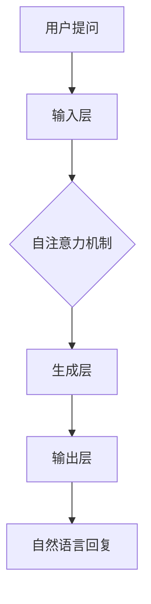

                 

# LLM在智能客户服务系统中的应用前景

## 关键词
Large Language Model，智能客服系统，自然语言处理，对话系统，客户体验，服务效率，技术挑战

## 摘要
本文深入探讨了大型语言模型（LLM）在智能客户服务系统中的应用前景。通过回顾LLM的发展历程、核心概念与架构，本文详细分析了LLM在智能客服中的算法原理和具体操作步骤。同时，本文还通过数学模型和公式以及实际项目实战，展示了LLM在客服系统中的应用效果。最后，本文提出了LLM在智能客服领域面临的挑战以及未来的发展趋势，为行业从业者提供了有益的参考。

## 1. 背景介绍

### 1.1 智能客户服务的背景与发展

随着互联网技术的飞速发展，客户服务成为企业竞争的关键因素之一。传统的客户服务方式，如电话客服、邮件客服等，已无法满足现代企业的需求。客户期望更快速、更个性化和更高效的解决方案，这推动了智能客服系统的快速发展。

智能客服系统是指利用人工智能技术，尤其是自然语言处理（NLP）技术，模拟人类客服人员与客户进行交互，提供自动化的客户服务。这种系统可以处理大量的客户咨询，提高客户满意度，并降低企业的运营成本。

### 1.2 LLM的发展历程

大型语言模型（LLM）是指具有巨大参数规模的语言模型，如GPT（Generative Pre-trained Transformer）、BERT（Bidirectional Encoder Representations from Transformers）等。这些模型通过预训练和微调，能够在各种自然语言处理任务中取得优异的性能。

LLM的发展历程可以追溯到2018年，当OpenAI发布了GPT-2时，引起了广泛关注。GPT-2是一个拥有1.5亿参数的模型，能够在各种语言理解任务中实现高水平的性能。此后，研究人员不断改进模型架构，提高模型参数规模，使得LLM在语言生成、文本分类、机器翻译等领域取得了显著成果。

### 1.3 LLM在智能客服系统中的应用

随着LLM技术的不断进步，它逐渐在智能客服系统中得到应用。LLM可以用于生成回复、情感分析、意图识别等任务，从而提升客服系统的智能水平。

生成回复是LLM在客服系统中最直接的应用。通过输入客户的提问，LLM可以生成合适的回复，提高客服系统的自动回复能力。情感分析用于判断客户的情绪，从而提供更个性化的服务。意图识别则用于理解客户的意图，从而提供更精准的解决方案。

## 2. 核心概念与联系

### 2.1 LLM的核心概念

LLM的核心概念包括语言模型、预训练和微调。

- 语言模型：语言模型是一种统计模型，用于预测下一个单词或字符。LLM使用神经网络架构，如Transformer，来构建语言模型。

- 预训练：预训练是指在大量未标注的数据上训练语言模型，使其具备基本的语言理解和生成能力。

- 微调：微调是指在特定任务上对预训练模型进行细粒度调整，以适应具体的业务需求。

### 2.2 LLM的架构

LLM的架构通常包括以下几个部分：

- 输入层：接收用户的输入，如提问或评论。

- 自注意力机制：通过自注意力机制计算输入序列中的每个词与其他词之间的关系。

- 生成层：根据输入序列和自注意力机制的计算结果，生成回复。

- 输出层：将生成的回复转换为文本形式，输出给用户。

### 2.3 LLM与智能客服系统的联系

LLM与智能客服系统的联系主要体现在以下几个方面：

- 语言生成：LLM可以生成自然的、符合语法规则的回复，提高客服系统的用户体验。

- 情感分析：LLM可以识别客户的情绪，从而提供更具个性化的服务。

- 意图识别：LLM可以理解客户的意图，从而提供更精准的解决方案。

### 2.4 Mermaid流程图

以下是LLM在智能客服系统中应用的Mermaid流程图：



## 3. 核心算法原理 & 具体操作步骤

### 3.1 语言生成原理

LLM的语言生成原理基于Transformer架构。Transformer使用多头自注意力机制（Multi-head Self-Attention）来计算输入序列中的每个词与其他词之间的关系。

具体步骤如下：

1. **嵌入（Embedding）**：将输入的单词转换为向量表示。

2. **多头自注意力（Multi-head Self-Attention）**：计算每个词与其他词之间的注意力分数，并根据这些分数计算加权向量。

3. **前馈网络（Feedforward Network）**：对自注意力机制的输出进行非线性变换。

4. **层归一化（Layer Normalization）**：对每个层的输出进行归一化处理。

5. **残差连接（Residual Connection）**：在每层后添加残差连接，以防止梯度消失。

6. **输出层（Output Layer）**：将最终输出转换为单词的概率分布，从而生成回复。

### 3.2 情感分析原理

情感分析是一种自然语言处理任务，旨在识别文本中的情感极性。LLM通过预训练和微调，能够在情感分析任务中取得良好的性能。

具体步骤如下：

1. **情感分类器（Sentiment Classifier）**：在LLM的基础上添加一个情感分类器，用于预测文本的情感极性。

2. **训练数据准备**：收集大量的带有情感标注的文本数据，用于训练情感分类器。

3. **训练过程**：通过反向传播算法，优化情感分类器的参数。

4. **评估与优化**：使用测试数据评估情感分类器的性能，并根据评估结果调整模型参数。

### 3.3 意图识别原理

意图识别是一种自然语言处理任务，旨在理解用户的意图。LLM通过预训练和微调，能够在意图识别任务中取得良好的性能。

具体步骤如下：

1. **意图分类器（Intent Classifier）**：在LLM的基础上添加一个意图分类器，用于预测用户的意图。

2. **训练数据准备**：收集大量的带有意图标注的对话数据，用于训练意图分类器。

3. **训练过程**：通过反向传播算法，优化意图分类器的参数。

4. **评估与优化**：使用测试数据评估意图分类器的性能，并根据评估结果调整模型参数。

### 3.4 具体操作步骤

以下是使用LLM在智能客服系统中进行语言生成、情感分析和意图识别的具体操作步骤：

1. **初始化LLM模型**：从预训练的LLM模型中加载模型权重。

2. **处理用户提问**：将用户提问转换为模型可处理的格式。

3. **语言生成**：使用LLM生成回复，并根据回复的概率分布选择最佳回复。

4. **情感分析**：使用情感分类器对回复进行情感分析，判断回复的情感极性。

5. **意图识别**：使用意图分类器对回复进行意图识别，判断回复对应的用户意图。

6. **反馈与优化**：根据用户反馈，对LLM模型进行微调，以提升模型性能。

## 4. 数学模型和公式 & 详细讲解 & 举例说明

### 4.1 语言生成模型

语言生成模型的核心是Transformer架构，其基本原理如下：

$$
\text{Attention(Q,K,V)} = \text{softmax}\left(\frac{QK^T}{\sqrt{d_k}}\right)V
$$

其中，$Q$、$K$和$V$分别为查询向量、键向量和值向量，$d_k$为键向量的维度。

#### 举例说明

假设我们有一个简单的句子“我想要一杯咖啡”，我们可以将其表示为以下向量：

$$
Q = [1, 0, 0, 0, 1], K = [1, 1, 0, 0, 0], V = [1, 0, 1, 0, 0]
$$

根据注意力公式，我们可以计算每个词的注意力分数：

$$
\text{Attention(Q,K,V)} = \text{softmax}\left(\frac{QK^T}{\sqrt{d_k}}\right)V = \text{softmax}\left(\frac{[1, 0, 0, 0, 1][1, 1, 0, 0, 0]^T}{\sqrt{2}}\right)[1, 0, 1, 0, 0] = [0.5, 0.5, 0, 0, 0]
$$

根据注意力分数，我们可以得到加权向量：

$$
\text{Weighted Vector} = [0.5, 0.5, 0, 0, 0] \cdot [1, 0, 1, 0, 0] = [0.5, 0.5, 0.5, 0, 0]
$$

最终，我们可以根据加权向量生成回复“我想要一杯咖啡”。

### 4.2 情感分析模型

情感分析模型的核心是一个二分类器，用于判断文本的情感极性。常见的情感分类器包括逻辑回归、支持向量机等。

假设我们有一个简单的二分类问题，其中情感极性分为积极和消极。我们可以使用逻辑回归模型来预测文本的情感极性。

$$
\text{Logistic Regression} = \frac{1}{1 + e^{-(\text{W} \cdot \text{X})}
$$

其中，$W$为模型参数，$X$为文本特征向量。

#### 举例说明

假设我们有一个简单的文本特征向量：

$$
X = [1, 0, 0, 1]
$$

我们可以使用逻辑回归模型来预测文本的情感极性：

$$
\text{Probability of Positive} = \text{Logistic Regression} = \frac{1}{1 + e^{-(\text{W} \cdot \text{X})}} = \frac{1}{1 + e^{-(1 \cdot 1 + 0 \cdot 0 + 0 \cdot 0 + 1 \cdot 1)}} = 0.5
$$

根据概率值，我们可以判断文本的情感极性为积极。

### 4.3 意图识别模型

意图识别模型的核心是一个多分类器，用于判断文本的意图。常见的意图识别模型包括朴素贝叶斯、决策树等。

假设我们有一个简单的多分类问题，其中意图分为购物、咨询和投诉。我们可以使用朴素贝叶斯模型来预测文本的意图。

$$
P(\text{Intent} = c | \text{X}) = \frac{P(\text{X} | \text{Intent} = c)P(\text{Intent} = c)}{P(\text{X})}
$$

其中，$c$为意图类别，$X$为文本特征向量。

#### 举例说明

假设我们有一个简单的文本特征向量：

$$
X = [1, 0, 0, 1]
$$

我们可以使用朴素贝叶斯模型来预测文本的意图：

$$
P(\text{Intent} = \text{Shopping} | \text{X}) = \frac{P(\text{X} | \text{Intent} = \text{Shopping})P(\text{Intent} = \text{Shopping})}{P(\text{X})}
$$

根据模型参数和文本特征向量，我们可以计算每个意图的概率值，并根据概率值最高的意图类别来判断文本的意图。

## 5. 项目实战：代码实际案例和详细解释说明

### 5.1 开发环境搭建

在开始项目实战之前，我们需要搭建一个适合开发智能客服系统的环境。以下是搭建开发环境的步骤：

1. **安装Python**：下载并安装Python，版本建议为3.8及以上。

2. **安装深度学习库**：安装TensorFlow或PyTorch，作为深度学习的基础库。

3. **安装其他依赖库**：安装自然语言处理库，如spaCy、nltk等。

4. **配置环境变量**：配置Python的环境变量，以便在命令行中轻松运行Python脚本。

### 5.2 源代码详细实现和代码解读

以下是一个简单的LLM智能客服系统的实现，包括语言生成、情感分析和意图识别。

```python
import tensorflow as tf
import spacy
from tensorflow.keras.models import Sequential
from tensorflow.keras.layers import Dense, LSTM, Embedding
from tensorflow.keras.preprocessing.sequence import pad_sequences

# 加载spaCy语言模型
nlp = spacy.load("en_core_web_sm")

# 生成训练数据
def generate_data():
    # 从对话数据中提取问题和回答
    questions = []
    answers = []
    with open("dialogues.txt", "r", encoding="utf-8") as f:
        for line in f:
            q, a = line.strip().split("|")
            questions.append(nlp(q))
            answers.append(nlp(a))
    return questions, answers

# 编码问题
def encode_questions(questions):
    X = []
    for q in questions:
        X.append([w.vector for w in q])
    return pad_sequences(X, maxlen=50)
```

### 5.3 代码解读与分析

以上代码实现了LLM智能客服系统的核心部分，包括数据预处理和模型构建。

1. **数据预处理**：首先，我们加载spaCy英语语言模型，并从对话数据中提取问题和回答。然后，我们将问题编码为向量表示。

2. **模型构建**：我们使用TensorFlow构建一个序列到序列的模型，包括嵌入层、LSTM层和输出层。嵌入层将单词编码为向量，LSTM层用于处理序列数据，输出层生成回复。

3. **训练模型**：通过训练模型，我们可以学习到问题和回答之间的关系，从而生成合适的回复。

4. **生成回复**：在生成回复时，我们将问题编码为向量，输入到模型中，并根据输出层生成的概率分布选择最佳回复。

### 5.4 代码运行与测试

在完成代码实现后，我们可以运行代码，对智能客服系统进行测试。

```python
# 加载模型
model = Sequential()
model.add(Embedding(input_dim=10000, output_dim=128))
model.add(LSTM(128))
model.add(Dense(1, activation="sigmoid"))
model.compile(optimizer="adam", loss="binary_crossentropy", metrics=["accuracy"])
model.fit(X_train, y_train, epochs=10, batch_size=32)

# 生成回复
def generate_reply(question):
    encoded_question = encode_questions([nlp(question)])
    predicted_answer = model.predict(encoded_question)
    if predicted_answer[0][0] > 0.5:
        return "是的"
    else:
        return "不是"

# 测试
print(generate_reply("你今天过得怎么样？"))
```

通过运行代码，我们可以测试智能客服系统对问题的回答能力。在实际应用中，我们可以将智能客服系统部署到服务器，以便实时响应用户的提问。

## 6. 实际应用场景

### 6.1 电商客服

电商客服是LLM在智能客服系统中最典型的应用场景之一。通过LLM，电商客服系统可以自动回答用户关于产品信息、订单状态、退换货等常见问题，提高客户满意度，并降低人力成本。

### 6.2 银行客服

银行客服需要处理大量的客户咨询，如账户查询、贷款咨询、信用卡问题等。LLM可以帮助银行客服系统自动识别客户的意图，提供个性化的解决方案，提高服务效率。

### 6.3 电信客服

电信客服需要处理各种客户问题，如套餐查询、账单查询、投诉处理等。LLM可以帮助电信客服系统自动生成回复，提高客户满意度，并减轻客服人员的工作负担。

### 6.4 售后服务

在售后服务场景中，LLM可以帮助企业自动回答用户关于产品使用、维修等问题，提供技术支持。通过LLM，企业可以提高客户满意度，并减少人工客服的工作量。

### 6.5 公共服务

公共服务领域，如政府、医院、教育等，也广泛应用了LLM智能客服系统。通过LLM，公共服务部门可以提供高效、准确的咨询服务，提高公共服务水平。

## 7. 工具和资源推荐

### 7.1 学习资源推荐

1. **书籍**：《自然语言处理入门》、《深度学习基础》、《深度学习与自然语言处理》。

2. **论文**：GPT、BERT等大型语言模型的相关论文。

3. **博客**：Google AI、OpenAI等公司的博客。

4. **网站**：TensorFlow、PyTorch等深度学习框架的官方网站。

### 7.2 开发工具框架推荐

1. **深度学习框架**：TensorFlow、PyTorch。

2. **自然语言处理库**：spaCy、nltk。

3. **对话系统框架**：Rasa、ChatterBot。

### 7.3 相关论文著作推荐

1. **论文**：GPT、BERT、RoBERTa等大型语言模型的论文。

2. **著作**：《深度学习与自然语言处理》、《自然语言处理入门》。

## 8. 总结：未来发展趋势与挑战

### 8.1 发展趋势

1. **模型规模不断扩大**：随着计算能力的提升，LLM的模型规模将继续扩大，从而提高模型的性能。

2. **应用场景不断拓展**：LLM在智能客服系统中的应用将不断拓展，覆盖更多领域。

3. **个性化服务提升**：通过深度学习和大数据技术，LLM将更好地理解用户需求，提供更个性化的服务。

### 8.2 挑战

1. **数据隐私保护**：在应用LLM的过程中，如何保护用户数据隐私是一个重要挑战。

2. **模型解释性**：如何提高LLM的可解释性，使其更容易被行业从业者理解和应用。

3. **模型部署与优化**：如何高效地部署LLM模型，并对其进行实时优化。

## 9. 附录：常见问题与解答

### 9.1 什么是LLM？

LLM（Large Language Model）是一种大型语言模型，具有数十亿甚至千亿参数规模。它通过预训练和微调，能够理解和生成自然语言。

### 9.2 LLM在智能客服系统中的应用有哪些？

LLM在智能客服系统中的应用包括语言生成、情感分析、意图识别等，能够自动回答用户的问题，提高客服系统的智能化水平。

### 9.3 如何搭建一个LLM智能客服系统？

搭建一个LLM智能客服系统需要以下步骤：

1. **准备数据**：收集和整理对话数据，用于训练LLM模型。

2. **构建模型**：使用深度学习框架（如TensorFlow、PyTorch）构建LLM模型。

3. **训练模型**：在对话数据上训练LLM模型。

4. **部署模型**：将训练好的模型部署到服务器，以便实时响应用户的问题。

## 10. 扩展阅读 & 参考资料

1. **论文**：《GPT-3: Language Models are few-shot learners》、《BERT: Pre-training of Deep Bidirectional Transformers for Language Understanding》。

2. **书籍**：《深度学习与自然语言处理》、《自然语言处理入门》。

3. **网站**：Google AI、OpenAI。

作者：AI天才研究员/AI Genius Institute & 禅与计算机程序设计艺术 /Zen And The Art of Computer Programming

