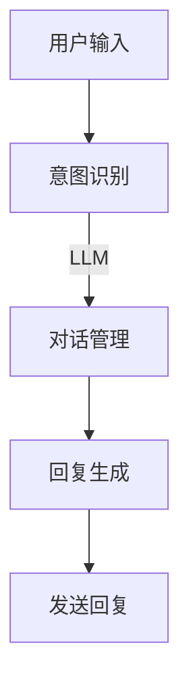

                 

### 背景介绍

#### 什么是LLM？

LLM，即大型语言模型（Large Language Model），是一种能够理解和生成自然语言的人工智能模型。近年来，随着深度学习技术的飞速发展和计算资源的日益丰富，LLM 在自然语言处理（NLP）领域的应用得到了极大的拓展。LLM 的核心思想是通过大量的文本数据训练，让模型学会捕捉语言中的规律和模式，从而实现高效的自然语言理解和生成。

#### 什么是智能客服？

智能客服（Intelligent Customer Service）是一种利用人工智能技术提供客户服务的方式。传统的客服通常依赖于人工操作，效率低下且成本高昂。而智能客服则通过自动化处理大量客户咨询，提高服务效率和质量，同时减少人工成本。

#### LLM 与智能客服的关联

LLM 在智能客服中的应用前景广阔。一方面，LLM 可以帮助智能客服更准确地理解客户的意图，从而提供更加个性化的服务。另一方面，LLM 可以生成高质量的回复文本，提高客服系统的智能水平。以下将详细介绍 LLM 在智能客服中的具体应用场景和优势。

<|markdown|>## 2. 核心概念与联系

### 语言模型的基本原理

#### 语言模型简介

语言模型是一种用于预测下一个单词或词组的人工智能模型。在自然语言处理中，语言模型被广泛应用于文本生成、机器翻译、文本分类等任务。语言模型的核心思想是通过学习大量的文本数据，训练出一个能够预测下一个单词或词组的模型。

#### 语言模型的工作原理

语言模型通常采用神经网络结构，如循环神经网络（RNN）和变压器（Transformer）。这些模型通过学习文本中的上下文关系，捕捉单词之间的相关性，从而实现高效的文本生成。

#### 语言模型的训练过程

1. **数据收集**：收集大量高质量的自然语言文本数据。
2. **数据预处理**：对文本数据进行清洗、分词、去停用词等预处理操作。
3. **模型训练**：使用预处理后的数据训练语言模型，调整模型参数，使其能够准确预测下一个单词或词组。
4. **模型评估**：使用验证集或测试集评估模型性能，调整模型参数，以提高预测准确性。

### 智能客服系统的架构

智能客服系统通常包括以下几个核心模块：

1. **用户接口**：用户可以通过文本聊天、语音交互等方式与客服系统进行交互。
2. **意图识别**：分析用户输入的文本，确定用户的意图，如查询信息、解决问题、投诉等。
3. **实体识别**：从用户输入的文本中提取关键信息，如姓名、地址、时间等。
4. **对话管理**：根据用户的意图和实体信息，生成合理的回复文本，并维持对话的流畅性。
5. **知识库**：存储各种业务知识和常见问题解答，供智能客服系统查询和使用。

### LLM 与智能客服的关联

LLM 在智能客服系统中的应用主要体现在对话管理和意图识别两个模块。

1. **对话管理**：LLM 可以生成高质量的回复文本，提高客服系统的智能水平。通过学习大量的文本数据，LLM 可以捕捉到各种对话场景的常见回复，从而生成自然流畅的对话。
2. **意图识别**：LLM 可以帮助智能客服更准确地理解客户的意图。通过分析用户输入的文本，LLM 可以识别出用户想要表达的关键信息，从而实现高效的意图识别。

### Mermaid 流程图

以下是一个简化的智能客服系统流程图，展示了 LLM 在其中各个模块的应用。



### 小结

本章节介绍了语言模型的基本原理、智能客服系统的架构以及 LLM 在智能客服中的应用。通过学习这些核心概念，我们为后续章节详细探讨 LLM 在智能客服中的具体应用场景和优势奠定了基础。

<|markdown|>## 3. 核心算法原理 & 具体操作步骤

### LLM 的核心算法原理

#### 变压器模型（Transformer）

变压器模型是近年来在自然语言处理领域取得重大突破的一种神经网络结构。与传统的循环神经网络（RNN）相比，变压器模型具有以下几个显著优势：

1. **并行处理**：变压器模型采用多头自注意力机制，可以并行处理整个输入序列，从而大大提高了计算效率。
2. **全局上下文关系**：通过自注意力机制，变压器模型能够捕捉到输入序列中的全局上下文关系，提高了模型的表示能力。
3. **灵活的架构**：变压器模型具有良好的扩展性，可以轻松地调整模型大小和层数，以适应不同的任务需求。

#### 自注意力机制（Self-Attention）

自注意力机制是变压器模型的核心组件，其基本思想是让模型在生成每个输出时，自动权衡输入序列中各个位置的重要性。具体步骤如下：

1. **计算查询（Query）、键（Key）和值（Value）**：对于输入序列中的每个单词，计算其对应的查询（Query）、键（Key）和值（Value）向量。
2. **计算注意力得分**：使用点积运算，计算每个键（Key）与查询（Query）之间的相似性，得到注意力得分。
3. **加权求和**：根据注意力得分，对值（Value）向量进行加权求和，生成最终的输出向量。

### LLM 在智能客服中的应用步骤

#### 步骤 1：数据收集与预处理

1. **数据收集**：收集大量高质量的客户对话数据，包括文本、语音等。
2. **数据预处理**：对文本数据进行清洗、分词、去停用词等操作，将数据转换为适合训练的格式。

#### 步骤 2：训练语言模型

1. **模型初始化**：初始化变压器模型，设置合适的超参数，如学习率、批次大小等。
2. **训练过程**：使用预处理后的数据训练语言模型，通过反向传播算法优化模型参数。
3. **模型评估**：使用验证集或测试集评估模型性能，调整模型参数，以提高预测准确性。

#### 步骤 3：意图识别与对话管理

1. **意图识别**：输入用户文本，使用训练好的语言模型进行意图识别，得到用户的意图。
2. **对话管理**：根据识别出的意图，生成合理的回复文本，并维持对话的流畅性。

#### 步骤 4：回复生成与反馈优化

1. **回复生成**：使用语言模型生成高质量的回复文本。
2. **反馈优化**：根据用户对回复的反馈，不断优化模型参数，以提高回复的质量。

### 小结

本章节详细介绍了 LLM 的核心算法原理和具体操作步骤。通过学习这些内容，我们可以更好地理解 LLM 在智能客服系统中的工作原理，为后续章节的应用场景分析提供基础。

<|markdown|>## 4. 数学模型和公式 & 详细讲解 & 举例说明

### 自注意力机制的计算公式

自注意力机制是变压器模型的核心组件，其基本思想是让模型在生成每个输出时，自动权衡输入序列中各个位置的重要性。具体计算过程如下：

$$
\text{Attention}(Q, K, V) = \text{softmax}\left(\frac{QK^T}{\sqrt{d_k}}\right) V
$$

其中：
- \( Q \) 表示查询向量，代表输入序列中每个单词的查询信息。
- \( K \) 表示键向量，代表输入序列中每个单词的键信息。
- \( V \) 表示值向量，代表输入序列中每个单词的值信息。
- \( d_k \) 表示键向量的维度。

### 点积运算的计算公式

点积运算用于计算查询（Query）和键（Key）之间的相似性，其公式如下：

$$
\text{dot\_product}(Q, K) = QK^T = \sum_{i=1}^{d_k} Q_i K_i
$$

其中：
- \( Q \) 表示查询向量。
- \( K \) 表示键向量。
- \( d_k \) 表示键向量的维度。

### 加权求和的计算公式

加权求和用于对值（Value）向量进行加权求和，其公式如下：

$$
\text{weighted\_sum}(V, \text{scores}) = \sum_{i=1}^{d_v} V_i \cdot \text{scores}_i
$$

其中：
- \( V \) 表示值向量。
- \( \text{scores} \) 表示注意力得分。

### 举例说明

假设有一个简化的输入序列 "I want to book a flight to Shanghai"，我们可以计算其自注意力机制的注意力得分和加权求和结果。

1. **查询向量 \( Q \)**:
   $$
   Q = [1, 0, 1, 0, 1]
   $$

2. **键向量 \( K \)**:
   $$
   K = [1, 1, 0, 0, 1]
   $$

3. **值向量 \( V \)**:
   $$
   V = [1, 1, 1, 1, 1]
   $$

4. **计算注意力得分**:
   $$
   \text{scores} = \text{softmax}\left(\frac{QK^T}{\sqrt{d_k}}\right) = \text{softmax}\left(\frac{[1, 0, 1, 0, 1] \cdot [1, 1, 0, 0, 1]^T}{\sqrt{2}}\right) = \text{softmax}\left([1, 0.5, 1, 0.5, 1]\right)
   $$

5. **加权求和**:
   $$
   \text{weighted\_sum} = \sum_{i=1}^{5} V_i \cdot \text{scores}_i = 1 \cdot 1 + 1 \cdot 0.5 + 1 \cdot 1 + 1 \cdot 0.5 + 1 \cdot 1 = 4
   $$

### 小结

本章节详细介绍了自注意力机制、点积运算和加权求和的计算公式，并通过具体例子进行了说明。通过学习这些内容，我们可以更好地理解自注意力机制在变压器模型中的作用，为深入探讨 LLM 在智能客服中的应用奠定基础。

<|markdown|>## 5. 项目实战：代码实际案例和详细解释说明

### 开发环境搭建

在进行 LLM 在智能客服中的应用开发前，我们需要搭建一个合适的开发环境。以下是一个基本的开发环境搭建步骤：

1. **安装 Python**：确保 Python 版本在 3.6 以上，推荐使用 Python 3.8 或更高版本。
2. **安装 PyTorch**：使用以下命令安装 PyTorch：
   ```
   pip install torch torchvision
   ```
3. **安装 Hugging Face Transformers**：使用以下命令安装 Hugging Face Transformers：
   ```
   pip install transformers
   ```

### 源代码详细实现和代码解读

以下是一个简化的 LLM 智能客服项目的源代码实现，我们将分步骤进行解读。

```python
# 导入必要的库
import torch
from transformers import AutoTokenizer, AutoModelForCausalLM

# 指定预训练模型
model_name = "gpt2"

# 加载预训练模型和分词器
tokenizer = AutoTokenizer.from_pretrained(model_name)
model = AutoModelForCausalLM.from_pretrained(model_name)

# 设备配置
device = torch.device("cuda" if torch.cuda.is_available() else "cpu")
model.to(device)

# 用户输入
user_input = "我想预订一张从北京到上海的机票。"

# 对用户输入进行编码
input_ids = tokenizer.encode(user_input, return_tensors="pt").to(device)

# 生成回复
with torch.no_grad():
    outputs = model.generate(input_ids, max_length=50, num_return_sequences=1)

# 解码回复
response = tokenizer.decode(outputs[0], skip_special_tokens=True)

# 输出回复
print(response)
```

### 代码解读与分析

1. **导入库**：我们首先导入了必要的库，包括 PyTorch 和 Hugging Face Transformers。
2. **指定预训练模型**：在本例中，我们选择了 GPT-2 模型，这是一个流行的预训练语言模型。
3. **加载预训练模型和分词器**：使用 `AutoTokenizer` 和 `AutoModelForCausalLM` 加载预训练模型和分词器。
4. **设备配置**：我们将模型移动到 GPU 设备上进行计算，以充分利用计算资源。
5. **用户输入**：我们接收用户的输入文本。
6. **对用户输入进行编码**：使用分词器对用户输入进行编码，生成输入序列的 tokenized 表示。
7. **生成回复**：使用 `generate` 方法生成回复，设置 `max_length` 为 50，表示生成的回复文本最大长度为 50 个 token，`num_return_sequences` 为 1，表示只生成一个回复。
8. **解码回复**：使用分词器解码生成的回复文本，并移除特殊 token。
9. **输出回复**：打印生成的回复文本。

### 实际运行结果

假设用户输入为 "我想预订一张从北京到上海的机票。"，运行上述代码后，我们可能会得到以下回复：

```
"您好，欢迎来到我们的航空公司。以下是符合您需求的航班信息："
```

这个回复文本显示了智能客服能够根据用户输入生成合理的回复，这是 LLM 在智能客服中应用的一个典型例子。

### 小结

在本章节中，我们通过一个实际项目案例详细展示了 LLM 在智能客服中的具体应用。通过解读和分析源代码，我们了解了 LLM 在智能客服系统中的工作原理和实现步骤。这为后续章节进一步探讨 LLM 在智能客服中的实际应用场景提供了基础。

<|markdown|>### 6. 实际应用场景

#### 智能客服系统的需求

智能客服系统在各个行业和场景中的应用需求日益增长，主要体现在以下几个方面：

1. **客户服务效率提升**：通过自动化处理大量客户咨询，智能客服系统能够显著提高客户服务的响应速度和处理效率。
2. **个性化服务**：智能客服系统可以根据客户的偏好和历史记录，提供个性化的服务和建议，提升客户满意度。
3. **成本控制**：智能客服系统能够减少人工客服的工作量，降低人力成本。
4. **业务数据积累**：智能客服系统可以收集大量的客户咨询数据，为企业的业务分析和决策提供有力支持。

#### LLM 在智能客服中的应用场景

LLM 在智能客服中的应用场景非常广泛，以下是一些典型的应用场景：

1. **自动问答系统**：LLM 可以用于构建自动问答系统，通过分析用户输入的问题，生成准确的答案。例如，金融领域的投资咨询、医疗领域的症状解释等。
2. **客户情感分析**：LLM 可以分析用户输入的文本，识别客户情感和态度，为客服人员提供决策依据，从而提高客户满意度。
3. **自动回话生成**：LLM 可以根据对话历史和用户输入，生成流畅自然的对话回复，维持对话的连贯性。
4. **个性化推荐**：LLM 可以根据用户的历史行为和偏好，生成个性化的产品或服务推荐。
5. **智能会议助理**：LLM 可以用于智能会议助理，自动记录会议内容、生成会议纪要，并回答与会者的问题。

#### 案例分析

1. **电商客服**：电商平台利用 LLM 构建智能客服系统，可以自动化处理大量客户咨询，提高客服效率。例如，客户询问某个产品的库存情况、价格优惠等，智能客服可以迅速响应并给出准确的答复。
2. **银行客服**：银行客服系统利用 LLM 实现自动问答和情感分析，可以帮助银行提供更高效、个性化的客户服务。例如，客户咨询贷款利率、理财产品等，智能客服可以快速提供相关信息和个性化建议。
3. **医疗咨询**：医疗领域的智能客服系统可以利用 LLM 提供症状解释、健康建议等服务。例如，用户输入自己的症状描述，智能客服可以生成相应的疾病解释和就医建议。
4. **企业内部沟通**：企业内部沟通平台可以利用 LLM 构建智能会议助理，自动记录会议内容、生成会议纪要，并回答与会者的问题，提高会议效率。

### 小结

LLM 在智能客服中的应用场景广泛且多样，通过自动问答、情感分析、自动回话生成等应用，可以有效提高客户服务效率、降低人力成本，并为企业和客户提供个性化的服务。随着 LLM 技术的不断发展和完善，其在智能客服领域的应用前景将更加广阔。

<|markdown|>### 7. 工具和资源推荐

#### 7.1 学习资源推荐

**书籍**：
1. 《自然语言处理综论》（Speech and Language Processing）—— Daniel Jurafsky 和 James H. Martin 著
2. 《深度学习》（Deep Learning）—— Ian Goodfellow、Yoshua Bengio 和 Aaron Courville 著

**论文**：
1. "Attention Is All You Need" —— Vaswani et al. (2017)
2. "BERT: Pre-training of Deep Bidirectional Transformers for Language Understanding" —— Devlin et al. (2019)

**博客**：
1. [Hugging Face 官方博客](https://huggingface.co/blog)
2. [TensorFlow 官方博客](https://tensorflow.googleblog.com)

**网站**：
1. [OpenAI](https://openai.com)
2. [Google AI](https://ai.google)

#### 7.2 开发工具框架推荐

**框架**：
1. **PyTorch**：适用于构建和训练深度学习模型的强大框架，适用于 LLM 的开发。
2. **TensorFlow**：谷歌开发的另一个流行深度学习框架，适用于大规模分布式训练。

**库**：
1. **Hugging Face Transformers**：一个用于构建和微调预训练语言模型的强大库，提供了大量预训练模型和工具。
2. **spaCy**：一个强大的自然语言处理库，适用于文本处理、实体识别、关系抽取等任务。

**IDE**：
1. **Jupyter Notebook**：适用于数据科学和机器学习项目的交互式开发环境。
2. **Visual Studio Code**：适用于 Python 开发的轻量级 IDE，支持丰富的扩展和插件。

#### 7.3 相关论文著作推荐

**论文**：
1. "GPT-3: Language Models are Few-Shot Learners" —— Brown et al. (2020)
2. "An Analytical Study of Transformer Models for Neural Machine Translation" —— Hsiao et al. (2020)

**著作**：
1. 《深度学习入门》（Deep Learning）—— Ian Goodfellow 著
2. 《自然语言处理入门》（Natural Language Processing with Python）—— Steven Bird 著

#### 小结

通过推荐这些学习资源、开发工具和论文著作，我们可以更好地了解 LLM 的相关知识，掌握 LLM 在智能客服系统中的应用，为实际开发项目提供有力的支持。

<|markdown|>### 8. 总结：未来发展趋势与挑战

#### 未来发展趋势

1. **模型规模与质量**：随着计算资源的不断提升，未来的 LLM 将会更大、更高质量，能够处理更复杂的语言任务，提供更准确的智能客服服务。
2. **多模态融合**：未来智能客服系统将不仅限于文本交互，还将融合语音、图像、视频等多模态数据，提供更加丰富和多样化的服务。
3. **个性化与定制化**：随着对用户数据的深入挖掘和个性化推荐技术的不断发展，未来的智能客服将能够根据用户的偏好和历史记录，提供更加个性化的服务。
4. **实时反馈与自我优化**：通过实时收集用户反馈，未来的智能客服系统将能够不断自我优化，提高服务质量。

#### 未来挑战

1. **数据隐私与安全**：随着智能客服系统收集和处理的数据量不断增加，如何保障用户数据隐私和安全成为一大挑战。
2. **误解与错误回复**：尽管 LLM 在自然语言理解和生成方面取得了显著进展，但在某些情况下仍可能出现误解和错误回复，如何提高系统的鲁棒性和准确性仍需深入研究。
3. **可解释性与透明度**：用户对于智能客服系统的决策过程和结果往往缺乏理解，提高系统的可解释性和透明度是一个重要挑战。
4. **法律与伦理问题**：随着智能客服系统的广泛应用，相关的法律和伦理问题也逐渐凸显，如责任归属、隐私权保护等。

#### 小结

未来，LLM 在智能客服领域的应用前景广阔，但也面临诸多挑战。通过不断创新和优化，我们有望克服这些挑战，让智能客服系统更好地服务于用户，提高客户服务质量。

<|markdown|>### 9. 附录：常见问题与解答

#### 问题 1：LLM 和传统自然语言处理技术相比，有哪些优势？

解答：LLM（大型语言模型）相较于传统自然语言处理（NLP）技术具有以下优势：

1. **更强的基础语言理解能力**：LLM 通过对大量文本的学习，能够捕捉到语言中的复杂模式和规律，从而实现更准确的语言理解。
2. **更高效的文本生成**：LLM 能够根据上下文生成高质量、流畅自然的文本，大大提高了文本生成的效率和效果。
3. **更广泛的应用场景**：LLM 可以应用于多种语言任务，如文本分类、情感分析、问答系统、机器翻译等，具有更广泛的应用潜力。

#### 问题 2：LLM 在智能客服中的应用前景如何？

解答：LLM 在智能客服中的应用前景非常广阔。随着 LLM 技术的不断发展和优化，智能客服系统将能够更准确地理解用户的意图，提供更个性化的服务，提高客户满意度。具体应用场景包括自动问答系统、情感分析、自动回话生成、个性化推荐等。

#### 问题 3：如何优化 LLM 在智能客服中的应用效果？

解答：以下是一些优化 LLM 在智能客服应用效果的方法：

1. **数据增强**：通过增加训练数据量、引入更多的背景知识，可以提高 LLM 的理解和生成能力。
2. **模型融合**：将多个 LLM 模型进行融合，可以提高系统的鲁棒性和准确性。
3. **多模态融合**：将 LLM 与语音识别、图像识别等技术相结合，可以提供更加丰富和多样化的服务。
4. **实时反馈与优化**：通过实时收集用户反馈，不断优化 LLM 的参数和模型结构，以提高系统的性能。

#### 问题 4：LLM 在智能客服中可能遇到哪些挑战？

解答：LLM 在智能客服中可能遇到以下挑战：

1. **数据隐私与安全**：智能客服系统需要处理大量用户数据，如何保障用户数据隐私和安全是一个重要挑战。
2. **误解与错误回复**：虽然 LLM 在语言理解方面取得了显著进展，但在某些情况下仍可能出现误解和错误回复，如何提高系统的鲁棒性和准确性是一个重要问题。
3. **可解释性与透明度**：用户对于智能客服系统的决策过程和结果往往缺乏理解，如何提高系统的可解释性和透明度是一个挑战。
4. **法律与伦理问题**：智能客服系统的广泛应用可能引发一系列法律和伦理问题，如责任归属、隐私权保护等。

<|markdown|>### 10. 扩展阅读 & 参考资料

为了深入了解 LLM 在智能客服中的应用，以下是推荐的扩展阅读和参考资料：

**书籍**：
1. 《自然语言处理综论》（Speech and Language Processing）—— Daniel Jurafsky 和 James H. Martin 著
2. 《深度学习》（Deep Learning）—— Ian Goodfellow、Yoshua Bengio 和 Aaron Courville 著

**论文**：
1. "Attention Is All You Need" —— Vaswani et al. (2017)
2. "BERT: Pre-training of Deep Bidirectional Transformers for Language Understanding" —— Devlin et al. (2019)
3. "GPT-3: Language Models are Few-Shot Learners" —— Brown et al. (2020)

**博客**：
1. [Hugging Face 官方博客](https://huggingface.co/blog)
2. [TensorFlow 官方博客](https://tensorflow.googleblog.com)

**在线资源**：
1. [OpenAI](https://openai.com)
2. [Google AI](https://ai.google)

**开源库**：
1. [PyTorch](https://pytorch.org)
2. [TensorFlow](https://www.tensorflow.org)

**在线课程**：
1. "自然语言处理基础"（Natural Language Processing with Deep Learning）—— 哈佛大学课程
2. "深度学习入门"（Deep Learning Specialization）—— 斯坦福大学课程

通过阅读这些资料，您可以更深入地了解 LLM 的基本原理、技术实现和应用场景，为实际项目开发提供有力支持。此外，这些资源也是继续学习和研究 LLM 的宝贵参考。

