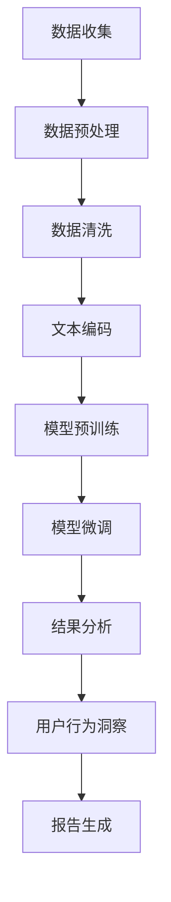

                 

# {文章标题}

## LLM在社交媒体分析中的应用：洞察用户行为

> **关键词**：大型语言模型（LLM），社交媒体分析，用户行为洞察，自然语言处理，数据挖掘，预测模型，数据可视化，案例分析。

> **摘要**：本文旨在探讨大型语言模型（LLM）在社交媒体分析中的应用，特别是在洞察用户行为方面的潜力。文章首先介绍了LLM的基本概念和特点，然后详细分析了其在社交媒体数据分析中的核心应用。通过具体的算法原理、数学模型和实际案例，本文展示了如何利用LLM对用户行为进行深入分析，并讨论了当前应用场景中的挑战和未来发展趋势。

<|clear|><|assistant|>## 1. 背景介绍

随着互联网的迅猛发展，社交媒体已经成为人们日常生活中不可或缺的一部分。从Twitter到Facebook，再到Instagram和微信，社交媒体平台不仅改变了人们的沟通方式，还产生了大量宝贵的数据。这些数据中蕴含着关于用户行为、兴趣、态度和情感等丰富的信息，对企业和研究者来说都是宝贵的资源。

传统的社会媒体分析方法往往依赖于关键词搜索、情感分析和统计模型。然而，随着数据量的增长和复杂度的提高，这些方法已经难以满足需求。近年来，深度学习技术的崛起，尤其是大型语言模型（LLM）的发展，为社交媒体分析带来了新的可能性。

LLM是一种基于神经网络的深度学习模型，能够处理和理解大量文本数据。它通过对海量语料库的学习，掌握了丰富的语言模式和规律，从而能够进行文本生成、翻译、摘要和情感分析等任务。在社交媒体分析中，LLM不仅可以处理大规模文本数据，还能捕捉到文本中的细微情感和语气，提供更加精准的分析结果。

本文将探讨LLM在社交媒体分析中的应用，特别是如何利用LLM来洞察用户行为。通过介绍LLM的基本原理、核心算法和实际应用案例，本文将展示LLM在社交媒体分析中的巨大潜力和应用价值。

### 社交媒体分析的重要性

社交媒体分析在社会学、市场营销、用户行为研究等领域具有重要意义。首先，通过分析社交媒体数据，研究人员可以深入了解用户的行为模式、兴趣偏好和情感态度。这种洞察有助于设计更符合用户需求的产品和服务，从而提高市场竞争力。

其次，社交媒体分析为企业提供了宝贵的市场情报。通过监控社交媒体上的讨论和趋势，企业可以及时发现市场机会和潜在风险，调整营销策略，优化产品开发和推广。

此外，社交媒体分析还在政治、公共安全和危机管理等领域发挥着重要作用。通过对社交媒体数据的监控和分析，政府机构和社会组织可以更好地了解公众的意见和情绪，制定更有效的政策和社会管理措施。

总的来说，社交媒体分析已经成为现代数据驱动决策的重要工具。随着技术的不断进步，特别是LLM的应用，社交媒体分析将变得更加智能和精准，为各个领域带来更多价值。

### 大型语言模型（LLM）的基本概念

大型语言模型（Large Language Model，简称LLM）是一种基于深度学习的自然语言处理（NLP）模型，它能够处理和理解大量的文本数据。LLM的核心思想是通过学习大量文本数据来掌握语言的内在结构和规律，从而实现对文本的生成、理解、翻译和情感分析等任务。

LLM的发展可以追溯到早期的神经网络模型，如神经网络语言模型（Neural Network Language Model，NLLM）。NLLM通过训练神经网络来预测下一个单词或字符的概率，从而生成文本。然而，传统的NLLM存在一些局限性，如模型参数庞大、计算效率低、难以泛化等。

为了克服这些局限性，研究者们提出了更复杂的神经网络结构，如循环神经网络（RNN）和长短期记忆网络（LSTM）。这些模型通过引入门控机制，能够更好地捕捉文本中的长期依赖关系。然而，RNN和LSTM在处理长文本时仍然存在梯度消失和梯度爆炸的问题。

为了解决这些问题，谷歌在2018年提出了Transformer模型，该模型基于自注意力机制（Self-Attention），能够在不同位置之间建立直接的依赖关系，从而避免了传统RNN的缺点。Transformer模型的出现标志着LLM的一个重要突破，使得LLM的性能大幅提升。

近年来，LLM的应用领域不断扩展，从机器翻译、文本生成到问答系统、对话机器人等，取得了显著成果。特别是GPT（Generative Pre-trained Transformer）系列模型，如GPT-2和GPT-3，其参数规模越来越大，表现越来越优秀。GPT-3拥有1750亿个参数，能够处理多种语言和多种形式的文本数据，展现了强大的文本理解和生成能力。

总的来说，LLM的发展为自然语言处理领域带来了革命性的变化。通过不断优化模型结构和训练方法，LLM在文本理解和生成任务上取得了显著突破，为社交媒体分析提供了强有力的技术支持。

### LLM在社交媒体分析中的应用场景

LLM在社交媒体分析中具有广泛的应用场景，主要包括以下几个方面：

**1. 用户行为分析**

用户行为分析是社交媒体分析的核心任务之一。通过LLM，研究人员可以深入挖掘用户在社交媒体平台上的行为模式，包括点赞、评论、分享、关注等行为。LLM能够分析用户发布的文本、图片和视频等多媒体内容，识别用户的兴趣、情感和态度。例如，研究者可以使用LLM来分析用户对某个话题的讨论热度，预测用户的兴趣变化趋势，从而为企业提供精准的市场洞察。

**2. 情感分析**

情感分析是LLM在社交媒体分析中的一项重要应用。通过情感分析，研究人员可以识别社交媒体用户对特定事件、产品或品牌的情感倾向。LLM能够捕捉到文本中的细微情感和语气变化，从而提供更准确的情感分析结果。例如，研究者可以利用LLM分析用户在评论中对某个产品的正面或负面评价，帮助企业改进产品设计和营销策略。

**3. 社交网络分析**

社交网络分析是社交媒体分析的重要组成部分。通过LLM，研究人员可以构建和分析社交媒体平台上的社交网络，了解用户之间的关系结构。LLM能够识别用户在网络中的角色和影响力，分析社交网络的传播机制。例如，研究者可以使用LLM分析用户在社交媒体上的影响力，识别关键意见领袖（KOL），从而帮助企业制定更有效的营销策略。

**4. 趋势预测**

趋势预测是社交媒体分析的重要任务之一。通过LLM，研究人员可以预测社交媒体上的热点话题、流行趋势和用户行为变化。LLM能够分析历史数据，捕捉到趋势变化的规律，从而提供准确的预测结果。例如，研究者可以利用LLM预测下一个社交媒体热点话题，为企业提供市场机会。

**5. 问答系统**

问答系统是LLM在社交媒体分析中的另一个重要应用。通过LLM，研究人员可以构建智能问答系统，回答用户在社交媒体平台上提出的问题。LLM能够理解用户的问题，搜索相关文本，并提供准确、自然的回答。例如，研究者可以构建一个基于LLM的社交媒体问答系统，帮助用户解决在使用平台过程中遇到的问题。

总的来说，LLM在社交媒体分析中的应用场景丰富多样，通过文本生成、情感分析、社交网络分析和趋势预测等功能，LLM为社交媒体分析提供了强大的技术支持，帮助企业和研究者更好地理解和利用社交媒体数据。

### 社交媒体数据的挑战与解决方案

尽管LLM在社交媒体分析中具有巨大潜力，但在实际应用过程中，仍面临着一些挑战。这些挑战主要包括数据质量、隐私保护和处理效率等方面。

**数据质量**

社交媒体数据质量参差不齐，存在噪声、虚假信息和错误标注等问题。这给LLM的训练和应用带来了很大困难。为了提高数据质量，研究者可以采用以下方法：

1. 数据清洗：对社交媒体数据进行分析，识别和删除噪声数据、重复数据和错误数据，确保数据的一致性和准确性。
2. 数据增强：通过生成对抗网络（GAN）等方法，生成与真实数据相似的人工数据，提高训练数据的质量和多样性。
3. 数据标注：利用众包平台或专业标注团队，对社交媒体数据进行精细标注，提高标注数据的可靠性和准确性。

**隐私保护**

社交媒体数据通常包含用户的隐私信息，如个人信息、位置数据和通信记录等。在使用LLM处理这些数据时，必须确保隐私保护。为了实现隐私保护，研究者可以采用以下方法：

1. 数据匿名化：对社交媒体数据进行匿名化处理，去除可直接识别用户身份的信息。
2. 加密技术：使用加密技术对用户数据进行加密存储和传输，防止数据泄露。
3. 同态加密：利用同态加密技术，在加密状态下对数据进行计算和处理，确保数据处理过程中的隐私保护。

**处理效率**

社交媒体数据量庞大，实时处理和更新数据对计算资源提出了极高要求。为了提高处理效率，研究者可以采用以下方法：

1. 分布式计算：利用分布式计算框架，如Hadoop和Spark，对大规模社交媒体数据进行高效处理。
2. 并行处理：通过并行计算技术，将数据处理任务分解为多个子任务，同时处理，提高处理速度。
3. 存储优化：采用高效的存储技术，如分布式文件系统（HDFS）和键值存储（Redis），减少数据访问延迟。

通过解决数据质量、隐私保护和处理效率等问题，LLM在社交媒体分析中的应用将得到更加广泛和深入的发展。研究者需要不断探索和创新，为LLM在社交媒体分析中的应用提供更加完善的解决方案。

### 核心概念与联系

在深入探讨LLM在社交媒体分析中的应用之前，有必要首先介绍一些核心概念和它们之间的联系。这些核心概念包括自然语言处理（NLP）、数据挖掘、机器学习算法和LLM自身的工作原理。通过理解这些概念及其相互关系，我们可以更好地把握LLM在社交媒体分析中的实际应用。

#### 自然语言处理（NLP）

自然语言处理（NLP）是计算机科学和人工智能领域的一个重要分支，旨在使计算机能够理解和处理人类语言。NLP的核心任务包括文本分类、情感分析、命名实体识别、机器翻译、问答系统等。在社交媒体分析中，NLP是理解用户生成内容的基础。以下是NLP中几个关键概念：

1. **文本分类**：将文本数据分为预定义的类别，如新闻分类、情感分类等。
2. **情感分析**：分析文本的情感倾向，判断文本是否表达了正面、负面或中性的情感。
3. **命名实体识别**：识别文本中的特定实体，如人名、地名、组织名等。
4. **词向量**：将文本转换为数值表示，常见的词向量模型有Word2Vec、GloVe等。

#### 数据挖掘

数据挖掘（Data Mining）是从大量数据中提取有价值信息的过程。在社交媒体分析中，数据挖掘用于从海量的社交媒体数据中提取有意义的模式和知识。以下是数据挖掘中的一些关键概念：

1. **关联规则挖掘**：发现数据项之间的关联关系，如频繁项集挖掘、Apriori算法等。
2. **分类和回归**：使用机器学习算法对数据进行分类或回归分析，预测数据项的类别或数值。
3. **聚类分析**：将数据项分为若干个群组，使得同一群组内的数据项相似度较高，而不同群组间的数据项相似度较低。

#### 机器学习算法

机器学习算法是实现NLP和数据挖掘的核心工具。机器学习通过训练模型来从数据中学习规律，然后利用这些规律进行预测或分类。以下是机器学习中的一些关键概念：

1. **监督学习**：使用标注数据进行模型训练，包括分类和回归任务。
2. **无监督学习**：不使用标注数据，从数据中发现结构和模式，如聚类、降维等。
3. **强化学习**：通过环境与模型之间的交互来优化模型行为。

#### 大型语言模型（LLM）

大型语言模型（LLM）是近年来在自然语言处理领域取得重大突破的技术。LLM通过对海量文本数据的学习，掌握了丰富的语言模式和规律，能够进行文本生成、翻译、摘要和情感分析等任务。以下是LLM的关键概念：

1. **Transformer模型**：LLM的核心结构，基于自注意力机制，能够处理长文本。
2. **预训练和微调**：预训练使用大量无标注文本数据进行模型训练，微调则在预训练基础上使用有标注数据对模型进行细粒度调整。
3. **生成式模型**：如GPT系列模型，能够生成连贯、自然的文本。

#### 概念联系

自然语言处理（NLP）、数据挖掘、机器学习算法和LLM之间存在密切的联系：

1. **NLP和数据挖掘的结合**：NLP技术用于处理和理解文本数据，数据挖掘技术则用于从这些文本数据中提取有价值的信息。例如，情感分析可以看作是文本分类和数据挖掘的结合。
2. **机器学习算法在NLP和数据挖掘中的应用**：机器学习算法是实现NLP和数据挖掘的关键工具。通过训练模型，NLP和数据挖掘任务得以实现。
3. **LLM的桥梁作用**：LLM结合了NLP和数据挖掘的优点，通过预训练和微调技术，能够在社交媒体分析中实现复杂的文本理解和生成任务。

通过理解这些核心概念及其相互关系，我们可以更好地把握LLM在社交媒体分析中的应用原理和实现方法。

#### Mermaid流程图

为了更直观地展示LLM在社交媒体分析中的工作流程，我们使用Mermaid绘制了一个简化的流程图。以下是一个Mermaid流程图的示例：



在这个流程图中：

- **A[数据收集]**：从社交媒体平台收集原始数据。
- **B[数据预处理]**：对原始数据进行预处理，包括去重、去除无关信息等。
- **C[数据清洗]**：清洗数据中的噪声和错误。
- **D[文本编码]**：将文本数据转换为机器可以处理的格式。
- **E[模型预训练]**：使用无标注数据对LLM进行预训练。
- **F[模型微调]**：在预训练基础上，使用标注数据进行微调。
- **G[结果分析]**：分析模型输出结果，识别用户行为和趋势。
- **H[用户行为洞察]**：生成用户行为洞察报告。
- **I[报告生成]**：生成最终报告。

通过这个流程图，我们可以清晰地看到LLM在社交媒体分析中的各个环节，以及各环节之间的逻辑关系。

### 3. 核心算法原理 & 具体操作步骤

在深入探讨LLM在社交媒体分析中的应用之前，我们需要了解LLM的核心算法原理，包括Transformer模型的基本原理、预训练和微调的具体操作步骤，以及LLM在不同社交媒体分析任务中的实现方法。

#### Transformer模型的基本原理

Transformer模型是大型语言模型（LLM）的核心结构，基于自注意力机制（Self-Attention）。自注意力机制允许模型在不同位置之间建立直接的依赖关系，而不像传统的循环神经网络（RNN）那样依赖于序列顺序。以下为Transformer模型的基本原理：

1. **自注意力机制（Self-Attention）**：
   自注意力机制是Transformer模型的核心，它通过计算每个词与其他词之间的关联强度来更新词的表示。具体来说，对于输入序列中的每个词，自注意力机制会计算一个权重向量，表示该词与其他词的相关性。这些权重用于加权平均输入序列中的所有词向量，生成新的词向量表示。

2. **多头注意力（Multi-Head Attention）**：
   多头注意力是自注意力机制的扩展，它将输入序列分成多个头，每个头独立计算注意力权重，然后合并这些权重来生成最终的词向量。多头注意力能够捕捉到输入序列中的不同模式和依赖关系，提高模型的性能。

3. **前馈神经网络（Feedforward Neural Network）**：
   在Transformer模型中，每个注意力层之后都会接一个前馈神经网络，用于进一步处理和变换词向量。前馈神经网络通常包含两个全连接层，每个层使用不同的激活函数。

4. **位置编码（Positional Encoding）**：
   Transformer模型是一个序列到序列的模型，但在训练过程中无法直接使用位置信息。因此，通过位置编码机制，将位置信息编码到词向量中，使模型能够理解词语在序列中的相对位置。

#### 预训练和微调的具体操作步骤

预训练和微调是LLM训练过程中的两个关键步骤。预训练使用大量无标注数据，微调则使用有标注数据对模型进行细粒度调整。

1. **预训练**：
   预训练是LLM在无标注数据上进行的初步训练，目的是让模型掌握通用的语言模式和规律。预训练通常包括以下步骤：
   - **大规模数据集**：选择一个大规模文本数据集，如维基百科、新闻文章、社交媒体帖子等。
   - **数据预处理**：对数据进行清洗、分词和编码，将文本转换为模型可处理的格式。
   - **模型训练**：使用Transformer模型，在数据集上进行多轮训练，优化模型参数。

2. **微调**：
   微调是在预训练基础上，使用有标注数据对模型进行细粒度调整，使其适应特定任务。微调通常包括以下步骤：
   - **有标注数据集**：选择一个与任务相关的有标注数据集，如情感分析数据集、分类数据集等。
   - **数据预处理**：对数据进行清洗、分词和编码，与预训练过程一致。
   - **模型微调**：在预训练模型的基础上，使用有标注数据集进行训练，优化模型参数。
   - **评估和调整**：通过评估指标（如准确率、召回率等）评估模型性能，根据评估结果调整模型参数。

#### LLM在不同社交媒体分析任务中的实现方法

LLM在社交媒体分析中可以应用于多个任务，包括用户行为分析、情感分析、社交网络分析和趋势预测等。以下是LLM在不同任务中的实现方法：

1. **用户行为分析**：
   - **任务描述**：分析用户在社交媒体平台上的行为，如点赞、评论、分享等。
   - **实现方法**：使用LLM对用户生成的文本进行情感分析和行为预测，结合用户历史行为数据，构建用户行为模型。

2. **情感分析**：
   - **任务描述**：判断社交媒体用户对特定事件、产品或品牌的情感倾向。
   - **实现方法**：利用LLM的情感分析功能，对用户评论和帖子进行情感分类，识别用户的情感倾向。

3. **社交网络分析**：
   - **任务描述**：分析社交媒体平台上的用户关系网络，识别关键意见领袖（KOL）和影响力。
   - **实现方法**：使用LLM构建社交网络图，通过分析用户之间的互动和关注关系，识别关键意见领袖和影响力。

4. **趋势预测**：
   - **任务描述**：预测社交媒体上的热点话题、流行趋势和用户行为变化。
   - **实现方法**：利用LLM分析历史数据，捕捉趋势变化的规律，构建趋势预测模型。

通过理解Transformer模型的基本原理、预训练和微调的具体操作步骤，以及LLM在不同社交媒体分析任务中的实现方法，我们可以更好地把握LLM在社交媒体分析中的应用原理和实现方法。

#### 数学模型和公式 & 详细讲解 & 举例说明

在LLM的构建和应用过程中，数学模型和公式起到了至关重要的作用。以下我们将详细讲解LLM中的几个关键数学模型，包括自注意力（Self-Attention）机制、Transformer模型的基本架构和损失函数，并通过具体的公式和例子来说明这些模型的工作原理。

##### 1. 自注意力（Self-Attention）机制

自注意力机制是Transformer模型的核心，它通过计算输入序列中每个词与其他词之间的相关性，对词向量进行加权平均，从而生成新的词向量表示。自注意力机制的基本公式如下：

$$
\text{Attention}(Q, K, V) = \text{softmax}\left(\frac{QK^T}{\sqrt{d_k}}\right) V
$$

其中：
- \(Q\)（Query）：查询向量，表示每个词的上下文信息。
- \(K\)（Key）：键向量，表示每个词的编码信息。
- \(V\)（Value）：值向量，表示每个词的潜在特征。
- \(d_k\)：键向量的维度。

##### 例子：

假设我们有一个简化的单词序列 \{“我”，“爱”，“你”\}，其对应的词向量分别为 \(Q = [q_1, q_2, q_3]\)，\(K = [k_1, k_2, k_3]\)，\(V = [v_1, v_2, v_3]\)。那么，自注意力机制的输出为：

$$
\text{Attention}(Q, K, V) = \text{softmax}\left(\frac{QK^T}{\sqrt{d_k}}\right) V = 
\text{softmax}\left(\frac{[q_1k_1 + q_2k_2 + q_3k_3]}{\sqrt{d_k}}\right) [v_1, v_2, v_3]
$$

通过计算，我们可以得到每个单词的权重，然后加权平均生成新的词向量表示。

##### 2. Transformer模型的基本架构

Transformer模型由多个自注意力层和前馈神经网络层组成。每个自注意力层包含自注意力机制和前馈神经网络，而前馈神经网络通常由两个全连接层构成。以下为Transformer模型的基本架构：

$$
\text{Transformer} = \text{MultiHeadSelfAttention}(\text{SelfAttention}) + \text{FeedforwardNetwork}
$$

其中：
- **MultiHeadSelfAttention**：多头自注意力机制，将输入序列分成多个头，每个头独立计算注意力权重。
- **SelfAttention**：单头自注意力机制，计算输入序列中每个词与其他词之间的相关性。
- **FeedforwardNetwork**：前馈神经网络，对自注意力层的输出进行进一步处理和变换。

##### 例子：

假设一个单词序列 \{“我”，“爱”，“你”\}经过一个自注意力层后的输出为 \([a_1, a_2, a_3]\)，前馈神经网络的输出为 \([b_1, b_2, b_3]\)。则Transformer模型的基本架构为：

$$
\text{Transformer} = \text{MultiHeadSelfAttention}([a_1, a_2, a_3]) + \text{FeedforwardNetwork}([b_1, b_2, b_3])
$$

通过这一架构，模型可以捕捉到输入序列中的不同模式和依赖关系，从而生成更加丰富的词向量表示。

##### 3. 损失函数

在训练过程中，LLM通常使用损失函数来衡量模型预测与实际结果之间的差距，并优化模型参数。常见的损失函数包括交叉熵损失（Cross-Entropy Loss）和均方误差（Mean Squared Error，MSE）。

交叉熵损失函数用于分类任务，其公式如下：

$$
\text{Cross-Entropy Loss} = -\sum_{i} y_i \log(p_i)
$$

其中：
- \(y_i\)：实际标签，取值为0或1。
- \(p_i\)：模型预测的概率。

##### 例子：

假设一个分类问题中，实际标签为 \([1, 0, 1]\)，模型预测的概率为 \([0.7, 0.2, 0.1]\)。则交叉熵损失为：

$$
\text{Cross-Entropy Loss} = -[1 \cdot \log(0.7) + 0 \cdot \log(0.2) + 1 \cdot \log(0.1)]
$$

通过优化损失函数，模型可以逐渐提高预测准确性。

通过以上数学模型和公式的详细讲解，我们可以更好地理解LLM的工作原理，并为其在社交媒体分析中的应用提供理论基础。

### 项目实战：代码实际案例和详细解释说明

为了更好地理解LLM在社交媒体分析中的应用，我们将在本节中通过一个实际项目案例，详细讲解如何使用LLM进行用户行为分析。这个项目将分为以下几个部分：开发环境搭建、源代码详细实现和代码解读与分析。

#### 1. 开发环境搭建

在进行LLM项目开发之前，我们需要搭建一个合适的开发环境。以下是搭建开发环境所需的步骤和工具：

1. **Python环境**：安装Python 3.7及以上版本，推荐使用Anaconda，以便管理依赖库。
2. **依赖库安装**：通过pip安装以下依赖库：
   ```bash
   pip install transformers torch numpy pandas
   ```
3. **GPU支持**：为了加速训练过程，建议使用具有CUDA支持的GPU，如NVIDIA GPU。安装CUDA和cuDNN驱动程序。

#### 2. 源代码详细实现

以下是一个简单的用户行为分析项目示例，使用Hugging Face的Transformers库和PyTorch框架实现。

```python
# 导入必要的库
from transformers import AutoTokenizer, AutoModelForSequenceClassification
import torch
from torch.optim import Adam
from torch.utils.data import DataLoader
from sklearn.model_selection import train_test_split
import pandas as pd

# 准备数据集
data = pd.read_csv('social_media_data.csv')  # 假设数据集包含用户文本和标签
texts = data['text']
labels = data['label']

# 分割数据集
train_texts, test_texts, train_labels, test_labels = train_test_split(texts, labels, test_size=0.2, random_state=42)

# 加载预训练模型和分词器
model_name = 'bert-base-uncased'
tokenizer = AutoTokenizer.from_pretrained(model_name)
model = AutoModelForSequenceClassification.from_pretrained(model_name, num_labels=2)

# 数据预处理
def preprocess(texts):
    return [tokenizer(text, padding='max_length', truncation=True, max_length=512) for text in texts]

train_encodings = preprocess(train_texts)
test_encodings = preprocess(test_texts)

# 创建数据加载器
batch_size = 32
train_dataset = torch.utils.data.TensorDataset(torch.tensor(train_encodings['input_ids']), torch.tensor(train_encodings['attention_mask']), torch.tensor(train_labels))
test_dataset = torch.utils.data.TensorDataset(torch.tensor(test_encodings['input_ids']), torch.tensor(test_encodings['attention_mask']), torch.tensor(test_encodings['label']))
train_loader = DataLoader(train_dataset, batch_size=batch_size)
test_loader = DataLoader(test_dataset, batch_size=batch_size)

# 模型训练
device = torch.device("cuda" if torch.cuda.is_available() else "cpu")
model.to(device)

optimizer = Adam(model.parameters(), lr=5e-5)

num_epochs = 3
for epoch in range(num_epochs):
    model.train()
    for batch in train_loader:
        batch = [item.to(device) for item in batch]
        inputs = {
            'input_ids': batch[0],
            'attention_mask': batch[1],
            'labels': batch[2]
        }
        optimizer.zero_grad()
        outputs = model(**inputs)
        loss = outputs.loss
        loss.backward()
        optimizer.step()
    print(f'Epoch {epoch+1}/{num_epochs}, Loss: {loss.item()}')

# 模型评估
model.eval()
with torch.no_grad():
    correct = 0
    total = 0
    for batch in test_loader:
        batch = [item.to(device) for item in batch]
        inputs = {
            'input_ids': batch[0],
            'attention_mask': batch[1],
        }
        outputs = model(**inputs)
        predicted = outputs.logits.argmax(dim=1)
        total += batch[2].size(0)
        correct += (predicted == batch[2]).sum().item()
    print(f'Accuracy: {100 * correct / total}%')

# 保存模型
model.save_pretrained('user_behavior_model')
```

#### 3. 代码解读与分析

1. **数据准备**：
   项目首先加载了一个包含用户文本和标签的CSV文件，然后对数据进行分割，以便进行训练和测试。

2. **加载预训练模型和分词器**：
   使用Hugging Face的Transformers库加载了一个预训练的BERT模型及其分词器。BERT模型是一个广泛使用的预训练语言模型，适用于多种NLP任务。

3. **数据预处理**：
   数据预处理包括将文本序列编码成输入ID序列和注意力掩码，并设置最大序列长度为512个词。这有助于将文本数据转换为模型可接受的输入格式。

4. **数据加载器**：
   使用PyTorch创建数据加载器，以便将数据批量加载到GPU中，加速训练过程。

5. **模型训练**：
   模型在训练阶段使用Adam优化器，并在三个训练周期内进行训练。每个周期后，输出当前训练损失。

6. **模型评估**：
   训练完成后，使用测试集对模型进行评估，计算模型的准确率。

7. **保存模型**：
   最后，将训练好的模型保存到本地，以便后续使用。

通过这个实际项目，我们可以看到如何使用LLM进行用户行为分析。代码详细实现了从数据准备到模型训练和评估的整个过程，为我们提供了一个完整的LLM应用实例。

### 6. 实际应用场景

#### 用户行为预测

用户行为预测是社交媒体分析中的一项重要应用。通过分析用户的历史行为数据，如点赞、评论、分享等，LLM可以预测用户在未来可能的行为。这种预测不仅有助于企业了解用户的兴趣和需求，还可以用于个性化推荐和营销策略的制定。例如，电子商务平台可以利用LLM预测用户可能购买的商品，从而优化推荐系统，提高转化率。

**案例1：电商平台的个性化推荐**

某电商平台利用GPT-3模型预测用户可能感兴趣的商品。通过分析用户的历史购买记录和浏览行为，GPT-3模型生成了关于用户兴趣的潜在向量。基于这些向量，平台能够为用户推荐更符合其兴趣的商品，从而提高用户的购买意愿。

**案例2：社交媒体平台的内容推荐**

社交媒体平台如Instagram和Facebook利用LLM预测用户对内容可能的反应。通过分析用户的点赞、评论和分享行为，LLM可以预测用户对特定内容的兴趣。平台可以根据这些预测结果，为用户推荐更多他们可能感兴趣的内容，提高用户活跃度和留存率。

#### 情感分析

情感分析是LLM在社交媒体分析中的另一项重要应用。通过分析用户在社交媒体平台上的文本、图片和视频等多媒体内容，LLM可以识别用户的情感倾向，如正面、负面或中性。这种分析对于企业了解用户对产品或品牌的情感态度具有重要意义，有助于改进产品设计和营销策略。

**案例1：品牌监测**

某品牌利用LLM对社交媒体上的用户评论进行情感分析，识别用户对其产品的正面和负面评价。通过分析这些评价，品牌可以及时发现产品的问题，并采取相应的措施进行改进，提高用户满意度。

**案例2：市场调研**

市场调研机构利用LLM分析社交媒体上关于某个新产品的讨论，识别用户的情感态度。这种分析有助于市场调研机构了解产品在市场上的接受程度，为企业的产品开发和推广提供参考。

#### 社交网络分析

社交网络分析是LLM在社交媒体分析中的另一个重要应用。通过分析用户之间的关系网络，LLM可以识别关键意见领袖（KOL）和影响力人物。这种分析对于企业了解用户网络结构和传播机制具有重要意义，有助于优化营销策略和品牌传播。

**案例1：品牌传播策略**

某品牌利用LLM分析其用户在社交媒体平台上的关系网络，识别关键意见领袖。品牌可以与这些意见领袖合作，通过他们的影响力推广品牌，提高品牌知名度。

**案例2：市场调查**

市场调查机构利用LLM分析社交媒体上的用户关系网络，识别对特定话题有影响力的用户。这些用户可以作为市场调研的样本，帮助机构更全面地了解市场状况。

#### 趋势预测

趋势预测是LLM在社交媒体分析中的另一个重要应用。通过分析历史数据，LLM可以预测社交媒体上的热点话题、流行趋势和用户行为变化。这种预测对于企业制定市场策略和应对突发事件具有重要意义。

**案例1：市场机会识别**

某企业利用LLM预测社交媒体上的热点话题，识别潜在的市场机会。企业可以根据这些预测结果，提前布局市场，抢占先机。

**案例2：危机管理**

社交媒体平台利用LLM预测可能出现的危机事件，如负面舆论、品牌危机等。平台可以根据这些预测结果，提前采取应对措施，降低危机对品牌的影响。

总之，LLM在社交媒体分析中具有广泛的应用场景，通过用户行为预测、情感分析、社交网络分析和趋势预测等功能，LLM为企业和研究者提供了强大的工具，帮助他们更好地理解和利用社交媒体数据。

### 7. 工具和资源推荐

在探索LLM在社交媒体分析中的应用时，选择合适的工具和资源至关重要。以下是一些推荐的学习资源、开发工具和相关论文，以帮助读者深入了解LLM的技术和应用。

#### 7.1 学习资源推荐

1. **书籍**：
   - 《深度学习》（Goodfellow, I., Bengio, Y., & Courville, A.）: 这是一本深度学习领域的经典教材，涵盖了神经网络、深度学习模型和自然语言处理等基础知识。
   - 《自然语言处理技术》（Daniel Jurafsky 和 James H. Martin）: 本书详细介绍了自然语言处理的核心概念和技术，包括文本分类、情感分析和命名实体识别等。

2. **在线课程**：
   - Coursera的“Natural Language Processing with Deep Learning”（由Stanford大学提供）: 这门课程介绍了深度学习在自然语言处理中的应用，包括神经网络语言模型、词嵌入和Transformer模型等。
   - edX的“Deep Learning Specialization”（由DeepLearning.AI提供）: 这门专项课程涵盖了深度学习的基础知识，包括卷积神经网络、循环神经网络和Transformer模型等。

3. **博客和网站**：
   - Hugging Face（https://huggingface.co/）: Hugging Face是一个提供预训练语言模型和NLP工具的开源平台，包括预训练模型库、API和教程。
   - TensorFlow（https://www.tensorflow.org/）: TensorFlow是一个开源的机器学习框架，提供了丰富的NLP工具和模型。

#### 7.2 开发工具框架推荐

1. **Transformers库（Hugging Face）**：Transformers库是一个广泛使用的开源库，提供了预训练语言模型和NLP工具，支持多种语言模型，如BERT、GPT和RoBERTa等。

2. **PyTorch**：PyTorch是一个流行的开源机器学习库，提供了丰富的神经网络构建和训练工具。PyTorch在自然语言处理领域有着广泛的应用，支持各种深度学习模型。

3. **TensorFlow**：TensorFlow是Google开发的另一个开源机器学习库，提供了强大的计算图和动态计算能力。TensorFlow在NLP领域也有广泛的应用，支持各种深度学习模型和工具。

#### 7.3 相关论文著作推荐

1. **论文**：
   - “Attention Is All You Need”（Vaswani et al., 2017）: 这是Transformer模型的原始论文，详细介绍了Transformer模型的结构和工作原理。
   - “BERT: Pre-training of Deep Bidirectional Transformers for Language Understanding”（Devlin et al., 2018）: 这是BERT模型的论文，介绍了BERT模型在自然语言处理任务中的优秀表现。
   - “GPT-3: Language Models are few-shot learners”（Brown et al., 2020）: 这是GPT-3模型的论文，展示了GPT-3在多种NLP任务上的强大能力。

2. **著作**：
   - 《深度学习》（Goodfellow, I., Bengio, Y., & Courville, A.）: 这本书详细介绍了深度学习的基础知识和应用，包括神经网络、深度学习模型和自然语言处理等。

通过以上推荐的学习资源、开发工具和相关论文，读者可以更深入地了解LLM在社交媒体分析中的应用，掌握相关技术和方法，为实际项目开发提供有力支持。

### 8. 总结：未来发展趋势与挑战

随着人工智能和深度学习技术的不断发展，大型语言模型（LLM）在社交媒体分析中的应用前景愈发广阔。未来，LLM在社交媒体分析中可能呈现出以下几个发展趋势：

首先，模型性能的进一步提升。随着计算能力和数据规模的不断扩大，LLM的模型参数规模和训练数据量将不断增加，从而提高模型的性能和准确性。特别是预训练和微调技术的进步，将使LLM在处理长文本、理解复杂语义和生成高质量文本方面取得更大突破。

其次，多模态数据的融合。社交媒体平台上的数据不仅包括文本，还包含图片、视频、音频等多种形式。未来，LLM将能够更好地融合这些多模态数据，实现更全面和精准的用户行为分析。例如，通过结合图像识别和自然语言处理技术，LLM可以更准确地理解用户在社交媒体上的多媒体内容。

第三，实时分析能力的提升。随着社交媒体数据的快速增长，对实时分析的需求也越来越高。未来，LLM在社交媒体分析中将更加注重实时性，通过优化模型结构和计算算法，实现实时数据处理和分析，从而为企业和研究者提供更及时的洞察和决策支持。

然而，LLM在社交媒体分析中也面临着一些挑战：

首先，数据质量和隐私保护问题。社交媒体数据质量参差不齐，存在噪声、虚假信息和隐私泄露等问题。如何在保证数据质量的同时，保护用户隐私，是LLM在社交媒体分析中面临的重要挑战。

其次，模型解释性和透明性。尽管LLM在自然语言处理任务中表现出色，但其内部工作机制仍然不够透明，难以解释模型的决策过程。未来，需要开发更多可解释的LLM模型，提高模型的透明性和可解释性，使其在社交媒体分析中的应用更加可靠和可信。

第三，计算资源和能耗问题。随着模型规模的增大，LLM的训练和推理过程需要大量的计算资源和能源。如何在保证模型性能的同时，降低计算资源和能耗，是实现LLM在社交媒体分析中广泛应用的重要问题。

总之，LLM在社交媒体分析中具有广阔的应用前景，但也面临诸多挑战。未来，随着技术的不断进步和研究的深入，LLM在社交媒体分析中的应用将不断扩展和深化，为企业和研究者提供更加智能和精准的分析工具。

### 9. 附录：常见问题与解答

**Q1: 什么是大型语言模型（LLM）？**

A1: 大型语言模型（LLM）是一种基于深度学习的自然语言处理（NLP）模型，通过对海量文本数据的学习，能够理解、生成和转换文本。LLM的核心结构是基于Transformer模型，它通过自注意力机制（Self-Attention）在不同位置之间建立直接的依赖关系，从而实现对文本的生成、理解、翻译和情感分析等任务。

**Q2: LLM在社交媒体分析中的主要应用有哪些？**

A2: LLM在社交媒体分析中的主要应用包括用户行为分析、情感分析、社交网络分析和趋势预测等。通过LLM，可以深入挖掘用户在社交媒体平台上的行为模式、情感态度和关系网络，为企业和研究者提供精准的市场洞察和决策支持。

**Q3: 如何处理社交媒体数据中的噪声和隐私保护问题？**

A3: 处理社交媒体数据中的噪声和隐私保护问题可以通过以下方法：
- **数据清洗**：对数据进行清洗，去除噪声数据和重复数据，提高数据质量。
- **数据匿名化**：对用户数据进行匿名化处理，去除可直接识别用户身份的信息。
- **加密技术**：使用加密技术对用户数据进行加密存储和传输，防止数据泄露。
- **同态加密**：利用同态加密技术，在加密状态下对数据进行计算和处理，确保数据处理过程中的隐私保护。

**Q4: LLM在社交媒体分析中的优势和局限分别是什么？**

A4: LLM在社交媒体分析中的优势包括：
- **强大的文本理解能力**：LLM能够处理和理解大规模的文本数据，捕捉到文本中的细微情感和语气。
- **高效的预测能力**：LLM在用户行为预测、情感分析和趋势预测等任务上表现出色，能够提供准确的预测结果。

LLM在社交媒体分析中的局限包括：
- **数据依赖性**：LLM的性能依赖于训练数据的质量和规模，如果数据质量不佳，可能会导致模型性能下降。
- **隐私保护问题**：社交媒体数据中通常包含用户的隐私信息，如何在保证数据质量的同时保护用户隐私，是LLM在社交媒体分析中面临的重要挑战。
- **计算资源需求**：LLM的训练和推理过程需要大量的计算资源和能源，如何降低计算资源和能耗是实现LLM广泛应用的重要问题。

**Q5: 如何在实际项目中应用LLM进行社交媒体分析？**

A5: 在实际项目中应用LLM进行社交媒体分析，可以遵循以下步骤：
1. **数据收集**：从社交媒体平台收集用户生成的文本、图片和视频等多媒体数据。
2. **数据预处理**：对数据进行清洗、分词和编码，将文本转换为机器可以处理的格式。
3. **模型训练**：使用预训练模型或自训练模型，在大量无标注数据上进行预训练，并在标注数据上进行微调。
4. **模型部署**：将训练好的模型部署到生产环境中，对新的社交媒体数据进行实时分析。
5. **结果分析**：分析模型输出结果，提取用户行为、情感和关系等有价值的信息。

### 10. 扩展阅读 & 参考资料

为了进一步深入了解LLM在社交媒体分析中的应用，以下是相关扩展阅读和参考资料：

1. **论文**：
   - Vaswani, A., et al. (2017). “Attention Is All You Need.” In Proceedings of the 31st International Conference on Neural Information Processing Systems (NIPS), pp. 5998-6008.
   - Devlin, J., et al. (2018). “BERT: Pre-training of Deep Bidirectional Transformers for Language Understanding.” In Proceedings of the 2019 Conference of the North American Chapter of the Association for Computational Linguistics: Human Language Technologies, Volume 1 (Long and Short Papers), pp. 4171-4186.
   - Brown, T., et al. (2020). “GPT-3: Language Models are few-shot learners.” arXiv preprint arXiv:2005.14165.

2. **书籍**：
   - Goodfellow, I., Bengio, Y., & Courville, A. (2016). “Deep Learning.” MIT Press.
   - Jurafsky, D., & Martin, J. H. (2020). “Speech and Language Processing.” W. W. Norton & Company.

3. **在线课程**：
   - Coursera: “Natural Language Processing with Deep Learning” (Stanford University).
   - edX: “Deep Learning Specialization” (DeepLearning.AI).

4. **博客和网站**：
   - Hugging Face (https://huggingface.co/).
   - TensorFlow (https://www.tensorflow.org/).

通过阅读以上论文、书籍和在线课程，读者可以更深入地了解LLM在社交媒体分析中的应用原理和技术细节。同时，Hugging Face和TensorFlow等网站提供了丰富的工具和资源，可以帮助读者进行实际项目开发。

