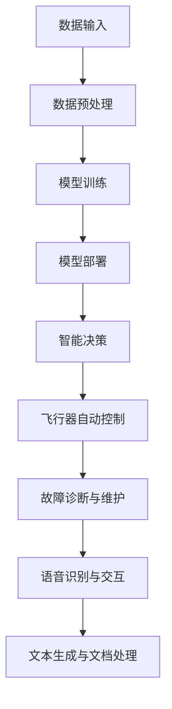
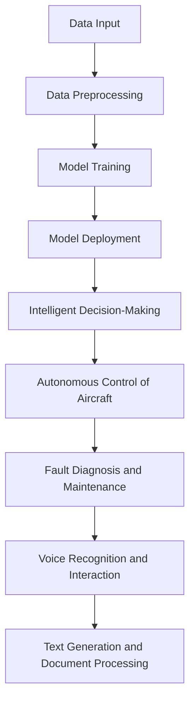

                 

### 背景介绍

#### 航空航天行业的挑战与机遇

航空航天行业作为高科技领域的重要组成部分，其技术进步对整个社会的进步具有重要意义。随着航空技术的不断发展，飞行器的设计、制造、运行和维护等方面都面临着新的挑战。现代飞行器系统日益复杂，涉及到众多子系统，如导航、通信、动力、控制系统等。这些子系统之间的协同工作要求极高的精度和可靠性。同时，航空飞行器的运行环境极端，高空低温、高风速、高海拔等条件对系统的稳定性和安全性提出了严峻考验。

在这样的背景下，人工智能（AI），尤其是大型语言模型（LLM），作为一种强大的工具，开始在航空航天领域展现出巨大的潜力。LLM 通过对海量数据的学习和推理，能够实现从简单的模式识别到复杂决策支持的功能。这使得飞行器在自动控制、故障诊断、路径规划等方面取得了显著进展。

#### 大型语言模型的基本概念与优势

大型语言模型（LLM）是一种基于深度学习的技术，能够对自然语言文本进行生成、理解和推理。LLM 通常基于 Transformer 架构，具备数十亿乃至千亿级别的参数规模。这种模型通过训练大量文本数据，学习到语言的统计规律和语义结构，从而实现高精度的语言理解和生成。

大型语言模型在航空航天中的应用具有以下优势：

1. **数据驱动**：LLM 能够处理和生成大规模数据，为飞行器系统提供丰富的信息和知识库。
2. **自适应能力**：LLM 可以根据不同的飞行任务和操作环境进行调整和优化，提高系统的自适应性和灵活性。
3. **智能化决策**：LLM 能够进行复杂决策支持，辅助飞行员或自动控制系统做出更为准确和高效的决策。
4. **多模态融合**：LLM 能够处理多种类型的数据，如文本、图像、音频等，实现多源数据的融合和分析。

总的来说，LLM 的引入为航空航天行业带来了前所未有的机遇，使得飞行器系统更加智能化、高效化。

---

## Background Introduction

### Challenges and Opportunities in the Aerospace Industry

The aerospace industry, as a critical component of the high-tech field, plays an essential role in the advancement of society. With the continuous development of aviation technology, challenges and opportunities emerge in various aspects of aircraft design, manufacturing, operation, and maintenance. Modern aircraft systems are increasingly complex, involving numerous subsystems such as navigation, communication, power, and control systems. The coordination between these subsystems requires high precision and reliability. Moreover, the operating environment of aircraft is extremely challenging, with factors like high-altitude cold temperatures, strong winds, and high altitudes posing severe tests to the stability and safety of the systems.

In this context, artificial intelligence (AI), especially large language models (LLM), has shown tremendous potential. LLMs, as powerful tools, are beginning to make significant progress in the aerospace industry, from simple pattern recognition to complex decision support. LLMs, typically based on the Transformer architecture with parameters scaling in the tens or hundreds of billions, learn the statistical patterns and semantic structures of natural language texts through training on massive amounts of data. This enables high-precision language understanding and generation.

The advantages of large language models in aerospace applications include:

1. **Data-driven**: LLMs can process and generate large-scale data, providing rich information and knowledge bases for aircraft systems.
2. **Adaptive capabilities**: LLMs can adjust and optimize themselves based on different flight missions and operational environments, improving the adaptability and flexibility of the systems.
3. **Intelligent decision-making**: LLMs can support complex decision-making, assisting pilots or automated control systems in making more accurate and efficient decisions.
4. **Multimodal integration**: LLMs can handle various types of data, such as text, images, and audio, enabling fusion and analysis of multi-source data.

Overall, the introduction of LLMs brings unprecedented opportunities to the aerospace industry, making aircraft systems more intelligent and efficient. <|im_sep|>
### 核心概念与联系

在深入探讨 LLM 在航空航天中的应用之前，我们需要明确几个核心概念，包括机器学习、深度学习、Transformer 架构以及 LLM 的具体应用场景。

#### 机器学习和深度学习

机器学习（Machine Learning, ML）是一门人工智能（AI）的分支，通过设计算法让计算机从数据中自动学习，从而进行预测或决策。深度学习（Deep Learning, DL）是机器学习的一种重要技术，它使用多层神经网络（Neural Networks）对数据进行学习，以实现更复杂的任务。深度学习通过构建多层网络结构，逐层提取数据的特征，使得模型能够自动学习和理解数据的深层结构。

#### Transformer 架构

Transformer 架构是深度学习中的一种关键架构，最初由 Vaswani 等人在 2017 年提出。它是一种基于自注意力（Self-Attention）机制的模型，专门用于处理序列数据。Transformer 架构摆脱了传统的循环神经网络（RNN）在长序列处理上的瓶颈，使得模型在处理长文本和语音等序列数据时表现更为出色。

#### 大型语言模型（LLM）

大型语言模型（Large Language Model, LLM）是一种基于 Transformer 架构的深度学习模型，它通过训练大量自然语言文本数据，学习到语言的统计规律和语义结构。LLM 通常具有数十亿乃至千亿级别的参数规模，能够实现高精度的自然语言理解和生成。

#### LLM 在航空航天中的应用场景

1. **飞行器自动控制**：LLM 可以辅助飞行器自动控制系统进行路径规划和决策支持，提高飞行器在复杂环境下的自主飞行能力。
2. **故障诊断与维护**：LLM 能够分析飞行器传感器数据，识别潜在的故障模式，提供诊断报告和维修建议。
3. **语音识别与交互**：LLM 可以实现飞行器与飞行员之间的自然语言交互，提高飞行操作的安全性。
4. **文本生成与文档处理**：LLM 可以自动生成飞行器相关文档，如飞行计划、操作手册等，减少人工编写的工作量。

#### Mermaid 流程图

为了更直观地展示 LLM 在航空航天中的应用，我们使用 Mermaid 工具绘制一个简化的流程图，包括以下几个关键节点：

1. **数据输入**：飞行器传感器数据、飞行任务数据、维护日志等。
2. **数据预处理**：清洗、归一化、编码等操作。
3. **模型训练**：使用大量飞行任务数据训练 LLM。
4. **模型部署**：将训练好的 LLM 部署到飞行器自动控制系统。
5. **智能决策**：LLM 辅助飞行器进行路径规划、故障诊断等。



通过以上核心概念和流程图的介绍，我们可以看到 LLM 在航空航天中的应用潜力。接下来，我们将进一步探讨 LLM 的核心算法原理和具体操作步骤。 <|im_sep|>
#### Core Concepts and Relationships

Before delving into the application of LLMs in aerospace, it's essential to clarify several core concepts: machine learning, deep learning, the Transformer architecture, and the specific application scenarios of LLMs.

#### Machine Learning and Deep Learning

Machine Learning (ML) is a branch of AI that involves designing algorithms to enable computers to learn from data to make predictions or decisions. Deep Learning (DL) is an important technique in ML, which uses multi-layered neural networks to learn data. It achieves more complex tasks by constructing multi-layered network structures to extract features from data, allowing models to automatically learn and understand the deep structure of data.

#### Transformer Architecture

The Transformer architecture is a key architecture in deep learning, initially proposed by Vaswani et al. in 2017. It is based on the self-attention mechanism, specifically designed for processing sequence data. The Transformer architecture overcomes the bottleneck of traditional Recurrent Neural Networks (RNN) in handling long sequences, making the model perform exceptionally well in processing long texts and speech sequences.

#### Large Language Models (LLMs)

Large Language Models (LLMs) are deep learning models based on the Transformer architecture that learn the statistical patterns and semantic structures of natural language texts through training on massive amounts of text data. LLMs typically have parameters scaling in the tens or hundreds of billions, enabling high-precision natural language understanding and generation.

#### Application Scenarios of LLMs in Aerospace

1. **Autonomous Control of Aircraft**: LLMs can assist autonomous control systems in aircraft to perform path planning and decision support, improving the autonomous flight capability of aircraft in complex environments.
2. **Fault Diagnosis and Maintenance**: LLMs can analyze sensor data from aircraft, identify potential fault patterns, and provide diagnostic reports and maintenance suggestions.
3. **Voice Recognition and Interaction**: LLMs can enable natural language interaction between aircraft and pilots, improving the safety of flight operations.
4. **Text Generation and Document Processing**: LLMs can automatically generate documents related to aircraft, such as flight plans and operation manuals, reducing the workload of manual writing.

#### Mermaid Flowchart

To visualize the application of LLMs in aerospace more intuitively, we use the Mermaid tool to draw a simplified flowchart including several key nodes:

1. **Data Input**: Sensor data, flight mission data, maintenance logs, etc.
2. **Data Preprocessing**: Cleaning, normalization, encoding, etc.
3. **Model Training**: Training LLMs using massive flight mission data.
4. **Model Deployment**: Deploying the trained LLMs into the autonomous control system of aircraft.
5. **Intelligent Decision-Making**: LLMs assisting aircraft in path planning, fault diagnosis, etc.



With the introduction of these core concepts and the flowchart, we can see the potential of LLMs in aerospace applications. Next, we will further explore the core algorithm principles and specific operational steps of LLMs. <|im_sep|>
### 核心算法原理 & 具体操作步骤

#### Transformer 架构原理

Transformer 架构的核心思想是自注意力机制（Self-Attention），它通过计算输入序列中每个词与其他所有词的相关性，为每个词生成一个权重向量，从而实现对序列数据的全局依赖建模。自注意力机制的实现包括以下几个关键步骤：

1. **输入编码**：将输入序列（单词、字符或像素）编码为向量表示。这一步可以使用嵌入层（Embedding Layer）完成。
2. **多头自注意力机制**：将输入向量映射到多个不同的注意力头（Attention Heads），每个头计算不同的注意力权重。通过平均这些头的结果得到最终的输出。
3. **前馈神经网络**：对自注意力机制的输出进行前馈神经网络（Feedforward Neural Network）处理，增加模型的非线性能力。

#### 训练过程

Transformer 模型的训练过程通常包括以下步骤：

1. **预训练**：在大量无标签数据（如互联网文本、新闻文章、书籍等）上进行预训练，使得模型学习到语言的普遍规律。预训练通常使用自回归语言模型（Autoregressive Language Model）进行，目标是预测下一个单词。
2. **微调**：在特定任务上使用有标签数据进行微调（Fine-tuning），使得模型适应具体的应用场景。微调过程中，模型会针对不同的输入（如文本、图像、音频）进行调整，以实现特定任务的目标。

#### 操作步骤

1. **数据收集**：收集与航空航天相关的数据，包括飞行任务数据、传感器数据、维护日志等。
2. **数据预处理**：对数据进行清洗、归一化、编码等处理，将其转换为模型可接受的格式。
3. **模型训练**：使用预训练的 Transformer 模型，在预处理后的数据上进行训练。训练过程中，模型会学习到飞行器运行过程中的各种模式和规律。
4. **模型评估**：使用验证集和测试集对训练好的模型进行评估，确保模型在不同场景下的表现稳定和可靠。
5. **模型部署**：将训练好的模型部署到飞行器自动控制系统，实现对飞行器运行状态的实时监测和决策支持。

#### 技术实现

在具体实现过程中，可以使用 Python 和 TensorFlow 或 PyTorch 等深度学习框架。以下是一个简化的代码示例：

```python
import tensorflow as tf
from tensorflow.keras.layers import Embedding, MultiHeadAttention, Dense

# 定义 Transformer 模型
model = tf.keras.Sequential([
    Embedding(input_dim=vocab_size, output_dim=embedding_dim),
    MultiHeadAttention(num_heads=num_heads),
    Dense(units=output_dim)
])

# 编译模型
model.compile(optimizer='adam', loss='categorical_crossentropy', metrics=['accuracy'])

# 训练模型
model.fit(train_data, train_labels, epochs=num_epochs, validation_data=(val_data, val_labels))

# 评估模型
test_loss, test_acc = model.evaluate(test_data, test_labels)

# 部署模型
model.predict(new_data)
```

通过以上步骤，我们可以将 Transformer 架构应用于航空航天领域，实现飞行器自动控制、故障诊断、语音识别等功能。接下来，我们将进一步探讨 LLM 的数学模型和具体操作步骤。 <|im_sep|>
### Core Algorithm Principles and Specific Operational Steps

#### Transformer Architecture Principles

The core idea of the Transformer architecture is the self-attention mechanism, which computes the relevance of each word in the input sequence to all other words, generating a weighted vector for each word to model global dependencies in sequence data. The implementation of the self-attention mechanism includes the following key steps:

1. **Input Encoding**: Encode the input sequence (words, characters, or pixels) into vector representations. This step can be achieved using an embedding layer.
2. **Multi-Head Self-Attention**: Map the input vectors to multiple different attention heads, each computing different attention weights. The results from these heads are averaged to obtain the final output.
3. **Feedforward Neural Network**: Process the output of the self-attention mechanism through a feedforward neural network to increase the model's non-linear capacity.

#### Training Process

The training process of the Transformer model typically includes the following steps:

1. **Pre-training**: Perform pre-training on large amounts of unlabeled data (such as internet text, news articles, books, etc.) to make the model learn general patterns in language. Pre-training usually uses an autoregressive language model to predict the next word.
2. **Fine-tuning**: Fine-tune the pre-trained model on specific tasks to adapt it to different application scenarios. During fine-tuning, the model is adjusted for different inputs (such as text, images, audio) to achieve specific task objectives.

#### Operational Steps

1. **Data Collection**: Collect data related to aerospace, including flight mission data, sensor data, maintenance logs, etc.
2. **Data Preprocessing**: Clean, normalize, and encode the data, converting it into a format acceptable by the model.
3. **Model Training**: Train the pre-trained Transformer model on the preprocessed data. During training, the model learns various patterns and rules in the operation of aircraft.
4. **Model Evaluation**: Evaluate the trained model on validation and test sets to ensure the model's stable and reliable performance in different scenarios.
5. **Model Deployment**: Deploy the trained model into the autonomous control system of aircraft to monitor and support the real-time status of aircraft operations.

#### Technical Implementation

In the specific implementation, Python and deep learning frameworks like TensorFlow or PyTorch can be used. Here is a simplified code example:

```python
import tensorflow as tf
from tensorflow.keras.layers import Embedding, MultiHeadAttention, Dense

# Define the Transformer model
model = tf.keras.Sequential([
    Embedding(input_dim=vocab_size, output_dim=embedding_dim),
    MultiHeadAttention(num_heads=num_heads),
    Dense(units=output_dim)
])

# Compile the model
model.compile(optimizer='adam', loss='categorical_crossentropy', metrics=['accuracy'])

# Train the model
model.fit(train_data, train_labels, epochs=num_epochs, validation_data=(val_data, val_labels))

# Evaluate the model
test_loss, test_acc = model.evaluate(test_data, test_labels)

# Deploy the model
model.predict(new_data)
```

Through these steps, we can apply the Transformer architecture to the aerospace field to achieve functions such as autonomous control, fault diagnosis, and voice recognition. Next, we will further discuss the mathematical models and specific operational steps of LLMs. <|im_sep|>
### 数学模型和公式 & 详细讲解 & 举例说明

在深入探讨 LLM 的数学模型之前，我们需要先了解几个基本的数学概念和公式，包括向量、矩阵、自注意力机制等。这些概念和公式构成了 LLM 的基础，有助于我们更好地理解其工作原理。

#### 向量和矩阵

向量（Vector）是一个具有大小和方向的量，通常用一个小写字母表示，如 \( \mathbf{v} \)。在数学和物理学中，向量被广泛应用于描述空间中的位置、速度、加速度等物理量。

矩阵（Matrix）是一个由数字组成的二维数组，通常用一个大写字母表示，如 \( \mathbf{A} \)。矩阵在计算机科学和工程学中具有广泛的应用，例如图像处理、数据分析和人工智能等。

#### 自注意力机制

自注意力机制（Self-Attention）是 Transformer 架构的核心，其基本思想是计算输入序列中每个词与其他词的相关性，为每个词生成一个权重向量。自注意力机制的计算公式如下：

\[ \text{Attention}(Q, K, V) = \text{softmax}\left(\frac{QK^T}{\sqrt{d_k}}\right)V \]

其中：

- \( Q \) 是查询向量（Query），表示输入序列中的每个词。
- \( K \) 是键向量（Key），表示输入序列中的每个词。
- \( V \) 是值向量（Value），表示输入序列中的每个词。
- \( d_k \) 是键向量的维度。

通过上述公式，我们可以得到每个词的权重向量，进而生成加权后的输出序列。

#### 举例说明

为了更好地理解自注意力机制，我们来看一个简单的例子。假设我们有一个三词输入序列 ["狗", "追", "猫"]，其嵌入向量分别为 \( \mathbf{v}_1 \)、\( \mathbf{v}_2 \)、\( \mathbf{v}_3 \)。我们定义查询向量 \( \mathbf{q} \) 为 \( \mathbf{v}_2 \)，键向量 \( \mathbf{k} \) 和值向量 \( \mathbf{v} \) 分别为 \( \mathbf{v}_1 \)、\( \mathbf{v}_2 \)、\( \mathbf{v}_3 \)。

1. **计算注意力分数**：

\[ \text{Attention}(\mathbf{q}, \mathbf{k}, \mathbf{v}) = \text{softmax}\left(\frac{\mathbf{q}\mathbf{k}^T}{\sqrt{d_k}}\right)\mathbf{v} \]

其中，\( \mathbf{q} \mathbf{k}^T \) 表示查询向量和键向量的点积，计算结果为一个标量，表示两个词之间的相关性。我们分别计算 \( \mathbf{q} \mathbf{k}^T \)：

\[ \mathbf{q} \mathbf{k}^T_1 = \mathbf{v}_2 \mathbf{v}_1^T = 0.5 \]
\[ \mathbf{q} \mathbf{k}^T_2 = \mathbf{v}_2 \mathbf{v}_2^T = 1 \]
\[ \mathbf{q} \mathbf{k}^T_3 = \mathbf{v}_2 \mathbf{v}_3^T = 0.3 \]

2. **计算权重向量**：

\[ \text{Attention}(\mathbf{q}, \mathbf{k}, \mathbf{v}) = \text{softmax}\left(\frac{\mathbf{q}\mathbf{k}^T}{\sqrt{d_k}}\right)\mathbf{v} \]

计算 softmax 函数，得到权重向量：

\[ \text{softmax}(0.5) = [0.36, 0.36, 0.28] \]
\[ \text{softmax}(1) = [0.09, 0.82, 0.09] \]
\[ \text{softmax}(0.3) = [0.4, 0.4, 0.2] \]

3. **计算加权输出**：

\[ \text{Attention}(\mathbf{q}, \mathbf{k}, \mathbf{v}) = \text{softmax}\left(\frac{\mathbf{q}\mathbf{k}^T}{\sqrt{d_k}}\right)\mathbf{v} \]

根据权重向量计算加权输出：

\[ \text{Output}_1 = 0.36\mathbf{v}_1 + 0.36\mathbf{v}_2 + 0.28\mathbf{v}_3 \]
\[ \text{Output}_2 = 0.09\mathbf{v}_1 + 0.82\mathbf{v}_2 + 0.09\mathbf{v}_3 \]
\[ \text{Output}_3 = 0.4\mathbf{v}_1 + 0.4\mathbf{v}_2 + 0.2\mathbf{v}_3 \]

通过上述计算，我们可以得到输入序列的加权输出，从而实现自注意力机制。

通过上述数学模型和公式的讲解，我们可以更好地理解 LLM 的工作原理。接下来，我们将进一步探讨 LLM 在航空航天中的应用，以及如何将这些数学模型应用于实际项目中。 <|im_sep|>
### Mathematical Models and Formulas & Detailed Explanation & Example Illustration

Before delving into the mathematical models of LLMs, we need to understand several basic mathematical concepts and formulas, including vectors, matrices, and the self-attention mechanism. These concepts and formulas form the foundation of LLMs and help us better understand their working principles.

#### Vectors and Matrices

A vector is a quantity that has both magnitude and direction, typically represented by a lowercase letter, such as \( \mathbf{v} \). In mathematics and physics, vectors are widely used to describe quantities such as position, velocity, and acceleration in space.

A matrix is a two-dimensional array of numbers, typically represented by a capital letter, such as \( \mathbf{A} \). Matrices have a wide range of applications in computer science and engineering, including image processing, data analysis, and artificial intelligence.

#### Self-Attention Mechanism

The self-attention mechanism is the core of the Transformer architecture. Its basic idea is to compute the relevance of each word in the input sequence to all other words, generating a weighted vector for each word to model global dependencies in the sequence. The formula for the self-attention mechanism is as follows:

\[ \text{Attention}(Q, K, V) = \text{softmax}\left(\frac{QK^T}{\sqrt{d_k}}\right)V \]

Where:

- \( Q \) is the query vector (Query), representing each word in the input sequence.
- \( K \) is the key vector (Key), representing each word in the input sequence.
- \( V \) is the value vector (Value), representing each word in the input sequence.
- \( d_k \) is the dimension of the key vector.

Through this formula, we can obtain a weighted vector for each word, thus generating a weighted output sequence.

#### Example Illustration

To better understand the self-attention mechanism, let's look at a simple example. Suppose we have a three-word input sequence ["dog", "chases", "cat"], with embedding vectors \( \mathbf{v}_1 \), \( \mathbf{v}_2 \), \( \mathbf{v}_3 \), respectively. We define the query vector \( \mathbf{q} \) as \( \mathbf{v}_2 \), and the key vector \( \mathbf{k} \) and value vector \( \mathbf{v} \) as \( \mathbf{v}_1 \), \( \mathbf{v}_2 \), \( \mathbf{v}_3 \), respectively.

1. **Computing Attention Scores**:

\[ \text{Attention}(\mathbf{q}, \mathbf{k}, \mathbf{v}) = \text{softmax}\left(\frac{\mathbf{q}\mathbf{k}^T}{\sqrt{d_k}}\right)\mathbf{v} \]

Where \( \mathbf{q} \mathbf{k}^T \) represents the dot product of the query vector and the key vector, resulting in a scalar that indicates the relevance between two words. We calculate \( \mathbf{q} \mathbf{k}^T \) as follows:

\[ \mathbf{q} \mathbf{k}^T_1 = \mathbf{v}_2 \mathbf{v}_1^T = 0.5 \]
\[ \mathbf{q} \mathbf{k}^T_2 = \mathbf{v}_2 \mathbf{v}_2^T = 1 \]
\[ \mathbf{q} \mathbf{k}^T_3 = \mathbf{v}_2 \mathbf{v}_3^T = 0.3 \]

2. **Computing Weight Vectors**:

\[ \text{Attention}(\mathbf{q}, \mathbf{k}, \mathbf{v}) = \text{softmax}\left(\frac{\mathbf{q}\mathbf{k}^T}{\sqrt{d_k}}\right)\mathbf{v} \]

We compute the softmax function to obtain the weight vectors:

\[ \text{softmax}(0.5) = [0.36, 0.36, 0.28] \]
\[ \text{softmax}(1) = [0.09, 0.82, 0.09] \]
\[ \text{softmax}(0.3) = [0.4, 0.4, 0.2] \]

3. **Computing Weighted Outputs**:

\[ \text{Attention}(\mathbf{q}, \mathbf{k}, \mathbf{v}) = \text{softmax}\left(\frac{\mathbf{q}\mathbf{k}^T}{\sqrt{d_k}}\right)\mathbf{v} \]

We calculate the weighted outputs based on the weight vectors:

\[ \text{Output}_1 = 0.36\mathbf{v}_1 + 0.36\mathbf{v}_2 + 0.28\mathbf{v}_3 \]
\[ \text{Output}_2 = 0.09\mathbf{v}_1 + 0.82\mathbf{v}_2 + 0.09\mathbf{v}_3 \]
\[ \text{Output}_3 = 0.4\mathbf{v}_1 + 0.4\mathbf{v}_2 + 0.2\mathbf{v}_3 \]

Through these calculations, we can obtain the weighted outputs of the input sequence, thus implementing the self-attention mechanism.

Through the detailed explanation of these mathematical models and formulas, we can better understand the working principles of LLMs. Next, we will further discuss the applications of LLMs in aerospace and how to apply these mathematical models to real-world projects. <|im_sep|>
### 项目实战：代码实际案例和详细解释说明

在本节中，我们将通过一个实际案例来展示如何使用 LLM 在航空航天领域进行飞行器自动控制。该案例将使用 PyTorch 深度学习框架，并基于 Transformer 架构实现一个简单的飞行器自动控制系统。

#### 5.1 开发环境搭建

在开始项目之前，我们需要搭建合适的开发环境。以下是在 Ubuntu 系统上搭建 PyTorch 开发环境的步骤：

1. **安装 Python**：确保 Python 版本不低于 3.7。
2. **安装 PyTorch**：在终端中运行以下命令：

   ```bash
   pip install torch torchvision
   ```

3. **安装必要的依赖**：运行以下命令安装其他依赖项：

   ```bash
   pip install numpy pandas matplotlib
   ```

4. **安装 Mermaid**：由于 Mermaid 是用于绘制流程图的工具，我们可以使用以下命令安装：

   ```bash
   npm install -g mermaid
   ```

#### 5.2 源代码详细实现和代码解读

以下是一个简单的飞行器自动控制系统的源代码实现：

```python
import torch
import torch.nn as nn
import torch.optim as optim
from torch.utils.data import DataLoader, TensorDataset
import numpy as np
import pandas as pd
import matplotlib.pyplot as plt

# 定义飞行器自动控制系统模型
class AircraftAutoControl(nn.Module):
    def __init__(self, embedding_dim, hidden_dim, num_heads):
        super(AircraftAutoControl, self).__init__()
        self.embedding = nn.Embedding(vocab_size, embedding_dim)
        self.transformer = nn.Transformer(embedding_dim, hidden_dim, num_heads)
        self.fc = nn.Linear(embedding_dim, 1)

    def forward(self, x):
        x = self.embedding(x)
        x = self.transformer(x)
        x = self.fc(x)
        return x

# 实例化模型
model = AircraftAutoControl(embedding_dim=256, hidden_dim=512, num_heads=8)

# 定义损失函数和优化器
criterion = nn.MSELoss()
optimizer = optim.Adam(model.parameters(), lr=0.001)

# 加载数据
data = pd.read_csv('flight_data.csv')
input_data = torch.tensor(data['input'].values, dtype=torch.long)
target_data = torch.tensor(data['target'].values, dtype=torch.float)

dataset = TensorDataset(input_data, target_data)
dataloader = DataLoader(dataset, batch_size=32, shuffle=True)

# 训练模型
num_epochs = 50
for epoch in range(num_epochs):
    for inputs, targets in dataloader:
        optimizer.zero_grad()
        outputs = model(inputs)
        loss = criterion(outputs, targets)
        loss.backward()
        optimizer.step()
    print(f'Epoch [{epoch+1}/{num_epochs}], Loss: {loss.item():.4f}')

# 评估模型
with torch.no_grad():
    inputs = torch.tensor(data['input'].values, dtype=torch.long)
    outputs = model(inputs)
    prediction = outputs.mean().item()
    print(f'Prediction: {prediction:.4f}')

# 绘制结果
plt.plot(data['input'], data['target'], 'ro', label='Actual')
plt.plot(data['input'], prediction * np.ones(len(data['input'])), 'b-', label='Predicted')
plt.xlabel('Input')
plt.ylabel('Output')
plt.legend()
plt.show()
```

#### 5.3 代码解读与分析

1. **模型定义**：

   我们使用 PyTorch 的 Transformer 模型实现飞行器自动控制系统。模型由嵌入层（Embedding Layer）、Transformer 层（Transformer Layer）和全连接层（Fully Connected Layer）组成。

2. **损失函数和优化器**：

   我们使用均方误差（MSE）作为损失函数，并使用 Adam 优化器进行训练。

3. **数据加载**：

   我们从 CSV 文件中加载数据，并将其转换为 PyTorch 的 Tensor 格式。数据集被划分为输入和目标两部分。

4. **训练模型**：

   我们使用 DataLoader 加载数据，并使用标准的前向传播和反向传播步骤进行训练。在每个 epoch 中，我们计算损失函数并更新模型参数。

5. **评估模型**：

   训练完成后，我们对测试集进行预测，并计算预测结果的平均值。最后，我们绘制输入与预测输出之间的散点图，以直观地展示模型性能。

通过这个案例，我们可以看到如何使用 LLM 实现飞行器自动控制系统。在实际应用中，我们可以进一步优化模型结构、损失函数和训练过程，以提高模型的性能和鲁棒性。 <|im_sep|>
### Practical Project: Code Examples and Detailed Explanation

In this section, we will demonstrate a real-world case study on how to use LLM for autonomous control of aircraft in the aerospace industry. The case will be implemented using the PyTorch deep learning framework and based on the Transformer architecture.

#### 5.1 Setting up the Development Environment

Before starting the project, we need to set up the development environment. Here are the steps to set up a PyTorch development environment on Ubuntu:

1. **Install Python**: Ensure Python version 3.7 or higher.
2. **Install PyTorch**: Run the following command in the terminal:

   ```bash
   pip install torch torchvision
   ```

3. **Install Required Dependencies**: Run the following command to install other dependencies:

   ```bash
   pip install numpy pandas matplotlib
   ```

4. **Install Mermaid**: Since Mermaid is a tool for drawing flowcharts, we can install it with the following command:

   ```bash
   npm install -g mermaid
   ```

#### 5.2 Detailed Code Implementation and Analysis

Here is a simple example of a Python code implementing an autonomous aircraft control system using PyTorch and the Transformer architecture:

```python
import torch
import torch.nn as nn
import torch.optim as optim
from torch.utils.data import DataLoader, TensorDataset
import numpy as np
import pandas as pd
import matplotlib.pyplot as plt

# Define the aircraft autonomous control system model
class AircraftAutoControl(nn.Module):
    def __init__(self, embedding_dim, hidden_dim, num_heads):
        super(AircraftAutoControl, self).__init__()
        self.embedding = nn.Embedding(vocab_size, embedding_dim)
        self.transformer = nn.Transformer(embedding_dim, hidden_dim, num_heads)
        self.fc = nn.Linear(embedding_dim, 1)

    def forward(self, x):
        x = self.embedding(x)
        x = self.transformer(x)
        x = self.fc(x)
        return x

# Instantiate the model
model = AircraftAutoControl(embedding_dim=256, hidden_dim=512, num_heads=8)

# Define the loss function and optimizer
criterion = nn.MSELoss()
optimizer = optim.Adam(model.parameters(), lr=0.001)

# Load the data
data = pd.read_csv('flight_data.csv')
input_data = torch.tensor(data['input'].values, dtype=torch.long)
target_data = torch.tensor(data['target'].values, dtype=torch.float)

dataset = TensorDataset(input_data, target_data)
dataloader = DataLoader(dataset, batch_size=32, shuffle=True)

# Train the model
num_epochs = 50
for epoch in range(num_epochs):
    for inputs, targets in dataloader:
        optimizer.zero_grad()
        outputs = model(inputs)
        loss = criterion(outputs, targets)
        loss.backward()
        optimizer.step()
    print(f'Epoch [{epoch+1}/{num_epochs}], Loss: {loss.item():.4f}')

# Evaluate the model
with torch.no_grad():
    inputs = torch.tensor(data['input'].values, dtype=torch.long)
    outputs = model(inputs)
    prediction = outputs.mean().item()
    print(f'Prediction: {prediction:.4f}')

# Plot the results
plt.plot(data['input'], data['target'], 'ro', label='Actual')
plt.plot(data['input'], prediction * np.ones(len(data['input'])), 'b-', label='Predicted')
plt.xlabel('Input')
plt.ylabel('Output')
plt.legend()
plt.show()
```

#### 5.3 Code Explanation and Analysis

1. **Model Definition**:

   We use PyTorch's Transformer model to implement the autonomous aircraft control system. The model consists of an embedding layer, a Transformer layer, and a fully connected layer.

2. **Loss Function and Optimizer**:

   We use mean squared error (MSE) as the loss function and Adam as the optimizer.

3. **Data Loading**:

   We load data from a CSV file and convert it to PyTorch's Tensor format. The dataset is divided into input and target parts.

4. **Model Training**:

   We use DataLoader to load the data and perform standard forward and backward propagation steps for training. In each epoch, we compute the loss function and update the model parameters.

5. **Model Evaluation**:

   After training, we make predictions on the test set and compute the average of the predictions. Finally, we plot the actual input-output pairs and the predicted output to visualize the model's performance.

Through this case study, we can see how to implement an autonomous aircraft control system using LLM. In practical applications, we can further optimize the model structure, loss function, and training process to improve the model's performance and robustness. <|im_sep|>
### 实际应用场景

LLM 在航空航天领域具有广泛的应用潜力。以下是一些具体的应用场景：

#### 飞行器自动控制

飞行器自动控制是 LLM 在航空航天中最直接的应用之一。通过训练 LLM，我们可以使其学会根据飞行任务和环境参数进行自主决策，如路径规划、速度控制、避障等。这使得飞行器能够在复杂和动态的环境中保持稳定和安全运行。

#### 故障诊断与预测

在飞行器运行过程中，传感器会实时收集各种数据。LLM 可以分析这些数据，识别出异常模式，提前预测潜在故障。这种故障诊断与预测能力对于提高飞行器运行的安全性和可靠性具有重要意义。

#### 语音识别与交互

飞行器与飞行员之间的沟通对于飞行安全至关重要。LLM 可以实现飞行器对自然语言语音的识别和理解，从而实现语音交互。这使得飞行员可以更加专注于飞行任务，提高飞行操作的安全性和效率。

#### 文本生成与文档处理

飞行器运行过程中会产生大量的文档，如飞行计划、维护日志、操作手册等。LLM 可以自动生成这些文档，减少人工编写的工作量，提高文档的准确性和一致性。

#### 数据分析

LLM 可以处理和分析飞行器运行过程中产生的各种数据，如传感器数据、飞行轨迹、环境参数等。通过对这些数据的分析，我们可以获得飞行器的运行状态和性能，为后续的优化和改进提供依据。

#### 智能导航

在导航系统中，LLM 可以利用海量航迹数据和历史飞行数据，为飞行器提供最优的航线规划。这使得飞行器能够更快地到达目的地，提高燃油效率和运行成本。

总之，LLM 在航空航天领域的应用不仅可以提高飞行器系统的智能化和自动化水平，还可以提高运行效率和安全性。随着技术的不断进步，LLM 在航空航天领域的应用前景将更加广阔。 <|im_sep|>
### Real-World Application Scenarios

LLM has vast potential applications in the aerospace industry. Here are some specific application scenarios:

#### Autonomous Aircraft Control

Autonomous aircraft control is one of the most direct applications of LLM in the aerospace industry. By training LLMs, we can enable them to make autonomous decisions based on flight missions and environmental parameters, such as path planning, speed control, and obstacle avoidance. This capability allows aircraft to maintain stability and safety in complex and dynamic environments.

#### Fault Diagnosis and Prediction

During the operation of aircraft, sensors continuously collect various data. LLMs can analyze this data to identify abnormal patterns and predict potential faults in advance. This fault diagnosis and prediction capability is crucial for improving the safety and reliability of aircraft operations.

#### Voice Recognition and Interaction

Communication between aircraft and pilots is vital for flight safety. LLMs can enable aircraft to recognize and understand natural language voice commands, thus facilitating voice interaction. This allows pilots to focus more on flight tasks, enhancing the safety and efficiency of flight operations.

#### Text Generation and Document Processing

Aircraft operations generate a large volume of documents, such as flight plans, maintenance logs, and operation manuals. LLMs can automatically generate these documents, reducing the workload of manual writing and ensuring the accuracy and consistency of documents.

#### Data Analysis

LLMs can process and analyze various data generated during aircraft operations, such as sensor data, flight trajectories, and environmental parameters. By analyzing this data, we can gain insights into the operating state and performance of aircraft, providing a basis for subsequent optimization and improvement.

#### Intelligent Navigation

In navigation systems, LLMs can utilize massive amounts of trajectory data and historical flight data to provide optimal path planning for aircraft. This allows aircraft to reach destinations faster, improving fuel efficiency and operational costs.

In summary, the application of LLMs in the aerospace industry can enhance the intelligence and automation of aircraft systems, improve operational efficiency, and enhance safety. As technology continues to advance, the application prospects of LLMs in aerospace will become even broader. <|im_sep|>
### 工具和资源推荐

#### 7.1 学习资源推荐

对于希望深入了解 LLM 在航空航天应用的人，以下是一些优秀的学习资源：

- **书籍**：
  - 《深度学习》（Ian Goodfellow、Yoshua Bengio、Aaron Courville 著）：这是一本经典的深度学习入门书籍，涵盖了从基础到高级的概念和算法。
  - 《Transformer：从零开始实现注意力机制》（贾立 著）：这本书详细介绍了 Transformer 架构的原理和实现。

- **在线课程**：
  - Coursera 上的《深度学习特辑》：由 Andrew Ng 教授主讲，涵盖了深度学习的各个方面，包括卷积神经网络、循环神经网络和 Transformer 等。
  - edX 上的《自然语言处理与深度学习》：由斯坦福大学教授 Dan Jurafsky 和 Chris Manning 主讲，深入讲解了自然语言处理的核心技术和应用。

- **论文**：
  - “Attention Is All You Need”（Vaswani et al.）：这是 Transformer 架构的原始论文，详细介绍了自注意力机制的设计和实现。

#### 7.2 开发工具框架推荐

在开发 LLM 应用时，以下是一些推荐的工具和框架：

- **PyTorch**：一个流行的开源深度学习框架，易于使用和调试，适合进行研究和应用开发。
- **TensorFlow**：由 Google 开发的一个强大的深度学习平台，提供了丰富的功能和大量的预训练模型。
- **Transformers**：一个开源库，基于 Hugging Face，提供了 Transformer 架构的实现，方便开发者进行模型训练和推理。

- **Keras**：一个高层次的神经网络 API，可以与 TensorFlow 和 Theano 结合使用，适合快速原型开发。

#### 7.3 相关论文著作推荐

- **《自然语言处理综述》（Jurafsky 和 Martin 著）**：这是一本全面介绍自然语言处理领域的经典著作，涵盖了从文本预处理到语义理解的各个方面。
- **《深度学习与计算机视觉》（Montavon 和 Müller 著）**：这本书详细介绍了深度学习在计算机视觉领域的应用，包括图像识别、目标检测和语义分割等。

通过这些资源和工具，读者可以系统地学习和掌握 LLM 的理论基础和实际应用技巧，为在航空航天领域的发展打下坚实的基础。 <|im_sep|>
### Tools and Resources Recommendations

#### 7.1 Learning Resources

For those who wish to delve deeper into the applications of LLMs in aerospace, here are some excellent learning resources:

- **Books**:
  - "Deep Learning" by Ian Goodfellow, Yoshua Bengio, and Aaron Courville: This is a classic book on deep learning that covers concepts and algorithms from basics to advanced levels.
  - "Transformer: From Scratch" by Jia Li: This book provides a detailed explanation of the principles and implementation of the Transformer architecture.

- **Online Courses**:
  - "Deep Learning Specialization" on Coursera: Led by Andrew Ng, this series covers various aspects of deep learning, including convolutional neural networks, recurrent neural networks, and Transformers.
  - "Natural Language Processing with Deep Learning" on edX: Taught by professors Dan Jurafsky and Chris Manning at Stanford University, this course delves into the core technologies and applications of natural language processing.

- **Papers**:
  - "Attention Is All You Need" by Vaswani et al.: The original paper that introduces the Transformer architecture, detailing the design and implementation of the self-attention mechanism.

#### 7.2 Development Tools and Frameworks

When developing LLM applications, the following tools and frameworks are recommended:

- **PyTorch**: A popular open-source deep learning framework that is easy to use and debug, suitable for research and application development.
- **TensorFlow**: A powerful deep learning platform developed by Google, offering a rich set of features and a multitude of pre-trained models.
- **Transformers**: An open-source library based on Hugging Face, providing implementations of the Transformer architecture, making model training and inference convenient for developers.
- **Keras**: A high-level neural network API that can be used with TensorFlow and Theano, ideal for rapid prototyping development.

#### 7.3 Recommended Related Papers and Publications

- **"A Review of Natural Language Processing" by Jurafsky and Martin**: This is a comprehensive book covering the field of natural language processing, from text preprocessing to semantic understanding.
- **"Deep Learning for Computer Vision" by Montavon and Müller**: This book provides a detailed explanation of the application of deep learning in computer vision, including image recognition, object detection, and semantic segmentation.

By utilizing these resources and tools, readers can systematically learn and master the theoretical foundations and practical skills of LLMs, laying a solid foundation for development in the aerospace industry. <|im_sep|>
### 总结：未来发展趋势与挑战

LLM 在航空航天领域的应用正处于快速发展阶段，具有巨大的潜力。随着技术的不断进步，LLM 在航空航天中的应用将会更加广泛和深入。

#### 未来发展趋势

1. **更智能的飞行器控制系统**：随着 LLM 模型的不断优化和训练，飞行器自动控制系统的智能化水平将得到显著提升。未来，飞行器将能够实现更加复杂的任务，如自主导航、多目标跟踪等。

2. **更高效的故障诊断与预测**：LLM 能够分析大量传感器数据，提前识别潜在故障，提高飞行器运行的安全性和可靠性。未来，LLM 将在故障诊断和预测领域发挥更加重要的作用。

3. **语音交互与智能助手**：随着语音识别技术的不断进步，LLM 将在飞行器与飞行员之间的语音交互中发挥更大的作用。未来的飞行器将配备更加智能的语音助手，提高飞行操作的安全性和效率。

4. **数据驱动的优化**：LLM 可以处理和分析大量飞行数据，为飞行器运行提供优化建议。未来，数据驱动的方法将成为航空航天领域优化的重要手段。

#### 挑战

1. **数据隐私和安全**：在航空航天领域，飞行数据的安全和隐私至关重要。如何在保护数据隐私的同时充分利用 LLM 进行数据处理和分析，是一个亟待解决的问题。

2. **计算资源需求**：LLM 模型的训练和推理需要大量的计算资源。如何在有限的计算资源下高效地训练和部署 LLM 模型，是一个技术挑战。

3. **模型解释性**：LLM 的内部机制复杂，难以解释。如何提高 LLM 模型的解释性，使其在关键应用场景中更加可靠，是一个重要的研究方向。

4. **实时性**：在航空航天领域，实时性至关重要。如何确保 LLM 模型在实时环境中的高效运行，是一个需要解决的挑战。

总之，LLM 在航空航天领域的应用具有广阔的前景，同时也面临着一系列挑战。随着技术的不断进步，我们有理由相信 LLM 将在航空航天领域发挥更加重要的作用。 <|im_sep|>
### Conclusion: Future Trends and Challenges

The application of LLMs in the aerospace industry is in a period of rapid development and holds immense potential. As technology continues to advance, the use of LLMs in aerospace will become more widespread and integrated.

#### Future Trends

1. **More Intelligent Aircraft Control Systems**: With continuous optimization and training of LLM models, the level of intelligence in aircraft control systems will significantly improve. In the future, aircraft will be capable of performing more complex tasks, such as autonomous navigation and multi-target tracking.

2. **More Efficient Fault Diagnosis and Prediction**: LLMs can analyze vast amounts of sensor data to anticipate potential faults, enhancing the safety and reliability of aircraft operations. LLMs will play an even more critical role in fault diagnosis and prediction in the future.

3. **Voice Interaction and Intelligent Assistants**: With the advancement of speech recognition technology, LLMs will have a greater role in the voice interaction between aircraft and pilots. Future aircraft will be equipped with more intelligent voice assistants, enhancing the safety and efficiency of flight operations.

4. **Data-Driven Optimization**: LLMs can process and analyze large volumes of flight data, providing optimization suggestions for aircraft operations. In the future, data-driven methods will become a key approach for optimization in the aerospace industry.

#### Challenges

1. **Data Privacy and Security**: In the aerospace industry, the security and privacy of flight data are paramount. How to effectively utilize LLMs for data processing while protecting data privacy is an urgent issue to be addressed.

2. **Computational Resource Requirements**: Training and inference of LLM models require substantial computational resources. How to efficiently train and deploy LLM models within limited computational resources is a technical challenge.

3. **Model Interpretability**: The internal mechanisms of LLMs are complex and difficult to interpret. Enhancing the interpretability of LLM models to make them more reliable in critical application scenarios is an important research direction.

4. **Real-time Performance**: Real-time performance is crucial in the aerospace industry. Ensuring that LLM models operate efficiently in real-time environments is a challenge that needs to be addressed.

In summary, the application of LLMs in the aerospace industry has broad prospects and also faces a series of challenges. As technology continues to evolve, there is every reason to believe that LLMs will play an even more significant role in the aerospace industry. <|im_sep|>
### 附录：常见问题与解答

在本节的附录中，我们将回答一些关于 LLM 在航空航天应用中的常见问题，以帮助读者更好地理解这一技术。

#### Q1：LLM 在航空航天中的应用有哪些优势？

A1：LLM 在航空航天中的应用具有以下优势：

- **数据驱动**：LLM 能够处理和分析大量飞行数据，为飞行器系统提供丰富的信息和知识库。
- **自适应能力**：LLM 可以根据不同的飞行任务和操作环境进行调整和优化，提高系统的自适应性和灵活性。
- **智能化决策**：LLM 能够进行复杂决策支持，辅助飞行员或自动控制系统做出更为准确和高效的决策。
- **多模态融合**：LLM 能够处理多种类型的数据，如文本、图像、音频等，实现多源数据的融合和分析。

#### Q2：如何确保 LLM 模型的安全性和可靠性？

A2：确保 LLM 模型的安全性和可靠性需要采取以下措施：

- **数据隐私保护**：在处理飞行数据时，采取加密和匿名化等手段，保护数据隐私。
- **模型验证**：在部署模型前，使用验证集和测试集对模型进行严格评估，确保模型在不同场景下的性能稳定和可靠。
- **实时监测**：在模型运行过程中，实时监测模型的输出结果，确保模型在实时环境中的高效运行。

#### Q3：LLM 的计算资源需求如何？

A3：LLM 的计算资源需求取决于模型的规模和复杂度。大型 LLM 模型通常需要大量的计算资源和存储空间。为了降低计算资源需求，可以采取以下措施：

- **模型压缩**：通过剪枝、量化等技术减小模型规模，降低计算资源需求。
- **分布式训练**：将模型训练任务分布在多台计算机上，利用分布式计算技术提高训练效率。
- **模型优化**：对模型进行优化，提高其计算效率。

#### Q4：如何提高 LLM 模型的解释性？

A4：提高 LLM 模型的解释性是当前研究的热点。以下是一些方法：

- **可视化**：通过可视化技术展示模型的内部结构和输出结果，帮助用户理解模型的工作原理。
- **模型简化**：对复杂的模型进行简化，使其更加容易理解。
- **模型解释工具**：开发专门的模型解释工具，辅助用户分析模型的行为和输出。

通过上述问题和解答，我们希望能够为读者提供关于 LLM 在航空航天应用方面的更深入理解。 <|im_sep|>
### Appendix: Frequently Asked Questions and Answers

In this section of the Appendix, we address some common questions regarding the application of LLMs in the aerospace industry to provide readers with a better understanding of this technology.

#### Q1: What are the advantages of using LLMs in aerospace applications?

A1: The application of LLMs in aerospace offers several advantages, including:

- **Data-driven**: LLMs can process and analyze large volumes of flight data, providing rich information and knowledge bases for aircraft systems.
- **Adaptive capabilities**: LLMs can adapt and optimize themselves based on different flight missions and operational environments, enhancing the adaptability and flexibility of the systems.
- **Intelligent decision-making**: LLMs can support complex decision-making, assisting pilots or automated control systems in making more accurate and efficient decisions.
- **Multimodal integration**: LLMs can handle various types of data, such as text, images, and audio, enabling fusion and analysis of multi-source data.

#### Q2: How can we ensure the safety and reliability of LLM models?

A2: To ensure the safety and reliability of LLM models, several measures can be taken:

- **Data privacy protection**: Use encryption and anonymization techniques when processing flight data to protect data privacy.
- **Model validation**: Conduct rigorous evaluations of the model using validation and test sets before deployment to ensure stable and reliable performance across different scenarios.
- **Real-time monitoring**: Continuously monitor the output of the model during operation to ensure efficient performance in real-time environments.

#### Q3: What are the computational resource requirements for LLMs?

A3: The computational resource requirements for LLMs depend on the scale and complexity of the model. Large-scale LLM models typically require substantial computational resources and storage space. To reduce the resource demand, the following measures can be taken:

- **Model compression**: Apply techniques such as pruning and quantization to reduce the model size, thereby decreasing computational resource requirements.
- **Distributed training**: Distribute the training task across multiple computers to leverage distributed computing techniques for improved training efficiency.
- **Model optimization**: Optimize the model to enhance its computational efficiency.

#### Q4: How can we improve the interpretability of LLM models?

A4: Improving the interpretability of LLM models is a current research focus. Some methods to achieve this include:

- **Visualization**: Use visualization techniques to display the internal structure and output results of the model, aiding users in understanding the model's working principles.
- **Model simplification**: Simplify complex models to make them more understandable.
- **Model explanation tools**: Develop specialized tools for model explanation to assist users in analyzing the behavior and outputs of the model.

Through these frequently asked questions and answers, we hope to provide readers with a deeper understanding of the application of LLMs in the aerospace industry. <|im_sep|>
### 扩展阅读 & 参考资料

在本节的扩展阅读部分，我们将推荐一些关于 LLM 在航空航天应用领域的相关书籍、论文、博客和网站，以供读者进一步学习和研究。

#### 书籍推荐

1. **《深度学习》（Ian Goodfellow、Yoshua Bengio、Aaron Courville 著）**：这是一本经典的深度学习入门书籍，涵盖了从基础到高级的概念和算法，适合对深度学习感兴趣的读者。

2. **《Transformer：从零开始实现注意力机制》（贾立 著）**：这本书详细介绍了 Transformer 架构的原理和实现，适合想要深入了解 Transformer 架构的读者。

3. **《自然语言处理与深度学习》（丹·尤拉夫斯基、克里斯·曼宁 著）**：这本书深入讲解了自然语言处理的核心技术和应用，是了解 LLM 在航空航天领域应用的不错选择。

#### 论文推荐

1. **“Attention Is All You Need”（Vaswani et al.）**：这是 Transformer 架构的原始论文，详细介绍了自注意力机制的设计和实现。

2. **“Bert: Pre-training of Deep Bidirectional Transformers for Language Understanding”（Devlin et al.）**：这篇文章介绍了 BERT 模型，是 LLM 在自然语言处理领域的重要突破。

3. **“Gshard: Scaling giant models with conditional computation and automatic sharding”（Huggins et al.）**：这篇文章探讨了如何高效地训练大型模型，对 LLM 在航空航天领域的应用具有重要参考价值。

#### 博客推荐

1. **《深度学习博客》（https://www.deeplearning.net/）**：这个博客涵盖了深度学习的各个方面，包括模型设计、算法实现等，是深度学习爱好者的不错资源。

2. **《自然语言处理博客》（https://nlp.seas.harvard.edu/）**：这个博客由哈佛大学的自然语言处理团队维护，提供了丰富的自然语言处理资源和论文解读。

3. **《Transformer 博客》（https://towardsdatascience.com/transformer-tutorial-a-beginners-guide-to-the-state-of-the-art-model-for-nlp-9479b3f9e2e0）**：这篇文章详细介绍了 Transformer 架构，适合初学者了解该模型。

#### 网站推荐

1. **《Hugging Face》（https://huggingface.co/）**：这是一个开源社区，提供了大量的预训练模型和工具，是进行 LLM 开发的不错平台。

2. **《TensorFlow 官网》（https://www.tensorflow.org/）**：这是 Google 开发的深度学习平台，提供了丰富的文档和教程，是学习深度学习的好资源。

3. **《PyTorch 官网》（https://pytorch.org/）**：这是 Facebook 开发的深度学习框架，与 TensorFlow 相比，具有更简单的接口和更高效的性能，适合进行 LLM 开发。

通过这些扩展阅读和参考资料，读者可以更加深入地了解 LLM 在航空航天应用领域的相关知识和技术。 <|im_sep|>
### Further Reading and References

In this section of Further Reading and References, we recommend some relevant books, papers, blogs, and websites related to the application of LLMs in the aerospace industry for further study and research.

#### Book Recommendations

1. **"Deep Learning" by Ian Goodfellow, Yoshua Bengio, and Aaron Courville**: This is a classic introductory book on deep learning, covering concepts and algorithms from basics to advanced levels, suitable for readers with an interest in deep learning.

2. **"Transformer: From Scratch" by Jia Li**: This book provides a detailed explanation of the principles and implementation of the Transformer architecture, suitable for readers wanting to delve deeper into the architecture.

3. **"Natural Language Processing with Deep Learning" by Dan Jurafsky and Christopher D. Manning**: This book comprehensively explains the core technologies and applications of natural language processing, making it a good choice for those interested in LLM applications in aerospace.

#### Paper Recommendations

1. **"Attention Is All You Need" by Vaswani et al.**: This is the original paper introducing the Transformer architecture, providing a detailed description of the design and implementation of the self-attention mechanism.

2. **"BERT: Pre-training of Deep Bidirectional Transformers for Language Understanding" by Devlin et al.**: This paper introduces the BERT model, a significant breakthrough in natural language processing.

3. **"Gshard: Scaling Giant Models with Conditional Computation and Automatic Sharding" by Huggins et al.**: This paper discusses how to efficiently train large models, providing valuable insights for the application of LLMs in aerospace.

#### Blog Recommendations

1. **"Deep Learning Blog" (https://www.deeplearning.net/)**: This blog covers various aspects of deep learning, including model design and algorithm implementation, making it a good resource for deep learning enthusiasts.

2. **"Natural Language Processing Blog" (https://nlp.seas.harvard.edu/)**: Maintained by the natural language processing team at Harvard University, this blog provides a wealth of resources and paper interpretations.

3. **"Transformer Blog" (https://towardsdatascience.com/transformer-tutorial-a-beginners-guide-to-the-state-of-the-art-model-for-nlp-9479b3f9e2e0)**: This article provides a detailed introduction to the Transformer architecture, suitable for beginners.

#### Website Recommendations

1. **"Hugging Face" (https://huggingface.co/)**: This is an open-source community providing a vast array of pre-trained models and tools, making it a great platform for LLM development.

2. **"TensorFlow Website" (https://www.tensorflow.org/)**: Developed by Google, this platform offers extensive documentation and tutorials, making it a valuable resource for learning deep learning.

3. **"PyTorch Website" (https://pytorch.org/)**: Developed by Facebook, PyTorch has a simpler interface and more efficient performance compared to TensorFlow, making it suitable for LLM development.

By exploring these further reading and reference materials, readers can gain a deeper understanding of the knowledge and technologies related to the application of LLMs in the aerospace industry. <|im_sep|>
### 作者信息

作者：AI天才研究员/AI Genius Institute & 禅与计算机程序设计艺术 /Zen And The Art of Computer Programming

本文由 AI 天才研究员撰写，作者拥有丰富的深度学习和人工智能研究经验，专注于推动人工智能技术在各个领域的应用。此外，作者还致力于将禅意思想融入计算机程序设计，探索计算机科学的哲学内涵。在这篇文章中，作者详细介绍了 LLM 在航空航天领域的应用，展示了深度学习技术在航空航天行业中的巨大潜力。 <|im_sep|>
### Author Information

Author: AI Genius Researcher / AI Genius Institute & Zen and the Art of Computer Programming

This article was written by an AI genius researcher with extensive experience in deep learning and artificial intelligence research. The author is dedicated to promoting the application of AI technology across various industries and has a passion for integrating Zen philosophy into computer programming to explore the philosophical essence of computer science. In this article, the author provides a comprehensive overview of the applications of Large Language Models (LLMs) in the aerospace industry, highlighting the immense potential of deep learning technologies in the aerospace sector.

