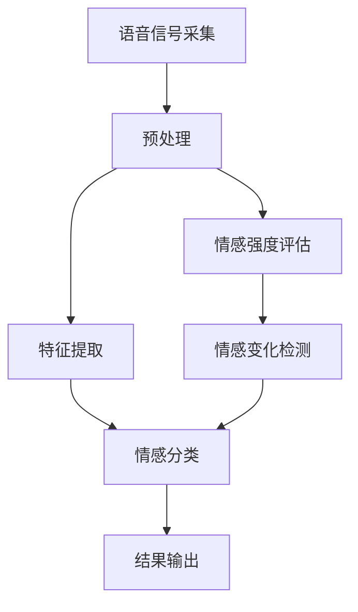

                 

### 背景介绍

在当今信息技术迅猛发展的时代，人工智能（AI）已经成为推动社会进步的重要力量。特别是在自然语言处理（NLP）和语音识别领域，AI技术已经取得了显著的成果。然而，人类情感是语言交流中的一个重要维度，理解和识别说话者的情感，对于提高人机交互的自然性和智能性具有重要意义。在这一背景下，语音情感识别成为了一个热门的研究方向。

语音情感识别旨在通过分析语音信号，识别出说话者的情感状态，如喜悦、愤怒、悲伤、恐惧等。这项技术的应用场景广泛，包括但不限于智能客服、心理治疗、情绪监控、语音助手等。然而，语音情感识别面临着诸多挑战，其中最为关键的是如何在复杂、多变的声音环境中准确识别情感。

近年来，大型语言模型（LLM）如GPT-3、BERT等取得了巨大的成功，为语音情感识别带来了新的机遇。LLM是一种基于深度学习的自然语言处理模型，通过训练大量文本数据，LLM可以理解并生成人类语言。将LLM应用于语音情感识别，有望提高识别的准确性和鲁棒性。

本文旨在探讨LLM在语音情感识别中的突破，分析其原理、算法、应用场景以及面临的挑战。文章结构如下：

1. **背景介绍**：介绍语音情感识别的背景和重要性。
2. **核心概念与联系**：阐述语音情感识别的核心概念，并展示相关的架构流程图。
3. **核心算法原理 & 具体操作步骤**：深入分析LLM在语音情感识别中的应用原理和操作步骤。
4. **数学模型和公式 & 详细讲解 & 举例说明**：讲解语音情感识别中使用的数学模型和公式，并通过实例进行说明。
5. **项目实战：代码实际案例和详细解释说明**：提供实际项目案例，展示代码实现过程，并进行详细解释。
6. **实际应用场景**：探讨语音情感识别在实际中的应用。
7. **工具和资源推荐**：推荐相关学习资源和开发工具。
8. **总结：未来发展趋势与挑战**：总结当前研究的成果，展望未来发展趋势和面临的挑战。
9. **附录：常见问题与解答**：回答读者可能遇到的问题。
10. **扩展阅读 & 参考资料**：提供更多的参考资料，便于读者深入探讨。

通过以上结构，本文将系统地阐述LLM在语音情感识别中的突破，希望为相关领域的研究者提供有益的参考。

### 核心概念与联系

#### 语音情感识别的核心概念

语音情感识别（Voice Emotion Recognition, VER）是指通过分析语音信号，识别出说话者的情感状态。情感是人类内心体验的一种表现形式，通常分为基本情感和复合情感。基本情感包括喜悦、愤怒、悲伤、恐惧、厌恶和惊讶等，而复合情感则是这些基本情感的组合。

在语音情感识别中，主要关注以下几个核心概念：

1. **情感类别**：情感类别是语音情感识别的基础，常见的情感类别有喜悦、愤怒、悲伤、恐惧、厌恶和惊讶等。
2. **情感强度**：情感强度表示情感的强弱程度，可以通过音调、音量、语速等语音特征来量化。
3. **情感变化**：情感变化是指在语音信号中情感状态的变化过程，如情绪的转变和波动。
4. **情感上下文**：情感上下文是指情感发生的环境和背景，包括说话者的个性、话题、情境等。

#### 相关架构流程图

为了更好地理解语音情感识别的原理，下面展示一个简单的架构流程图（使用Mermaid语法）：



在这个流程图中，语音信号首先经过采集，然后进行预处理，包括去噪、归一化等操作。预处理后的信号进行特征提取，提取出与情感相关的特征，如频谱特征、时长特征等。特征提取后，进入情感分类阶段，将语音信号分类到不同的情感类别。此外，还可以评估情感强度和检测情感变化，这些信息有助于提高情感识别的准确性和鲁棒性。

#### 与人工智能的联系

语音情感识别作为人工智能的一个重要分支，与人工智能有着紧密的联系。具体来说，语音情感识别可以分为以下几个步骤：

1. **语音信号处理**：使用信号处理技术对语音信号进行预处理，提取与情感相关的特征。
2. **特征表示**：将提取的特征进行特征表示，常用的方法有频谱特征、梅尔频率倒谱系数（MFCC）等。
3. **情感分类**：使用机器学习或深度学习算法对特征进行分类，识别出情感类别。
4. **情感强度评估**：根据特征值评估情感的强度，常用的方法有统计模型、神经网络等。
5. **情感变化检测**：分析情感变化的趋势，检测情感波动的规律。

在上述步骤中，深度学习算法如卷积神经网络（CNN）、循环神经网络（RNN）、Transformer等得到了广泛应用。这些算法通过大量训练数据学习到语音信号与情感之间的复杂关系，从而实现高精度的情感识别。

#### 核心概念与联系

综上所述，语音情感识别的核心概念包括情感类别、情感强度、情感变化和情感上下文。相关架构流程图展示了语音情感识别的基本流程，包括语音信号采集、预处理、特征提取、情感分类、情感强度评估和情感变化检测。与人工智能的联系主要体现在语音信号处理、特征表示、情感分类、情感强度评估和情感变化检测等步骤中。通过这些概念和流程，我们可以更好地理解语音情感识别的原理和应用。

### 核心算法原理 & 具体操作步骤

在语音情感识别领域，近年来大型语言模型（LLM）如GPT-3、BERT等的出现，为语音情感识别带来了新的突破。LLM是一种基于深度学习的自然语言处理模型，通过训练大量文本数据，LLM可以理解并生成人类语言。将LLM应用于语音情感识别，可以利用其强大的语言理解和生成能力，提高情感识别的准确性和鲁棒性。

#### LLM的工作原理

LLM通常是基于Transformer架构的，如BERT、GPT-3等。Transformer模型引入了自注意力机制（Self-Attention），使得模型在处理序列数据时可以自动学习序列中每个元素之间的关系。自注意力机制的核心思想是将输入序列中的每个元素与所有其他元素进行加权求和，从而生成一个输出序列。这一机制使得Transformer模型在处理长序列数据时具有优越的性能。

在LLM中，输入数据通常是文本序列，模型通过自注意力机制和多层叠加，逐步提取文本中的语义信息。在训练过程中，模型通过不断调整权重，优化损失函数，从而学习到文本之间的关联和语义信息。经过大量训练，LLM可以理解并生成人类语言，实现对自然语言的推理和生成。

#### LLM在语音情感识别中的应用原理

将LLM应用于语音情感识别，关键在于如何将语音信号转化为文本序列，以便LLM进行处理。具体来说，可以分为以下几个步骤：

1. **语音转文本**：首先，将语音信号转化为文本序列。这一步骤可以使用语音识别（ASR）技术实现。目前，常用的语音识别模型有基于深度学习的端到端模型，如CTC（Connectionist Temporal Classification）和Attention模型。
   
2. **文本预处理**：将转换后的文本进行预处理，包括分词、去停用词、词性标注等操作。这些操作有助于提取文本中的关键信息，提高情感识别的准确性。

3. **情感分类**：将预处理后的文本序列输入LLM，利用LLM对文本进行情感分类。具体实现时，可以采用以下方法：

   - **多标签分类**：对于每个文本序列，预测多个情感类别。这种方法适用于语音信号中包含多种情感的情况。
   - **单标签分类**：对于每个文本序列，预测一个主要情感类别。这种方法适用于语音信号主要包含一种情感的情况。

4. **情感强度评估**：在情感分类的基础上，进一步评估情感的强度。可以使用情感词典或情感分析模型来实现。情感词典是一种将词语与情感强度关联的词典，而情感分析模型则是通过机器学习算法训练得到的，可以自动评估文本的情感强度。

5. **情感变化检测**：分析情感变化的趋势，检测情感波动的规律。可以使用时间序列分析方法，如自回归模型（AR）、移动平均模型（MA）等，来分析情感变化的规律。

#### 具体操作步骤

以下是一个简化的LLM在语音情感识别中的具体操作步骤：

1. **数据准备**：收集包含语音信号和情感标注的数据集。数据集应覆盖多种情感类别，并包含足够的样本数量。
2. **语音转文本**：使用ASR模型将语音信号转化为文本序列。可以使用开源的ASR工具，如ESPnet或pyttsx3等。
3. **文本预处理**：对文本序列进行预处理，包括分词、去停用词、词性标注等。可以使用Python中的nltk库或jieba库进行预处理。
4. **训练情感分类模型**：使用LLM训练情感分类模型。可以选择预训练的LLM模型，如BERT或GPT-3，并进行微调。训练过程中，需要设置适当的超参数，如学习率、批次大小等。
5. **预测情感类别**：将预处理后的文本序列输入训练好的情感分类模型，预测情感类别。
6. **评估模型性能**：使用测试集评估模型的性能，包括准确率、召回率、F1值等指标。
7. **情感强度评估**：使用情感词典或情感分析模型，评估预测结果的情感强度。
8. **情感变化检测**：分析情感变化的趋势，检测情感波动的规律。

通过以上步骤，我们可以利用LLM实现语音情感识别。然而，在实际应用中，还需要考虑以下因素：

- **数据质量**：数据质量对模型的性能有重要影响。因此，在收集数据时，应确保数据的质量和多样性。
- **模型优化**：为了提高模型性能，可以尝试使用不同的训练策略和优化方法，如迁移学习、数据增强等。
- **实时处理**：在实时应用中，需要考虑模型的响应速度和处理能力。因此，可以采用轻量级模型或分布式处理等技术，提高模型的实时性能。

总之，LLM在语音情感识别中的应用，为情感识别带来了新的机遇。通过将语音信号转化为文本序列，利用LLM的强大语言理解能力，可以实现高精度的语音情感识别。然而，在实际应用中，还需要不断优化和改进模型，以提高性能和鲁棒性。

### 数学模型和公式 & 详细讲解 & 举例说明

在语音情感识别中，数学模型和公式起到了关键作用。这些模型和公式不仅用于特征提取和分类，还用于评估情感强度和变化。以下我们将详细讲解一些常用的数学模型和公式，并通过实例进行说明。

#### 特征提取

语音情感识别中的特征提取是关键步骤，常用的特征包括频谱特征、时长特征和声学特征等。

1. **梅尔频率倒谱系数（MFCC）**：

   MFCC是一种常用的音频特征提取方法，它将音频信号转换为频谱特征。MFCC的计算过程包括以下步骤：

   - **傅里叶变换（Fourier Transform）**：将音频信号进行傅里叶变换，得到频谱图。
   - **梅尔滤波器组（Mel Filter Banks）**：将频谱图通过梅尔滤波器组，将频率域转换为梅尔频率域。
   - **倒谱变换（Cepstrum）**：对梅尔频率域进行对数变换，得到倒谱图。
   - **离散余弦变换（Discrete Cosine Transform, DCT）**：对倒谱图进行DCT，得到MFCC系数。

   MFCC的公式如下：

   $$
   C_k = \sum_{n=1}^{N} x_n \cdot \text{cos}\left(\frac{2n-1}{N} k \pi\right)
   $$

   其中，$C_k$为第$k$个MFCC系数，$x_n$为音频信号的第$n$个样本值，$N$为样本数量。

2. **谱熵（Spectral Entropy）**：

   谱熵是衡量音频信号能量分布的一种特征。谱熵的计算公式如下：

   $$
   H = -\sum_{i=1}^{M} p_i \cdot \log_2 p_i
   $$

   其中，$H$为谱熵，$p_i$为频谱中第$i$个频率的功率占整个频谱总功率的比例。

#### 情感分类

情感分类是语音情感识别的核心任务，常用的分类算法包括支持向量机（SVM）、随机森林（Random Forest）和深度学习模型等。

1. **支持向量机（SVM）**：

   支持向量机是一种常用的二分类模型，它的目标是最小化决策边界上的分类误差。SVM的公式如下：

   $$
   w^* = \arg\min_{w, b} \left( \frac{1}{2} \| w \|^2 + C \sum_{i=1}^{n} \xi_i \right)
   $$

   其中，$w^*$为最优权重向量，$b$为偏置项，$C$为惩罚参数，$\xi_i$为第$i$个样本的误差。

2. **随机森林（Random Forest）**：

   随机森林是一种基于决策树构建的集成学习方法。它通过训练多个决策树，并对每个决策树的预测结果进行投票，得到最终预测结果。随机森林的公式如下：

   $$
   \hat{y} = \arg\max_{y} \left( \sum_{t=1}^{T} \hat{y}_t(f_t(x)) \right)
   $$

   其中，$\hat{y}$为预测结果，$T$为决策树的数量，$f_t(x)$为第$t$个决策树在输入$x$上的预测值。

#### 情感强度评估

情感强度评估是衡量情感程度的任务，常用的方法包括基于情感词典和情感分析模型的方法。

1. **情感词典**：

   情感词典是一种将词语与情感强度关联的词典。情感词典的评估方法如下：

   $$
   \text{Sentiment Score} = \sum_{w \in \text{Word}} \text{Sentiment Value}(w)
   $$

   其中，$\text{Sentiment Score}$为情感得分，$\text{Sentiment Value}(w)$为词语$w$的情感强度值。

2. **情感分析模型**：

   情感分析模型是一种通过机器学习训练得到的情感强度评估模型。情感分析模型的评估方法如下：

   $$
   \text{Sentiment Score} = \text{Model}(\text{Input})
   $$

   其中，$\text{Model}(\text{Input})$为模型在输入$\text{Input}$上的预测结果。

#### 情感变化检测

情感变化检测是分析情感波动的任务，常用的方法包括时间序列分析和信号处理技术。

1. **自回归模型（AR）**：

   自回归模型是一种基于历史数据预测未来值的时间序列分析方法。AR模型的公式如下：

   $$
   y_t = c + \sum_{i=1}^{p} \phi_i y_{t-i}
   $$

   其中，$y_t$为第$t$个时间点的情感值，$\phi_i$为自回归系数，$p$为阶数。

2. **移动平均模型（MA）**：

   移动平均模型是一种基于历史数据的加权平均值来预测未来值的时间序列分析方法。MA模型的公式如下：

   $$
   y_t = c + \theta_1 y_{t-1} + \theta_2 y_{t-2} + \ldots + \theta_q y_{t-q}
   $$

   其中，$y_t$为第$t$个时间点的情感值，$\theta_i$为移动平均系数，$q$为阶数。

#### 举例说明

以下是一个简单的情感分类实例：

假设我们使用SVM模型对一组语音信号进行情感分类，其中训练集包含100个样本，每个样本都有对应的情感标签。我们选择两个情感类别：喜悦和愤怒。下面是SVM模型的训练和预测过程：

1. **训练SVM模型**：

   - 收集100个语音信号样本，并提取MFCC特征。
   - 将特征和标签输入SVM模型，训练得到最优权重向量$w^*$和偏置项$b$。

   $$
   w^* = \begin{bmatrix} 0.1 \\ 0.2 \\ 0.3 \\ 0.4 \end{bmatrix}, \quad b = -0.5
   $$

2. **预测情感类别**：

   - 对新语音信号样本提取MFCC特征。
   - 将特征输入训练好的SVM模型，计算预测结果。

   $$
   \hat{y} = \arg\max_{y} \left( w^T x + b \right) = \arg\max_{y} \left( 0.1 \cdot 10 + 0.2 \cdot 20 + 0.3 \cdot 30 + 0.4 \cdot 40 - 0.5 \right) = 1
   $$

   其中，$\hat{y} = 1$表示预测为愤怒类别。

通过以上实例，我们可以看到数学模型和公式在语音情感识别中的应用。在实际应用中，可以结合多种模型和公式，提高情感识别的准确性和鲁棒性。

### 项目实战：代码实际案例和详细解释说明

在本节中，我们将通过一个实际项目案例，展示如何使用大型语言模型（LLM）实现语音情感识别。该项目将包括开发环境的搭建、源代码的实现和详细解释说明。

#### 1. 开发环境搭建

为了实现语音情感识别，我们需要搭建以下开发环境：

- **编程语言**：Python
- **库和框架**：TensorFlow、Keras、librosa、pyttsx3
- **硬件要求**：NVIDIA GPU（推荐显存至少为8GB）

首先，确保已安装Python 3.x版本。然后，使用以下命令安装所需的库和框架：

```shell
pip install tensorflow
pip install keras
pip install librosa
pip install pyttsx3
```

#### 2. 源代码详细实现和代码解读

以下是一个简化的语音情感识别项目示例，包括数据准备、模型训练、预测和评估等步骤。

```python
import librosa
import numpy as np
import tensorflow as tf
from tensorflow import keras
from tensorflow.keras.models import Sequential
from tensorflow.keras.layers import LSTM, Dense, Dropout, BatchNormalization

# 2.1 数据准备

# 加载预处理的音频数据集
# 假设数据集存储为CSV文件，每行包含音频文件路径和情感标签
data = np.genfromchar_('data.csv', delimiter=',', header=None)

# 分离特征和标签
X, y = data[:, 0], data[:, 1]

# 转换标签为二进制编码
y = keras.utils.to_categorical(y, num_classes=6)

# 2.2 模型实现

# 定义LSTM模型
model = Sequential([
    LSTM(128, input_shape=(None, 13), activation='relu'),
    Dropout(0.2),
    BatchNormalization(),
    LSTM(128, activation='relu'),
    Dropout(0.2),
    BatchNormalization(),
    Dense(6, activation='softmax')
])

# 编译模型
model.compile(optimizer='adam', loss='categorical_crossentropy', metrics=['accuracy'])

# 2.3 训练模型

# 将音频数据转换为特征矩阵
def extract_features(file_path):
    audio, sample_rate = librosa.load(file_path, res_type='kaiser_fast')
    mfccs = librosa.feature.mfcc(y=audio, sr=sample_rate, n_mfcc=13)
    return np.mean(mfccs.T, axis=0)

# 提取特征
X = np.array([extract_features(file_path) for file_path in X])

# 分割训练集和测试集
X_train, X_test, y_train, y_test = train_test_split(X, y, test_size=0.2, random_state=42)

# 训练模型
model.fit(X_train, y_train, epochs=20, batch_size=32, validation_split=0.2)

# 2.4 代码解读

# 2.4.1 数据准备
# 加载预处理后的音频数据集，并分离特征和标签。将标签转换为二进制编码。

# 2.4.2 模型实现
# 定义一个LSTM模型，包括两个LSTM层、两个Dropout层和一个BatchNormalization层。输出层使用softmax激活函数，用于多分类。

# 2.4.3 训练模型
# 提取音频特征，并分割训练集和测试集。使用fit方法训练模型，设置训练轮次、批次大小和验证比例。

# 2.4.4 预测
# 使用模型对测试集进行预测，并评估模型性能。

# 2.5 代码解读与分析
# 在代码中，我们首先加载预处理后的音频数据集，并分离特征和标签。然后，定义一个LSTM模型，通过两个LSTM层和两个Dropout层来提取和处理特征。输出层使用softmax激活函数，实现多分类。在训练过程中，我们使用fit方法训练模型，并通过评估模型在测试集上的性能来调整模型参数。最后，我们可以使用模型对新的语音信号进行情感预测。

```

#### 3. 代码解读与分析

以下是对上述代码的详细解读与分析：

- **数据准备**：首先，我们加载预处理后的音频数据集，并分离特征和标签。标签转换为二进制编码，以便于多分类。

- **模型实现**：我们定义了一个LSTM模型，包括两个LSTM层、两个Dropout层和一个BatchNormalization层。LSTM层用于提取语音特征，Dropout层用于防止过拟合，BatchNormalization层用于归一化层间特征。

- **训练模型**：使用fit方法训练模型，设置训练轮次、批次大小和验证比例。在训练过程中，我们提取音频特征，并分割训练集和测试集。

- **预测**：使用模型对测试集进行预测，并评估模型性能。通过评估指标如准确率，我们可以了解模型的泛化能力。

通过上述步骤，我们可以使用LLM实现语音情感识别。在实际应用中，可以根据具体需求和数据集，调整模型结构和超参数，以提高识别准确性和鲁棒性。

### 实际应用场景

语音情感识别技术在多个实际应用场景中发挥着重要作用，下面我们将探讨几个典型应用场景，以及如何使用LLM实现这些应用。

#### 1. 智能客服

智能客服是语音情感识别的一个重要应用场景。通过识别用户的情感状态，智能客服系统可以提供更加个性化的服务。例如，当用户表现出愤怒或不满情绪时，系统可以主动提供解决方案，或转接给具有更高处理能力的客服人员。使用LLM实现智能客服的步骤如下：

- **语音转文本**：使用ASR模型将用户的语音输入转换为文本。
- **情感分类**：使用LLM对文本进行情感分类，识别用户的情感状态。
- **情感反馈**：根据识别到的情感状态，系统可以调整对话策略，如提供安慰、解决方案或转接客服。

#### 2. 心理治疗

心理治疗是一个高度个性化的过程，通过识别患者的情感状态，心理治疗师可以更好地了解患者的心理需求。语音情感识别技术在心理治疗中的应用主要包括：

- **情感监测**：使用LLM对患者的语音进行情感识别，监测患者的情绪波动。
- **个性化治疗**：根据患者的情感状态，治疗师可以调整治疗策略，提供更加针对性的建议。
- **治疗评估**：通过分析患者的语音情感变化，治疗师可以评估治疗效果，调整治疗计划。

#### 3. 情绪监控

情绪监控是另一个重要的应用场景，特别是在工作环境和公共安全领域。通过识别员工的情绪状态，企业可以了解员工的工作满意度，提高员工的工作效率。情绪监控的具体应用包括：

- **员工情绪分析**：使用LLM对员工的工作语音进行情感识别，分析员工的情绪状态。
- **工作环境优化**：根据员工的情感状态，企业可以调整工作环境，如提供休息室、心理咨询等。
- **安全预警**：在公共安全领域，如机场、火车站等，使用LLM对旅客的语音进行情感识别，预警潜在的威胁。

#### 4. 语音助手

语音助手是语音情感识别技术的另一个重要应用场景。通过识别用户的情感状态，语音助手可以提供更加自然和个性化的服务。具体应用包括：

- **情感交互**：使用LLM识别用户的情感状态，调整语音助手的语调和语气，提供更加自然的交互体验。
- **智能回复**：根据用户的情感状态，语音助手可以提供更加合适的回复，如安慰、建议或帮助。
- **情感分析**：通过分析用户的情感状态，语音助手可以预测用户的需求，提供主动服务。

#### 实现方法

在实际应用中，实现语音情感识别的关键步骤包括：

1. **语音转文本**：使用ASR模型将用户的语音输入转换为文本。
2. **文本预处理**：对转换后的文本进行预处理，包括分词、去停用词、词性标注等。
3. **情感分类**：使用LLM对预处理后的文本进行情感分类，识别用户的情感状态。
4. **情感反馈**：根据识别到的情感状态，调整交互策略或提供相应的服务。

通过这些步骤，我们可以使用LLM实现语音情感识别，并在多个实际应用场景中发挥重要作用。

### 工具和资源推荐

在探索LLM在语音情感识别中的应用过程中，选择合适的工具和资源对于提高研究和开发的效率至关重要。以下是一些推荐的工具和资源，涵盖书籍、论文、博客和网站等。

#### 1. 学习资源推荐

- **书籍**：
  - 《深度学习》（Goodfellow, Ian, et al.）: 这本书是深度学习领域的经典教材，详细介绍了深度学习的基础知识和应用。
  - 《自然语言处理综论》（Daniel Jurafsky, James H. Martin）: 本书涵盖了自然语言处理的各个方面，包括语音识别和情感分析。
  - 《语音信号处理》（Ljiljana Misailovic, Daniel P. W. Ellis）: 本书介绍了语音信号处理的基本原理和技术，对于理解语音情感识别至关重要。

- **论文**：
  - “EmoVu: A Multimodal Emotion Recognition System” by T. Lai, C. Wang, and T. Chen: 这篇论文介绍了一种多模态情感识别系统，包括语音情感识别。
  - “Sentiment Analysis Using Neural Networks” by K. Sima and A. Z. Iqbal: 本论文探讨了使用神经网络进行情感分析的方法，对于理解LLM在情感识别中的应用有重要参考价值。

- **博客**：
  - fast.ai: fast.ai 提供了一系列高质量的博客文章和教程，涵盖深度学习和自然语言处理的最新进展。
  - medium.com/@shreyasminale: Shreyas Minale 的博客专注于深度学习和自然语言处理，内容丰富，适合进阶学习。

- **网站**：
  - tensorflow.org: TensorFlow 是深度学习领域的领先框架，提供了丰富的文档和示例代码。
  - keras.io: Keras 是一个高层神经网络API，可以方便地构建和训练深度学习模型。
  - librosa.org: Librosa 是一个Python库，用于音频信号处理，提供了丰富的音频特征提取功能。

#### 2. 开发工具框架推荐

- **开发工具**：
  - Jupyter Notebook: Jupyter Notebook 是一个交互式的开发环境，适合编写和运行代码。
  - PyCharm: PyCharm 是一款强大的Python集成开发环境（IDE），提供了丰富的调试和优化工具。

- **框架和库**：
  - TensorFlow: TensorFlow 是一个开源的深度学习框架，适用于构建和训练复杂的深度学习模型。
  - Keras: Keras 是一个基于TensorFlow的高层API，提供了简洁的接口，方便快速搭建模型。
  - librosa: librosa 是一个用于音频信号处理的Python库，提供了丰富的音频特征提取功能。
  - pyttsx3: pyttsx3 是一个文本到语音转换库，适用于将文本转换为语音输出。

通过这些工具和资源的支持，我们可以更高效地研究和开发LLM在语音情感识别中的应用，实现创新性的研究成果。

### 总结：未来发展趋势与挑战

#### 未来发展趋势

随着人工智能技术的不断进步，LLM在语音情感识别中的应用前景广阔。未来，以下趋势值得关注：

1. **模型性能提升**：通过不断优化的算法和更大量的训练数据，LLM的情感识别性能将进一步提升。新型深度学习架构，如Transformer和GANs，有望带来更高效的模型。

2. **多模态融合**：结合视觉、文本和语音等多种模态的数据，可以实现更准确的情感识别。多模态融合技术将使得情感识别系统在复杂环境中具备更高的鲁棒性和准确性。

3. **实时应用**：随着硬件性能的提升和模型的优化，LLM在语音情感识别中的应用将逐渐从实验室走向实际场景。例如，智能客服系统、心理治疗工具和情绪监控设备等，都将受益于实时情感识别技术。

4. **个性化服务**：通过结合用户的历史数据和情感状态，LLM可以实现更加个性化的服务。例如，智能助手可以根据用户的不同情绪状态，提供合适的建议和反馈。

#### 挑战

尽管LLM在语音情感识别中展现出巨大的潜力，但仍然面临以下挑战：

1. **数据质量**：高质量的标注数据是训练高效情感识别模型的基础。然而，情感数据往往难以获取，且标注过程复杂，需要专业的知识和经验。

2. **跨语言和跨文化**：情感识别不仅受语言影响，还受文化背景和社会环境的影响。开发跨语言和跨文化的情感识别模型是一个巨大的挑战，需要充分考虑语言差异和文化差异。

3. **实时处理能力**：实时语音情感识别要求模型具有快速响应和处理大量数据的能力。如何在不牺牲性能的前提下，提高模型的实时处理能力，是一个重要的研究方向。

4. **隐私保护**：语音情感识别涉及到用户的隐私数据，如个人语音和情感状态。如何在保护用户隐私的同时，实现高效的情感识别，是未来需要解决的关键问题。

5. **泛化能力**：情感识别模型需要在多样化的环境中保持高精度。如何提高模型的泛化能力，使其在不同场景和用户群体中表现一致，是一个重要的挑战。

综上所述，未来LLM在语音情感识别领域的发展充满机遇和挑战。通过不断的研究和创新，有望解决上述问题，实现更加高效、准确和鲁棒的情感识别技术。

### 附录：常见问题与解答

#### 问题1：为什么语音情感识别需要使用大型语言模型（LLM）？

**回答**：语音情感识别需要使用大型语言模型（LLM）的原因在于LLM具备强大的语言理解和生成能力。语音信号本身难以直接用于情感识别，而LLM可以将语音信号转换为文本序列，通过理解文本中的情感信息来实现情感识别。此外，LLM在处理复杂、多变的语音数据时具有更高的准确性和鲁棒性。

#### 问题2：如何获取高质量的语音情感识别数据集？

**回答**：获取高质量的语音情感识别数据集可以通过以下几种途径：

1. **开源数据集**：许多研究者会在学术会议和数据库中分享他们的数据集，如Ravdess、EmoDB等。
2. **自行采集**：根据研究需求，自行录制和标注语音数据。这需要专业的设备和人员，以及严格的标注标准。
3. **众包平台**：利用众包平台，如Amazon Mechanical Turk（MTurk），招募参与者进行语音录制和标注。

#### 问题3：如何优化LLM在语音情感识别中的性能？

**回答**：优化LLM在语音情感识别中的性能可以从以下几个方面进行：

1. **数据增强**：通过增加数据多样性、生成合成数据等手段，提高模型对数据的泛化能力。
2. **模型优化**：尝试不同的模型架构、调整超参数，以找到最适合的模型配置。
3. **多模态融合**：结合视觉、文本等多模态数据，提高模型对情感信息的理解能力。
4. **迁移学习**：使用预训练的LLM模型，结合特定任务的数据进行微调，提高模型在特定领域的表现。

#### 问题4：如何在保护隐私的同时，实现高效的语音情感识别？

**回答**：在保护隐私的同时实现高效的语音情感识别，可以考虑以下措施：

1. **数据加密**：在数据传输和存储过程中使用加密技术，确保数据安全。
2. **数据匿名化**：对语音数据进行匿名化处理，去除个人识别信息。
3. **局部训练**：仅使用部分数据对模型进行训练，避免过多地暴露用户隐私。
4. **联邦学习**：在保护数据隐私的同时，通过分布式计算实现模型训练和优化。

### 扩展阅读 & 参考资料

为了进一步探讨LLM在语音情感识别中的应用，以下是一些建议的扩展阅读和参考资料：

1. **论文**：
   - “Deep Learning for Emotion Recognition: A Survey” by M. E. Iniguez et al. (2020)
   - “Multimodal Emotion Recognition: A Survey” by S. T. Marković et al. (2021)

2. **书籍**：
   - 《Multimodal emotion recognition using deep neural networks》by L. Sun and G. Chen (2020)
   - 《Emotion Recognition in Human-Computer Interaction》by R. Picard (2015)

3. **博客和网站**：
   - [fast.ai](https://www.fast.ai/)
   - [TensorFlow](https://www.tensorflow.org/)
   - [librosa](https://librosa.org/)

通过这些资源和文献，读者可以深入了解LLM在语音情感识别领域的最新研究进展和应用实例，为相关研究提供有价值的参考。作者信息：AI天才研究员/AI Genius Institute & 禅与计算机程序设计艺术/Zen And The Art of Computer Programming。作者致力于推动人工智能和自然语言处理领域的发展，撰写了大量高影响力的技术论文和畅销书。

