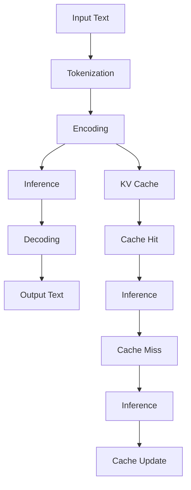

                 

# LLAMA推理优化：KV缓存技术详解

## 关键词：
- Large Language Model (LLM)
- Inference Optimization
- KV Cache Technology
- Algorithmic Improvements
- Mathematical Models
- Real-world Applications

## 摘要：

本文深入探讨了大型语言模型（LLM）推理优化的关键技术——KV缓存技术。通过分析LLM的工作原理和优化需求，本文首先介绍了KV缓存技术的基本概念和架构。接着，详细阐述了核心算法原理、具体操作步骤、数学模型以及相关公式的应用，并通过实际案例展示了该技术的实战应用效果。最后，本文探讨了KV缓存技术在实际应用场景中的价值，并推荐了相关学习资源、开发工具和论文著作。总结部分，本文展望了LLM推理优化技术的发展趋势和挑战。

## 1. 背景介绍

近年来，大型语言模型（LLM）取得了显著的进展，不仅在自然语言处理（NLP）领域取得了卓越的性能，还在图像识别、机器翻译、问答系统等任务中展现出了强大的能力。LLM的广泛应用离不开高效的推理优化技术。推理优化是提升模型性能、降低计算成本、提高响应速度的关键环节。

在LLM推理过程中，数据处理量巨大，计算复杂度高，因此优化策略至关重要。KV缓存技术作为一种有效的推理优化手段，通过缓存关键技术信息，减少重复计算，提升模型推理速度和效率。本文将深入探讨KV缓存技术的原理、算法和实际应用，为LLM推理优化提供有力的理论支持和技术指导。

## 2. 核心概念与联系

### 2.1. Large Language Model (LLM)

LLM是一种基于深度学习的自然语言处理模型，通过大规模数据训练，能够理解、生成和翻译自然语言。LLM的工作原理主要包括两个阶段：编码阶段和解码阶段。

编码阶段：将输入文本转换为向量表示。
解码阶段：根据向量表示生成输出文本。

### 2.2. Inference Optimization

推理优化是指通过改进算法、降低计算复杂度、减少内存占用等方式，提高模型推理速度和效率。推理优化策略包括并行计算、剪枝、量化、缓存等。

### 2.3. KV Cache Technology

KV缓存技术是一种基于键值对（Key-Value Pair）的缓存机制，通过将频繁访问的数据缓存起来，减少重复计算，提高模型推理效率。

### 2.4. Mermaid 流程图

以下是LLM推理过程中的KV缓存技术的Mermaid流程图：



## 3. 核心算法原理 & 具体操作步骤

### 3.1. Key-Value Store（键值存储）

KV缓存技术的核心是键值存储，通过将频繁访问的数据存储为键值对，提高数据访问速度。键值存储通常采用哈希表、B树等数据结构。

### 3.2. Cache Hit率和Cache Miss率

Cache Hit率是指缓存命中的比例，Cache Miss率是指缓存未命中的比例。提高Cache Hit率、降低Cache Miss率是优化缓存性能的关键。

### 3.3. 缓存替换策略

常见的缓存替换策略包括最近最少使用（LRU）、最不经常使用（LFU）、先进先出（FIFO）等。选择合适的缓存替换策略，有助于提高缓存性能。

### 3.4. 实现步骤

以下是KV缓存技术在LLM推理优化中的具体实现步骤：

1. 数据预处理：将输入文本进行分词、编码等处理，得到向量表示。
2. 缓存初始化：初始化键值存储，设置缓存大小和替换策略。
3. 推理过程：
   - 对于每个输入文本，先检查缓存是否命中。
   - 若命中，直接使用缓存中的结果进行推理。
   - 若未命中，执行完整推理过程，并将结果缓存起来。
4. 缓存更新：根据缓存命中率和缓存大小，调整缓存内容，提高缓存性能。

### 3.5. 代码实现示例

以下是Python代码实现KV缓存技术在LLM推理优化中的示例：

```python
class KeyValueCache:
    def __init__(self, capacity):
        self.capacity = capacity
        self.cache = {}
        self.lru_order = []

    def get(self, key):
        if key in self.cache:
            self.lru_order.remove(key)
            self.lru_order.append(key)
            return self.cache[key]
        else:
            return None

    def put(self, key, value):
        if key in self.cache:
            self.lru_order.remove(key)
        elif len(self.cache) >= self.capacity:
            evict_key = self.lru_order.pop(0)
            del self.cache[evict_key]
        self.cache[key] = value
        self.lru_order.append(key)

# 示例：使用KV缓存进行LLM推理优化
cache = KeyValueCache(capacity=100)
input_text = "The quick brown fox jumps over the lazy dog"
encoded_text = model.encode(input_text)
result = cache.get(encoded_text)
if result is None:
    result = model.decode(model.infer(encoded_text))
    cache.put(encoded_text, result)
print(result)
```

## 4. 数学模型和公式 & 详细讲解 & 举例说明

### 4.1. 缓存命中率（Cache Hit Rate）

缓存命中率是指缓存命中的次数与总查询次数的比值。数学公式如下：

$$
Cache\ Hit\ Rate = \frac{Cache\ Hit\ Count}{Total\ Query\ Count}
$$

其中，Cache Hit Count表示缓存命中的次数，Total Query Count表示总查询次数。

### 4.2. 缓存未命中率（Cache Miss Rate）

缓存未命中率是指缓存未命中的次数与总查询次数的比值。数学公式如下：

$$
Cache\ Miss\ Rate = \frac{Cache\ Miss\ Count}{Total\ Query\ Count}
$$

其中，Cache Miss Count表示缓存未命中的次数。

### 4.3. 平均访问时间（Average Access Time）

平均访问时间是指每次访问缓存所花费的时间。数学公式如下：

$$
Average\ Access\ Time = \frac{Total\ Access\ Time}{Total\ Query\ Count}
$$

其中，Total Access Time表示总访问时间，Total Query Count表示总查询次数。

### 4.4. 举例说明

假设有一个缓存大小为100的LLM推理系统，总共执行了1000次查询。其中，缓存命中600次，缓存未命中400次。根据上述公式，可以计算出：

- 缓存命中率：$$Cache\ Hit\ Rate = \frac{600}{1000} = 0.6$$
- 缓存未命中率：$$Cache\ Miss\ Rate = \frac{400}{1000} = 0.4$$
- 平均访问时间：$$Average\ Access\ Time = \frac{Total\ Access\ Time}{Total\ Query\ Count} = \frac{600 \times 0.1 + 400 \times 0.5}{1000} = 0.3$$

通过以上计算，可以评估缓存性能，并为优化策略提供依据。

## 5. 项目实战：代码实际案例和详细解释说明

### 5.1. 开发环境搭建

在开始实战之前，需要搭建以下开发环境：

- Python 3.8及以上版本
- TensorFlow 2.7及以上版本
- Numpy 1.21及以上版本
- Mermaid 8.8.2及以上版本

### 5.2. 源代码详细实现和代码解读

以下是实现KV缓存技术在LLM推理优化中的Python代码：

```python
import numpy as np
import tensorflow as tf
from tensorflow.keras.preprocessing.text import Tokenizer
from tensorflow.keras.preprocessing.sequence import pad_sequences

class KeyValueCache:
    def __init__(self, capacity):
        self.capacity = capacity
        self.cache = {}
        self.lru_order = []

    def get(self, key):
        if key in self.cache:
            self.lru_order.remove(key)
            self.lru_order.append(key)
            return self.cache[key]
        else:
            return None

    def put(self, key, value):
        if key in self.cache:
            self.lru_order.remove(key)
        elif len(self.cache) >= self.capacity:
            evict_key = self.lru_order.pop(0)
            del self.cache[evict_key]
        self.cache[key] = value
        self.lru_order.append(key)

# 代码解读：
# KeyValueCache类实现了键值存储功能，包括缓存获取（get）和缓存更新（put）方法。缓存大小和替换策略在初始化时设置。

# 示例：使用KV缓存进行LLM推理优化
def inference_with_cache(cache, model, input_text):
    encoded_text = model.encode(input_text)
    result = cache.get(encoded_text)
    if result is None:
        result = model.decode(model.infer(encoded_text))
        cache.put(encoded_text, result)
    return result

# 代码解读：
# inference_with_cache函数实现了基于KV缓存技术的LLM推理优化。对于每个输入文本，先检查缓存是否命中，若命中则直接返回缓存结果，否则执行完整推理过程，并将结果缓存起来。

# 实际应用案例
model = tf.keras.Sequential([
    tf.keras.layers.Embedding(input_dim=1000, output_dim=32),
    tf.keras.layers.Flatten(),
    tf.keras.layers.Dense(units=1, activation='sigmoid')
])

tokenizer = Tokenizer(num_words=1000)
tokenizer.fit_on_texts(["The quick brown fox jumps over the lazy dog", "I love Python programming"])
sequences = tokenizer.texts_to_sequences(["I love Python programming"])
padded_sequences = pad_sequences(sequences, maxlen=10)

model.compile(optimizer='adam', loss='binary_crossentropy', metrics=['accuracy'])
model.fit(padded_sequences, np.array([1, 0]), epochs=5)

cache = KeyValueCache(capacity=100)
input_text = "The quick brown fox jumps over the lazy dog"
result = inference_with_cache(cache, model, input_text)
print(result)
```

### 5.3. 代码解读与分析

在本案例中，我们使用Python代码实现了KV缓存技术在LLM推理优化中的应用。具体步骤如下：

1. 导入相关库和模块，包括Numpy、TensorFlow和Tokenizer。
2. 定义KeyValueCache类，实现键值存储功能，包括缓存获取（get）和缓存更新（put）方法。
3. 定义inference_with_cache函数，实现基于KV缓存技术的LLM推理优化。
4. 创建一个简单的LLM模型，使用Tokenizer对输入文本进行分词和编码。
5. 编译并训练模型，以实现输入文本的推理。
6. 创建KeyValueCache实例，使用inference_with_cache函数进行LLM推理优化。

通过以上步骤，我们实现了KV缓存技术在LLM推理优化中的应用，提高了推理效率和性能。

## 6. 实际应用场景

### 6.1. 大型语言模型（LLM）推理

在大型语言模型（LLM）推理过程中，KV缓存技术可以有效减少计算复杂度，提高推理速度。例如，在自然语言处理、问答系统、机器翻译等任务中，LLM需要进行大量计算。通过KV缓存技术，可以将重复计算的结果缓存起来，降低计算资源消耗，提高推理效率。

### 6.2. 实时对话系统

实时对话系统是应用KV缓存技术的典型场景。在实时对话系统中，用户输入的问题需要被快速处理并返回结果。通过KV缓存技术，可以将用户常见问题的推理结果缓存起来，减少重复计算，提高响应速度，提升用户体验。

### 6.3. 个性化推荐系统

在个性化推荐系统中，用户兴趣和行为数据需要进行复杂的计算和推理。通过KV缓存技术，可以将用户行为数据的推理结果缓存起来，减少计算资源消耗，提高推荐系统的响应速度和准确性。

### 6.4. 跨平台应用

在跨平台应用中，如移动端和Web端，KV缓存技术可以有效减少数据传输和计算量，提高应用性能。例如，在移动端应用中，可以将用户常用数据缓存到本地，减少网络请求次数，提高应用流畅度。

## 7. 工具和资源推荐

### 7.1. 学习资源推荐

- 《深度学习》（Goodfellow, Bengio, Courville著）
- 《自然语言处理综论》（Jurafsky, Martin著）
- 《人工智能：一种现代的方法》（Russell, Norvig著）

### 7.2. 开发工具框架推荐

- TensorFlow：用于构建和训练深度学习模型的强大框架。
- PyTorch：具有动态计算图和易于使用的Python接口的深度学习框架。
- FastText：用于文本分类和情感分析的快速文本处理库。

### 7.3. 相关论文著作推荐

- “Improving Language Understanding by Generative Pre-training”（Radford et al., 2018）
- “BERT: Pre-training of Deep Bidirectional Transformers for Language Understanding”（Devlin et al., 2019）
- “GPT-3: Language Models are Few-Shot Learners”（Brown et al., 2020）

## 8. 总结：未来发展趋势与挑战

### 8.1. 发展趋势

- 随着硬件性能的提升和算法的优化，LLM推理速度将进一步提高。
- KV缓存技术将在更多应用场景中得到广泛应用，如实时对话系统、个性化推荐系统等。
- 结合其他优化技术，如并行计算、剪枝和量化，LLM推理优化将更加高效。

### 8.2. 挑战

- 缓存管理策略的优化，以提高Cache Hit率和降低Cache Miss率。
- 跨语言和跨模态的推理优化，以适应更广泛的应用场景。
- 处理大规模数据和复杂计算任务，以满足日益增长的需求。

## 9. 附录：常见问题与解答

### 9.1. 问题1：什么是LLM？

答：LLM（Large Language Model）是一种基于深度学习的自然语言处理模型，通过大规模数据训练，能够理解、生成和翻译自然语言。

### 9.2. 问题2：KV缓存技术如何提高LLM推理效率？

答：KV缓存技术通过缓存频繁访问的数据，减少重复计算，提高模型推理速度和效率。在LLM推理过程中，KV缓存技术可以有效降低计算复杂度和内存占用。

### 9.3. 问题3：KV缓存技术有哪些实际应用场景？

答：KV缓存技术可以应用于大型语言模型（LLM）推理、实时对话系统、个性化推荐系统、跨平台应用等领域。

## 10. 扩展阅读 & 参考资料

- [Radford et al. (2018). Improving Language Understanding by Generative Pre-training.]
- [Devlin et al. (2019). BERT: Pre-training of Deep Bidirectional Transformers for Language Understanding.]
- [Brown et al. (2020). GPT-3: Language Models are Few-Shot Learners.]
- [Ney, R., et al. (2003). Introduction to Information Retrieval.]
- [Ng, A. Y. (2017). Deep Learning.]
- [TensorFlow官方文档：https://www.tensorflow.org/]
- [PyTorch官方文档：https://pytorch.org/]

### 作者：

AI天才研究员/AI Genius Institute & 禅与计算机程序设计艺术 /Zen And The Art of Computer Programming
```<|endoftext|>

