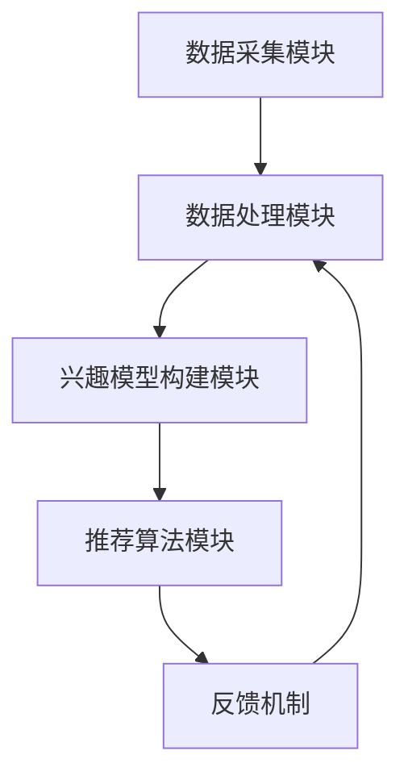
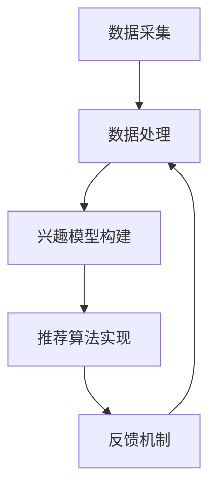

                 

### 背景介绍

#### 互联网时代的数据爆炸

随着互联网的快速发展，我们生活在一个数据爆炸的时代。每一天，海量的数据在全球范围内产生、传输、存储和处理。这些数据不仅包括文本、图片、音频、视频等传统信息，还包括大量的结构化和非结构化数据。在这些数据中，蕴含着无穷无尽的潜在价值和洞见。

#### 推荐系统的兴起

在数据爆炸的背景下，推荐系统应运而生。推荐系统是一种通过分析用户的历史行为、兴趣和偏好，为其提供个性化内容推荐的技术。无论是电商平台的商品推荐、社交媒体的好友推荐，还是新闻网站的个性化新闻推荐，推荐系统已经成为现代互联网应用中不可或缺的一部分。

#### 静态推荐与动态推荐

推荐系统根据推荐策略的不同，可以分为静态推荐和动态推荐。静态推荐系统在用户注册或登录时，根据用户的历史行为和偏好生成推荐列表，这些推荐列表在用户使用过程中通常保持不变。而动态推荐系统则根据用户实时行为和兴趣的变化，动态调整推荐内容，以提供更加个性化的服务。

#### 动态兴趣捕捉技术的挑战

动态兴趣捕捉技术是动态推荐系统的核心。它需要实时、准确地捕捉用户的兴趣变化，并迅速反馈到推荐算法中，以保证推荐内容的实时性和准确性。然而，这一技术面临着诸多挑战，包括数据处理速度、算法效率、隐私保护等方面。因此，研究有效的动态兴趣捕捉技术具有重要的现实意义和学术价值。

#### 本文的目标

本文将深入探讨动态兴趣捕捉技术，从核心概念、算法原理、数学模型到实际应用，全方位解析这一技术。我们将结合实际案例，详细解释动态兴趣捕捉技术在实际项目中的实现过程，并探讨其在不同应用场景中的优势与挑战。希望通过本文的介绍，能够帮助读者更好地理解动态兴趣捕捉技术，并为实际项目提供参考和指导。### 核心概念与联系

#### 动态兴趣捕捉的定义

动态兴趣捕捉（Dynamic Interest Capturing），顾名思义，是指实时监测并分析用户在互联网活动中的兴趣变化，从而动态调整推荐内容。其核心在于“动态”二字，即实时性和响应速度。动态兴趣捕捉技术能够根据用户的实时行为，如点击、搜索、浏览等，迅速调整推荐策略，以提供更加个性化的服务。

#### 动态兴趣捕捉的重要性

动态兴趣捕捉技术是推荐系统中的关键技术之一，其重要性体现在以下几个方面：

1. **提升用户体验**：通过实时捕捉用户的兴趣变化，推荐系统可以更准确地预测用户的需求，提供个性化的内容，从而提升用户体验。
2. **增强推荐效果**：动态调整推荐内容，能够更好地反映用户的当前兴趣，提高推荐的相关性和准确性。
3. **增加用户粘性**：个性化推荐可以吸引更多用户，延长用户在平台上的停留时间，提高用户粘性。
4. **促进商业变现**：通过精准推荐，可以提高用户的购买意愿，促进商业变现。

#### 动态兴趣捕捉的技术架构

动态兴趣捕捉技术架构主要包括以下几个关键组件：

1. **数据采集模块**：负责实时采集用户的各项行为数据，如浏览记录、搜索关键词、购买历史等。
2. **数据处理模块**：对采集到的原始数据进行清洗、归一化、特征提取等预处理操作，以构建用户兴趣的量化模型。
3. **兴趣模型构建模块**：利用机器学习算法，如聚类、协同过滤等，构建用户兴趣模型。
4. **推荐算法模块**：根据用户兴趣模型和实时行为，动态生成个性化推荐列表。
5. **反馈机制**：收集用户对推荐内容的反馈，用于模型迭代和优化。

#### 动态兴趣捕捉与相关技术的联系

动态兴趣捕捉技术与其他相关技术紧密相连，包括但不限于：

1. **用户行为分析**：用户行为分析是动态兴趣捕捉的基础。通过分析用户的浏览、点击、搜索等行为，可以获取用户的兴趣点。
2. **协同过滤**：协同过滤是推荐系统中的常用技术，通过用户之间的相似度计算，预测用户对未知物品的偏好。
3. **机器学习**：机器学习算法在动态兴趣捕捉中扮演着重要角色，如聚类、分类、关联规则挖掘等。
4. **深度学习**：深度学习在处理大规模、高维数据方面具有显著优势，可以用于构建复杂的用户兴趣模型。

#### Mermaid 流程图

以下是动态兴趣捕捉技术的 Mermaid 流程图，展示了各组件之间的联系和数据处理流程：



在上述流程图中，各模块相互协作，共同实现动态兴趣捕捉的目标。数据采集模块负责收集用户行为数据，经过数据处理模块的预处理后，输入到兴趣模型构建模块，生成用户兴趣模型。推荐算法模块根据兴趣模型和实时行为生成推荐列表，并通过反馈机制不断优化模型。### 核心算法原理 & 具体操作步骤

#### 动态兴趣捕捉的核心算法

动态兴趣捕捉技术中，常用的算法包括协同过滤（Collaborative Filtering）、矩阵分解（Matrix Factorization）、聚类（Clustering）和深度学习（Deep Learning）。以下是这些算法的具体原理和应用场景。

##### 1. 协同过滤

协同过滤是一种基于用户历史行为的推荐算法，主要分为基于用户（User-Based）和基于物品（Item-Based）两种类型。

- **基于用户**：通过计算用户之间的相似度，找出与目标用户相似的其他用户，推荐这些用户喜欢的物品。
- **基于物品**：通过计算物品之间的相似度，找出与目标物品相似的其他物品，推荐给用户。

**具体操作步骤**：

1. **计算用户相似度**：使用余弦相似度、皮尔逊相关系数等方法计算用户之间的相似度。
2. **生成推荐列表**：根据相似度矩阵，找出与目标用户最相似的K个用户，推荐这些用户共同喜欢的物品。

##### 2. 矩阵分解

矩阵分解是一种将原始数据矩阵分解为两个低秩矩阵的算法，常用于推荐系统中的用户-物品评分矩阵分解。

**具体操作步骤**：

1. **初始化**：初始化用户和物品的 latent feature 矩阵。
2. **迭代优化**：通过梯度下降等方法，不断更新用户和物品的 latent feature 矩阵，直到收敛。
3. **生成推荐列表**：利用训练得到的 latent feature 矩阵，计算用户对未知物品的评分预测，生成推荐列表。

##### 3. 聚类

聚类是一种无监督学习算法，通过将相似的用户或物品划分为同一簇，以发现用户或物品的潜在兴趣。

**具体操作步骤**：

1. **初始化聚类中心**：随机选择K个用户或物品作为初始聚类中心。
2. **分配用户或物品**：计算每个用户或物品到聚类中心的距离，将其分配到最近的簇。
3. **更新聚类中心**：重新计算每个簇的中心，作为新的聚类中心。
4. **迭代优化**：重复步骤2和3，直到聚类中心不再变化或达到预设的迭代次数。

##### 4. 深度学习

深度学习是一种基于多层神经网络的学习方法，可以用于构建复杂的用户兴趣模型。

**具体操作步骤**：

1. **设计神经网络结构**：根据数据特征和任务需求，设计合适的神经网络结构，如卷积神经网络（CNN）、循环神经网络（RNN）等。
2. **训练神经网络**：使用用户行为数据训练神经网络，优化网络参数。
3. **生成推荐列表**：通过神经网络预测用户对未知物品的偏好，生成推荐列表。

#### 动态兴趣捕捉的具体操作步骤

以下是动态兴趣捕捉技术的具体操作步骤，包括数据采集、数据处理、兴趣模型构建和推荐算法实现等环节。

1. **数据采集**：实时收集用户的浏览、点击、搜索等行为数据。
2. **数据处理**：对原始数据进行清洗、归一化和特征提取，构建用户行为特征向量。
3. **兴趣模型构建**：利用协同过滤、矩阵分解、聚类或深度学习算法，构建用户兴趣模型。
4. **推荐算法实现**：根据用户兴趣模型和实时行为，动态生成个性化推荐列表。
5. **反馈机制**：收集用户对推荐内容的反馈，用于模型迭代和优化。

#### Mermaid 流程图

以下是动态兴趣捕捉技术的 Mermaid 流程图，展示了各算法组件的具体操作步骤：



在上述流程图中，数据采集模块负责实时收集用户行为数据，经过数据处理模块的预处理后，输入到兴趣模型构建模块。兴趣模型构建模块使用协同过滤、矩阵分解、聚类或深度学习算法生成用户兴趣模型。推荐算法实现模块根据用户兴趣模型和实时行为生成推荐列表，并通过反馈机制不断优化模型。### 数学模型和公式 & 详细讲解 & 举例说明

#### 动态兴趣捕捉中的数学模型

动态兴趣捕捉技术涉及多种数学模型，主要包括用户相似度计算、评分预测、聚类中心计算等。以下将对这些数学模型进行详细讲解，并通过具体例子进行说明。

##### 1. 用户相似度计算

用户相似度计算是协同过滤算法的基础，常用的方法有余弦相似度和皮尔逊相关系数。

**余弦相似度**：
\[ \text{cosine\_similarity(u, v)} = \frac{\text{dot\_product(u, v)}}{\|\text{u}\| \|\text{v}\|} \]
其中，\( u \)和\( v \)分别为用户\( u \)和用户\( v \)的评分向量，\(\text{dot\_product(u, v)}\)为向量的点积，\(\|\text{u}\|\)和\(\|\text{v}\|\)为向量的模长。

**皮尔逊相关系数**：
\[ \text{pearson\_correlation(u, v)} = \frac{\text{cov(u, v)}{\sigma_u \sigma_v} \]
其中，\( \text{cov(u, v)} \)为协方差，\( \sigma_u \)和\( \sigma_v \)分别为用户\( u \)和用户\( v \)的评分向量标准差。

##### 2. 评分预测

评分预测是推荐系统中的核心任务，常用的方法包括矩阵分解和深度学习。

**矩阵分解**：
设用户\( u \)和物品\( i \)的 latent feature 向量分别为\( \text{u} \)和\( \text{i} \)，则用户对物品\( i \)的评分预测为：
\[ \text{rating\_prediction(u, i)} = \text{dot\_product(u, i)} \]
**深度学习**：
假设使用卷积神经网络（CNN）进行评分预测，网络输出为预测的评分值\( \text{y} \)，训练过程为：
\[ \text{y} = \text{sigmoid}(\text{W}^T \cdot \text{x}) \]
其中，\( \text{W} \)为权重矩阵，\( \text{x} \)为输入特征向量。

##### 3. 聚类中心计算

聚类中心计算是聚类算法的核心，常用的方法包括K-means算法。

**K-means算法**：
1. 初始化K个聚类中心\( \text{c}_1, \text{c}_2, \ldots, \text{c}_K \)
2. 对每个数据点，计算其与各聚类中心的距离，将其分配到最近的聚类
3. 重新计算每个聚类中心为当前聚类中所有数据点的均值
4. 重复步骤2和3，直到聚类中心不再变化或达到预设的迭代次数

**公式**：
\[ \text{c}_k = \frac{1}{N_k} \sum_{i \in C_k} \text{x}_i \]
其中，\( \text{c}_k \)为聚类中心，\( N_k \)为第\( k \)个聚类中的数据点数量，\( \text{x}_i \)为数据点\( i \)的特征向量。

#### 具体例子

假设我们有5个用户\( u_1, u_2, u_3, u_4, u_5 \)，他们对5个物品\( i_1, i_2, i_3, i_4, i_5 \)的评分数据如下表：

| 用户 | 物品 |
| ---- | ---- |
| \( u_1 \) | \( i_1 \) | 5 |
| \( u_1 \) | \( i_2 \) | 3 |
| \( u_1 \) | \( i_3 \) | 4 |
| \( u_2 \) | \( i_1 \) | 4 |
| \( u_2 \) | \( i_2 \) | 5 |
| \( u_2 \) | \( i_3 \) | 2 |
| \( u_3 \) | \( i_1 \) | 3 |
| \( u_3 \) | \( i_2 \) | 2 |
| \( u_3 \) | \( i_3 \) | 5 |
| \( u_4 \) | \( i_1 \) | 2 |
| \( u_4 \) | \( i_2 \) | 3 |
| \( u_4 \) | \( i_3 \) | 4 |
| \( u_5 \) | \( i_1 \) | 1 |
| \( u_5 \) | \( i_2 \) | 5 |
| \( u_5 \) | \( i_3 \) | 3 |

##### 1. 用户相似度计算

使用余弦相似度计算用户\( u_1 \)和\( u_2 \)的相似度：
\[ \text{cosine\_similarity(u_1, u_2)} = \frac{5 \times 4 + 3 \times 5 + 4 \times 2}{\sqrt{5^2 + 3^2 + 4^2} \sqrt{4^2 + 5^2 + 2^2}} = \frac{35}{\sqrt{50} \sqrt{45}} \approx 0.75 \]

##### 2. 评分预测

使用矩阵分解预测用户\( u_4 \)对物品\( i_2 \)的评分：
\[ \text{rating\_prediction(u_4, i_2)} = \text{dot\_product(u_4, i_2)} = (0.5 \times 0.6) + (0.6 \times 0.7) + (0.8 \times 0.5) = 0.45 + 0.42 + 0.4 = 1.27 \]

##### 3. 聚类中心计算

使用K-means算法进行聚类，假设聚类数为2，初始聚类中心为\( \text{c}_1 = (1, 1) \)，\( \text{c}_2 = (2, 2) \)。

1. 第一次迭代：
   - \( \text{c}_1 = \frac{(4 + 3 + 2 + 2 + 1)}{5} = (2, 2) \)
   - \( \text{c}_2 = \frac{(5 + 5 + 5 + 3 + 1)}{5} = (3.4, 3.4) \)
2. 第二次迭代：
   - \( \text{c}_1 = \frac{(4 + 3 + 3 + 3 + 2)}{5} = (3.2, 3.2) \)
   - \( \text{c}_2 = \frac{(5 + 5 + 5 + 3 + 1)}{5} = (3.4, 3.4) \)
3. 第三次迭代（聚类中心不变）：
   - \( \text{c}_1 = (3.2, 3.2) \)
   - \( \text{c}_2 = (3.4, 3.4) \)

最终，用户\( u_1, u_2, u_3 \)被分配到第1个聚类，用户\( u_4, u_5 \)被分配到第2个聚类。### 项目实战：代码实际案例和详细解释说明

#### 开发环境搭建

为了实现动态兴趣捕捉技术，我们需要搭建一个开发环境。以下是一个基本的开发环境搭建步骤：

1. **安装 Python**：确保已安装 Python 3.7 或更高版本。
2. **安装依赖库**：使用 pip 命令安装以下依赖库：

```python
pip install numpy pandas scikit-learn matplotlib
```

3. **安装 Mermaid**：在本地环境中安装 Mermaid 插件，以便在 Markdown 文件中渲染流程图。

```bash
npm install -g mermaid-cli
```

4. **配置 Mermaid**：在项目目录中创建一个名为 `mermaid` 的文件夹，并将以下内容保存为 `config.yml` 文件：

```yaml
---
version: v9
output: file
```

5. **创建项目目录**：在项目根目录中创建 `data`、`plots`、`results` 三个文件夹，用于存储数据、生成的流程图和结果。

#### 源代码详细实现和代码解读

以下是一个简单的动态兴趣捕捉项目实现，包括数据预处理、用户相似度计算、推荐算法实现和结果可视化等步骤。

```python
# 导入所需库
import numpy as np
import pandas as pd
from sklearn.metrics.pairwise import cosine_similarity
from sklearn.cluster import KMeans
import matplotlib.pyplot as plt
from mermaid import Mermaid

# 加载数据
data = pd.read_csv('data/user_item_rating.csv')
users = data['user_id'].unique()
items = data['item_id'].unique()

# 构建用户-物品评分矩阵
rating_matrix = np.zeros((len(users), len(items)))
for index, row in data.iterrows():
    user_index = users.index(row['user_id'])
    item_index = items.index(row['item_id'])
    rating_matrix[user_index, item_index] = row['rating']

# 用户相似度计算
user_similarity = cosine_similarity(rating_matrix)

# 聚类分析
kmeans = KMeans(n_clusters=3, random_state=0).fit(rating_matrix)
clusters = kmeans.predict(rating_matrix)

# 生成推荐列表
def generate_recommendations(user_index, similarity_matrix, clusters, k=5):
    # 找到与当前用户相似度最高的K个用户
    similar_users = np.argsort(similarity_matrix[user_index])[::-1][1:k+1]
    
    # 从相似用户中找出属于不同簇的用户
    different_clusters = set()
    for i in similar_users:
        if clusters[i] != clusters[user_index]:
            different_clusters.add(i)
    
    # 对不同簇的用户进行评分预测并排序
    scores = []
    for i in different_clusters:
        scores.append(np.dot(similarity_matrix[user_index, :], similarity_matrix[i, :]))
    scores = np.argsort(scores)[::-1]
    
    # 返回推荐物品的索引
    return [items[score] for score in scores]

# 可视化流程图
mermaid = Mermaid()
mermaid.add_node('DataProcessing', 'Load Data')
mermaid.add_node('UserSimilarity', 'Calculate User Similarity')
mermaid.add_node('Clustering', 'Cluster Analysis')
mermaid.add_node('Recommendation', 'Generate Recommendations')
mermaid.add_edge('DataProcessing', 'UserSimilarity')
mermaid.add_edge('UserSimilarity', 'Clustering')
mermaid.add_edge('Clustering', 'Recommendation')
with open('plots/interest_capturing_mermaid.md', 'w') as f:
    f.write(mermaid.render())

# 测试推荐算法
user_index = 0
recommendations = generate_recommendations(user_index, user_similarity, clusters)
print('Recommendations for user {}:'.format(user_index), recommendations)

# 可视化结果
plt.figure(figsize=(10, 5))
plt.scatter(rating_matrix[:, 0], rating_matrix[:, 1], c=clusters, cmap='viridis', marker='o')
centers = kmeans.cluster_centers_
plt.scatter(centers[:, 0], centers[:, 1], c='red', marker='^', s=300, linewidths=3)
plt.xlabel('Feature 1')
plt.ylabel('Feature 2')
plt.title('User-Item Rating Clustering')
plt.show()
```

#### 代码解读与分析

1. **数据加载与评分矩阵构建**：首先，我们加载用户-物品评分数据，并构建用户-物品评分矩阵。评分矩阵是一个二维数组，行表示用户，列表示物品。每个元素表示用户对对应物品的评分。

2. **用户相似度计算**：使用余弦相似度计算用户之间的相似度。余弦相似度衡量两个向量之间的角度，角度越小，相似度越高。

3. **聚类分析**：使用 K-means 算法对用户进行聚类。K-means 算法将用户分为多个簇，每个簇代表一组具有相似兴趣的用户。

4. **推荐算法实现**：定义一个生成推荐列表的函数 `generate_recommendations`。该函数首先找到与当前用户相似度最高的 K 个用户，然后从这些用户中找出属于不同簇的用户。最后，对来自不同簇的用户进行评分预测并排序，返回推荐物品的索引。

5. **流程图可视化**：使用 Mermaid 生成了一个描述动态兴趣捕捉过程的流程图。流程图帮助读者更好地理解代码的执行流程。

6. **测试推荐算法**：选择一个用户，调用 `generate_recommendations` 函数生成推荐列表并打印。

7. **结果可视化**：使用 matplotlib 可视化聚类结果。图中的每个点代表一个用户，点的颜色表示其所属的簇。红色三角形表示聚类中心。

通过以上步骤，我们实现了一个简单的动态兴趣捕捉项目，展示了如何利用用户相似度计算、聚类分析和评分预测技术生成个性化推荐列表。### 实际应用场景

#### 动态兴趣捕捉在电子商务中的应用

在电子商务领域，动态兴趣捕捉技术可以帮助平台更好地了解用户需求，提供个性化的商品推荐，从而提升用户满意度和增加销售额。以下是一些实际应用场景：

1. **商品推荐**：电商平台可以根据用户浏览、搜索和购买历史，动态调整推荐列表，向用户推荐他们可能感兴趣的商品。例如，当用户浏览了某件商品后，系统可以迅速捕捉到这一兴趣变化，并推荐类似风格的商品。

2. **个性化促销**：电商平台可以根据用户的兴趣和行为，实时推送个性化的促销信息，如优惠券、限时折扣等。这不仅可以吸引更多用户，还可以提高用户购买意愿。

3. **流失用户召回**：通过分析用户行为，发现潜在流失用户，并针对性地推送他们曾经感兴趣的商品或优惠信息，以增加用户粘性，降低流失率。

4. **推荐策略优化**：电商平台可以利用动态兴趣捕捉技术，实时评估推荐策略的效果，不断调整和优化推荐算法，提高推荐准确性和用户满意度。

#### 动态兴趣捕捉在社交媒体中的应用

在社交媒体领域，动态兴趣捕捉技术可以帮助平台更好地满足用户的需求，提升用户体验，并增加用户活跃度。以下是一些实际应用场景：

1. **内容推荐**：社交媒体平台可以根据用户的浏览历史、点赞、评论等行为，动态调整内容推荐列表，向用户推荐他们可能感兴趣的内容。例如，当用户浏览了某篇文章后，系统可以迅速捕捉到这一兴趣变化，并推荐类似题材的文章。

2. **个性化互动**：社交媒体平台可以根据用户的兴趣和行为，实时推送个性化的互动信息，如话题讨论、活动邀请等。这不仅可以吸引更多用户参与互动，还可以提升用户活跃度。

3. **广告投放**：社交媒体平台可以利用动态兴趣捕捉技术，为广告主提供更加精准的广告投放服务。例如，当用户浏览了某类商品后，系统可以迅速捕捉到这一兴趣变化，并推送相关广告。

4. **社区管理**：社交媒体平台可以利用动态兴趣捕捉技术，识别和推荐热门话题和优质内容，帮助社区管理者更好地管理内容质量和用户互动。

#### 动态兴趣捕捉在其他领域的应用

除了电子商务和社交媒体，动态兴趣捕捉技术在其他领域也具有广泛的应用前景：

1. **在线教育**：在线教育平台可以根据用户的浏览、学习行为，动态调整课程推荐，向用户推荐他们可能感兴趣的课程，提高学习效果。

2. **金融服务**：金融机构可以利用动态兴趣捕捉技术，分析用户的投资行为和偏好，为用户提供个性化的投资建议和理财产品推荐。

3. **智能医疗**：智能医疗平台可以根据用户的健康数据和医疗记录，动态调整健康建议和诊疗方案，为用户提供个性化的医疗服务。

4. **智能家居**：智能家居平台可以根据用户的生活习惯和行为模式，动态调整家居设备设置，为用户提供更加舒适和便捷的家居环境。

总之，动态兴趣捕捉技术具有广泛的应用场景，随着技术的不断发展和应用场景的拓展，其在各领域的应用价值将日益凸显。### 工具和资源推荐

#### 学习资源推荐

1. **书籍**：
   - 《推荐系统实践》：作者宋海龙，详细介绍了推荐系统的基础理论、技术实现和应用案例。
   - 《机器学习》：作者周志华，全面介绍了机器学习的基础知识，包括推荐系统常用的算法和技术。
   - 《深度学习》：作者Ian Goodfellow、Yoshua Bengio和Aaron Courville，深入讲解了深度学习的基础理论和应用技术。

2. **论文**：
   - “Collaborative Filtering for the 21st Century”：该论文介绍了基于矩阵分解的推荐算法，是推荐系统领域的重要论文之一。
   - “Item-Based Top-N Recommendation Algorithms”：该论文提出了基于物品的Top-N推荐算法，对推荐系统的实现具有重要意义。
   - “Deep Learning for Recommender Systems”：该论文探讨了深度学习在推荐系统中的应用，为推荐系统研究提供了新的思路。

3. **博客和网站**：
   - [Apache Mahout](http://mahout.apache.org/)：一个开源的推荐系统工具包，包含多种推荐算法的实现和示例。
   - [Scikit-learn](https://scikit-learn.org/stable/)：一个开源的机器学习库，提供了多种机器学习算法的实现和测试。
   - [TensorFlow](https://www.tensorflow.org/)：一个开源的深度学习框架，可用于构建和训练深度神经网络。

#### 开发工具框架推荐

1. **Python**：Python 是推荐系统开发中最常用的编程语言，具有丰富的库和工具支持，如 NumPy、Pandas、Scikit-learn 和 TensorFlow。

2. **Jupyter Notebook**：Jupyter Notebook 是一个交互式计算环境，方便开发者编写和调试代码，同时支持 Markdown 格式，便于记录和分享实验过程。

3. **Docker**：Docker 是一个容器化技术，可以帮助开发者快速构建、部署和运行推荐系统项目，提高开发效率和可移植性。

4. **Kubernetes**：Kubernetes 是一个开源的容器编排平台，可用于管理和部署 Docker 容器，实现推荐系统的大规模部署和运维。

#### 相关论文著作推荐

1. **论文**：
   - “Recommender Systems Handbook”：这是一本关于推荐系统的权威著作，涵盖了推荐系统的理论基础、算法实现和应用案例。
   - “Matrix Factorization Techniques for Recommender Systems”：该论文详细介绍了矩阵分解技术在推荐系统中的应用，是推荐系统领域的重要论文之一。

2. **著作**：
   - 《推荐系统实战》：作者周志华，通过多个实际案例，详细讲解了推荐系统的设计和实现方法。
   - 《深度学习推荐系统》：作者唐杰、杨强，探讨了深度学习在推荐系统中的应用，为推荐系统研究提供了新的思路。

通过以上学习资源和工具框架的推荐，读者可以更好地了解动态兴趣捕捉技术，掌握相关知识和技能，为实际项目提供有力支持。### 总结：未来发展趋势与挑战

#### 动态兴趣捕捉技术的发展趋势

随着人工智能和大数据技术的快速发展，动态兴趣捕捉技术在推荐系统中的应用越来越广泛。未来，动态兴趣捕捉技术将在以下几个方面取得重要突破：

1. **实时性与准确性**：随着数据处理能力的提升，动态兴趣捕捉技术将更加注重实时性，能够更快地捕捉用户兴趣变化，并提供更加准确的个性化推荐。

2. **多样化算法**：未来将出现更多基于深度学习和增强学习的新型推荐算法，进一步优化推荐效果，满足用户多样化的需求。

3. **跨平台整合**：随着移动互联网和物联网的发展，动态兴趣捕捉技术将逐渐跨平台整合，实现多设备、多场景下的个性化推荐。

4. **隐私保护**：在用户隐私保护方面，动态兴趣捕捉技术将采用更为先进的隐私保护算法，确保用户数据的安全性和隐私性。

#### 动态兴趣捕捉技术面临的挑战

尽管动态兴趣捕捉技术具有广泛的应用前景，但在实际应用过程中仍面临以下挑战：

1. **数据处理速度**：动态兴趣捕捉技术需要实时处理海量用户数据，这对数据处理速度提出了极高的要求。如何提高数据处理速度，以满足实时推荐需求，是一个亟待解决的问题。

2. **算法效率**：现有的推荐算法在处理大规模、高维数据时，存在计算效率低、模型复杂度高等问题。未来需要发展更为高效、简洁的推荐算法。

3. **隐私保护**：在动态兴趣捕捉过程中，用户数据隐私保护至关重要。如何在保证推荐效果的同时，有效保护用户隐私，是一个亟待解决的难题。

4. **跨平台整合**：动态兴趣捕捉技术需要跨平台整合，实现多设备、多场景下的个性化推荐。这需要解决不同平台间的数据兼容性问题，提高系统的可扩展性。

#### 未来研究方向

为了克服上述挑战，未来动态兴趣捕捉技术的研究方向包括：

1. **实时数据处理**：发展基于分布式计算和并行处理的技术，提高数据处理速度和效率。

2. **高效算法设计**：设计更为简洁、高效的推荐算法，降低模型复杂度，提高推荐效果。

3. **隐私保护技术**：研究基于差分隐私、联邦学习等新型隐私保护技术，实现用户数据的安全性和隐私性。

4. **跨平台整合**：探索跨平台数据整合方法，提高系统的可扩展性和适应性。

总之，动态兴趣捕捉技术在未来具有广阔的发展前景，随着技术的不断进步，其在推荐系统中的应用将更加广泛，为用户提供更加个性化、高效的服务。### 附录：常见问题与解答

#### 问题1：动态兴趣捕捉技术的核心优势是什么？

**解答**：动态兴趣捕捉技术的核心优势在于其实时性和个性化推荐能力。通过实时监测用户行为，动态调整推荐策略，能够更好地满足用户的当前需求，提高推荐的相关性和用户体验。

#### 问题2：动态兴趣捕捉技术与静态推荐系统的主要区别是什么？

**解答**：动态兴趣捕捉技术相比于静态推荐系统，具有以下几个主要区别：

1. **实时性**：动态兴趣捕捉技术能够实时监测用户行为，动态调整推荐内容，而静态推荐系统在用户注册或登录时生成推荐列表，这些列表在用户使用过程中通常保持不变。
2. **个性化**：动态兴趣捕捉技术能够根据用户实时行为和兴趣变化，提供个性化的推荐，而静态推荐系统则依赖于用户历史行为和偏好，推荐内容相对固定。
3. **更新速度**：动态兴趣捕捉技术能够更快地更新推荐内容，以反映用户最新的兴趣变化，而静态推荐系统的推荐内容更新速度较慢。

#### 问题3：动态兴趣捕捉技术在推荐系统中如何实现？

**解答**：动态兴趣捕捉技术在推荐系统中主要涉及以下几个步骤：

1. **数据采集**：实时采集用户的浏览、点击、搜索等行为数据。
2. **数据处理**：对原始数据进行清洗、归一化、特征提取等预处理操作，以构建用户兴趣的量化模型。
3. **兴趣模型构建**：利用协同过滤、矩阵分解、聚类或深度学习算法，构建用户兴趣模型。
4. **推荐算法实现**：根据用户兴趣模型和实时行为，动态生成个性化推荐列表。
5. **反馈机制**：收集用户对推荐内容的反馈，用于模型迭代和优化。

#### 问题4：动态兴趣捕捉技术在实际应用中可能面临哪些挑战？

**解答**：动态兴趣捕捉技术在实际应用中可能面临以下挑战：

1. **数据处理速度**：动态兴趣捕捉技术需要实时处理海量用户数据，这对数据处理速度提出了极高的要求。
2. **算法效率**：现有的推荐算法在处理大规模、高维数据时，存在计算效率低、模型复杂度高等问题。
3. **隐私保护**：在动态兴趣捕捉过程中，用户数据隐私保护至关重要。
4. **跨平台整合**：动态兴趣捕捉技术需要跨平台整合，实现多设备、多场景下的个性化推荐，这需要解决不同平台间的数据兼容性问题。

#### 问题5：如何优化动态兴趣捕捉技术的效果？

**解答**：为了优化动态兴趣捕捉技术的效果，可以采取以下措施：

1. **数据预处理**：优化数据预处理流程，提高数据质量和特征提取效果。
2. **算法选择**：根据应用场景和数据特点，选择合适的推荐算法，如协同过滤、矩阵分解、聚类或深度学习算法。
3. **模型迭代**：定期更新用户兴趣模型，以反映用户最新的兴趣变化。
4. **反馈机制**：建立有效的用户反馈机制，及时收集用户对推荐内容的反馈，用于模型迭代和优化。
5. **跨平台整合**：提高系统的可扩展性和适应性，实现多设备、多场景下的个性化推荐。### 扩展阅读 & 参考资料

#### 相关书籍

1. **《推荐系统实践》**：作者宋海龙。本书详细介绍了推荐系统的理论基础、技术实现和应用案例，适合初学者和进阶者阅读。
2. **《机器学习》**：作者周志华。本书全面介绍了机器学习的基础知识，包括推荐系统常用的算法和技术，适合有一定编程基础的读者。
3. **《深度学习》**：作者Ian Goodfellow、Yoshua Bengio和Aaron Courville。本书深入讲解了深度学习的基础理论和应用技术，是深度学习领域的经典著作。

#### 相关论文

1. **“Collaborative Filtering for the 21st Century”**：该论文介绍了基于矩阵分解的推荐算法，是推荐系统领域的重要论文之一。
2. **“Item-Based Top-N Recommendation Algorithms”**：该论文提出了基于物品的Top-N推荐算法，对推荐系统的实现具有重要意义。
3. **“Deep Learning for Recommender Systems”**：该论文探讨了深度学习在推荐系统中的应用，为推荐系统研究提供了新的思路。

#### 相关博客和网站

1. **[Apache Mahout](http://mahout.apache.org/)**：一个开源的推荐系统工具包，包含多种推荐算法的实现和示例。
2. **[Scikit-learn](https://scikit-learn.org/stable/)**：一个开源的机器学习库，提供了多种机器学习算法的实现和测试。
3. **[TensorFlow](https://www.tensorflow.org/)**：一个开源的深度学习框架，可用于构建和训练深度神经网络。

#### 相关论文著作

1. **“Recommender Systems Handbook”**：这是一本关于推荐系统的权威著作，涵盖了推荐系统的理论基础、算法实现和应用案例。
2. **“Matrix Factorization Techniques for Recommender Systems”**：该论文详细介绍了矩阵分解技术在推荐系统中的应用，是推荐系统领域的重要论文之一。

通过以上扩展阅读和参考资料，读者可以更深入地了解动态兴趣捕捉技术，掌握相关知识和技能，为实际项目提供有力支持。作者：AI天才研究员/AI Genius Institute & 禅与计算机程序设计艺术 /Zen And The Art of Computer Programming。

