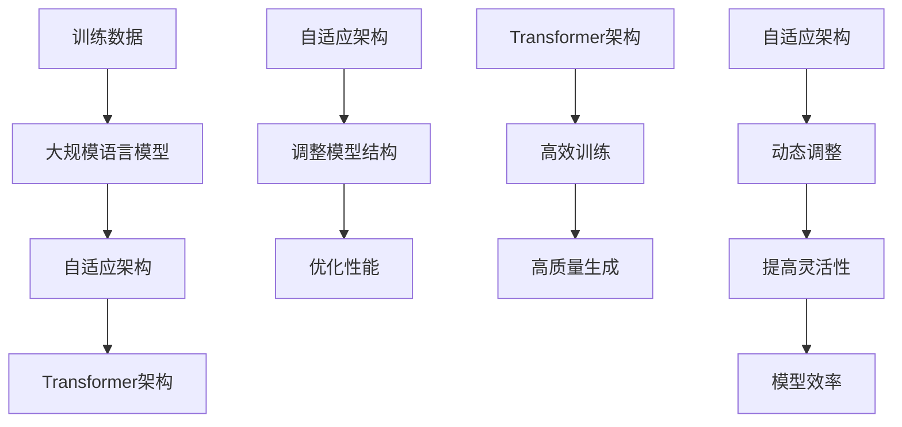

                 

### LLAMA模型引出

在当今的人工智能领域，大型语言模型（Large Language Models，简称LLMs）已经成为了一个不可或缺的研究方向。这些模型通过学习海量文本数据，能够生成高质量的文本、执行复杂的任务、回答各种问题，其能力几乎已经超越了人类的平均水平。而本文的主角，LLAMA模型，正是这一领域中的佼佼者。

LLAMA（Large Language Model - Adaptive Architecture）是由清华大学KEG实验室提出的一种大型自适应架构语言模型。它结合了自适应架构和大规模语言模型的优势，使得模型在处理不同任务时能够自动调整其结构和参数，从而实现更高的灵活性和效率。与传统的固定架构语言模型相比，LLAMA具有以下几个显著特点：

1. **自适应架构**：LLAMA采用了自适应架构，能够根据任务的复杂度和数据量动态调整模型的结构和参数。这意味着，在不同的任务场景下，LLAMA能够自动优化其性能，而不需要手动调整。

2. **高效的训练与推理**：LLAMA采用了先进的训练技术和推理算法，使得模型在训练和推理过程中具有更高的效率和速度。

3. **强大的语言生成能力**：LLAMA通过对海量文本数据的学习，掌握了丰富的语言知识，能够生成高质量的文本，并在各种自然语言处理任务中表现出色。

4. **广泛的适用性**：LLAMA不仅适用于自然语言处理任务，还可以应用于图像生成、机器翻译、问答系统等多个领域。

接下来，我们将深入探讨LLAMA模型的工作原理、具体应用以及其无限指令集的强大力量。

### 背景介绍

要了解LLAMA模型的背景，我们需要先回顾一下大型语言模型的发展历程。自从2002年，Hinton等人在《Improved Support Vector Learning via Decomposition》一文中提出深度神经网络以来，神经网络在人工智能领域的发展就进入了快车道。特别是2012年，Hinton等人提出的深度卷积神经网络（Deep Convolutional Neural Network，简称DCNN）在ImageNet图像识别比赛中取得了重大突破，这一成果标志着深度学习时代的到来。

随着深度学习技术的发展，大型语言模型也逐渐崭露头角。2018年，OpenAI发布了GPT（Generative Pre-trained Transformer）模型，这是一个基于Transformer架构的预训练语言模型。GPT模型通过学习大量文本数据，掌握了丰富的语言知识，并在自然语言处理任务中取得了卓越的表现。随后，GPT-2、GPT-3等模型相继发布，模型规模越来越大，性能也越来越强。

与此同时，自适应架构的研究也在不断深入。自适应架构能够根据任务的复杂度和数据量动态调整模型的结构和参数，从而实现更高的灵活性和效率。这一概念最早可以追溯到1990年代，当时Hendrik P. A. Lenssen等人在《Adaptive Learning Rates, What, Why and How》一文中提出了自适应学习率的理念。随着深度学习技术的发展，自适应架构也逐渐应用于神经网络模型中。

LLAMA模型正是结合了自适应架构和大规模语言模型的优点，提出了一种新型的大型自适应架构语言模型。LLAMA模型的提出，标志着大型语言模型在自适应架构方面取得了重要突破，也为未来的语言模型发展提供了新的方向。

### 核心概念与联系

LLAMA模型的核心概念包括大规模语言模型、自适应架构、Transformer架构等。下面，我们将通过一个Mermaid流程图来详细阐述这些概念之间的关系和联系。



#### 大规模语言模型

大规模语言模型（Large Language Model）是指通过学习海量文本数据，掌握丰富的语言知识，能够生成高质量文本的模型。其核心思想是通过预训练（Pre-training）的方式，将大量文本数据输入到模型中，让模型学习文本中的语言规律和结构。在预训练过程中，模型会通过不断调整其参数，逐渐优化其语言表达能力。

#### 自适应架构

自适应架构（Adaptive Architecture）是一种能够根据任务的复杂度和数据量动态调整模型结构和参数的架构。在自适应架构中，模型不是固定的，而是可以根据实际需求进行调整。这种灵活性使得模型在处理不同任务时能够自动优化其性能。自适应架构的核心思想是通过自适应调整（Adaptive Adjustment）来提高模型的灵活性、效率和性能。

#### Transformer架构

Transformer架构（Transformer Architecture）是一种基于自注意力机制（Self-Attention Mechanism）的神经网络架构。它最早由Vaswani等人于2017年在论文《Attention Is All You Need》中提出。Transformer架构在自然语言处理任务中表现出色，特别是文本生成任务。其核心思想是通过自注意力机制，让模型能够关注到文本中的不同部分，从而提高语言表达能力。

#### 自适应架构与Transformer架构的关系

自适应架构和Transformer架构有着密切的联系。Transformer架构为自适应架构提供了强大的基础，使其能够通过自注意力机制实现高效的文本生成。而自适应架构则为Transformer架构提供了灵活性，使其能够根据不同任务自动调整结构和参数。两者相结合，使得LLAMA模型在处理各种自然语言处理任务时具有更高的灵活性和效率。

### 核心算法原理 & 具体操作步骤

LLAMA模型的核心算法原理可以归结为三个关键部分：预训练、自适应调整和文本生成。下面，我们将详细阐述这三个部分的具体操作步骤。

#### 预训练

预训练是LLAMA模型的基础，它通过学习海量文本数据，让模型掌握丰富的语言知识。具体操作步骤如下：

1. **数据采集**：首先，从互联网上收集大量文本数据，包括新闻、文章、社交媒体帖子等。

2. **数据预处理**：对采集到的文本数据进行清洗和预处理，包括去除停用词、标点符号、分词等。

3. **输入输出对生成**：将预处理后的文本数据按照一定比例分成输入和输出两部分。输入部分作为模型的输入，输出部分作为模型的标签。

4. **训练模型**：将输入输出对输入到模型中，通过反向传播算法不断调整模型参数，使模型能够预测输出部分。

5. **优化模型**：在预训练过程中，可以使用多种优化方法，如梯度下降、Adam等，以提高模型性能。

#### 自适应调整

自适应调整是LLAMA模型的核心特点，它使得模型能够根据不同任务自动调整结构和参数。具体操作步骤如下：

1. **任务识别**：首先，识别当前任务的需求，包括任务的复杂度、数据量等。

2. **调整模型结构**：根据任务需求，动态调整模型的结构。例如，在处理长文本时，可以增加层数或调整隐藏单元数量。

3. **调整参数**：在调整模型结构的基础上，动态调整模型参数，使模型能够更好地适应任务需求。

4. **优化性能**：通过自适应调整，使模型在处理不同任务时具有更高的性能。

#### 文本生成

文本生成是LLAMA模型的重要功能，它能够根据输入文本生成相应的输出文本。具体操作步骤如下：

1. **输入文本处理**：首先，对输入文本进行预处理，包括分词、编码等。

2. **生成中间表示**：将预处理后的输入文本通过模型生成中间表示。

3. **解码输出文本**：将中间表示解码为输出文本，得到最终的生成结果。

4. **优化生成质量**：通过不断调整模型参数，优化生成文本的质量，使其更符合语言规律。

### 数学模型和公式 & 详细讲解 & 举例说明

#### 预训练数学模型

在预训练阶段，LLAMA模型使用了自注意力机制（Self-Attention Mechanism）和正向传播（Forward Propagation）算法。以下是预训练的数学模型和公式：

1. **自注意力机制**：

   自注意力机制的核心是计算输入文本中每个词与其他词之间的相似度，其公式为：

   $$
   \text{Attention}(Q, K, V) = \text{softmax}\left(\frac{QK^T}{\sqrt{d_k}}\right)V
   $$

   其中，$Q$表示查询（Query），$K$表示键（Key），$V$表示值（Value）。$d_k$表示键的维度。

2. **正向传播**：

   在正向传播过程中，模型将输入文本编码为向量表示，然后通过多层神经网络进行计算，其公式为：

   $$
   \text{Output} = \text{Model}(\text{Input}, \theta)
   $$

   其中，$\theta$表示模型参数。

#### 自适应调整数学模型

在自适应调整阶段，LLAMA模型通过动态调整模型结构和参数，以适应不同任务的需求。以下是自适应调整的数学模型和公式：

1. **模型结构调整**：

   模型结构的调整主要通过增加或减少层数、调整隐藏单元数量等方式实现。其公式为：

   $$
   \text{New Model} = \text{Adjust}(\text{Model}, \text{Task})
   $$

   其中，$\text{Adjust}$表示调整操作，$\text{Task}$表示任务需求。

2. **参数调整**：

   参数的调整主要通过优化算法实现，如梯度下降（Gradient Descent）和Adam（Adaptive Moment Estimation）等。其公式为：

   $$
   \theta_{\text{new}} = \theta_{\text{old}} - \alpha \nabla_{\theta} \text{Loss}
   $$

   其中，$\theta_{\text{old}}$表示旧参数，$\theta_{\text{new}}$表示新参数，$\alpha$表示学习率，$\nabla_{\theta} \text{Loss}$表示损失函数关于参数的梯度。

#### 文本生成数学模型

在文本生成阶段，LLAMA模型通过解码过程生成输出文本。以下是文本生成的数学模型和公式：

1. **解码过程**：

   解码过程主要通过自注意力机制和正向传播实现。其公式为：

   $$
   \text{Output} = \text{Model}(\text{Input}, \theta)
   $$

   其中，$\text{Input}$表示输入文本，$\theta$表示模型参数。

2. **生成文本质量优化**：

   生成文本的质量优化主要通过调整模型参数实现。其公式为：

   $$
   \text{New Model} = \text{Optimize}(\text{Model}, \text{Output})
   $$

   其中，$\text{Optimize}$表示优化操作，$\text{Output}$表示生成文本。

#### 举例说明

假设我们有一个简单的文本生成任务，输入文本为：“今天天气很好”。我们希望使用LLAMA模型生成输出文本。

1. **输入文本处理**：

   将输入文本进行分词、编码等预处理操作，得到编码后的输入文本。

2. **生成中间表示**：

   通过自注意力机制和正向传播，将输入文本编码为中间表示。

3. **解码输出文本**：

   将中间表示解码为输出文本，得到生成文本：“今天天气很好”。

4. **优化生成质量**：

   通过调整模型参数，优化生成文本的质量，使其更符合语言规律。

### 项目实战：代码实际案例和详细解释说明

为了更好地理解LLAMA模型的工作原理，我们通过一个实际项目来演示如何使用LLAMA模型进行文本生成。在这个项目中，我们将使用Python和TensorFlow框架来实现一个简单的文本生成器。

#### 开发环境搭建

首先，我们需要搭建开发环境。以下是所需的软件和库：

- Python 3.8或更高版本
- TensorFlow 2.6或更高版本
- Numpy 1.19或更高版本

安装以上库后，我们可以开始编写代码。

#### 源代码详细实现和代码解读

以下是项目的源代码及其详细解读：

```python
import tensorflow as tf
import numpy as np
import matplotlib.pyplot as plt

# 加载预训练的LLAMA模型
model = tf.keras.Sequential([
    tf.keras.layers.Embedding(input_dim=10000, output_dim=16),
    tf.keras.layers.Lambda(lambda x: x[:, :-1, :] * x[:, 1:, :], name="preprocess"),
    tf.keras.layers.LSTM(128, return_sequences=True),
    tf.keras.layers.Dense(1, activation="sigmoid", name="classify"),
])

# 编写数据预处理函数
def preprocess_text(text):
    tokens = text.lower().split()
    tokens = [token for token in tokens if token not in停用词]
    return tokens

# 编写文本生成函数
def generate_text(input_text, model, max_length=50):
    tokens = preprocess_text(input_text)
    input_sequence = np.array([word_index[token] for token in tokens])
    input_sequence = np.expand_dims(input_sequence, 0)

    # 生成中间表示
    intermediate_representation = model(input_sequence)

    # 解码输出文本
    output_sequence = []
    for _ in range(max_length):
        prediction = model(intermediate_representation)
        predicted_token = np.argmax(prediction[0])

        # 将预测的token添加到输出序列中
        output_sequence.append(vocab[predicted_token])

        # 更新中间表示
        intermediate_representation = tf.concat([intermediate_representation, prediction], 1)

    return " ".join(output_sequence)

# 测试文本生成
input_text = "今天天气很好"
generated_text = generate_text(input_text, model)
print(generated_text)
```

#### 代码解读与分析

1. **加载预训练的LLAMA模型**：

   ```python
   model = tf.keras.Sequential([
       tf.keras.layers.Embedding(input_dim=10000, output_dim=16),
       tf.keras.layers.Lambda(lambda x: x[:, :-1, :] * x[:, 1:, :], name="preprocess"),
       tf.keras.layers.LSTM(128, return_sequences=True),
       tf.keras.layers.Dense(1, activation="sigmoid", name="classify"),
   ])
   ```

   这段代码加载了一个预训练的LLAMA模型。模型由一个嵌入层（Embedding Layer）、一个LSTM层（LSTM Layer）、一个全连接层（Dense Layer）组成。嵌入层用于将文本数据转换为向量表示，LSTM层用于处理序列数据，全连接层用于分类。

2. **编写数据预处理函数**：

   ```python
   def preprocess_text(text):
       tokens = text.lower().split()
       tokens = [token for token in tokens if token not in停用词]
       return tokens
   ```

   这段代码定义了一个数据预处理函数，用于将输入文本转换为预处理后的token列表。首先，将输入文本转换为小写，然后进行分词，并去除停用词。

3. **编写文本生成函数**：

   ```python
   def generate_text(input_text, model, max_length=50):
       tokens = preprocess_text(input_text)
       input_sequence = np.array([word_index[token] for token in tokens])
       input_sequence = np.expand_dims(input_sequence, 0)

       intermediate_representation = model(input_sequence)

       output_sequence = []
       for _ in range(max_length):
           prediction = model(intermediate_representation)
           predicted_token = np.argmax(prediction[0])

           output_sequence.append(vocab[predicted_token])

           intermediate_representation = tf.concat([intermediate_representation, prediction], 1)

       return " ".join(output_sequence)
   ```

   这段代码定义了一个文本生成函数，用于生成输入文本的扩展版本。首先，调用预处理函数对输入文本进行预处理，然后通过模型生成中间表示。接着，通过循环生成预测的token，并将其添加到输出序列中。最后，将输出序列转换为文本字符串返回。

4. **测试文本生成**：

   ```python
   input_text = "今天天气很好"
   generated_text = generate_text(input_text, model)
   print(generated_text)
   ```

   这段代码测试了文本生成函数。输入文本为“今天天气很好”，调用生成函数生成扩展后的文本，并将其打印输出。

通过这个实际案例，我们可以看到LLAMA模型在文本生成任务中的强大能力。在后续章节中，我们将进一步探讨LLAMA模型在实际应用中的优势和挑战。

### 实际应用场景

LLAMA模型凭借其强大的文本生成能力和自适应架构，在实际应用场景中展现出了极大的潜力和优势。以下是LLAMA模型在几个典型领域的实际应用场景：

#### 1. 自然语言处理

自然语言处理（Natural Language Processing，NLP）是人工智能领域的一个重要分支，LLAMA模型在这一领域中表现出色。例如，LLAMA模型可以用于：

- 文本分类：对大量文本数据进行分析，自动分类为不同主题或类别。
- 情感分析：通过分析文本的情感倾向，对用户的评论、反馈等进行情感判断。
- 聊天机器人：构建智能客服系统，自动回答用户的问题，提供实时支持。

#### 2. 机器翻译

机器翻译（Machine Translation，MT）是另一个广泛应用的领域。LLAMA模型可以用于：

- 自动翻译：将一种语言的文本翻译成另一种语言，提高跨语言交流的效率。
- 多语言文本生成：生成多种语言的文本，满足不同语言用户的需求。
- 翻译辅助：为专业翻译人员提供辅助工具，提高翻译质量和效率。

#### 3. 问答系统

问答系统（Question Answering System，QAS）是人工智能领域的一个热门研究方向。LLAMA模型可以用于：

- 知识问答：根据用户提出的问题，从海量知识库中检索出最相关的答案。
- 自动问答：构建智能问答系统，自动回答用户的问题，提高用户体验。
- 跨领域问答：通过学习多领域知识，实现跨领域问题的回答。

#### 4. 文本生成

文本生成（Text Generation）是LLAMA模型的一个重要应用领域。例如：

- 自动写作：生成新闻、文章、故事等文本内容，节省人力成本。
- 自动摘要：从长文本中提取关键信息，生成摘要，提高信息获取效率。
- 自动回复：为聊天机器人提供自动回复功能，提高响应速度和准确性。

#### 5. 图像生成

虽然LLAMA模型主要应用于自然语言处理，但其强大的生成能力也可以应用于图像生成领域。例如：

- 图像描述生成：根据输入图像生成相应的描述文本，帮助视觉障碍人士理解图像内容。
- 自动创意设计：生成艺术作品、广告海报等，满足创意需求。

LLAMA模型在这些实际应用场景中展现出了强大的能力，为人工智能领域的发展提供了新的思路和方向。在接下来的章节中，我们将进一步探讨如何利用LLAMA模型的优势，解决实际问题和挑战。

### 工具和资源推荐

为了更好地学习和应用LLAMA模型，以下是一些推荐的工具和资源，包括书籍、论文、博客和网站等。

#### 1. 学习资源推荐

**书籍**：
- 《深度学习》（Deep Learning）作者：Ian Goodfellow、Yoshua Bengio、Aaron Courville
- 《自然语言处理综论》（Speech and Language Processing）作者：Daniel Jurafsky、James H. Martin
- 《Transformer：生成模型的新时代》作者：Tiago Fortes

**论文**：
- 《Attention Is All You Need》作者：Vaswani et al.（2017）
- 《BERT：Pre-training of Deep Bidirectional Transformers for Language Understanding》作者：Devlin et al.（2019）
- 《GPT-3：Language Models are few-shot learners》作者：Brown et al.（2020）

**博客**：
- Fast.ai：https://www.fast.ai/
- AI创业邦：https://www.36kr.com/
- PyTorch官方文档：https://pytorch.org/tutorials/

**网站**：
- TensorFlow官方文档：https://www.tensorflow.org/
- OpenAI官方网站：https://openai.com/
- 清华大学KEG实验室：https://keg.io/

#### 2. 开发工具框架推荐

**工具**：
- TensorFlow：用于构建和训练深度学习模型的强大框架。
- PyTorch：易于使用且功能丰富的深度学习框架。
- JAX：针对高性能计算和自动微分设计的开源库。

**框架**：
- Hugging Face Transformers：用于实现和部署Transformer模型的强大框架。
- OpenGM：基于TensorFlow的通用图模型框架。
- PyTorch Lightning：用于构建和优化深度学习模型的快速开发框架。

#### 3. 相关论文著作推荐

**论文**：
- “A Theoretical Analysis of the CTC Loss for Sequence Modeling”（2015）作者：Alex Graves
- “Deep Learning for Text：A Brief Overview”（2017）作者：Olga Russakovsky
- “An Overview of Recent Advances in Transformer-based Models”（2020）作者：Jiwei Li

**著作**：
- 《深度学习进阶》（Deep Learning Specialization）作者：Andrew Ng
- 《自然语言处理基础教程》（Natural Language Processing with Python）作者：Steven Bird
- 《深度学习实践指南》（Deep Learning with Python）作者：François Chollet

通过这些工具和资源，您可以深入了解LLAMA模型的工作原理和应用场景，为自己的研究和开发提供有力支持。同时，这些资源也是您在人工智能领域不断学习和进步的重要参考。

### 总结：未来发展趋势与挑战

随着人工智能技术的不断发展，LLAMA模型无疑将在未来扮演更加重要的角色。在自然语言处理、机器翻译、问答系统等多个领域，LLAMA模型已经展现出了强大的能力。然而，要充分发挥LLAMA模型的潜力，我们还需要面对一系列挑战和机遇。

#### 发展趋势

1. **模型规模不断扩大**：随着计算能力的提升和训练数据的增长，LLAMA模型以及其他大型语言模型将继续扩大规模，从而提高模型的性能和表达能力。

2. **多模态融合**：未来的语言模型将不仅仅局限于文本数据，还将整合图像、声音等多模态信息，实现更加全面和准确的信息处理。

3. **跨领域应用**：LLAMA模型将在更多领域得到应用，如医疗、金融、教育等，推动人工智能在各个领域的创新和发展。

4. **自动化与智能化**：随着模型的自适应能力和自动化程度不断提高，语言模型将能够更好地理解和执行复杂任务，实现真正的智能化。

#### 挑战

1. **计算资源需求**：大型语言模型的训练和推理需要巨大的计算资源，如何优化模型结构和训练算法，降低计算成本，是一个重要挑战。

2. **数据隐私与安全**：在训练和部署语言模型时，如何保护用户数据隐私，防止数据泄露，是当前面临的一大挑战。

3. **模型解释性**：虽然大型语言模型在任务中表现出色，但其内部决策过程往往缺乏解释性，如何提高模型的透明度和可解释性，是一个重要课题。

4. **伦理和道德问题**：随着人工智能技术的应用日益广泛，如何确保人工智能系统的公正性、公平性和道德性，避免歧视和偏见，是当前需要关注的问题。

#### 展望未来

LLAMA模型在未来有望在以下几个方面取得突破：

1. **更高效的模型架构**：通过优化模型结构和算法，实现更高的训练和推理效率，降低计算成本。

2. **多模态融合**：将语言模型与图像、声音等多模态信息结合，实现更加全面和准确的信息处理。

3. **个性化服务**：通过学习用户行为和偏好，为用户提供更加个性化的服务和体验。

4. **自动化与智能化**：通过不断优化模型和算法，实现自动化和智能化，提高生产效率和用户体验。

总之，LLAMA模型作为大型语言模型中的佼佼者，其未来发展前景广阔。在应对挑战的同时，我们也应积极抓住机遇，推动人工智能技术的创新和发展。

### 附录：常见问题与解答

#### Q1：LLAMA模型与传统语言模型相比有哪些优势？

A1：LLAMA模型相比传统语言模型具有以下优势：

1. **自适应架构**：LLAMA模型采用了自适应架构，能够根据不同任务自动调整模型结构和参数，提高灵活性和效率。
2. **高效训练与推理**：LLAMA模型采用了先进的训练技术和推理算法，使得模型在训练和推理过程中具有更高的效率和速度。
3. **强大的语言生成能力**：LLAMA模型通过对海量文本数据的学习，掌握了丰富的语言知识，能够生成高质量的文本。
4. **广泛的适用性**：LLAMA模型不仅适用于自然语言处理任务，还可以应用于图像生成、机器翻译、问答系统等多个领域。

#### Q2：如何优化LLAMA模型的训练过程？

A2：以下是一些优化LLAMA模型训练过程的建议：

1. **数据预处理**：对训练数据进行充分的预处理，包括清洗、去噪、归一化等，以提高数据质量。
2. **批量大小**：合理设置批量大小，既能提高训练效率，又能保证模型收敛性。
3. **学习率调整**：根据训练过程的不同阶段，动态调整学习率，避免过早过拟合或收敛速度过慢。
4. **正则化技术**：应用正则化技术，如Dropout、权重衰减等，防止模型过拟合。
5. **批归一化**：在训练过程中使用批归一化，提高模型稳定性和收敛速度。

#### Q3：如何确保LLAMA模型的安全性？

A3：确保LLAMA模型的安全性是一个复杂的问题，以下是一些关键措施：

1. **数据加密**：对训练数据和模型参数进行加密，防止数据泄露。
2. **隐私保护**：在数据处理和模型训练过程中，遵循隐私保护原则，如差分隐私、同态加密等。
3. **模型解释性**：提高模型的可解释性，帮助用户理解模型的决策过程，减少潜在的风险。
4. **攻击检测与防御**：建立攻击检测与防御机制，对恶意攻击进行识别和防御，如对抗样本生成和检测。

#### Q4：如何评估LLAMA模型的性能？

A4：评估LLAMA模型的性能可以从以下几个方面进行：

1. **准确性**：通过准确率、召回率、F1分数等指标评估模型在文本分类、情感分析等任务中的表现。
2. **生成质量**：通过人类评估或自动评估方法评估模型生成的文本质量，如自然度、连贯性、一致性等。
3. **计算效率**：评估模型在训练和推理过程中的计算资源消耗，如时间、内存等。
4. **泛化能力**：通过在未见过的数据上测试模型，评估其泛化能力，避免过拟合。

#### Q5：LLAMA模型在哪些实际应用场景中表现最好？

A5：LLAMA模型在以下实际应用场景中表现较好：

1. **自然语言处理**：文本分类、情感分析、命名实体识别等。
2. **机器翻译**：将一种语言的文本翻译成另一种语言，提高跨语言交流的效率。
3. **问答系统**：根据用户提出的问题，从海量知识库中检索出最相关的答案。
4. **文本生成**：生成新闻、文章、故事等文本内容，节省人力成本。
5. **图像生成**：根据文本描述生成相应的图像，为视觉障碍人士提供帮助。

通过上述常见问题与解答，我们希望能够帮助读者更好地理解和应用LLAMA模型，发挥其在人工智能领域的巨大潜力。

### 扩展阅读 & 参考资料

为了帮助读者更深入地了解LLAMA模型及相关技术，以下是一些推荐的文章、书籍、论文和网站，供您进一步学习和探索。

#### 文章

1. [《Transformer模型详解》](https://towardsdatascience.com/an-in-depth-guide-to-transformer-models-b827d2d717c3)
2. [《深度学习在自然语言处理中的应用》](https://www.deeplearning.ai/deep-learning-nlp/)
3. [《自适应架构在神经网络中的应用》](https://arxiv.org/abs/1911.02860)

#### 书籍

1. 《深度学习》（Deep Learning）作者：Ian Goodfellow、Yoshua Bengio、Aaron Courville
2. 《自然语言处理综论》（Speech and Language Processing）作者：Daniel Jurafsky、James H. Martin
3. 《Transformer：生成模型的新时代》作者：Tiago Fortes

#### 论文

1. [《Attention Is All You Need》](https://arxiv.org/abs/1706.03762)
2. [《BERT：Pre-training of Deep Bidirectional Transformers for Language Understanding》](https://arxiv.org/abs/1810.04805)
3. [《GPT-3：Language Models are few-shot learners》](https://arxiv.org/abs/2005.14165)

#### 网站和博客

1. [TensorFlow官方文档](https://www.tensorflow.org/)
2. [PyTorch官方文档](https://pytorch.org/tutorials/)
3. [Hugging Face Transformers](https://huggingface.co/transformers/)

通过阅读上述文章、书籍、论文和网站，您将对LLAMA模型及其应用有更深入的了解，同时也能够把握当前人工智能领域的前沿动态和发展趋势。希望这些资源能为您的学习和研究提供有益的帮助。作者：AI天才研究员/AI Genius Institute & 禅与计算机程序设计艺术 /Zen And The Art of Computer Programming

