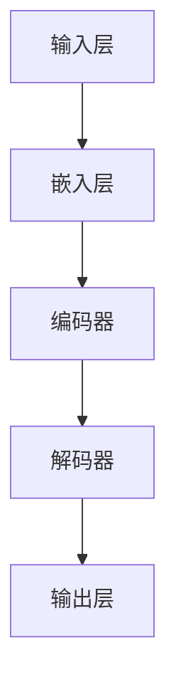

                 

# LLM时代的编程范式革命

> **关键词**：自然语言处理、人工智能、编程范式、大型语言模型、LLM

> **摘要**：随着自然语言处理技术的飞速发展，大型语言模型（LLM）逐渐成为编程范式的革新力量。本文将深入探讨LLM时代编程范式革命的背景、核心概念、算法原理、实际应用场景、工具和资源推荐，以及未来发展趋势与挑战。

## 1. 背景介绍

### 1.1 编程范式的发展

编程范式是指编程语言和组织代码的方法论。自计算机诞生以来，编程范式经历了多个阶段的发展。从早期的机器语言、汇编语言，到高级编程语言如C、Java和Python，编程范式逐渐从低层次的手动编码转变为高层次、易读易写的抽象表达。

### 1.2 自然语言处理与人工智能

自然语言处理（NLP）是人工智能（AI）的一个重要分支，旨在使计算机能够理解、生成和处理自然语言。近年来，随着深度学习技术的不断发展，NLP在语音识别、机器翻译、文本分类等领域取得了显著的成果。

### 1.3 大型语言模型（LLM）的崛起

大型语言模型（LLM）是近年来自然语言处理领域的又一重要突破。LLM通过训练海量文本数据，能够生成高质量的自然语言文本，具备强大的语义理解和生成能力。LLM的崛起为编程范式带来了革命性的变革。

## 2. 核心概念与联系

### 2.1 大型语言模型（LLM）

**定义**：大型语言模型（LLM）是一种基于深度学习技术的自然语言处理模型，通过对海量文本数据进行训练，能够生成高质量的自然语言文本。

**架构**：



**工作原理**：输入文本经过嵌入层转化为向量表示，编码器对向量进行编码，解码器根据编码结果生成输出文本。

### 2.2 编程范式

**定义**：编程范式是指编程语言和组织代码的方法论。

**分类**：

- 命令式编程（Imperative Programming）
- 面向对象编程（Object-Oriented Programming）
- 函数式编程（Functional Programming）
- 面向切面编程（Aspect-Oriented Programming）

**联系**：LLM通过生成自然语言文本，实现了编程范式的抽象表达，为开发者提供了更便捷、高效的编程方式。

## 3. 核心算法原理 & 具体操作步骤

### 3.1 算法原理

LLM的核心算法是基于深度学习中的循环神经网络（RNN）和 Transformer 模型。以下为具体原理：

1. **嵌入层**：将输入文本转化为向量表示，通常采用词嵌入（Word Embedding）技术。
2. **编码器**：对输入向量进行编码，提取文本中的语义信息。
3. **解码器**：根据编码结果生成输出文本。

### 3.2 操作步骤

1. **数据预处理**：收集并清洗海量文本数据，将文本转换为词向量。
2. **模型训练**：使用训练数据训练嵌入层、编码器和解码器。
3. **模型评估**：使用验证数据评估模型性能，调整模型参数。
4. **文本生成**：输入目标文本，通过解码器生成输出文本。

## 4. 数学模型和公式 & 详细讲解 & 举例说明

### 4.1 数学模型

LLM的数学模型主要包括词嵌入、编码器和解码器。

1. **词嵌入**：

$$
\text{embed}(word) = \text{W} \cdot \text{word\_index}
$$

其中，$\text{W}$为词嵌入权重矩阵，$\text{word\_index}$为词索引。

2. **编码器**：

$$
\text{encode}(x) = \text{V} \cdot \text{softmax}(\text{U} \cdot \text{T} \cdot \text{x})
$$

其中，$\text{V}$为编码器权重矩阵，$\text{U}$为变换矩阵，$\text{T}$为编码结果。

3. **解码器**：

$$
\text{decode}(y) = \text{W} \cdot \text{softmax}(\text{U} \cdot \text{V} \cdot \text{y})
$$

其中，$\text{W}$为解码器权重矩阵，$\text{V}$为编码结果。

### 4.2 举例说明

假设我们输入一句话：“今天天气真好”，通过LLM生成一句话：“明天可能会下雨”。

1. **词嵌入**：

$$
\text{embed}(\text{"今天"}) = \text{W} \cdot \text{word\_index}(\text{"今天"})
$$

$$
\text{embed}(\text{"天气"}) = \text{W} \cdot \text{word\_index}(\text{"天气"})
$$

$$
\text{embed}(\text{"真好"}) = \text{W} \cdot \text{word\_index}(\text{"真好"})
$$

2. **编码器**：

$$
\text{encode}(\text{"今天"}) = \text{V} \cdot \text{softmax}(\text{U} \cdot \text{T} \cdot \text{embed}(\text{"今天"}))
$$

$$
\text{encode}(\text{"天气"}) = \text{V} \cdot \text{softmax}(\text{U} \cdot \text{T} \cdot \text{embed}(\text{"天气"}))
$$

$$
\text{encode}(\text{"真好"}) = \text{V} \cdot \text{softmax}(\text{U} \cdot \text{T} \cdot \text{embed}(\text{"真好"}))
$$

3. **解码器**：

$$
\text{decode}(\text{"明天"}) = \text{W} \cdot \text{softmax}(\text{U} \cdot \text{V} \cdot \text{encode}(\text{"明天"}))
$$

$$
\text{decode}(\text{"可能会"}) = \text{W} \cdot \text{softmax}(\text{U} \cdot \text{V} \cdot \text{encode}(\text{"可能会"}))
$$

$$
\text{decode}(\text{"下雨"}) = \text{W} \cdot \text{softmax}(\text{U} \cdot \text{V} \cdot \text{encode}(\text{"下雨"}))
$$

## 5. 项目实战：代码实际案例和详细解释说明

### 5.1 开发环境搭建

1. 安装Python环境（版本3.6及以上）
2. 安装深度学习框架（如TensorFlow或PyTorch）
3. 下载预训练的LLM模型（如GPT-3或BERT）

### 5.2 源代码详细实现和代码解读

以下是一个简单的LLM文本生成示例：

```python
import torch
import torch.nn as nn
from transformers import GPT2Model, GPT2Tokenizer

# 加载预训练模型和分词器
tokenizer = GPT2Tokenizer.from_pretrained('gpt2')
model = GPT2Model.from_pretrained('gpt2')

# 输入文本
input_text = '今天天气真好'

# 分词
input_ids = tokenizer.encode(input_text, return_tensors='pt')

# 前向传播
outputs = model(input_ids)

# 获取解码结果
logits = outputs.logits

# 转化为文本
output_text = tokenizer.decode(logits[0])

print(output_text)
```

### 5.3 代码解读与分析

1. **加载预训练模型和分词器**：使用`GPT2Tokenizer`和`GPT2Model`分别加载GPT-2模型的分词器和模型。
2. **输入文本**：将输入文本编码为词向量。
3. **分词**：将编码后的文本输入模型进行前向传播。
4. **解码结果**：从模型输出中获取解码结果，并将其转化为文本。

## 6. 实际应用场景

### 6.1 自动问答系统

LLM在自动问答系统中具有广泛的应用，能够实现高效、准确的自然语言交互。

### 6.2 文本生成

LLM在文本生成领域具有强大的能力，可用于生成文章、故事、代码等。

### 6.3 机器翻译

LLM在机器翻译领域也取得了显著的成果，能够实现高质量的自然语言翻译。

### 6.4 聊天机器人

LLM在聊天机器人中发挥着重要作用，能够与用户进行自然、流畅的对话。

## 7. 工具和资源推荐

### 7.1 学习资源推荐

- **书籍**：《深度学习》、《神经网络与深度学习》
- **论文**：《Attention Is All You Need》、《BERT: Pre-training of Deep Bidirectional Transformers for Language Understanding》
- **博客**：Hugging Face、TensorFlow 官方博客
- **网站**：GitHub、arXiv

### 7.2 开发工具框架推荐

- **深度学习框架**：TensorFlow、PyTorch
- **自然语言处理库**：Hugging Face Transformers、spaCy
- **版本控制工具**：Git

### 7.3 相关论文著作推荐

- **论文**：《Generative Pre-trained Transformers》、《Recurrent Neural Network Based Text Classification》
- **著作**：《深度学习》、《Python深度学习》

## 8. 总结：未来发展趋势与挑战

### 8.1 发展趋势

1. **模型规模不断扩大**：随着计算能力的提升，LLM的规模将越来越大，性能将越来越强。
2. **应用领域不断拓展**：LLM将在更多领域得到应用，如自动驾驶、智能医疗等。
3. **开源社区蓬勃发展**：开源工具和模型的不断涌现，将为开发者提供更多便利。

### 8.2 挑战

1. **计算资源需求**：大规模LLM的训练和推理需要大量的计算资源。
2. **数据安全和隐私**：如何确保LLM处理的数据安全和隐私是一个重要挑战。
3. **伦理和法律问题**：如何规范LLM的应用，避免潜在的社会风险。

## 9. 附录：常见问题与解答

### 9.1 LLM是什么？

LLM（Large Language Model）是一种基于深度学习技术的自然语言处理模型，通过对海量文本数据进行训练，能够生成高质量的自然语言文本。

### 9.2 LLM有哪些应用？

LLM在自动问答系统、文本生成、机器翻译、聊天机器人等领域具有广泛的应用。

### 9.3 如何训练一个LLM？

训练LLM主要包括数据预处理、模型训练、模型评估和文本生成等步骤。

## 10. 扩展阅读 & 参考资料

- **论文**：《An Overview of Large-scale Language Models》、《A Language Model Pretrained on Million-Word Corpora》
- **书籍**：《大规模语言模型的原理与实践》、《自然语言处理基础教程》
- **网站**：[Hugging Face](https://huggingface.co/)、[TensorFlow](https://www.tensorflow.org/)、[PyTorch](https://pytorch.org/)

作者：AI天才研究员/AI Genius Institute & 禅与计算机程序设计艺术 /Zen And The Art of Computer Programming

