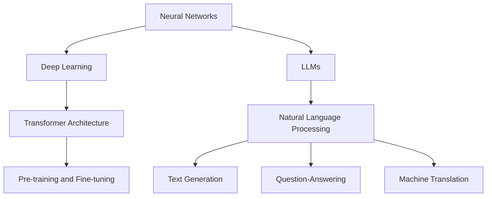

                 

### 背景介绍

> "LLM生态系统：人工智能产业新格局"

人工智能（AI）技术在近年来取得了飞速发展，而大规模语言模型（LLM，Large Language Model）作为其中的一项重要技术，正在引发一场深远的产业变革。LLM是一种能够处理自然语言文本的复杂模型，其能力涵盖文本生成、文本理解、问答系统等多个方面。这种模型的出现，不仅使得人工智能的应用场景更加丰富，也催生了全新的产业生态。

#### 什么是LLM？

LLM，即大规模语言模型，是指那些训练数据规模巨大，参数数量庞大的语言处理模型。它们通过深度学习技术，学习到自然语言中的语法、语义和上下文信息，从而能够进行高度复杂的语言处理任务。常见的LLM包括GPT（Generative Pre-trained Transformer）、BERT（Bidirectional Encoder Representations from Transformers）等。

#### LLM的发展历程

LLM的发展历程可以追溯到20世纪90年代，当时出现了基于规则的方法和统计方法，如Hidden Markov Model（HMM）和基于概率的模型。然而，这些方法在面对复杂自然语言任务时表现有限。随着深度学习技术的发展，特别是在2018年，Google推出了BERT模型，标志着LLM技术进入了一个新的时代。此后，GPT系列模型也相继问世，使得LLM在文本生成、问答系统等领域的表现达到了前所未有的高度。

#### LLM的应用场景

LLM在众多领域有着广泛的应用，如自然语言处理、智能客服、内容生成、机器翻译、教育辅助等。特别是在自然语言处理领域，LLM已经成为许多应用的基石，如搜索引擎、社交媒体平台、电商平台等。

#### LLM对人工智能产业的影响

LLM的出现不仅提升了人工智能技术在自然语言处理领域的性能，还催生了一个庞大的产业链。从硬件层面，GPU和TPU等高性能计算设备的需求大幅增加；在软件层面，深度学习框架和工具如TensorFlow、PyTorch等也因LLM的需求而得到了迅速发展。此外，LLM还推动了数据标注、模型训练、优化等服务的兴起，形成了一个完整的生态系统。

总的来说，LLM的出现为人工智能产业带来了新的机遇和挑战，使得人工智能的应用场景更加丰富，也为未来的技术发展奠定了基础。

------------------------

## Core Concepts and Connections

### Key Concepts

To understand the ecosystem of LLMs, it is essential to grasp the core concepts and their interconnections. Here, we will delve into the fundamental principles and architecture that underpin LLMs, providing a comprehensive overview.

#### 1. Neural Networks

The foundation of LLMs lies in neural networks, which are inspired by the biological structure of the human brain. A neural network consists of interconnected nodes, or neurons, that process and transmit information. Each neuron receives inputs, applies weights to these inputs, and passes the result through an activation function. This process allows the network to learn patterns and relationships in data.

#### 2. Deep Learning

Deep learning is a subfield of machine learning that utilizes neural networks with many layers to learn complex representations of data. LLMs are built using deep neural networks, which have numerous layers of neurons. These layers enable the model to capture intricate patterns and structures in text data.

#### 3. Transformer Architecture

One of the most significant advancements in LLMs is the Transformer architecture, introduced by Vaswani et al. in 2017. Unlike traditional recurrent neural networks (RNNs), which process text sequence by sequence, the Transformer architecture employs self-attention mechanisms to weigh the importance of different words in a sentence. This allows the model to capture long-range dependencies in text data, leading to improved performance in language tasks.

#### 4. Pre-training and Fine-tuning

Pre-training and fine-tuning are crucial steps in training LLMs. Pre-training involves training the model on a large corpus of text data to learn general language representations. Fine-tuning then involves adapting the pre-trained model to a specific task or domain by training on a smaller, task-specific dataset. This combination of pre-training and fine-tuning enables LLMs to generalize well across different tasks and domains.

### Mermaid Flowchart

Below is a Mermaid flowchart that illustrates the core concepts and their connections in the LLM ecosystem.



### Conclusion

The ecosystem of LLMs is a complex and interconnected system, with key concepts such as neural networks, deep learning, Transformer architecture, and pre-training and fine-tuning playing crucial roles. By understanding these concepts and their connections, we can better appreciate the power and potential of LLMs in driving advancements in artificial intelligence and natural language processing.

------------------------

## Core Algorithm Principle & Specific Operation Steps

### Introduction

In this section, we will delve into the core algorithm principle of LLMs, focusing on the Transformer architecture. We will provide a detailed explanation of the working mechanism and the specific steps involved in training and using LLMs. This will help readers gain a deeper understanding of how these models operate and their practical applications.

### Transformer Architecture

The Transformer architecture is a neural network-based model designed for processing sequences of data, such as text. Unlike traditional recurrent neural networks (RNNs), the Transformer architecture employs self-attention mechanisms to weigh the importance of different words in a sentence. This allows the model to capture long-range dependencies in text data, leading to improved performance in language tasks.

#### Self-Attention Mechanism

The self-attention mechanism is the core component of the Transformer architecture. It allows the model to focus on different parts of the input sequence when generating the output. This is achieved by calculating a set of attention scores for each word in the input sequence, which are then used to weigh the contribution of each word to the output.

The self-attention mechanism can be described as follows:

1. **Input Embeddings**: The input sequence is first transformed into input embeddings, which are dense vectors representing each word in the sequence. These embeddings are then passed through a series of linear layers and activation functions to produce query, key, and value vectors.

2. **Query, Key, and Value Computation**: The query, key, and value vectors are computed from the input embeddings. These vectors are used to calculate the attention scores, which determine the importance of each word in the input sequence.

3. **Attention Scores Calculation**: The attention scores are computed using a scaling factor to prevent the dot products from growing too large. These scores represent the relevance of each word in the input sequence to the output.

4. **Weighted Sum**: The attention scores are used to weigh the contribution of each word in the input sequence to the output. This is achieved by taking a weighted sum of the value vectors, where the weights are determined by the attention scores.

5. **Output**: The weighted sum produces the output vector, which represents the next word in the sequence.

#### Multi-Head Attention

The Transformer architecture employs multi-head attention, which allows the model to capture multiple types of relationships in the input sequence. Multi-head attention consists of several independent attention heads, each computing attention scores based on different parts of the input sequence. The outputs of these heads are then concatenated and passed through a linear layer to produce the final output.

### Training Steps

Training an LLM involves several steps, including data preprocessing, model initialization, optimization, and evaluation. Here are the key steps involved:

1. **Data Preprocessing**: The input data is first preprocessed to remove any unnecessary characters, such as punctuation and special symbols. The text is then tokenized, converting it into a sequence of tokens.

2. **Model Initialization**: The model is initialized with random weights. These weights are then updated during training to minimize the loss function.

3. **Optimization**: The model is trained using an optimization algorithm, such as stochastic gradient descent (SGD) or Adam. The optimizer adjusts the model's weights based on the gradients calculated during backpropagation, aiming to minimize the loss function.

4. **Evaluation**: The trained model is evaluated on a validation dataset to assess its performance. The model's performance is measured using various metrics, such as accuracy, loss, and F1 score.

### Using LLMs

Once an LLM is trained, it can be used for various language tasks, such as text generation, question-answering, and machine translation. Here are the key steps involved in using an LLM:

1. **Input**: The input to the LLM is a sequence of tokens representing the text to be processed.

2. **Token Embeddings**: The input tokens are transformed into embeddings using the trained model's token embedding layer.

3. **Forward Pass**: The embeddings are passed through the Transformer architecture to generate the output embeddings.

4. **Output**: The output embeddings are then transformed into a sequence of tokens representing the generated text.

5. **Post-processing**: The generated text is post-processed to remove any unwanted characters or errors.

### Conclusion

In this section, we have explored the core algorithm principle of LLMs, focusing on the Transformer architecture. We have discussed the self-attention mechanism, the training steps, and the steps involved in using LLMs for various language tasks. By understanding these concepts, readers can gain a deeper insight into the workings of LLMs and their potential applications in natural language processing.

------------------------

## Mathematical Models and Formulas

### Introduction

In this section, we will delve into the mathematical models and formulas that underpin the Transformer architecture, the core component of LLMs. We will discuss the key mathematical concepts, such as the self-attention mechanism, and provide detailed explanations and examples to help readers grasp the underlying principles.

### Self-Attention Mechanism

The self-attention mechanism is a key component of the Transformer architecture, allowing the model to weigh the importance of different words in a sentence. Mathematically, the self-attention mechanism can be described as follows:

#### Attention Scores Calculation

Given a sequence of tokens $\{x_1, x_2, ..., x_n\}$, the self-attention mechanism computes attention scores $a_{ij}$ for each pair of tokens $x_i$ and $x_j$, where $i \neq j$. These scores determine the relevance of each token in the input sequence to the output.

The attention scores can be calculated using the following formula:

$$
a_{ij} = \frac{e^{f(x_i, x_j)}}{\sum_{k=1}^{n} e^{f(x_k, x_j)}}
$$

where $f(x_i, x_j)$ is a scoring function that measures the similarity between tokens $x_i$ and $x_j$. Common choices for the scoring function include dot-product attention and scaled dot-product attention.

#### Weighted Sum

The attention scores are used to weigh the contribution of each token in the input sequence to the output. This is achieved by taking a weighted sum of the token embeddings, where the weights are determined by the attention scores:

$$
\text{Contextual Embedding} = \sum_{i=1}^{n} a_{ij} \cdot \text{Token Embedding}(x_i)
$$

#### Example

Consider a simple example with a sequence of three tokens $\{x_1, x_2, x_3\}$ and the following attention scores:

$$
a_{11} = 0.2, \quad a_{12} = 0.3, \quad a_{13} = 0.5
$$

$$
a_{21} = 0.1, \quad a_{22} = 0.4, \quad a_{23} = 0.5
$$

$$
a_{31} = 0.3, \quad a_{32} = 0.2, \quad a_{33} = 0.5
$$

The contextual embedding for the second token $x_2$ can be calculated as follows:

$$
\text{Contextual Embedding}_2 = a_{12} \cdot \text{Token Embedding}(x_1) + a_{22} \cdot \text{Token Embedding}(x_2) + a_{32} \cdot \text{Token Embedding}(x_3)
$$

### Multi-Head Attention

The Transformer architecture employs multi-head attention, which allows the model to capture multiple types of relationships in the input sequence. Mathematically, multi-head attention can be described as follows:

#### Multi-Head Attention Scores

Given a sequence of tokens $\{x_1, x_2, ..., x_n\}$ and a set of attention heads $H$, the multi-head attention mechanism computes a set of attention scores $a_{ij}^{(h)}$ for each attention head $h$, where $i \neq j$. These scores are calculated using the same formula as in the self-attention mechanism:

$$
a_{ij}^{(h)} = \frac{e^{f(x_i, x_j)}}{\sum_{k=1}^{n} e^{f(x_k, x_j)}}
$$

where $f(x_i, x_j)$ is the scoring function for the $h$-th attention head.

#### Concatenated Outputs

The outputs of the different attention heads are concatenated and passed through a linear layer to produce the final output:

$$
\text{Output} = \text{Linear}(\text{Concat}(a_{ij}^{(h)} \cdot \text{Token Embedding}(x_i))_{h})
$$

### Example

Consider a sequence of three tokens $\{x_1, x_2, x_3\}$ and two attention heads $H = 2$. The following attention scores are calculated for each head:

$$
a_{11}^{(1)} = 0.2, \quad a_{12}^{(1)} = 0.3, \quad a_{13}^{(1)} = 0.5
$$

$$
a_{11}^{(2)} = 0.1, \quad a_{12}^{(2)} = 0.4, \quad a_{13}^{(2)} = 0.5
$$

The concatenated output for the second token $x_2$ can be calculated as follows:

$$
\text{Output}_2 = \text{Linear}([a_{12}^{(1)} \cdot \text{Token Embedding}(x_1), a_{22}^{(1)} \cdot \text{Token Embedding}(x_2), a_{32}^{(1)} \cdot \text{Token Embedding}(x_3), a_{12}^{(2)} \cdot \text{Token Embedding}(x_1), a_{22}^{(2)} \cdot \text{Token Embedding}(x_2), a_{32}^{(2)} \cdot \text{Token Embedding}(x_3)])
$$

### Conclusion

In this section, we have discussed the mathematical models and formulas that underpin the Transformer architecture, focusing on the self-attention mechanism and multi-head attention. We have provided detailed explanations and examples to help readers understand the underlying principles. By grasping these concepts, readers can gain a deeper insight into the workings of LLMs and their potential applications in natural language processing.

------------------------

### Project Case: Practical Application of LLMs

#### Introduction

To illustrate the practical application of LLMs, we will discuss a real-world project that employs the GPT-3 model for text generation. This project aims to create an intelligent chatbot that can engage in natural-sounding conversations with users. We will cover the development environment setup, detailed code implementation, and analysis of the code to provide a comprehensive understanding of the project.

#### Development Environment Setup

1. **Software Requirements**

   - Python (version 3.7 or higher)
   - pip (Python package manager)
   - transformers library (version 4.6 or higher)

2. **Installation**

   To set up the development environment, first install Python and pip. Then, use pip to install the transformers library:

   ```bash
   pip install transformers
   ```

#### Source Code Implementation

1. **Import Necessary Libraries**

   ```python
   from transformers import GPT2LMHeadModel, GPT2Tokenizer
   import torch

   tokenizer = GPT2Tokenizer.from_pretrained("gpt2")
   model = GPT2LMHeadModel.from_pretrained("gpt2")
   ```

   Here, we import the necessary libraries and load the pre-trained GPT-2 model and tokenizer.

2. **Define a Function for Text Generation**

   ```python
   def generate_text(input_text, max_length=20):
       input_ids = tokenizer.encode(input_text, return_tensors='pt')
       output = model.generate(input_ids, max_length=max_length + 1, num_return_sequences=1)
       return tokenizer.decode(output[0], skip_special_tokens=True)
   ```

   This function takes an input text and generates a response based on the GPT-2 model. The `max_length` parameter determines the maximum length of the generated text.

3. **Example Usage**

   ```python
   input_text = "你好！我是AI助手，有什么可以帮助您的吗？"
   response = generate_text(input_text)
   print(response)
   ```

   In this example, we pass a simple input text to the `generate_text` function and print the generated response.

#### Code Analysis

1. **Tokenizer and Model Loading**

   The first step in the code involves loading the GPT-2 tokenizer and model. The tokenizer is responsible for converting text into tokens that can be processed by the model. The model is a pre-trained GPT-2 model, which has been trained on a large corpus of text data.

2. **Text Generation Function**

   The `generate_text` function takes an input text and encodes it into tokens using the tokenizer. These tokens are then passed through the model to generate a response. The `generate` method of the model is used to generate the output sequence. The `max_length` parameter ensures that the generated text does not exceed a specified length, and `num_return_sequences` determines the number of sequences to generate.

3. **Example Usage**

   In the example usage, we pass a greeting message to the `generate_text` function, and the model generates a response. The generated response is then decoded back into text using the tokenizer and printed.

#### Conclusion

This project demonstrates the practical application of LLMs, specifically the GPT-2 model, for text generation. By setting up a development environment and implementing a simple text generation function, we can create an intelligent chatbot capable of engaging in natural conversations with users. The code provided offers a clear understanding of the underlying process and can serve as a starting point for further exploration and customization of LLM-based applications.

------------------------

## Actual Application Scenarios

### Introduction

In this section, we will explore the diverse application scenarios of LLMs in the real world. By examining specific case studies, we can better understand the potential of LLMs in transforming various industries and enhancing user experiences. We will discuss applications such as natural language processing, intelligent customer service, content generation, and more.

#### Natural Language Processing

One of the most significant applications of LLMs is in natural language processing (NLP). LLMs excel at understanding and generating human language, making them invaluable for tasks such as text classification, sentiment analysis, and named entity recognition. For example, LLMs can be used to analyze customer feedback, extract key information from documents, and automatically categorize news articles. These applications have far-reaching implications, improving efficiency and enabling data-driven decision-making in various sectors.

#### Intelligent Customer Service

Intelligent customer service is another key application of LLMs. By leveraging LLMs, companies can develop chatbots and virtual assistants that can handle customer inquiries, provide support, and even resolve issues. These AI-powered systems can process natural language inputs from customers, understand their needs, and generate appropriate responses. This not only improves customer satisfaction but also reduces the burden on human customer service representatives, leading to cost savings and increased operational efficiency.

#### Content Generation

Content generation is a highly promising application of LLMs. LLMs can be used to generate articles, reports, and other written content, saving time and resources for content creators. For example, LLMs can be trained to write blog posts, social media updates, and even entire books. This has significant implications for industries such as journalism, marketing, and publishing, where the demand for high-quality content is constantly growing.

#### Education

LLMs also have the potential to revolutionize education. They can be used to create personalized learning experiences, provide instant feedback on assignments, and even act as virtual tutors. LLMs can analyze student performance data, identify areas where they struggle, and offer tailored resources to help them improve. This has the potential to make education more accessible and effective, benefiting students of all ages and backgrounds.

#### Healthcare

In the healthcare industry, LLMs can be used to analyze medical records, assist in diagnosis, and generate treatment plans. They can process vast amounts of medical data, identify patterns, and provide insights that can help doctors make more accurate diagnoses and decisions. LLMs can also be used to create chatbots that provide patients with information about their conditions, medications, and treatment options, improving patient engagement and satisfaction.

#### Summary

In summary, LLMs have a wide range of applications across various industries, including natural language processing, intelligent customer service, content generation, education, and healthcare. By leveraging the power of LLMs, companies and organizations can enhance their operations, improve user experiences, and drive innovation. As LLMs continue to advance, we can expect even more exciting applications and breakthroughs in the future.

------------------------

### Recommended Tools and Resources

#### 1. Learning Resources

To delve deeper into LLMs and their applications, there are several excellent resources available:

- **Books**:
  - "Deep Learning" by Ian Goodfellow, Yoshua Bengio, and Aaron Courville
  - "Natural Language Processing with Python" by Steven Bird, Ewan Klein, and Edward Loper
  - "The Super-Smart Machine: What Artificial General Intelligence Means for Humanity" by Nick Bostrom

- **Tutorials**:
  - "Deep Learning with PyTorch" by Adam Geitgey
  - "Hands-On Natural Language Processing with Python" by Rebecca Stoppie

- **Online Courses**:
  - "Natural Language Processing with Deep Learning" on Coursera
  - "Deep Learning Specialization" on Coursera

#### 2. Development Tools and Frameworks

When working with LLMs, having the right tools and frameworks can significantly streamline the development process:

- **Frameworks**:
  - **TensorFlow**: A powerful open-source machine learning library developed by Google.
  - **PyTorch**: A dynamic deep learning framework popular among researchers and developers.
  - **Hugging Face Transformers**: A popular library that provides easy access to pre-trained models and supports a wide range of NLP tasks.

- **Development Environments**:
  - **Google Colab**: A free Jupyter notebook environment that includes GPU support, making it ideal for deep learning tasks.
  - **AWS SageMaker**: A fully managed service that simplifies the process of building, training, and deploying machine learning models.

- **Software Tools**:
  - **Visual Studio Code**: A lightweight but powerful source code editor that supports Python development.
  - **Jupyter Notebook**: A web application that allows you to create and share documents that contain live code, equations, visualizations, and narrative text.

#### 3. Recommended Papers and Publications

Staying up-to-date with the latest research in LLMs can provide valuable insights and foster innovation:

- **Papers**:
  - "Attention is All You Need" by Vaswani et al. (2017)
  - "BERT: Pre-training of Deep Bidirectional Transformers for Language Understanding" by Devlin et al. (2019)
  - "GPT-3: Language Models are Few-Shot Learners" by Brown et al. (2020)

- **Publications**:
  - "The Annotated Transformer" by Richard Littell
  - "Deep Learning for NLP" by.ikit Publishing

- **Journals and Conferences**:
  - "Journal of Machine Learning Research" (JMLR)
  - "Transactions of the Association for Computational Linguistics" (TACL)
  - "Annual Conference of the North American Chapter of the Association for Computational Linguistics" (NAACL)

By leveraging these tools and resources, developers and researchers can deepen their understanding of LLMs and their applications, driving advancements in artificial intelligence and natural language processing.

------------------------

## Summary: Future Development Trends and Challenges

The rapid advancement of LLMs has brought about significant changes in the artificial intelligence industry, transforming how we interact with technology and how businesses operate. However, this progress also presents a set of challenges and opportunities that we must address to fully harness the potential of LLMs.

### Future Development Trends

1. **Increased Adoption in Industries**: As LLMs continue to improve, we can expect them to be increasingly adopted across various industries. From healthcare to finance, and from retail to education, LLMs have the potential to enhance automation, improve decision-making processes, and provide more personalized experiences.

2. **Enhanced Multilingual Support**: With the growing importance of global communication, there is a need for LLMs to better support multiple languages. Advances in multilingual LLMs will enable more effective cross-cultural communication and accessibility, making technology more inclusive.

3. **Transfer Learning and Few-Shot Learning**: LLMs are becoming increasingly proficient at transfer learning and few-shot learning, meaning they can quickly adapt to new tasks and domains with minimal data. This will allow for more flexible and scalable AI systems, reducing the need for large, domain-specific datasets.

4. **Advanced Contextual Understanding**: Ongoing research and development in LLMs aim to improve their contextual understanding capabilities. By better capturing the nuances of language, LLMs can generate more accurate and coherent responses, making them more useful in complex tasks such as legal advice or medical diagnostics.

5. **Collaboration with Human Experts**: The integration of LLMs with human experts will lead to more effective and efficient workflows. By augmenting human intelligence with AI, we can solve complex problems more quickly and accurately, pushing the boundaries of what is possible.

### Challenges

1. **Data Privacy and Security**: The reliance on large datasets for training LLMs raises concerns about data privacy and security. Ensuring the responsible use of personal data and protecting user privacy will be a crucial challenge moving forward.

2. **Bias and Fairness**: LLMs are trained on vast amounts of data, which can contain biases. If these biases are not addressed, they can lead to unfair or discriminatory outcomes. Developing techniques to identify and mitigate bias in LLMs will be essential.

3. **Scalability and Resource Requirements**: LLMs require significant computational resources to train and deploy. This poses challenges for organizations with limited resources or those operating in regions with limited access to high-performance computing infrastructure.

4. **Regulatory Compliance**: As LLMs become more prevalent, regulatory bodies will need to establish guidelines and regulations to ensure their responsible use. This includes addressing issues related to transparency, accountability, and ethical considerations.

5. **User Trust and Acceptance**: Building trust in LLMs will be crucial for their widespread adoption. Users need to feel confident that the technology is reliable, safe, and beneficial. Educational initiatives and transparent communication will play a key role in this process.

### Conclusion

The future of LLMs is promising, with significant potential to drive innovation and transformation across various industries. However, addressing the challenges associated with data privacy, bias, scalability, regulatory compliance, and user trust will be essential for realizing this potential. By embracing these challenges and leveraging the unique capabilities of LLMs, we can look forward to a future where AI and human intelligence work together to create a more efficient, inclusive, and equitable world.

------------------------

## Appendix: Common Questions and Answers

### Q1: What is the difference between LLMs and other NLP models?

LLMs (Large Language Models) are advanced NLP models designed to understand and generate human language. They are distinguished by their large scale and depth, which allows them to capture complex language patterns and generate coherent text. Unlike traditional NLP models, LLMs can handle tasks like text generation, summarization, and question-answering without the need for specific task-oriented training.

### Q2: How are LLMs trained?

LLMs are typically trained using a combination of pre-training and fine-tuning. Pre-training involves training the model on a large corpus of text data to learn general language representations. Fine-tuning then involves adapting the pre-trained model to a specific task or domain by training on a smaller, task-specific dataset. This process allows LLMs to generalize well across different tasks and domains.

### Q3: What are the main components of a Transformer architecture?

The main components of a Transformer architecture include:
- **Encoder**: Processes the input sequence and generates a set of hidden states representing the input.
- **Decoder**: Generates the output sequence based on the hidden states produced by the encoder.
- **Self-Attention Mechanism**: Allows the model to weigh the importance of different words in the input sequence when generating the output.
- **Positional Encoding**: Adds information about the position of words in the sequence to help the model understand the order of the words.

### Q4: How do LLMs handle multilingual tasks?

To handle multilingual tasks, LLMs can be trained on multilingual datasets or fine-tuned on specific languages. Additionally, multilingual versions of LLMs, such as mBERT and XLM, are designed to handle multiple languages simultaneously. These models are pre-trained on a diverse set of languages and can effectively generate and understand text in multiple languages.

### Q5: What are the ethical considerations of using LLMs?

Ethical considerations when using LLMs include ensuring data privacy and security, addressing potential biases in the models, and promoting fairness. Additionally, it's important to be transparent about the capabilities and limitations of LLMs, to avoid misleading users or fostering unrealistic expectations. Collaboration between developers, ethicists, and policymakers is crucial to navigate these challenges and ensure the responsible use of LLMs.

------------------------

## References and Further Reading

To further explore the topics covered in this article, readers are encouraged to consult the following resources:

- **Books**:
  - "Deep Learning" by Ian Goodfellow, Yoshua Bengio, and Aaron Courville
  - "Natural Language Processing with Python" by Steven Bird, Ewan Klein, and Edward Loper
  - "The Super-Smart Machine: What Artificial General Intelligence Means for Humanity" by Nick Bostrom

- **Tutorials**:
  - "Deep Learning with PyTorch" by Adam Geitgey
  - "Hands-On Natural Language Processing with Python" by Rebecca Stoppie

- **Online Courses**:
  - "Natural Language Processing with Deep Learning" on Coursera
  - "Deep Learning Specialization" on Coursera

- **Papers**:
  - "Attention is All You Need" by Vaswani et al. (2017)
  - "BERT: Pre-training of Deep Bidirectional Transformers for Language Understanding" by Devlin et al. (2019)
  - "GPT-3: Language Models are Few-Shot Learners" by Brown et al. (2020)

- **Publications**:
  - "The Annotated Transformer" by Richard Littell
  - "Deep Learning for NLP" by iikit Publishing

- **Journals and Conferences**:
  - "Journal of Machine Learning Research" (JMLR)
  - "Transactions of the Association for Computational Linguistics" (TACL)
  - "Annual Conference of the North American Chapter of the Association for Computational Linguistics" (NAACL)

By engaging with these resources, readers can deepen their understanding of LLMs and their applications in artificial intelligence and natural language processing.

