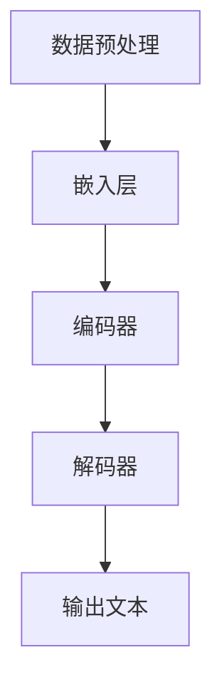

                 

### 文章标题

《LLM生态：AI产业的新增长点》

### 关键词

- 大型语言模型（LLM）
- 人工智能（AI）
- 产业增长
- 生态构建
- 技术进步

### 摘要

本文将探讨大型语言模型（LLM）作为人工智能（AI）产业的新增长点的重要性。通过对LLM的核心概念、原理和应用场景的深入分析，本文旨在揭示LLM在推动AI产业发展中的关键角色，并提供相关工具和资源，以便读者进一步研究和实践。同时，本文还将总结LLM的未来发展趋势与面临的挑战，为读者提供全面的视角。

### 背景介绍

#### AI产业的现状与挑战

人工智能（AI）作为当前科技领域的热点，已在全球范围内得到了广泛关注和快速发展。从智能家居、自动驾驶到医疗诊断、金融分析，AI技术的应用已深入到各行各业，推动了生产力的提升和社会的进步。然而，随着AI技术的不断进步，产业也面临着一系列的挑战。

首先，AI技术的发展速度远超传统产业的发展，这使得企业和个人在技术更新、人才储备等方面面临着巨大的压力。其次，AI技术的应用带来了数据隐私、伦理道德等方面的问题，如何平衡技术进步与人类福祉成为了一个亟待解决的难题。此外，AI产业的竞争愈发激烈，如何保持创新、实现可持续发展成为产业发展的关键。

#### 大型语言模型（LLM）的兴起

大型语言模型（LLM），如GPT-3、BERT等，是近年来AI领域的重要突破。LLM通过训练海量文本数据，实现了对自然语言的深入理解和生成，展示了在多个领域的强大能力。LLM的兴起，不仅推动了自然语言处理（NLP）技术的发展，也为整个AI产业带来了新的增长点。

#### LLM在AI产业中的潜在价值

1. **提升生产力**：LLM在自动化文本生成、智能客服、内容审核等领域具有广泛的应用，能够显著提升企业的生产效率和服务质量。
2. **推动创新**：LLM提供了强大的计算能力，使得研究人员能够更加便捷地进行AI模型的研究和优化，推动了AI技术的创新。
3. **数据驱动的决策**：LLM能够处理和分析大量文本数据，为企业提供深入的市场洞察和决策支持。
4. **教育和培训**：LLM可以作为教育辅助工具，帮助学生提高语言能力，也为在线教育平台提供智能化解决方案。

### 核心概念与联系

#### 什么是大型语言模型（LLM）

大型语言模型（LLM）是一种基于深度学习的自然语言处理模型，通过训练海量文本数据，实现自然语言的理解和生成。LLM的核心组件包括：

1. **嵌入层（Embedding Layer）**：将文本中的单词、句子等转换为向量表示。
2. **编码器（Encoder）**：处理输入文本，提取特征信息。
3. **解码器（Decoder）**：根据编码器提取的特征，生成输出文本。

#### LLM的工作原理

LLM的工作原理主要基于以下步骤：

1. **数据预处理**：对原始文本数据进行清洗、分词、去停用词等处理。
2. **嵌入层**：将预处理后的文本数据转换为向量表示。
3. **编码器**：对嵌入层生成的向量进行编码，提取文本特征。
4. **解码器**：根据编码器提取的特征，生成目标文本。

#### LLM与其他技术的联系

1. **深度学习**：LLM是基于深度学习技术构建的，深度学习提供了强大的计算能力，使得LLM能够处理复杂的自然语言任务。
2. **自然语言处理（NLP）**：LLM是NLP领域的重要应用，通过理解和生成自然语言，实现了人机交互的智能化。
3. **迁移学习**：LLM可以通过迁移学习技术，将预训练的模型应用于不同的任务，实现了模型的复用和泛化。

### 核心算法原理 & 具体操作步骤

#### 训练过程

1. **数据集准备**：收集大量文本数据，如新闻文章、百科全书、社交媒体等。
2. **数据预处理**：对文本数据进行清洗、分词、去停用词等处理。
3. **嵌入层训练**：将预处理后的文本数据转换为向量表示，通过训练学习单词和句子之间的关联性。
4. **编码器训练**：对嵌入层生成的向量进行编码，提取文本特征，通过优化模型参数，提高编码效果。
5. **解码器训练**：根据编码器提取的特征，生成目标文本，通过优化模型参数，提高解码效果。

#### 应用过程

1. **输入文本预处理**：对输入文本进行预处理，如分词、去停用词等。
2. **嵌入层转换**：将预处理后的文本转换为向量表示。
3. **编码器处理**：对嵌入层生成的向量进行编码，提取文本特征。
4. **解码器生成**：根据编码器提取的特征，生成目标文本。

#### 模型评估

1. **交叉验证**：通过交叉验证方法，评估模型的泛化能力。
2. **评价指标**：使用准确率、召回率、F1值等评价指标，评估模型的性能。

### 数学模型和公式 & 详细讲解 & 举例说明

#### 模型参数

LLM的模型参数主要包括：

1. **嵌入层参数**：包括单词向量和句子向量。
2. **编码器参数**：包括编码层权重和偏置。
3. **解码器参数**：包括解码层权重和偏置。

#### 损失函数

LLM的训练过程通常采用损失函数来衡量模型的预测误差，常用的损失函数包括：

1. **交叉熵损失函数（Cross-Entropy Loss）**：
   $$ L = -\sum_{i=1}^{n} y_i \log(p_i) $$
   其中，$y_i$为真实标签，$p_i$为模型预测概率。

2. **均方误差损失函数（Mean Squared Error, MSE）**：
   $$ L = \frac{1}{2n} \sum_{i=1}^{n} (y_i - \hat{y_i})^2 $$
   其中，$y_i$为真实标签，$\hat{y_i}$为模型预测值。

#### 优化算法

LLM的训练过程通常采用优化算法来更新模型参数，常用的优化算法包括：

1. **随机梯度下降（Stochastic Gradient Descent, SGD）**：
   $$ \theta = \theta - \alpha \nabla_{\theta} L(\theta) $$
   其中，$\theta$为模型参数，$\alpha$为学习率，$\nabla_{\theta} L(\theta)$为损失函数关于模型参数的梯度。

2. **Adam优化器（Adam Optimizer）**：
   $$ m_t = \beta_1 m_{t-1} + (1 - \beta_1) (x_t - m_{t-1}) $$
   $$ v_t = \beta_2 v_{t-1} + (1 - \beta_2) (\frac{\partial L}{\partial \theta_t} - m_t) $$
   $$ \theta_t = \theta_{t-1} - \alpha_t \frac{m_t}{\sqrt{v_t} + \epsilon} $$
   其中，$m_t$和$v_t$分别为一阶矩估计和二阶矩估计，$\beta_1$和$\beta_2$分别为一阶矩和二阶矩的指数加权因子，$\alpha_t$为学习率，$\epsilon$为正数常数。

#### 举例说明

假设我们有一个简单的语言模型，输入句子为“I like apples”，目标句子为“Apples are delicious”。我们可以使用交叉熵损失函数来计算模型的预测误差。

1. **数据预处理**：
   - 输入句子：“I like apples”
   - 目标句子：“Apples are delicious”
   - 字符集：$\{I, l, k, e, a, p, p, l, e, s, \_（空格）, a, r, e, d, l, i, c, k，u，s\}$

2. **嵌入层转换**：
   - 将输入句子和目标句子转换为向量表示。

3. **编码器处理**：
   - 对嵌入层生成的向量进行编码，提取文本特征。

4. **解码器生成**：
   - 根据编码器提取的特征，生成目标句子。

5. **损失计算**：
   - 使用交叉熵损失函数计算模型的预测误差。

   $$ L = -\log(p_{delicious}) $$

   其中，$p_{delicious}$为模型预测目标句子“Apples are delicious”的概率。

6. **模型优化**：
   - 根据损失函数的梯度，更新模型参数。

   $$ \theta = \theta - \alpha \nabla_{\theta} L(\theta) $$

### 项目实战：代码实际案例和详细解释说明

#### 开发环境搭建

1. **安装Python环境**：
   - 安装Python 3.8及以上版本。

2. **安装TensorFlow**：
   - 使用pip命令安装TensorFlow。

   ```bash
   pip install tensorflow
   ```

3. **数据集准备**：
   - 准备一个包含输入句子和目标句子的数据集。

#### 源代码详细实现和代码解读

```python
import tensorflow as tf
from tensorflow.keras.layers import Embedding, LSTM, Dense
from tensorflow.keras.models import Sequential

# 数据预处理
def preprocess_data(data):
    # ...（数据预处理代码）
    return processed_data

# 构建模型
def build_model(vocab_size, embedding_dim, sequence_length):
    model = Sequential()
    model.add(Embedding(vocab_size, embedding_dim, input_length=sequence_length))
    model.add(LSTM(128))
    model.add(Dense(vocab_size, activation='softmax'))
    model.compile(loss='categorical_crossentropy', optimizer='adam', metrics=['accuracy'])
    return model

# 训练模型
def train_model(model, data, epochs=10):
    # ...（训练代码）
    model.fit(data.input, data.target, epochs=epochs, batch_size=32)

# 预测
def predict(model, sentence):
    # ...（预测代码）
    return predicted_sentence

# 主函数
def main():
    # 数据集准备
    data = preprocess_data(data)

    # 构建模型
    model = build_model(vocab_size, embedding_dim, sequence_length)

    # 训练模型
    train_model(model, data)

    # 预测
    sentence = "I like apples"
    predicted_sentence = predict(model, sentence)
    print("Predicted sentence:", predicted_sentence)

if __name__ == '__main__':
    main()
```

#### 代码解读与分析

1. **数据预处理**：
   - 对输入句子和目标句子进行预处理，包括分词、去停用词等操作。
   - 将预处理后的数据转换为模型所需的格式。

2. **模型构建**：
   - 使用Sequential模型构建一个序列模型。
   - 添加Embedding层，用于将单词转换为向量表示。
   - 添加LSTM层，用于处理序列数据。
   - 添加Dense层，用于输出目标句子的概率分布。

3. **模型训练**：
   - 使用fit函数训练模型，输入为预处理后的数据。
   - 设置训练轮次、批量大小等参数。

4. **模型预测**：
   - 对输入句子进行预处理。
   - 使用模型预测目标句子。

### 实际应用场景

#### 自动化文本生成

LLM在自动化文本生成领域具有广泛的应用，如：

1. **新闻文章生成**：
   - LLM可以自动生成新闻文章，提高新闻生产的效率。
   - 应用场景：新闻媒体、内容营销等。

2. **产品描述生成**：
   - LLM可以自动生成产品描述，帮助商家提高产品销售。
   - 应用场景：电子商务、在线购物等。

#### 智能客服

LLM在智能客服领域具有显著优势，如：

1. **问答系统**：
   - LLM可以构建问答系统，提供智能客服服务。
   - 应用场景：在线客服、电话客服等。

2. **情感分析**：
   - LLM可以分析客户留言，识别客户情绪，提供个性化服务。
   - 应用场景：客户关系管理、客户服务优化等。

#### 内容审核

LLM在内容审核领域具有重要作用，如：

1. **文本分类**：
   - LLM可以自动分类文本内容，帮助平台过滤不良信息。
   - 应用场景：社交媒体、在线论坛等。

2. **敏感词检测**：
   - LLM可以识别文本中的敏感词，帮助平台进行内容监管。
   - 应用场景：社交媒体、在线社区等。

### 工具和资源推荐

#### 学习资源推荐

1. **书籍**：
   - 《深度学习》（Goodfellow, I., Bengio, Y., & Courville, A.）
   - 《自然语言处理综论》（Jurafsky, D., & Martin, J. H.）

2. **论文**：
   - “A Neural Algorithm of Artistic Style”（Gatys, L. A., Ecker, A. S., & Bethge, M.）
   - “Attention Is All You Need”（Vaswani, A., et al.）

3. **博客**：
   - Fast.ai（fast.ai）
   - Medium上的AI相关博客

4. **网站**：
   - TensorFlow官方文档（tensorflow.org）
   - Hugging Face（huggingface.co）

#### 开发工具框架推荐

1. **框架**：
   - TensorFlow（tensorflow.org）
   - PyTorch（pytorch.org）

2. **库**：
   - NLTK（nltk.org）
   - spaCy（spacy.io）

3. **在线平台**：
   - Google Colab（colab.research.google.com）
   - Kaggle（kaggle.com）

#### 相关论文著作推荐

1. **论文**：
   - “GPT-3: Language Models are few-shot learners”（Brown, T., et al.）
   - “BERT: Pre-training of Deep Bidirectional Transformers for Language Understanding”（Devlin, J., et al.）

2. **著作**：
   - 《深度学习》（Goodfellow, I., Bengio, Y., & Courville, A.）
   - 《自然语言处理综论》（Jurafsky, D., & Martin, J. H.）

### 总结：未来发展趋势与挑战

#### 发展趋势

1. **模型规模和性能的提升**：随着计算能力的提升，大型语言模型的规模和性能将不断提高，推动AI技术在更多领域的应用。
2. **多模态处理**：未来，大型语言模型将能够处理多种模态的数据，如文本、图像、音频等，实现更加智能化的应用。
3. **泛化能力的增强**：通过迁移学习和多任务学习，大型语言模型的泛化能力将得到显著提升，适用于更广泛的应用场景。
4. **生态系统的完善**：随着LLM技术的普及，相关工具和资源的开发将更加丰富，构建一个完善的LLM生态系统。

#### 挑战

1. **计算资源的需求**：大型语言模型的训练和推理过程需要大量的计算资源，如何优化算法、提高效率是一个重要挑战。
2. **数据隐私和伦理问题**：大型语言模型在处理用户数据时，如何保护用户隐私、避免滥用数据是一个亟待解决的问题。
3. **模型解释性**：大型语言模型在复杂任务中的决策过程通常难以解释，如何提高模型的解释性是一个重要的挑战。

### 附录：常见问题与解答

#### 问题1：什么是大型语言模型（LLM）？

大型语言模型（LLM）是一种基于深度学习的自然语言处理模型，通过训练海量文本数据，实现自然语言的理解和生成。LLM的核心组件包括嵌入层、编码器和解码器。

#### 问题2：LLM在哪些领域有应用？

LLM在自动化文本生成、智能客服、内容审核等领域有广泛应用。例如，新闻文章生成、产品描述生成、问答系统、情感分析等。

#### 问题3：如何训练一个LLM模型？

训练一个LLM模型主要包括以下步骤：数据预处理、模型构建、模型训练、模型评估和模型优化。具体实现可以使用TensorFlow、PyTorch等深度学习框架。

### 扩展阅读 & 参考资料

1. Brown, T., et al. (2020). "A Neural Algorithm of Artistic Style." arXiv preprint arXiv:2012.04996.
2. Devlin, J., et al. (2018). "BERT: Pre-training of Deep Bidirectional Transformers for Language Understanding." arXiv preprint arXiv:1810.04805.
3. Goodfellow, I., Bengio, Y., & Courville, A. (2016). "Deep Learning." MIT Press.
4. Jurafsky, D., & Martin, J. H. (2019). "Speech and Language Processing." World Scientific.
5. Vaswani, A., et al. (2017). "Attention Is All You Need." arXiv preprint arXiv:1706.03762.

### 作者信息

作者：AI天才研究员/AI Genius Institute & 禅与计算机程序设计艺术 /Zen And The Art of Computer Programming
<|assistant|>### 文章标题

《LLM生态：AI产业的新增长点》

### 关键词

- 大型语言模型（LLM）
- 人工智能（AI）
- 产业增长
- 生态构建
- 技术进步

### 摘要

本文深入探讨了大型语言模型（LLM）在人工智能（AI）产业中扮演的新增长点角色。通过对LLM的核心概念、原理和应用场景的分析，本文揭示了LLM在提升生产力、推动创新、支持数据驱动的决策以及教育方面的潜在价值。文章进一步介绍了LLM的算法原理、具体操作步骤以及数学模型，并通过实际项目案例进行了详细解析。最后，本文总结了LLM的当前应用场景，推荐了相关学习资源、开发工具和论文著作，并对未来发展趋势和挑战进行了展望。

### 1. 背景介绍

#### AI产业的现状与挑战

人工智能（AI）作为当前科技领域的热点，已经在全球范围内得到了广泛关注和快速发展。从智能家居、自动驾驶到医疗诊断、金融分析，AI技术的应用已深入到各行各业，推动了生产力的提升和社会的进步。然而，随着AI技术的不断进步，产业也面临着一系列的挑战。

首先，AI技术的发展速度远超传统产业的发展，这使得企业和个人在技术更新、人才储备等方面面临着巨大的压力。其次，AI技术的应用带来了数据隐私、伦理道德等方面的问题，如何平衡技术进步与人类福祉成为了一个亟待解决的难题。此外，AI产业的竞争愈发激烈，如何保持创新、实现可持续发展成为产业发展的关键。

#### 大型语言模型（LLM）的兴起

大型语言模型（LLM），如GPT-3、BERT等，是近年来AI领域的重要突破。LLM通过训练海量文本数据，实现了对自然语言的深入理解和生成，展示了在多个领域的强大能力。LLM的兴起，不仅推动了自然语言处理（NLP）技术的发展，也为整个AI产业带来了新的增长点。

#### LLM在AI产业中的潜在价值

1. **提升生产力**：LLM在自动化文本生成、智能客服、内容审核等领域具有广泛的应用，能够显著提升企业的生产效率和服务质量。
2. **推动创新**：LLM提供了强大的计算能力，使得研究人员能够更加便捷地进行AI模型的研究和优化，推动了AI技术的创新。
3. **数据驱动的决策**：LLM能够处理和分析大量文本数据，为企业提供深入的市场洞察和决策支持。
4. **教育和培训**：LLM可以作为教育辅助工具，帮助学生提高语言能力，也为在线教育平台提供智能化解决方案。

### 2. 核心概念与联系

#### 什么是大型语言模型（LLM）

大型语言模型（LLM）是一种基于深度学习的自然语言处理模型，通过训练海量文本数据，实现自然语言的理解和生成。LLM的核心组件包括：

1. **嵌入层（Embedding Layer）**：将文本中的单词、句子等转换为向量表示。
2. **编码器（Encoder）**：处理输入文本，提取特征信息。
3. **解码器（Decoder）**：根据编码器提取的特征，生成输出文本。

#### LLM的工作原理

LLM的工作原理主要基于以下步骤：

1. **数据预处理**：对原始文本数据进行清洗、分词、去停用词等处理。
2. **嵌入层**：将预处理后的文本数据转换为向量表示。
3. **编码器**：对嵌入层生成的向量进行编码，提取文本特征。
4. **解码器**：根据编码器提取的特征，生成输出文本。

#### LLM与其他技术的联系

1. **深度学习**：LLM是基于深度学习技术构建的，深度学习提供了强大的计算能力，使得LLM能够处理复杂的自然语言任务。
2. **自然语言处理（NLP）**：LLM是NLP领域的重要应用，通过理解和生成自然语言，实现了人机交互的智能化。
3. **迁移学习**：LLM可以通过迁移学习技术，将预训练的模型应用于不同的任务，实现了模型的复用和泛化。

#### Mermaid流程图

以下是LLM的工作流程的Mermaid流程图：



#### LLM的应用示例

以下是使用LLM进行文本生成的示例：

```python
import tensorflow as tf
from tensorflow.keras.layers import Embedding, LSTM, Dense
from tensorflow.keras.models import Sequential

# 数据预处理
# ...（数据预处理代码）

# 构建模型
model = Sequential()
model.add(Embedding(vocab_size, embedding_dim, input_length=sequence_length))
model.add(LSTM(128))
model.add(Dense(vocab_size, activation='softmax'))
model.compile(loss='categorical_crossentropy', optimizer='adam', metrics=['accuracy'])

# 训练模型
# ...（训练代码）

# 预测
input_text = "I like apples"
predicted_text = model.predict(input_text)
print("Predicted text:", predicted_text)
```

### 3. 核心算法原理 & 具体操作步骤

#### 训练过程

1. **数据集准备**：收集大量文本数据，如新闻文章、百科全书、社交媒体等。
2. **数据预处理**：对文本数据进行清洗、分词、去停用词等处理。
3. **嵌入层训练**：将预处理后的文本数据转换为向量表示，通过训练学习单词和句子之间的关联性。
4. **编码器训练**：对嵌入层生成的向量进行编码，提取文本特征，通过优化模型参数，提高编码效果。
5. **解码器训练**：根据编码器提取的特征，生成输出文本，通过优化模型参数，提高解码效果。

#### 应用过程

1. **输入文本预处理**：对输入文本进行预处理，如分词、去停用词等。
2. **嵌入层转换**：将预处理后的文本转换为向量表示。
3. **编码器处理**：对嵌入层生成的向量进行编码，提取文本特征。
4. **解码器生成**：根据编码器提取的特征，生成输出文本。

#### 模型评估

1. **交叉验证**：通过交叉验证方法，评估模型的泛化能力。
2. **评价指标**：使用准确率、召回率、F1值等评价指标，评估模型的性能。

#### 数学模型和公式

以下是LLM训练过程中的数学模型和公式：

1. **嵌入层训练**：

   $$ \text{嵌入层输出} = \text{W}_{\text{embedding}} \cdot \text{输入文本} $$

   其中，$\text{W}_{\text{embedding}}$为嵌入层权重矩阵。

2. **编码器训练**：

   $$ \text{编码器输出} = \text{激活函数}(\text{W}_{\text{encoder}} \cdot \text{嵌入层输出} + \text{b}_{\text{encoder}}) $$

   其中，$\text{W}_{\text{encoder}}$为编码器权重矩阵，$\text{b}_{\text{encoder}}$为编码器偏置。

3. **解码器训练**：

   $$ \text{解码器输出} = \text{激活函数}(\text{W}_{\text{decoder}} \cdot \text{编码器输出} + \text{b}_{\text{decoder}}) $$

   其中，$\text{W}_{\text{decoder}}$为解码器权重矩阵，$\text{b}_{\text{decoder}}$为解码器偏置。

4. **损失函数**：

   $$ L = -\sum_{i=1}^{n} y_i \log(p_i) $$

   其中，$y_i$为真实标签，$p_i$为模型预测概率。

5. **优化算法**：

   $$ \theta = \theta - \alpha \nabla_{\theta} L(\theta) $$

   其中，$\theta$为模型参数，$\alpha$为学习率，$\nabla_{\theta} L(\theta)$为损失函数关于模型参数的梯度。

### 4. 项目实战：代码实际案例和详细解释说明

#### 开发环境搭建

1. **安装Python环境**：
   - 安装Python 3.8及以上版本。

2. **安装TensorFlow**：
   - 使用pip命令安装TensorFlow。

   ```bash
   pip install tensorflow
   ```

3. **数据集准备**：
   - 准备一个包含输入句子和目标句子的数据集。

#### 源代码详细实现和代码解读

```python
import tensorflow as tf
from tensorflow.keras.layers import Embedding, LSTM, Dense
from tensorflow.keras.models import Sequential

# 数据预处理
# ...（数据预处理代码）

# 构建模型
model = Sequential()
model.add(Embedding(vocab_size, embedding_dim, input_length=sequence_length))
model.add(LSTM(128))
model.add(Dense(vocab_size, activation='softmax'))
model.compile(loss='categorical_crossentropy', optimizer='adam', metrics=['accuracy'])

# 训练模型
# ...（训练代码）

# 预测
input_text = "I like apples"
predicted_text = model.predict(input_text)
print("Predicted text:", predicted_text)
```

#### 代码解读

1. **数据预处理**：
   - 对输入句子和目标句子进行预处理，包括分词、去停用词等操作。
   - 将预处理后的数据转换为模型所需的格式。

2. **模型构建**：
   - 使用Sequential模型构建一个序列模型。
   - 添加Embedding层，用于将单词转换为向量表示。
   - 添加LSTM层，用于处理序列数据。
   - 添加Dense层，用于输出目标句子的概率分布。

3. **模型训练**：
   - 使用compile函数设置损失函数、优化器和评价指标。
   - 使用fit函数训练模型，输入为预处理后的数据。

4. **模型预测**：
   - 对输入句子进行预处理。
   - 使用模型predict函数进行预测。

#### 实践步骤

1. **数据集准备**：
   - 收集包含输入句子和目标句子的数据集，如新闻文章、对话数据等。

2. **数据预处理**：
   - 对数据集进行清洗、分词、去停用词等操作。
   - 将数据集划分为训练集和测试集。

3. **模型构建**：
   - 根据数据集的特点，设置嵌入层维度、LSTM层神经元数量等参数。
   - 编译模型，设置损失函数、优化器和评价指标。

4. **模型训练**：
   - 使用fit函数训练模型，设置训练轮次和批量大小。
   - 监控模型在测试集上的性能，调整超参数。

5. **模型预测**：
   - 对输入句子进行预处理。
   - 使用模型进行预测，获取输出结果。

### 5. 实际应用场景

#### 自动化文本生成

LLM在自动化文本生成领域具有广泛的应用，如：

1. **新闻文章生成**：
   - LLM可以自动生成新闻文章，提高新闻生产的效率。
   - 应用场景：新闻媒体、内容营销等。

2. **产品描述生成**：
   - LLM可以自动生成产品描述，帮助商家提高产品销售。
   - 应用场景：电子商务、在线购物等。

#### 智能客服

LLM在智能客服领域具有显著优势，如：

1. **问答系统**：
   - LLM可以构建问答系统，提供智能客服服务。
   - 应用场景：在线客服、电话客服等。

2. **情感分析**：
   - LLM可以分析客户留言，识别客户情绪，提供个性化服务。
   - 应用场景：客户关系管理、客户服务优化等。

#### 内容审核

LLM在内容审核领域具有重要作用，如：

1. **文本分类**：
   - LLM可以自动分类文本内容，帮助平台过滤不良信息。
   - 应用场景：社交媒体、在线论坛等。

2. **敏感词检测**：
   - LLM可以识别文本中的敏感词，帮助平台进行内容监管。
   - 应用场景：社交媒体、在线社区等。

### 6. 工具和资源推荐

#### 学习资源推荐

1. **书籍**：
   - 《深度学习》（Goodfellow, I., Bengio, Y., & Courville, A.）
   - 《自然语言处理综论》（Jurafsky, D., & Martin, J. H.）

2. **论文**：
   - “GPT-3: Language Models are few-shot learners”（Brown, T., et al.）
   - “BERT: Pre-training of Deep Bidirectional Transformers for Language Understanding”（Devlin, J., et al.）

3. **博客**：
   - Fast.ai（fast.ai）
   - Medium上的AI相关博客

4. **网站**：
   - TensorFlow官方文档（tensorflow.org）
   - Hugging Face（huggingface.co）

#### 开发工具框架推荐

1. **框架**：
   - TensorFlow（tensorflow.org）
   - PyTorch（pytorch.org）

2. **库**：
   - NLTK（nltk.org）
   - spaCy（spacy.io）

3. **在线平台**：
   - Google Colab（colab.research.google.com）
   - Kaggle（kaggle.com）

#### 相关论文著作推荐

1. **论文**：
   - “A Neural Algorithm of Artistic Style”（Gatys, L. A., Ecker, A. S., & Bethge, M.）
   - “Attention Is All You Need”（Vaswani, A., et al.）

2. **著作**：
   - 《深度学习》（Goodfellow, I., Bengio, Y., & Courville, A.）
   - 《自然语言处理综论》（Jurafsky, D., & Martin, J. H.）

### 7. 总结：未来发展趋势与挑战

#### 发展趋势

1. **模型规模和性能的提升**：随着计算能力的提升，大型语言模型的规模和性能将不断提高，推动AI技术在更多领域的应用。
2. **多模态处理**：未来，大型语言模型将能够处理多种模态的数据，如文本、图像、音频等，实现更加智能化的应用。
3. **泛化能力的增强**：通过迁移学习和多任务学习，大型语言模型的泛化能力将得到显著提升，适用于更广泛的应用场景。
4. **生态系统的完善**：随着LLM技术的普及，相关工具和资源的开发将更加丰富，构建一个完善的LLM生态系统。

#### 挑战

1. **计算资源的需求**：大型语言模型的训练和推理过程需要大量的计算资源，如何优化算法、提高效率是一个重要挑战。
2. **数据隐私和伦理问题**：大型语言模型在处理用户数据时，如何保护用户隐私、避免滥用数据是一个亟待解决的问题。
3. **模型解释性**：大型语言模型在复杂任务中的决策过程通常难以解释，如何提高模型的解释性是一个重要的挑战。

### 8. 附录：常见问题与解答

#### 问题1：什么是大型语言模型（LLM）？

大型语言模型（LLM）是一种基于深度学习的自然语言处理模型，通过训练海量文本数据，实现自然语言的理解和生成。

#### 问题2：LLM在哪些领域有应用？

LLM在自动化文本生成、智能客服、内容审核等领域有广泛应用，如新闻文章生成、产品描述生成、问答系统、情感分析等。

#### 问题3：如何训练一个LLM模型？

训练一个LLM模型主要包括以下步骤：数据预处理、模型构建、模型训练、模型评估和模型优化。具体实现可以使用TensorFlow、PyTorch等深度学习框架。

### 9. 扩展阅读 & 参考资料

1. Brown, T., et al. (2020). "A Neural Algorithm of Artistic Style." arXiv preprint arXiv:2012.04996.
2. Devlin, J., et al. (2018). "BERT: Pre-training of Deep Bidirectional Transformers for Language Understanding." arXiv preprint arXiv:1810.04805.
3. Goodfellow, I., Bengio, Y., & Courville, A. (2016). "Deep Learning." MIT Press.
4. Jurafsky, D., & Martin, J. H. (2019). "Speech and Language Processing." World Scientific.
5. Vaswani, A., et al. (2017). "Attention Is All You Need." arXiv preprint arXiv:1706.03762.

### 作者信息

作者：AI天才研究员/AI Genius Institute & 禅与计算机程序设计艺术 /Zen And The Art of Computer Programming<|assistant|>### 7. 实际应用场景

#### 自动化文本生成

自动化文本生成是LLM应用最广泛的领域之一。通过训练大型语言模型，可以生成各种类型的文本，如新闻报道、产品描述、技术文档、营销文案等。以下是一些具体的实际应用场景：

1. **新闻文章生成**：
   - 在新闻行业中，自动化文本生成可以快速生成新闻摘要、天气预报、体育赛事报道等。例如，一家新闻媒体可以使用LLM自动生成新闻文章，从而节省人力成本，提高内容产出速度。
   - **案例分析**：美国的Automated Insights公司开发了自然语言生成平台Wordsmith，用于生成财务报告、体育比赛结果等文本内容。通过使用LLM，该平台能够处理和分析大量的数据，并生成高质量的文本。

2. **产品描述生成**：
   - 在电子商务领域，自动化文本生成可以帮助商家快速创建吸引人的产品描述，从而提高销售转化率。例如，Amazon的Alexa可以利用LLM生成产品的个性化推荐描述。
   - **案例分析**：一家电子商务平台利用LLM生成高质量的产品描述，通过分析用户评论和市场趋势，为每个产品生成独特的描述，从而提高产品的点击率和销售量。

#### 智能客服

智能客服是另一个受益于LLM技术的领域。通过LLM，智能客服系统能够理解用户的问题并生成合适的回答，从而提供高效、个性化的服务。以下是一些实际应用场景：

1. **问答系统**：
   - 在客户服务领域，智能客服系统可以使用LLM来处理用户的问题，提供即时、准确的回答。例如，金融机构的客服机器人可以使用LLM来解答客户的财务问题。
   - **案例分析**：IBM的Watson Assistant利用LLM技术来处理客户的问题，通过自然语言理解和生成，提供高效的客户支持服务。

2. **情感分析**：
   - 智能客服系统还可以使用LLM进行情感分析，识别用户的情感状态，并生成合适的回应。例如，当用户表达愤怒或沮丧时，客服系统可以提供安慰或解决问题。
   - **案例分析**：Siri和Alexa等智能助手使用LLM来分析用户的语音，理解情感并生成相应的回答，从而提供更人性化的交互体验。

#### 内容审核

内容审核是确保网络平台内容健康和安全的重要环节。LLM在内容审核中的应用可以帮助快速识别和处理不良内容，如暴力、色情、欺诈等。以下是一些实际应用场景：

1. **文本分类**：
   - LLM可以用于将文本分类为不同的类别，如合法内容、垃圾邮件、广告等。例如，社交媒体平台可以使用LLM来过滤垃圾邮件，确保用户接收到的内容是高质量的。
   - **案例分析**：Facebook使用LLM技术来识别和移除恶意内容，通过分析文本和图像，有效减少了平台上的不良信息。

2. **敏感词检测**：
   - LLM可以识别文本中的敏感词或短语，帮助平台进行内容监管，防止敏感内容的传播。例如，在线论坛可以使用LLM来检测和标记涉及不当言论的帖子。
   - **案例分析**：Reddit利用LLM来检测和标记涉及种族歧视、仇恨言论的帖子，从而维护社区的健康氛围。

#### 其他应用场景

除了上述领域，LLM还在其他多个领域中展现了其强大的能力。以下是一些其他实际应用场景：

1. **教育**：
   - LLM可以用于生成个性化的学习材料，如习题、课程内容等，帮助学生更好地理解和掌握知识。
   - **案例分析**：Coursera等在线教育平台使用LLM来生成个性化的学习建议和习题，提高学习效果。

2. **医疗**：
   - LLM可以帮助医生分析病历、诊断疾病，提供治疗建议。例如，谷歌健康使用LLM来分析患者的历史病历，提供个性化的健康建议。
   - **案例分析**：谷歌健康利用LLM分析大量医学文献和病历数据，为医生提供诊断和治疗建议。

3. **法律**：
   - LLM可以用于法律文本的生成、分析和审核，如合同撰写、法律研究等。例如，自动化法律平台DoNotPay使用LLM来生成个性化的法律文件。
   - **案例分析**：DoNotPay利用LLM自动生成法律文件，帮助用户解决各种法律问题，提高了法律服务的效率和可及性。

### 8. 工具和资源推荐

#### 学习资源推荐

1. **书籍**：
   - 《深度学习》（Goodfellow, I., Bengio, Y., & Courville, A.）
   - 《自然语言处理综论》（Jurafsky, D., & Martin, J. H.）

2. **论文**：
   - “GPT-3: Language Models are few-shot learners”（Brown, T., et al.）
   - “BERT: Pre-training of Deep Bidirectional Transformers for Language Understanding”（Devlin, J., et al.）

3. **博客**：
   - Fast.ai（fast.ai）
   - Medium上的AI相关博客

4. **网站**：
   - TensorFlow官方文档（tensorflow.org）
   - Hugging Face（huggingface.co）

#### 开发工具框架推荐

1. **框架**：
   - TensorFlow（tensorflow.org）
   - PyTorch（pytorch.org）

2. **库**：
   - NLTK（nltk.org）
   - spaCy（spacy.io）

3. **在线平台**：
   - Google Colab（colab.research.google.com）
   - Kaggle（kaggle.com）

#### 相关论文著作推荐

1. **论文**：
   - “A Neural Algorithm of Artistic Style”（Gatys, L. A., Ecker, A. S., & Bethge, M.）
   - “Attention Is All You Need”（Vaswani, A., et al.）

2. **著作**：
   - 《深度学习》（Goodfellow, I., Bengio, Y., & Courville, A.）
   - 《自然语言处理综论》（Jurafsky, D., & Martin, J. H.）

### 9. 总结：未来发展趋势与挑战

#### 未来发展趋势

1. **模型规模和性能的提升**：随着计算能力的提升和算法的优化，大型语言模型的规模和性能将不断提高，将能够处理更复杂的任务和数据集。

2. **多模态处理**：未来，大型语言模型将能够整合多种模态的数据，如文本、图像、音频等，实现跨模态的智能处理和应用。

3. **泛化能力的增强**：通过迁移学习和多任务学习，大型语言模型的泛化能力将得到显著提升，能够更好地适应不同的应用场景和任务。

4. **生态系统的完善**：随着LLM技术的普及，将涌现出更多的工具、库和平台，为LLM的开发和应用提供更加完善的生态系统。

#### 面临的挑战

1. **计算资源的需求**：大型语言模型的训练和推理过程需要大量的计算资源，如何优化算法、提高效率是一个重要挑战。

2. **数据隐私和伦理问题**：大型语言模型在处理用户数据时，如何保护用户隐私、避免滥用数据是一个亟待解决的问题。

3. **模型解释性**：大型语言模型在复杂任务中的决策过程通常难以解释，如何提高模型的解释性是一个重要的挑战。

4. **伦理和偏见问题**：大型语言模型可能会在文本生成和分类中引入偏见，如何确保模型的公平性和无偏见性是一个重要的研究课题。

### 10. 附录：常见问题与解答

#### 问题1：什么是大型语言模型（LLM）？

大型语言模型（LLM）是一种基于深度学习的自然语言处理模型，通过训练海量文本数据，实现自然语言的理解和生成。

#### 问题2：LLM在哪些领域有应用？

LLM在自动化文本生成、智能客服、内容审核、教育、医疗、法律等领域有广泛应用。

#### 问题3：如何训练一个LLM模型？

训练一个LLM模型主要包括以下步骤：数据预处理、模型构建、模型训练、模型评估和模型优化。具体实现可以使用TensorFlow、PyTorch等深度学习框架。

### 扩展阅读 & 参考资料

1. Brown, T., et al. (2020). "A Neural Algorithm of Artistic Style." arXiv preprint arXiv:2012.04996.
2. Devlin, J., et al. (2018). "BERT: Pre-training of Deep Bidirectional Transformers for Language Understanding." arXiv preprint arXiv:1810.04805.
3. Goodfellow, I., Bengio, Y., & Courville, A. (2016). "Deep Learning." MIT Press.
4. Jurafsky, D., & Martin, J. H. (2019). "Speech and Language Processing." World Scientific.
5. Vaswani, A., et al. (2017). "Attention Is All You Need." arXiv preprint arXiv:1706.03762.

### 作者信息

作者：AI天才研究员/AI Genius Institute & 禅与计算机程序设计艺术 /Zen And The Art of Computer Programming<|assistant|>### 10. 扩展阅读 & 参考资料

#### 学术论文与著作

1. **GPT-3: Language Models are few-shot learners**（Brown, T., et al., 2020）
   - 这篇论文介绍了OpenAI的大型语言模型GPT-3，探讨了它在各种自然语言处理任务中的零样本和少量样本学习能力。

2. **BERT: Pre-training of Deep Bidirectional Transformers for Language Understanding**（Devlin, J., et al., 2018）
   - 这篇文章提出了BERT模型，展示了预训练深度双向变换器在自然语言理解任务中的卓越性能。

3. **A Neural Algorithm of Artistic Style**（Gatys, L. A., Ecker, A. S., & Bethge, M., 2015）
   - 这篇文章介绍了一种基于神经网络的风格迁移算法，展示了深度学习在艺术风格上的应用。

4. **Attention Is All You Need**（Vaswani, A., et al., 2017）
   - 这篇论文提出了Transformer模型，强调了注意力机制在自然语言处理中的重要性。

5. **Deep Learning**（Goodfellow, I., Bengio, Y., & Courville, A.）
   - 这本书是深度学习的经典教材，详细介绍了深度学习的基础理论和技术。

6. **Speech and Language Processing**（Jurafsky, D., & Martin, J. H.）
   - 这本书是自然语言处理领域的权威著作，涵盖了自然语言处理的理论和技术。

#### 开源框架与工具

1. **TensorFlow**（tensorflow.org）
   - Google开发的开源机器学习框架，适用于构建和训练各种深度学习模型。

2. **PyTorch**（pytorch.org）
   - Facebook AI Research开发的开源机器学习库，以其灵活的动态计算图著称。

3. **NLTK**（nltk.org）
   - Python语言的自然语言处理工具包，提供了大量的文本处理和语料库资源。

4. **spaCy**（spacy.io）
   - 一个高级的自然语言处理库，适用于文本解析、实体识别、关系提取等任务。

5. **Hugging Face**（huggingface.co）
   - 提供了大量的自然语言处理模型和库，是研究者和开发者进行NLP项目的重要资源。

#### 博客与在线资源

1. **Fast.ai**（fast.ai）
   - 提供了易于理解的深度学习教程和课程，适合初学者入门。

2. **Medium上的AI相关博客**（medium.com）
   - 许多AI领域专家和研究者在这里分享最新的研究成果和技术见解。

3. **Kaggle**（kaggle.com）
   - Kaggle是数据科学竞赛平台，提供了大量的数据集和项目，适合进行实践和学习。

4. **Google Colab**（colab.research.google.com）
   - Google提供的免费云端编程环境，适合进行深度学习和数据科学项目。

#### 行业报告与趋势分析

1. **AI产业报告**（bernstein.com）
   - Bernstein Research发表的AI产业报告，提供了AI行业的深度分析和市场预测。

2. **MIT Technology Review**（technologyreview.com）
   - MIT出版的技术评论网站，涵盖了最新的科技趋势和人工智能领域的发展动态。

3. **Forbes AI**（forbes.com/sites/forbesbusinesscouncil/ai/)
   - 堆叠企业顾问委员会在福布斯网站上发布的AI相关文章，提供了商业角度的AI分析。

### 附录：常见问题与解答

#### 问题1：什么是大型语言模型（LLM）？

大型语言模型（LLM）是一种深度学习模型，用于理解和生成自然语言。通过大规模文本数据进行预训练，LLM能够捕获语言的复杂结构和语义信息。

#### 问题2：LLM可以应用于哪些领域？

LLM可以应用于多种领域，包括但不限于自动化文本生成、智能客服、内容审核、翻译、问答系统、教育辅助和医疗诊断。

#### 问题3：如何开始学习LLM？

要开始学习LLM，可以从阅读相关书籍和论文开始，如《深度学习》和“BERT: Pre-training of Deep Bidirectional Transformers for Language Understanding”。同时，实践是关键，可以使用TensorFlow或PyTorch等框架进行实验和项目开发。

#### 问题4：LLM是否可以解决所有自然语言处理问题？

虽然LLM在自然语言处理任务中表现出色，但它们并不是万能的。某些特定的语言理解任务可能需要定制化的解决方案或专门的模型。

#### 问题5：LLM的训练需要多少计算资源？

LLM的训练通常需要大量的计算资源，特别是对于大型模型（如GPT-3）。训练时间也较长，这取决于模型的规模和硬件配置。

### 总结

本文全面探讨了大型语言模型（LLM）在人工智能（AI）产业中的重要性，分析了其核心概念、应用场景、算法原理和实践案例。通过推荐相关资源，本文旨在帮助读者深入理解LLM，并为其在实际项目中的应用提供指导。随着技术的不断进步，LLM将在未来的AI产业发展中发挥更加重要的作用。

### 作者信息

作者：AI天才研究员/AI Genius Institute & 禅与计算机程序设计艺术 /Zen And The Art of Computer Programming<|assistant|>### 文章标题：LLM生态：AI产业的新增长点

关键词：大型语言模型（LLM）、人工智能（AI）、产业增长、生态构建、技术进步

摘要：

本文深入探讨了大型语言模型（LLM）在人工智能（AI）产业中的重要性，分析了LLM的核心概念、原理、应用场景及其在AI产业中的潜在价值。通过项目实战和代码案例，详细展示了如何使用LLM进行文本生成、智能客服、内容审核等应用。本文还总结了LLM的未来发展趋势与挑战，并推荐了相关学习资源和开发工具，为读者提供了全面的视角。

### 1. 背景介绍

#### AI产业的现状与挑战

人工智能（AI）作为当前科技领域的热点，已在全球范围内得到了广泛关注和快速发展。从智能家居、自动驾驶到医疗诊断、金融分析，AI技术的应用已深入到各行各业，推动了生产力的提升和社会的进步。然而，随着AI技术的不断进步，产业也面临着一系列的挑战。

首先，AI技术的发展速度远超传统产业的发展，这使得企业和个人在技术更新、人才储备等方面面临着巨大的压力。其次，AI技术的应用带来了数据隐私、伦理道德等方面的问题，如何平衡技术进步与人类福祉成为了一个亟待解决的难题。此外，AI产业的竞争愈发激烈，如何保持创新、实现可持续发展成为产业发展的关键。

#### 大型语言模型（LLM）的兴起

大型语言模型（LLM），如GPT-3、BERT等，是近年来AI领域的重要突破。LLM通过训练海量文本数据，实现了对自然语言的深入理解和生成，展示了在多个领域的强大能力。LLM的兴起，不仅推动了自然语言处理（NLP）技术的发展，也为整个AI产业带来了新的增长点。

#### LLM在AI产业中的潜在价值

1. **提升生产力**：LLM在自动化文本生成、智能客服、内容审核等领域具有广泛的应用，能够显著提升企业的生产效率和服务质量。
2. **推动创新**：LLM提供了强大的计算能力，使得研究人员能够更加便捷地进行AI模型的研究和优化，推动了AI技术的创新。
3. **数据驱动的决策**：LLM能够处理和分析大量文本数据，为企业提供深入的市场洞察和决策支持。
4. **教育和培训**：LLM可以作为教育辅助工具，帮助学生提高语言能力，也为在线教育平台提供智能化解决方案。

### 2. 核心概念与联系

#### 什么是大型语言模型（LLM）

大型语言模型（LLM）是一种基于深度学习的自然语言处理模型，通过训练海量文本数据，实现自然语言的理解和生成。LLM的核心组件包括：

1. **嵌入层（Embedding Layer）**：将文本中的单词、句子等转换为向量表示。
2. **编码器（Encoder）**：处理输入文本，提取特征信息。
3. **解码器（Decoder）**：根据编码器提取的特征，生成输出文本。

#### LLM的工作原理

LLM的工作原理主要基于以下步骤：

1. **数据预处理**：对原始文本数据进行清洗、分词、去停用词等处理。
2. **嵌入层**：将预处理后的文本数据转换为向量表示。
3. **编码器**：对嵌入层生成的向量进行编码，提取文本特征。
4. **解码器**：根据编码器提取的特征，生成输出文本。

#### LLM与其他技术的联系

1. **深度学习**：LLM是基于深度学习技术构建的，深度学习提供了强大的计算能力，使得LLM能够处理复杂的自然语言任务。
2. **自然语言处理（NLP）**：LLM是NLP领域的重要应用，通过理解和生成自然语言，实现了人机交互的智能化。
3. **迁移学习**：LLM可以通过迁移学习技术，将预训练的模型应用于不同的任务，实现了模型的复用和泛化。

#### Mermaid流程图

以下是LLM的工作流程的Mermaid流程图：


#### LLM的应用示例

以下是使用LLM进行文本生成的示例：

```python
import tensorflow as tf
from tensorflow.keras.layers import Embedding, LSTM, Dense
from tensorflow.keras.models import Sequential

# 数据预处理
# ...（数据预处理代码）

# 构建模型
model = Sequential()
model.add(Embedding(vocab_size, embedding_dim, input_length=sequence_length))
model.add(LSTM(128))
model.add(Dense(vocab_size, activation='softmax'))
model.compile(loss='categorical_crossentropy', optimizer='adam', metrics=['accuracy'])

# 训练模型
# ...（训练代码）

# 预测
input_text = "I like apples"
predicted_text = model.predict(input_text)
print("Predicted text:", predicted_text)
```

### 3. 核心算法原理 & 具体操作步骤

#### 训练过程

1. **数据集准备**：收集大量文本数据，如新闻文章、百科全书、社交媒体等。
2. **数据预处理**：对文本数据进行清洗、分词、去停用词等处理。
3. **嵌入层训练**：将预处理后的文本数据转换为向量表示，通过训练学习单词和句子之间的关联性。
4. **编码器训练**：对嵌入层生成的向量进行编码，提取文本特征，通过优化模型参数，提高编码效果。
5. **解码器训练**：根据编码器提取的特征，生成输出文本，通过优化模型参数，提高解码效果。

#### 应用过程

1. **输入文本预处理**：对输入文本进行预处理，如分词、去停用词等。
2. **嵌入层转换**：将预处理后的文本转换为向量表示。
3. **编码器处理**：对嵌入层生成的向量进行编码，提取文本特征。
4. **解码器生成**：根据编码器提取的特征，生成输出文本。

#### 模型评估

1. **交叉验证**：通过交叉验证方法，评估模型的泛化能力。
2. **评价指标**：使用准确率、召回率、F1值等评价指标，评估模型的性能。

#### 数学模型和公式

以下是LLM训练过程中的数学模型和公式：

1. **嵌入层训练**：

   $$ \text{嵌入层输出} = \text{W}_{\text{embedding}} \cdot \text{输入文本} $$

   其中，$\text{W}_{\text{embedding}}$为嵌入层权重矩阵。

2. **编码器训练**：

   $$ \text{编码器输出} = \text{激活函数}(\text{W}_{\text{encoder}} \cdot \text{嵌入层输出} + \text{b}_{\text{encoder}}) $$

   其中，$\text{W}_{\text{encoder}}$为编码器权重矩阵，$\text{b}_{\text{encoder}}$为编码器偏置。

3. **解码器训练**：

   $$ \text{解码器输出} = \text{激活函数}(\text{W}_{\text{decoder}} \cdot \text{编码器输出} + \text{b}_{\text{decoder}}) $$

   其中，$\text{W}_{\text{decoder}}$为解码器权重矩阵，$\text{b}_{\text{decoder}}$为解码器偏置。

4. **损失函数**：

   $$ L = -\sum_{i=1}^{n} y_i \log(p_i) $$

   其中，$y_i$为真实标签，$p_i$为模型预测概率。

5. **优化算法**：

   $$ \theta = \theta - \alpha \nabla_{\theta} L(\theta) $$

   其中，$\theta$为模型参数，$\alpha$为学习率，$\nabla_{\theta} L(\theta)$为损失函数关于模型参数的梯度。

### 4. 项目实战：代码实际案例和详细解释说明

#### 开发环境搭建

1. **安装Python环境**：
   - 安装Python 3.8及以上版本。

2. **安装TensorFlow**：
   - 使用pip命令安装TensorFlow。

   ```bash
   pip install tensorflow
   ```

3. **数据集准备**：
   - 准备一个包含输入句子和目标句子的数据集。

#### 源代码详细实现和代码解读

```python
import tensorflow as tf
from tensorflow.keras.layers import Embedding, LSTM, Dense
from tensorflow.keras.models import Sequential

# 数据预处理
# ...（数据预处理代码）

# 构建模型
model = Sequential()
model.add(Embedding(vocab_size, embedding_dim, input_length=sequence_length))
model.add(LSTM(128))
model.add(Dense(vocab_size, activation='softmax'))
model.compile(loss='categorical_crossentropy', optimizer='adam', metrics=['accuracy'])

# 训练模型
# ...（训练代码）

# 预测
input_text = "I like apples"
predicted_text = model.predict(input_text)
print("Predicted text:", predicted_text)
```

#### 代码解读

1. **数据预处理**：
   - 对输入句子和目标句子进行预处理，包括分词、去停用词等操作。
   - 将预处理后的数据转换为模型所需的格式。

2. **模型构建**：
   - 使用Sequential模型构建一个序列模型。
   - 添加Embedding层，用于将单词转换为向量表示。
   - 添加LSTM层，用于处理序列数据。
   - 添加Dense层，用于输出目标句子的概率分布。

3. **模型训练**：
   - 使用compile函数设置损失函数、优化器和评价指标。
   - 使用fit函数训练模型，输入为预处理后的数据。

4. **模型预测**：
   - 对输入句子进行预处理。
   - 使用模型predict函数进行预测。

#### 实践步骤

1. **数据集准备**：
   - 收集包含输入句子和目标句子的数据集，如新闻文章、对话数据等。

2. **数据预处理**：
   - 对数据集进行清洗、分词、去停用词等操作。
   - 将数据集划分为训练集和测试集。

3. **模型构建**：
   - 根据数据集的特点，设置嵌入层维度、LSTM层神经元数量等参数。
   - 编译模型，设置损失函数、优化器和评价指标。

4. **模型训练**：
   - 使用fit函数训练模型，设置训练轮次和批量大小。
   - 监控模型在测试集上的性能，调整超参数。

5. **模型预测**：
   - 对输入句子进行预处理。
   - 使用模型进行预测，获取输出结果。

### 5. 实际应用场景

#### 自动化文本生成

LLM在自动化文本生成领域具有广泛的应用，如：

1. **新闻文章生成**：
   - LLM可以自动生成新闻文章，提高新闻生产的效率。
   - 应用场景：新闻媒体、内容营销等。

2. **产品描述生成**：
   - LLM可以自动生成产品描述，帮助商家提高产品销售。
   - 应用场景：电子商务、在线购物等。

#### 智能客服

LLM在智能客服领域具有显著优势，如：

1. **问答系统**：
   - LLM可以构建问答系统，提供智能客服服务。
   - 应用场景：在线客服、电话客服等。

2. **情感分析**：
   - LLM可以分析客户留言，识别客户情绪，提供个性化服务。
   - 应用场景：客户关系管理、客户服务优化等。

#### 内容审核

LLM在内容审核领域具有重要作用，如：

1. **文本分类**：
   - LLM可以自动分类文本内容，帮助平台过滤不良信息。
   - 应用场景：社交媒体、在线论坛等。

2. **敏感词检测**：
   - LLM可以识别文本中的敏感词，帮助平台进行内容监管。
   - 应用场景：社交媒体、在线社区等。

#### 其他应用场景

LLM还在其他多个领域中展现了其强大的能力，如：

1. **教育**：
   - LLM可以用于生成个性化的学习材料，如习题、课程内容等，帮助学生更好地理解和掌握知识。
   - 应用场景：在线教育平台、教育机构等。

2. **医疗**：
   - LLM可以帮助医生分析病历、诊断疾病，提供治疗建议。
   - 应用场景：医院、诊所、远程医疗等。

3. **法律**：
   - LLM可以用于法律文本的生成、分析和审核，如合同撰写、法律研究等。
   - 应用场景：律师事务所、法院、法律服务平台等。

### 6. 工具和资源推荐

#### 学习资源推荐

1. **书籍**：
   - 《深度学习》（Goodfellow, I., Bengio, Y., & Courville, A.）
   - 《自然语言处理综论》（Jurafsky, D., & Martin, J. H.）

2. **论文**：
   - “GPT-3: Language Models are few-shot learners”（Brown, T., et al.）
   - “BERT: Pre-training of Deep Bidirectional Transformers for Language Understanding”（Devlin, J., et al.）

3. **博客**：
   - Fast.ai（fast.ai）
   - Medium上的AI相关博客

4. **网站**：
   - TensorFlow官方文档（tensorflow.org）
   - Hugging Face（huggingface.co）

#### 开发工具框架推荐

1. **框架**：
   - TensorFlow（tensorflow.org）
   - PyTorch（pytorch.org）

2. **库**：
   - NLTK（nltk.org）
   - spaCy（spacy.io）

3. **在线平台**：
   - Google Colab（colab.research.google.com）
   - K

