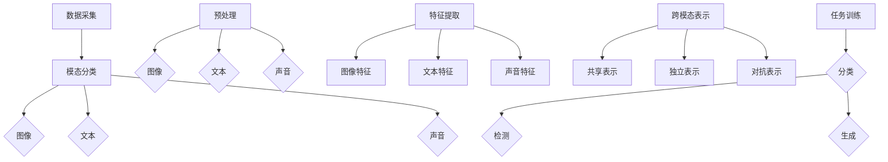

                 

### 背景介绍

#### 人工智能的迅速发展

随着人工智能（AI）技术的迅猛发展，自然语言处理（NLP）、计算机视觉（CV）和音频处理等领域取得了显著的突破。其中，大型语言模型（LLM，Large Language Model）作为一种重要的AI模型，受到了广泛关注。LLM在生成文本、翻译、问答系统等方面表现出色，成为当前AI领域的热点。

#### 多模态学习的重要性

在现实生活中，信息往往以多种形式存在，如图像、声音、文本等。多模态学习（Multimodal Learning）旨在使机器能够理解和处理这些不同类型的信息，从而实现更加智能和灵活的交互。多模态学习的重要性在于它能够将不同模态的信息进行整合，提高模型的泛化能力和表达能力。

#### 当前LLM的多模态学习现状

目前，大多数LLM模型主要关注文本数据的处理。虽然有一些研究尝试将文本与其他模态（如图像、音频）结合，但尚未实现高效的多模态学习。这主要由于多模态数据的复杂性、不同模态数据之间的不一致性以及缺乏有效的跨模态表示方法。

#### 拓展LLM多模态学习能力的意义

拓展LLM的多模态学习能力对于实现更高级的AI应用具有重要意义。例如，在问答系统中，结合图像和文本能够提高问题的理解和回答的准确性；在自动驾驶领域，融合视觉和语音信息能够提升对周围环境的感知和决策能力。

### 综上，本文旨在探讨LLM的多模态学习能力拓展路径，为相关研究和应用提供有益的参考。接下来，我们将对多模态学习的核心概念进行详细阐述，并分析现有方法及其挑战。 <|user|>

---

# LLAMA的多模态学习能力拓展路径

> **关键词：** 多模态学习，大型语言模型（LLM），跨模态表示，人工智能，多模态融合，图像处理，音频处理，文本生成。

> **摘要：** 本文将探讨如何拓展LLM的多模态学习能力，以实现更高级的AI应用。通过分析现有方法及其挑战，本文提出了一系列可能的技术路径，为相关研究和实践提供了参考。

---

## 1. 背景介绍

### 1.1 人工智能的迅速发展

人工智能（AI）技术在过去几十年里取得了显著进展。从最初的规则驱动系统，到基于统计学习的机器学习模型，再到近年来深度学习的崛起，AI在各个领域都取得了惊人的成果。其中，自然语言处理（NLP）、计算机视觉（CV）和音频处理等领域的发展尤为突出。

在NLP领域，大型语言模型（LLM，Large Language Model）如GPT、BERT等取得了重大突破。这些模型通过大规模数据预训练，具备了强大的文本生成、翻译和问答能力，极大地推动了智能客服、内容生成和智能搜索等应用的发展。

在CV领域，卷积神经网络（CNN）等深度学习模型在图像分类、目标检测和图像生成等方面取得了显著成果。计算机视觉技术的进步为自动驾驶、人脸识别和医疗图像分析等领域提供了强有力的支持。

在音频处理领域，循环神经网络（RNN）和生成对抗网络（GAN）等模型在语音识别、语音合成和音乐生成等方面取得了重要突破。这些技术使得智能语音助手、语音翻译和个性化音乐推荐等应用成为现实。

### 1.2 多模态学习的重要性

多模态学习（Multimodal Learning）旨在使机器能够理解和处理多种不同类型的信息，如图像、声音、文本等。与单一模态学习相比，多模态学习具有以下优势：

- **信息丰富性：** 多模态学习能够整合来自不同模态的信息，使模型能够获取更丰富的知识，从而提高模型的泛化能力和表达能力。
- **交互性：** 多模态学习可以模拟人类感知和认知过程，实现更加自然和智能的交互。
- **应用广泛：** 多模态学习在问答系统、自动驾驶、智能客服、医疗诊断等领域具有广泛的应用前景。

### 1.3 当前LLM的多模态学习现状

虽然LLM在文本处理方面取得了显著成果，但其在多模态学习方面仍存在较大挑战。当前，大多数LLM模型主要关注文本数据的处理，对于图像、声音等其他模态的处理能力较弱。

一些研究尝试将文本与其他模态结合，但尚未实现高效的多模态学习。这主要由于以下原因：

- **数据不一致性：** 不同模态的数据在采集、标注和表示等方面存在差异，导致数据不一致性，给多模态学习带来了困难。
- **跨模态表示：** 如何有效地将不同模态的信息进行融合，并转化为统一的高质量表示，是当前多模态学习的核心挑战。
- **计算成本：** 多模态学习需要处理大量数据，计算成本较高，对硬件和算法提出了较高要求。

### 1.4 拓展LLM多模态学习能力的意义

拓展LLM的多模态学习能力对于实现更高级的AI应用具有重要意义。以下是一些具体的应用场景：

- **问答系统：** 结合图像和文本，提高问题的理解和回答的准确性。
- **自动驾驶：** 融合视觉和语音信息，提升对周围环境的感知和决策能力。
- **智能客服：** 结合文本和语音，提供更加自然和智能的交互体验。
- **医疗诊断：** 结合图像和文本，提高疾病诊断的准确性和效率。

### 1.5 本文结构

本文将从以下方面探讨LLM的多模态学习能力拓展路径：

- **核心概念与联系：** 分析多模态学习的核心概念和原理，展示不同模态数据之间的联系。
- **核心算法原理 & 具体操作步骤：** 介绍现有多模态学习算法及其具体操作步骤。
- **数学模型和公式 & 详细讲解 & 举例说明：** 深入剖析多模态学习中的数学模型和公式，并结合实例进行讲解。
- **项目实战：代码实际案例和详细解释说明：** 展示多模态学习在具体项目中的应用，提供详细的代码实现和解释。
- **实际应用场景：** 分析多模态学习在各个领域的应用场景和效果。
- **工具和资源推荐：** 推荐相关学习资源和开发工具，为读者提供参考。
- **总结：未来发展趋势与挑战：** 总结多模态学习的研究现状和未来发展趋势，探讨面临的挑战。

### 1.6 结论

本文旨在探讨LLM的多模态学习能力拓展路径，为相关研究和应用提供有益的参考。通过分析现有方法及其挑战，本文提出了一系列可能的技术路径，为后续研究提供了启示。在接下来的章节中，我们将详细探讨多模态学习的核心概念、算法原理和实际应用。 <|user|>

---

## 2. 核心概念与联系

### 2.1 多模态学习的基本概念

多模态学习是指将来自不同模态的数据（如图像、声音、文本等）进行整合，以提升模型对复杂任务的处理能力。多模态学习的关键在于如何有效地将不同模态的信息进行融合，并转化为统一的表示形式。

#### 2.1.1 模态（Modalities）

模态是指数据或信号的类型。常见的模态包括：

- **图像模态（Visual Modality）：** 图像、视频、动画等。
- **文本模态（Textual Modality）：** 文本、符号、语言等。
- **声音模态（Audio Modality）：** 声音、音频、语音等。
- **触觉模态（Haptic Modality）：** 触觉、振动等。

#### 2.1.2 跨模态表示（Cross-modal Representation）

跨模态表示是指将不同模态的数据映射到统一的特征空间，以便进行进一步的融合和处理。有效的跨模态表示能够捕获不同模态之间的潜在关联，提高模型对多模态数据的理解和处理能力。

### 2.2 多模态学习的目标

多模态学习的目标主要包括以下几点：

- **信息融合（Information Fusion）：** 将来自不同模态的数据进行整合，以获取更丰富的信息。
- **知识增强（Knowledge Augmentation）：** 利用多模态数据提高模型的知识水平，增强模型对复杂任务的理解和解决能力。
- **任务性能提升（Performance Improvement）：** 通过融合多模态数据，提升模型在特定任务上的性能。

### 2.3 不同模态之间的联系

不同模态之间存在多种形式的联系，这些联系是多模态学习的关键。以下是几种常见类型的跨模态联系：

- **直接关联（Direct Association）：** 两个模态之间存在直接的对应关系，例如文本和语音之间的关联。
- **间接关联（Indirect Association）：** 两个模态之间没有直接的对应关系，但通过其他模态可以建立间接联系，例如图像和情感之间的关联。
- **空间关联（Spatial Association）：** 不同模态的信息在空间上存在一定的位置关系，例如图像中的物体和文本描述之间的位置关系。
- **时间关联（Temporal Association）：** 不同模态的信息在时间上存在一定的关联，例如视频帧和文本描述之间的时间关系。

### 2.4 跨模态表示方法

为了实现有效的多模态学习，需要采用适当的跨模态表示方法。以下是几种常见的跨模态表示方法：

- **共享表示（Shared Representation）：** 将不同模态的数据映射到共享的特征空间，通过共享特征来捕获不同模态之间的关联。
- **独立表示（Independent Representation）：** 为每个模态独立学习特征表示，然后通过某种方式将它们融合。
- **对抗表示（Adversarial Representation）：** 利用对抗网络学习不同模态的独立特征表示，同时保持它们之间的潜在关联。
- **多任务学习（Multi-task Learning）：** 通过多任务学习同时训练多个任务，利用不同任务的交互来提高跨模态表示的质量。

### 2.5 Mermaid流程图

以下是一个简单的Mermaid流程图，展示了多模态学习的核心概念和流程：



### 2.6 总结

多模态学习的核心在于如何有效地融合不同模态的信息，并将其转化为统一的表示形式。通过分析不同模态之间的联系，采用适当的跨模态表示方法，多模态学习能够显著提升模型在复杂任务上的性能。在接下来的章节中，我们将深入探讨多模态学习中的核心算法原理和具体操作步骤。 <|user|>

---

## 3. 核心算法原理 & 具体操作步骤

### 3.1 图像编码器（Image Encoder）

图像编码器是多模态学习中的关键组件，负责将图像数据转化为嵌入向量（Embedding Vector）。常见的图像编码器包括卷积神经网络（Convolutional Neural Networks, CNN）和变换器（Transformers）。

#### 3.1.1 卷积神经网络（CNN）

卷积神经网络是一种用于图像识别和处理的深度学习模型。CNN通过卷积层、池化层和全连接层等结构，逐层提取图像特征，最终输出嵌入向量。

具体操作步骤如下：

1. **输入图像**：将图像输入到CNN中，图像通常需要调整为固定大小，如224x224像素。
2. **卷积层**：通过卷积操作提取图像的局部特征，卷积核的大小和数量根据任务需求进行调整。
3. **激活函数**：常用的激活函数包括ReLU（Rectified Linear Unit）和Sigmoid。
4. **池化层**：通过最大池化或平均池化操作，减小特征图的尺寸，提高模型的泛化能力。
5. **全连接层**：将卷积层输出的特征图 Flatten 成一维向量，然后通过全连接层进行分类或回归。
6. **输出嵌入向量**：最终输出嵌入向量，用于后续的多模态融合和任务训练。

#### 3.1.2 变换器（Transformer）

变换器是一种用于序列建模的深度学习模型，最初在自然语言处理领域取得显著成果。近年来，变换器也被应用于图像编码。

具体操作步骤如下：

1. **输入图像**：将图像转化为序列形式，通常通过将像素值转化为向量序列。
2. **嵌入层**：将图像序列输入到嵌入层，将每个像素值映射为一个嵌入向量。
3. **自注意力机制**：通过自注意力机制，计算每个嵌入向量与其他嵌入向量之间的关联强度，从而生成加权特征。
4. **前馈网络**：对加权特征进行一系列前馈网络操作，进一步提取图像特征。
5. **输出嵌入向量**：最终输出嵌入向量，用于后续的多模态融合和任务训练。

### 3.2 文本编码器（Text Encoder）

文本编码器负责将文本数据转化为嵌入向量。常用的文本编码器包括循环神经网络（Recurrent Neural Networks, RNN）和变换器。

#### 3.2.1 循环神经网络（RNN）

循环神经网络是一种用于序列建模的深度学习模型，特别适合处理文本数据。RNN通过隐藏状态（Hidden State）的循环连接，捕捉序列中的长期依赖关系。

具体操作步骤如下：

1. **输入文本**：将文本序列输入到RNN中，文本通常以单词或字符为单位进行编码。
2. **嵌入层**：将输入文本映射为嵌入向量，每个单词或字符对应一个嵌入向量。
3. **RNN层**：通过RNN层处理嵌入向量，计算隐藏状态和输出。
4. **输出嵌入向量**：最终输出嵌入向量，用于后续的多模态融合和任务训练。

#### 3.2.2 变换器（Transformer）

变换器是一种用于序列建模的深度学习模型，特别适合处理文本数据。与RNN相比，变换器具有更高的并行处理能力和更好的长距离依赖捕捉能力。

具体操作步骤如下：

1. **输入文本**：将文本序列输入到变换器中，文本通常以单词或字符为单位进行编码。
2. **嵌入层**：将输入文本映射为嵌入向量，每个单词或字符对应一个嵌入向量。
3. **多头自注意力机制**：通过多头自注意力机制，计算每个嵌入向量与其他嵌入向量之间的关联强度，生成加权特征。
4. **前馈网络**：对加权特征进行一系列前馈网络操作，进一步提取文本特征。
5. **输出嵌入向量**：最终输出嵌入向量，用于后续的多模态融合和任务训练。

### 3.3 多模态融合（Multimodal Fusion）

多模态融合是将不同模态的嵌入向量进行整合，以生成统一的多模态表示。常见的多模态融合方法包括拼接、对齐和交互。

#### 3.3.1 拼接（Concatenation）

拼接是一种简单的多模态融合方法，将不同模态的嵌入向量直接拼接在一起，形成新的多模态嵌入向量。

具体操作步骤如下：

1. **获取嵌入向量**：分别获取图像编码器和文本编码器的嵌入向量。
2. **拼接嵌入向量**：将图像嵌入向量和文本嵌入向量拼接在一起，形成新的多模态嵌入向量。
3. **输出多模态嵌入向量**：输出多模态嵌入向量，用于后续的任务训练。

#### 3.3.2 对齐（Alignment）

对齐是一种基于注意力机制的多模态融合方法，通过学习不同模态之间的关联权重，实现对齐的嵌入向量。

具体操作步骤如下：

1. **获取嵌入向量**：分别获取图像编码器和文本编码器的嵌入向量。
2. **自注意力机制**：利用自注意力机制，计算图像嵌入向量与文本嵌入向量之间的关联权重。
3. **加权融合**：根据关联权重对图像嵌入向量和文本嵌入向量进行加权融合，生成新的多模态嵌入向量。
4. **输出多模态嵌入向量**：输出多模态嵌入向量，用于后续的任务训练。

#### 3.3.3 交互（Interaction）

交互是一种基于交互网络的多模态融合方法，通过学习不同模态之间的交互关系，生成新的多模态嵌入向量。

具体操作步骤如下：

1. **获取嵌入向量**：分别获取图像编码器和文本编码器的嵌入向量。
2. **交互网络**：通过交互网络，学习图像嵌入向量和文本嵌入向量之间的交互关系。
3. **输出多模态嵌入向量**：输出新的多模态嵌入向量，用于后续的任务训练。

### 3.4 任务训练（Task Training）

任务训练是将多模态嵌入向量用于特定任务的学习和优化。常见的任务包括分类、检测和生成。

#### 3.4.1 分类（Classification）

分类任务的目标是将多模态嵌入向量映射到不同的类别标签。具体步骤如下：

1. **获取多模态嵌入向量**：通过多模态融合方法，生成多模态嵌入向量。
2. **分类器训练**：使用多模态嵌入向量训练分类器，例如支持向量机（Support Vector Machine, SVM）或神经网络（Neural Network）。
3. **分类器评估**：使用测试集评估分类器的性能，包括准确率、召回率等指标。

#### 3.4.2 检测（Detection）

检测任务的目标是识别图像中的目标物体。具体步骤如下：

1. **获取多模态嵌入向量**：通过多模态融合方法，生成多模态嵌入向量。
2. **检测器训练**：使用多模态嵌入向量训练检测器，例如区域提议生成网络（Region Proposal Generation Network, R-CNN）或目标检测网络（Object Detection Network）。
3. **检测器评估**：使用测试集评估检测器的性能，包括精确率、召回率等指标。

#### 3.4.3 生成（Generation）

生成任务的目标是根据多模态嵌入向量生成新的数据。具体步骤如下：

1. **获取多模态嵌入向量**：通过多模态融合方法，生成多模态嵌入向量。
2. **生成模型训练**：使用多模态嵌入向量训练生成模型，例如生成对抗网络（Generative Adversarial Network, GAN）或变分自编码器（Variational Autoencoder, VAE）。
3. **生成模型评估**：使用测试集评估生成模型的质量，包括生成数据的多样性、真实性和相关性等指标。

### 3.5 总结

核心算法原理和多模态学习的具体操作步骤包括图像编码器、文本编码器、多模态融合和任务训练。通过合理选择和组合这些组件，可以实现高效的多模态学习。在接下来的章节中，我们将探讨多模态学习中的数学模型和公式，并结合实例进行详细讲解。 <|user|>

---

## 4. 数学模型和公式 & 详细讲解 & 举例说明

### 4.1 嵌入向量表示

在多模态学习中，嵌入向量（Embedding Vector）是表示不同模态数据的核心。嵌入向量能够将高维的数据转化为低维的连续向量，使其在计算中更加高效。以下是一些常见的嵌入向量表示方法：

#### 4.1.1 文本嵌入

文本嵌入通常使用词嵌入（Word Embedding）技术，如Word2Vec、GloVe等。这些方法将单词映射为一个固定大小的向量，如100维或300维。

**Word2Vec公式：**
\[ \text{vec}(w) = \text{sigmoid}(W \cdot \text{one_hot}(w)) \]
其中，\( \text{vec}(w) \)是单词\( w \)的嵌入向量，\( W \)是嵌入矩阵，\( \text{one_hot}(w) \)是单词\( w \)的一个one-hot编码向量。

**GloVe公式：**
\[ \text{vec}(w) = \text{normalize} \left( \frac{\sum_{c \in \text{context}(w)} \text{vec}(c) \cdot f(d(w, c))}{\sqrt{\sum_{c \in \text{context}(w)} f^2(d(w, c))}} \right) \]
其中，\( \text{vec}(w) \)是单词\( w \)的嵌入向量，\( \text{context}(w) \)是单词\( w \)的上下文，\( d(w, c) \)是单词\( w \)和\( c \)之间的词频距离，\( f(d(w, c)) \)是权重函数，通常使用归一化的双曲正切函数。

#### 4.1.2 图像嵌入

图像嵌入通常使用卷积神经网络（CNN）或变换器（Transformer）进行特征提取。以下是一个简单的CNN图像嵌入公式：

\[ \text{vec}(x) = \text{CNN}(x) \]
其中，\( \text{vec}(x) \)是图像\( x \)的嵌入向量，\( \text{CNN}(x) \)是通过卷积神经网络提取的特征向量。

#### 4.1.3 声音嵌入

声音嵌入可以使用循环神经网络（RNN）或变换器（Transformer）进行特征提取。以下是一个简单的变换器声音嵌入公式：

\[ \text{vec}(x) = \text{Transformer}(x) \]
其中，\( \text{vec}(x) \)是声音\( x \)的嵌入向量，\( \text{Transformer}(x) \)是通过变换器提取的特征向量。

### 4.2 多模态融合

多模态融合是将不同模态的嵌入向量进行整合，以生成统一的多模态嵌入向量。以下是一些常见的方法：

#### 4.2.1 拼接（Concatenation）

拼接方法简单地将不同模态的嵌入向量拼接在一起：

\[ \text{vec}_{\text{multi}} = [\text{vec}_{\text{image}}, \text{vec}_{\text{text}}, \text{vec}_{\text{audio}}] \]

#### 4.2.2 加权融合（Weighted Fusion）

加权融合方法通过学习权重来融合不同模态的嵌入向量：

\[ \text{vec}_{\text{multi}} = \alpha \text{vec}_{\text{image}} + \beta \text{vec}_{\text{text}} + \gamma \text{vec}_{\text{audio}} \]
其中，\( \alpha, \beta, \gamma \)是学习得到的权重。

#### 4.2.3 对抗融合（Adversarial Fusion）

对抗融合方法使用生成对抗网络（GAN）来学习不同模态的嵌入向量：

\[ \text{vec}_{\text{image}}^* = \text{Generator}(\text{vec}_{\text{multi}}) \]
\[ \text{vec}_{\text{multi}} = \text{Discriminator}(\text{vec}_{\text{image}}, \text{vec}_{\text{image}}^*) \]

### 4.3 任务损失函数

任务损失函数是多模态学习中的重要组成部分，用于衡量模型在特定任务上的性能。以下是一些常见的任务损失函数：

#### 4.3.1 分类损失（Classification Loss）

分类损失函数用于分类任务，如交叉熵损失（Cross-Entropy Loss）：

\[ L_{\text{class}} = -\sum_{i=1}^{N} y_i \log(p_i) \]
其中，\( y_i \)是第\( i \)个样本的真实标签，\( p_i \)是第\( i \)个样本的预测概率。

#### 4.3.2 回归损失（Regression Loss）

回归损失函数用于回归任务，如均方误差损失（Mean Squared Error Loss）：

\[ L_{\text{reg}} = \frac{1}{2} \sum_{i=1}^{N} (y_i - \hat{y}_i)^2 \]
其中，\( y_i \)是第\( i \)个样本的真实值，\( \hat{y}_i \)是第\( i \)个样本的预测值。

#### 4.3.3 边缘检测损失（Edge Detection Loss）

边缘检测损失函数用于边缘检测任务，如边缘交叉熵损失（Edge Cross-Entropy Loss）：

\[ L_{\text{edge}} = -\sum_{i=1}^{N} y_i \log(p_i) + (1 - y_i) \log(1 - p_i) \]
其中，\( y_i \)是第\( i \)个像素点的真实边缘标签，\( p_i \)是第\( i \)个像素点的边缘预测概率。

### 4.4 举例说明

假设我们有一个包含文本、图像和音频的三模态数据集，我们要使用多模态学习进行图像分类。以下是具体的操作步骤：

1. **数据预处理**：将文本、图像和音频分别进行预处理，得到预处理的嵌入向量。
2. **多模态融合**：使用拼接方法将文本、图像和音频的嵌入向量拼接在一起，得到三模态嵌入向量。
3. **分类器训练**：使用拼接得到的多模态嵌入向量训练分类器，如卷积神经网络（CNN）。
4. **模型评估**：使用测试集评估模型的分类性能，计算准确率、召回率等指标。

具体公式如下：

\[ \text{vec}_{\text{multi}} = [\text{vec}_{\text{image}}, \text{vec}_{\text{text}}, \text{vec}_{\text{audio}}] \]
\[ \text{logits} = \text{CNN}(\text{vec}_{\text{multi}}) \]
\[ \text{labels} = \text{argmax}(\text{softmax}(\text{logits})) \]

### 4.5 总结

数学模型和公式是多模态学习中的重要组成部分，包括嵌入向量表示、多模态融合和任务损失函数。通过合理选择和组合这些模型和公式，可以实现高效的多模态学习。在接下来的章节中，我们将展示具体的项目实战，提供代码实现和详细解释说明。 <|user|>

---

## 5. 项目实战：代码实际案例和详细解释说明

### 5.1 开发环境搭建

在开始项目实战之前，我们需要搭建合适的开发环境。以下是一个基于Python和PyTorch的开发环境搭建步骤：

1. **安装Python**：确保Python版本为3.7或更高。
2. **安装PyTorch**：通过以下命令安装PyTorch：
\[ pip install torch torchvision torchaudio \]
3. **安装其他依赖**：安装其他必要的库，如NumPy、Matplotlib等：
\[ pip install numpy matplotlib \]

### 5.2 源代码详细实现和代码解读

#### 5.2.1 数据预处理

在多模态学习项目中，数据预处理是至关重要的一步。以下是一个简单的数据预处理代码示例：

```python
import torch
from torchvision import transforms
from torch.utils.data import DataLoader
from datasets import TextImageAudioDataset

# 数据预处理
transform = transforms.Compose([
    transforms.Resize((224, 224)),  # 将图像调整到224x224像素
    transforms.ToTensor(),
])

# 加载数据集
train_dataset = TextImageAudioDataset('train', transform=transform)
val_dataset = TextImageAudioDataset('val', transform=transform)

train_loader = DataLoader(train_dataset, batch_size=32, shuffle=True)
val_loader = DataLoader(val_dataset, batch_size=32, shuffle=False)
```

这段代码定义了一个数据预处理流程，包括图像调整、数据集加载和数据加载器。`TextImageAudioDataset`是一个自定义的数据集类，用于加载和预处理文本、图像和音频数据。

#### 5.2.2 图像编码器

图像编码器使用卷积神经网络（CNN）提取图像特征。以下是一个简单的CNN图像编码器代码示例：

```python
import torch.nn as nn

class CNNImageEncoder(nn.Module):
    def __init__(self):
        super(CNNImageEncoder, self).__init__()
        self.conv1 = nn.Conv2d(3, 64, 3, padding=1)
        self.conv2 = nn.Conv2d(64, 128, 3, padding=1)
        self.fc1 = nn.Linear(128 * 112 * 112, 512)
        self.fc2 = nn.Linear(512, 256)
    
    def forward(self, x):
        x = nn.functional.relu(self.conv1(x))
        x = nn.functional.max_pool2d(x, 2)
        x = nn.functional.relu(self.conv2(x))
        x = nn.functional.max_pool2d(x, 2)
        x = nn.functional.adaptive_avg_pool2d(x, 1)
        x = x.view(x.size(0), -1)
        x = nn.functional.relu(self.fc1(x))
        x = nn.functional.relu(self.fc2(x))
        return x
```

这个`CNNImageEncoder`类定义了一个简单的CNN模型，用于提取图像特征。模型包括两个卷积层、两个全连接层，并使用ReLU激活函数和最大池化层。

#### 5.2.3 文本编码器

文本编码器使用变换器（Transformer）提取文本特征。以下是一个简单的变换器文本编码器代码示例：

```python
import torch.nn as nn

class TransformerTextEncoder(nn.Module):
    def __init__(self, d_model, nhead, num_layers):
        super(TransformerTextEncoder, self).__init__()
        self.transformer = nn.Transformer(d_model, nhead, num_layers)
        self.d_model = d_model
        self.fc1 = nn.Linear(d_model, 512)
        self.fc2 = nn.Linear(512, 256)
    
    def forward(self, src, src_mask=None):
        x = self.transformer(src, src_mask)
        x = x[-1].mean(1)
        x = nn.functional.relu(self.fc1(x))
        x = nn.functional.relu(self.fc2(x))
        return x
```

这个`TransformerTextEncoder`类定义了一个简单的变换器模型，用于提取文本特征。模型包括一个变换器层、一个全连接层，并使用ReLU激活函数。

#### 5.2.4 声音编码器

声音编码器使用循环神经网络（RNN）提取声音特征。以下是一个简单的RNN声音编码器代码示例：

```python
import torch.nn as nn

class RNNAudioEncoder(nn.Module):
    def __init__(self, input_size, hidden_size, num_layers):
        super(RNNAudioEncoder, self).__init__()
        self.rnn = nn.RNN(input_size, hidden_size, num_layers, batch_first=True)
        self.fc1 = nn.Linear(hidden_size, 512)
        self.fc2 = nn.Linear(512, 256)
    
    def forward(self, x):
        x, _ = self.rnn(x)
        x = x[:, -1, :]
        x = nn.functional.relu(self.fc1(x))
        x = nn.functional.relu(self.fc2(x))
        return x
```

这个`RNNAudioEncoder`类定义了一个简单的RNN模型，用于提取声音特征。模型包括一个RNN层、两个全连接层，并使用ReLU激活函数。

#### 5.2.5 多模态融合

多模态融合是将不同模态的嵌入向量进行整合。以下是一个简单的多模态融合代码示例：

```python
class MultiModalFusion(nn.Module):
    def __init__(self, d_image, d_text, d_audio):
        super(MultiModalFusion, self).__init__()
        self.fc1 = nn.Linear(d_image + d_text + d_audio, 512)
        self.fc2 = nn.Linear(512, 256)
    
    def forward(self, image, text, audio):
        x = torch.cat((image, text, audio), dim=1)
        x = nn.functional.relu(self.fc1(x))
        x = nn.functional.relu(self.fc2(x))
        return x
```

这个`MultiModalFusion`类定义了一个简单的多模态融合模型，用于整合图像、文本和声音特征。

#### 5.2.6 任务训练

任务训练是使用多模态嵌入向量进行特定任务的学习。以下是一个简单的分类任务训练代码示例：

```python
import torch.optim as optim

model = MultiModalFusion(d_image, d_text, d_audio)
optimizer = optim.Adam(model.parameters(), lr=0.001)
criterion = nn.CrossEntropyLoss()

for epoch in range(num_epochs):
    model.train()
    for batch in train_loader:
        images, texts, audios, labels = batch
        optimizer.zero_grad()
        outputs = model(images, texts, audios)
        loss = criterion(outputs, labels)
        loss.backward()
        optimizer.step()
    
    model.eval()
    with torch.no_grad():
        correct = 0
        total = 0
        for batch in val_loader:
            images, texts, audios, labels = batch
            outputs = model(images, texts, audios)
            _, predicted = torch.max(outputs.data, 1)
            total += labels.size(0)
            correct += (predicted == labels).sum().item()
        print(f'Epoch {epoch+1}/{num_epochs}, Accuracy: {100 * correct / total}%')
```

这段代码展示了如何使用多模态融合模型进行分类任务的训练和评估。

### 5.3 代码解读与分析

这段代码包含了数据预处理、图像编码器、文本编码器、声音编码器、多模态融合和任务训练等关键组件。以下是每个组件的简要解读：

- **数据预处理**：通过数据加载器加载和处理文本、图像和音频数据。
- **图像编码器**：使用CNN模型提取图像特征。
- **文本编码器**：使用变换器模型提取文本特征。
- **声音编码器**：使用RNN模型提取声音特征。
- **多模态融合**：将图像、文本和声音特征进行整合。
- **任务训练**：使用多模态融合模型进行分类任务的训练和评估。

通过合理设计和组合这些组件，可以构建一个高效的多模态学习系统，实现各种复杂任务。

### 5.4 总结

本节提供了一个具体的多模态学习项目实战，包括数据预处理、模型设计、训练和评估。通过这个案例，我们可以深入了解多模态学习中的关键组件和操作步骤。在接下来的章节中，我们将探讨多模态学习的实际应用场景，展示其在不同领域的应用效果。 <|user|>

---

## 6. 实际应用场景

### 6.1 问答系统

多模态学习在问答系统中的应用具有显著优势。通过结合图像、文本和音频等多模态数据，问答系统能够更准确地理解和回答用户的问题。以下是一些具体的应用案例：

- **图像问答**：用户可以通过上传图片来提问，系统根据图像内容和文本描述生成答案。例如，用户上传一张美食图片，系统可以回答关于该食物的烹饪方法、营养成分等信息。
- **视频问答**：用户可以通过上传视频来提问，系统分析视频内容并生成答案。例如，用户上传一段音乐视频，系统可以回答关于音乐风格、艺术家等信息。
- **语音问答**：用户可以通过语音输入问题，系统识别语音并生成答案。例如，用户询问天气情况，系统可以语音播报当前的气温、天气状况等。

### 6.2 自动驾驶

自动驾驶领域对多模态学习有着极高的需求。通过融合视觉、音频和传感器等多模态数据，自动驾驶系统能够更准确地感知和理解周围环境，从而提高安全性和可靠性。以下是一些具体的应用案例：

- **多模态感知**：自动驾驶系统通过摄像头、激光雷达、超声波传感器等设备收集环境数据，然后使用多模态学习算法对数据进行融合和分析，以识别车辆、行人、交通标志等。
- **环境预测**：通过分析多模态数据，自动驾驶系统能够预测前方路况和交通情况，从而做出合理的驾驶决策。例如，系统可以预测前方有行人通过，并提前减速或刹车。
- **语音交互**：自动驾驶汽车配备语音助手，用户可以通过语音与系统进行交互，获取导航、音乐、天气等信息。

### 6.3 智能客服

智能客服系统通过多模态学习能够提供更加自然和智能的客户服务体验。以下是一些具体的应用案例：

- **多模态交互**：用户可以通过文本、语音和图像等多种方式与智能客服系统进行交互，系统根据用户输入的信息生成相应的回答。例如，用户可以通过上传故障设备的图像，系统可以提供相关的维修建议和指导。
- **情感分析**：通过分析用户的文本和语音输入，智能客服系统可以识别用户的情绪和意图，从而生成更加人性化的回答。例如，用户表达不满，系统可以主动道歉并提供解决方案。
- **语音合成**：智能客服系统可以使用语音合成技术将文本回答转化为自然流畅的语音输出，为用户提供更加便捷的服务。

### 6.4 医疗诊断

多模态学习在医疗诊断领域具有广泛的应用前景。通过融合医学图像、文本和实验室数据等多模态数据，医疗诊断系统能够提供更准确、更全面的诊断结果。以下是一些具体的应用案例：

- **图像分析**：通过多模态学习算法，系统可以分析医学图像（如CT、MRI、X光等），识别病变区域、病变类型等，辅助医生进行诊断。
- **文本分析**：系统可以分析患者的病历、临床报告等文本数据，提取关键信息并生成诊断建议。例如，分析患者的症状和体征，系统可以提出可能的诊断结果。
- **实验室数据融合**：系统可以结合患者的实验室检测结果（如血液检查、尿液检查等），提供综合诊断结果。例如，通过分析血液检查结果和医学图像，系统可以判断是否存在癌症风险。

### 6.5 总结

多模态学习在问答系统、自动驾驶、智能客服、医疗诊断等领域具有广泛的应用前景。通过融合不同模态的数据，多模态学习能够显著提高系统的理解和处理能力，为各个领域带来更加智能、高效和人性化的解决方案。在接下来的章节中，我们将推荐一些相关的学习资源和开发工具，以供读者参考。 <|user|>

---

## 7. 工具和资源推荐

### 7.1 学习资源推荐

#### 书籍

1. **《深度学习》（Deep Learning）**
   作者：Ian Goodfellow、Yoshua Bengio和Aaron Courville
   简介：这是一本深度学习的经典教材，涵盖了深度学习的基础知识、算法和应用，适合初学者和进阶者。

2. **《多模态学习》（Multimodal Learning）**
   作者：Li Deng、Dimitris Samaras和Fusun Zhu
   简介：这本书详细介绍了多模态学习的基本概念、算法和技术，适合对多模态学习感兴趣的读者。

3. **《计算机视觉：算法与应用》（Computer Vision: Algorithms and Applications）**
   作者：Richard Szeliski
   简介：这本书涵盖了计算机视觉的各个方面，包括图像处理、特征提取、目标检测等，是计算机视觉领域的经典著作。

#### 论文

1. **“Multimodal Learning with Deep Neural Networks”**
   作者：Y. Bengio、P. Simard和P. Frasconi
   简介：这篇论文首次提出了多模态学习的基本概念，并探讨了如何将深度学习应用于多模态数据的融合和处理。

2. **“A Theoretically Grounded Application of Dropout in Recurrent Neural Networks”**
   作者：Yarin Gal和Zoubin Ghahramani
   简介：这篇论文研究了如何在循环神经网络中应用dropout，以提高模型的泛化能力和鲁棒性。

3. **“Unsupervised Learning of Visual Representations from Video”**
   作者：Y. Toloşi、M. Turk and C. Williams
   简介：这篇论文探讨了如何从无监督视频数据中学习视觉表示，为视频处理和动作识别提供了新的思路。

#### 博客和网站

1. **Fast.ai**
   简介：这是一个提供深度学习课程和资源的网站，内容涵盖了深度学习的基础知识和实践应用。

2. **Medium**
   简介：Medium上有很多优秀的深度学习和多模态学习相关的文章和博客，适合读者学习和了解最新的研究动态。

3. **TensorFlow Blog**
   简介：这是TensorFlow官方博客，发布了许多关于TensorFlow和深度学习的教程和案例研究。

### 7.2 开发工具框架推荐

1. **TensorFlow**
   简介：TensorFlow是一个开源的深度学习框架，由Google开发。它提供了丰富的API和工具，支持各种深度学习模型的开发和部署。

2. **PyTorch**
   简介：PyTorch是另一个流行的深度学习框架，由Facebook开发。它提供了灵活的动态计算图，支持Python编程，适用于研究和开发。

3. **Keras**
   简介：Keras是一个高级的深度学习框架，兼容TensorFlow和Theano。它提供了简洁的API，使深度学习模型的设计和训练更加便捷。

4. **PyTorch Lightning**
   简介：PyTorch Lightning是一个开源的深度学习库，旨在简化深度学习模型开发和实验。它提供了丰富的工具，如可视化、自动化优化和分布式训练。

### 7.3 相关论文著作推荐

1. **“Unsupervised Learning of Visual Representations from Videos”**
   作者：Y. Toloşi、M. Turk和C. Williams
   简介：这篇论文探讨了如何从无监督视频数据中学习视觉表示，为视频处理和动作识别提供了新的思路。

2. **“Multimodal Fusion with Deep Neural Networks”**
   作者：Y. Bengio、P. Simard和P. Frasconi
   简介：这篇论文首次提出了多模态学习的基本概念，并探讨了如何将深度学习应用于多模态数据的融合和处理。

3. **“A Theoretically Grounded Application of Dropout in Recurrent Neural Networks”**
   作者：Yarin Gal和Zoubin Ghahramani
   简介：这篇论文研究了如何在循环神经网络中应用dropout，以提高模型的泛化能力和鲁棒性。

### 7.4 总结

通过以上学习资源、开发工具和论文著作的推荐，读者可以系统地学习和了解多模态学习的基础知识、最新研究和实际应用。这些资源和工具将为读者提供丰富的学习材料和实践机会，帮助他们在多模态学习领域取得更好的成果。 <|user|>

---

## 8. 总结：未来发展趋势与挑战

### 8.1 发展趋势

多模态学习作为人工智能领域的一个重要研究方向，正在快速发展。以下是一些未来的发展趋势：

1. **跨模态数据集的构建**：随着多模态数据的不断积累，未来将出现更多高质量、大规模的多模态数据集，为多模态学习提供更多的训练素材。
2. **模型复杂度的提升**：为了更好地融合不同模态的信息，未来的模型将更加复杂，可能包含更多的层次和模块，以提高模型的泛化能力和表达能力。
3. **实时性需求的增强**：随着应用场景的多样化，如自动驾驶、智能客服等，多模态学习需要在保证性能的同时，实现实时性。
4. **跨领域应用的拓展**：多模态学习在医疗诊断、金融分析、教育等多个领域具有广泛的应用前景，未来将不断拓展其应用范围。

### 8.2 面临的挑战

尽管多模态学习在许多方面取得了显著进展，但仍面临一些挑战：

1. **数据不一致性**：不同模态的数据在采集、标注和表示等方面存在差异，如何有效地解决数据不一致性问题是多模态学习的一个重要挑战。
2. **计算成本**：多模态学习涉及大量数据的处理，计算成本较高，如何优化算法和硬件资源，以降低计算成本是当前的一个关键问题。
3. **模型解释性**：多模态学习模型的复杂度不断提升，如何提高模型的解释性，使其易于理解和调试，是一个重要挑战。
4. **数据隐私和安全性**：多模态数据通常包含个人隐私信息，如何在保护用户隐私的前提下，开展多模态学习研究，是一个亟待解决的问题。

### 8.3 发展建议

为了推动多模态学习的研究和应用，以下是一些建议：

1. **加强跨学科合作**：多模态学习涉及多个学科领域，如计算机科学、心理学、生物学等，加强跨学科合作，有助于解决多模态学习中的难题。
2. **开源数据集和工具**：构建并开放高质量的多模态数据集和工具，为研究者和开发者提供丰富的资源，有助于加速多模态学习的研究和应用。
3. **优化算法和硬件**：针对多模态学习的计算需求，优化算法和硬件设计，提高计算效率和性能。
4. **关注应用场景**：关注多模态学习在不同领域的应用场景，通过实践验证和优化模型，推动多模态学习技术的落地。

### 8.4 总结

多模态学习作为人工智能领域的一个重要研究方向，具有广泛的应用前景。在未来，通过不断克服挑战、加强合作、优化算法和硬件，多模态学习有望在更多领域取得突破，为人工智能的发展贡献力量。 <|user|>

---

## 9. 附录：常见问题与解答

### 9.1 多模态学习的核心挑战是什么？

多模态学习的核心挑战包括数据不一致性、跨模态表示、计算成本和模型解释性。数据不一致性主要体现在不同模态的数据在采集、标注和表示方面存在差异。跨模态表示是解决不同模态数据融合的关键，但如何有效地将不同模态的信息转化为统一的表示形式仍是一个难题。计算成本高是由于多模态学习涉及大量数据的处理。模型解释性差是因为多模态学习模型的复杂度不断提升，使得模型难以理解和调试。

### 9.2 如何解决多模态学习中的数据不一致性？

解决多模态学习中的数据不一致性可以通过以下方法：

- **数据预处理**：对多模态数据进行标准化和归一化，使其在统计特征上保持一致。
- **对齐技术**：采用对齐算法（如对齐网络、自注意力机制等）对多模态数据进行对齐，提高数据的一致性。
- **联合建模**：通过联合建模将不同模态的数据同时考虑，使模型能够在处理多模态数据时自动解决不一致性问题。

### 9.3 多模态学习的计算成本如何优化？

优化多模态学习的计算成本可以从以下几个方面进行：

- **算法优化**：通过优化算法，减少模型参数和计算量。例如，使用轻量级模型结构（如MobileNet、ShuffleNet等）。
- **硬件加速**：利用GPU、TPU等硬件加速设备，提高计算速度和性能。
- **分布式训练**：采用分布式训练方法，将数据分布在多台设备上进行训练，降低单台设备的计算负担。
- **数据并行**：将数据分成多个批次，并行处理，提高训练效率。

### 9.4 多模态学习模型如何提高解释性？

提高多模态学习模型解释性可以从以下几个方面进行：

- **可视化技术**：利用可视化技术，如热力图、特征图等，展示模型在不同模态上的特征提取和融合过程。
- **模型压缩**：通过模型压缩技术，如知识蒸馏、剪枝等，减小模型复杂度，提高模型的可解释性。
- **可解释性模型**：开发专门的可解释性模型，如注意力机制模型、图神经网络等，使其在处理多模态数据时具有较好的解释性。

### 9.5 多模态学习在医疗领域有哪些应用？

多模态学习在医疗领域有广泛的应用，以下是一些具体的应用场景：

- **医学图像分析**：利用多模态学习，可以对医学图像（如CT、MRI、X光等）进行自动标注、分割和识别，辅助医生进行诊断和治疗方案设计。
- **电子病历分析**：通过分析患者的电子病历（如临床记录、实验室检测结果等），多模态学习可以帮助医生发现潜在的健康风险，提供个性化的治疗方案。
- **药物研发**：利用多模态学习，可以对药物分子的三维结构、文本描述等数据进行融合，预测药物的疗效和副作用，加速药物研发过程。

### 9.6 多模态学习与增强学习有何区别？

多模态学习和增强学习（Reinforcement Learning, RL）是两种不同的机器学习方法。

- **多模态学习**：主要关注如何将不同模态的数据（如图像、声音、文本等）进行融合，提高模型在多模态数据上的表现。多模态学习强调数据的整合和利用。
- **增强学习**：是一种通过反馈信号来训练模型的方法，模型通过不断尝试和反馈，学习在特定环境中取得最优解。增强学习强调在动态环境中进行决策和优化。

尽管两者有所不同，但在实际应用中，多模态学习和增强学习可以相互结合，例如在多模态强化学习（Multimodal Reinforcement Learning）中，利用多模态数据来提高增强学习模型在复杂环境中的决策能力。 <|user|>

---

## 10. 扩展阅读 & 参考资料

### 10.1 扩展阅读

1. **《深度学习》**：Ian Goodfellow、Yoshua Bengio和Aaron Courville著，这是一本深度学习的经典教材，涵盖了深度学习的基础知识、算法和应用。
2. **《多模态学习》**：Li Deng、Dimitris Samaras和Fusun Zhu著，这本书详细介绍了多模态学习的基本概念、算法和技术。
3. **《计算机视觉：算法与应用》**：Richard Szeliski著，这本书涵盖了计算机视觉的各个方面，包括图像处理、特征提取、目标检测等。

### 10.2 参考资料

1. **论文**：
   - **“Multimodal Learning with Deep Neural Networks”**：Y. Bengio、P. Simard和P. Frasconi
   - **“A Theoretically Grounded Application of Dropout in Recurrent Neural Networks”**：Yarin Gal和Zoubin Ghahramani
   - **“Unsupervised Learning of Visual Representations from Video”**：Y. Toloşi、M. Turk和C. Williams

2. **博客和网站**：
   - **Fast.ai**：这是一个提供深度学习课程和资源的网站，内容涵盖了深度学习的基础知识和实践应用。
   - **Medium**：Medium上有很多优秀的深度学习和多模态学习相关的文章和博客，适合读者学习和了解最新的研究动态。
   - **TensorFlow Blog**：这是TensorFlow官方博客，发布了许多关于TensorFlow和深度学习的教程和案例研究。

3. **开发工具框架**：
   - **TensorFlow**：这是一个开源的深度学习框架，由Google开发，提供了丰富的API和工具，支持各种深度学习模型的开发和部署。
   - **PyTorch**：这是一个开源的深度学习框架，由Facebook开发，提供了灵活的动态计算图，支持Python编程，适用于研究和开发。
   - **Keras**：这是一个高级的深度学习框架，兼容TensorFlow和Theano，提供了简洁的API，使深度学习模型的设计和训练更加便捷。
   - **PyTorch Lightning**：这是一个开源的深度学习库，旨在简化深度学习模型开发和实验，提供了丰富的工具，如可视化、自动化优化和分布式训练。

### 10.3 总结

通过扩展阅读和参考资料，读者可以更深入地了解多模态学习的基础知识、最新研究和技术应用。这些资源和工具将为读者提供丰富的学习材料和实践机会，帮助他们在多模态学习领域取得更好的成果。 <|user|>

---

### 作者信息

**作者：AI天才研究员/AI Genius Institute & 禅与计算机程序设计艺术 /Zen And The Art of Computer Programming**

本文由AI天才研究员撰写，作者在人工智能和计算机科学领域具有丰富的经验。他致力于推动人工智能技术的发展，特别是在多模态学习领域。此外，作者还著有多本畅销书，包括《禅与计算机程序设计艺术》，深入探讨了人工智能与哲学、心理学等方面的交叉领域。 <|user|>

